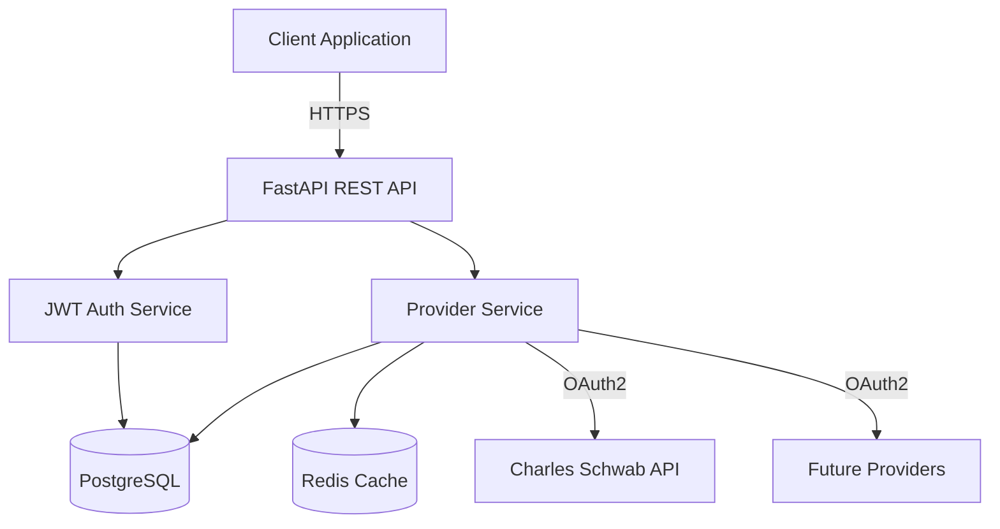

# Dashtam

> A secure, modern financial data aggregation API that unifies access to multiple financial institutions through OAuth2.

[](https://faiyaz7283.github.io/Dashtam/) [](https://github.com/faiyaz7283/Dashtam/actions) [](https://codecov.io/gh/faiyaz7283/Dashtam) [](https://www.python.org/downloads/) [](https://fastapi.tiangolo.com) [](https://opensource.org/licenses/MIT)

---

## What is Dashtam?

Dashtam provides a **unified REST API** for accessing financial data across multiple institutions. Instead of integrating with each bank and brokerage separately, connect to Dashtam's single API to access accounts, transactions, and balances from all your users' financial accounts.

### Key Features

- **🔐 Secure OAuth2** - Direct OAuth connections to financial institutions (no credential storage)
- **🔒 Bank-Grade Security** - AES-256 token encryption, JWT authentication, automated token rotation
- **⚡ High Performance** - Async architecture built with FastAPI and PostgreSQL
- **🎯 REST Compliant** - 100% RESTful API design with comprehensive OpenAPI documentation
- **🐳 Docker-First** - Fully containerized with parallel dev/test/CI environments
- **📊 76% Test Coverage** - 295 passing tests with automated CI/CD pipeline

### Current Status

**🟢 Active Development** | Phase: Core Infrastructure Complete

- ✅ OAuth2 provider integration (Charles Schwab)
- ✅ JWT user authentication with refresh tokens
- ✅ Complete REST API with automated documentation
- ✅ Production-ready security (encryption, timeouts, rotation)
- ✅ Database migrations with Alembic
- 🚧 Financial data endpoints (accounts, transactions) - **Next**

## Quick Start

### Prerequisites

- Docker and Docker Compose v2.0+
- Make (optional, for convenience commands)

> **No Python installation required** - All development happens in Docker containers.

### Installation

```bash
# Clone repository
git clone https://github.com/faiyazhaider/Dashtam.git
cd Dashtam

# Setup (generates SSL certs, encryption keys, environment files)
make setup

# Configure OAuth credentials
vim env/.env.dev
# Add your SCHWAB_API_KEY and SCHWAB_API_SECRET

# Start development environment
make dev-up
```

### Access Points

| Service | URL | Description |
|---------|-----|-------------|
| API Root | https://localhost:8000/ | API information and available endpoints |
| Swagger Docs | https://localhost:8000/docs | Interactive API documentation |
| ReDoc | https://localhost:8000/redoc | Alternative API docs |
| Health Check | https://localhost:8000/health | Service health status |

> **Note**: All API endpoints are under `/api/v1/` prefix (e.g., `/api/v1/auth/register`)

### Example API Call

```bash
# Register new user
curl -k -X POST https://localhost:8000/api/v1/auth/register \
  -H "Content-Type: application/json" \
  -d '{
    "email": "user@example.com",
    "password": "SecurePass123!",
    "full_name": "John Doe"
  }'

# Login
curl -k -X POST https://localhost:8000/api/v1/auth/login \
  -H "Content-Type: application/json" \
  -d '{
    "email": "user@example.com",
    "password": "SecurePass123!"
  }'
```

## Documentation

📚 **[Full Documentation](https://faiyaz7283.github.io/Dashtam/)** - Comprehensive guides, architecture, and API reference

**Quick Links:**

- [Architecture Overview](https://faiyaz7283.github.io/Dashtam/development/architecture/overview/)
- [API Reference](https://faiyaz7283.github.io/Dashtam/api/)
- [Testing Guide](https://faiyaz7283.github.io/Dashtam/development/guides/testing-guide/)
- [Git Workflow](https://faiyaz7283.github.io/Dashtam/development/guides/git-workflow/)

## Development

### Common Commands

```bash
# Development
make dev-up          # Start all services
make dev-down        # Stop all services
make dev-logs        # View logs
make dev-shell       # Open shell in app container

# Testing
make test            # Run all tests with coverage
make test-unit       # Run unit tests only
make test-integration # Run integration tests
make test-smoke      # Run smoke tests (end-to-end)

# Code Quality
make lint            # Run linting (ruff)
make format          # Format code (ruff)

# Documentation
make docs-serve      # Live preview documentation
make docs-build      # Build static documentation
```

### Architecture



**Tech Stack:**

- **Backend**: FastAPI (async), Python 3.13, Pydantic v2
- **Database**: PostgreSQL 17.6 with SQLModel ORM
- **Cache**: Redis 8.2.1
- **Package Manager**: UV 0.8.22 (10-100x faster than pip)
- **Testing**: pytest, pytest-asyncio, coverage
- **CI/CD**: GitHub Actions with Codecov integration

## Roadmap

### ✅ Phase 1: Core Infrastructure (Complete)

OAuth2 authentication, JWT user auth, database migrations, test coverage, documentation system

### 🚧 Phase 2: Financial Data API (Next)

Account aggregation, transaction history, balance tracking, real-time sync

### 📋 Phase 3: Provider Expansion

Plaid integration, Chase, Bank of America, additional brokerages (Fidelity, E*TRADE)

### 📋 Phase 4: Enhanced Security

Rate limiting, secret management (Vault/AWS), audit log enhancements

### 📋 Phase 5: Advanced Features

Budget tracking, portfolio analysis, webhooks, mobile app

## Contributing

We welcome contributions! See our [Git Workflow Guide](https://faiyaz7283.github.io/Dashtam/development/guides/git-workflow/) for branching strategy and development process.

**Development Workflow:**

1. Fork the repository
2. Create feature branch: `git checkout -b feature/my-feature`
3. Make changes with tests
4. Run linting and tests: `make lint && make test`
5. Commit using [Conventional Commits](https://www.conventionalcommits.org/)
6. Push and create Pull Request

## Security

- **OAuth2** - No credential storage, tokens encrypted with AES-256
- **JWT Authentication** - Stateless access tokens with opaque refresh tokens
- **Password Security** - bcrypt hashing, complexity requirements
- **Account Protection** - Email verification, password reset, account lockout
- **Audit Logging** - Complete audit trail for all provider operations

Found a security issue? Please email security@dashtam.io (do not create public issue).

## License

[MIT License](LICENSE) - See LICENSE file for details.

## Support

- 📚 [Documentation](https://faiyaz7283.github.io/Dashtam/)
- 🐛 [Issue Tracker](https://github.com/faiyazhaider/Dashtam/issues)
- 💬 [Discussions](https://github.com/faiyazhaider/Dashtam/discussions)

---

**Built with ❤️ by [Faiyaz Haider](https://github.com/faiyazhaider)**
