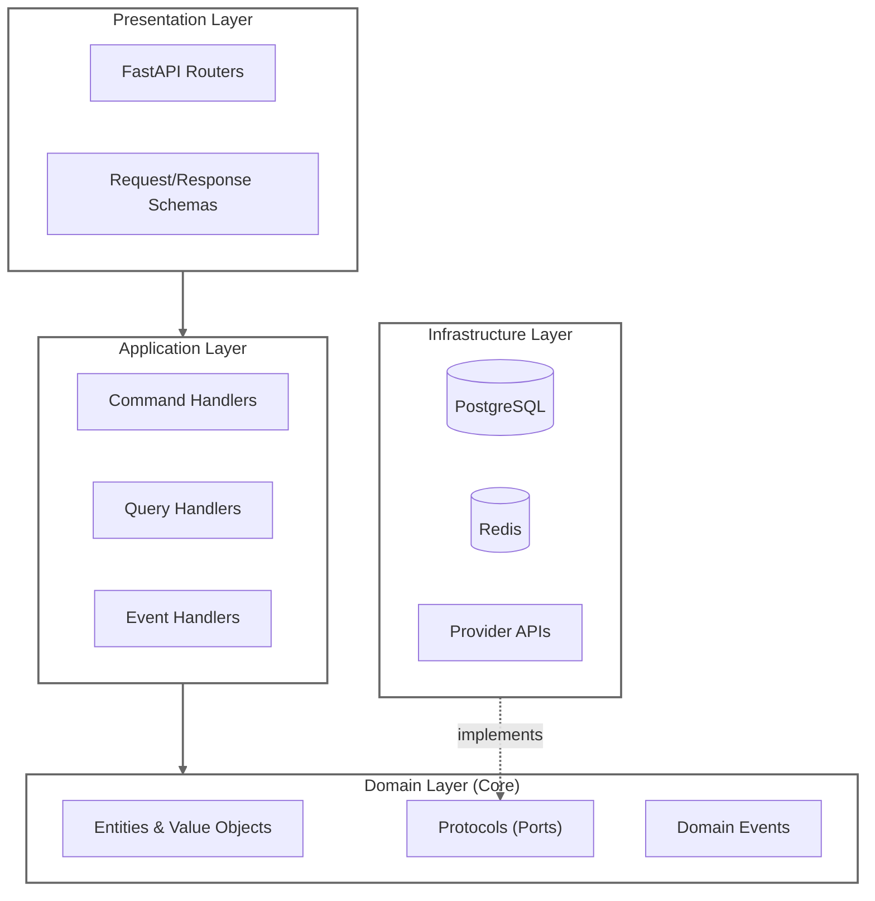

# Dashtam

> Secure financial data aggregation API with hexagonal architecture, CQRS, and domain-driven design

[](https://faiyaz7283.github.io/Dashtam/)
[](https://github.com/faiyaz7283/Dashtam/actions)
[](https://codecov.io/gh/faiyaz7283/Dashtam)
[](https://www.python.org/downloads/)
[](https://fastapi.tiangolo.com)
[](https://opensource.org/licenses/MIT)

## Key Features

- **Hexagonal Architecture** — Domain logic isolated from infrastructure; swap databases/providers without touching business logic
- **CQRS Pattern** — Separate command (write) and query (read) handlers for clarity and performance
- **Protocol-Based Design** — Structural typing with Python `Protocol`; no inheritance, easy testing
- **Registry Patterns** — Single source of truth for events, routes, rate limits with self-enforcing tests
- **Production Security** — JWT + opaque refresh tokens, Casbin RBAC, token bucket rate limiting, PCI-DSS audit trails
- **100% REST Compliance** — Resource-oriented URLs, RFC 9457 error responses, no controller-style endpoints

## Architecture



**Dependencies point inward** — Domain defines protocols (ports), Infrastructure implements adapters.

## Quick Start

### Prerequisites

- **Docker** and Docker Compose v2.0+
- **Make** (for convenience commands)

### 1. Add Local Domains

```bash
sudo sh -c 'echo "127.0.0.1 dashtam.local test.dashtam.local docs.dashtam.local" >> /etc/hosts'
```

### 2. Start Traefik (Reverse Proxy)

```bash
# Clone shared Docker services
git clone git@github.com:faiyazhaider/docker-services.git ~/docker-services
cd ~/docker-services && make traefik-up
```

### 3. Clone & Setup

```bash
git clone https://github.com/faiyaz7283/Dashtam.git
cd Dashtam
make setup    # Creates env files, generates keys
make dev-up   # Starts PostgreSQL, Redis, FastAPI
```

### 4. Verify

```bash
curl -k https://dashtam.local/health
# {"status":"healthy"}
```

### Access Points

| Service | URL |
|---------|-----|
| API | [https://dashtam.local](https://dashtam.local) |
| Swagger UI | [https://dashtam.local/docs](https://dashtam.local/docs) |
| ReDoc | [https://dashtam.local/redoc](https://dashtam.local/redoc) |
| MkDocs | [https://faiyaz7283.github.io/Dashtam/](https://faiyaz7283.github.io/Dashtam/) |

## Documentation

📚 **[Full Documentation](https://faiyaz7283.github.io/Dashtam/)** — Architecture, API reference, guides

### Architecture

- [Hexagonal Architecture](https://faiyaz7283.github.io/Dashtam/architecture/hexagonal/) — Layers, ports & adapters, dependency rule
- [Protocols](https://faiyaz7283.github.io/Dashtam/architecture/protocols/) — Structural typing, Protocol vs ABC
- [CQRS](https://faiyaz7283.github.io/Dashtam/architecture/cqrs/) — Commands, queries, handlers
- [Domain Events](https://faiyaz7283.github.io/Dashtam/architecture/domain-events/) — 3-state ATTEMPT→OUTCOME pattern
- [Registry Pattern](https://faiyaz7283.github.io/Dashtam/architecture/registry/) — Auto-wiring, self-enforcing tests

### Security

- [Authentication](https://faiyaz7283.github.io/Dashtam/architecture/authentication/) — JWT + opaque refresh tokens
- [Authorization](https://faiyaz7283.github.io/Dashtam/architecture/authorization/) — Casbin RBAC (admin > user > readonly)
- [Rate Limiting](https://faiyaz7283.github.io/Dashtam/architecture/rate-limiting/) — Token bucket with Redis Lua

### Guides

- [Error Handling](https://faiyaz7283.github.io/Dashtam/guides/error-handling/) — RFC 9457, Result types
- [Adding Providers](https://faiyaz7283.github.io/Dashtam/guides/adding-providers/) — OAuth, API key, file import
- [Release Management](https://faiyaz7283.github.io/Dashtam/guides/releases/) — Git flow, versioning

## Technology Stack

| Layer | Technology |
|-------|------------|
| Language | Python 3.14, UV 0.9.21 |
| Framework | FastAPI, Pydantic v2 |
| Database | PostgreSQL 17.7 (async SQLAlchemy) |
| Cache | Redis 8.4 |
| Infrastructure | Docker Compose, Traefik, Alembic |
| Testing | pytest (88%+ coverage) |

## Development

```bash
make dev-up       # Start development environment
make dev-logs     # View logs
make test         # Run all tests with coverage
make verify       # Full CI suite (tests + lint + types)
make docs-serve   # Start MkDocs live preview
```

See [Development Workflow](https://faiyaz7283.github.io/Dashtam/guides/releases/) for complete guide.

## License

[MIT License](LICENSE)

---

**Built by [Faiyaz Haider](https://github.com/faiyaz7283)**
