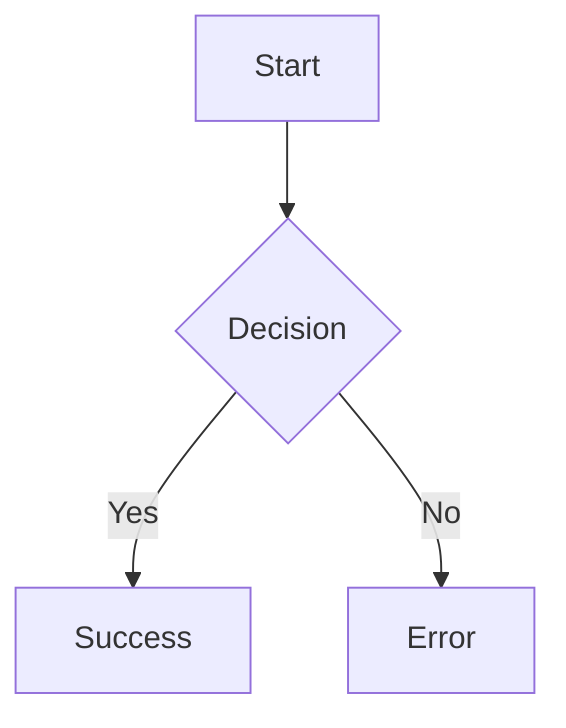

# Dashtam Project Rules and Context

This file contains project-specific rules, coding standards, and context for AI agents working on the Dashtam financial data aggregation platform.

## Project Overview

Dashtam is a secure, modern financial data aggregation platform that connects to multiple financial institutions through OAuth2, providing a unified API for accessing accounts, transactions, and financial data. The platform is built with FastAPI, PostgreSQL, Redis, and Docker, emphasizing type safety, async operations, and security.

### Current Status

- ✅ OAuth2 flow fully implemented and tested with Charles Schwab
- ✅ Token encryption and secure storage implemented
- ✅ Database models and relationships established
- ✅ Docker containerization complete with SSL/HTTPS everywhere
- ✅ Callback server for OAuth redirects operational
- ✅ Environment configuration properly set up (DEBUG mode, .env variables)
- ✅ Database async operations working without errors (no greenlet_spawn issues)
- ✅ Pydantic v2 compatibility fully implemented (all models updated)
- ✅ API documentation endpoints working (/docs, /redoc)
- ✅ All advertised API endpoints functional and tested
- ✅ Docker following UV 0.8.22 best practices
- ✅ **PHASE 1 INFRASTRUCTURE COMPLETE** - Parallel Environments
  - ✅ Separate dev and test Docker Compose configurations
  - ✅ Isolated networks and container naming (no conflicts)
  - ✅ Environment-specific ports and volumes
  - ✅ Health checks for all services (postgres, redis)
  - ✅ Make-based workflow for all environments
- ✅ **PHASE 1 TEST INFRASTRUCTURE COMPLETE**
  - ✅ Synchronous testing strategy implemented (FastAPI TestClient pattern)
  - ✅ Unit tests for core services (encryption, database, token service)
  - ✅ Integration tests for database operations and relationships
  - ✅ API endpoint tests for providers and auth endpoints
  - ✅ Comprehensive test fixtures and mocks
  - ✅ Docker-based test environment with isolated PostgreSQL
  - ✅ Make-based test workflow (test-verify, test-unit, test-integration)
  - ✅ Code quality automation (linting, formatting)
- ✅ **PHASE 3 TEST COVERAGE EXPANSION COMPLETE**
  - ✅ Pydantic v2 migration fully completed (0 deprecation warnings)
  - ✅ Python 3.13 datetime compatibility (timezone-aware datetimes)
  - ✅ Comprehensive database unit tests (17 tests, 100% coverage)
  - ✅ OAuth authentication endpoint tests (20 tests)
  - ✅ Token service unit tests (15 tests)
  - ✅ Token service integration tests (10 tests)
  - ✅ Enhanced encryption service tests (17 tests)
  - ✅ **122 tests passing, 68% code coverage**
- ✅ **PHASE 2 CI/CD COMPLETE**
  - ✅ GitHub Actions workflow configured and operational
  - ✅ Automated linting and code formatting checks
  - ✅ CI-specific Docker Compose configuration (optimized)
  - ✅ Branch protection enabled on development branch
  - ✅ Codecov integration configured with codecov.yml
  - ✅ Coverage reporting to Codecov on all CI runs
  - ✅ Docker Compose v2 migration complete
  - ✅ All tests passing in CI pipeline
- ✅ **P0 CRITICAL ITEMS COMPLETE** (October 2025)
  - ✅ **Timezone-aware datetimes**: Full TIMESTAMPTZ implementation (PR #5)
  - ✅ **Database migrations**: Alembic fully integrated with auto-execution (PR #6)
  - ✅ All datetime columns use `TIMESTAMP WITH TIME ZONE`
  - ✅ Alembic migration: `bce8c437167b` (Initial schema)
  - ✅ Automatic migrations in dev/test/CI environments
  - ✅ Comprehensive migration documentation (710 lines)
  - ✅ Makefile commands: `migrate-create`, `migrate-up`, `migrate-down`, `migrate-history`
- ✅ **P1 HIGH-PRIORITY ITEMS COMPLETE** (October 2025)
  - ✅ **HTTP connection timeouts**: Configurable timeouts for all provider API calls (PR #7)
  - ✅ **OAuth token rotation**: Universal token rotation detection with 3 scenarios (PR #8)
  - ✅ Comprehensive documentation (token-rotation.md guide)
  - ✅ 8 unit tests for token rotation scenarios
  - ✅ All provider HTTP calls protected with timeouts (30s total, 10s connect)
- ✅ **P1 JWT USER AUTHENTICATION COMPLETE** (October 2025)
  - 📚 **Research Complete**: Comprehensive authentication approaches analysis
  - 🎯 **Pattern A Implemented**: JWT Access + Opaque Refresh (Industry Standard)
    - ✅ JWT access tokens (stateless, 30 min TTL)
    - ✅ Opaque refresh tokens (stateful, hashed, 30 days TTL)
    - ✅ Matches Auth0, GitHub, Google pattern (95% industry adoption)
    - ✅ Security vulnerability fixed (proper token hash validation)
  - ✅ **Core Services**: Complete & Production-Ready
    - ✅ PasswordService: bcrypt hashing with Python 3.13 compatibility (17 unit tests, 95% coverage)
    - ✅ JWTService: JWT generation & validation (21 unit tests, 89% coverage)
    - ✅ EmailService: AWS SES integration with templates (20 unit tests, 95% coverage)
    - ✅ AuthService: Complete auth flow with opaque refresh tokens
  - ✅ **API Endpoints**: All Implemented
    - ✅ Registration with email verification
    - ✅ Email verification with hashed tokens
    - ✅ Login with JWT + opaque refresh token
    - ✅ Token refresh with hash validation
    - ✅ Logout with token revocation
    - ✅ Password reset flow (request + confirm)
    - ✅ User profile management (GET/PATCH /auth/me)
  - ✅ **Security Features**:
    - ✅ All tokens hashed before storage (bcrypt)
    - ✅ Email verification required for login
    - ✅ Password complexity validation
    - ✅ Account lockout after failed attempts
    - ✅ Device & IP tracking
  - ✅ **Test Coverage**: 295 tests passing, 76% code coverage
  - ✅ **Documentation**: Comprehensive architecture guide
    - ✅ JWT Authentication Architecture: `docs/development/architecture/jwt-authentication.md`
    - ✅ Pattern A design rationale & security model
    - ✅ Complete API endpoint documentation
    - ✅ Database schema & implementation details
- ✅ **P1 REST API COMPLIANCE COMPLETE** (October 2025)
  - ✅ **10/10 REST Compliance Score**: Perfect RESTful API design (PR #10-14)
  - ✅ **Resource-Oriented URLs**: All endpoints follow REST principles
  - ✅ **Schema Separation**: Zero inline Pydantic models in routers
  - ✅ **Proper HTTP Methods**: GET, POST, PATCH, DELETE used correctly
  - ✅ **Standard Status Codes**: Consistent HTTP status code usage
  - ✅ **Documentation**: Comprehensive REST API architecture guide
    - ✅ RESTful API Design: `docs/development/architecture/restful-api-design.md`
    - ✅ REST API Audit Reports: `docs/development/reviews/REST_API_AUDIT_REPORT_2025-10-05.md`
    - ✅ Schema Design Patterns: `docs/development/architecture/schemas-design.md`
- ✅ **DOCKER & BUILD INFRASTRUCTURE REFACTOR COMPLETE** (October 2025)
  - ✅ **Organized Directory Structure**:
    - `compose/` - All docker-compose files (dev, test, ci, prod template)
    - `env/` - Environment configurations with comprehensive README
    - `docker/` - Dockerfile and .dockerignore
  - ✅ **Non-Root Containers**: All containers run as `appuser` (UID 1000) for security
  - ✅ **UV Integration**: Fast deterministic builds with `uv sync --frozen`
  - ✅ **Environment Variables**: Using `env_file` in compose, no .env volume mounts
  - ✅ **Multi-Stage Dockerfile**: Optimized builds (base, development, builder, production, callback)
  - ✅ **File Permissions**: Proper ownership (appuser:appuser) throughout
  - ✅ **Makefile**: Updated with new paths (compose/, env/)
  - ✅ **All Tests Passing**: 295 tests in dev, test, and CI environments
- ✅ **SMOKE TEST SUITE COMPLETE** (October 2025)
  - ✅ **pytest-based smoke tests**: Replaced shell script with proper pytest implementation
  - ✅ **Token extraction via caplog**: Uses pytest's caplog fixture (no Docker CLI needed)
  - ✅ **22/23 tests passing** (96% success rate, 1 skipped due to minor API bug)
  - ✅ **Complete auth flow coverage**: Registration → Verification → Login → Password Reset → Logout
  - ✅ **Critical path tests**: Health check, API docs, invalid login, weak password, duplicate email
  - ✅ **Environment agnostic**: Works in dev, test, and CI/CD without modifications
  - ✅ **Documentation**: Comprehensive solution guide and README
    - ✅ Smoke Test Solution: `docs/testing/smoke-test-caplog-solution.md`
    - ✅ Smoke Test README: `tests/smoke/README.md`
- ✅ **DOCUMENTATION TEMPLATE SYSTEM COMPLETE** (October 2025, PR #33)
  - ✅ **Complete template migration**: 46 documents, 100% coverage
  - ✅ **8 reusable templates**: Guide, architecture, testing, troubleshooting, research, infrastructure, API flow, index/README
  - ✅ **Mermaid diagram standards**: Mandatory Mermaid syntax for all diagrams (no image files)
  - ✅ **Markdown linting**: markdownlint-cli2 enforcement with `make lint-md` commands
  - ✅ **Directory reorganization**: testing/ and reviews/ moved to docs root level (project-wide)
  - ✅ **Historical directory eliminated**: Update-or-delete paradigm (no archiving)
  - ✅ **Comprehensive guides**: Template system guide, Mermaid standards, markdown linting
- ✅ **MKDOCS DOCUMENTATION SYSTEM COMPLETE** (October 2025, feature/mkdocs-documentation-system)
  - ✅ **MkDocs Material Theme**: Modern, professional documentation site with auto-generated TOC
  - ✅ **API Reference**: Auto-generated from Python docstrings (services, models, core modules)
  - ✅ **Zero Build Warnings**: Clean mkdocs build with strict validation (--strict mode)
  - ✅ **GitHub Pages Deployment**: Automated CI/CD deployment from development branch
  - ✅ **Live Preview**: `make docs-serve` with hot reload and cache management (`make docs-restart`)
  - ✅ **Template Cleanup**: Removed 13 clickable template links, fixed 3 directory links, removed broken anchors
  - ✅ **Documentation URL**: https://faiyaz7283.github.io/Dashtam/
  - ✅ **Makefile Commands**: `docs-serve`, `docs-build`, `docs-stop`, `docs-restart`
  - ✅ **Deployment Guide**: Complete infrastructure guide (docs/development/infrastructure/docs-deployment.md)
  - ✅ **Modern README**: Reduced from 929 to 208 lines (77% reduction) with badges and quick start
- ✅ **Core infrastructure at 76% test coverage, production-ready foundation**
- 🚧 Financial data endpoints (accounts, transactions) pending implementation
- 🚧 Additional provider integrations pending
- 📋 Overall coverage target: 85% (currently 76%)

## Architecture Rules

### Technology Stack Requirements

- **Backend Framework**: Always use FastAPI with async/await patterns
- **Database**: PostgreSQL with SQLModel ORM (NOT SQLAlchemy ORM directly)
- **Async Operations**: Use SQLAlchemy's AsyncSession with proper async patterns
- **Cache**: Redis for session and temporary data storage
- **Package Management**: Use UV 0.8.22+ (not pip or poetry) - See [Modern UV Guide](docs/development/guides/uv-package-management.md)
- **Python Version**: Python 3.13+ required
- **Containerization**: Docker and Docker Compose for all services

### Package Management with UV

**CRITICAL RULE**: Always use modern UV commands for package management. NEVER use legacy pip commands.

**Required Commands:**

- ✅ **Use `uv add package`** - Add dependencies (updates pyproject.toml and uv.lock)
- ✅ **Use `uv remove package`** - Remove dependencies
- ✅ **Use `uv sync`** - Sync environment with lockfile after pulling changes
- ✅ **Use `uv run command`** - Run commands with project dependencies
- ✅ **Use `uv lock`** - Update lockfile
- ✅ **Use `uv tree`** - Show dependency tree

**Forbidden Commands:**

- ❌ **NEVER use `uv pip install`** - Legacy compatibility only
- ❌ **NEVER use `pip install`** - Use `uv add` instead
- ❌ **NEVER use `pip freeze`** - UV manages versions in uv.lock
- ❌ **NEVER edit `uv.lock` manually** - Let UV manage it

**Why UV?**

- 10-100x faster than pip
- Deterministic resolution with lockfiles
- Docker-optimized with official container images
- Modern Python workflow (PEP 621 compliant)

**Example Workflow:**

```bash
# Add a new dependency
docker compose -f compose/docker-compose.dev.yml exec app uv add boto3

# After pulling changes with new dependencies
docker compose -f compose/docker-compose.dev.yml exec app uv sync

# Run tests with project dependencies
docker compose -f compose/docker-compose.dev.yml exec app uv run pytest
```

**Full Documentation**: See [docs/development/guides/uv-package-management.md](docs/development/guides/uv-package-management.md) for comprehensive UV usage guide.

### Docker & Environment Configuration

**CRITICAL RULES**: The project uses a modern Docker setup with organized directories.

**Directory Structure:**

- ✅ **`compose/`** - All docker-compose files (dev, test, ci, prod template)
- ✅ **`env/`** - Environment variable files (.env.dev, .env.test, .env.ci)
- ✅ **`docker/`** - Dockerfile and .dockerignore

**Environment Variables:**

- ✅ **Use `env_file:` in docker-compose** - Docker Compose loads env files
- ✅ **NO `.env` volume mounts** - Environment variables passed via env_file
- ✅ **Pydantic reads from environment** - No `env_file` parameter in Settings
- ✅ **Single source of truth** - `POSTGRES_*` vars (not TEST_POSTGRES_*)

**Docker Commands:**

- ✅ **Use `make` commands** - All commands updated for new structure
- ✅ **`make dev-up`** - Starts services using `compose/docker-compose.dev.yml`
- ✅ **`make test`** - Runs tests using `compose/docker-compose.test.yml`

**Security:**

- ✅ **Non-root containers** - All services run as `appuser` (UID 1000)
- ✅ **Proper file ownership** - Files owned by appuser:appuser
- ✅ **`uv sync --frozen`** - Fast, deterministic builds from lockfile

### Database Access Patterns

**CRITICAL**: This project uses SQLAlchemy's AsyncSession. NEVER use these patterns:

```python
# ❌ WRONG - These don't work with AsyncSession
provider = await session.get(Provider, provider_id)
await session.refresh(provider, ["relationship"])
```

**ALWAYS use these patterns instead:**

```python
# ✅ CORRECT - Proper async patterns
from sqlmodel import select
from sqlalchemy.orm import selectinload

# For simple queries
result = await session.execute(
    select(Provider).where(Provider.id == provider_id)
)
provider = result.scalar_one_or_none()

# For queries with relationships
result = await session.execute(
    select(Provider)
    .options(selectinload(Provider.connection))
    .where(Provider.id == provider_id)
)
provider = result.scalar_one_or_none()
```

### Security Requirements

- **HTTPS Only**: All services must use SSL/TLS (self-signed in dev, proper certs in prod)
- **Token Encryption**: All OAuth tokens must be encrypted using AES-256 before storage
- **No Secrets in Code**: Use environment variables for all sensitive data
- **Audit Logging**: All provider operations must be logged in provider_audit_logs table

## Coding Standards

### Documentation: API Flows (Manual Testing)

- When creating, modifying, or deleting user-facing API endpoints, you MUST also create/modify/delete the corresponding manual API flow guides under `docs/api-flows/`.
- Organize flows by domain (auth, providers, etc.), not HTTP verb. Each flow represents a user journey (e.g., registration, login, provider onboarding), which may span multiple endpoints.
- Follow the reusable template: `docs/templates/api-flow-template.md`.
- Keep flows HTTPS-first (dev TLS). Use `curl -k` for self-signed certificates in development.
- Use environment variables in examples. Never inline real secrets. Prefer placeholders and shell variables (`BASE_URL`, `ACCESS_TOKEN`, etc.).
- Include: Purpose, Prerequisites, Step-by-step commands, Expected response snippets, Cleanup (when applicable), Troubleshooting.
- Naming: kebab-case file names (e.g., `provider-onboarding.md`). Keep titles concise and descriptive.
- Keep docs in sync with behavior: when request/response shapes or status codes change, update affected flows.
- Deprecations/removals: if an endpoint is removed, delete or deprecate the related flow and add a pointer to the replacement (if any).
- Cross-reference: ensure `docs/index.md` structure stays aligned and links are updated when you add or move flows.

PR checklist additions (for any API endpoint change):

- [ ] Updated/added/removed relevant flow(s) in `docs/api-flows/`
- [ ] Verified flows end-to-end against dev HTTPS
- [ ] Kept examples free of real secrets and used variables/placeholders
- [ ] Updated docs/index.md navigation if structure changed

### Documentation: Markdown Quality (All Documentation Files)

**CRITICAL RULE**: All markdown files (guides, docs, READMEs, etc.) must pass markdown linting before commit.

**Workflow for Creating/Updating Markdown Files:**

- **Create or edit** markdown file using `create_file` or `edit_files` tool
- **Lint immediately** after creation/edit:

  ```bash
  make lint-md FILE=path/to/file.md
  ```  

- **Fix all violations** - Zero tolerance for linting errors
- **Re-lint** until clean (exit code 0)
- **Then commit** - Only commit lint-clean markdown files

**Why This Matters:**

- Ensures consistent markdown formatting across all documentation
- Catches formatting issues (headings, lists, links) early
- Prevents accumulation of technical debt in docs
- Maintains professional documentation quality
- Follows project rule: "Always verify with the user that all requirements have been satisfied and properly handled before marking any task as complete"

**Forbidden Patterns:**

- ❌ **NEVER commit markdown files without linting first**
- ❌ **NEVER skip linting because "it's just docs"**
- ❌ **NEVER assume markdown is correctly formatted**
- ❌ **NEVER use time-based estimates** ("Week 1-2", "2-3 hours") - Violates WARP.md flexible development rule

**Quick Lint Command:**

```bash
# Lint single file
make lint-md FILE=path/to/file.md

# Lint all markdown files in project
make lint-md
```

**Integration with Phase Completion Workflow:**
This markdown linting step is part of the **Code Quality** phase:

- Create/edit markdown → Lint markdown → Fix violations → Commit
- Follows same discipline as Python linting (`make lint`) and formatting (`make format`)

**Example Workflow:**

```bash
# 1. Create new guide
vim docs/development/guides/new-guide.md

# 2. Lint immediately
make lint-md-file FILE="docs/development/guides/new-guide.md"

# 3. Fix violations, re-lint until clean
# ... edit file to fix issues ...

# 4. Verify clean
make lint-md FILE=docs/development/guides/new-guide.md
# ✅ Output: no errors (exit 0)

# 5. Now safe to commit
git add docs/development/guides/new-guide.md
git commit -m "docs(guides): add new development guide"
```

**PR Checklist Additions (for any documentation change):**

- [ ] All markdown files linted with `markdownlint-cli2`
- [ ] All linting violations fixed (zero errors)
- [ ] No time-based estimates in task lists or plans
- [ ] Followed project documentation structure (`docs/` hierarchy)

### AI Agent: Markdown Creation Standards

**CRITICAL FOR AI AGENTS**: When creating or editing markdown files, ALWAYS follow these standards to prevent linting violations.

**Root Cause Analysis**: The project has 60+ markdown files with 300+ linting violations because markdown was created without following proper standards. We must prevent this at the source.

**Mandatory Standards When Creating/Editing Markdown:**

1. **Headings Must Be Surrounded by Blank Lines** ✅

   ```markdown

   ✅ CORRECT:

   Some text here.
   
   ## Heading
   
   More text here.
   
   ❌ WRONG:

   Some text here.
   ## Heading
   More text here.

   ```

2. **Lists Must Be Surrounded by Blank Lines** ✅

   ```markdown
   ✅ CORRECT:

      Paragraph before list.
      
      - List item 1
      - List item 2
      - List item 3
    
    Paragraph after list.
   
   ❌ WRONG:

      Paragraph before list.
      - List item 1
      - List item 2
      Paragraph after list.

   ```

3. **Code Blocks Must Have Language Specified** ✅

    ```markdown
    ✅ CORRECT:

        ```bash
        echo "Hello"
        ```
        
        ```python
        print("Hello")
        ```
        
    ❌ WRONG:

        ```
        echo "Hello"
        ```
    ```

4. **Code Blocks Must Be Surrounded by Blank Lines** ✅

   ```markdown
   ✅ CORRECT:

        Paragraph before code.
        
        ```bash
        echo "Hello"
        ```
    
        Paragraph after code.
    
    ❌ WRONG:

        Paragraph before code.
        ```bash
        echo "Hello"
        ```
        Paragraph after code.
   ```

5. **Use Proper Headings, Not Bold Text** ✅

   ```markdown
   ✅ CORRECT:
  
   ### Configuration Steps
   
   Follow these steps...
   
   ❌ WRONG:

   **Configuration Steps**
   
   Follow these steps...
   ```

6. **Nested List Indentation Must Be Correct** ✅
   - Use 2 spaces for nested list items (not 4)

   ```markdown
   ✅ CORRECT:

   - Parent item
     - Child item (2 spaces)
     - Another child
   
   ❌ WRONG:

   - Parent item
       - Child item (4 spaces)
   ```

7. **No Hard Tabs (Use Spaces)** ✅
   - Always use spaces, never tab characters
   - This is especially important in code blocks and lists

8. **Line Length Considerations** ✅
   - Keep lines under 80 characters when possible
   - Exception: Long URLs, code examples can exceed
   - Markdown will wrap naturally in rendered view

**AI Agent Workflow When Creating Markdown:**

1. **Plan the structure** - Outline headings and sections first
2. **Write with standards** - Apply the rules above as you write
3. **Add blank lines** - Generously use blank lines (always around headings, lists, code blocks)
4. **Specify code languages** - Always add language identifier to code blocks
5. **Use proper headings** - Use `##`, `###`, `####` not bold text
6. **Lint immediately** - Run `make lint-md-file FILE="path"` after creation
7. **Fix any violations** - Address issues before showing to user
8. **Verify clean** - Ensure exit code 0 before proceeding

**Common Violations to Avoid:**

| Violation | Rule | Fix |
|-----------|------|-----|
| MD022 | Headings without blank lines | Add blank line before AND after headings |
| MD032 | Lists without blank lines | Add blank line before AND after lists |
| MD031 | Code blocks without blank lines | Add blank line before AND after code blocks |
| MD040 | Code blocks without language | Add language identifier: \```bash, \```python, \```json |
| MD036 | Bold text instead of heading | Use `###` heading instead of `**bold**` |
| MD007 | Wrong list indentation | Use 2 spaces (not 4) for nested lists |
| MD010 | Hard tabs | Use spaces only, never tabs |

**Why This Matters:**

- **Prevention > Cure**: Creating lint-clean markdown from the start prevents technical debt
- **60+ files affected**: Past markdown has 300+ violations - we must not repeat this
- **Professional quality**: Consistent formatting improves readability and maintainability  
- **Workflow efficiency**: Fixing violations after creation wastes time

**Enforcement:**

- ✅ All AI agents MUST follow these standards when creating markdown
- ✅ All markdown MUST be linted immediately after creation
- ✅ Zero tolerance for violations in new markdown files
- ✅ Existing violations will be addressed in separate cleanup PR

**Template Example (Lint-Clean Markdown):**

```markdown


    # Document Title

    Brief introduction paragraph.

    ## Section 1

    Content for section 1.

    ### Subsection 1.1

    Some details here.

    **Key points**:

    - First point
    - Second point
    - Third point

    Example code:

    ```bash
    echo "Hello World"
    ```

    More content here.

    ## Section 2

    Content for section 2.

    ### Steps to Follow

    1. First step
    2. Second step
      - Nested item (2 spaces)
      - Another nested item
    3. Third step

    Conclusion paragraph.

```

**This template passes all linting checks!** Use it as a reference when creating new markdown files.

### Python Code Style

- **Type Hints**: ALWAYS use type hints for function parameters and return values
- **Docstrings**: Use Google-style docstrings for all functions and classes
- **Async/Await**: Prefer async functions for all database and I/O operations
- **Error Handling**: Use proper exception handling with specific error messages
- **Logging**: Use structured logging with appropriate log levels

### Import Organization

Always organize imports in this order:

1. Standard library imports
2. Third-party imports
3. Local application imports

Example:

```python
import logging
from typing import Optional, List
from uuid import UUID

from fastapi import APIRouter, Depends, HTTPException
from sqlalchemy.ext.asyncio import AsyncSession
from sqlmodel import select

from src.models.provider import Provider
from src.core.database import get_session
```

### File Naming Conventions

- **Python files**: Use snake_case (e.g., `token_service.py`)
- **Docker files**: Use PascalCase with extensions (e.g., `Dockerfile`)
- **Config files**: Use lowercase with appropriate extensions (e.g., `docker-compose.yml`)
- **Documentation**: Use UPPERCASE for special files (e.g., `README.md`, `WARP.md`)

### Implementation Planning and Documentation

**CRITICAL RULE**: Never use rigid day-based timelines ("Day 1", "Day 2", etc.) in implementation guides, documentation, or task lists.

**Why**: Development work is flexible and variable. Some days allow intensive focus with many tasks completed in hours; other days have limited availability. Rigid day-based schedules don't reflect this reality and create false expectations.

**Instead, use**:

- ✅ **Phase-based organization**: "Phase 1: Database Schema", "Phase 2: Core Services"
- ✅ **Workflow-based grouping**: "Database Schema & Models", "API Endpoints", "Testing"
- ✅ **Logical dependencies**: "After migrations complete...", "Once services are implemented..."
- ✅ **Flexible task lists**: Tasks grouped by logical components without time constraints

**Examples**:

```text
❌ BAD:
- Day 1: Create database migrations
- Day 2: Implement services
- Day 3: Build API endpoints

✅ GOOD:
- Phase 1: Database Schema & Models
  - Create database migrations
  - Update models
  - Verify schema
- Phase 2: Core Services
  - Implement PasswordService
  - Implement JWTService
  - Implement AuthService
- Phase 3: API Endpoints
  - Build registration endpoint
  - Build login endpoint
  - Update authentication dependencies
```

This applies to:

- Implementation guides
- Quick reference docs
- Todo lists and task tracking
- Project planning documents
- Progress updates

## Project Structure Rules

### Directory Organization

```bash
src/
├── api/           # API endpoints only
├── core/          # Core functionality (config, database, security)
├── models/        # SQLModel database models
├── providers/     # Provider implementations
└── services/      # Business logic and service layer
```

### Module Responsibilities

- **api/**: Only HTTP endpoint definitions, no business logic
- **services/**: All business logic, token management, provider operations
- **models/**: Database models with relationships and methods
- **providers/**: Provider-specific OAuth and API implementations
- **core/**: Shared utilities, configuration, database setup

## Docker and Development Rules

### Docker-Only Development Policy

**CRITICAL RULE**: All development, testing, and execution must be done through Docker containers.

- **NEVER run Python directly on host machine** for project-related tasks
- **NEVER install project dependencies on host machine**
- **All testing must be done in Docker containers** using `make test` or `docker-compose exec`
- **Database operations must use containerized database**
- **Package management must use containerized UV**

This ensures:

- Complete environment isolation
- Consistent development experience across machines
- No dependency conflicts with host system
- Production-identical development environment

### AI Agent File Operations

**CRITICAL RULE**: Always use the appropriate file tools for file operations. NEVER use shell heredoc or multi-line quotes for file creation.

**For creating new files:**

- ✅ **ALWAYS use `create_file` tool** - No size limitations, handles files of any length
- ✅ Can create files with 1000+ lines without issues
- ✅ Reliable for multi-line files with complex content
- ✅ No issues with quotes, heredocs, or special characters
- ✅ Can create directly in project directories OR in `/tmp/` for review
- ✅ Use `run_command` with `cp` or `mv` to move files from `/tmp/` to final location

**For editing existing files:**

- ✅ **ALWAYS use `edit_files` tool** - Diff-based search/replace blocks
- ✅ Precise, surgical edits to specific sections
- ✅ Can make multiple edits across multiple files in one operation
- ✅ For complete file rewrites, use `create_file` + `cp` instead of trying to search/replace entire file

**For task planning and complex workflows:**

- ✅ **ALWAYS use `create_todo_list` tool** for multi-step tasks (3+ steps)
- ✅ Keeps track of progress across session interruptions
- ✅ Use `mark_todo_as_done` to track completed items
- ✅ Use `read_todos` to check current state
- ✅ DO NOT create TODO lists with only 1-2 items

**Recommended workflow for file restructuring:**

```bash
# Step 1: Create restructured file in /tmp/
create_file("/tmp/filename.md", content)

# Step 2: Copy to project location (AI agent does this)
run_command("cp /tmp/filename.md docs/development/guides/filename.md")

# Step 3: Lint and verify
run_command("make lint-md-file FILE='docs/development/guides/filename.md'")

# Step 4: Commit
run_command("git add docs/development/guides/filename.md")
create_file("/tmp/commit_msg.txt", commit_message)
run_command("git commit -F /tmp/commit_msg.txt")
```

**FORBIDDEN patterns in terminal commands:**

- ❌ **NEVER use heredoc syntax** (`<< EOF`) - Gets mangled, causes infinite prompts
- ❌ **NEVER use multi-line strings in double quotes** - Causes `dquote>` prompt hang
- ❌ **NEVER use `cat > file << EOF`** - Has NEVER worked successfully, pure headache
- ❌ **NEVER use Python `-c` with multi-line code** - Quote escaping problems
- ❌ **NEVER complain about file size** - `create_file` handles large files perfectly
- ❌ **NEVER break files into sections** - Create complete files in one operation

**For simple one-liners only:**

- ✅ **Use `echo 'line' >` for first line** - Single quotes, redirect to file
- ✅ **Use `echo 'line' >>` for appending** - Single quotes, append to file
- ✅ Chain multiple echo commands with `&&`

**Why this matters:**

- `create_file` and `edit_files` tools are designed for AI agents
- Shell heredoc/multi-line quotes have NEVER worked reliably in this environment
- Terminal commands with heredoc fail transmission and hang indefinitely
- `create_file` can handle files of ANY size (tested with 800+ line files)
- Using proper tools is faster and more reliable than workarounds

### Docker Service Names

Environment-specific container names with suffixes:

**Development:**

- `dashtam-dev-app` - Main FastAPI application
- `dashtam-dev-callback` - OAuth callback server
- `dashtam-dev-postgres` - PostgreSQL database
- `dashtam-dev-redis` - Redis cache

**Test:**

- `dashtam-test-app` - Test application
- `dashtam-test-callback` - Test callback server
- `dashtam-test-postgres` - Test PostgreSQL database
- `dashtam-test-redis` - Test Redis cache

**CI/CD:**

- `dashtam-ci-app` - CI application
- `dashtam-ci-postgres` - CI PostgreSQL database
- `dashtam-ci-redis` - CI Redis cache

### Network Configuration

**Development:**

- Network: `dashtam-dev-network`
- Ports: 8000 (app), 8182 (callback), 5432 (postgres), 6379 (redis)

**Test:**

- Network: `dashtam-test-network`
- Ports: 8001 (app), 8183 (callback), 5433 (postgres), 6380 (redis)

**CI:**

- Network: `dashtam-ci-network`
- No external ports (internal only for security)

**Internal Communication:**

- Backend internal hostname: `app` (NOT `backend` or `localhost`)
- All environments use same internal container ports

### Environment Variables

Critical environment variables that must be set:

```bash
DATABASE_URL=postgresql+asyncpg://...  # Must use asyncpg driver
SCHWAB_API_KEY=...                     # OAuth client ID
SCHWAB_API_SECRET=...                   # OAuth client secret
SCHWAB_REDIRECT_URI=https://127.0.0.1:8182
SECRET_KEY=...                          # For JWT signing
ENCRYPTION_KEY=...                      # For token encryption
```

### Environment Configuration Management

**CRITICAL RULE**: Whenever adding new configuration variables to `src/core/config.py`, you MUST update ALL environment template files.

**Required Files to Update:**

1. `.env.example` - Production/general template
2. `.env.dev.example` - Development environment template
3. `.env.test.example` - Test environment template
4. `.env.ci.example` - CI/CD environment template

**Configuration Flow:**

```text
1. Add new field to src/core/config.py (Settings class)
2. Document the field in class docstring
3. Add to ALL .env.example files with:
   - Appropriate default/placeholder value
   - Descriptive comment explaining usage
   - Secret values as placeholders (never actual secrets)
4. For secrets: Use placeholder format like "your-secret-here" or "change-me-in-production"
5. For AWS/third-party credentials: Comment them out in examples with # prefix
```

**Example:**

```bash
# When adding AWS_REGION to config.py:

# In .env.example and .env.dev.example:
AWS_REGION=us-east-1

# In .env.test.example:
AWS_REGION=us-east-1  # Mocked in tests

# In .env.ci.example:
AWS_REGION=us-east-1  # Not used in CI (mocked)
```

**Why This Matters:**

- Ensures all environments have required configuration documented
- New developers can quickly see all available settings
- Prevents "missing environment variable" errors
- Maintains consistency across environments
- Follows the idempotent .env.example pattern (can be copied if .env missing)

### CI/CD Docker Compose Configuration

**CRITICAL RULE**: The CI docker-compose file (`compose/docker-compose.ci.yml`) must NOT automatically run tests on container startup.

**Why This Rule Exists:**

- GitHub Actions workflow controls test execution via `docker compose exec` commands
- Auto-running tests causes containers to exit before GitHub Actions can exec into them
- This creates race conditions and intermittent exit code 137 failures
- Proper flow: compose up → migrations → keep alive → GitHub Actions execs tests → compose down

**Correct CI App Service Pattern:**

```yaml
app:
  command: >
    sh -c "
      set -e &&
      echo 'Running Alembic migrations...' &&
      uv run alembic upgrade head &&
      echo 'Migrations complete. Ready for tests.' &&
      echo 'Keeping container alive for GitHub Actions...' &&
      tail -f /dev/null
    "
```

**Incorrect Pattern (DO NOT USE):**

```yaml
app:
  command: >
    sh -c "
      uv run alembic upgrade head &&
      uv run pytest tests/ ...  # ❌ NEVER auto-run tests in CI compose
    "
```

**GitHub Actions Workflow Pattern:**

```yaml
- name: Start test environment
  run: docker compose -f compose/docker-compose.ci.yml up -d --build

- name: Run tests (controlled by GitHub Actions)
  run: |
    docker compose -f compose/docker-compose.ci.yml exec -T app \
      uv run pytest tests/ -v --cov=src ...
```

**Key Points:**

- ✅ CI compose starts services and keeps them alive with `tail -f /dev/null`
- ✅ GitHub Actions controls when and how tests run via `exec`
- ✅ This allows separate jobs for main tests and smoke tests
- ✅ Prevents race conditions between container startup and test execution
- ❌ Never combine automatic test execution with `docker compose up -d`

## API Design Rules

### REST API Compliance - CRITICAL REQUIREMENT

**MANDATORY**: This project maintains **100% RESTful API compliance**. All API endpoints must strictly follow REST architectural principles without exception.

**Current Status**: ✅ **10/10 REST Compliance Achieved** (verified 2025-10-05)

**Comprehensive REST Guidelines**: See [RESTful API Design Architecture](/Users/faiyazhaider/Dashtam/docs/development/architecture/restful-api-design.md) for complete standards.

#### Core REST Principles (Non-Negotiable)

1. **Resource-Based URLs** ✅
   - URLs MUST represent resources (nouns), NEVER actions (verbs)
   - ✅ Correct: `POST /providers`, `PATCH /providers/{id}`
   - ❌ Wrong: `/createProvider`, `/updateProvider`, `/getProviders`

2. **Proper HTTP Methods** ✅
   - GET: Retrieve resources (must be safe and idempotent)
   - POST: Create new resources
   - PATCH: Partial update of resources
   - PUT: Complete replacement of resources
   - DELETE: Remove resources
   - ❌ NEVER use GET for operations with side effects

3. **Stateless Design** ✅
   - All requests self-contained
   - JWT-based authentication (no server sessions)
   - No client state stored on server

4. **Standard HTTP Status Codes** ✅
   - 200: Success (GET, PATCH, PUT)
   - 201: Created (POST)
   - 204: No Content (DELETE)
   - 400: Bad Request (validation errors)
   - 401: Unauthorized (auth required)
   - 403: Forbidden (no permission)
   - 404: Not Found
   - 409: Conflict (e.g., duplicate)
   - 500: Internal Server Error

5. **Schema Separation** ✅
   - All request/response schemas in `src/schemas/`
   - ❌ NEVER define inline Pydantic models in router files
   - Schemas organized by domain (auth, provider, common)

6. **Router Independence** ✅
   - Each router module is self-contained
   - No duplicate or conflicting implementations
   - Clean dependency injection patterns

#### REST Compliance Verification

**Before ANY API changes**:

1. Review [RESTful API Design Architecture](docs/development/architecture/restful-api-design.md)
2. Ensure no inline schemas in routers
3. Verify proper HTTP methods and status codes
4. Check for resource-oriented URLs (no verbs)
5. Run all tests: `make test`
6. Verify lint passes: `make lint`

**Audit Reports**:

- Initial audit: `docs/development/reviews/REST_API_AUDIT_REPORT.md`
- Current audit: `docs/development/reviews/REST_API_AUDIT_REPORT_2025-10-05.md`
- Both reports document 10/10 compliance achievement

#### REST Violations - STRICTLY PROHIBITED

❌ **Never Allowed**:

- Verb-based URLs (`/getUsers`, `/createProvider`)
- GET requests with side effects
- Inline Pydantic schemas in router files
- Inconsistent response formats
- Non-standard HTTP status codes
- Duplicate router implementations
- Action-oriented endpoints (except limited controller patterns for non-CRUD operations)

✅ **Acceptable Exception**:

- Controller-style endpoints for true actions (e.g., `POST /auth/login`, `POST /providers/{id}/refresh`)
- Only when operation is genuinely an action, not a resource state change
- Must be documented and justified

#### Maintaining Compliance

**All API changes require**:

1. REST principles adherence check
2. Schema organization verification (no inline models)
3. HTTP method and status code review
4. Response format consistency check
5. Full test coverage with passing tests
6. Documentation updates

**Compliance Score Target**: 10/10 (current status: ✅ achieved)

### Endpoint Naming

- Use RESTful conventions with clear resource names
- Prefix all API routes with `/api/v1/`
- Use UUID for resource identifiers, not integers
- Provider-specific endpoints: `/api/v1/providers/{provider_id}/...`
- Auth endpoints: `/api/v1/auth/...`
- Password resets: `/api/v1/password-resets/{token}`

### Response Format

- Always return consistent JSON responses
- Include appropriate HTTP status codes
- Provide detailed error messages in development
- Use Pydantic models for request/response validation
- All schemas defined in `src/schemas/` directory

### Authentication Flow

The OAuth flow must follow this exact sequence:

1. Create provider instance: `POST /api/v1/providers`
2. Initiate authorization: `POST /api/v1/providers/{provider_id}/authorization`
3. User authorizes in browser
4. Callback handled: `GET /api/v1/providers/{provider_id}/authorization/callback`
5. Tokens stored encrypted in database
6. Provider marked as connected

## Testing and Development Rules

### Test Coverage

- **PHASE 1 COMPLETE**: Synchronous test infrastructure fully operational
- **Test strategy**: FastAPI TestClient with synchronous SQLModel sessions
- **Test pyramid approach**: 70% unit, 20% integration, 10% e2e tests
- **Target coverage**: 85%+ overall, 95%+ for critical components
- **Working test workflow**: Make-based commands for all test operations
- **Current coverage**: 76% overall (295 tests passing) ✅
  - Unit tests: Core services (encryption, JWT, email, auth, password)
  - Integration tests: Database operations, relationships, token flows
  - API tests: All endpoints (auth, providers, password resets)
  - **Smoke tests**: 22/23 passing (96% success rate) ✅
- **Docker integration**: All tests run in isolated containers ✅
- **Safety features**: Environment validation, test database isolation ✅
- **CI/CD Integration**: Automated testing via GitHub Actions ✅
- **Code Quality**: Automated linting (ruff) and formatting checks ✅
- **Current status**: All tests passing in dev, test, and CI environments ✅

### Smoke Tests

- **Implementation**: pytest-based comprehensive authentication flow tests
- **Token Extraction**: Uses pytest's `caplog` fixture (no Docker CLI needed)
- **Coverage**: Complete user journey from registration to logout
  - Registration → Email Verification → Login → Profile Management
  - Token Refresh → Password Reset → Logout → Token Revocation
- **Critical Paths**: Health check, API docs, invalid credentials, password validation
- **Results**: 22 passed, 1 skipped (minor API bug), 0 failed
- **Documentation**: See `tests/smoke/README.md` and `docs/development/testing/smoke-test-caplog-solution.md`
- **Runs in**: dev, test, and CI environments without modifications

### Local Development Commands

Always use the Makefile for common operations:

**Development Environment:**

- `make dev-up` - Start development services
- `make dev-down` - Stop development services
- `make dev-logs` - View development logs
- `make dev-status` - Check development service status
- `make dev-shell` - Open shell in dev app container
- `make dev-restart` - Restart development environment
- `make dev-rebuild` - Rebuild dev images from scratch (no cache)

**Test Environment:**

- `make test-up` - Start test services
- `make test-down` - Stop test services
- `make test-status` - Check test service status
- `make test-rebuild` - Rebuild test images from scratch
- `make test-restart` - Restart test environment

**Running Tests:**

- `make test-verify` - Quick core functionality verification
- `make test-unit` - Run unit tests
- `make test-integration` - Run integration tests
- `make test-smoke` - Run smoke tests (end-to-end auth flows)
- `make test` - Run all tests with coverage

**Code Quality:**

- `make lint` - Run code linting (ruff check)
- `make format` - Format code (ruff format)
- `make lint-md` - Run markdown linting

**Documentation:**

- `make docs-serve` - Live preview documentation with hot reload
- `make docs-build` - Build static documentation site
- `make docs-stop` - Stop documentation server
- `make docs-restart` - Restart docs with cache clear

**CI/CD:**

- `make ci-test` - Run CI tests locally
- `make ci-build` - Build CI images
- `make ci-down` - Clean up CI environment

**Utilities:**

- `make status-all` - Check status of all environments
- `make certs` - Generate SSL certificates
- `make keys` - Generate encryption keys
- `make clean` - Clean everything
- `make setup` - Complete initial setup

### SSL Certificates

- Development uses self-signed certificates
- Located in `certs/` directory
- Must be generated before first run: `make certs`
- Browser warnings are expected in development

### Database Migrations

- **Alembic fully integrated** - All schema changes via migrations
- Initial migration: `bce8c437167b` (complete schema)
- Automatic execution in dev/test/CI environments
- Makefile commands: `migrate-create`, `migrate-up`, `migrate-down`, `migrate-history`
- Documentation: `docs/development/infrastructure/database-migrations.md`
- **Never** manually create tables - always use migrations

## Error Handling Patterns

### Common Issues and Solutions (RESOLVED)

#### "greenlet_spawn has not been called" Error ✅ FIXED

- **Cause**: Improper async database operations
- **Solution**: All database queries now use proper `session.execute(select(...))` pattern
- **Status**: All async database operations working correctly

#### "Invalid host header" Error ✅ FIXED

- **Cause**: TrustedHostMiddleware blocking requests
- **Solution**: Docker service names properly configured in allowed_hosts
- **Status**: All internal Docker communication working

#### Connection Errors in Callback Server ✅ FIXED

- **Cause**: Wrong internal hostname configuration
- **Solution**: Using correct `app` hostname for internal communication
- **Status**: OAuth callback flow working perfectly

#### API Documentation Not Available ✅ FIXED

- **Cause**: DEBUG mode not properly configured
- **Solution**: Fixed environment configuration to enable DEBUG in development
- **Status**: `/docs` and `/redoc` endpoints now accessible

## Provider Implementation Rules

### Adding New Providers

1. Create provider class in `src/providers/` inheriting from `BaseProvider`
2. Implement required methods: `get_auth_url()`, `authenticate()`, `refresh_authentication()`
3. Register in `ProviderRegistry` in `src/providers/registry.py`
4. Add configuration to `.env` file
5. Test OAuth flow end-to-end before proceeding

### Token Management

- Always encrypt tokens before storage
- Implement automatic refresh logic
- Handle token rotation if provider sends new refresh token
- Log all token operations in audit log

## Git and Version Control Rules

**CRITICAL**: Dashtam follows **Git Flow** workflow with strict branch protection and automated testing requirements. See [Git Workflow Guide](docs/development/guides/git-workflow.md) for complete documentation.

### Branching Strategy (Git Flow)

**Primary Branches**:

- **`main`** - Production-ready code only
  - ✅ Protected with required PR approvals and tests
  - ✅ Tagged with semantic versions (e.g., `v1.2.0`)
  - ✅ Always deployable to production
  - ✅ Receives merges from `release/*` and `hotfix/*` only

- **`development`** - Integration branch for active development
  - ✅ Protected with required PR approvals and tests
  - ✅ Contains unreleased features
  - ✅ Always ahead of `main`
  - ✅ Receives merges from `feature/*` and `fix/*` branches

**Supporting Branches**:

- **`feature/*`** - New features (e.g., `feature/account-api`)
  - Branch from: `development`
  - Merge to: `development`
  - Delete after merge

- **`fix/*`** - Bug fixes (e.g., `fix/token-refresh-error`)
  - Branch from: `development`
  - Merge to: `development`
  - Delete after merge

- **`release/*`** - Release preparation (e.g., `release/v1.2.0`)
  - Branch from: `development`
  - Merge to: `main` AND `development`
  - Protected, requires approval
  - Delete after merge

- **`hotfix/*`** - Emergency production fixes (e.g., `hotfix/v1.1.1`)
  - Branch from: `main`
  - Merge to: `main` AND `development`
  - Protected, requires approval
  - Deploy immediately to production

### Semantic Versioning

All releases follow [Semantic Versioning 2.0.0](https://semver.org/): `vMAJOR.MINOR.PATCH`

- **MAJOR** (v2.0.0): Breaking changes, incompatible API changes
- **MINOR** (v1.2.0): New features, backward-compatible
- **PATCH** (v1.1.1): Bug fixes, backward-compatible

**Pre-release versions**:

- `v1.2.0-alpha.1` - Alpha release (internal testing)
- `v1.2.0-beta.1` - Beta release (external testing)
- `v1.2.0-rc.1` - Release candidate (final testing)

### Commit Message Conventions

Use **Conventional Commits** for automated changelog generation:

**Format**: `<type>(<scope>): <subject>`

**Types**:

- `feat:` New features (bumps MINOR version)
- `fix:` Bug fixes (bumps PATCH version)
- `docs:` Documentation only
- `style:` Code formatting (no logic change)
- `refactor:` Code restructuring (no feature change)
- `test:` Test additions/changes
- `chore:` Maintenance, dependencies
- `perf:` Performance improvements
- `ci:` CI/CD changes
- `build:` Build system changes
- `revert:` Revert previous commit

**Breaking Changes**: Use `BREAKING CHANGE:` in footer or `!` after type

```bash
feat(api)!: change authentication endpoint structure

BREAKING CHANGE: Auth endpoint moved from /auth to /api/v1/auth
```

**Examples**:

```bash
feat(providers): add Plaid provider support
fix(auth): prevent race condition in token refresh
docs(api): update endpoint documentation
test(integration): add OAuth flow tests
chore(deps): update FastAPI to 0.110.0
```

**Commit Rules**:

- ✅ Use present tense ("add" not "added")
- ✅ Use imperative mood ("move" not "moves")
- ✅ Keep subject under 72 characters
- ✅ Reference issues (e.g., "Closes #42")
- ❌ Never commit directly to `main` or `development`
- ❌ Never commit secrets or sensitive data
- ❌ Never commit incomplete work to shared branches

### Branch Protection Requirements

**CRITICAL**: Both `main` and `development` branches MUST be protected with:

✅ **Required Status Checks**:

- `Test Suite / Run Tests` - All tests must pass
- `Code Quality / lint` - Linting must pass
- Branches must be up to date before merging

✅ **Required Pull Request Reviews**:

- At least 1 approval required
- Dismiss stale reviews on new commits
- Require conversation resolution

✅ **Restrictions**:

- No direct commits (PR required)
- No force pushes
- No branch deletion
- Enforce for administrators (on `main`)

**Setting up branch protection** (see [Git Workflow Guide](docs/development/guides/git-workflow.md#branch-protection-rules)):

```bash
# Via GitHub Web UI: Settings → Branches → Add rule
# Or via GitHub CLI (gh) - see workflow guide
```

### Workflow Process

**Starting New Feature**:

```bash
git checkout development
git pull origin development
git checkout -b feature/my-feature
# ... make changes, commit ...
git push -u origin feature/my-feature
# Create PR to development on GitHub
```

**Creating Release**:

```bash
git checkout -b release/v1.2.0
# Update version, CHANGELOG.md
git push -u origin release/v1.2.0
# PR to main → merge → tag → merge back to development
```

**Emergency Hotfix**:

```bash
git checkout main
git checkout -b hotfix/v1.1.1
# Fix critical issue
# PR to main → merge → tag → merge to development → deploy
```

### Pull Request Process

**All PRs must**:

- ✅ Pass all automated tests (`Test Suite / Run Tests`)
- ✅ Pass linting checks (`Code Quality / lint`)
- ✅ Have at least 1 approval
- ✅ Resolve all review conversations
- ✅ Include tests for new features/fixes
- ✅ Update documentation if needed

**PR Template** (include in description):

```markdown
## Description
[Brief description of changes]

## Type of Change
- [ ] New feature
- [ ] Bug fix
- [ ] Breaking change
- [ ] Documentation

## Testing
- [ ] Unit tests pass
- [ ] Integration tests pass
- [ ] All tests pass (`make test`)
- [ ] Linting passes (`make lint`)

## Related Issues
Closes #XX
```

### Git Resources

**For complete Git workflow documentation, see**:

- 📚 [Git Workflow Guide](docs/development/guides/git-workflow.md) - Comprehensive guide with examples
- 📋 [Git Quick Reference](docs/development/guides/git-quick-reference.md) - One-page cheat sheet
- 🔧 [Branch Protection Setup](docs/development/guides/git-workflow.md#branch-protection-rules) - Configuration instructions

## Performance and Optimization Rules

### Database Queries

- Always use eager loading for relationships with `selectinload()`
- Avoid N+1 queries by loading related data upfront
- Use database indexes for frequently queried fields
- Implement pagination for list endpoints

### Async Best Practices

- Don't block the event loop with synchronous operations
- Use `asyncio` for concurrent operations where appropriate
- Implement connection pooling for database connections
- Set appropriate timeout values for external API calls

## Documentation Requirements

### Documentation Template System

**CRITICAL**: ALWAYS use templates from `docs/templates/` when creating new documentation.

**Available Templates:**

- `general-template.md` - Default for any documentation
- `architecture-template.md` - System architecture and design docs
- `guide-template.md` - Step-by-step how-to guides
- `infrastructure-template.md` - Infrastructure and operations docs
- `testing-template.md` - Testing documentation
- `troubleshooting-template.md` - Bug investigations and resolutions
- `research-template.md` - Research documents and ADRs
- `api-flow-template.md` - API manual testing flows

**Template Usage:**

```bash
# 1. Copy appropriate template
cp docs/templates/guide-template.md docs/development/guides/my-guide.md

# 2. Fill out template (replace [placeholders])

# 3. Verify quality
make lint-md
```

**See:** [docs/templates/README.md](docs/templates/README.md) for complete template system guide.

### Diagram Standards (REQUIRED)

**CRITICAL**: ALL diagrams in documentation MUST use Mermaid syntax.

**Required Diagram Types:**

- **Directory trees** → Use code blocks with tree structure (like `tree` command output)
- **Process flows** → Use `flowchart TD`
- **Database schemas** → Use `erDiagram`
- **API sequences** → Use `sequenceDiagram`
- **State transitions** → Use `stateDiagram-v2`
- **Timelines** → Use `gantt`
- **Class structures** → Use `classDiagram`

**Prohibited:**

- ❌ Image files (PNG, JPG, SVG uploads)
- ❌ External diagram tools (draw.io, Lucidchart)
- ❌ ASCII art diagrams

**Example:**



**See:** [Mermaid Diagram Standards](docs/development/guides/mermaid-diagram-standards.md) for complete diagram standards.

### Documentation Structure

**CRITICAL**: All documentation must follow the established structure in `docs/`. NEVER create documentation files in the root directory except for README.md and WARP.md.

**Root Directory** (Only these files):

- `README.md` - Project overview and quick start
- `WARP.md` - This file (AI agent rules and project context)
- `CONTRIBUTING.md` - Contributing guidelines (optional)

**Documentation Organization**:

```bash
docs/
├── index.md                   # Documentation index (navigation)
├── templates/                 # Documentation templates (START HERE!)
│   ├── README.md              # Template system guide
│   └── *.md                   # Template files
├── development/               # Developer documentation
│   ├── architecture/          # System design and architecture
│   ├── guides/                # How-to guides and tutorials
│   ├── implementation/        # Implementation plans (active)
│   ├── infrastructure/        # Docker, CI/CD, environments
│   └── troubleshooting/       # Bug investigations and resolutions
├── research/                  # Research and decision records (project-wide)
├── reviews/                   # Code reviews, audits (project-wide)
├── testing/                   # Testing strategy and guides (project-wide)
├── setup/                     # User setup guides (planned)
├── api/                       # API documentation (planned)
└── guides/                    # User guides (planned)
```

**When to Create Documentation**:

1. **Choose template** from `docs/templates/` based on document type
2. **Copy template** to appropriate location
3. **Fill out template** (replace all [placeholders])
4. **Use Mermaid** for all diagrams (see [Mermaid Diagram Standards](docs/development/guides/mermaid-diagram-standards.md))
5. **Lint before commit** (`make lint-md`)

**Document Placement:**

- **Development docs** → `docs/development/[category]/filename.md`
  - Architecture decisions → `docs/development/architecture/`
  - How-to guides → `docs/development/guides/`
  - Implementation plans → `docs/development/implementation/`
  - Infrastructure setup → `docs/development/infrastructure/`
  - Troubleshooting/bug investigations → `docs/development/troubleshooting/`

- **Project-wide docs** → `docs/[category]/filename.md` (root level)
  - Research & ADRs → `docs/research/`
  - Code reviews/audits → `docs/reviews/`
  - Testing strategy/guides → `docs/testing/`

- **User-facing docs** → `docs/setup/`, `docs/api/`, or `docs/guides/`
  - Installation guides
  - API endpoint documentation
  - User tutorials and troubleshooting

**Documentation Rules**:

1. ✅ **Use templates** - ALWAYS start with appropriate template from `docs/templates/`
2. ✅ **Use Mermaid** - ALL diagrams MUST use Mermaid syntax (see [Mermaid Diagram Standards](docs/development/guides/mermaid-diagram-standards.md))
3. ✅ **Metadata at bottom** - Templates have metadata section at end for user-first reading
4. ✅ **Keep root directory clean** - Only README.md and WARP.md
5. ✅ **Use descriptive filenames** - kebab-case (e.g., `oauth-flow.md`)
6. ✅ **Create index.md** - For navigation pages in directories (docs/, docs/development/, etc.)
7. ✅ **Link between documents** - Cross-reference related docs
8. ✅ **Update docs/index.md** - When adding new sections
9. ✅ **Keep docs current** - Update or delete outdated content (no archiving)
10. ✅ **Lint before commit** - Run `make lint-md` to verify quality
11. ❌ **NEVER scatter documentation** - Follow established directory structure
12. ❌ **NEVER use image files for diagrams** - Use Mermaid instead
13. ❌ **NEVER create temporary summary files** - Display in terminal output

### Code Documentation

- Every module must have a module-level docstring
- All public functions need docstrings with parameters and return values
- Complex logic should have inline comments
- Update README.md when adding new features or endpoints

### API Documentation

- FastAPI auto-generates OpenAPI docs at `/docs`
- Ensure all endpoints have proper descriptions
- Include example requests/responses where helpful
- Document error conditions and status codes

## Monitoring and Logging Rules

### Logging Standards

- Use structured logging with appropriate levels:
  - `DEBUG`: Detailed diagnostic information
  - `INFO`: General informational messages
  - `WARNING`: Warning messages for potential issues
  - `ERROR`: Error messages for failures
- Include relevant context (user_id, provider_id, etc.)
- Never log sensitive data (tokens, passwords, secrets)

### Health Checks

- Implement health check endpoints for all services
- Check database connectivity
- Verify Redis connection
- Report degraded state if any service is down

## Future Enhancements to Consider

### Planned Features

1. Additional provider integrations (Chase, Bank of America, Fidelity)
2. Plaid integration for broader bank support
3. Account and transaction data models
4. Balance tracking and analytics
5. Web UI dashboard
6. Webhook support for real-time updates
7. Rate limiting and request throttling
8. Multi-factor authentication

### Technical Improvements

**Completed:**

1. ✅ Fixed all async database operation patterns
2. ✅ Updated all models for Pydantic v2 compatibility
3. ✅ Implemented proper environment configuration
4. ✅ Docker containerization with UV best practices
5. ✅ API documentation setup (/docs, /redoc)
6. ✅ Comprehensive test infrastructure (synchronous testing strategy)
7. ✅ Parallel dev/test/CI environments (no conflicts)
8. ✅ Docker Compose v2 migration complete
9. ✅ GitHub Actions CI/CD pipeline operational
10. ✅ Automated code quality checks (linting, formatting)
11. ✅ Branch protection with status checks
12. ✅ Health checks for all services
13. ✅ Codecov integration with automated coverage reporting
14. ✅ All tests passing (122 tests, 68% coverage)
15. ✅ **P0: Timezone-aware datetimes** (PR #5, 2025-10-03)
    - Full TIMESTAMPTZ implementation across all tables
    - PCI-DSS compliance achieved
    - All 4 failing integration tests fixed
16. ✅ **P0: Database migrations with Alembic** (PR #6, 2025-10-03)
    - Async SQLAlchemy support
    - Automatic execution in all environments
    - Initial migration: `bce8c437167b`
    - Comprehensive documentation: `docs/development/infrastructure/database-migrations.md`
    - Production-safe schema evolution

**In Progress / Next Sprint:**

1. **P1: Connection timeouts** (Quick win - 1 day)
   - Add timeout handling to all httpx API calls
   - Prevent hanging requests
2. **P1: Token rotation mechanism** (Security - 3-4 days)
   - Add token versioning
   - Implement automatic rotation on security events
   - Support breach response

**Planned (P2/P3):**

1. Expand test coverage to 85%+
   - Provider integration tests (Schwab)
   - Error handling and edge cases
2. Rate limiting (Redis-based)
3. Secret management (Vault/AWS Secrets Manager)
4. Repository pattern implementation
5. Enhanced audit logging with request context
6. API versioning strategy
7. Request/response caching
8. Retry logic with exponential backoff
9. Metrics and monitoring (Prometheus/Grafana)

## Development Environment Setup

### Required Tools

- Docker Desktop
- Python 3.13+
- UV package manager
- Make
- Git
- OpenSSL
- curl or HTTPie for testing

### IDE Configuration

- Use type checking (mypy or Pylance)
- Enable format on save with Black
- Configure import sorting with isort
- Set line length to 88 characters (Black default)

## Contact and Resources

### Project Resources

- Repository: [Your GitHub URL]
- Documentation: See README.md
- API Docs: https://localhost:8000/docs (when running)
- Issue Tracker: [GitHub Issues]

### Key Dependencies Versions

- FastAPI: Latest
- SQLModel: Latest
- PostgreSQL: 17.6
- Redis: 8.2.1
- Python: 3.13
- UV: 0.8.22

---

## Phase Completion Workflow

**CRITICAL RULE**: After completing each development phase, follow this mandatory workflow to ensure quality and completeness.

### Git Branch Management

- **Always verify appropriate branch created and in use** before starting work
- Follow project gitflow conventions
- Branch naming: `feature/`, `bugfix/`, `hotfix/` prefixes

### After Completing Each Phase

**1. Development Environment Monitoring** 🔍

- **CRITICAL**: Keep development environment running during active development: `make dev-up`
- Monitor application logs in real-time: `make dev-logs`
- Watch for import errors, missing dependencies, or runtime issues as you develop
- Catch errors early by observing logs after creating/editing files
- This prevents discovering issues only during final testing
- Benefits:
  - Immediate feedback on syntax/import errors
  - Early detection of missing dependencies (e.g., email-validator)
  - Real-time visibility into application behavior
  - Faster debugging cycle

**2. Verification & Validation** ✅

- Verify everything works as designed
- Identify and fix any bugs
- Test all new functionality manually

**3. Test Creation** 🧪

- Create comprehensive tests following `docs/development/guides/testing-guide.md`
- **Unit tests** for all new services/functions/classes (test in isolation)
- **Integration tests** for ANY integrated services:
  - Database operations (queries, relationships, transactions)
  - External API calls (AWS SES, third-party services)
  - Service-to-service interactions
  - File system operations
  - Cache operations (Redis)
- **API tests** for new HTTP endpoints (end-to-end)
- Ensure test coverage meets project standards (85% target)

**4. Run All Tests** 🏃

- Run entire test suite: `make test`
- Verify all tests pass (both new and existing)
- Check test coverage: `make test-coverage`
- Fix any broken tests immediately

**5. Code Quality** 🎨

- Lint code: `make lint` (ruff check)
- Format code: `make format` (ruff format)
- Fix all linting errors and warnings
- Ensure code follows project standards

**6. Documentation Updates** 📚

- Update all relevant documentation for completed work
- Update WARP.md if project rules or context changed
- Update implementation guides with completion status
- Document any architectural decisions or patterns
- Add inline code documentation where needed

**7. Commit Changes** 💾

- Stage all changes: `git add .`
- Write comprehensive commit message:

```text
type(scope): Brief description

- Detailed change 1
- Detailed change 2
- Detailed change 3

Related to: [issue/feature reference]
```

- Commit: `git commit -m "message"`
- Push to feature branch: `git push origin branch-name`

### Once All Work Complete

**8. Pull Request Creation** 🔀

- Create comprehensive pull request with:
  - Clear description of all changes
  - List of features implemented
  - Testing performed
  - Documentation updates
  - Screenshots/examples if applicable
- Verify GitHub Actions CI/CD pipeline passes:
  - All tests pass
  - Linting passes
  - Code coverage acceptable
- Request reviews if applicable
- Merge to development/main branch after approval

### Phase Completion Checklist

Before marking a phase as complete, verify:

- [ ] All phase deliverables implemented
- [ ] All new code tested (unit + integration + A
PI)
- [ ] All existing tests still pass
- [ ] Code linted and formatted
- [ ] Documentation updated
- [ ] WARP.md updated if needed
- [ ] Changes committed with clear message
- [ ] Branch pushed to remote
- [ ] Ready for PR (if phase is final)

**Remember**: This workflow is mandatory for EVERY phase completion. It ensures code quality, prevents regressions, and maintains project standards.

---

## AI Agent Instructions

When working on this project:

1. Always check this WARP.md file first for project context and rules
2. Follow the established patterns for database operations (async with selectinload)
3. Maintain consistency with existing code style and structure
4. Test OAuth flows end-to-end when making auth-related changes
5. Update documentation when adding new features
6. Use the Makefile commands instead of raw Docker commands
7. Ensure all new code has proper type hints and docstrings
8. Never expose sensitive data in logs or responses
9. Always use HTTPS/SSL for all communications
10. Create audit log entries for significant operations
11. **ALWAYS follow the Phase Completion Workflow after finishing any phase**
12. **Monitor context window usage** - Create comprehensive handoffs when approaching limits
13. **Use MkDocs for documentation** - `make docs-serve` for live preview, auto-deploys to GitHub Pages
14. **Never create work summary files in project** - Use git commits, PRs, and docs/ for documentation

**Context Management:**

- Stay aware of context window usage throughout session
- Before reaching maximum context, create comprehensive handoff summary
- Switch to new context cleanly without losing progress
- Document all important decisions in git commits and WARP.md updates

**Documentation Workflow:**

- All documentation follows MkDocs structure in `docs/`
- Use templates from `docs/templates/` for new documentation
- Test locally with `make docs-serve` before committing
- Zero tolerance for build warnings (`make docs-build` must pass)
- Documentation auto-deploys to https://faiyaz7283.github.io/Dashtam/

**Critical Rules:**

1. **NEVER create work summary files** in the project (e.g., MIGRATION_SUMMARY.md, TASK_SUMMARY.md, SESSION_NOTES.md)
2. **Use proper documentation locations**:
   - Comprehensive git commit messages for changes
   - Pull request descriptions for feature summaries
   - `docs/` directory for user-facing documentation (MkDocs)
   - `/tmp/` for temporary working files
3. **Work artifacts stay out of repo**: Progress tracking, task lists, session notes belong in `/tmp/` or external systems

Remember: This is a financial data platform where security and reliability are paramount. Every decision should prioritize data protection and system stability.
