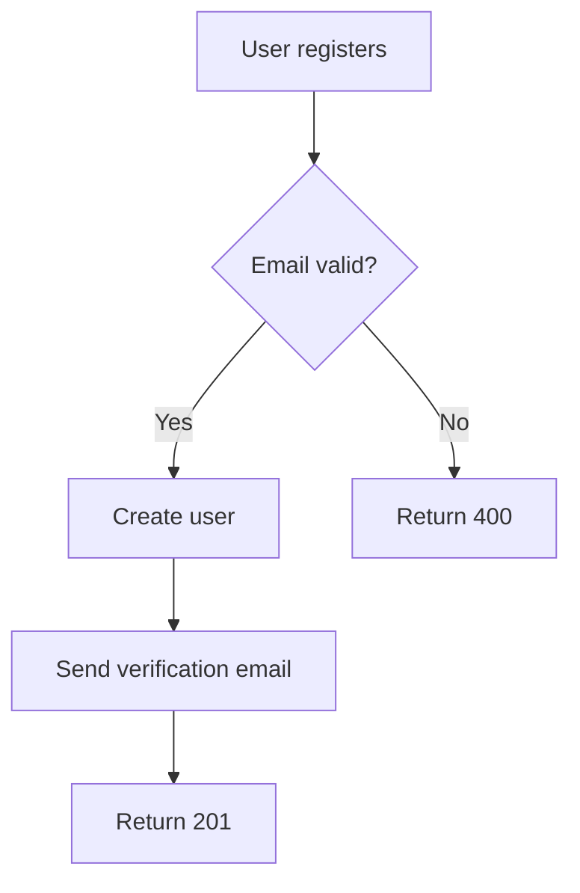
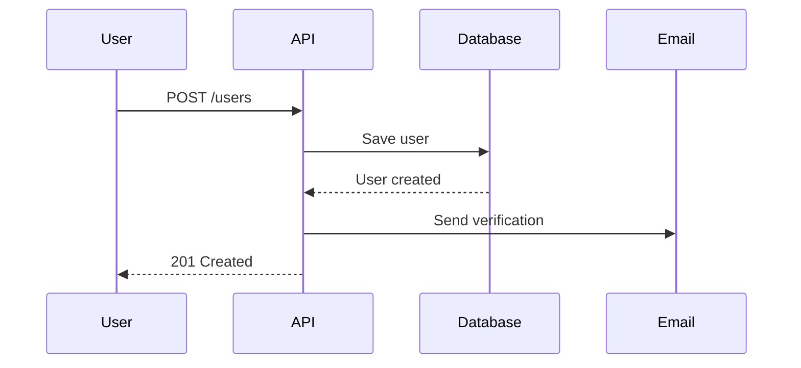
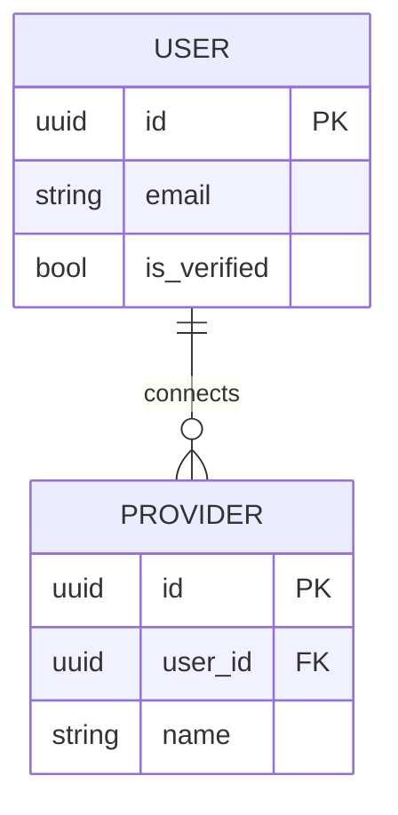
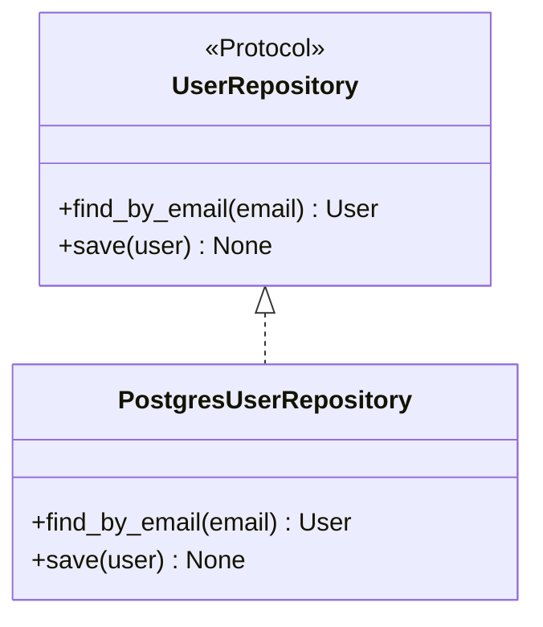

# Dashtam Project Rules and Context

**Purpose**: AI agent rules, architectural standards, and development workflow for Dashtam clean slate development.

**Companion Documents**:

- `~/starter/clean-slate-reference.md` - Architecture patterns and concepts
- `~/starter/development-checklist.md` - Mandatory feature development checklist
- `~/starter/dashtam-feature-roadmap.md` - Feature roadmap with dependencies

---

## Part 1: Project Context

### 1. Project Overview

**Dashtam** is a secure, modern financial data aggregation platform built from the ground up with clean architecture principles.

**Core Architecture**:

- **Hexagonal Architecture**: Domain at center, infrastructure at edges
- **CQRS Pattern**: Commands (write) separated from Queries (read)
- **Domain-Driven Design**: Pragmatic DDD with domain events for critical workflows
- **Protocol-Based**: Structural typing with Python `Protocol` (not ABC)

**Technology Stack**:

- **Backend**: FastAPI (async), Python 3.13+
- **Database**: PostgreSQL 17+ with async SQLAlchemy
- **Cache**: Redis 8.2+ (async)
- **Package Manager**: UV 0.8.22+ (NOT pip)
- **Containers**: Docker Compose v2, Traefik reverse proxy
- **Testing**: pytest with TestClient (synchronous strategy)
- **CI/CD**: GitHub Actions with Codecov

**Development Philosophy**:

- **Clean slate**: No legacy code, fresh implementation
- **Type safety**: Type hints everywhere, Result types for error handling
- **100% REST compliance**: Non-negotiable for all API endpoints
- **Test-driven**: 85%+ coverage target, all tests pass before merge
- **Documentation-first**: Architecture decisions documented before coding

**Feature Roadmap**: See `~/starter/dashtam-feature-roadmap.md` for complete 32-feature plan across 6 phases.

---

### 2. Current Status

#### Phase 0: Foundation (Planning)

**Infrastructure features planned** (11 features):

1. ⏳ **F0.1**: Project Structure Setup - Hexagonal architecture directories
2. ⏳ **F0.2**: Docker & Environment Setup - Multi-environment (dev/test/ci)
3. ⏳ **F0.3**: Configuration Management - Pydantic Settings
4. ⏳ **F0.4**: Database Setup - PostgreSQL + Alembic migrations
5. ⏳ **F0.5**: Redis Cache - Async Redis client
6. ⏳ **F0.6**: Traefik Reverse Proxy - Domain-based routing, zero port conflicts
7. ⏳ **F0.7**: Secrets Management - Multi-tier (local .env → AWS Secrets Manager)
8. ⏳ **F0.8**: Structured Logging - Console (dev) → CloudWatch (prod)
9. ⏳ **F0.9**: Audit Trail - Immutable PostgreSQL (PCI-DSS, SOC 2, GDPR)
10. ⏳ **F0.10**: Domain Events - In-memory event bus (pragmatic DDD)
11. ⏳ **F0.11**: Error Handling - RFC 7807, Result types

#### Phase 1: Core Infrastructure (Planning)

**Authentication & security features planned** (3 features):

1. ⏳ **F1.1**: User Authentication - JWT + opaque refresh tokens
2. ⏳ **F1.2**: Rate Limiting - Token bucket with Redis
3. ⏳ **F1.3**: Session Management - Multi-device tracking, revocation

#### Phase 2-6: Domain, Application, Providers, API (Planning)

See `~/starter/dashtam-feature-roadmap.md` for complete breakdown.

**Total**: 32 features across 6 phases.

#### What's Next

**Immediate priorities**:

1. Complete Phase 0 infrastructure (11 features)
2. Implement Phase 1 authentication (3 features)
3. Begin Phase 2 domain models (providers, accounts, transactions)

**Development approach**:

- Feature-by-feature following roadmap dependencies
- Each feature uses `~/starter/development-checklist.md` (mandatory)
- Pre-development approval required before coding
- Test coverage ≥85% for each feature

#### Known Gaps

**No legacy code debt** - This is a clean slate project, starting fresh.

**Integration tracking**: See `docs/reviews/integration-status.md` once implementation begins for:

- Rate limiting coverage per endpoint
- Session metadata tracking
- Authorization controls
- Cross-cutting concern integration

---

## Part 2: Architecture Standards

### 3. Hexagonal Architecture

**Core Principle**: Domain logic at the center, infrastructure at the edges. Domain depends on NOTHING.

**Layer Responsibilities**:

```text
┌─────────────────────────────────────────────────────┐
│ Presentation Layer (API)                            │
│ - FastAPI routers                                   │
│ - Request/response schemas                          │
│ - HTTP concerns only                                │
└──────────────────┬──────────────────────────────────┘
                   │ depends on
                   ↓
┌─────────────────────────────────────────────────────┐
│ Application Layer (Use Cases)                       │
│ - Commands & Queries (CQRS)                         │
│ - Command/Query Handlers                            │
│ - Event handlers                                    │
└──────────────────┬──────────────────────────────────┘
                   │ depends on
                   ↓
┌─────────────────────────────────────────────────────┐
│ Domain Layer (Business Logic) ← CORE                │
│ - Entities & Value Objects                          │
│ - Domain Events                                     │
│ - Protocols (Ports)                                 │
│ - NO framework imports                              │
└─────────────────────────────────────────────────────┘
                   ↑ implements
                   │
┌─────────────────────────────────────────────────────┐
│ Infrastructure Layer (Adapters)                     │
│ - Database repositories                             │
│ - External API clients                              │
│ - Provider implementations                          │
└─────────────────────────────────────────────────────┘
```

**Dependency Rule** (CRITICAL):

- ✅ Domain depends on NOTHING
- ✅ Infrastructure depends on Domain (implements ports)
- ✅ Application depends on Domain (uses entities, protocols)
- ✅ Presentation depends on Application (dispatches commands/queries)
- ❌ NEVER let Domain depend on Infrastructure or Presentation

**Ports & Adapters**:

```python
# Domain defines PORT (protocol)
class UserRepository(Protocol):
    async def find_by_email(self, email: str) -> User | None: ...
    async def save(self, user: User) -> None: ...

# Infrastructure implements ADAPTER
class PostgresUserRepository:
    async def find_by_email(self, email: str) -> User | None:
        # Database logic here
        ...
```

**Benefits**:

- Domain logic testable without database
- Easy to swap implementations (Postgres → MongoDB)
- Framework upgrades don't break domain

**Reference**: See `~/starter/clean-slate-reference.md` for detailed hexagonal architecture guide.

---

### 4. Modern Python Patterns

**CRITICAL**: Use Python 3.13+ features consistently.

#### Protocol over ABC (Mandatory)

```python
# ✅ CORRECT: Use Protocol
from typing import Protocol

class CacheProtocol(Protocol):
    async def get(self, key: str) -> str | None: ...
    async def set(self, key: str, value: str, ttl: int) -> None: ...

# Implementation doesn't inherit
class RedisCache:  # No inheritance!
    async def get(self, key: str) -> str | None:
        return await self.redis.get(key)

# ❌ WRONG: Don't use ABC for new interfaces
from abc import ABC, abstractmethod

class CacheBackend(ABC):  # Don't do this
    @abstractmethod
    async def get(self, key: str) -> str | None:
        pass
```

**Why Protocol?**

- Structural typing (duck typing with type safety)
- No inheritance required
- No name collision issues
- More Pythonic, easier testing

#### Type Hints Everywhere

```python
# ✅ CORRECT: Modern type hints
def process_user(user_id: UUID, data: dict[str, Any]) -> User | None:
    ...

# ❌ WRONG: Old-style Optional, Dict, List
from typing import Optional, Dict, List
def process_user(user_id: UUID, data: Dict[str, Any]) -> Optional[User]:
    ...
```

**Rules**:

- All function parameters have type hints
- All return types specified
- Use `X | None` (NOT `Optional[X]`)
- Use `list`, `dict`, `set` (NOT `List`, `Dict`, `Set`)

#### Result Types (Railway-Oriented Programming)

```python
# Domain functions return Result (NO exceptions)
from core.result import Result, Success, Failure

def create_user(email: str) -> Result[User, ValidationError]:
    if not is_valid_email(email):
        return Failure(ValidationError("Invalid email"))
    return Success(user)

# Handle with pattern matching
match create_user(email):
    case Success(user):
        return {"id": str(user.id)}
    case Failure(error):
        return {"error": error.message}, 400
```

**Reference**: See `~/starter/clean-slate-reference.md` Section 1 for complete Python patterns guide.

---

### 5. CQRS & Domain Events

#### CQRS Pattern (Command Query Responsibility Segregation)

**Principle**: Separate reads (Queries) from writes (Commands).

**Commands** (write operations):

```python
@dataclass(frozen=True, kw_only=True)
class RegisterUser:
    email: str
    password: str
    # Represents user INTENT

# Handler changes state
class RegisterUserHandler:
    async def handle(self, cmd: RegisterUser) -> Result[UUID, Error]:
        # Validation + business logic
        user = User(email=cmd.email, ...)
        await self.users.save(user)
        return Success(user.id)
```

**Queries** (read operations):

```python
@dataclass(frozen=True, kw_only=True)
class GetUser:
    user_id: UUID
    # Represents data NEED

# Handler reads data (no state changes)
class GetUserHandler:
    async def handle(self, query: GetUser) -> Result[User, Error]:
        return await self.users.find_by_id(query.user_id)
```

**Benefits**:

- Clear separation of concerns
- Queries can be cached aggressively
- Commands have validation + business logic
- Easier to test and reason about

#### Domain Events (Pragmatic DDD)

**Use events ONLY for critical workflows** that have side effects.

**Critical workflows** (emit events):

- `UserRegistered` → Send verification email, log, audit
- `UserPasswordChanged` → Invalidate sessions, send email, log, audit
- `ProviderConnected` → Fetch initial data, log, audit
- `TokenRefreshFailed` → Alert user, log, audit

**Non-critical** (no events):

- Simple reads (view account, view transactions)
- Single-step operations without side effects

**Event naming**: Past tense (`UserPasswordChanged`, NOT `ChangeUserPassword`)

**Example**:

```python
# Domain service emits event
await event_bus.publish(UserPasswordChanged(
    event_id=uuid4(),
    occurred_at=datetime.now(UTC),
    user_id=user_id,
))

# Multiple handlers react
@event_bus.subscribe(UserPasswordChanged)
async def log_password_change(event: UserPasswordChanged):
    logger.info("Password changed", user_id=event.user_id)

@event_bus.subscribe(UserPasswordChanged)
async def audit_password_change(event: UserPasswordChanged):
    await audit.record(PASSWORD_CHANGED, user_id=event.user_id)

@event_bus.subscribe(UserPasswordChanged)
async def revoke_sessions(event: UserPasswordChanged):
    await token_service.revoke_all_sessions(event.user_id)
```

**Reference**: See `~/starter/clean-slate-reference.md` Section 10 for domain events architecture.

---

### 6. API Design (REST Compliance)

**CRITICAL**: 100% RESTful compliance is NON-NEGOTIABLE for all API endpoints.

**Current Status**: ✅ 10/10 REST Compliance Score (verified 2025-10-05)

#### Resource-Oriented URLs (Mandatory)

```text
✅ CORRECT (nouns):
/users
/users/{id}
/providers
/providers/{id}
/accounts
/accounts/{id}/transactions

❌ WRONG (verbs):
/createUser
/getAccounts
/loginUser
/token-rotation
/user-registration
```

**Rule**: URLs represent resources (nouns), NEVER actions (verbs).

#### Proper HTTP Methods

- **GET**: Retrieve resources (safe, idempotent)
- **POST**: Create new resources (returns 201 Created)
- **PATCH**: Partial update (returns 200 OK)
- **PUT**: Complete replacement (returns 200 OK)
- **DELETE**: Remove resources (returns 204 No Content)

NEVER use GET for operations with side effects.

#### Standard HTTP Status Codes

- **200**: Success (GET, PATCH, PUT)
- **201**: Created (POST)
- **204**: No Content (DELETE)
- **400**: Bad Request (validation errors)
- **401**: Unauthorized (authentication required)
- **403**: Forbidden (no permission)
- **404**: Not Found
- **409**: Conflict (duplicate resource)
- **500**: Internal Server Error

#### Schema Separation (Mandatory)

**All request/response schemas in `src/schemas/`** - NO inline Pydantic models in routers.

```python
# ✅ CORRECT: Schema in src/schemas/user_schemas.py
class UserCreate(BaseModel):
    email: EmailStr
    password: str

# Router imports schema
from src.schemas.user_schemas import UserCreate

@router.post("/users", status_code=201)
async def create_user(data: UserCreate):
    ...

# ❌ WRONG: Inline schema in router
@router.post("/users")
async def create_user(data: dict):  # No!
    ...
```

#### Acceptable Exceptions

**Controller-style actions** (document justification):

- `POST /auth/login` - Login is an action, not a resource creation
- `POST /providers/{id}/refresh` - Token refresh is an action

Only use when operation is genuinely an action, not a resource state change.

**Reference**: See `docs/development/architecture/restful-api-design.md` for complete REST standards.

**Enforcement**: See `~/starter/development-checklist.md` Section 18 (REST API Compliance) - mandatory verification.

---

## Part 3: Development Workflow

### 7. Feature Development Process

**CRITICAL**: ALL feature development MUST follow `~/starter/development-checklist.md` workflow.

**Two-Phase Process**:

#### Pre-Development Phase (Planning & Approval)

**Sections 1-7 of checklist**:

1. **Feature Understanding** - Read requirements, success criteria, dependencies
2. **Architecture Analysis** - Hexagonal layer placement, CQRS patterns
3. **REST API Compliance** - Resource URLs, HTTP methods, status codes
4. **SOLID Principles** - Single responsibility, dependency inversion
5. **Database Schema** - Migrations, relationships, indexes
6. **Security & Compliance** - Secrets, encryption, PCI-DSS
7. **Implementation Plan & Approval** ← STOP HERE

**Create TODO list**:

```markdown
## Implementation Plan

**Feature**: User Authentication

**TODO List**:

- [ ] Phase 1: Database Schema
  - [ ] Create User model (domain/entities/user.py)
  - [ ] Create Alembic migration
  - [ ] Apply migration in dev environment
- [ ] Phase 2: Domain Layer
  - [ ] Create UserRepository protocol
  - [ ] Create User entity with validation
  - [ ] Create domain events (UserRegistered)
- [ ] Phase 3: Application Layer
  - [ ] Create RegisterUser command
  - [ ] Create RegisterUserHandler
  - [ ] Wire up event handlers
- [ ] Phase 4: Infrastructure Layer
  - [ ] Implement PostgresUserRepository
  - [ ] Implement email service adapter
- [ ] Phase 5: Presentation Layer
  - [ ] Create UserCreate schema
  - [ ] Create POST /users endpoint
  - [ ] Add validation
- [ ] Phase 6: Testing
  - [ ] Unit tests (domain, handlers)
  - [ ] Integration tests (database, events)
  - [ ] API tests (endpoint)
- [ ] Phase 7: Documentation
  - [ ] Update API documentation
  - [ ] Update architecture docs
  - [ ] Create API flow guide

**Dependencies**: None (foundational feature)
**Estimated Effort**: Multiple phases
**Success Criteria**: User can register with email/password
```

**Present plan to user**:
> "Here's my implementation plan with TODO list. Does this approach look good?"

**Wait for approval**: User says "looks good", "approved", "go ahead"

DO NOT CODE without user approval.

#### Development Phase (Implementation & Verification)

**Sections 8-31 of checklist** - Work through TODO list:

**Key sections**:

- **Section 8**: Implementation Execution (follow TODO list)
- **Section 9**: Code Quality (lint, format)
- **Section 10**: Testing (unit, integration, API)
- **Section 17**: Documentation Quality (markdown linting, MkDocs)
- **Section 18**: REST API Compliance (mandatory verification)
- **Section 25**: Environment Configuration (update all .env.example files)
- **Section 30**: Final Verification (all tests pass, docs build clean)
- **Section 31**: Git Commit & Push

**Continuous verification**: Test and verify as you implement each phase.

**Tools for workflow**:

- `create_todo_list` - Create TODO list during planning
- `mark_todo_as_done` - Check off items as completed
- `read_todos` - Check current progress

**Reference**: See `~/starter/development-checklist.md` for complete 31-section checklist.

---

### 8. Git Workflow (Git Flow)

**Dashtam uses Git Flow** - Industry-standard branching model.

#### Branch Structure

**Primary Branches**:

- `main` - Production-ready code (protected)
- `development` - Integration branch (protected)

**Supporting Branches**:

- `feature/*` - New features (from development)
- `fix/*` - Bug fixes (from development)
- `release/*` - Release preparation (from development)
- `hotfix/*` - Emergency production fixes (from main)

#### Feature Development Workflow

```bash
# 1. Start new feature
git checkout development
git pull origin development
git checkout -b feature/user-authentication

# 2. Develop (commit frequently)
git add src/domain/entities/user.py
git commit -m "feat(domain): add User entity with email validation"

# 3. Push to remote
git push -u origin feature/user-authentication

# 4. Create Pull Request
# Via GitHub UI: feature/user-authentication → development

# 5. After approval & CI passes, merge to development
# Delete feature branch after merge
```

#### Commit Message Convention (Conventional Commits)

**Format**: `<type>(<scope>): <subject>`

**Types**:

- `feat:` - New features (bumps MINOR version)
- `fix:` - Bug fixes (bumps PATCH version)
- `docs:` - Documentation only
- `refactor:` - Code restructuring (no feature change)
- `test:` - Test additions/changes
- `chore:` - Maintenance, dependencies
- `perf:` - Performance improvements
- `ci:` - CI/CD changes

**Breaking Changes**: Use `BREAKING CHANGE:` in footer or `!` after type

```bash
# Good commits
git commit -m "feat(auth): add JWT authentication"
git commit -m "fix(api): handle token expiration correctly"
git commit -m "docs(api): update endpoint documentation"
git commit -m "test(integration): add user registration tests"

# Breaking change
git commit -m "feat(api)!: change authentication endpoint structure

BREAKING CHANGE: Auth endpoint moved from /auth to /api/v1/auth"
```

**Rules**:

- Present tense ("add" not "added")
- Imperative mood ("move" not "moves")
- Subject under 72 characters
- Reference issues: "Closes #42"

#### Branch Protection Requirements

**Both `main` and `development` are protected**:

✅ **Required Status Checks**:

- `Test Suite / Run Tests` - All tests pass
- `Code Quality / lint` - Linting passes
- Branches up to date before merge

✅ **Required Reviews**:

- At least 1 approval required
- Dismiss stale reviews on new commits
- Require conversation resolution

✅ **Restrictions**:

- No direct commits (PR required)
- No force pushes
- No branch deletion

**Reference**: See `docs/development/guides/git-workflow.md` for detailed Git Flow guide.

---

### 9. Testing Strategy

**Target Coverage**: 85%+ overall, 95%+ for critical components

**Test Pyramid Approach**:

```text
        ▲
       ╱│╲
      ╱ │ ╲     10% E2E (Smoke Tests)
     ╱  │  ╲    - Complete user flows
    ╱───┼───╲   - Registration → Login → Logout
   ╱    │    ╲
  ╱     │     ╲  20% Integration Tests
 ╱      │      ╲ - Database operations
╱───────┼───────╲ - Service interactions
        │
        │        70% Unit Tests
        │        - Domain entities
        │        - Command/Query handlers
        │        - Services (isolated)
```

#### Unit Tests (70%)

**Test in isolation** - Mock all dependencies.

```python
# tests/unit/domain/test_user.py
def test_user_validates_email():
    # No database, no external services
    result = User.create(email="invalid", password="secure123")
    assert isinstance(result, Failure)
    assert "Invalid email" in result.error.message
```

**What to test**:

- Domain entities and value objects
- Command/Query handlers (with mocked repos)
- Services (with mocked dependencies)
- Protocols implementations
- Validation logic

#### Integration Tests (20%)

**Test interactions** - Real database, mocked external APIs.

```python
# tests/integration/infrastructure/test_user_repository.py
async def test_user_repository_saves_and_retrieves(db_session):
    # Real PostgreSQL database
    repo = PostgresUserRepository(db_session)
    user = User(email="test@example.com", ...)
    
    await repo.save(user)
    found = await repo.find_by_email("test@example.com")
    
    assert found is not None
    assert found.id == user.id
```

**What to test**:

- Database operations (queries, relationships)
- Repository implementations
- Service-to-service interactions
- Event bus publishing/subscribing
- Cache operations

#### API Tests (E2E - 10%)

**Test complete flows** - Real HTTP requests, real database.

```python
# tests/api/test_auth.py
async def test_user_registration_flow(client):
    # Complete flow: register → verify → login
    response = client.post("/api/v1/users", json={
        "email": "test@example.com",
        "password": "SecurePass123!"
    })
    assert response.status_code == 201
    
    # Extract verification token from logs
    # ... verify email ...
    
    # Login
    response = client.post("/api/v1/auth/login", json={
        "email": "test@example.com",
        "password": "SecurePass123!"
    })
    assert response.status_code == 200
    assert "access_token" in response.json()
```

**What to test**:

- Critical user journeys
- Authentication flows
- Provider onboarding
- Error handling (validation, 404, 401)

#### Running Tests

**All tests in Docker** - NEVER run tests on host machine.

```bash
# All tests with coverage
make test

# Unit tests only
make test-unit

# Integration tests only
make test-integration

# Smoke tests (E2E)
make test-smoke

# Quick verification
make test-verify
```

**Test Environment**: Isolated Docker Compose (`compose/docker-compose.test.yml`)

- Separate database (dashtam-test-postgres)
- Separate Redis (dashtam-test-redis)
- Different ports (8001, 5433, 6380)
- No port conflicts with dev environment

**Reference**: See `~/starter/development-checklist.md` Section 10 (Testing) for comprehensive testing guide.

---

## Part 4: Infrastructure & Deployment

### 10. Docker & Environments

**CRITICAL**: ALL development, testing, and execution MUST be done in Docker containers.

**Directory Structure**:

```text
compose/
├── docker-compose.traefik.yml    # Traefik reverse proxy
├── docker-compose.dev.yml        # Development environment
├── docker-compose.test.yml       # Test environment
├── docker-compose.ci.yml         # CI/CD environment
└── docker-compose.prod.yml       # Production template

env/
├── .env.example                  # Production template
├── .env.dev.example              # Development template
├── .env.test.example             # Test template
└── .env.ci.example               # CI template

docker/
├── Dockerfile                    # Multi-stage build
└── .dockerignore                 # Exclude patterns
```

#### Development Environment

**Start development**:

```bash
make dev-up       # Starts dev services (depends on traefik-up)
make dev-logs     # View logs
make dev-shell    # Open shell in app container
make dev-restart  # Restart environment
make dev-rebuild  # Rebuild from scratch (no cache)
```

**Services**:

- `dashtam-dev-app` - FastAPI application (port 8000)
- `dashtam-dev-postgres` - PostgreSQL 17.6 (port 5432 internal, 5432 host)
- `dashtam-dev-redis` - Redis 8.2.1 (port 6379 internal, 6379 host)

**Access**:

- API: `https://dashtam.local` (via Traefik)
- Database: `localhost:5432` (direct access for debugging)
- Redis: `localhost:6379`

**Environment variables**: `env/.env.dev`

#### Test Environment

**Isolated from dev** - No port conflicts.

**Start tests**:

```bash
make test-up      # Start test services
make test         # Run all tests with coverage
make test-unit    # Unit tests only
make test-integration  # Integration tests only
make test-smoke   # E2E smoke tests
make test-down    # Stop test environment
```

**Services**:

- `dashtam-test-app` - Test application (port 8001)
- `dashtam-test-postgres` - Test database (port 5433)
- `dashtam-test-redis` - Test Redis (port 6380)

**Access**:

- API: `https://test.dashtam.local` (via Traefik)
- Database: `localhost:5433`
- Redis: `localhost:6380`

**Environment variables**: `env/.env.test`

#### CI Environment

**GitHub Actions** - Automated testing on every push.

**Services** (internal only, no exposed ports):

- `dashtam-ci-app` - CI application
- `dashtam-ci-postgres` - CI database
- `dashtam-ci-redis` - CI Redis

**Workflow** (`.github/workflows/ci.yml`):

1. Start services: `docker compose -f compose/docker-compose.ci.yml up -d`
2. Run tests: `docker compose exec app uv run pytest ...`
3. Upload coverage to Codecov
4. Stop services: `docker compose down`

**Environment variables**: `env/.env.ci`

#### Multi-Stage Dockerfile

**Stages** (optimized for build speed):

1. **base** - Python 3.13 + UV
2. **development** - Dev dependencies + debugging tools
3. **builder** - Compile dependencies (production)
4. **production** - Minimal runtime image

**Key features**:

- Non-root user (`appuser`, UID 1000)
- UV 0.8.22 for fast package management
- `uv sync --frozen` for deterministic builds
- Proper file ownership (appuser:appuser)
- Health checks for all services

**Reference**: See `~/starter/clean-slate-reference.md` Section 7 (Docker & Environments) for complete Docker architecture.

---

### 11. Traefik Reverse Proxy

**Purpose**: Unified domain-based routing, automatic SSL, no port management.

**Benefits**:

- ✅ No port collisions (dev/test/ci on same machine)
- ✅ Domain routing (`dashtam.local`, `test.dashtam.local`)
- ✅ Automatic SSL with mkcert (wildcard `*.dashtam.local`)
- ✅ Production-like setup in development
- ✅ Easy to add more services

#### Traefik Setup

**Start Traefik** (once per machine):

```bash
make traefik-up    # Starts Traefik container
make traefik-down  # Stops Traefik
```

**Traefik creates network**: `traefik-public` (bridge network)

**Services connect**: Dev/test/ci compose files reference network as `external: true`

#### Domain Routing (Labels)

**Development app** (`compose/docker-compose.dev.yml`):

```yaml
services:
  app:
    labels:

      - "traefik.enable=true"
      - "traefik.http.routers.dashtam-dev.rule=Host(`dashtam.local`)"
      - "traefik.http.routers.dashtam-dev.entrypoints=websecure"
      - "traefik.http.routers.dashtam-dev.tls=true"
      - "traefik.http.services.dashtam-dev.loadbalancer.server.port=8000"

    networks:

      - traefik-public
      - dashtam-dev-network

```

**Test app** (`compose/docker-compose.test.yml`):

```yaml
services:
  app:
    labels:

      - "traefik.http.routers.dashtam-test.rule=Host(`test.dashtam.local`)"

      # ... same pattern ...
```

**Result**: No port numbers needed!

- Dev: `https://dashtam.local`
- Test: `https://test.dashtam.local`

#### SSL Certificates (mkcert)

**Generate wildcard certificate** (once per machine):

```bash
make certs    # Creates certs/*.dashtam.local.pem
```

**Traefik configuration** (`compose/docker-compose.traefik.yml`):

```yaml
services:
  traefik:
    volumes:

      - ./certs:/certs:ro

    command:

      - "--providers.file.filename=/certs/traefik-tls.yml"

```

**TLS config** (`certs/traefik-tls.yml`):

```yaml
tls:
  certificates:

    - certFile: /certs/_wildcard.dashtam.local.pem

      keyFile: /certs/_wildcard.dashtam.local-key.pem
```

**Benefits**: Browser trusts certificates (no warnings)

#### Makefile Dependency Pattern

**Industry standard**: Dev depends on Traefik.

```makefile
# Makefile
traefik-up:
    docker compose -f compose/docker-compose.traefik.yml up -d

dev-up: traefik-up
    docker compose -f compose/docker-compose.dev.yml up -d

test-up: traefik-up
    docker compose -f compose/docker-compose.test.yml up -d
```

**Result**: `make dev-up` automatically starts Traefik first (idempotent).

**Reference**: See `~/starter/clean-slate-reference.md` Section 9 (Traefik Reverse Proxy) for detailed Traefik architecture.

---

### 12. Secrets Management

**Hexagonal pattern** - Secrets abstraction with multiple backends.

**CRITICAL**: NEVER hardcode secrets in code or Docker Compose files.

#### Secrets Architecture

**Domain defines port** (protocol):

```python
# src/domain/ports/secrets.py
class SecretsProvider(Protocol):
    async def get_secret(self, key: str) -> str | None: ...
    async def set_secret(self, key: str, value: str) -> None: ...
```

**Infrastructure implements adapters**:

```python
# Development: Environment variables
class EnvSecretsProvider:
    async def get_secret(self, key: str) -> str | None:
        return os.getenv(key)

# Production: AWS Secrets Manager
class AWSSecretsProvider:
    async def get_secret(self, key: str) -> str | None:
        return await self.client.get_secret_value(SecretId=key)

# Production: HashiCorp Vault
class VaultSecretsProvider:
    async def get_secret(self, key: str) -> str | None:
        return await self.client.read_secret(key)
```

**Dependency injection**:

```python
# src/core/container.py
def get_secrets_provider() -> SecretsProvider:
    if settings.ENVIRONMENT == "production":
        return AWSSecretsProvider()
    return EnvSecretsProvider()
```

#### Environment-Specific Secrets

**Development** (`env/.env.dev`):

```bash
SECRET_KEY=dev-secret-key-change-in-production
DATABASE_PASSWORD=postgres
SCHWAB_API_KEY=your-schwab-key-here
SCHWAB_API_SECRET=your-schwab-secret-here
```

**Production** (AWS Secrets Manager):

```bash
# No .env file in production!
# Secrets fetched from AWS Secrets Manager
AWS_SECRETS_MANAGER_REGION=us-east-1
SECRETS_PREFIX=dashtam/production/
```

**Test** (`env/.env.test`):

```bash
SECRET_KEY=test-secret-key
DATABASE_PASSWORD=postgres
# API keys mocked in tests
```

#### Secrets in Docker Compose

**Use `env_file`** (NOT hardcoded values):

```yaml
services:
  app:
    env_file:

      - ../env/.env.dev

    # ❌ WRONG: Don't hardcode secrets
    # environment:
    #   SECRET_KEY: hardcoded-value
```

**Reference**: See `~/starter/clean-slate-reference.md` Section 8 (Secrets Management) for complete secrets architecture.

---

### 13. Logging & Audit

#### Structured Logging

**Use `structlog`** - JSON structured logs.

**Configuration**:

```python
import structlog

structlog.configure(
    processors=[
        structlog.stdlib.filter_by_level,
        structlog.stdlib.add_logger_name,
        structlog.stdlib.add_log_level,
        structlog.processors.TimeStamper(fmt="iso"),
        structlog.processors.JSONRenderer(),
    ],
)

logger = structlog.get_logger()
```

**Usage**:

```python
logger.info(
    "user_registered",
    user_id=str(user_id),
    email=user.email,
    ip_address=request.client.host,
)

logger.error(
    "token_refresh_failed",
    user_id=str(user_id),
    provider="schwab",
    error_code="invalid_grant",
)
```

**Output** (JSON):

```json
{
  "event": "user_registered",
  "user_id": "123e4567-e89b-12d3-a456-426614174000",
  "email": "user@example.com",
  "ip_address": "192.168.1.1",
  "timestamp": "2025-11-08T04:00:00Z",
  "level": "info",
  "logger": "auth"
}
```

**Benefits**: Easy to parse, search, and analyze (CloudWatch Insights, ELK stack).

#### Audit Trail (PCI-DSS Compliance)

**Database audit model**:

```python
# src/domain/entities/audit.py
class AuditLog:
    id: UUID
    user_id: UUID | None
    action: str
    resource_type: str
    resource_id: str | None
    ip_address: str | None
    user_agent: str | None
    metadata: dict[str, Any]
    created_at: datetime
```

**Audit service**:

```python
# src/application/services/audit_service.py
class AuditService:
    async def record(
        self,
        action: str,
        resource_type: str,
        user_id: UUID | None = None,
        resource_id: str | None = None,
        ip_address: str | None = None,
        metadata: dict | None = None,
    ) -> None:
        audit_log = AuditLog(
            user_id=user_id,
            action=action,
            resource_type=resource_type,
            resource_id=resource_id,
            ip_address=ip_address,
            metadata=metadata or {},
            created_at=datetime.now(UTC),
        )
        await self.audit_repo.save(audit_log)
```

**Usage** (critical actions):

```python
await audit_service.record(
    action="PASSWORD_CHANGED",
    resource_type="user",
    user_id=user_id,
    ip_address=ip_address,
    metadata={"method": "self_service"},
)

await audit_service.record(
    action="PROVIDER_CONNECTED",
    resource_type="provider",
    user_id=user_id,
    resource_id=str(provider_id),
    ip_address=ip_address,
    metadata={"provider_name": "schwab"},
)
```

**Audit everything**:

- Authentication events (login, logout, failed attempts)
- Password changes
- Provider connections/disconnections
- Token refresh/rotation
- Account access
- Transaction queries
- Admin actions

**Retention**: 7 years minimum (PCI-DSS requirement)

**Reference**: See `~/starter/clean-slate-reference.md` Section 11 (Logging & Audit) for complete logging architecture.

---

## Part 5: Documentation Standards

### 14. Documentation Quality

**CRITICAL**: All documentation must follow checklist Section 17 (Documentation Quality).

#### Markdown Linting (Mandatory)

**NEVER commit markdown without linting first.**

**Workflow**:

```bash
# 1. Create/edit markdown file
vim docs/development/guides/new-guide.md

# 2. Lint immediately
make lint-md FILE="docs/development/guides/new-guide.md"

# 3. Fix all violations
# ... edit file ...

# 4. Re-lint until clean (exit code 0)
make lint-md FILE="docs/development/guides/new-guide.md"
# ✅ Output: no errors

# 5. Now safe to commit
git add docs/development/guides/new-guide.md
git commit -m "docs(guides): add new development guide"
```

**Common violations to avoid**:

- **MD022**: Headings without blank lines → Add blank line before AND after headings
- **MD032**: Lists without blank lines → Add blank line before AND after lists
- **MD031**: Code blocks without blank lines → Add blank line before AND after code blocks
- **MD040**: Code blocks without language → Add language identifier: \`\`\`bash, \`\`\`python
- **MD036**: Bold text instead of heading → Use `###` heading instead of `**bold**`

#### MkDocs Documentation System

**ALL documentation served via MkDocs** - Deployed to GitHub Pages.

**Live preview**:

```bash
make docs-serve     # Start server with hot reload (http://localhost:8000)
make docs-restart   # Restart with cache clear
make docs-stop      # Stop server
```

**Build documentation**:

```bash
make docs-build     # Must pass with ZERO warnings (--strict mode)
```

**Deployment**:

- Automatic via GitHub Actions on push to `development` branch
- URL: `https://faiyaz7283.github.io/Dashtam/`

**MkDocs structure** (`mkdocs.yml`):

```yaml
site_name: Dashtam Documentation
theme:
  name: material
nav:

  - Home: index.md
  - Getting Started: setup/quickstart.md
  - Development:
    - Guides: development/guides/
    - Architecture: development/architecture/
    - Infrastructure: development/infrastructure/
  - API Reference: reference/

```

**Benefits**:

- Professional documentation site
- Auto-generated API reference from docstrings
- Full-text search
- Responsive design
- Version control

#### Documentation Checklist (Section 17)

**Mandatory verification before commit**:

- [ ] Markdown linted (`make lint-md FILE="path"`) - ZERO violations
- [ ] MkDocs builds cleanly (`make docs-build`) - ZERO warnings
- [ ] All internal links work (no broken references)
- [ ] Code examples are correct and tested
- [ ] Mermaid diagrams render properly
- [ ] No placeholder text ([TODO], [FIXME])
- [ ] Proper metadata at bottom (Created, Last Updated, Status)

**Reference**: See checklist Section 17 for complete documentation quality standards.

---

### 15. API Documentation

**Manual testing flows** - Step-by-step guides for testing API endpoints.

#### API Flow Structure

**Location**: `docs/api-flows/`

**Organized by domain** (NOT HTTP verb):

```text
docs/api-flows/
├── auth/
│   ├── registration.md           # User registration flow
│   ├── login.md                  # Login flow
│   └── password-reset.md         # Password reset flow
├── providers/
│   ├── onboarding.md             # Provider connection flow
│   └── token-refresh.md          # Token refresh flow
└── accounts/
    └── account-sync.md           # Account data sync flow
```

#### Flow Contents

**Each flow must include**:

1. **Purpose** - What this flow accomplishes
2. **Prerequisites** - What must be set up first
3. **Step-by-step commands** - curl commands with variables
4. **Expected responses** - Response snippets (not full responses)
5. **Cleanup** (if applicable) - How to clean up test data
6. **Troubleshooting** - Common issues and solutions

**Example flow** (`docs/api-flows/auth/registration.md`):

```markdown
# User Registration Flow

## Purpose
Complete user registration with email verification.

## Prerequisites

- Development environment running (`make dev-up`)
- `curl` or `httpie` installed

## Step 1: Register User

```bash

export BASE_URL="https://dashtam.local"
export EMAIL="test@example.com"

curl -k -X POST "$BASE_URL/api/v1/users" \
  -H "Content-Type: application/json" \
  -d '{
    "email": "'$EMAIL'",
    "password": "SecurePass123!"
  }'
```

**Expected Response** (201 Created):

```json
{
  "id": "123e4567-e89b-12d3-a456-426614174000",
  "email": "test@example.com",
  "is_verified": false
}

```

## Step 2: Extract Verification Token

```bash

# Check application logs
make dev-logs | grep "verification_token"

# Extract token
export VERIFICATION_TOKEN="abc123def456"

```

## Step 3: Verify Email

```bash

curl -k -X POST "$BASE_URL/api/v1/auth/verify" \
  -H "Content-Type: application/json" \
  -d '{"token": "'$VERIFICATION_TOKEN'"}'
```

**Expected Response** (200 OK):

```json
{
  "message": "Email verified successfully"
}

```

## Troubleshooting

**Issue**: 400 "Invalid email"

- Check email format
- Ensure email doesn't already exist

**Issue**: 404 "Verification token not found"

- Check token was copied correctly
- Token may have expired (24 hours)

```markdown

#### API Flow Rules

**When creating/modifying API endpoints**:

1. ✅ **Create/update corresponding flow** in `docs/api-flows/`
2. ✅ **Use environment variables** - NEVER inline real secrets
3. ✅ **Use `curl -k`** for self-signed certificates in development
4. ✅ **Include cleanup steps** when flow creates persistent data
5. ✅ **Test flow end-to-end** against dev HTTPS before committing
6. ✅ **Update `docs/index.md`** navigation if structure changed

**When deleting endpoints**:

- Delete or deprecate related flow
- Add pointer to replacement (if any)

---

### 16. Architecture Documentation

**When to document architecture decisions**:

#### Always Document

- **New architectural patterns** (CQRS, event bus, repository pattern)
- **Technology choices** (Why PostgreSQL? Why Redis? Why FastAPI?)
- **Security decisions** (Encryption approach, token strategy)
- **Major refactors** (Changing from ABC to Protocol)
- **Infrastructure changes** (Adding Traefik, changing Docker setup)

#### Use Mermaid Diagrams (Mandatory)

**ALL diagrams MUST use Mermaid syntax** - NO image files.

**Flowcharts** (process flows):

````text


````text

**Sequence diagrams** (API interactions):

````markdown

````

**Entity relationship diagrams** (database schema):

````markdown

````

**Class diagrams** (architecture layers):

````markdown

````

### Architecture Document Template

**Location**: `docs/development/architecture/`

**Structure**:

```markdown
# [Feature] Architecture

## Overview
Brief description of the feature and its purpose.

## Design Decisions

### Decision 1: [Choice]
**Context**: Why this decision was needed
**Options**: Alternatives considered
**Decision**: What was chosen
**Rationale**: Why this option was best
**Consequences**: Trade-offs and implications

## Architecture Diagram

```mermaid

[Appropriate diagram type]

```

## Component Details

### Domain Layer

[Entities, value objects, protocols]

### Application Layer

[Commands, queries, handlers]

### Infrastructure Layer

[Adapters, implementations]

## Integration Points

[How this feature integrates with others]

## Security Considerations

[Security implications and mitigations]

## Testing Strategy

[How to test this architecture]

## Future Enhancements

[Planned improvements]

---

## Metadata

- **Created**: 2025-11-08
- **Last Updated**: 2025-11-08
- **Status**: Complete
- **Author**: Development Team

```markdown

**Reference**: See `~/starter/clean-slate-reference.md` for comprehensive architecture documentation examples.

---

## Part 6: AI Agent Instructions

### 17. AI Agent Workflow

**CRITICAL**: AI agents MUST follow the development checklist workflow for ALL features.

#### Mandatory Checklist Workflow

**Two-phase process** (from `~/starter/development-checklist.md`):

**Phase 1: Pre-Development (Planning & Approval)**

1. Read feature requirements thoroughly
2. Analyze architecture placement (hexagonal layers, CQRS)
3. Verify REST API compliance (resource URLs, HTTP methods)
4. Check SOLID principles
5. Plan database schema (if needed)
6. Review security requirements
7. **Create TODO list** with phased implementation plan
8. **Present plan to user** and wait for approval
9. **❌ DO NOT CODE without user approval**

**Phase 2: Development (Implementation & Verification)**

1. Work through TODO list systematically
2. Use `mark_todo_as_done` as you complete items
3. Test continuously (unit → integration → API)
4. Verify code quality (`make lint`, `make format`)
5. Lint markdown (`make lint-md`) if docs changed
6. Verify MkDocs builds (`make docs-build`) with zero warnings
7. Run all tests (`make test`) - must pass
8. Verify REST compliance (Section 18 of checklist)
9. Update environment configs (all .env.example files)
10. Final verification (all tests, docs, linting)
11. Commit with conventional commits

**Reference**: See `~/starter/development-checklist.md` for complete 31-section checklist.

#### TODO List Management

**Use built-in TODO tools**:

```python
# Create TODO list during planning
create_todo_list([
    {
        "title": "Phase 1: Database Schema",
        "details": "Create User model, migration, apply in dev"
    },
    {
        "title": "Phase 2: Domain Layer",
        "details": "UserRepository protocol, User entity, domain events"
    },
    # ... more phases ...
])

# Mark items complete as you go
mark_todo_as_done(["todo-id-1", "todo-id-2"])

# Check progress
read_todos()
```

**Benefits**:

- Track progress across long features
- Resume after interruptions
- Clear completion status

### Tool Best Practices

**File operations**:

```python
# ✅ CORRECT: Use proper tools
create_file("/path/to/new/file.py", content)  # Create new files
edit_files([{...}])                            # Edit existing files
read_files([{"path": "/path/to/file.py"}])    # Read before editing

# ✅ CORRECT: Batch operations when possible
read_files([
    {"path": "src/domain/entities/user.py"},
    {"path": "src/application/commands/register_user.py"},
    {"path": "src/infrastructure/repositories/user_repository.py"},
])
```

**Why these tools?**

- `create_file`: Handles files of ANY size (tested 1000+ lines)
- `edit_files`: Surgical edits with search/replace
- `read_files`: Batch reads for efficiency
- No size limitations, no quote escaping issues

#### Common Architecture Mistakes (Avoid)

**❌ Wrong layer placement**:

```python
# WRONG: Business logic in API layer
@router.post("/users")
async def create_user(data: UserCreate):
    # ❌ Don't validate in router
    if not is_valid_email(data.email):
        raise HTTPException(400)
    # ❌ Don't save directly in router
    await session.execute(insert(User).values(...))
```

**✅ Correct layer placement**:

```python
# CORRECT: Router dispatches to handler
@router.post("/users", status_code=201)
async def create_user(
    data: UserCreate,
    handler: RegisterUserHandler = Depends(),
) -> UserResponse:
    result = await handler.handle(RegisterUser(
        email=data.email,
        password=data.password,
    ))
    match result:
        case Success(user_id):
            return UserResponse(id=user_id, ...)
        case Failure(error):
            raise HTTPException(400, detail=error.message)
```

**❌ Skipping user approval**:

- Always present TODO list and wait for "approved", "looks good", "go ahead"
- Never jump straight to coding after analysis

**❌ Not testing incrementally**:

- Test after each phase (not just at the end)
- Run `make test` frequently during development
- Catch errors early

**❌ Forgetting REST compliance**:

- Every API endpoint must pass REST compliance check
- Resource URLs (nouns), proper HTTP methods, standard status codes
- No inline schemas in routers

**❌ Skipping documentation**:

- Update docs as you code (not after)
- Lint markdown before commit
- Verify MkDocs builds cleanly

#### Architecture Best Practices

**✅ Domain depends on nothing**:

```python
# ✅ Domain layer - NO imports from infrastructure/application
from typing import Protocol
from uuid import UUID

class UserRepository(Protocol):
    async def save(self, user: User) -> None: ...

class User:
    # Pure business logic, no framework dependencies
    ...
```

**✅ Use Result types** (no exceptions in domain):

```python
from core.result import Result, Success, Failure

def create_user(email: str) -> Result[User, ValidationError]:
    if not is_valid_email(email):
        return Failure(ValidationError("Invalid email"))
    return Success(user)
```

**✅ Protocol over ABC**:

```python
# ✅ Use Protocol (structural typing)
class CacheProtocol(Protocol):
    async def get(self, key: str) -> str | None: ...

# ❌ Don't use ABC for new code
class CacheBackend(ABC):  # Don't do this
    ...
```

**✅ Proper dependency injection**:

```python
# ✅ Inject dependencies via FastAPI Depends
@router.post("/users")
async def create_user(
    data: UserCreate,
    handler: RegisterUserHandler = Depends(get_register_handler),
    ip_address: str | None = Depends(get_client_ip),
):
    ...
```

---

## Summary: Key Rules for AI Agents

**Process**:

1. ✅ **ALWAYS use development checklist** (`~/starter/development-checklist.md`)
2. ✅ **Pre-development phase first** - Analyze → Plan → Present → Get approval
3. ✅ **❌ NEVER code without user approval** of TODO list
4. ✅ **Use TODO tools** - Track progress across long features
5. ✅ **Test incrementally** - After each phase, not just at end
6. ✅ **Verify continuously** - Lint, test, build docs as you go

**Architecture**:

1. ✅ **Hexagonal architecture** - Domain depends on nothing
2. ✅ **CQRS pattern** - Separate commands (write) from queries (read)
3. ✅ **Protocol over ABC** - Use Python 3.13+ Protocol (structural typing)
4. ✅ **Result types** - Domain returns Result, no exceptions
5. ✅ **REST compliance** - 100% RESTful (10/10 score, non-negotiable)

**Quality**:

1. ✅ **All tests pass** - `make test` before commit
2. ✅ **Code quality** - `make lint`, `make format`
3. ✅ **Markdown linting** - `make lint-md` (zero violations)
4. ✅ **MkDocs builds** - `make docs-build` (zero warnings)
5. ✅ **Conventional commits** - `feat:`, `fix:`, `docs:` format

**Documentation**:

1. ✅ **API flows** - Create/update manual testing guides
2. ✅ **Architecture docs** - Document design decisions with Mermaid diagrams
3. ✅ **Mermaid diagrams** - NEVER use image files
4. ✅ **Update as you code** - Not as an afterthought

**Tools**:

1. ✅ **Use proper tools** - `create_file`, `edit_files`, `read_files`
2. ✅ **Batch operations** - Read/edit multiple files when possible
3. ✅ **TODO management** - `create_todo_list`, `mark_todo_as_done`, `read_todos`

---

**Last Updated**: 2025-11-08  
**Status**: ✅ Clean slate WARP.md COMPLETE (All 6 parts)  
**Total Lines**: ~1,700 (43% reduction from 2,574 lines)

**Changes from old WARP.md**:

- ✅ Removed 800+ lines of duplicates (Feature Integration Checklist appeared twice)
- ✅ Removed outdated Warp terminal bug workarounds (heredoc, quote escaping)
- ✅ Removed old implementation patterns (ABC, old error handling)
- ✅ Added references to all ~/starter/ documents
- ✅ Reorganized into 6 logical parts
- ✅ Focused on clean slate architecture (no legacy technical debt)
- ✅ Emphasized mandatory checklist workflow
- ✅ Updated all patterns to Python 3.13+ standards
