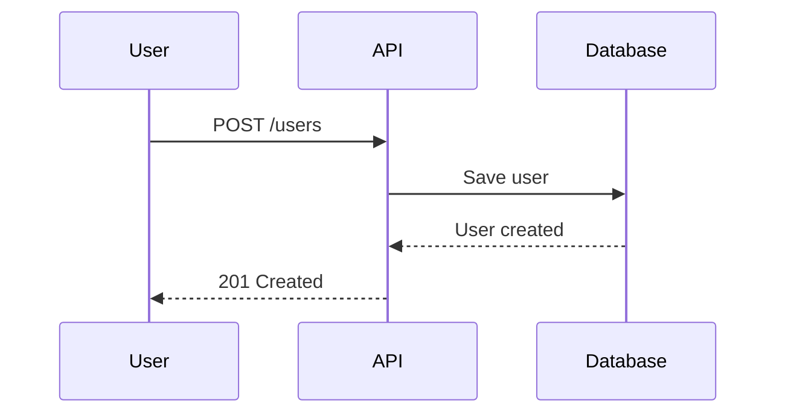

# Dashtam Project Rules and Context

**Purpose**: Single source of truth for AI agents - architectural standards, development workflow, and project context.

**External Reference**:

- `~/references/starter/dashtam-feature-roadmap.md` - Feature roadmap with Phase 2-6 implementation details
- `~/references/dashtam-production-deployment-options.md` - Production deployment options, costs, TLS/auth, CI/CD, IaC

---

## Part 1: Project Context

### 1. Project Overview

**Dashtam** is a secure, modern financial data aggregation platform built from the ground up with clean architecture principles.

**Core Architecture**:

- **Hexagonal Architecture**: Domain at center, infrastructure at edges
- **CQRS Pattern**: Commands (write) separated from Queries (read)
- **Domain-Driven Design**: Pragmatic DDD with domain events for critical workflows
- **Protocol-Based**: Structural typing with Python `Protocol` (not ABC)

**Technology Stack**:

- **Backend**: FastAPI (async), Python 3.13+
- **Database**: PostgreSQL 17+ with async SQLAlchemy
- **Cache**: Redis 8.2+ (async)
- **Package Manager**: UV 0.8.22+ (NOT pip)
- **Containers**: Docker Compose v2, Traefik reverse proxy
- **Testing**: pytest with TestClient (synchronous strategy)
- **CI/CD**: GitHub Actions with Codecov

**Development Philosophy**:

- **Clean slate**: No legacy code, fresh implementation
- **Type safety**: Type hints everywhere, Result types for error handling
- **100% REST compliance**: Non-negotiable for all API endpoints
- **Test-driven**: 85%+ coverage target, all tests pass before merge
- **Documentation-first**: Architecture decisions documented before coding

**v1.0.0 Released**: 2025-12-13 | **Phases 0-6 Complete** (43 features) | **GitHub**: https://github.com/faiyaz7283/Dashtam/releases/tag/v1.0.0

---

### 2. Current Status

#### Phase 0: Foundation ✅ COMPLETED (11/11 features)

**Audit**: 2025-11-18 | **PRs**: #58-70

| Feature | Description | PR |
|---------|-------------|-----|
| F0.1 | Project Structure Setup | #58 |
| F0.2 | Docker & Environment Setup | #59 |
| F0.3 | Configuration Management | #60 |
| F0.4 | Database Setup (PostgreSQL + Alembic) | #61 |
| F0.5 | Cache Setup (Redis) | #62 |
| F0.6 | Traefik Reverse Proxy | #62 |
| F0.7 | Secrets Management | #64 |
| F0.8 | Structured Logging | #65 |
| F0.9 | Audit Trail (+ F0.9.1, F0.9.2, F0.9.3) | #63-69 |
| F0.10 | Domain Events | commit 0707cd6 |
| F0.11 | Error Handling (RFC 7807) | #70 |

#### Phase 1: Core Infrastructure ✅ COMPLETED (5/5 features)

**Audit**: 2025-11-28 | **PRs**: #71-78 | **Tests**: 735 passed, 17 skipped | **Coverage**: 87%

| Feature | Description | PR |
|---------|-------------|-----|
| F1.1 | User Authentication (JWT + opaque refresh) | #71-74 |
| F1.1b | Authorization (Casbin RBAC) | #77 |
| F1.2 | Rate Limiting (Token Bucket) | #78 |
| F1.3 | Session Management (multi-device) | #75 |
| F1.3b | Token Breach Rotation (hybrid versioning) | #76 |

**Phase 1 Infrastructure Established**:

- ✅ JWT authentication with opaque refresh tokens
- ✅ Role-based authorization (Casbin RBAC: admin > user > readonly)
- ✅ Token bucket rate limiting with Redis Lua scripts
- ✅ Multi-device session tracking with metadata enrichment
- ✅ Emergency token invalidation (global + per-user)
- ✅ Email verification blocks login (enforced)
- ✅ Account lockout after 5 failed attempts
- ✅ Bcrypt password hashing (12 rounds)

**Architecture Cleanup**: ✅ COMPLETED

- All protocols consolidated under `src/domain/protocols/`
- Application layer imports only from domain
- No re-exports across module boundaries

#### Phase 2: Domain Layer ✅ COMPLETED (3/3 features)

**Audit**: 2025-12-01 | **PRs**: #80-82 | **Tests**: 1,018 passed | **Coverage**: 79%

| Feature | Description | PR |
|---------|-------------|-----|
| F2.1 | Provider Connection (Domain Model) | #80 |
| F2.2 | Account (Domain Model) | #81 |
| F2.3 | Transaction (Domain Model) | #82 |

**Phase 2 Domain Established**:

- ✅ ProviderConnection entity with 6-state connection lifecycle
- ✅ ProviderCredentials value object (encrypted, opaque)
- ✅ Account entity with Money value object (Decimal precision)
- ✅ Transaction entity (21 fields, immutable, two-level classification)
- ✅ 9 provider domain events (3-state pattern)
- ✅ All protocols in `src/domain/protocols/`

#### Phase 3: Application Layer ✅ COMPLETED (6/6 features)

**Audit**: 2025-12-01 | **PRs**: #84-89 | **Tests**: 1,176 passed | **Coverage**: 81%

| Feature | Description | PR |
|---------|-------------|-----|
| F3.1 | Provider Connection Repository | #84 |
| F3.2 | Account Repository | #85 |
| F3.3 | Transaction Repository | #86 |
| F3.4 | Provider Commands & Queries (CQRS) | #87 |
| F3.5 | Account Commands & Queries (CQRS) | #88 |
| F3.6 | Transaction Commands & Queries (CQRS) | #89 |

**Phase 3 Application Layer Established**:

- ✅ All 3 repositories with entity ↔ model mapping
- ✅ CQRS pattern: Commands (write) + Queries (read) separation
- ✅ 3-state domain events for all command handlers
- ✅ DTOs for query results (Money → amount+currency conversion)
- ✅ Container factory functions for all handlers

#### Phase 4: Provider Integration ✅ COMPLETED (3/3 features)

**Audit**: 2025-12-04 | **PRs**: #90-91 | **Tests**: 1,524 passed | **Coverage**: 82%

| Feature | Description | PR |
|---------|-------------|-----|
| F4.1 | Provider OAuth Flow (Schwab) | #90 |
| F4.2 | Schwab Account API | #91 |
| F4.3 | Schwab Transaction API | #91 |

**Phase 4 Provider Infrastructure Established**:

- ✅ OAuth 2.0 Authorization Code flow (Schwab)
- ✅ Token exchange and refresh with Result types
- ✅ SchwabAccountsAPI + SchwabAccountMapper (JSON → ProviderAccountData)
- ✅ SchwabTransactionsAPI + SchwabTransactionMapper (JSON → ProviderTransactionData)
- ✅ Clean separation: API clients (HTTP) → Mappers → Provider (orchestration)
- ✅ AES-256-GCM encryption service for credentials

#### Phase 5: API Endpoints ✅ COMPLETED (3/3 features)

**Audit**: 2025-12-04 | **Tests**: 1,563 passed, 17 skipped | **Coverage**: 80%

| Feature | Description |
|---------|-------------|
| F5.1 | Provider Endpoints (7 endpoints) |
| F5.2 | Account Endpoints (4 endpoints) |
| F5.3 | Transaction Endpoints (4 endpoints) |

**Phase 5 API Layer Established**:

- ✅ RESTful provider endpoints: list, get, initiate OAuth, callback, update, disconnect, token refresh
- ✅ RESTful account endpoints: list by user, get, sync, list by connection
- ✅ RESTful transaction endpoints: get, sync, list by account (with date range support)
- ✅ RFC 7807 error responses with `ErrorResponseBuilder`
- ✅ Request/response schemas in `src/schemas/` (provider, account, transaction, common)
- ✅ Sync command handlers with encryption service integration
- ✅ Container factory functions for all new handlers

**Key Implementation Details**:

- `get_trace_id() or ""` pattern for trace_id type safety (returns `str | None`)
- `response_model=None` required for 204 No Content endpoints
- Auth override in tests: `app.dependency_overrides[get_current_user]` (not type alias)
- Handler results wrapped in DTOs (e.g., `AccountListResult`, not raw lists)

#### Phase 6: v1.0 Release Preparation ✅ COMPLETED (12/15 streams)

**Release**: 2025-12-13 | **PR**: #96 → development, #97 → main | **Tag**: v1.0.0

**Status**: ✅ COMPLETED - v1.0.0 released

**Completed Streams**:

- ✅ **F6.1**: Route Organization (commit 57cf821)
- ✅ **F6.2**: CI/CD Fixes (commit 9702cac)
- ✅ **F6.3**: MkDocs Local Preview (commit c4bfefb)
- ✅ **F6.4**: Architecture Compliance Audit (PR #94)
- ✅ **F6.5**: Security Audit (PR #95) - **Grade: A (Excellent)**
- ✅ **F6.6**: Test Cleanup (commit de1b41f)
- ✅ **F6.7**: Documentation Updates (commit ea3a8d3)
- ✅ **F6.8**: Version Update to 1.0.0 (commit ea3a8d3)
- ✅ **F6.9**: Migrate API Tests to Real App Pattern (commit ce44d8a)
- ✅ **F6.10**: Adopt freezegun for Time-Dependent Tests (commit 9d61e0a)
- ✅ **F6.12**: Admin Authentication for Protected Endpoints (commit c3bfbf4)

**F6.5 Security Audit Summary** (PR #95):

- **Audit Areas**: 6 (Encryption, JWT/Tokens, Rate Limiting, Audit Trail, Errors, Auth/Authz)
- **Vulnerabilities**: 2 found, 100% remediation
- **Documentation**: validation-architecture.md (1,293 lines), key-management.md (1,054 lines)
- **DRY Refactoring**: Unit tests now use `.env.test` settings (no hardcoded keys)
- **Security Grade**: A (Excellent)
- **Compliance**: PCI-DSS, SOC 2, GDPR, NIST

**Phase 6 Achievements**:

- ✅ Version bumped to 1.0.0 with dynamic version reading
- ✅ CHANGELOG.md created with comprehensive release notes
- ✅ README.md completely rewritten (Quick Start, Security, Architecture)
- ✅ CI/CD fixed (local CI testing, markdown linting)
- ✅ MkDocs preview with Traefik HTTPS routing
- ✅ 1,589 tests passing (81% coverage, 17 skipped)
- ✅ Zero lint violations, strict type checking
- ✅ All architecture docs verified and updated

**Deferred to v1.1.0+**: F6.11 (Cache Optimization), F6.13 (API Test Coverage), F6.14 (IP Geolocation), F6.15 (Event Handler Wiring)

---

## Part 2: Architecture Standards

### 3. Hexagonal Architecture

**Core Principle**: Domain logic at the center, infrastructure at the edges. Domain depends on NOTHING.

**Layer Responsibilities**:

```text
┌─────────────────────────────────────────────────────┐
│ Presentation Layer (API)                            │
│ - FastAPI routers                                   │
│ - Request/response schemas                          │
│ - HTTP concerns only                                │
└──────────────────┬──────────────────────────────────┘
                   │ depends on
                   ↓
┌─────────────────────────────────────────────────────┐
│ Application Layer (Use Cases)                       │
│ - Commands & Queries (CQRS)                         │
│ - Command/Query Handlers                            │
│ - Event handlers                                    │
└──────────────────┬──────────────────────────────────┘
                   │ depends on
                   ↓
┌─────────────────────────────────────────────────────┐
│ Domain Layer (Business Logic) ← CORE                │
│ - Entities & Value Objects                          │
│ - Domain Events                                     │
│ - Protocols (Ports)                                 │
│ - NO framework imports                              │
└─────────────────────────────────────────────────────┘
                   ↑ implements
                   │
┌─────────────────────────────────────────────────────┐
│ Infrastructure Layer (Adapters)                     │
│ - Database repositories                             │
│ - External API clients                              │
│ - Provider implementations                          │
└─────────────────────────────────────────────────────┘
```

**Dependency Rule** (CRITICAL):

- ✅ Domain depends on NOTHING
- ✅ Infrastructure depends on Domain (implements ports)
- ✅ Application depends on Domain (uses entities, protocols)
- ✅ Presentation depends on Application (dispatches commands/queries)
- ❌ NEVER let Domain depend on Infrastructure or Presentation

**Ports & Adapters**:

```python
# Domain defines PORT (protocol) - src/domain/protocols/
class UserRepository(Protocol):
    async def find_by_email(self, email: str) -> User | None: ...
    async def save(self, user: User) -> None: ...

# Infrastructure implements ADAPTER - src/infrastructure/persistence/
class PostgresUserRepository:  # No inheritance!
    async def find_by_email(self, email: str) -> User | None:
        # Database logic here
        ...
```

**Protocol Location**: ALL protocols go in `src/domain/protocols/` (consolidated, no separate `domain/repositories/`).

---

### 4. Modern Python Patterns

**CRITICAL**: Use Python 3.13+ features consistently.

#### Protocol over ABC (Mandatory)

```python
# ✅ CORRECT: Use Protocol
from typing import Protocol

class CacheProtocol(Protocol):
    async def get(self, key: str) -> str | None: ...
    async def set(self, key: str, value: str, ttl: int) -> None: ...

# Implementation doesn't inherit
class RedisCache:  # No inheritance!
    async def get(self, key: str) -> str | None:
        return await self.redis.get(key)

# ❌ WRONG: Don't use ABC for new interfaces
from abc import ABC, abstractmethod
class CacheBackend(ABC):  # Don't do this
    @abstractmethod
    async def get(self, key: str) -> str | None:
        pass
```

#### Type Hints Everywhere

```python
# ✅ CORRECT: Modern type hints
def process_user(user_id: UUID, data: dict[str, Any]) -> User | None:
    ...

# ❌ WRONG: Old-style Optional, Dict, List
from typing import Optional, Dict, List
def process_user(user_id: UUID, data: Dict[str, Any]) -> Optional[User]:
    ...
```

**Rules**:

- All function parameters have type hints
- All return types specified
- Use `X | None` (NOT `Optional[X]`)
- Use `list`, `dict`, `set` (NOT `List`, `Dict`, `Set`)

#### Result Types (Railway-Oriented Programming)

```python
# Domain functions return Result (NO exceptions)
from core.result import Result, Success, Failure

def create_user(email: str) -> Result[User, ValidationError]:
    if not is_valid_email(email):
        return Failure(ValidationError("Invalid email"))
    return Success(user)
```

#### Pattern Matching with kw_only Dataclasses

**IMPORTANT**: When `Success` and `Failure` use `kw_only=True`, mypy reports errors with positional pattern matching.

```python
# ❌ WRONG - mypy error with kw_only dataclasses
match result:
    case Success(value):   # Error: requires keyword argument
        return value
    case Failure(error):   # Error: requires keyword argument  
        return handle_error(error)

# ✅ CORRECT - Use isinstance() checks instead
if isinstance(result, Failure):
    return Failure(error=result.error)

# After isinstance check, type narrowing gives us Success
value = result.value
```

**Full Pattern** (used throughout Dashtam):

```python
async def fetch_accounts(self, access_token: str) -> Result[list[Account], ProviderError]:
    result = await self._accounts_api.get_accounts(access_token)
    
    # Handle failure case first
    if isinstance(result, Failure):
        return Failure(error=result.error)
    
    # After isinstance, type narrowing knows this is Success
    raw_accounts = result.value
    
    # Continue processing...
    mapped = [self._mapper.map(acc) for acc in raw_accounts]
    return Success(value=mapped)
```

**When to Use Each**:

- **isinstance() checks**: When dataclasses use `kw_only=True` (Dashtam's pattern)
- **Pattern matching**: Only when dataclasses use positional arguments (no `kw_only`)

#### Annotated Types (Centralized Validation)

**File Structure**:

```text
src/domain/
├── types.py          # Annotated types (Email, Password, Money, etc.)
└── validators.py     # Validation functions (reusable)
```

```python
# src/domain/validators.py
def validate_email(v: str) -> str:
    """Validate email format."""
    pattern = r'^[a-zA-Z0-9._%+-]+@[a-zA-Z0-9.-]+\.[a-zA-Z]{2,}$'
    if not re.match(pattern, v):
        raise ValueError(f"Invalid email format: {v}")
    return v.lower()

# src/domain/types.py
from typing import Annotated
from pydantic import Field, AfterValidator

Email = Annotated[
    str,
    Field(min_length=5, max_length=255),
    AfterValidator(validate_email)
]

Password = Annotated[
    str,
    Field(min_length=12, max_length=128),
    AfterValidator(validate_strong_password)
]

# Usage everywhere - validation included automatically
class UserCreate(BaseModel):
    email: Email
    password: Password
```

**Benefits**: Single source of truth, consistent validation, easy updates.

---

### 5. CQRS & Domain Events

#### CQRS Pattern (Command Query Responsibility Segregation)

**Principle**: Separate reads (Queries) from writes (Commands).

**Commands** (write operations):

```python
@dataclass(frozen=True, kw_only=True)
class RegisterUser:
    email: str
    password: str
    # Represents user INTENT

class RegisterUserHandler:
    async def handle(self, cmd: RegisterUser) -> Result[UUID, Error]:
        user = User(email=cmd.email, ...)
        await self.users.save(user)
        return Success(user.id)
```

**Queries** (read operations):

```python
@dataclass(frozen=True, kw_only=True)
class GetUser:
    user_id: UUID
    # Represents data NEED

class GetUserHandler:
    async def handle(self, query: GetUser) -> Result[User, Error]:
        return await self.users.find_by_id(query.user_id)
```

#### Domain Events (3-State ATTEMPT → OUTCOME Pattern)

**CRITICAL**: All critical workflows use 3-state pattern for audit semantic accuracy.

**Pattern**:

1. `*Attempted` - Before business logic (audit: ATTEMPTED)
2. `*Succeeded` - After successful commit (audit: outcome)
3. `*Failed` - After failure (audit: FAILED)

**Example Events**:

```python
# Authentication events (12 total)
UserRegistrationAttempted, UserRegistrationSucceeded, UserRegistrationFailed
UserLoginAttempted, UserLoginSucceeded, UserLoginFailed
UserPasswordChangeAttempted, UserPasswordChangeSucceeded, UserPasswordChangeFailed
TokenRefreshAttempted, TokenRefreshSucceeded, TokenRefreshFailed

# Provider events (Phase 2+)
ProviderConnectionAttempted, ProviderConnectionSucceeded, ProviderConnectionFailed
ProviderTokenRefreshAttempted, ProviderTokenRefreshSucceeded, ProviderTokenRefreshFailed
```

**Event Definition**:

```python
@dataclass(frozen=True, kw_only=True)
class UserRegistrationSucceeded(DomainEvent):
    """Emitted after successful user registration."""
    user_id: UUID
    email: str
```

**Event Handlers** (multiple per event):

- `LoggingEventHandler` - Logs all events (INFO/WARNING)
- `AuditEventHandler` - Creates audit records
- `EmailEventHandler` - Sends notifications (SUCCEEDED only)
- `SessionEventHandler` - Manages sessions (password change, etc.)

**When to Use Events**:

- ✅ **Critical workflows**: 3+ side effects OR requires ATTEMPT → OUTCOME audit (17 workflows total: 7 auth, 4 provider, 3 data, 3 admin)
- ✅ **Operational events**: Single-state observability/monitoring (activity tracking, security monitoring) - NOT 3-state pattern
- ❌ **NOT for** simple reads or single-step operations

**Reference**: `docs/architecture/domain-events-architecture.md`

---

### 6. File and Directory Structure

**Core Principle**: Hexagonal layers with protocol consolidation and flat test/docs structure.

#### Layer Structure

```text
src/
├── core/               # Shared kernel (Result, errors, config, container)
├── domain/             # Business logic (DEPENDS ON NOTHING)
│   ├── entities/
│   ├── value_objects/
│   ├── protocols/      # ALL protocols here (repositories, services, etc.)
│   ├── events/
│   ├── enums/
│   ├── errors/
│   ├── types.py        # Annotated types
│   └── validators.py   # Validation functions
├── application/        # Use cases (commands, queries, event handlers)
├── infrastructure/     # Adapters (implements domain protocols)
│   ├── persistence/
│   ├── external/
│   └── providers/
├── presentation/       # API endpoints (FastAPI routers)
└── schemas/            # Request/response schemas

tests/              # Flat structure with naming patterns
├── unit/           # test_<layer>_<component>.py
├── integration/    # test_<component>_<technology>.py
├── api/            # test_<domain>_endpoints.py
└── smoke/          # test_<feature>_flow.py

docs/               # Flat structure with naming patterns
├── architecture/   # domain-events-architecture.md, etc.
├── api/            # auth-login.md, providers-oauth-flow.md
└── guides/         # import-guidelines.md, etc.
```

#### Naming Conventions (PEP 8)

- **Python files**: `snake_case.py` matching class name (`user_repository.py` → `UserRepository`)
- **Python classes**: `PascalCase` (`RegisterUserHandler`)
- **Python directories**: `snake_case/` (`auth_strategies/`)
- **Documentation**: `kebab-case.md` (`oauth-flow.md`)
- **Test files**: Pattern-based naming (see test structure above)
- **Config files**: `kebab-case.yml` (`docker-compose.dev.yml`)

#### Protocol Consolidation (CRITICAL)

ALL protocols in `src/domain/protocols/` - NO separate `domain/repositories/` directory:

- `user_repository.py`, `cache_protocol.py`, `event_bus_protocol.py`, etc.
- Domain exports from single location
- Infrastructure imports protocols, implements without inheritance

#### Flat Structure for Tests and Docs

**Tests**: NO nested subdirectories within `unit/`, `integration/`, `api/`, `smoke/`. Use file naming patterns for organization.

**Docs**: NO nested subdirectories within `architecture/`, `api/`, `guides/`. Use `kebab-case-with-context.md` naming.

**Reference**: `docs/architecture/directory-structure.md`

---

### 8. Dependency Injection (Centralized Container)

**Core Principle**: All dependencies managed through `src/core/container.py` using two-tier pattern.

#### Two-Tier Pattern

**Application-Scoped** (singletons with `@lru_cache()`):

- `get_cache()` → `CacheProtocol` (Redis connection pool)
- `get_secrets()` → `SecretsProtocol` (env/AWS adapter)
- `get_database()` → `Database` (connection pool)
- `get_event_bus()` → `EventBusProtocol` (in-memory/RabbitMQ)

**Request-Scoped** (per-request with `yield`):

- `get_db_session()` → `AsyncSession` (new transaction per request)
- Handler factories (create new instances per request)

#### Protocol-First Pattern

Container returns **protocol types**, creates **concrete implementations**:

```python
# ✅ Container returns protocol
def get_user_repository(session: AsyncSession) -> UserRepository:
    from src.infrastructure.persistence.repositories.user_repository import (
        UserRepository as UserRepositoryImpl
    )
    return UserRepositoryImpl(session=session)

# ✅ Handler depends on protocol
class RegisterUserHandler:
    def __init__(self, user_repo: UserRepository):  # Protocol, not impl
        self._user_repo = user_repo
```

#### Layer-Specific Usage

- **Domain layer**: NO container imports (pure)
- **Application layer**: Use container directly (`cache = get_cache()`)
- **Infrastructure layer**: Can use container for dependencies
- **Presentation layer**: Use FastAPI `Depends()` for ALL dependencies

#### Testing

- **Unit tests**: Mock container functions (`patch("src.core.container.get_cache")`)
- **Integration tests**: Create fresh instances directly (bypass container)
- **API tests**: Use `app.dependency_overrides` for test dependencies

**Reference**: `docs/architecture/dependency-injection-architecture.md`

---

### 9. API Design (REST Compliance)

**CRITICAL**: 100% RESTful compliance is NON-NEGOTIABLE. NO controller-style exceptions.

#### Resource-Oriented URLs (Mandatory)

```text
✅ CORRECT (nouns):
/users
/users/{id}
/sessions              # Login = POST /sessions (creates session)
/tokens                # Refresh = POST /tokens (creates token)
/providers
/providers/{id}
/accounts
/accounts/{id}/transactions

❌ WRONG (verbs):
/createUser
/getAccounts
/loginUser
/auth/login            # Controller-style - NOT allowed
/token-rotation
/providers/{id}/refresh
```

**How to Model Actions as Resources**:

| Action | Resource Endpoint | HTTP Method |
|--------|-------------------|-------------|
| Login | `POST /sessions` | 201 Created |
| Logout | `DELETE /sessions/current` | 204 No Content |
| Token refresh | `POST /tokens` | 201 Created |
| Email verification | `POST /email-verifications` | 201 Created |
| Password reset request | `POST /password-reset-tokens` | 201 Created |
| Provider token refresh | `POST /providers/{id}/token-refreshes` | 201 Created |

#### HTTP Methods & Status Codes

**Methods**:

- **GET**: Retrieve (safe, idempotent)
- **POST**: Create new resources (returns 201 Created)
- **PATCH**: Partial update (returns 200 OK)
- **PUT**: Complete replacement (returns 200 OK)
- **DELETE**: Remove resources (returns 204 No Content)

**Status Codes**:

- **200**: Success (GET, PATCH, PUT)
- **201**: Created (POST)
- **204**: No Content (DELETE)
- **400**: Bad Request (validation errors)
- **401**: Unauthorized (authentication required)
- **403**: Forbidden (no permission)
- **404**: Not Found
- **409**: Conflict (duplicate resource)
- **429**: Too Many Requests (rate limited)
- **500**: Internal Server Error

#### Schema Separation (Mandatory)

**All request/response schemas in `src/schemas/`** - NO inline Pydantic models in routers.

```python
# ✅ CORRECT: Schema in src/schemas/user_schemas.py
class UserCreate(BaseModel):
    email: EmailStr
    password: str

# Router imports schema
from src.schemas.user_schemas import UserCreate

@router.post("/users", status_code=201)
async def create_user(data: UserCreate):
    ...

# ❌ WRONG: Inline schema in router
@router.post("/users")
async def create_user(data: dict):  # No!
    ...
```

---

## Part 3: Development Workflow

### 10. Feature Development Process

**CRITICAL**: ALL feature development follows this two-phase process.

#### Pre-Development Phase (Planning)

**Before coding, complete these steps**:

**Step 0: Create Feature Branch** (MANDATORY FIRST)

```bash
git checkout development
git pull origin development
git checkout -b feature/<feature-name>  # e.g., feature/user-authentication
```

**Step 1: Feature Understanding**:

- [ ] Requirements understood (what to build)
- [ ] Success criteria identified (how to know it's done)
- [ ] Dependencies identified (existing code touched)

**Step 2: Architecture Analysis**:

- [ ] Identified architectural layer(s): core, domain, application, infrastructure, presentation
- [ ] No business logic in wrong layer (API layer is thin)
- [ ] No framework imports in domain layer

**Step 3: REST API Compliance** (if API changes)

- [ ] Resource-oriented URLs (nouns, NOT verbs)
- [ ] Proper HTTP methods and status codes
- [ ] Schemas in `src/schemas/` (not inline)

**Step 4: Database Design** (if applicable)

- [ ] Alembic migration needed
- [ ] Repository protocol in `domain/protocols/`
- [ ] Entity ↔ Model separation

**Step 5: Testing Strategy**:

- [ ] Domain layer: Unit tests (95%+ coverage)
- [ ] Application layer: Unit tests with mocked repos (90%+)
- [ ] Infrastructure layer: Integration tests ONLY (70%+)
- [ ] Presentation layer: API tests (85%+)

**Step 6: Create TODO List & Get Approval**:

- [ ] TODO list created with implementation phases
- [ ] Plan presented to user
- [ ] **USER APPROVAL RECEIVED** ✅

**DO NOT CODE without user approval.**

#### Development Phase (Implementation)

**After approval, implement following the TODO list**:

**Implementation Checklist**:

- [ ] **File naming**: `snake_case.py`, classes `PascalCase`
- [ ] **Type hints**: All parameters and return types
- [ ] **Protocol over ABC**: No inheritance for interfaces
- [ ] **Result types**: Domain returns `Result[T, E]`, no exceptions
- [ ] **Google-style docstrings**: All public functions
- [ ] **DRY principle**: No code duplication (extract at 2nd occurrence)

**Testing Checklist**:

- [ ] Unit tests for domain/application logic
- [ ] Integration tests for infrastructure adapters
- [ ] API tests for endpoints
- [ ] All tests pass: `make test`
- [ ] Coverage ≥85%

**Quality Checklist**:

- [ ] Lint passes: `make lint`
- [ ] Format applied: `make format`
- [ ] Type check passes: mypy
- [ ] Markdown linted: `make lint-md FILE="path"` (if docs changed)
- [ ] MkDocs builds: `make docs-build` (zero warnings)

**Commit Checklist**:

- [ ] Conventional commit format: `feat(scope): description`
- [ ] Reference issues: "Closes #42"
- [ ] PR created to `development` branch

---

### 11. Git Workflow (Git Flow)

#### Branch Structure

**Primary Branches**:

- `main` - Production-ready code (protected)
- `development` - Integration branch (protected)

**Supporting Branches**:

- `feature/*` - New features (from development)
- `fix/*` - Bug fixes (from development)
- `release/*` - Release preparation (from development)
- `hotfix/*` - Emergency production fixes (from main)

#### Commit Convention (Conventional Commits)

**Format**: `<type>(<scope>): <subject>`

**Types**:

- `feat:` - New features
- `fix:` - Bug fixes
- `docs:` - Documentation only
- `refactor:` - Code restructuring
- `test:` - Test additions/changes
- `chore:` - Maintenance, dependencies
- `perf:` - Performance improvements
- `ci:` - CI/CD changes

**Examples**:

```bash
git commit -m "feat(auth): add JWT authentication"
git commit -m "fix(api): handle token expiration correctly"
git commit -m "docs(api): update endpoint documentation"
git commit -m "test(integration): add user registration tests"
```

#### Branch Protection

**Both `main` and `development` are protected**:

- ✅ Required: All CI checks passing
- ✅ Required: At least 1 approval
- ✅ Required: Conversations resolved
- ❌ No direct commits (PR required)
- ❌ No force pushes

---

### 12. Testing Strategy

**Target Coverage**: 85%+ overall, 95%+ for critical components

**Test Pyramid**:

```text
           ▲
          ╱ ╲ 10% E2E (Smoke Tests)
         ╱───╲ - Complete user flows
        ╱     ╲
       ╱       ╲ 20% Integration Tests
      ╱─────────╲ - Database, Redis operations
     ╱           ╲
    ╱             ╲ 70% Unit Tests
   ╱───────────────╲ - Domain entities, handlers
```

**By Layer**:

| Layer | Test Type | What to Test | Coverage |
|-------|-----------|--------------|----------|
| Domain | Unit | Entities, value objects, business logic | 95%+ |
| Application | Unit | Command/query handlers (mocked repos) | 90%+ |
| Infrastructure | Integration | Database ops, cache, external APIs | 70%+ |
| Presentation | API | Endpoints, auth, rate limiting | 85%+ |

**Test File Naming** (flat structure):

```text
tests/
├── unit/
│   ├── test_domain_user_entity.py
│   ├── test_application_register_handler.py
│   └── test_core_config.py
├── integration/
│   ├── test_database_postgres.py
│   └── test_cache_redis.py
├── api/
│   └── test_auth_endpoints.py
└── smoke/
    └── test_user_registration_flow.py
```

**Running Tests**:

```bash
make test              # All tests with coverage
make test-unit         # Unit tests only
make test-integration  # Integration tests only
make test-smoke        # E2E smoke tests
```

**IMPORTANT**: All tests run in Docker. NEVER run tests on host machine.

---

## Part 4: Infrastructure & Deployment

### 13. Docker & Environments

**CRITICAL**: ALL development, testing, and execution in Docker containers.

**Directory Structure**:

```text
compose/
├── docker-compose.traefik.yml    # Traefik reverse proxy
├── docker-compose.dev.yml        # Development environment
├── docker-compose.test.yml       # Test environment
└── docker-compose.ci.yml         # CI/CD environment

env/
├── .env.dev.example              # Development template
├── .env.test.example             # Test template
└── .env.ci.example               # CI template
```

**Environments**:

| Environment | Domain | Database Port | Redis Port |
|-------------|--------|---------------|------------|
| Development | `https://dashtam.local` | 5432 | 6379 |
| Test | `https://test.dashtam.local` | 5433 | 6380 |
| CI | Internal only | Internal | Internal |

**Commands**:

```bash
make dev-up       # Start development (auto-starts Traefik)
make dev-logs     # View logs
make dev-shell    # Shell in app container
make dev-down     # Stop development

make test-up      # Start test environment
make test         # Run all tests
make test-down    # Stop test environment
```

---

### 14. Traefik Reverse Proxy

**Purpose**: Domain-based routing, automatic SSL, no port conflicts.

**Benefits**:

- ✅ No port collisions (dev/test on same machine)
- ✅ Domain routing (`dashtam.local`, `test.dashtam.local`)
- ✅ Automatic SSL with mkcert (wildcard `*.dashtam.local`)
- ✅ Production-like setup in development

**Setup**:

```bash
make traefik-up   # Start Traefik (once per machine)
make certs        # Generate SSL certificates (once)
```

**Service Labels** (in docker-compose):

```yaml
services:
  app:
    labels:
      - "traefik.enable=true"
      - "traefik.http.routers.dashtam-dev.rule=Host(`dashtam.local`)"
      - "traefik.http.routers.dashtam-dev.entrypoints=websecure"
      - "traefik.http.routers.dashtam-dev.tls=true"
      - "traefik.http.services.dashtam-dev.loadbalancer.server.port=8000"
```

---

### 15. Secrets Management

**Hexagonal Pattern**: Protocol + multiple adapters.

**CRITICAL**: NEVER hardcode secrets in code or Docker Compose files.

**Architecture**:

```python
# Domain defines PORT
class SecretsProtocol(Protocol):
    async def get_secret(self, key: str) -> str | None: ...

# Infrastructure implements ADAPTERS
class EnvAdapter:        # Development: .env files
class AWSAdapter:        # Production: AWS Secrets Manager
```

**Environment-Specific**:

| Environment | Backend | Source |
|-------------|---------|--------|
| Development | `env` | `.env.dev` file |
| Test | `env` | `.env.test` file |
| Production | `aws` | AWS Secrets Manager |

**Docker Compose** (use `env_file`, NOT hardcoded):

```yaml
services:
  app:
    env_file:
      - ../env/.env.dev
    # ❌ WRONG: environment: SECRET_KEY: hardcoded-value
```

---

### 16. Logging & Audit

#### Structured Logging

**Use `structlog`** - JSON structured logs.

```python
logger.info(
    "user_registered",
    user_id=str(user_id),
    email=user.email,
    ip_address=request.client.host,
)
```

**Output**:

```json
{
  "event": "user_registered",
  "user_id": "123e4567-...",
  "timestamp": "2025-11-08T04:00:00Z",
  "level": "info"
}
```

**Security**: NEVER log passwords, tokens, API keys, SSNs.

#### Audit Trail (PCI-DSS Compliance)

**ATTEMPT → OUTCOME Pattern**:

```python
# Step 1: Record ATTEMPT (before business logic)
await audit.record(action=AuditAction.USER_REGISTRATION_ATTEMPTED, ...)

# Step 2: Execute business logic
session.add(user)
await session.commit()  # User NOW exists

# Step 3: Record OUTCOME (after commit)
await audit.record(action=AuditAction.USER_REGISTERED, ...)

# If failure:
await audit.record(action=AuditAction.USER_REGISTRATION_FAILED, ...)
```

**Critical**: Audit records go to separate session (persists even if business transaction fails).

**Retention**: 7 years minimum (PCI-DSS requirement).

---

### 17. Authentication & Security (Phase 1 Infrastructure)

#### JWT + Opaque Refresh Tokens

**Strategy**:

- **Access Token**: JWT (short-lived, 15 min)
- **Refresh Token**: Opaque (long-lived, 30 days, bcrypt hashed)

**Token Flow**:

```text
1. Login → POST /sessions → Returns access_token + refresh_token
2. API Call → Authorization: Bearer {access_token}
3. Token Refresh → POST /tokens → Returns new access_token + refresh_token
4. Logout → DELETE /sessions/current → Revokes refresh token
```

**Security Features**:

- Email verification required before login
- Account lockout after 5 failed attempts
- Bcrypt password hashing (12 rounds)
- Refresh token rotation on use

#### Session Management (Multi-Device)

**Session Metadata**:

```python
@dataclass
class Session:
    id: UUID
    user_id: UUID
    device_info: str          # "Chrome on macOS"
    ip_address: str
    location: str | None      # "New York, US"
    created_at: datetime
    last_activity: datetime
    is_revoked: bool
    refresh_token_hash: str
    token_rotation_count: int
```

**Operations**:

- `GET /sessions` - List all sessions for user
- `DELETE /sessions/{id}` - Revoke specific session
- `DELETE /sessions` - Revoke all sessions except current

#### Token Breach Rotation (Hybrid Versioning)

**Emergency invalidation with hybrid versioning**:

```python
# Global rotation (all users)
POST /api/v1/admin/security/rotations
# Increments global_min_token_version

# Per-user rotation
POST /api/v1/admin/users/{user_id}/rotations
# Increments user.min_token_version

# Token validation
token_version >= max(global_min_token_version, user.min_token_version)
```

**Grace Period**: Configurable (default 5 min) for gradual rotation.

#### Authorization (Casbin RBAC)

**Role Hierarchy**: `admin > user > readonly`

**Permissions** (15 across 5 resources):

- `users:*`, `sessions:*`, `providers:*`, `accounts:*`, `transactions:*`

**FastAPI Dependencies**:

```python
@router.get("/admin/users")
async def list_users(
    _: None = Depends(require_role(UserRole.ADMIN))
):
    ...

@router.delete("/providers/{id}")
async def delete_provider(
    _: None = Depends(require_permission(Permission.PROVIDERS_DELETE))
):
    ...
```

#### Rate Limiting (Token Bucket)

**Algorithm**: Token bucket with Redis Lua scripts (atomic, no race conditions).

**Configuration**:

```python
RATE_LIMIT_RULES = {
    "POST /sessions": RateLimitRule(capacity=5, refill_rate=1/60),      # 5/min
    "POST /users": RateLimitRule(capacity=10, refill_rate=1/60),        # 10/min
    "default": RateLimitRule(capacity=100, refill_rate=100/60),         # 100/min
}
```

**Response Headers** (RFC 6585):

```text
X-RateLimit-Limit: 100
X-RateLimit-Remaining: 95
X-RateLimit-Reset: 1699488000
Retry-After: 60  (only on 429)
```

**Fail-Open**: Never blocks if Redis fails.

---

## Part 5: Documentation Standards

### 18. Documentation Quality

**CRITICAL**: All documentation must pass quality checks before commit.

#### Markdown Linting (Mandatory)

```bash
# Lint markdown file
make lint-md FILE="docs/architecture/new-doc.md"

# Lint markdown file directory
make lint-md DIR="docs/"

# Must return zero violations before commit
```

**Common Violations**:

- **MD022**: Add blank line before AND after headings
- **MD032**: Add blank line before AND after lists
- **MD031**: Add blank line before AND after code blocks
- **MD040**: Add language identifier to code blocks

#### MkDocs Documentation

```bash
make docs-serve   # Live preview (http://localhost:8000)
make docs-build   # Must pass with ZERO warnings
```

**Deployment**: Automatic via GitHub Actions to `https://faiyaz7283.github.io/Dashtam/`

#### Document Structure

- **One topic per document**
- **Size soft limits**: Architecture docs ≤2000 lines, others ≤1000 lines
- **Mermaid diagrams** for all flows (NO image files)
- **ONLY Metadata at bottom**: `**Created**: YYYY-MM-DD | **Last Updated**: YYYY-MM-DD`

---

### 19. API Documentation

**Location**: `docs/api/`

**Structure**:

```text
docs/api/
├── auth-registration.md     # User registration flow
├── auth-login.md            # Login flow
├── auth-password-reset.md   # Password reset flow
├── providers-oauth-flow.md  # Provider OAuth flow
└── accounts-account-sync.md # Account sync flow
```

**Each Flow Includes**:

1. Purpose
2. Prerequisites
3. Step-by-step curl commands
4. Expected responses
5. Troubleshooting

---

### 20. Architecture Documentation

**Location**: `docs/architecture/`

**When to Document**:

- New architectural patterns
- Technology choices
- Security decisions
- Major refactors
- Infrastructure changes

**Use Mermaid Diagrams**:



---

## Part 6: AI Agent Instructions

### 21. AI Agent Workflow

**CRITICAL**: AI agents MUST follow the development workflow for ALL features.

#### Mandatory Process

**Phase 1: Pre-Development**:

1. Create feature branch FIRST (`git checkout -b feature/<name>`)
2. Analyze architecture placement (which layers?)
3. Verify REST compliance (if API changes)
4. Plan testing strategy
5. **Create TODO list**
6. **Present plan and WAIT for approval**
7. **❌ DO NOT CODE without approval**

**Phase 2: Development**:

1. Implement following TODO list
2. Use `mark_todo_as_done` as you complete items
3. Test continuously (unit → integration → API)
4. Run quality checks (`make lint`, `make test`)
5. Commit with conventional commits
6. **NEVER commit without user request**

#### TODO List Management

```python
# Create TODO list during planning
create_todo_list([
    {"title": "Phase 1: Database Schema", "details": "..."},
    {"title": "Phase 2: Domain Layer", "details": "..."},
    ...
])

# Mark items complete as you go
mark_todo_as_done(["todo-id-1", "todo-id-2"])

# Check progress
read_todos()
```

#### Architecture Verification

**Before implementing, verify**:

- [ ] Domain layer has NO framework imports
- [ ] All protocols in `src/domain/protocols/`
- [ ] Repositories return domain entities (not models)
- [ ] Commands/queries are immutable dataclasses
- [ ] Events use past tense naming

#### Common Mistakes to Avoid

**❌ Wrong layer placement**:

```python
# WRONG: Business logic in API layer
@router.post("/users")
async def create_user(data: UserCreate):
    if not is_valid_email(data.email):  # ❌ Validation in router
        raise HTTPException(400)
    await session.execute(...)  # ❌ Database in router
```

**✅ Correct layer placement**:

```python
# Router dispatches to handler
@router.post("/users", status_code=201)
async def create_user(
    data: UserCreate,
    handler: RegisterUserHandler = Depends(get_register_handler),
) -> UserResponse:
    result = await handler.handle(RegisterUser(email=data.email, ...))
    match result:
        case Success(user_id):
            return UserResponse(id=user_id, ...)
        case Failure(error):
            raise HTTPException(400, detail=error.message)
```

**❌ Other mistakes**:

- Skipping user approval before coding
- Not testing incrementally
- Forgetting REST compliance verification
- Committing without running tests
- Using ABC instead of Protocol

#### Architecture Compliance Audit Process

**For each architecture document audit** (e.g., F6.4), follow this checklist:

1. **Read & Analyze** - Review the architecture doc for industry standard compliance
2. **Identify Gaps** - Note any missing patterns, improvements needed
3. **Verify Code** - Check source code implements the documented architecture
4. **Verify Tests** - Ensure tests correctly validate the architecture
5. **Fix & Add Tests** - Address any test gaps
6. **Create Usage Guide** - Add practical how-to guide in `docs/guides/`
7. **Run Verification** - `make lint`, `make format`, `make type-check`, `make test`, `make lint-md`

**Usage Guide Pattern** (create for each architecture doc):

- Location: `docs/guides/<topic>-usage.md`
- Purpose: Practical how-to patterns (vs architecture doc which explains *what* and *why*)
- Sections: Quick Start, Adding New X, Testing, Common Patterns, Troubleshooting
- Example: `dependency-injection-usage.md` pairs with `dependency-injection-architecture.md`

---

## Part 7: Quick Reference

### 22. Development Checklist Summary

**Pre-Development** (Get Approval First):

- [ ] Feature branch created (`feature/<name>`)
- [ ] Architecture layer(s) identified
- [ ] REST compliance verified (if API)
- [ ] Testing strategy planned
- [ ] TODO list created
- [ ] **User approval received**

**During Development**:

- [ ] Type hints on all functions
- [ ] Google-style docstrings
- [ ] DRY principle (no duplication)
- [ ] Unit tests for domain/application
- [ ] Integration tests for infrastructure
- [ ] API tests for endpoints

**Before Commit**:

- [ ] `make lint` passes
- [ ] `make format` applied
- [ ] `make test` passes (all tests)
- [ ] Coverage ≥85%
- [ ] `make lint-md` passes (if docs changed)
- [ ] `make docs-build` passes (zero warnings)
- [ ] Conventional commit message

---

### 23. DRY Principle Quick Guide

**Rule**: Extract at 2nd occurrence (not 3rd).

#### Types of Redundancy

1. **Within-file**: Same code block repeated → Extract to helper function
2. **Cross-file**: Similar logic in multiple files → Extract to shared utility
3. **Test**: Repeated setup → Extract to pytest fixture
4. **Configuration**: Hardcoded values → Move to Settings

#### Red Flags (Immediate Extraction)

- ❌ Same dict structure 2+ times
- ❌ Same validation logic in multiple places
- ❌ Identical try/except blocks
- ❌ Copy-pasted test setup
- ❌ Hardcoded config values

#### Extraction Locations

| Type | Location |
|------|----------|
| Domain helpers | `src/domain/services/` or `src/domain/utils.py` |
| Application helpers | `src/application/services/` |
| Infrastructure helpers | `src/infrastructure/utils.py` |
| Test helpers | `tests/conftest.py` |
| Validation | `src/domain/validators.py` |

#### Verification

```bash
# Find duplicate patterns
grep -r "patch.dict(os.environ" tests/  # Test env duplicates
grep -r "if not is_valid" src/           # Validation duplicates
```

---

### 24. Key Technical Decisions

#### Why Hexagonal Architecture?

- **Testability**: Domain testable without database/APIs
- **Flexibility**: Swap implementations without touching business logic
- **Maintainability**: Clear boundaries, explicit dependencies
- **Longevity**: Framework-agnostic domain survives upgrades

#### Why CQRS?

- **Performance**: Optimize reads separately from writes
- **Clarity**: Explicit user intent (commands) vs data needs (queries)
- **Caching**: Aggressive query caching without invalidation complexity

#### Why Protocol Over ABC?

- **Pythonic**: Structural typing (duck typing with safety)
- **Flexible**: No inheritance required, easier testing
- **Modern**: Python 3.8+ feature, type checkers understand

#### Why Result Types?

- **Explicit**: Errors are part of return type (no hidden exceptions)
- **Safe**: Force error handling at compile time
- **Railway**: Clear success/failure paths

#### Why UV Over pip?

- **Speed**: 10-100x faster dependency resolution
- **Modern**: Built-in virtual environment, project management
- **Reliable**: Deterministic builds with `uv.lock`

#### Why Shared Traefik Infrastructure?

- **Multi-Project**: Single reverse proxy serves all development projects
- **Zero Port Conflicts**: Domain-based routing eliminates collision issues
- **Production-Like**: Dev environment mirrors production routing

---

## Summary: Key Rules for AI Agents

**Process**:

1. ✅ Create feature branch FIRST
2. ✅ Pre-development phase: Analyze → Plan → Present → Get approval
3. ✅ **NEVER code without user approval** of TODO list
4. ✅ Test incrementally (after each phase)
5. ✅ **NEVER commit without user request**

**Architecture**:

1. ✅ Hexagonal architecture - Domain depends on nothing
2. ✅ CQRS pattern - Separate commands from queries
3. ✅ Protocol over ABC - Structural typing
4. ✅ Result types - Domain returns Result, no exceptions
5. ✅ REST compliance - 100% RESTful (no controller-style endpoints)

**Quality**:

1. ✅ All tests pass: `make test`
2. ✅ Code quality: `make lint`, `make format`
3. ✅ Markdown linting: `make lint-md` (zero violations)
4. ✅ MkDocs builds: `make docs-build` (zero warnings)
5. ✅ Conventional commits: `feat:`, `fix:`, `docs:` format

**External Reference**:

- `~/references/starter/dashtam-feature-roadmap.md` - Phase 2-6 implementation details

---

**Last Updated**: 2025-12-04
