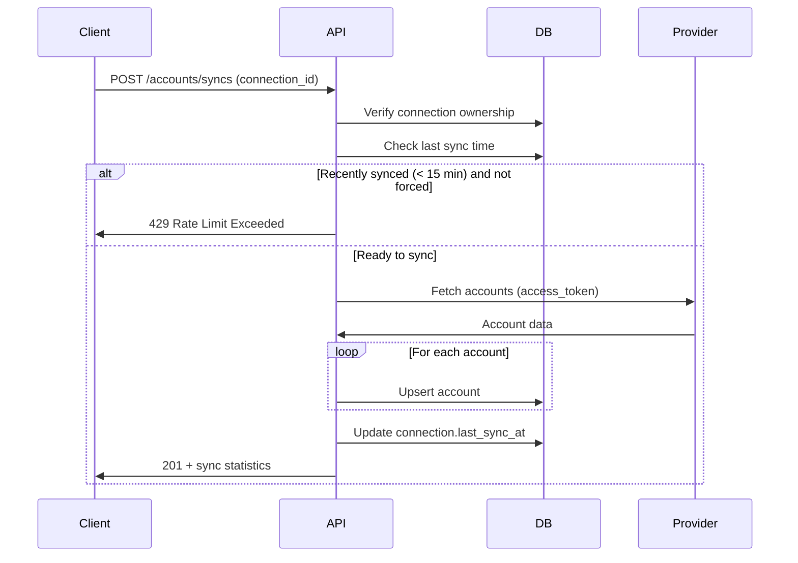

# Account Operations API

## Overview

This document describes the account API endpoints for Dashtam.
Accounts represent financial accounts (brokerage, IRA, etc.) linked via provider connections.

**Base URL**: `{BASE_URL}` (used in examples below)

| Environment | BASE_URL |
|-------------|----------|
| Development | `https://dashtam.local/api/v1` |
| Test | `https://test.dashtam.local/api/v1` |
| Production | `https://api.dashtam.com/api/v1` |

**Authentication**: All endpoints require JWT Bearer token.

---

## Endpoints Summary

| Resource | Method | Endpoint | Description |
|----------|--------|----------|-------------|
| Accounts | GET | `/accounts` | List all accounts for user |
| Accounts | GET | `/accounts/{id}` | Get account details |
| Account Syncs | POST | `/accounts/syncs` | Sync accounts from provider |
| Provider Accounts | GET | `/providers/{id}/accounts` | List accounts for a connection |

---

## List All Accounts

### GET /accounts

List all accounts for the authenticated user across all provider connections.

**Request:**

```bash
curl -k -X GET "{BASE_URL}/accounts" \
  -H "Authorization: Bearer <access_token>"
```

**Query Parameters:**

| Parameter | Type | Required | Description |
|-----------|------|----------|-------------|
| active_only | boolean | No | Only return active accounts (default: false) |
| account_type | string | No | Filter by account type (e.g., "brokerage", "ira") |

**Success Response (200 OK):**

```json
{
  "accounts": [
    {
      "id": "550e8400-e29b-41d4-a716-446655440000",
      "connection_id": "123e4567-e89b-12d3-a456-426614174000",
      "provider_account_id": "12345678",
      "account_number_masked": "****1234",
      "name": "Individual Brokerage",
      "account_type": "brokerage",
      "balance": "25000.50",
      "currency": "USD",
      "available_balance": "24500.00",
      "is_active": true,
      "last_synced_at": "2025-12-04T15:30:00Z",
      "created_at": "2025-12-01T10:00:00Z",
      "updated_at": "2025-12-04T15:30:00Z"
    },
    {
      "id": "660e8400-e29b-41d4-a716-446655440001",
      "connection_id": "123e4567-e89b-12d3-a456-426614174000",
      "provider_account_id": "87654321",
      "account_number_masked": "****5678",
      "name": "Roth IRA",
      "account_type": "roth_ira",
      "balance": "50000.00",
      "currency": "USD",
      "available_balance": null,
      "is_active": true,
      "last_synced_at": "2025-12-04T15:30:00Z",
      "created_at": "2025-12-01T10:00:00Z",
      "updated_at": "2025-12-04T15:30:00Z"
    }
  ],
  "total": 2,
  "active_count": 2,
  "total_balance_by_currency": {
    "USD": "75000.50"
  }
}
```

---

## Get Account

### GET /accounts/{id}

Get details of a specific account.

**Request:**

```bash
curl -k -X GET "{BASE_URL}/accounts/550e8400-e29b-41d4-a716-446655440000" \
  -H "Authorization: Bearer <access_token>"
```

**Success Response (200 OK):**

```json
{
  "id": "550e8400-e29b-41d4-a716-446655440000",
  "connection_id": "123e4567-e89b-12d3-a456-426614174000",
  "provider_account_id": "12345678",
  "account_number_masked": "****1234",
  "name": "Individual Brokerage",
  "account_type": "brokerage",
  "balance": "25000.50",
  "currency": "USD",
  "available_balance": "24500.00",
  "is_active": true,
  "last_synced_at": "2025-12-04T15:30:00Z",
  "created_at": "2025-12-01T10:00:00Z",
  "updated_at": "2025-12-04T15:30:00Z"
}
```

**Error Responses:**

- `404 Not Found` - Account not found
- `403 Forbidden` - Not authorized to access this account

---

## Sync Accounts

### POST /accounts/syncs

Sync accounts from a provider connection. Fetches latest account data from provider and updates database.

**Request:**

```bash
curl -k -X POST "{BASE_URL}/accounts/syncs" \
  -H "Authorization: Bearer <access_token>" \
  -H "Content-Type: application/json" \
  -d '{
    "connection_id": "123e4567-e89b-12d3-a456-426614174000",
    "force": false
  }'
```

**Request Body:**

| Field | Type | Required | Description |
|-------|------|----------|-------------|
| connection_id | UUID | Yes | Provider connection to sync from |
| force | boolean | No | Force sync even if recently synced (default: false) |

**Success Response (201 Created):**

```json
{
  "created": 0,
  "updated": 2,
  "unchanged": 0,
  "errors": 0,
  "message": "Successfully synced 2 accounts",
  "accounts_created": 0,
  "accounts_updated": 2
}
```

**Error Responses:**

- `404 Not Found` - Connection not found
- `403 Forbidden` - Not authorized to sync this connection
- `429 Too Many Requests` - Sync rate limit exceeded (try again later)

**Notes:**

- Default sync interval is 15 minutes; use `force: true` to bypass
- Sync creates new accounts or updates existing ones based on provider_account_id
- Connection must be in ACTIVE status

---

## List Accounts by Connection

### GET /providers/{id}/accounts

List all accounts for a specific provider connection.

**Request:**

```bash
curl -k -X GET "{BASE_URL}/providers/123e4567-e89b-12d3-a456-426614174000/accounts" \
  -H "Authorization: Bearer <access_token>"
```

**Query Parameters:**

| Parameter | Type | Required | Description |
|-----------|------|----------|-------------|
| active_only | boolean | No | Only return active accounts (default: false) |

**Success Response (200 OK):**

```json
{
  "accounts": [
    {
      "id": "550e8400-e29b-41d4-a716-446655440000",
      "connection_id": "123e4567-e89b-12d3-a456-426614174000",
      "provider_account_id": "12345678",
      "account_number_masked": "****1234",
      "name": "Individual Brokerage",
      "account_type": "brokerage",
      "balance": "25000.50",
      "currency": "USD",
      "is_active": true,
      "last_synced_at": "2025-12-04T15:30:00Z"
    }
  ],
  "total": 1,
  "active_count": 1
}
```

**Error Responses:**

- `404 Not Found` - Connection not found
- `403 Forbidden` - Not authorized to access this connection

---

## Account Types

| Type | Description |
|------|-------------|
| brokerage | Standard brokerage account |
| ira | Traditional IRA |
| roth_ira | Roth IRA |
| sep_ira | SEP IRA |
| simple_ira | SIMPLE IRA |
| 401k | 401(k) retirement account |
| 403b | 403(b) retirement account |
| checking | Checking account |
| savings | Savings account |
| money_market | Money market account |
| cd | Certificate of deposit |
| hsa | Health savings account |
| education | Education savings (529, etc.) |
| trust | Trust account |
| other | Other account type |

---

## Account Sync Flow



---

## Error Response Format (RFC 7807)

All errors follow RFC 7807 Problem Details format:

```json
{
  "type": "https://api.dashtam.com/errors/not_found",
  "title": "Not Found",
  "status": 404,
  "detail": "Account not found",
  "instance": "/api/v1/accounts/550e8400-e29b-41d4-a716-446655440000",
  "trace_id": "abc123-def456-ghi789"
}
```

---

**Created**: 2025-12-04 | **Last Updated**: 2025-12-04
