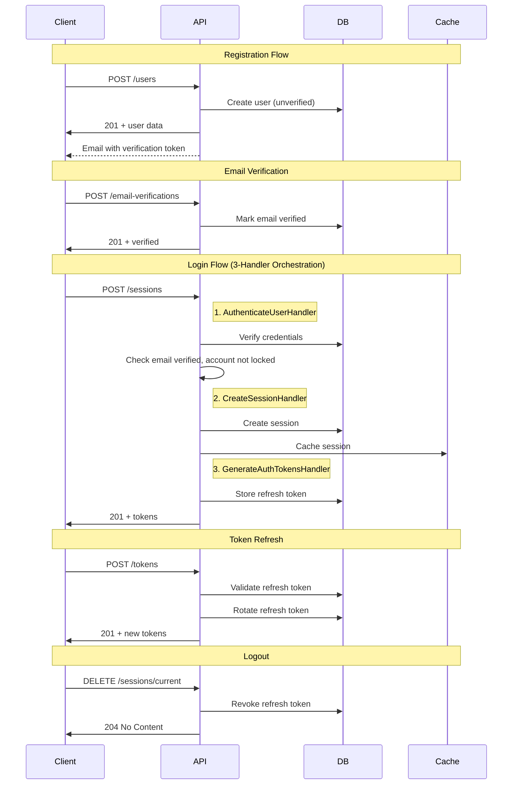

# Authentication API

## Overview

This document describes the authentication API endpoints for Dashtam.
All authentication endpoints follow RESTful conventions with resource-based URLs.

**Base URL**: `https://dashtam.local/api/v1`

---

## Endpoints Summary

| Resource | Method | Endpoint | Description |
|----------|--------|----------|-------------|
| Users | POST | `/users` | Register new user |
| Sessions | POST | `/sessions` | Login (create session) |
| Sessions | GET | `/sessions` | List all sessions |
| Sessions | GET | `/sessions/{session_id}` | Get session details |
| Sessions | DELETE | `/sessions/current` | Logout (end current session) |
| Sessions | DELETE | `/sessions/{session_id}` | Revoke specific session |
| Sessions | DELETE | `/sessions` | Revoke all other sessions |
| Tokens | POST | `/tokens` | Refresh access token |
| Email Verifications | POST | `/email-verifications` | Verify email |
| Password Reset Tokens | POST | `/password-reset-tokens` | Request password reset |
| Password Resets | POST | `/password-resets` | Confirm password reset |

---

## User Registration

### POST /users

Register a new user account.

**Request:**

```bash
curl -k -X POST "https://dashtam.local/api/v1/users" \
  -H "Content-Type: application/json" \
  -d '{
    "email": "user@example.com",
    "password": "SecurePassword123!"
  }'
```

**Success Response (201 Created):**

```json
{
  "id": "550e8400-e29b-41d4-a716-446655440000",
  "email": "user@example.com",
  "is_verified": false,
  "created_at": "2025-11-25T19:00:00Z"
}
```

**Error Responses:**

- `400 Bad Request` - Invalid email format or weak password
- `409 Conflict` - Email already registered

**Notes:**

- Password must be 8+ characters with uppercase, lowercase, number, and special character
- Verification email is sent automatically
- User cannot login until email is verified

---

## Login (Create Session)

### POST /sessions

Authenticate user and create a session.

**Request:**

```bash
curl -k -X POST "https://dashtam.local/api/v1/sessions" \
  -H "Content-Type: application/json" \
  -d '{
    "email": "user@example.com",
    "password": "SecurePassword123!"
  }'
```

**Success Response (201 Created):**

```json
{
  "access_token": "eyJhbGciOiJIUzI1NiIs...",
  "refresh_token": "dGhpcyBpcyBhIHJlZnJlc2ggdG9rZW4...",
  "token_type": "bearer",
  "expires_in": 900
}
```

**Error Responses:**

- `401 Unauthorized` - Invalid credentials
- `403 Forbidden` - Email not verified / Account locked / Account inactive

**Notes:**

- Access token expires in 15 minutes (900 seconds)
- Refresh token is used to obtain new access tokens
- Store tokens securely (httpOnly cookies recommended)

---

## Session Management

### GET /sessions

List all active sessions for the current user.

**Request:**

```bash
curl -k -X GET "https://dashtam.local/api/v1/sessions" \
  -H "Authorization: Bearer <access_token>"
```

**Success Response (200 OK):**

```json
{
  "sessions": [
    {
      "id": "550e8400-e29b-41d4-a716-446655440000",
      "ip_address": "192.168.1.1",
      "user_agent": "Mozilla/5.0...",
      "created_at": "2025-11-25T19:00:00Z",
      "last_active_at": "2025-11-25T20:00:00Z",
      "is_current": true
    }
  ],
  "total_count": 1
}
```

---

### GET /sessions/{session_id}

Get details of a specific session.

**Request:**

```bash
curl -k -X GET "https://dashtam.local/api/v1/sessions/{session_id}" \
  -H "Authorization: Bearer <access_token>"
```

**Success Response (200 OK):**

```json
{
  "id": "550e8400-e29b-41d4-a716-446655440000",
  "ip_address": "192.168.1.1",
  "user_agent": "Mozilla/5.0...",
  "created_at": "2025-11-25T19:00:00Z",
  "last_active_at": "2025-11-25T20:00:00Z",
  "is_current": false
}
```

**Error Responses:**

- `401 Unauthorized` - Invalid or expired token
- `404 Not Found` - Session not found or not owned by user

---

### DELETE /sessions/current

End the current session (logout).

**Request:**

```bash
curl -k -X DELETE "https://dashtam.local/api/v1/sessions/current" \
  -H "Authorization: Bearer <access_token>"
```

**Success Response (204 No Content):**

No body returned.

**Error Responses:**

- `401 Unauthorized` - Invalid or expired token

**Notes:**

- Refresh token is revoked server-side
- Client should discard stored tokens

---

### DELETE /sessions/{session_id}

Revoke a specific session (logout that device).

**Request:**

```bash
curl -k -X DELETE "https://dashtam.local/api/v1/sessions/{session_id}" \
  -H "Authorization: Bearer <access_token>"
```

**Success Response (204 No Content):**

No body returned.

**Error Responses:**

- `401 Unauthorized` - Invalid or expired token
- `404 Not Found` - Session not found or not owned by user

---

### DELETE /sessions

Revoke all sessions except the current one (logout everywhere else).

**Request:**

```bash
curl -k -X DELETE "https://dashtam.local/api/v1/sessions" \
  -H "Authorization: Bearer <access_token>"
```

**Success Response (200 OK):**

```json
{
  "revoked_count": 3,
  "message": "All other sessions revoked"
}
```

**Error Responses:**

- `401 Unauthorized` - Invalid or expired token

---

## Refresh Token

### POST /tokens

Obtain a new access token using a refresh token.

**Request:**

```bash
curl -k -X POST "https://dashtam.local/api/v1/tokens" \
  -H "Content-Type: application/json" \
  -d '{
    "refresh_token": "dGhpcyBpcyBhIHJlZnJlc2ggdG9rZW4..."
  }'
```

**Success Response (201 Created):**

```json
{
  "access_token": "eyJhbGciOiJIUzI1NiIs...",
  "refresh_token": "bmV3IHJlZnJlc2ggdG9rZW4...",
  "token_type": "bearer",
  "expires_in": 900
}
```

**Error Responses:**

- `401 Unauthorized` - Invalid or expired refresh token

**Notes:**

- Old refresh token is revoked (rotation)
- New refresh token is issued with each refresh

---

## Email Verification

### POST /email-verifications

Verify user email with token from verification email.

**Request:**

```bash
curl -k -X POST "https://dashtam.local/api/v1/email-verifications" \
  -H "Content-Type: application/json" \
  -d '{
    "token": "abc123def456..."
  }'
```

**Success Response (201 Created):**

```json
{
  "message": "Email verified successfully",
  "verified_at": "2025-11-25T19:05:00Z"
}
```

**Error Responses:**

- `400 Bad Request` - Invalid or expired token
- `409 Conflict` - Email already verified

**Notes:**

- Token is single-use and expires after 24 hours
- After verification, user can login

---

## Request Password Reset

### POST /password-reset-tokens

Request a password reset email.

**Request:**

```bash
curl -k -X POST "https://dashtam.local/api/v1/password-reset-tokens" \
  -H "Content-Type: application/json" \
  -d '{
    "email": "user@example.com"
  }'
```

**Success Response (201 Created):**

```json
{
  "message": "If the email exists, a reset link has been sent"
}
```

**Notes:**

- Always returns success (prevents user enumeration)
- Reset email sent if account exists
- Token expires after 1 hour
- Rate limited to prevent abuse

---

## Confirm Password Reset

### POST /password-resets

Reset password with token from reset email.

**Request:**

```bash
curl -k -X POST "https://dashtam.local/api/v1/password-resets" \
  -H "Content-Type: application/json" \
  -d '{
    "token": "xyz789...",
    "new_password": "NewSecurePassword456!"
  }'
```

**Success Response (201 Created):**

```json
{
  "message": "Password reset successfully"
}
```

**Error Responses:**

- `400 Bad Request` - Invalid/expired token or weak password

**Notes:**

- Token is single-use
- All existing sessions are revoked after reset
- New password must meet strength requirements

---

## Authentication Flow



---

## Error Response Format (RFC 9457)

All errors follow RFC 9457 Problem Details format:

```json
{
  "type": "https://api.dashtam.com/errors/unauthorized",
  "title": "Authentication Required",
  "status": 401,
  "detail": "Invalid credentials provided",
  "instance": "/api/v1/sessions",
  "trace_id": "550e8400-e29b-41d4-a716-446655440000"
}
```

---

## Rate Limiting

Authentication endpoints have specific rate limits to prevent abuse:

| Policy | Max Requests | Refill Rate | Scope | Endpoints |
|--------|--------------|-------------|-------|----------|
| AUTH_LOGIN | 5 | 5/min | IP | `POST /sessions` |
| AUTH_REGISTER | 3 | 3/min | IP | `POST /users` |
| AUTH_PASSWORD_RESET | 3 | 1/min | IP | `POST /password-reset-tokens`, `POST /password-resets`, `POST /email-verifications` |
| AUTH_TOKEN_REFRESH | 10 | 10/min | User | `POST /tokens` |
| API_READ | 100 | 100/min | User | `GET /sessions`, `GET /sessions/{id}` |
| API_WRITE | 50 | 50/min | User | `DELETE /sessions/*` |

**Rate Limit Headers (RFC 6585):**

```text
X-RateLimit-Limit: 5
X-RateLimit-Remaining: 4
X-RateLimit-Reset: 1699488000
Retry-After: 60  (only on 429)
```

---

## Security Considerations

1. **HTTPS Only** - All endpoints require HTTPS
2. **Password Hashing** - Passwords hashed with bcrypt (cost factor 12)
3. **Token Security** - JWTs signed with HS256, refresh tokens are opaque
4. **Rate Limiting** - Per-endpoint limits based on sensitivity (see Rate Limiting section)
5. **Account Lockout** - Accounts locked after 5 failed login attempts
6. **Token Rotation** - Refresh tokens rotated on each use (old token invalidated)

---

## Implementation References

- **Route Registry**: All authentication endpoints are defined in `src/presentation/routers/api/v1/routes/registry.py` with rate limit policies, auth levels, and OpenAPI metadata.
- **Handler Orchestration**: Login uses 3-handler pattern (AuthenticateUser → CreateSession → GenerateAuthTokens) for separation of concerns.
- **Domain Events**: Authentication events (Attempted/Succeeded/Failed) are published and handled by LoggingEventHandler and AuditEventHandler via the Event Registry.

---

**Created**: 2025-11-25 | **Last Updated**: 2026-01-10
