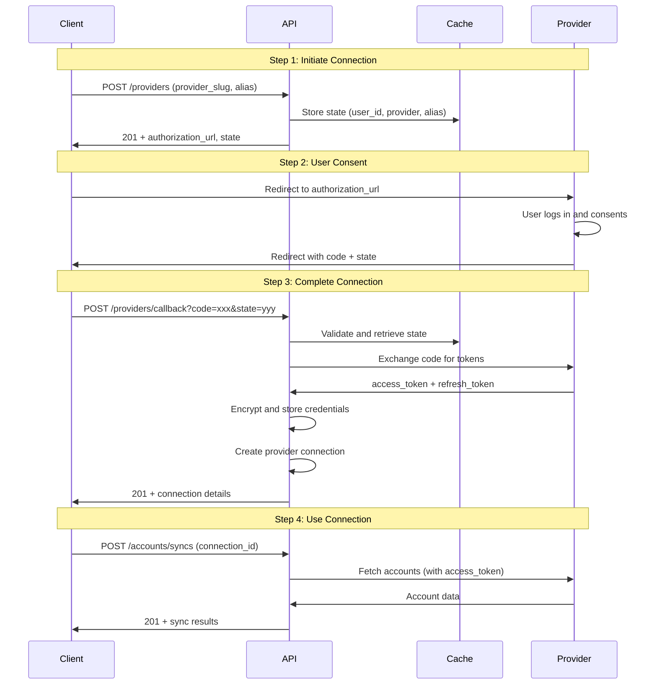

# Provider Connection API

## Overview

This document describes the provider connection API endpoints for Dashtam.
Provider connections enable users to link their financial accounts (e.g., Charles Schwab)
via OAuth 2.0 for secure data access.

**Base URL**: `{BASE_URL}` (used in examples below)

| Environment | BASE_URL |
|-------------|----------|
| Development | `https://dashtam.local/api/v1` |
| Test | `https://test.dashtam.local/api/v1` |
| Production | `https://api.dashtam.com/api/v1` |

**Authentication**: All endpoints require JWT Bearer token (except OAuth callback which validates state).

---

## Endpoints Summary

| Resource | Method | Endpoint | Description |
|----------|--------|----------|-------------|
| Providers | GET | `/providers` | List all connections |
| Providers | GET | `/providers/{id}` | Get connection details |
| Providers | POST | `/providers` | Initiate OAuth connection |
| Providers | POST | `/providers/callback` | Complete OAuth callback |
| Providers | PATCH | `/providers/{id}` | Update connection (alias) |
| Providers | DELETE | `/providers/{id}` | Disconnect provider |
| Token Refreshes | POST | `/providers/{id}/token-refreshes` | Refresh provider tokens |

---

## List Provider Connections

### GET /providers

List all provider connections for the authenticated user.

**Request:**

```bash
curl -k -X GET "{BASE_URL}/providers" \
  -H "Authorization: Bearer <access_token>"
```

**Query Parameters:**

| Parameter | Type | Required | Description |
|-----------|------|----------|-------------|
| active_only | boolean | No | Only return active connections (default: false) |

**Success Response (200 OK):**

```json
{
  "connections": [
    {
      "id": "550e8400-e29b-41d4-a716-446655440000",
      "provider_slug": "schwab",
      "alias": "My Schwab Account",
      "status": "active",
      "is_connected": true,
      "needs_reauthentication": false,
      "connected_at": "2025-12-01T10:00:00Z",
      "last_sync_at": "2025-12-04T15:30:00Z",
      "created_at": "2025-12-01T10:00:00Z",
      "updated_at": "2025-12-04T15:30:00Z"
    }
  ],
  "total_count": 1,
  "active_count": 1
}
```

---

## Get Provider Connection

### GET /providers/{id}

Get details of a specific provider connection.

**Request:**

```bash
curl -k -X GET "{BASE_URL}/providers/550e8400-e29b-41d4-a716-446655440000" \
  -H "Authorization: Bearer <access_token>"
```

**Success Response (200 OK):**

```json
{
  "id": "550e8400-e29b-41d4-a716-446655440000",
  "provider_slug": "schwab",
  "alias": "My Schwab Account",
  "status": "active",
  "is_connected": true,
  "needs_reauthentication": false,
  "connected_at": "2025-12-01T10:00:00Z",
  "last_sync_at": "2025-12-04T15:30:00Z",
  "created_at": "2025-12-01T10:00:00Z",
  "updated_at": "2025-12-04T15:30:00Z"
}
```

**Error Responses:**

- `404 Not Found` - Connection not found
- `403 Forbidden` - Not authorized to access this connection

---

## Initiate Provider Connection (OAuth)

### POST /providers

Start the OAuth flow to connect a financial provider.

**Request:**

```bash
curl -k -X POST "{BASE_URL}/providers" \
  -H "Authorization: Bearer <access_token>" \
  -H "Content-Type: application/json" \
  -d '{
    "provider_slug": "schwab",
    "alias": "My Schwab Account",
    "redirect_uri": "https://myapp.com/oauth/callback"
  }'
```

**Request Body:**

| Field | Type | Required | Description |
|-------|------|----------|-------------|
| provider_slug | string | Yes | Provider identifier (e.g., "schwab") |
| alias | string | No | User-friendly name for connection |
| redirect_uri | string | No | Custom redirect URI (uses default if not provided) |

**Success Response (201 Created):**

```json
{
  "authorization_url": "https://api.schwabapi.com/v1/oauth/authorize?client_id=xxx&response_type=code&redirect_uri=xxx&state=abc123&scope=read_accounts%20read_transactions",
  "state": "abc123def456...",
  "expires_in": 600
}
```

**Error Responses:**

- `404 Not Found` - Provider not supported

**Notes:**

- Redirect user to `authorization_url` for OAuth consent
- State token expires in 10 minutes
- After user consent, provider redirects to callback with code and state

---

## Complete OAuth Callback

### POST /providers/callback

Complete the OAuth flow after user consent. Called by frontend after redirect.

**Request:**

```bash
curl -k -X POST "{BASE_URL}/providers/callback?code=AUTH_CODE&state=abc123def456" \
  -H "Content-Type: application/json"
```

**Query Parameters:**

| Parameter | Type | Required | Description |
|-----------|------|----------|-------------|
| code | string | Yes | Authorization code from provider |
| state | string | Yes | CSRF state token from initiation |

**Success Response (201 Created):**

```json
{
  "id": "550e8400-e29b-41d4-a716-446655440000",
  "provider_slug": "schwab",
  "alias": "My Schwab Account",
  "status": "active",
  "is_connected": true,
  "needs_reauthentication": false,
  "connected_at": "2025-12-04T20:00:00Z",
  "last_sync_at": null,
  "created_at": "2025-12-04T20:00:00Z",
  "updated_at": "2025-12-04T20:00:00Z"
}
```

**Error Responses:**

- `400 Bad Request` - Invalid or expired state token
- `502 Bad Gateway` - Provider authentication failed

---

## Update Provider Connection

### PATCH /providers/{id}

Update connection properties (currently only alias).

**Request:**

```bash
curl -k -X PATCH "{BASE_URL}/providers/550e8400-e29b-41d4-a716-446655440000" \
  -H "Authorization: Bearer <access_token>" \
  -H "Content-Type: application/json" \
  -d '{
    "alias": "Personal Brokerage"
  }'
```

**Success Response (200 OK):**

```json
{
  "id": "550e8400-e29b-41d4-a716-446655440000",
  "provider_slug": "schwab",
  "alias": "Personal Brokerage",
  "status": "active",
  "is_connected": true,
  "needs_reauthentication": false,
  "connected_at": "2025-12-01T10:00:00Z",
  "last_sync_at": "2025-12-04T15:30:00Z",
  "created_at": "2025-12-01T10:00:00Z",
  "updated_at": "2025-12-04T20:00:00Z"
}
```

**Error Responses:**

- `404 Not Found` - Connection not found
- `403 Forbidden` - Not authorized to update this connection

---

## Disconnect Provider

### DELETE /providers/{id}

Disconnect and remove a provider connection.

**Request:**

```bash
curl -k -X DELETE "{BASE_URL}/providers/550e8400-e29b-41d4-a716-446655440000" \
  -H "Authorization: Bearer <access_token>"
```

**Success Response (204 No Content):**

No body returned.

**Error Responses:**

- `404 Not Found` - Connection not found
- `403 Forbidden` - Not authorized to disconnect this connection

**Notes:**

- Connection status transitions to DISCONNECTED
- Credentials are cleared
- Connection record is kept for audit purposes
- Associated accounts and transactions remain in database

---

## Refresh Provider Tokens

### POST /providers/{id}/token-refreshes

Refresh OAuth tokens for a provider connection.

**Request:**

```bash
curl -k -X POST "{BASE_URL}/providers/550e8400-e29b-41d4-a716-446655440000/token-refreshes" \
  -H "Authorization: Bearer <access_token>" \
  -H "Content-Type: application/json" \
  -d '{
    "force": false
  }'
```

**Request Body:**

| Field | Type | Required | Description |
|-------|------|----------|-------------|
| force | boolean | No | Force refresh even if not expired (default: false) |

**Success Response (201 Created):**

```json
{
  "success": true,
  "message": "Token refresh scheduled",
  "expires_at": "2025-12-04T20:30:00Z"
}
```

**Error Responses:**

- `404 Not Found` - Connection not found
- `403 Forbidden` - Not authorized or connection not active
- `502 Bad Gateway` - Provider token refresh failed

---

## OAuth Connection Flow



---

## Connection Status Values

| Status | Description |
|--------|-------------|
| pending | OAuth flow started, awaiting completion |
| active | Connected and tokens valid |
| expired | Access token expired, needs refresh |
| revoked | User revoked access at provider |
| failed | Connection attempt failed |
| disconnected | User disconnected in Dashtam |

---

## Error Response Format (RFC 9457)

All errors follow RFC 9457 Problem Details format:

```json
{
  "type": "https://api.dashtam.com/errors/not_found",
  "title": "Not Found",
  "status": 404,
  "detail": "Connection not found",
  "instance": "/api/v1/providers/550e8400-e29b-41d4-a716-446655440000",
  "trace_id": "abc123-def456-ghi789"
}
```

---

## Supported Providers

| Provider | Slug | Status |
|----------|------|--------|
| Charles Schwab | `schwab` | Active |
| Chase Bank | `chase` | Planned (Phase 7) |

---

## Rate Limiting

Provider endpoints use tiered rate limiting based on operation type:

| Policy | Max Requests | Refill Rate | Scope | Endpoints |
|--------|--------------|-------------|-------|----------|
| API_READ | 100 | 100/min | User | `GET /providers`, `GET /providers/{id}` |
| API_WRITE | 50 | 50/min | User | `PATCH /providers/{id}`, `DELETE /providers/{id}` |
| PROVIDER_CONNECT | 5 | 5/min | User | `POST /providers`, `POST /providers/callback` |
| PROVIDER_SYNC | 10 | 5/min | User+Provider | `POST /providers/{id}/token-refreshes` |

**Rate Limit Headers (RFC 6585):**

```text
X-RateLimit-Limit: 5
X-RateLimit-Remaining: 4
X-RateLimit-Reset: 1699488000
Retry-After: 60  (only on 429)
```

---

## Implementation References

- **Route Registry**: All provider endpoints are defined in `src/presentation/routers/api/v1/routes/registry.py` with rate limit policies and auth requirements.
- **Handler Module**: `src/presentation/routers/api/v1/providers.py`
- **OAuth State Cache**: Provider OAuth state stored in Redis with 10-minute TTL.
- **Credential Encryption**: Provider credentials encrypted at rest using Fernet.

---

**Created**: 2025-12-04 | **Last Updated**: 2026-01-10
