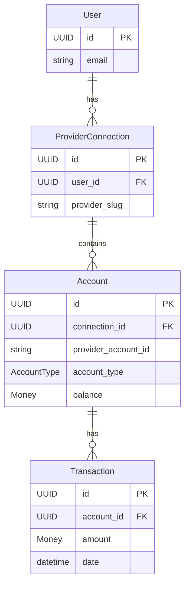

# Account Domain Model Architecture

Account Domain Model - representing financial accounts aggregated from provider connections.

---

## Overview

The Account domain model represents individual financial accounts (brokerage, checking, savings, etc.) within a provider connection. Multiple accounts can belong to a single provider connection (e.g., a Schwab connection might have both IRA and individual brokerage accounts).

### Core Principle

> Accounts are AGGREGATED DATA from providers, not managed by Dashtam. The domain models provider-reported account state, not account administration.

### Design Goals

1. **Provider Agnostic**: Account structure works for any provider (Schwab, Chase, Fidelity)
2. **Financial Precision**: Use Decimal for all monetary amounts (never float)
3. **Currency Aware**: Support multi-currency accounts with ISO 4217 codes
4. **Domain Purity**: Zero infrastructure imports in domain layer
5. **Immutable Value Objects**: Money and Balance are immutable

---

## Domain Model

### Entity: Account

```text
Account
├── id: UUID                              # Unique identifier (internal)
├── connection_id: UUID                   # FK to ProviderConnection
├── provider_account_id: str              # Provider's account identifier
├── account_number_masked: str            # Masked account number (****1234)
├── name: str                             # Account name from provider
├── account_type: AccountType             # BROKERAGE, CHECKING, etc.
├── balance: Money                        # Current balance
├── available_balance: Money | None       # Available (if different from balance)
├── currency: str                         # ISO 4217 currency code
├── is_active: bool                       # Account active on provider
├── last_synced_at: datetime | None       # Last successful sync
├── provider_metadata: dict[str, Any] | None  # Provider-specific data
├── created_at: datetime                  # Record creation
└── updated_at: datetime                  # Last modification
```

### Business Methods

Account entity is primarily a data container with query methods. State changes come from provider sync operations. All update methods return `Result` types following railway-oriented programming.

```python
class Account:
    # Query methods (read-only)
    def is_investment_account(self) -> bool:
        """Check if account type is investment-related."""
    
    def is_bank_account(self) -> bool:
        """Check if account type is banking-related."""
    
    def is_retirement_account(self) -> bool:
        """Check if account type is retirement-related."""
    
    def is_credit_account(self) -> bool:
        """Check if account type is credit-related."""
    
    def has_available_balance(self) -> bool:
        """Check if available balance differs from current balance."""
    
    def needs_sync(self, threshold: timedelta) -> bool:
        """Check if account hasn't been synced within threshold."""
    
    def get_display_name(self) -> str:
        """Get user-friendly display name (name + masked number)."""
    
    # Update methods (from provider sync) - Return Result types
    def update_balance(
        self,
        balance: Money,
        available_balance: Money | None = None,
    ) -> Result[None, str]:
        """Update balance from provider sync. Validates currency match."""
    
    def update_from_provider(
        self,
        name: str | None = None,
        is_active: bool | None = None,
        provider_metadata: dict[str, Any] | None = None,
    ) -> Result[None, str]:
        """Update account details from provider sync."""
    
    def mark_synced(self) -> Result[None, str]:
        """Record successful sync timestamp."""
    
    def deactivate(self) -> Result[None, str]:
        """Mark account as inactive."""
    
    def activate(self) -> Result[None, str]:
        """Mark account as active."""
```

### Entity Relationships



---

## Value Objects

### Money (Immutable, Decimal Precision)

The cornerstone value object for all financial amounts. Uses `Decimal` for exact precision - **never use float for money**.

```python
@dataclass(frozen=True)
class Money:
    """Immutable monetary value with currency.
    
    Financial calculations require exact precision - floats introduce
    rounding errors that accumulate in financial systems.
    
    Attributes:
        amount: Decimal value (positive, negative, or zero)
        currency: ISO 4217 currency code (e.g., "USD", "EUR")
    
    Examples:
        >>> balance = Money(Decimal("1234.56"), "USD")
        >>> fee = Money(Decimal("9.99"), "USD")
        >>> result = balance - fee  # Money(1224.57, USD)
    """
    amount: Decimal
    currency: str  # ISO 4217 code
    
    # Arithmetic operations (same currency only)
    def __add__(self, other: "Money") -> "Money": ...
    def __sub__(self, other: "Money") -> "Money": ...
    def __mul__(self, scalar: Decimal | int | float) -> "Money": ...
    def __rmul__(self, scalar: Decimal | int | float) -> "Money": ...  # 3 * money
    def __neg__(self) -> "Money": ...
    def __abs__(self) -> "Money": ...
    
    # Comparison (same currency only)
    def __lt__(self, other: "Money") -> bool: ...
    def __le__(self, other: "Money") -> bool: ...
    def __gt__(self, other: "Money") -> bool: ...
    def __ge__(self, other: "Money") -> bool: ...
    
    # Query methods
    def is_positive(self) -> bool: ...
    def is_negative(self) -> bool: ...
    def is_zero(self) -> bool: ...
    
    # Factory methods
    @classmethod
    def zero(cls, currency: str = "USD") -> "Money": ...
    
    @classmethod
    def from_cents(cls, cents: int, currency: str = "USD") -> "Money": ...
```

**Critical Design Decisions:**

1. **Decimal, not float**: `Decimal("0.1") + Decimal("0.2") == Decimal("0.3")` ✓
2. **Same-currency operations**: `USD + EUR` raises `CurrencyMismatchError`
3. **Immutable**: Operations return new Money instances
4. **ISO 4217**: Standard 3-letter currency codes only

### Currency Validation

```python
# Valid ISO 4217 codes (subset - full list in implementation)
VALID_CURRENCIES = {
    "USD", "EUR", "GBP", "JPY", "CAD", "AUD", "CHF", "CNY",
    "HKD", "NZD", "SEK", "KRW", "SGD", "NOK", "MXN", "INR",
}

def validate_currency(code: str) -> str:
    """Validate and normalize currency code.
    
    Args:
        code: Currency code (case-insensitive)
    
    Returns:
        Uppercase ISO 4217 code
    
    Raises:
        ValueError: If code is not a valid ISO 4217 currency
    """
```

---

## Enums

### AccountType

```python
class AccountType(str, Enum):
    """Financial account type classification.
    
    Categories:
    - Investment: Securities, trading, retirement
    - Banking: Checking, savings, money market
    - Credit: Credit cards, lines of credit
    - Other: Specialized accounts
    """
    
    # Investment accounts
    BROKERAGE = "brokerage"           # General brokerage/trading
    IRA = "ira"                       # Individual Retirement Account
    ROTH_IRA = "roth_ira"             # Roth IRA
    RETIREMENT_401K = "401k"          # Employer 401(k)
    RETIREMENT_403B = "403b"          # Nonprofit 403(b)
    HSA = "hsa"                       # Health Savings Account
    
    # Banking accounts
    CHECKING = "checking"             # Checking account
    SAVINGS = "savings"               # Savings account
    MONEY_MARKET = "money_market"     # Money market account
    CD = "cd"                         # Certificate of deposit
    
    # Credit accounts
    CREDIT_CARD = "credit_card"       # Credit card
    LINE_OF_CREDIT = "line_of_credit" # Line of credit
    
    # Other
    LOAN = "loan"                     # Loan account
    MORTGAGE = "mortgage"             # Mortgage account
    OTHER = "other"                   # Uncategorized
    
    # Class methods - Validation
    @classmethod
    def values(cls) -> list[str]:
        """Get all account type values as strings."""
    
    @classmethod
    def is_valid(cls, value: str) -> bool:
        """Check if a string is a valid account type."""
    
    # Class methods - Category queries
    @classmethod
    def investment_types(cls) -> list["AccountType"]:
        """Account types that hold securities."""
        return [cls.BROKERAGE, cls.IRA, cls.ROTH_IRA, 
                cls.RETIREMENT_401K, cls.RETIREMENT_403B, cls.HSA]
    
    @classmethod
    def bank_types(cls) -> list["AccountType"]:
        """Traditional banking account types."""
        return [cls.CHECKING, cls.SAVINGS, cls.MONEY_MARKET, cls.CD]
    
    @classmethod
    def retirement_types(cls) -> list["AccountType"]:
        """Retirement/tax-advantaged account types."""
        return [cls.IRA, cls.ROTH_IRA, cls.RETIREMENT_401K, 
                cls.RETIREMENT_403B, cls.HSA]
    
    @classmethod
    def credit_types(cls) -> list["AccountType"]:
        """Credit and loan account types."""
        return [cls.CREDIT_CARD, cls.LINE_OF_CREDIT, cls.LOAN, cls.MORTGAGE]
    
    # Instance methods - Type checks
    def is_investment(self) -> bool:
        """Check if this is an investment account type."""
    
    def is_bank(self) -> bool:
        """Check if this is a banking account type."""
    
    def is_retirement(self) -> bool:
        """Check if this is a retirement account type."""
    
    def is_credit(self) -> bool:
        """Check if this is a credit account type."""
    
    @property
    def category(self) -> str:
        """Get category string: 'investment', 'banking', 'credit', or 'other'."""
```

---

## Protocol Definition

### AccountRepository

```python
class AccountRepository(Protocol):
    """Account repository protocol (port).
    
    Defines the interface for account persistence operations.
    Infrastructure layer provides concrete implementation.
    """
    
    async def find_by_id(self, account_id: UUID) -> Account | None:
        """Find account by ID."""
        ...
    
    async def find_by_connection_id(
        self,
        connection_id: UUID,
        active_only: bool = False,
    ) -> list[Account]:
        """Find all accounts for a provider connection.
        
        Args:
            connection_id: Provider connection ID.
            active_only: If True, return only active accounts.
        """
        ...
    
    async def find_by_user_id(
        self,
        user_id: UUID,
        active_only: bool = False,
        account_type: AccountType | None = None,
    ) -> list[Account]:
        """Find all accounts across all connections for a user.
        
        Args:
            user_id: User's unique identifier.
            active_only: If True, return only active accounts.
            account_type: Optional filter by account type.
        """
        ...
    
    async def find_by_provider_account_id(
        self,
        connection_id: UUID,
        provider_account_id: str,
    ) -> Account | None:
        """Find account by provider's identifier (for sync)."""
        ...
    
    async def find_active_by_user(self, user_id: UUID) -> list[Account]:
        """Find all active accounts for a user."""
        ...
    
    async def find_needing_sync(
        self,
        threshold: timedelta,
    ) -> list[Account]:
        """Find accounts not synced within threshold."""
        ...
    
    async def save(self, account: Account) -> None:
        """Create or update account."""
        ...
    
    async def delete(self, account_id: UUID) -> None:
        """Remove account."""
        ...
```

---

## Domain Errors

```python
class AccountError:
    """Account domain error messages.
    
    Used in Result types for account operation failures.
    These are NOT exceptions - they are error value constants
    used in railway-oriented programming pattern.
    """
    
    # Validation errors
    INVALID_ACCOUNT_NAME = "Account name cannot be empty"
    INVALID_CURRENCY = "Invalid ISO 4217 currency code"
    INVALID_PROVIDER_ACCOUNT_ID = "Provider account ID cannot be empty"
    INVALID_ACCOUNT_NUMBER = "Account number mask cannot be empty"
    
    # Money errors
    CURRENCY_MISMATCH = "Cannot perform operation on different currencies"
    INVALID_AMOUNT = "Amount must be a valid Decimal"
    NEGATIVE_BALANCE_NOT_ALLOWED = "Balance cannot be negative for this account type"
    
    # State errors
    ACCOUNT_INACTIVE = "Account is not active"
    ACCOUNT_NOT_FOUND = "Account not found"
    
    # Sync errors
    SYNC_FAILED = "Account sync failed"
    CONNECTION_REQUIRED = "Account must be associated with a connection"
```

---

## Design Decisions

### 1. Money vs Balance

**Decision**: Use single `Money` value object (not separate `Balance`).

**Rationale**:

- `Balance` would just wrap `Money` with no additional semantics
- Account entity already provides context (balance vs available_balance)
- Simpler API: `account.balance` is a `Money` directly
- Transaction will also use `Money` for amounts

### 2. Decimal Precision

**Decision**: Use Python's `Decimal` with string initialization.

```python
# ✓ Correct
Money(Decimal("123.45"), "USD")
Money.from_cents(12345, "USD")

# ✗ Wrong (float introduces precision errors)
Money(Decimal(123.45), "USD")  # Already imprecise!
Money(123.45, "USD")           # Even worse
```

### 3. Currency Handling

**Decision**: Store currency as ISO 4217 string, validate on creation.

**Rationale**:

- Most providers use USD primarily
- Multi-currency support needed for international accounts
- Currency enum would be too restrictive (200+ currencies)
- Validation whitelist can be expanded as needed

### 4. Provider Metadata

**Decision**: Use `dict[str, Any]` for provider-specific data.

**Rationale**:

- Providers return different data structures
- Domain doesn't interpret provider-specific fields
- Infrastructure layer can access when needed
- Avoids frequent domain changes for provider variations

### 5. No Domain Events (Initially)

**Decision**: No domain events for Account entity.

**Rationale**:

- Accounts are synced data, not user-initiated actions
- Sync operations happen at application layer
- Event emission handled by sync handlers, not entities
- May add events in future if needed (e.g., low balance alerts)

### 6. Single File for Money

**Decision**: `money.py` contains `Money` class and currency utilities.

```bash
src/domain/value_objects/
└── money.py   # Money class + validate_currency + VALID_CURRENCIES
```

**Rationale**:

- Money and currency are tightly coupled
- Avoids circular imports
- Single responsibility (financial amounts)

---

## File Structure

```bash
src/domain/entities/
└── account.py                # Account entity

src/domain/value_objects/
└── money.py                  # Money value object + currency validation

src/domain/enums/
└── account_type.py           # AccountType enum

src/domain/errors/
└── account_error.py          # Domain error messages

src/domain/protocols/
└── account_repository.py     # Repository protocol

tests/unit/
├── test_domain_account.py    # Account entity tests (~45 tests)
└── test_domain_money.py      # Money value object tests (~54 tests)

docs/architecture/
└── account.md   # This document
```

---

## Testing Strategy

### Account Entity Tests (~45 tests)

```python
class TestAccountTypeEnum:
    """Enum values, validation, category methods, instance methods."""

class TestAccountCreation:
    """Entity creation with required/optional fields, validation."""

class TestAccountQueryMethods:
    """is_investment_account, is_bank_account, is_credit_account,
    needs_sync, has_available_balance, get_display_name."""

class TestAccountUpdateMethods:
    """update_balance, update_from_provider, mark_synced,
    deactivate, activate - all return Result types."""

class TestAccountEdgeCases:
    """Negative balances, zero balances, metadata, UUID fields."""
```

### Money Value Object Tests (~54 tests)

```python
class TestCurrencyValidation:
    """validate_currency function: normalization, whitespace, valid/invalid codes."""

class TestMoneyCreation:
    """Creation with Decimal, int, float; immutability; NaN/Infinity rejection."""

class TestMoneyAddition:
    """Addition same currency, new instance, currency mismatch, non-Money."""

class TestMoneySubtraction:
    """Subtraction same currency, negative results, currency mismatch."""

class TestMoneyMultiplication:
    """Multiply by int, Decimal, zero, negative; reverse multiplication."""

class TestMoneyNegationAndAbsolute:
    """Negation and abs() for positive/negative Money."""

class TestMoneyComparison:
    """lt, le, gt, ge with same currency; equality; currency mismatch."""

class TestMoneyQueryMethods:
    """is_positive, is_negative, is_zero."""

class TestMoneyFactoryMethods:
    """zero() and from_cents() with default/custom currencies."""

class TestMoneyEdgeCases:
    """Decimal precision, very small/large amounts, hash for dict key."""

class TestCurrencyMismatchError:
    """Error stores currencies, message format, is ValueError."""
```

**Coverage Target**: 100% (domain logic critical)

---

## Implementation Order

1. **Money value object** (`money.py`)
   - Core financial primitive
   - Used by Account and later by Transaction (F2.3)

2. **AccountType enum** (`account_type.py`)
   - Simple enum with helper methods

3. **AccountError** (`account_error.py`)
   - Error messages for validation

4. **Account entity** (`account.py`)
   - Main entity using Money and AccountType

5. **AccountRepository protocol** (`account_repository.py`)
   - Interface for persistence layer

6. **Update exports** (`__init__.py` files)
   - Clean import paths

7. **Unit tests**
   - Comprehensive coverage

---

## Usage Examples

### Creating an Account

```python
from decimal import Decimal
from uuid_extensions import uuid7
from src.domain.entities import Account
from src.domain.enums import AccountType
from src.domain.value_objects import Money

account = Account(
    id=uuid7(),
    connection_id=connection.id,
    provider_account_id="ACCT-123456",
    account_number_masked="****1234",
    name="Individual Brokerage",
    account_type=AccountType.BROKERAGE,
    balance=Money(Decimal("50000.00"), "USD"),
    available_balance=Money(Decimal("45000.00"), "USD"),
    currency="USD",
    is_active=True,
)

# Query methods
account.is_investment_account()  # True
account.is_retirement_account()  # False
account.has_available_balance()  # True

# Update from provider sync
account.update_balance(
    balance=Money(Decimal("51234.56"), "USD"),
    available=Money(Decimal("46234.56"), "USD"),
)
account.mark_synced()
```

### Money Operations

```python
from decimal import Decimal
from src.domain.value_objects import Money

# Creation
balance = Money(Decimal("1000.00"), "USD")
withdrawal = Money(Decimal("250.00"), "USD")
fee = Money(Decimal("2.50"), "USD")

# Arithmetic
remaining = balance - withdrawal - fee  # Money(747.50, USD)
doubled = balance * 2                    # Money(2000.00, USD)

# Comparison
balance > withdrawal  # True
fee.is_positive()     # True

# Factory methods
zero = Money.zero("USD")               # Money(0.00, USD)
cents = Money.from_cents(12345, "USD") # Money(123.45, USD)

# Currency mismatch raises error
euros = Money(Decimal("100.00"), "EUR")
balance + euros  # Raises CurrencyMismatchError
```

---

**Created**: 2025-11-30 | **Last Updated**: 2026-01-10
