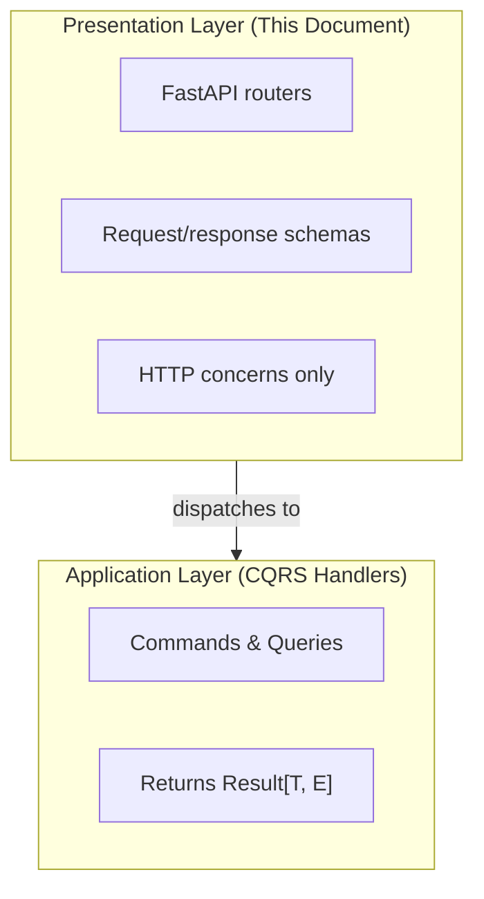

# API Design Patterns Architecture

**Purpose**: Define RESTful API design patterns and integration standards for Dashtam endpoints.

**Scope**: All presentation layer endpoints (Accounts, Transactions, Providers)

**Compliance Requirement**: **100% RESTful compliance is NON-NEGOTIABLE**

---

## 1. Overview

### 1.1 Architecture Position

The API layer is the outermost layer in Dashtam's hexagonal architecture:



### 1.2 Key Principles

1. **Thin Controllers**: Routers only handle HTTP concerns (parse request, call handler, format response)
2. **Schema Separation**: All schemas in `src/schemas/`, never inline in routers
3. **Handler Injection**: All business logic via injected CQRS handlers
4. **Result Handling**: Map Result types to HTTP responses
5. **Cross-Cutting Concerns**: Auth, rate limit, audit handled via middleware/dependencies

### 1.3 File Structure

```text
src/presentation/routers/api/v1/
├── accounts.py              # Account endpoints
├── transactions.py          # Transaction endpoints
├── providers.py             # Provider endpoints
├── sessions.py              # Session endpoints
├── users.py                 # User endpoints
├── tokens.py                # Token endpoints
├── email_verifications.py   # Email verification endpoints
├── password_resets.py       # Password reset endpoints
├── admin/                   # Admin endpoints
└── errors/                  # Error handling utilities

src/schemas/
├── auth_schemas.py          # Auth request/response
├── session_schemas.py       # Session schemas
├── rotation_schemas.py      # Token rotation schemas
├── account_schemas.py       # Account request/response
├── transaction_schemas.py   # Transaction request/response
├── provider_schemas.py      # Provider request/response
└── common_schemas.py        # Shared schemas (pagination, etc.)
```

**Note**: Schema files use `_schemas.py` suffix for disambiguation when importing (e.g., `from src.schemas.auth_schemas import UserCreate` is clearer than `from src.schemas.auth import UserCreate`).

---

## 2. RESTful Design (100% Compliance Required)

### 2.1 Resource-Oriented URLs

URLs represent **resources** (nouns), not actions (verbs):

```python
# ✅ CORRECT: Resource-based URLs
GET    /api/v1/accounts              # List accounts
GET    /api/v1/accounts/{id}         # Get specific account
POST   /api/v1/accounts/syncs        # Trigger sync (creates sync job)

GET    /api/v1/transactions          # List transactions
GET    /api/v1/transactions/{id}     # Get specific transaction

GET    /api/v1/providers             # List connected providers
POST   /api/v1/providers             # Initiate provider connection
DELETE /api/v1/providers/{id}        # Disconnect provider

# ❌ WRONG: Action-based URLs (NEVER use)
POST   /api/v1/getAccounts           # Verb in URL
POST   /api/v1/accounts/fetch        # Action verb
GET    /api/v1/syncTransactions      # Action verb
POST   /api/v1/disconnectProvider    # Action verb
```

### 2.2 HTTP Methods

| Method | Purpose | Idempotent | Safe | Response |
|--------|---------|------------|------|----------|
| GET | Retrieve resources | Yes | Yes | 200 OK |
| POST | Create resources | No | No | 201 Created |
| PATCH | Partial update | Yes | No | 200 OK |
| PUT | Complete replace | Yes | No | 200 OK |
| DELETE | Remove resources | Yes | No | 204 No Content |

### 2.3 HTTP Status Codes

**Success Codes**:

- `200 OK` - GET, PATCH, PUT successful
- `201 Created` - POST successful (include `Location` header)
- `204 No Content` - DELETE successful (no body)

**Client Error Codes**:

- `400 Bad Request` - Validation errors, malformed request
- `401 Unauthorized` - Missing or invalid authentication
- `403 Forbidden` - Authenticated but no permission
- `404 Not Found` - Resource doesn't exist
- `409 Conflict` - Duplicate resource
- `422 Unprocessable Entity` - Semantic validation failure
- `429 Too Many Requests` - Rate limit exceeded

**Server Error Codes**:

- `500 Internal Server Error` - Unexpected failure
- `503 Service Unavailable` - Dependency unavailable

### 2.4 Modeling Actions as Resources

Transform actions into resource creation:

| Action | REST Endpoint | HTTP Method | Status |
|--------|---------------|-------------|--------|
| Sync accounts | `POST /accounts/syncs` | POST | 201 Created |
| Sync transactions | `POST /transactions/syncs` | POST | 201 Created |
| Get OAuth URL | `POST /providers/{id}/authorizations` | POST | 201 Created |
| Refresh tokens | `POST /providers/{id}/token-refreshes` | POST | 201 Created |
| Disconnect | `DELETE /providers/{id}` | DELETE | 204 No Content |

---

## 3. Router Implementation Patterns

### 3.1 Router Setup

```python
# src/presentation/routers/api/v1/accounts.py
"""Account API endpoints.

REST endpoints for account operations. All endpoints require
JWT authentication and apply rate limiting.

Reference:
    - docs/architecture/api-patterns.md
"""

from uuid import UUID

from fastapi import APIRouter, Depends, status
from fastapi.responses import JSONResponse

from src.core.container import (
    get_get_account_handler,
    get_list_accounts_by_user_handler,
)
from src.presentation.routers.api.middleware.auth_dependencies import (
    AuthenticatedUser,
)
from src.schemas.account_schemas import (
    AccountListResponse,
    AccountResponse,
)

router = APIRouter(prefix="/accounts", tags=["Accounts"])
```

### 3.2 List Endpoint Pattern

```python
@router.get(
    "",
    response_model=AccountListResponse,
    summary="List accounts",
    description="List all accounts for the authenticated user across all connections.",
)
async def list_accounts(
    request: Request,
    current_user: AuthenticatedUser,
    active_only: Annotated[
        bool,
        Query(description="Only return active accounts"),
    ] = False,
    account_type: Annotated[
        str | None,
        Query(description="Filter by account type (e.g., brokerage, ira)"),
    ] = None,
    handler: ListAccountsByUserHandler = Depends(get_list_accounts_by_user_handler),
) -> AccountListResponse | JSONResponse:
    """List all accounts for the authenticated user.

    GET /api/v1/accounts → 200 OK

    Args:
        request: FastAPI request object.
        current_user: Authenticated user (from JWT).
        active_only: Filter to only active accounts.
        account_type: Filter by account type.
        handler: List accounts handler (injected).

    Returns:
        AccountListResponse with list of accounts.
        JSONResponse with RFC 7807 error on failure.
    """
    query = ListAccountsByUser(
        user_id=current_user.user_id,
        active_only=active_only,
        account_type=account_type,
    )
    result = await handler.handle(query)

    if isinstance(result, Failure):
        app_error = _map_account_error(result.error)
        return ErrorResponseBuilder.from_application_error(
            error=app_error,
            request=request,
            trace_id=get_trace_id() or "",  # IMPORTANT: Handle None
        )

    return AccountListResponse.from_dto(result.value)
```

### 3.3 Get Single Resource Pattern

```python
@router.get(
    "/{account_id}",
    response_model=AccountResponse,
    summary="Get account",
    description="Get details of a specific account.",
    responses={
        404: {"description": "Account not found"},
        403: {"description": "Not authorized to access this account"},
    },
)
async def get_account(
    request: Request,
    current_user: AuthenticatedUser,
    account_id: Annotated[UUID, Path(description="Account UUID")],
    handler: GetAccountHandler = Depends(get_get_account_handler),
) -> AccountResponse | JSONResponse:
    """Get a specific account.

    GET /api/v1/accounts/{id} → 200 OK

    Args:
        request: FastAPI request object.
        current_user: Authenticated user (from JWT).
        account_id: Account UUID.
        handler: Get account handler (injected).

    Returns:
        AccountResponse with account details.
        JSONResponse with RFC 7807 error on failure.
    """
    query = GetAccount(
        account_id=account_id,
        user_id=current_user.user_id,
    )
    result = await handler.handle(query)

    if isinstance(result, Failure):
        # Use error mapper for consistent RFC 7807 responses
        app_error = _map_account_error(result.error)
        return ErrorResponseBuilder.from_application_error(
            error=app_error,
            request=request,
            trace_id=get_trace_id() or "",
        )

    return AccountResponse.from_dto(result.value)
```

### 3.4 Create Resource Pattern (Sync Example)

```python
@router.post(
    "/syncs",
    response_model=SyncResponse,
    status_code=status.HTTP_201_CREATED,
    summary="Trigger account sync",
    responses={
        201: {"description": "Sync initiated"},
        429: {"description": "Rate limit exceeded"},
    },
)
async def sync_accounts(
    current_user: AuthenticatedUser,
    request: SyncAccountsRequest,
    handler: SyncAccountsHandler = Depends(get_sync_accounts_handler),
    _: None = Depends(require_permission("accounts", "write")),
) -> SyncResponse | JSONResponse:
    """Trigger account synchronization."""
    command = SyncAccounts(
        user_id=current_user.user_id,
        provider_id=request.provider_id,
    )
    
    result = await handler.handle(command)
    
    if isinstance(result, Failure):
        return ErrorResponseBuilder.from_application_error(
            error=result.error,
            request=request,
            trace_id=get_trace_id(),
        )
    
    return SyncResponse(
        sync_id=result.value.sync_id,
        status="initiated",
        message="Account sync initiated",
    )
```

### 3.5 Delete Resource Pattern

**IMPORTANT**: DELETE endpoints returning 204 No Content MUST set `response_model=None` to prevent FastAPI validation errors.

```python
@router.delete(
    "/{connection_id}",
    status_code=status.HTTP_204_NO_CONTENT,
    response_model=None,  # REQUIRED for 204 endpoints
    summary="Disconnect provider",
    description="Disconnect a provider connection and remove stored credentials.",
    responses={
        404: {"description": "Connection not found"},
        403: {"description": "Not authorized to disconnect this connection"},
    },
)
async def disconnect_provider(
    request: Request,
    current_user: AuthenticatedUser,
    connection_id: Annotated[UUID, Path(description="Provider connection UUID")],
    handler: DisconnectProviderHandler = Depends(get_disconnect_provider_handler),
) -> Response | JSONResponse:
    """Disconnect a provider connection.

    DELETE /api/v1/providers/{id} → 204 No Content

    Soft-deletes the connection and removes stored OAuth tokens.

    Args:
        request: FastAPI request object.
        current_user: Authenticated user (from JWT).
        connection_id: Provider connection UUID.
        handler: Disconnect provider handler (injected).

    Returns:
        Response with 204 No Content on success.
        JSONResponse with RFC 7807 error on failure.
    """
    command = DisconnectProvider(
        connection_id=connection_id,
        user_id=current_user.user_id,
    )
    result = await handler.handle(command)

    if isinstance(result, Failure):
        app_error = _map_provider_error(result.error)
        return ErrorResponseBuilder.from_application_error(
            error=app_error,
            request=request,
            trace_id=get_trace_id() or "",
        )

    return Response(status_code=status.HTTP_204_NO_CONTENT)
```

---

## 4. Schema Patterns

### 4.1 Schema File Structure

```python
# src/schemas/account_schemas.py
"""Account request and response schemas.

Pydantic schemas for account API endpoints. Includes:
- Request schemas (client → API)
- Response schemas (API → client)
- DTO-to-schema conversion methods

Reference:
    - docs/architecture/api-patterns.md
"""

from datetime import datetime
from decimal import Decimal
from uuid import UUID

from pydantic import BaseModel, Field

from src.application.queries.handlers.get_account_handler import AccountResult


class AccountResponse(BaseModel):
    """Single account response schema."""

    id: UUID = Field(..., description="Account unique identifier")
    connection_id: UUID = Field(..., description="Provider connection ID")
    name: str = Field(..., description="Account display name")
    account_type: str = Field(..., description="Account type", examples=["brokerage"])
    account_number_masked: str = Field(..., description="Masked account number")
    balance: Decimal = Field(..., description="Current balance")
    currency: str = Field(..., description="ISO 4217 currency code", examples=["USD"])
    available_balance: Decimal | None = Field(None, description="Available balance")
    is_active: bool = Field(..., description="Whether account is active")
    last_synced_at: datetime | None = Field(None, description="Last sync timestamp")
    created_at: datetime = Field(..., description="Creation timestamp")

    @classmethod
    def from_dto(cls, dto: AccountResult) -> "AccountResponse":
        """Convert application DTO to response schema."""
        return cls(
            id=dto.id,
            connection_id=dto.connection_id,
            name=dto.name,
            account_type=dto.account_type,
            account_number_masked=dto.account_number_masked,
            balance=dto.balance_amount,
            currency=dto.balance_currency,
            available_balance=dto.available_balance_amount,
            is_active=dto.is_active,
            last_synced_at=dto.last_synced_at,
            created_at=dto.created_at,
        )


class AccountListResponse(BaseModel):
    """Account list response with aggregated totals."""

    accounts: list[AccountResponse] = Field(..., description="List of accounts")
    total_count: int = Field(..., description="Total account count")
    active_count: int = Field(..., description="Active account count")
    total_balance_by_currency: dict[str, str] = Field(
        ..., description="Balances by currency"
    )

    @classmethod
    def from_dto(cls, dto) -> "AccountListResponse":
        """Convert application DTO to response schema."""
        return cls(
            accounts=[AccountResponse.from_dto(acc) for acc in dto.accounts],
            total_count=dto.total_count,
            active_count=dto.active_count,
            total_balance_by_currency=dto.total_balance_by_currency,
        )
```

### 4.2 Request Schemas

```python
class SyncAccountsRequest(BaseModel):
    """Request to sync accounts from providers."""

    provider_id: UUID | None = Field(None, description="Sync specific provider only")
    force: bool = Field(False, description="Force sync even if recent")


class ConnectProviderRequest(BaseModel):
    """Request to initiate provider connection."""

    provider_slug: str = Field(
        ...,
        description="Provider identifier",
        examples=["schwab"],
        min_length=1,
        max_length=50,
    )
    alias: str | None = Field(
        None,
        description="User-defined nickname",
        max_length=100,
    )
```

### 4.3 Pagination Schema

```python
# src/schemas/common_schemas.py
"""Common schemas used across multiple endpoints."""

from pydantic import BaseModel, Field


class PaginationParams(BaseModel):
    """Pagination query parameters."""

    page: int = Field(1, ge=1, description="Page number (1-indexed)")
    page_size: int = Field(20, ge=1, le=100, description="Items per page")

    @property
    def offset(self) -> int:
        """Calculate SQL offset from page number."""
        return (self.page - 1) * self.page_size

    @property
    def limit(self) -> int:
        """Return page size as limit."""
        return self.page_size


class PaginatedResponse(BaseModel):
    """Base paginated response."""

    page: int = Field(..., description="Current page")
    page_size: int = Field(..., description="Items per page")
    total_count: int = Field(..., description="Total items")
    total_pages: int = Field(..., description="Total pages")

    @classmethod
    def calculate_pages(cls, total_count: int, page_size: int) -> int:
        """Calculate total pages from count and page size."""
        return (total_count + page_size - 1) // page_size if page_size > 0 else 0
```

---

## 5. Error Handling

### 5.1 RFC 7807 Problem Details

All error responses follow RFC 7807 format:

```json
{
  "type": "https://api.dashtam.com/errors/not-found",
  "title": "Not Found",
  "status": 404,
  "detail": "Account with ID '123' not found",
  "instance": "/api/v1/accounts/123",
  "trace_id": "550e8400-e29b-41d4-a716-446655440000"
}
```

### 5.2 String-to-ApplicationError Mapping Pattern

**Current State**: Handlers return `Result[T, str]`. Each router file includes a mapper function to convert string errors to typed `ApplicationError` for RFC 7807 compliance.

**TODO (Phase 6)**: Refactor handlers to return `Result[T, ApplicationError]` directly.

```python
# Each router file includes an error mapper
def _map_account_error(error: str) -> ApplicationError:
    """Map handler string error to ApplicationError."""
    error_lower = error.lower()

    if "not found" in error_lower:
        return ApplicationError(
            code=ApplicationErrorCode.NOT_FOUND,
            message=error,
        )
    if "not owned" in error_lower:
        return ApplicationError(
            code=ApplicationErrorCode.FORBIDDEN,
            message=error,
        )
    # ... more mappings

    # Default to command execution failed
    return ApplicationError(
        code=ApplicationErrorCode.COMMAND_EXECUTION_FAILED,
        message=error,
    )
```

### 5.3 Error Response Builder

Use `ErrorResponseBuilder` for ApplicationError mapping:

```python
from src.presentation.routers.api.v1.errors import ErrorResponseBuilder

if isinstance(result, Failure):
    app_error = _map_account_error(result.error)
    return ErrorResponseBuilder.from_application_error(
        error=app_error,
        request=request,
        trace_id=get_trace_id() or "",  # IMPORTANT: Handle None
    )
```

**Critical**: `get_trace_id()` returns `str | None`. Use `get_trace_id() or ""` to ensure string type.

### 5.4 Error Mapping

| Handler Error String | ApplicationErrorCode | HTTP Status |
|---------------------|----------------------|-------------|
| `*not found*` | `NOT_FOUND` | 404 |
| `*not owned*` | `FORBIDDEN` | 403 |
| `*not active*` | `FORBIDDEN` | 403 |
| `*too soon*`, `*recently synced*` | `RATE_LIMIT_EXCEEDED` | 429 |
| `*invalid*` | `COMMAND_VALIDATION_FAILED` | 400 |
| (default) | `COMMAND_EXECUTION_FAILED` | 500 |

**Security Note**: When a resource exists but isn't owned by the user, consider returning 404 (not 403) to prevent resource enumeration. Current implementation returns 403 for `not owned` - evaluate based on security requirements.

---

## 6. Authentication & Authorization

### 6.1 JWT Authentication

All endpoints require JWT authentication via `AuthenticatedUser` type alias:

```python
from src.presentation.routers.api.middleware.auth_dependencies import AuthenticatedUser

@router.get("/accounts")
async def list_accounts(
    current_user: AuthenticatedUser,  # JWT required, injects CurrentUser
) -> AccountListResponse:
    ...
```

**Implementation Detail**: `AuthenticatedUser` is a type alias:

```python
# src/presentation/api/middleware/auth_dependencies.py
AuthenticatedUser = Annotated[CurrentUser, Depends(get_current_user)]
```

`CurrentUser` is a frozen dataclass with:

- `user_id: UUID` - User's unique identifier
- `email: str` - User's email address
- `roles: list[str]` - User's roles
- `session_id: UUID | None` - Session ID if present
- `token_jti: str | None` - JWT unique identifier

### 6.2 Permission Requirements

Use authorization dependencies for fine-grained access:

```python
from src.presentation.routers.api.middleware.authorization_dependencies import (
    require_permission,
    require_casbin_role,
)

# Read permission
@router.get("/accounts")
async def list_accounts(
    current_user: AuthenticatedUser,
    _: None = Depends(require_permission("accounts", "read")),
):
    ...

# Write permission
@router.post("/accounts/syncs")
async def sync_accounts(
    current_user: AuthenticatedUser,
    _: None = Depends(require_permission("accounts", "write")),
):
    ...

# Admin-only (real-time role check)
@router.delete("/admin/accounts/{id}")
async def admin_delete_account(
    _: None = Depends(require_casbin_role("admin")),
):
    ...
```

### 6.3 Permission Matrix

| Endpoint | Resource | Action | Roles |
|----------|----------|--------|-------|
| GET /accounts | accounts | read | user, admin |
| POST /accounts/syncs | accounts | write | user, admin |
| GET /transactions | transactions | read | user, admin |
| POST /transactions/syncs | transactions | write | user, admin |
| GET /providers | providers | read | user, admin |
| POST /providers | providers | write | user, admin |
| DELETE /providers/{id} | providers | write | user, admin |

---

## 7. Rate Limit

### 7.1 Middleware Integration

Rate limit is applied via `RateLimitMiddleware` (global) with endpoint-specific rules:

```python
# src/infrastructure/rate_limit/config.py
RATE_LIMIT_RULES = {
    # Account endpoints
    "GET /api/v1/accounts": RateLimitRule(capacity=100, refill_rate=100/60),
    "POST /api/v1/accounts/syncs": RateLimitRule(capacity=10, refill_rate=1/60),
    
    # Transaction endpoints
    "GET /api/v1/transactions": RateLimitRule(capacity=100, refill_rate=100/60),
    "POST /api/v1/transactions/syncs": RateLimitRule(capacity=10, refill_rate=1/60),
    
    # Provider endpoints
    "GET /api/v1/providers": RateLimitRule(capacity=60, refill_rate=1/1),
    "POST /api/v1/providers": RateLimitRule(capacity=5, refill_rate=1/60),
    "DELETE /api/v1/providers/{provider_id}": RateLimitRule(capacity=5, refill_rate=1/60),
}
```

### 7.2 Response Headers (RFC 6585)

All responses include rate limit headers:

```text
X-RateLimit-Limit: 100
X-RateLimit-Remaining: 95
X-RateLimit-Reset: 1699488000
```

On 429:

```text
Retry-After: 60
```

---

## 8. Testing Patterns

### 8.1 Test Client: Synchronous TestClient

All API tests use FastAPI's synchronous `TestClient` (NOT async `httpx.AsyncClient`):

```python
from fastapi.testclient import TestClient

# ✅ CORRECT: Synchronous TestClient
def test_list_accounts_success(client: TestClient):
    response = client.get("/api/v1/accounts")
    assert response.status_code == 200

# ❌ WRONG: Async client (not used in this codebase)
async def test_list_accounts_success(client: AsyncClient):
    response = await client.get("/api/v1/accounts")
```

**Rationale**: FastAPI's `TestClient` wraps async properly for synchronous test execution, simplifying test code and avoiding event loop management issues.

### 8.2 Real App with Dependency Overrides (Standard Pattern)

Phase 5 API tests use the real app with mocked dependencies:

```python
# tests/api/test_accounts_endpoints.py
import pytest
from fastapi.testclient import TestClient

from src.main import app
from src.core.container import get_list_accounts_by_user_handler
from src.core.result import Success, Failure


class MockListAccountsHandler:
    """Mock handler for listing accounts."""

    def __init__(
        self,
        accounts: list[MockAccountResult] | None = None,
        error: str | None = None,
    ) -> None:
        self._accounts = accounts or []
        self._error = error

    async def handle(self, query: Any) -> Success | Failure:
        if self._error:
            return Failure(error=self._error)
        result = MockAccountListResult(
            accounts=self._accounts,
            total_count=len(self._accounts),
            active_count=sum(1 for a in self._accounts if a.is_active),
            total_balance_by_currency={"USD": "1234.56"} if self._accounts else {},
        )
        return Success(value=result)


@pytest.fixture
def client():
    return TestClient(app)


def test_list_accounts_returns_empty_list(client):
    """GET /api/v1/accounts returns empty list when no accounts."""
    app.dependency_overrides[get_list_accounts_by_user_handler] = (
        lambda: MockListAccountsHandler(accounts=[])
    )

    response = client.get("/api/v1/accounts")

    assert response.status_code == 200
    data = response.json()
    assert data["accounts"] == []

    app.dependency_overrides.pop(get_list_accounts_by_user_handler, None)
```

**Benefits**:

- Tests real router registration and middleware
- Validates DI wiring via `Depends()`
- Catches routing bugs before runtime
- Full RFC 7807 error response testing

### 8.3 Authentication Override Pattern (CRITICAL)

**IMPORTANT**: Override `get_current_user` FUNCTION, not the `AuthenticatedUser` type alias.

```python
from dataclasses import dataclass
from uuid import UUID

from uuid_extensions import uuid7

from src.main import app
from src.presentation.routers.api.middleware.auth_dependencies import get_current_user


@dataclass
class MockCurrentUser:
    """Mock user for auth override."""

    user_id: UUID
    email: str = "test@example.com"
    roles: list[str] | None = None

    def __post_init__(self):
        if self.roles is None:
            self.roles = ["user"]


@pytest.fixture(autouse=True)
def override_auth(mock_user_id):
    """Override authentication for all tests."""
    mock_user = MockCurrentUser(user_id=mock_user_id)

    async def mock_get_current_user():
        return mock_user

    # Override the FUNCTION, not the type alias
    app.dependency_overrides[get_current_user] = mock_get_current_user
    yield
    app.dependency_overrides.pop(get_current_user, None)
```

**Why this works**:

- `AuthenticatedUser` is `Annotated[CurrentUser, Depends(get_current_user)]`
- FastAPI resolves `Depends(get_current_user)` at runtime
- Overriding `get_current_user` replaces the actual dependency resolution

**Common mistake**:

```python
# ❌ WRONG: This doesn't work
app.dependency_overrides[AuthenticatedUser] = lambda: MockCurrentUser(...)

# ✅ CORRECT: Override the function
app.dependency_overrides[get_current_user] = mock_get_current_user
```

### 8.4 Mock DTOs Must Match Handler DTOs

**CRITICAL**: Mock result objects must have the same fields as actual handler DTOs.

```python
# The handler returns AccountListResult with these fields:
@dataclass
class MockAccountListResult:
    """Mock result matching AccountListResult from list_accounts_handler.py."""

    accounts: list[MockAccountResult]
    total_count: int
    active_count: int
    total_balance_by_currency: dict[str, str]  # All fields required!


# The schema's from_dto() method expects all fields:
class AccountListResponse(BaseModel):
    @classmethod
    def from_dto(cls, dto) -> "AccountListResponse":
        return cls(
            accounts=[AccountResponse.from_dto(acc) for acc in dto.accounts],
            total_count=dto.total_count,
            active_count=dto.active_count,
            total_balance_by_currency=dto.total_balance_by_currency,
        )
```

**Common mistake**: Missing fields in mock DTOs cause `AttributeError` at runtime.

### 8.5 Test File Structure

```text
tests/api/
├── test_accounts_endpoints.py      # Account API tests
├── test_transactions_endpoints.py  # Transaction API tests
├── test_providers_endpoints.py     # Provider API tests
└── conftest.py                     # Shared fixtures
```

### 8.6 Test Categories

Each endpoint should have tests for:

1. **Happy Path**: Successful operation with valid inputs
2. **Empty Results**: List endpoints return empty lists (not errors)
3. **Not Found**: 404 when resource doesn't exist
4. **RFC 7807 Errors**: Verify error response format

**Note**: Authentication tests (401) require NOT setting the auth override, which can be complex with `autouse=True`. Consider dedicated auth test files.

### 8.7 Cleanup Pattern

**Always clean up dependency overrides** to prevent test pollution:

```python
def test_list_accounts(client):
    app.dependency_overrides[get_list_accounts_by_user_handler] = (
        lambda: MockListAccountsHandler(accounts=[])
    )

    response = client.get("/api/v1/accounts")
    assert response.status_code == 200

    # Clean up after test
    app.dependency_overrides.pop(get_list_accounts_by_user_handler, None)
```

Or use an autouse fixture:

```python
@pytest.fixture(autouse=True)
def cleanup_handler_overrides():
    """Clean up handler overrides after each test."""
    yield
    # Remove specific overrides (not auth)
    for handler in [
        get_list_accounts_by_user_handler,
        get_get_account_handler,
        get_sync_accounts_handler,
    ]:
        app.dependency_overrides.pop(handler, None)
```

---

## 9. Common Pitfalls

### 9.1 `get_trace_id()` Type Safety

`get_trace_id()` returns `str | None`. Always handle the `None` case:

```python
# WRONG: Type error if ErrorResponseBuilder expects str
trace_id=get_trace_id(),

# CORRECT: Ensure string type
trace_id=get_trace_id() or "",
```

### 9.2 204 No Content Requires `response_model=None`

FastAPI validates response bodies against `response_model`. For 204 responses with no body, you must explicitly disable this:

```python
# WRONG: FastAPI tries to validate None against response_model
@router.delete("/providers/{id}", status_code=204)
async def disconnect_provider(...) -> Response:
    return Response(status_code=204)

# CORRECT: Explicitly disable response model
@router.delete(
    "/providers/{id}",
    status_code=204,
    response_model=None,  # Required!
)
async def disconnect_provider(...) -> Response:
    return Response(status_code=204)
```

### 9.3 Handler Results Must Be Wrapped in DTOs

Handlers should return DTOs with metadata, not raw domain entities:

```python
# WRONG: Handler returns raw list
return Success(value=accounts)  # list[Account]

# CORRECT: Handler returns DTO with metadata
return Success(value=AccountListResult(
    accounts=accounts,
    total_count=len(accounts),
    active_count=sum(1 for a in accounts if a.is_active),
    total_balance_by_currency=calculate_totals(accounts),
))
```

### 9.4 Function Name Conflicts with Container Imports

Avoid naming endpoint functions the same as container factory imports:

```python
# WRONG: Endpoint name shadows container import
from src.core.container import get_provider  # Provider factory

@router.get("/{id}")
async def get_provider(...):  # Name collision!
    ...

# CORRECT: Use distinct endpoint names
@router.get("/{id}")
async def get_provider_connection(...):  # Distinct name
    ...
```

---

**Created**: 2025-12-04 | **Last Updated**: 2026-01-10
