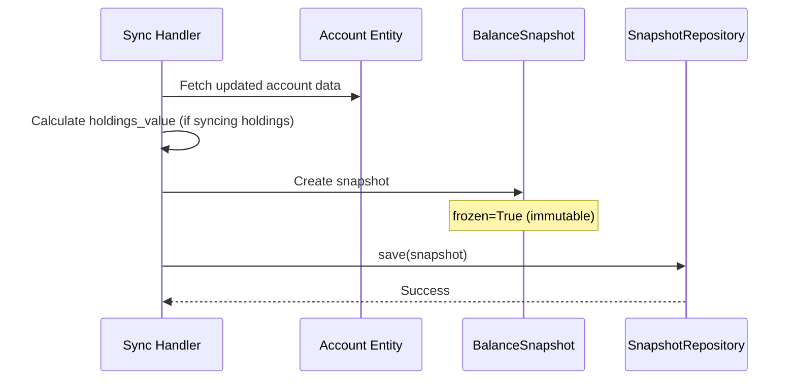

# Balance Tracking Architecture

Balance snapshot domain model for historical portfolio tracking.

---

## Overview

The Balance Tracking system captures point-in-time snapshots of account balances during sync operations. These snapshots enable portfolio value tracking over time, performance calculations, and historical balance charts.

### Core Principle

> Snapshots are IMMUTABLE historical records. Once created, they are never modified. If a correction is needed, create a new snapshot.

### Design Goals

1. **Immutability**: Frozen snapshots that cannot be altered after creation
2. **Time-Series Friendly**: Optimized for date-range queries and charting
3. **Source Tracking**: Know exactly when and why each snapshot was captured
4. **Value Breakdown**: Track total balance, holdings value, and cash separately

---

## Domain Model

### Entity: BalanceSnapshot

```text
BalanceSnapshot (frozen=True)
├── id: UUID                           # Unique identifier
├── account_id: UUID                   # FK to Account
├── balance: Money                     # Total account balance
├── available_balance: Money | None    # Available for trading/withdrawal
├── holdings_value: Money | None       # Total securities value
├── cash_value: Money | None           # Cash/money market balance
├── currency: str                      # ISO 4217 code
├── source: SnapshotSource             # How/why captured
├── provider_metadata: dict | None     # Raw provider data at capture
├── captured_at: datetime              # When balance was captured
└── created_at: datetime               # Record creation timestamp
```

**Note**: `BalanceSnapshot` is a frozen dataclass (`frozen=True`) - all attributes are immutable after creation.

### Value Breakdown

```text
┌─────────────────────────────────────────┐
│            Total Balance                │
│           (balance.amount)              │
├───────────────────┬─────────────────────┤
│   Holdings Value  │     Cash Value      │
│ (holdings_value)  │   (cash_value)      │
│                   │                     │
│  Stocks, ETFs,    │  Money Market,      │
│  Bonds, etc.      │  Sweep Account      │
└───────────────────┴─────────────────────┘

Relationship: balance ≈ holdings_value + cash_value
```

---

## SnapshotSource Enum

```python
class SnapshotSource(StrEnum):
    """Source/trigger of a balance snapshot."""
    
    ACCOUNT_SYNC = "account_sync"
    """Captured during account data sync."""
    
    HOLDINGS_SYNC = "holdings_sync"
    """Captured during holdings sync operation."""
    
    MANUAL_SYNC = "manual_sync"
    """User-initiated sync request."""
    
    SCHEDULED_SYNC = "scheduled_sync"
    """Automated background sync job."""
    
    INITIAL_CONNECTION = "initial_connection"
    """First sync after provider connection."""
    
    # Query Methods
    def is_automated(self) -> bool:
        """Check if snapshot was captured automatically."""
        return self in {ACCOUNT_SYNC, HOLDINGS_SYNC, SCHEDULED_SYNC}
    
    def is_user_initiated(self) -> bool:
        """Check if snapshot was triggered by user action."""
        return self in {MANUAL_SYNC, INITIAL_CONNECTION}
```

### When Snapshots Are Created

| Operation | Source | Trigger |
|-----------|--------|---------|
| Account sync | `ACCOUNT_SYNC` | During `SyncAccountsHandler` |
| Holdings sync | `HOLDINGS_SYNC` | During `SyncHoldingsHandler` |
| User clicks "Refresh" | `MANUAL_SYNC` | Manual refresh button |
| Background job | `SCHEDULED_SYNC` | Cron/scheduler |
| New connection | `INITIAL_CONNECTION` | After OAuth callback |

---

## Query Methods

```python
class BalanceSnapshot:
    def has_value_breakdown(self) -> bool:
        """Check if both holdings_value and cash_value are present."""
        return self.holdings_value is not None and self.cash_value is not None
    
    def get_holdings_percentage(self) -> float | None:
        """Calculate percentage of portfolio in holdings.
        
        Returns:
            Percentage (0-100) or None if breakdown unavailable.
        """
    
    def get_cash_percentage(self) -> float | None:
        """Calculate percentage of portfolio in cash."""
    
    def is_automated_capture(self) -> bool:
        """Check if snapshot was captured automatically."""
        return self.source.is_automated()
    
    def is_user_initiated_capture(self) -> bool:
        """Check if snapshot was triggered by user."""
        return self.source.is_user_initiated()
    
    def calculate_change_from(
        self, previous: "BalanceSnapshot"
    ) -> tuple[Money, float] | None:
        """Calculate change from previous snapshot.
        
        Returns:
            Tuple of (change_amount, change_percent), or None if currencies differ.
        """
```

---

## Repository Protocol

```python
class BalanceSnapshotRepository(Protocol):
    """Port for balance snapshot persistence."""
    
    async def find_by_id(self, snapshot_id: UUID) -> BalanceSnapshot | None:
        """Find snapshot by ID."""
    
    async def find_by_account_id(
        self,
        account_id: UUID,
        limit: int | None = None,
    ) -> list[BalanceSnapshot]:
        """Find snapshots for account (newest first)."""
    
    async def find_by_account_and_date_range(
        self,
        account_id: UUID,
        start_date: datetime,
        end_date: datetime,
    ) -> list[BalanceSnapshot]:
        """Find snapshots within date range (chronological)."""
    
    async def find_latest_by_account(
        self, account_id: UUID
    ) -> BalanceSnapshot | None:
        """Find most recent snapshot for account."""
    
    async def find_latest_by_user(
        self, user_id: UUID
    ) -> list[BalanceSnapshot]:
        """Find latest snapshot for each of user's accounts."""
    
    async def save(self, snapshot: BalanceSnapshot) -> None:
        """Persist snapshot (insert only - no updates)."""
```

---

## Use Cases

### 1. Portfolio Value Chart

Query balance history over a date range to build a line chart:

```python
query = GetBalanceHistory(
    account_id=account_id,
    user_id=user_id,
    start_date=datetime(2024, 1, 1),
    end_date=datetime(2024, 12, 31),
)
result = await handler.handle(query)

# Result contains:
# - snapshots: List ordered chronologically
# - start_balance: First snapshot balance
# - end_balance: Last snapshot balance
# - total_change_amount: end - start
# - total_change_percent: percentage change
```

### 2. Portfolio Summary Dashboard

Get latest balance for all user's accounts:

```python
query = GetLatestBalanceSnapshots(user_id=user_id)
result = await handler.handle(query)

# Result contains:
# - snapshots: One per account (most recent)
# - total_count: Number of accounts
# - total_balance_by_currency: Aggregated balances
```

### 3. Performance Calculation

Calculate daily/weekly/monthly returns:

```python
# Get first and last snapshot in period
first = snapshots[0]
last = snapshots[-1]

change, percent = last.calculate_change_from(first)
print(f"Period return: {change.amount} ({percent:.2f}%)")
```

### 4. Holdings vs Cash Allocation

Track asset allocation over time:

```python
for snapshot in snapshots:
    if snapshot.has_value_breakdown():
        holdings_pct = snapshot.get_holdings_percentage()
        cash_pct = snapshot.get_cash_percentage()
        print(f"{snapshot.captured_at}: {holdings_pct}% holdings, {cash_pct}% cash")
```

---

## Capture Flow



### Snapshot Creation in Handlers

```python
# In SyncAccountsHandler or SyncHoldingsHandler
from uuid_extensions import uuid7
from src.domain.entities import BalanceSnapshot
from src.domain.enums import SnapshotSource

# After syncing data, capture snapshot
snapshot = BalanceSnapshot(
    id=uuid7(),
    account_id=account.id,
    balance=account.balance,
    available_balance=account.available_balance,
    holdings_value=total_holdings_market_value,  # From sum of holdings
    cash_value=account.cash_balance,
    currency=account.currency,
    source=SnapshotSource.HOLDINGS_SYNC,
    provider_metadata={"sync_id": sync_id, "provider": connection.provider_slug},
)
await snapshot_repo.save(snapshot)
```

---

## Validation Rules

### BalanceSnapshot Entity

- `id`: Required, valid UUID
- `account_id`: Required, valid UUID (references Account)
- `balance`: Required, Money value object
- `currency`: Required, 3-letter ISO code
- `source`: Required, valid SnapshotSource

### Currency Consistency

All monetary fields must have matching currency:

- `balance.currency == currency`
- `available_balance.currency == currency` (if present)
- `holdings_value.currency == currency` (if present)
- `cash_value.currency == currency` (if present)

---

## File Structure

```text
src/domain/
├── entities/
│   └── balance_snapshot.py         # BalanceSnapshot entity
├── enums/
│   └── snapshot_source.py          # SnapshotSource enum
├── errors/
│   └── balance_snapshot_error.py   # Error constants
└── protocols/
    └── balance_snapshot_repository.py  # Repository protocol

src/infrastructure/
└── persistence/
    ├── models/
    │   └── balance_snapshot.py     # SQLAlchemy model
    └── repositories/
        └── balance_snapshot_repository.py  # PostgreSQL adapter

src/application/
├── queries/
│   └── balance_snapshot_queries.py  # Query definitions
└── handlers/
    └── balance_snapshot_handlers.py  # Query handlers

tests/
├── unit/
│   └── test_domain_balance_snapshot.py
└── integration/
    └── test_balance_snapshot_repository.py
```

---

## Testing Strategy

### Unit Tests (~40+ tests)

**BalanceSnapshot Entity**:

- Entity creation with valid/invalid fields
- Frozen immutability (cannot modify after creation)
- Currency consistency validation
- Query methods: `has_value_breakdown()`, `get_holdings_percentage()`, `get_cash_percentage()`
- `calculate_change_from()` with various scenarios

**SnapshotSource Enum**:

- All enum values
- `is_automated()` classification
- `is_user_initiated()` classification

### Integration Tests (~20+ tests)

**Repository**:

- Save and retrieve
- Query by account_id
- Query by date range
- Find latest by account
- Find latest by user (aggregation)

**Handler Tests**:

- GetBalanceHistory with date filtering
- GetLatestBalanceSnapshots aggregation
- ListBalanceSnapshotsByAccount pagination

### Coverage Target

- Domain layer: 95%+
- Repository: 70%+
- Handlers: 85%+

---

## Performance Considerations

### Indexing

```sql
-- Essential indexes for balance_snapshots table
CREATE INDEX idx_balance_snapshots_account_id 
    ON balance_snapshots(account_id);

CREATE INDEX idx_balance_snapshots_captured_at 
    ON balance_snapshots(captured_at DESC);

CREATE INDEX idx_balance_snapshots_account_captured 
    ON balance_snapshots(account_id, captured_at DESC);
```

### Query Optimization

- **Date range queries**: Use `captured_at` index for efficient time-series access
- **Latest per account**: Single query with window function or subquery
- **Aggregations**: Sum at application layer to avoid complex SQL

### Data Volume

Snapshot frequency determines storage growth:

| Frequency | Snapshots/Account/Year | Storage Estimate |
|-----------|------------------------|------------------|
| Daily | ~365 | ~50KB |
| On sync only | ~50-100 | ~10KB |
| Real-time | ~2000+ | ~250KB |

**Recommendation**: Capture on sync only (not real-time) to balance accuracy with storage.

---

## Security Considerations

1. **User Isolation**: All queries filter by user_id (enforced at handler level)
2. **Balance Privacy**: Financial data never logged with actual amounts
3. **Audit Trail**: Snapshot creation logged with structured logging
4. **Provider Metadata**: Contains debugging info, not exposed to clients

---

**Created**: 2025-12-26 | **Last Updated**: 2025-12-26
