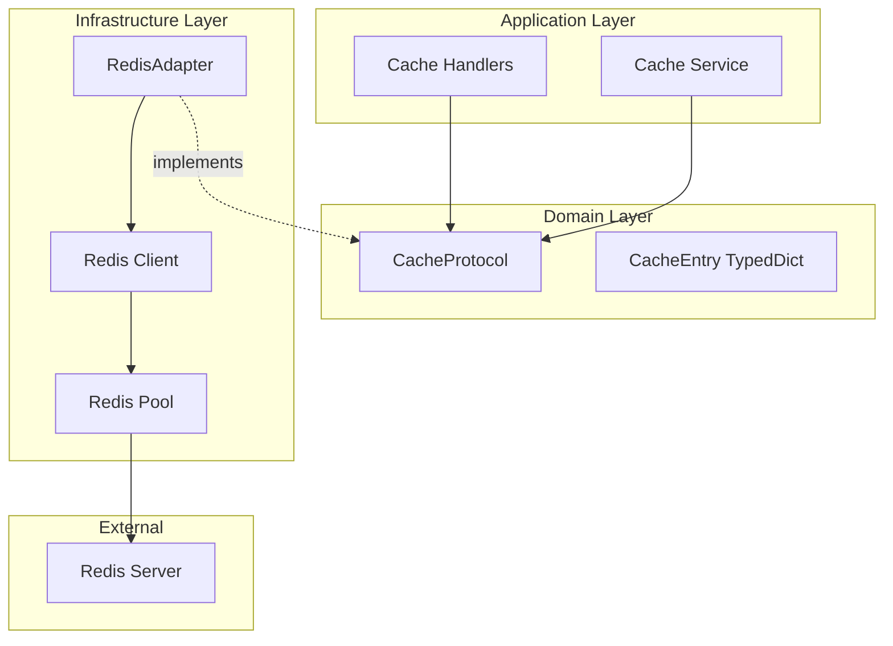

# Cache Architecture

## Overview

This document describes the cache implementation for Dashtam, following
hexagonal architecture principles with clear separation between domain
protocols and infrastructure adapters. Redis is used as the concrete
implementation, but the architecture is designed to be adapter-agnostic.

---

## Design Principles

### Core Principles

1. **Domain Independence**: Cache protocol defined in domain layer,
   Redis is just one implementation
2. **Async-First**: All cache operations are async for non-blocking I/O
3. **Fail-Open**: Cache failures should not break core functionality
4. **Type Safety**: Strong typing with Python 3.13+ features
5. **Protocol-Based**: Using Python Protocol for interfaces

### Architectural Decisions

- **No Unit Tests for Infrastructure**: Redis adapter only has integration tests
- **TypedDict for Cache Metadata**: Internal data structures use TypedDict
- **Result Types**: All cache operations return Result[T, CacheError]
- **Connection Pooling**: Redis connection pool for efficiency
- **JSON Serialization**: Default serialization strategy for complex objects

---

## Architecture Overview



---

## Hexagonal Architecture Compliance

### Layer Separation

```python
# DOMAIN LAYER (src/domain/protocols/cache.py)
# Defines what the domain needs from a cache
from typing import Protocol, TypeVar, Any
from src.core.result import Result
from src.domain.errors import CacheError

T = TypeVar('T')

class CacheProtocol(Protocol):
    """Cache port - what domain needs from cache."""
    
    async def get(self, key: str) -> Result[str | None, CacheError]:
        """Get value from cache."""
        ...
    
    async def set(
        self, 
        key: str, 
        value: str, 
        ttl: int | None = None
    ) -> Result[None, CacheError]:
        """Set value in cache with optional TTL."""
        ...
    
    async def delete(self, key: str) -> Result[bool, CacheError]:
        """Delete key from cache."""
        ...
    
    async def exists(self, key: str) -> Result[bool, CacheError]:
        """Check if key exists."""
        ...
    
    async def expire(self, key: str, seconds: int) -> Result[bool, CacheError]:
        """Set expiration on key."""
        ...
    
    async def flush(self) -> Result[None, CacheError]:
        """Flush all keys (use with caution)."""
        ...

# INFRASTRUCTURE LAYER (src/infrastructure/cache/redis_adapter.py)
# Implements the cache protocol using Redis
class RedisAdapter:  # No inheritance!
    """Redis implementation of CacheProtocol."""
    
    def __init__(self, redis_client: Redis):
        self._redis = redis_client
    
    async def get(self, key: str) -> Result[str | None, CacheError]:
        try:
            value = await self._redis.get(key)
            return Success(value)
        except Exception as e:
            return Failure(CacheError(
                message=f"Cache get failed: {str(e)}",
                code="CACHE_GET_ERROR"
            ))
```

### Dependency Rule

- ✅ Domain defines protocol (CacheProtocol)
- ✅ Infrastructure implements protocol (RedisAdapter)
- ✅ Domain has NO knowledge of Redis
- ✅ Application uses protocol, not concrete Redis class

---

## Cache Protocol (Port)

### Protocol Definition

```python
# src/domain/protocols/cache.py
from typing import Protocol, TypedDict
from datetime import datetime
from src.core.result import Result
from src.domain.errors import CacheError

class CacheEntry(TypedDict):
    """Internal cache entry metadata."""
    key: str
    value: str
    ttl: int | None
    created_at: float
    expires_at: float | None

class CacheProtocol(Protocol):
    """
    Cache protocol for domain layer.
    
    This defines what the domain needs from a cache,
    without knowing about Redis or any specific implementation.
    """
    
    async def get(self, key: str) -> Result[str | None, CacheError]:
        """
        Get value from cache.
        
        Args:
            key: Cache key
            
        Returns:
            Result with value if found, None if not found, or CacheError
        """
        ...
    
    async def get_json(self, key: str) -> Result[dict | None, CacheError]:
        """
        Get JSON value from cache.
        
        Args:
            key: Cache key
            
        Returns:
            Result with parsed JSON or CacheError
        """
        ...
    
    async def set(
        self, 
        key: str, 
        value: str, 
        ttl: int | None = None
    ) -> Result[None, CacheError]:
        """
        Set value in cache.
        
        Args:
            key: Cache key
            value: Value to cache
            ttl: Time to live in seconds (None = no expiration)
            
        Returns:
            Result with None on success or CacheError
        """
        ...
    
    async def set_json(
        self,
        key: str,
        value: dict,
        ttl: int | None = None
    ) -> Result[None, CacheError]:
        """
        Set JSON value in cache.
        
        Args:
            key: Cache key
            value: Dictionary to serialize and cache
            ttl: Time to live in seconds
            
        Returns:
            Result with None on success or CacheError
        """
        ...
    
    async def delete(self, key: str) -> Result[bool, CacheError]:
        """
        Delete key from cache.
        
        Args:
            key: Cache key to delete
            
        Returns:
            Result with True if deleted, False if not found, or CacheError
        """
        ...
    
    async def exists(self, key: str) -> Result[bool, CacheError]:
        """
        Check if key exists.
        
        Args:
            key: Cache key to check
            
        Returns:
            Result with existence status or CacheError
        """
        ...
    
    async def expire(self, key: str, seconds: int) -> Result[bool, CacheError]:
        """
        Set expiration on existing key.
        
        Args:
            key: Cache key
            seconds: Seconds until expiration
            
        Returns:
            Result with True if set, False if key not found, or CacheError
        """
        ...
    
    async def increment(
        self,
        key: str,
        amount: int = 1
    ) -> Result[int, CacheError]:
        """
        Atomic increment operation.
        
        Args:
            key: Cache key
            amount: Amount to increment by
            
        Returns:
            Result with new value or CacheError
        """
        ...
    
    async def decrement(
        self,
        key: str,
        amount: int = 1
    ) -> Result[int, CacheError]:
        """
        Atomic decrement operation.
        
        Args:
            key: Cache key
            amount: Amount to decrement by
            
        Returns:
            Result with new value or CacheError
        """
        ...
    
    async def ttl(self, key: str) -> Result[int | None, CacheError]:
        """
        Get time to live for key.
        
        Args:
            key: Cache key
            
        Returns:
            Result with seconds until expiration, None if no TTL
        """
        ...
    
    async def flush(self) -> Result[None, CacheError]:
        """
        Flush all keys from cache (use with caution).
        
        Returns:
            Result with None on success or CacheError
        """
        ...
    
    async def ping(self) -> Result[bool, CacheError]:
        """
        Check cache connectivity (health check).
        
        Returns:
            Result with True if reachable or CacheError
        """
        ...
    
    async def delete_pattern(self, pattern: str) -> Result[int, CacheError]:
        """
        Delete all keys matching pattern.
        
        Args:
            pattern: Glob-style pattern (e.g., "user:*")
            
        Returns:
            Result with count of deleted keys or CacheError
        """
        ...
    
    async def get_many(self, keys: list[str]) -> Result[dict[str, str | None], CacheError]:
        """
        Get multiple values at once (batch operation).
        
        Args:
            keys: List of cache keys
            
        Returns:
            Result with dict of key->value or CacheError
        """
        ...
    
    async def set_many(
        self,
        mapping: dict[str, str],
        ttl: int | None = None
    ) -> Result[None, CacheError]:
        """
        Set multiple values at once (batch operation).
        
        Args:
            mapping: Dict of key->value pairs
            ttl: Time to live for all keys
            
        Returns:
            Result with None on success or CacheError
        """
        ...
```

---

## Redis Adapter (Infrastructure)

### Implementation

```python
# src/infrastructure/cache/redis_adapter.py
import json
from typing import Any
from redis.asyncio import Redis, ConnectionPool
from src.core.result import Result, Success, Failure
from src.domain.protocols.cache import CacheProtocol, CacheEntry
from src.domain.errors import CacheError
from src.core.config import settings
import structlog

logger = structlog.get_logger()

class RedisAdapter:
    """
    Redis implementation of CacheProtocol.
    
    This is a thin adapter that wraps Redis operations
    and converts them to Result types.
    """
    
    def __init__(self, redis_client: Redis | None = None):
        """
        Initialize Redis adapter.
        
        Args:
            redis_client: Optional Redis client (for testing)
        """
        self._redis = redis_client
        self._pool: ConnectionPool | None = None
    
    async def connect(self) -> None:
        """
        Connect to Redis using settings.
        
        Creates connection pool for efficiency.
        """
        if not self._redis:
            self._pool = ConnectionPool.from_url(
                settings.redis_url,
                max_connections=50,
                decode_responses=True,
            )
            self._redis = Redis(connection_pool=self._pool)
            
            # Test connection
            await self._redis.ping()
            logger.info("redis_connected", url=settings.redis_url)
    
    async def disconnect(self) -> None:
        """Close Redis connection."""
        if self._redis:
            await self._redis.aclose()
            if self._pool:
                await self._pool.disconnect()
            logger.info("redis_disconnected")
    
    async def get(self, key: str) -> Result[str | None, CacheError]:
        """Get value from Redis."""
        try:
            value = await self._redis.get(key)
            return Success(value)
        except Exception as e:
            logger.error("redis_get_error", key=key, error=str(e))
            return Failure(CacheError(
                message=f"Failed to get key: {key}",
                code="CACHE_GET_ERROR",
                details={"key": key, "error": str(e)}
            ))
    
    async def get_json(self, key: str) -> Result[dict | None, CacheError]:
        """Get JSON value from Redis."""
        result = await self.get(key)
        match result:
            case Success(value) if value:
                try:
                    return Success(json.loads(value))
                except json.JSONDecodeError as e:
                    return Failure(CacheError(
                        message=f"Invalid JSON in cache: {key}",
                        code="CACHE_JSON_ERROR",
                        details={"key": key, "error": str(e)}
                    ))
            case Success(None):
                return Success(None)
            case Failure(error):
                return Failure(error)
    
    async def set(
        self,
        key: str,
        value: str,
        ttl: int | None = None
    ) -> Result[None, CacheError]:
        """Set value in Redis."""
        try:
            if ttl:
                await self._redis.setex(key, ttl, value)
            else:
                await self._redis.set(key, value)
            return Success(None)
        except Exception as e:
            logger.error("redis_set_error", key=key, error=str(e))
            return Failure(CacheError(
                message=f"Failed to set key: {key}",
                code="CACHE_SET_ERROR",
                details={"key": key, "error": str(e)}
            ))
    
    async def set_json(
        self,
        key: str,
        value: dict,
        ttl: int | None = None
    ) -> Result[None, CacheError]:
        """Set JSON value in Redis."""
        try:
            json_str = json.dumps(value)
            return await self.set(key, json_str, ttl)
        except (TypeError, ValueError) as e:
            return Failure(CacheError(
                message=f"Failed to serialize value for key: {key}",
                code="CACHE_JSON_ERROR",
                details={"key": key, "error": str(e)}
            ))
    
    async def delete(self, key: str) -> Result[bool, CacheError]:
        """Delete key from Redis."""
        try:
            deleted = await self._redis.delete(key)
            return Success(bool(deleted))
        except Exception as e:
            logger.error("redis_delete_error", key=key, error=str(e))
            return Failure(CacheError(
                message=f"Failed to delete key: {key}",
                code="CACHE_DELETE_ERROR",
                details={"key": key, "error": str(e)}
            ))
    
    async def exists(self, key: str) -> Result[bool, CacheError]:
        """Check if key exists in Redis."""
        try:
            exists = await self._redis.exists(key)
            return Success(bool(exists))
        except Exception as e:
            logger.error("redis_exists_error", key=key, error=str(e))
            return Failure(CacheError(
                message=f"Failed to check key existence: {key}",
                code="CACHE_EXISTS_ERROR",
                details={"key": key, "error": str(e)}
            ))
    
    async def expire(self, key: str, seconds: int) -> Result[bool, CacheError]:
        """Set expiration on key."""
        try:
            result = await self._redis.expire(key, seconds)
            return Success(bool(result))
        except Exception as e:
            logger.error("redis_expire_error", key=key, error=str(e))
            return Failure(CacheError(
                message=f"Failed to set expiration on key: {key}",
                code="CACHE_EXPIRE_ERROR",
                details={"key": key, "seconds": seconds, "error": str(e)}
            ))
    
    async def increment(
        self,
        key: str,
        amount: int = 1
    ) -> Result[int, CacheError]:
        """Atomic increment."""
        try:
            new_value = await self._redis.incrby(key, amount)
            return Success(new_value)
        except Exception as e:
            logger.error("redis_increment_error", key=key, error=str(e))
            return Failure(CacheError(
                message=f"Failed to increment key: {key}",
                code="CACHE_INCREMENT_ERROR",
                details={"key": key, "amount": amount, "error": str(e)}
            ))
    
    async def get_many(self, keys: list[str]) -> Result[dict[str, str | None], CacheError]:
        """Get multiple values."""
        try:
            values = await self._redis.mget(keys)
            result = dict(zip(keys, values))
            return Success(result)
        except Exception as e:
            logger.error("redis_mget_error", keys=keys, error=str(e))
            return Failure(CacheError(
                message="Failed to get multiple keys",
                code="CACHE_MGET_ERROR",
                details={"keys": keys, "error": str(e)}
            ))
    
    async def set_many(
        self,
        mapping: dict[str, str],
        ttl: int | None = None
    ) -> Result[None, CacheError]:
        """Set multiple values."""
        try:
            # Use pipeline for atomic operation
            async with self._redis.pipeline() as pipe:
                for key, value in mapping.items():
                    if ttl:
                        pipe.setex(key, ttl, value)
                    else:
                        pipe.set(key, value)
                await pipe.execute()
            return Success(None)
        except Exception as e:
            logger.error("redis_mset_error", error=str(e))
            return Failure(CacheError(
                message="Failed to set multiple keys",
                code="CACHE_MSET_ERROR",
                details={"error": str(e)}
            ))
    
    async def delete_pattern(self, pattern: str) -> Result[int, CacheError]:
        """Delete all keys matching pattern."""
        try:
            # Use SCAN to avoid blocking on large datasets
            count = 0
            async for key in self._redis.scan_iter(match=pattern):
                await self._redis.delete(key)
                count += 1
            return Success(count)
        except Exception as e:
            logger.error("redis_delete_pattern_error", pattern=pattern, error=str(e))
            return Failure(CacheError(
                message=f"Failed to delete keys matching pattern: {pattern}",
                code="CACHE_DELETE_ERROR",
                details={"pattern": pattern, "error": str(e)}
            ))
    
    async def ping(self) -> Result[bool, CacheError]:
        """Check Redis connectivity (health check)."""
        try:
            await self._redis.ping()
            return Success(True)
        except Exception as e:
            logger.error("redis_ping_failed", error=str(e))
            return Failure(CacheError(
                message="Redis ping failed",
                code="CACHE_CONNECTION_ERROR",
                details={"error": str(e)}
            ))
```

---

## Cache Patterns

### Cache-Aside Pattern

Most common pattern - application manages cache:

```python
# src/application/services/cache_service.py
class CacheService:
    def __init__(self, cache: CacheProtocol):
        self._cache = cache
    
    async def get_user(self, user_id: str) -> User | None:
        # Try cache first
        cache_key = f"user:{user_id}"
        result = await self._cache.get_json(cache_key)
        
        match result:
            case Success(data) if data:
                return User.from_dict(data)
            case Success(None):
                # Cache miss - fetch from database
                user = await self._user_repo.find_by_id(user_id)
                if user:
                    # Store in cache for next time
                    await self._cache.set_json(
                        cache_key,
                        user.to_dict(),
                        ttl=3600  # 1 hour
                    )
                return user
            case Failure(_):
                # Cache error - continue without cache
                return await self._user_repo.find_by_id(user_id)
```

### Key Naming Conventions

```python
# Hierarchical keys with clear namespaces
USER_KEY = "user:{user_id}"
SESSION_KEY = "session:{session_id}"
RATE_LIMIT_KEY = "rate_limit:{user_id}:{endpoint}"
PROVIDER_TOKEN_KEY = "provider:token:{provider}:{user_id}"
CACHE_VERSION_KEY = "cache:version:{entity_type}"
```

### TTL Strategy

```python
# Different TTLs for different data types
TTL_SESSION = 1800           # 30 minutes
TTL_USER = 3600             # 1 hour  
TTL_PROVIDER_TOKEN = 3300   # 55 minutes (refresh before expiry)
TTL_RATE_LIMIT = 60         # 1 minute
TTL_STATIC_DATA = 86400     # 24 hours
```

---

## Connection Management

### Centralized Dependency Injection

**Cache uses the centralized container pattern** (see
`dependency-injection-architecture.md`):

```python
# src/core/container.py
from functools import lru_cache
from src.domain.protocols.cache import CacheProtocol

@lru_cache()
def get_cache() -> CacheProtocol:
    """Get cache client singleton (app-scoped).
    
    Container creates RedisAdapter directly with connection pooling.
    This follows the Composition Root pattern (industry best practice).
    
    Returns:
        Cache client implementing CacheProtocol.
    
    Usage:
        # Application Layer (direct use)
        cache = get_cache()
        await cache.set("key", "value")
        
        # Presentation Layer (FastAPI Depends)
        cache: CacheProtocol = Depends(get_cache)
    """
    from redis.asyncio import ConnectionPool, Redis
    from src.infrastructure.cache.redis_adapter import RedisAdapter
    
    # Container owns Redis connection pool configuration
    pool = ConnectionPool.from_url(
        settings.redis_url,
        max_connections=50,
        decode_responses=False,
        socket_connect_timeout=5,
        socket_timeout=5,
        retry_on_timeout=True,
        socket_keepalive=True,
        socket_keepalive_options={1: 1, 2: 1, 3: 5},
    )
    redis_client = Redis(connection_pool=pool)
    return RedisAdapter(redis_client=redis_client)
```

### Connection Lifecycle

```python
# src/infrastructure/cache/__init__.py
from src.infrastructure.cache.redis_adapter import RedisAdapter

# Deprecated: Use src.core.container.get_cache() instead
# This file exists only for backward compatibility

async def close_cache() -> None:
    """Close cache connection on shutdown."""
    from src.core.container import get_cache
    cache = get_cache()
    if isinstance(cache, RedisAdapter):
        await cache.disconnect()
```

### Application Startup/Shutdown

```python
# src/main.py
from contextlib import asynccontextmanager
from fastapi import FastAPI
from src.core.container import get_cache

@asynccontextmanager
async def lifespan(app: FastAPI):
    # Startup - initialize singleton
    cache = get_cache()
    if hasattr(cache, 'connect'):
        await cache.connect()
    
    yield
    
    # Shutdown
    if hasattr(cache, 'disconnect'):
        await cache.disconnect()

app = FastAPI(lifespan=lifespan)
```

---

## Error Handling

### Fail-Open Strategy

Cache failures should not break core functionality:

```python
async def get_with_fallback(
    cache: CacheProtocol,
    key: str,
    fallback_fn
):
    """Get from cache with fallback on error."""
    result = await cache.get(key)
    
    match result:
        case Success(value) if value:
            return value
        case Success(None) | Failure(_):
            # Cache miss or error - use fallback
            return await fallback_fn()
```

### Error Types

```python
# src/domain/errors.py
@dataclass(frozen=True, slots=True, kw_only=True)
class CacheError(InfrastructureError):
    """Cache-related errors."""
    pass

# Common error codes
CACHE_CONNECTION_ERROR = "cache_connection_error"
CACHE_TIMEOUT = "cache_timeout"
CACHE_GET_ERROR = "cache_get_error"
CACHE_SET_ERROR = "cache_set_error"
CACHE_DELETE_ERROR = "cache_delete_error"
CACHE_SERIALIZATION_ERROR = "cache_serialization_error"
```

---

## Testing Strategy

### NO Unit Tests for Infrastructure

Redis adapter is a thin wrapper - only integration tests needed:

```python
# tests/integration/test_infrastructure_cache_redis.py
import pytest
from src.infrastructure.cache.redis_adapter import RedisAdapter
from src.core.result import Success, Failure

@pytest.mark.asyncio
class TestRedisIntegration:
    """Integration tests for Redis adapter."""
    
    @pytest.fixture
    async def redis_adapter(self):
        """Create Redis adapter for tests."""
        adapter = RedisAdapter()
        await adapter.connect()
        yield adapter
        # Cleanup
        await adapter._redis.flushdb()
        await adapter.disconnect()
    
    async def test_get_set_operations(self, redis_adapter):
        """Test basic get/set operations."""
        # Set value
        result = await redis_adapter.set("test:key", "test_value", ttl=10)
        assert isinstance(result, Success)
        
        # Get value
        result = await redis_adapter.get("test:key")
        assert isinstance(result, Success)
        assert result.value == "test_value"
        
        # Get non-existent key
        result = await redis_adapter.get("non:existent")
        assert isinstance(result, Success)
        assert result.value is None
    
    async def test_json_operations(self, redis_adapter):
        """Test JSON get/set operations."""
        data = {"user_id": "123", "name": "Test User"}
        
        # Set JSON
        result = await redis_adapter.set_json("test:json", data)
        assert isinstance(result, Success)
        
        # Get JSON
        result = await redis_adapter.get_json("test:json")
        assert isinstance(result, Success)
        assert result.value == data
    
    async def test_ttl_expiration(self, redis_adapter):
        """Test TTL expiration."""
        # Set with 1 second TTL
        await redis_adapter.set("test:ttl", "value", ttl=1)
        
        # Should exist immediately
        result = await redis_adapter.exists("test:ttl")
        assert result.value is True
        
        # Wait for expiration
        await asyncio.sleep(2)
        
        # Should not exist
        result = await redis_adapter.exists("test:ttl")
        assert result.value is False
    
    async def test_atomic_increment(self, redis_adapter):
        """Test atomic increment operation."""
        # First increment (creates key)
        result = await redis_adapter.increment("test:counter")
        assert result.value == 1
        
        # Second increment
        result = await redis_adapter.increment("test:counter", amount=5)
        assert result.value == 6
    
    async def test_multi_operations(self, redis_adapter):
        """Test multi-get/set operations."""
        # Set multiple
        mapping = {
            "test:1": "value1",
            "test:2": "value2",
            "test:3": "value3",
        }
        result = await redis_adapter.set_many(mapping)
        assert isinstance(result, Success)
        
        # Get multiple
        keys = list(mapping.keys())
        result = await redis_adapter.get_many(keys)
        assert isinstance(result, Success)
        assert result.value == mapping
    
    async def test_pattern_deletion(self, redis_adapter):
        """Test pattern-based deletion."""
        # Set multiple keys
        await redis_adapter.set("user:1", "data1")
        await redis_adapter.set("user:2", "data2")
        await redis_adapter.set("session:1", "data3")
        
        # Delete user:* pattern
        result = await redis_adapter.flush_pattern("user:*")
        assert result.value == 2
        
        # Verify deletion
        assert (await redis_adapter.exists("user:1")).value is False
        assert (await redis_adapter.exists("user:2")).value is False
        assert (await redis_adapter.exists("session:1")).value is True
    
    async def test_health_check(self, redis_adapter):
        """Test health check."""
        result = await redis_adapter.health_check()
        assert isinstance(result, Success)
        assert result.value is True
```

---

## Integration Points

### Rate Limiting (F1.2)

```python
# Rate limiter will use cache for token buckets
async def check_rate_limit(
    cache: CacheProtocol,
    user_id: str,
    endpoint: str,
    limit: int = 100
) -> bool:
    key = f"rate_limit:{user_id}:{endpoint}"
    result = await cache.increment(key)
    
    match result:
        case Success(count) if count == 1:
            # First request - set expiration
            await cache.expire(key, 60)  # 1 minute window
            return True
        case Success(count):
            return count <= limit
        case Failure(_):
            # Fail open - allow request on cache error
            return True
```

### Session Management (F1.3)

```python
# Session storage in Redis
async def store_session(
    cache: CacheProtocol,
    session_id: str,
    user_data: dict
) -> None:
    await cache.set_json(
        f"session:{session_id}",
        user_data,
        ttl=1800  # 30 minutes
    )
```

### Provider Tokens

```python
# Cache OAuth tokens to avoid database lookups
async def cache_provider_token(
    cache: CacheProtocol,
    provider: str,
    user_id: str,
    token: str,
    expires_in: int
) -> None:
    await cache.set(
        f"provider:token:{provider}:{user_id}",
        token,
        ttl=expires_in - 300  # Refresh 5 minutes before expiry
    )
```

---

## Security Considerations

### Data Sensitivity

- **No PII in keys**: Use IDs, not emails or names
- **Encryption**: Sensitive data should be encrypted before caching
- **TTL for sensitive data**: Short TTLs for tokens and sessions
- **No passwords**: Never cache passwords, even hashed

### Access Control

```python
# Namespace isolation for multi-tenant scenarios
def get_cache_key(tenant_id: str, resource: str, id: str) -> str:
    """Generate tenant-isolated cache key."""
    return f"{tenant_id}:{resource}:{id}"
```

---

## Performance Optimization

### Connection Pooling

```python
# Configured in RedisAdapter
ConnectionPool.from_url(
    settings.redis_url,
    max_connections=50,  # Adjust based on load
    socket_connect_timeout=5,
    socket_timeout=5,
    retry_on_timeout=True,
    socket_keepalive=True,
    socket_keepalive_options={
        1: 1,  # TCP_KEEPIDLE
        2: 1,  # TCP_KEEPINTVL
        3: 5,  # TCP_KEEPCNT
    }
)
```

### Pipelining

```python
# Batch operations for efficiency
async def cache_users(cache: CacheProtocol, users: list[User]):
    mapping = {
        f"user:{user.id}": json.dumps(user.to_dict())
        for user in users
    }
    await cache.set_many(mapping, ttl=3600)
```

### Lazy Loading

Only cache data that's actually accessed:

```python
@cache_aside(key="user:{user_id}", ttl=3600)
async def get_user(user_id: str) -> User:
    return await user_repository.find_by_id(user_id)
```

---

## Future Enhancements

### Planned Improvements

1. **Cache Warming**: Pre-populate cache on startup
2. **Circuit Breaker**: Protect against Redis failures
3. **Distributed Caching**: Redis Cluster support
4. **Cache Statistics**: Hit/miss ratios, performance metrics
5. **Pub/Sub Support**: For cache invalidation across instances
6. **Lua Scripts**: For complex atomic operations
7. **Compression**: For large cached values

### Potential Decorators

```python
# Future: Simplified caching with decorators
@cache(key="user:{user_id}", ttl=3600)
async def get_user(user_id: str) -> User:
    return await db.get_user(user_id)

@invalidate(pattern="user:{user_id}*")
async def update_user(user_id: str, data: dict) -> User:
    return await db.update_user(user_id, data)
```

---

## Summary

This Redis cache implementation follows hexagonal architecture principles with:

- **Clear separation**: Domain protocol vs infrastructure adapter
- **Type safety**: Strong typing with Result types
- **Fail-open**: Cache errors don't break functionality  
- **Testability**: Integration tests only (no unit tests for adapters)
- **Performance**: Connection pooling, pipelining, lazy loading
- **Security**: No PII in keys, encryption for sensitive data
- **Centralized DI**: Uses container pattern for consistent dependency management

The cache is ready for use in rate limiting, session management, and
general application caching needs.

**See also**: `dependency-injection-architecture.md` for container pattern details.

---

**Created**: 2025-11-11 | **Last Updated**: 2025-12-05
