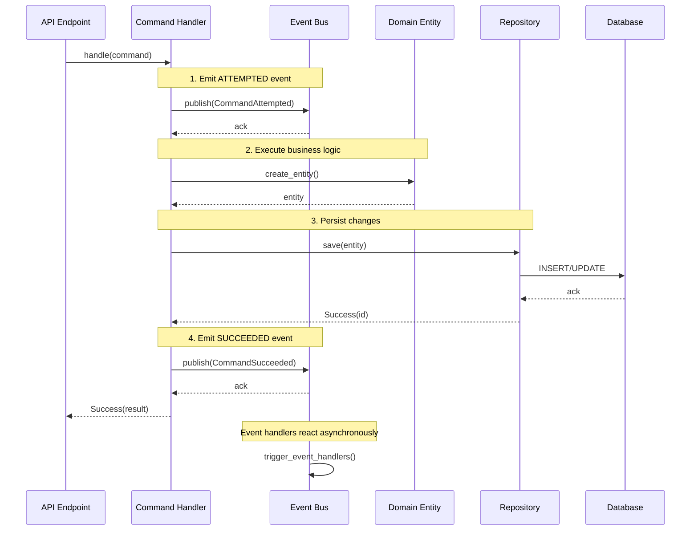
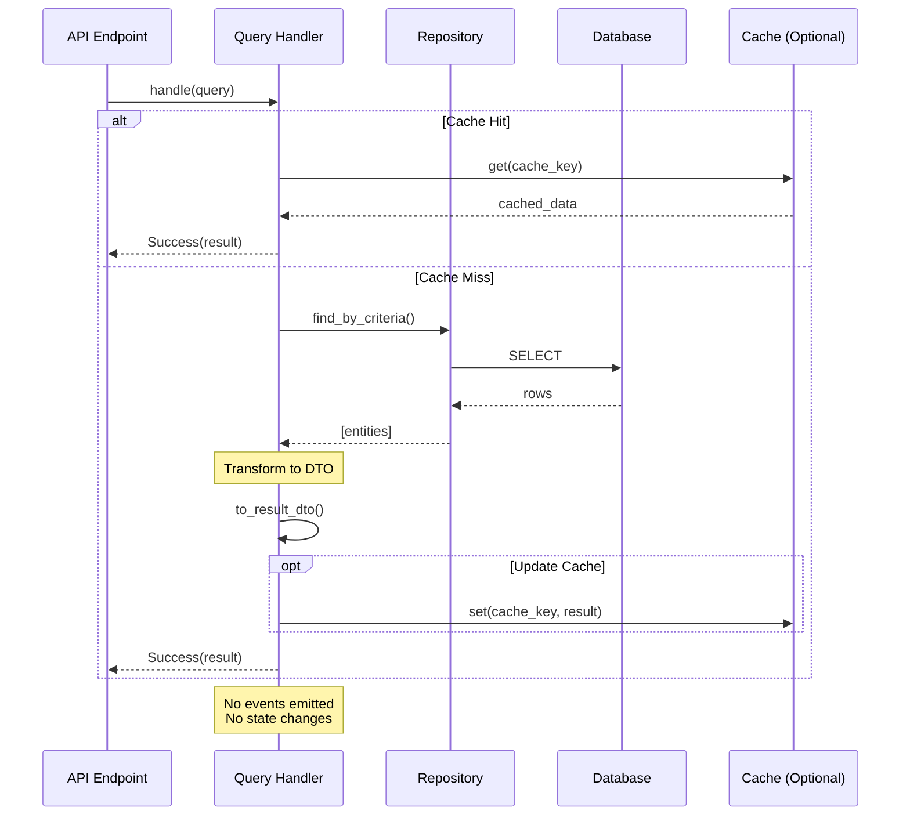
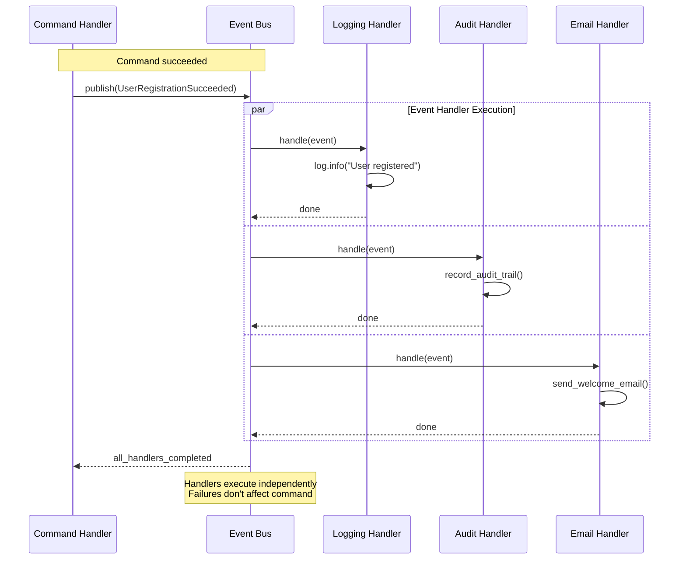
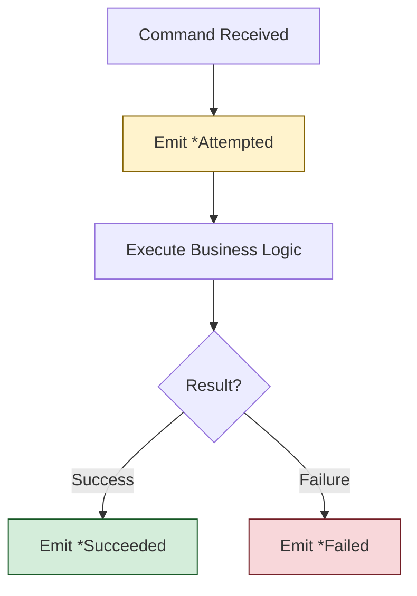

# CQRS Pattern Architecture

## Overview

**Purpose**: Separate read (Query) and write (Command) operations for clarity, scalability, and testability.

**Problem**: Traditional CRUD operations mix reads and writes, leading to:

- Unclear intent (is this a read or write?)
- Difficult optimization (reads and writes have different patterns)
- Tight coupling (one handler does everything)

**Solution**: CQRS (Command Query Responsibility Segregation) separates:

- **Commands**: Write operations that change state (create, update, delete)
- **Queries**: Read operations that return data (get, list, search)

---

## Core Concepts

### Commands (Write Operations)

**Definition**: Immutable dataclasses representing user intent to change system state.

**Characteristics**:

- Named as imperative verb + noun (e.g., `RegisterUser`, `ConnectProvider`)
- Frozen dataclasses (`frozen=True, kw_only=True`)
- Contain all data needed to execute the operation
- NEVER return data directly (handlers return `Result` types)
- Use Annotated types for validation (DRY principle)

**Pattern**:

```python
@dataclass(frozen=True, kw_only=True)
class RegisterUser:
    """Register new user account.
    
    Attributes:
        email: User's email address (validated, normalized).
        password: User's password (validated strength, plain text).
    """
    email: Email      # Annotated type with validation
    password: Password  # Annotated type with validation
```

**Naming Convention**:

- `{Verb}{Noun}` - imperative action
- Examples: `RegisterUser`, `ConnectProvider`, `DisconnectProvider`, `RefreshProviderTokens`

### Queries (Read Operations)

**Definition**: Immutable dataclasses representing requests for data.

**Characteristics**:

- Named as question-like (e.g., `GetUser`, `ListProviders`)
- Frozen dataclasses (`frozen=True, kw_only=True`)
- Contain filter/pagination parameters
- NEVER change state
- May include authorization context (user_id for ownership checks)

**Pattern**:

```python
@dataclass(frozen=True, kw_only=True)
class ListUserSessions:
    """List all sessions for a user.
    
    Attributes:
        user_id: User identifier.
        active_only: Filter to active sessions only.
    """
    user_id: UUID
    active_only: bool = True
```

**Naming Convention**:

- `Get{Noun}` - single item retrieval
- `List{Noun}s` - collection retrieval
- Examples: `GetProvider`, `ListProviders`, `GetSession`, `ListUserSessions`

---

## Handler Pattern

### Command Handlers

**Responsibility**: Execute business logic and emit domain events.

**Structure**:

```python
class RegisterUserHandler:
    """Handler for user registration command."""
    
    def __init__(
        self,
        user_repo: UserRepository,       # Domain protocol
        event_bus: EventBusProtocol,     # Domain protocol
        password_service: PasswordHashingProtocol,
    ) -> None:
        self._user_repo = user_repo
        self._event_bus = event_bus
        self._password_service = password_service
    
    async def handle(self, cmd: RegisterUser) -> Result[UUID, str]:
        """Handle registration command.
        
        Returns:
            Success(user_id) on success
            Failure(error_message) on failure
        """
        # 1. Emit ATTEMPTED event
        await self._event_bus.publish(
            UserRegistrationAttempted(...)
        )
        
        try:
            # 2. Execute business logic
            ...
            
            # 3. Emit SUCCEEDED event
            await self._event_bus.publish(
                UserRegistrationSucceeded(...)
            )
            
            return Success(value=user_id)
            
        except Exception as e:
            # 4. Emit FAILED event
            await self._event_bus.publish(
                UserRegistrationFailed(reason=str(e))
            )
            return Failure(error=str(e))
```

**Key Principles**:

1. **Single Responsibility**: One handler per command
2. **Dependency Injection**: All dependencies via constructor (protocols only)
3. **Result Types**: Return `Success` or `Failure` (never raise for expected errors)
4. **Domain Events**: Emit 3-state events for critical workflows

### Query Handlers

**Responsibility**: Fetch and transform data.

**Structure** (simple queries):

```python
class ListSessionsHandler:
    """Handler for listing user sessions."""
    
    def __init__(self, session_repo: SessionRepository) -> None:
        self._session_repo = session_repo
    
    async def handle(self, query: ListUserSessions) -> Result[SessionListResult, str]:
        sessions = await self._session_repo.find_by_user_id(
            user_id=query.user_id,
            active_only=query.active_only,
        )
        return Success(value=SessionListResult(sessions=[...], total_count=len(sessions)))
```

**Structure** (queries with ownership verification):

For queries that need to verify ownership chains (e.g., Account → Connection → User),
use `OwnershipVerifier` service to avoid DRY violations:

```python
from src.application.services.ownership_verifier import (
    OwnershipVerifier, OwnershipErrorCode,
)

class GetAccountHandler:
    """Handler using OwnershipVerifier for chain verification."""
    
    def __init__(self, ownership_verifier: OwnershipVerifier) -> None:
        self._verifier = ownership_verifier
    
    async def handle(self, query: GetAccount) -> Result[AccountResult, GetAccountError]:
        # Single call verifies: Account exists → Connection exists → User owns it
        result = await self._verifier.verify_account_ownership(
            query.account_id, query.user_id
        )
        if isinstance(result, Failure):
            error_map = {
                OwnershipErrorCode.ACCOUNT_NOT_FOUND: GetAccountError.ACCOUNT_NOT_FOUND,
                OwnershipErrorCode.CONNECTION_NOT_FOUND: GetAccountError.CONNECTION_NOT_FOUND,
                OwnershipErrorCode.NOT_OWNED_BY_USER: GetAccountError.NOT_OWNED_BY_USER,
            }
            return Failure(error=error_map.get(result.error.code, GetAccountError.INTERNAL_ERROR))
        
        account = result.value
        return Success(value=AccountResult(id=account.id, name=account.name, ...))
```

**OwnershipVerifier Methods**:

- `verify_connection_ownership(connection_id, user_id)` → Connection
- `verify_account_ownership(account_id, user_id)` → Account
- `verify_holding_ownership(holding_id, user_id)` → Holding
- `verify_transaction_ownership(transaction_id, user_id)` → Transaction

**Key Principles**:

1. **No Side Effects**: Queries never modify state
2. **No Domain Events**: Queries don't emit events (no state change)
3. **Transformation**: Map domain entities to result DTOs
4. **Caching**: Queries can leverage caching (reads are safe to cache)
5. **DRY Ownership**: Use `OwnershipVerifier` for chain verification (not individual repos)

### Sequence Diagrams

The following diagrams illustrate the flow of commands and queries through the system layers.

#### Command Handler Flow



#### Query Handler Flow



#### Event Propagation Flow



---

## Domain Events (3-State Pattern)

### When to Use Domain Events

**Use 3-state events for**:

- Critical workflows requiring audit trail (PCI-DSS, SOC 2)
- Operations with multiple side effects (email, session, sync)
- User-initiated actions that need tracking

**Skip events for**:

- Simple reads (queries)
- Internal system operations
- Idempotent background jobs

### 3-State Pattern

Each critical workflow emits 3 events:

1. **`*Attempted`**: Before business logic (audit: ATTEMPTED)
2. **`*Succeeded`**: After successful commit (audit: SUCCEEDED)
3. **`*Failed`**: After failure (audit: FAILED)



### Event Handlers

Multiple handlers react to events:

| Handler | Attempted | Succeeded | Failed |
|---------|-----------|-----------|--------|
| LoggingEventHandler | ✅ INFO | ✅ INFO | ✅ WARNING |
| AuditEventHandler | ✅ Record | ✅ Record | ✅ Record |
| EmailEventHandler | ❌ | ✅ Notify | ❌ |
| SessionEventHandler | ❌ | ✅ Revoke | ❌ |

**Example Event Definitions**:

```python
@dataclass(frozen=True, kw_only=True)
class ProviderConnectionAttempted(DomainEvent):
    """Provider connection attempt initiated."""
    user_id: UUID
    provider_id: UUID
    provider_slug: str

@dataclass(frozen=True, kw_only=True)
class ProviderConnectionSucceeded(DomainEvent):
    """Provider connection completed successfully."""
    user_id: UUID
    connection_id: UUID
    provider_id: UUID
    provider_slug: str

@dataclass(frozen=True, kw_only=True)
class ProviderConnectionFailed(DomainEvent):
    """Provider connection failed."""
    user_id: UUID
    provider_id: UUID
    provider_slug: str
    reason: str
```

---

## Result Types (Railway-Oriented Programming)

### Why Result Types?

**Problem with exceptions**:

```python
# ❌ Hidden control flow
def create_user(email: str) -> User:
    if not valid_email(email):
        raise ValidationError("Invalid email")  # Hidden!
    return User(email=email)
```

**Solution with Result types**:

```python
# ✅ Explicit error handling
def create_user(email: str) -> Result[User, str]:
    if not valid_email(email):
        return Failure(error="Invalid email")  # Explicit!
    return Success(value=User(email=email))
```

### Handling Results

**Note**: Since `Success` and `Failure` use `kw_only=True`, use `isinstance()` checks instead of pattern matching:

```python
result = await handler.handle(command)

# Use isinstance() for kw_only dataclasses
if isinstance(result, Failure):
    return {"error": result.error}, 400

# After isinstance check, type narrowing gives us Success
return {"id": str(result.value)}
```

### Result Type Definition

```python
@dataclass(frozen=True, slots=True, kw_only=True)
class Success(Generic[T]):
    value: T

@dataclass(frozen=True, slots=True, kw_only=True)
class Failure(Generic[E]):
    error: E

type Result[T, E] = Success[T] | Failure[E]
```

---

## Dependency Injection

### Container Pattern

All handlers are created via factory functions in `src/core/container.py`:

```python
async def get_connect_provider_handler(
    session: AsyncSession = Depends(get_db_session),
) -> ConnectProviderHandler:
    """Get ConnectProvider command handler (request-scoped).
    
    Creates handler with all required dependencies:
    - ProviderConnectionRepository (request-scoped)
    - EventBus (app-scoped singleton)
    """
    from src.application.commands.handlers import ConnectProviderHandler
    from src.infrastructure.persistence.repositories import (
        ProviderConnectionRepository,
    )
    
    # Request-scoped dependencies
    connection_repo = ProviderConnectionRepository(session=session)
    
    # App-scoped singletons
    event_bus = get_event_bus()
    
    return ConnectProviderHandler(
        connection_repo=connection_repo,
        event_bus=event_bus,
    )
```

### Two-Tier Scoping

| Scope | Lifetime | Examples |
|-------|----------|----------|
| **Application** | Singleton (app lifetime) | EventBus, Cache, PasswordService |
| **Request** | Per-request (new each request) | Repositories, Handlers |

### FastAPI Integration

```python
# Presentation layer uses Depends()
@router.post("/providers")
async def connect_provider(
    data: ProviderConnectRequest,
    handler: ConnectProviderHandler = Depends(get_connect_provider_handler),
) -> ProviderConnectResponse:
    command = ConnectProvider(
        user_id=data.user_id,
        provider_id=data.provider_id,
    )
    result = await handler.handle(command)
    
    match result:
        case Success(value=connection_id):
            return ProviderConnectResponse(id=connection_id)
        case Failure(error=error):
            raise HTTPException(400, detail=error)
```

---

## File Structure

```text
src/application/
├── commands/
│   ├── __init__.py
│   ├── auth_commands.py          # Authentication commands
│   ├── provider_commands.py      # Provider commands (F3.4)
│   ├── session_commands.py       # Session commands
│   └── handlers/
│       ├── __init__.py
│       ├── register_user_handler.py
│       ├── connect_provider_handler.py
│       ├── disconnect_provider_handler.py
│       └── refresh_provider_tokens_handler.py
├── queries/
│   ├── __init__.py
│   ├── session_queries.py        # Session queries
│   ├── provider_queries.py       # Provider queries (F3.4)
│   └── handlers/
│       ├── __init__.py
│       ├── list_sessions_handler.py
│       ├── get_provider_handler.py
│       └── list_providers_handler.py
├── dtos/                         # Data Transfer Objects
│   ├── __init__.py
│   ├── auth_dtos.py              # Auth result DTOs
│   ├── sync_dtos.py              # Sync operation result DTOs
│   └── import_dtos.py            # File import result DTO
└── events/
    └── handlers/                  # Event handlers (logging, audit, email)
```

---

## DTOs (Data Transfer Objects)

### Purpose

**DTOs are response containers returned by handlers** - distinct from Commands (user intent) and Queries (data requests).

**Why DTOs?**

- **Separation of concerns**: Handlers return structured results, not domain entities
- **Type safety**: Explicit types for handler return values
- **Testability**: Easy to verify handler output structure
- **Decoupling**: Presentation layer doesn't depend on domain entity structure

### Location: Application Layer ONLY

**DTOs live ONLY in `src/application/dtos/`** - they are application-layer concerns.

**Layer-Specific Data Types** (not DTOs):

| Layer | Data Type | Purpose | Location |
|-------|-----------|---------|----------|
| Domain | Protocol data types | Port interface contracts | `src/domain/protocols/` |
| Infrastructure | Internal types | Implementation details | Handler files (inline) |
| Presentation | Pydantic schemas | API request/response | `src/schemas/` |
| **Application** | **DTOs** | **Handler results** | `src/application/dtos/` |

### DTO Structure

```text
src/application/dtos/
├── __init__.py         # Exports all DTOs
├── auth_dtos.py        # Authentication-related DTOs
│   ├── AuthenticatedUser    # Credentials validation result
│   ├── AuthTokens           # Token generation result
│   ├── GlobalRotationResult # Global rotation result
│   └── UserRotationResult   # User rotation result
├── sync_dtos.py        # Data sync operation DTOs
│   ├── SyncAccountsResult     # Account sync result
│   ├── SyncTransactionsResult # Transaction sync result
│   └── SyncHoldingsResult     # Holdings sync result
└── import_dtos.py      # File import DTOs
    └── ImportResult    # File import result
```

### DTO Pattern

**Characteristics**:

- Frozen dataclasses (`frozen=True, kw_only=True`) for response DTOs
- Mutable dataclasses for sync results (builder pattern during operation)
- Named as `{Operation}Result` or `{Concept}` (e.g., `SyncAccountsResult`, `AuthenticatedUser`)

**Example**:

```python
# src/application/dtos/auth_dtos.py
@dataclass(frozen=True, kw_only=True)
class AuthenticatedUser:
    """Response from successful authentication.
    
    Attributes:
        user_id: User's unique identifier.
        email: User's email address.
        roles: User's roles for authorization.
    """
    user_id: UUID
    email: str
    roles: list[str]
```

### Usage in Handlers

```python
# Handler returns DTO
async def handle(self, cmd: AuthenticateUser) -> Result[AuthenticatedUser, str]:
    # ... authentication logic ...
    return Success(value=AuthenticatedUser(
        user_id=user.id,
        email=user.email,
        roles=user.roles,
    ))
```

### Importing DTOs

```python
# ✅ CORRECT: Import from dtos package
from src.application.dtos import AuthenticatedUser, AuthTokens

# ✅ ALSO CORRECT: Re-exported from commands (backward compatibility)
from src.application.commands import AuthenticatedUser, AuthTokens
```

---

## Testing Strategy

### Command Handler Tests

```python
@pytest.mark.asyncio
async def test_connect_provider_success():
    """Test successful provider connection."""
    # Arrange
    mock_repo = AsyncMock(spec=ProviderConnectionRepository)
    mock_repo.find_by_id.return_value = None  # No existing
    
    mock_event_bus = AsyncMock(spec=EventBusProtocol)
    
    handler = ConnectProviderHandler(
        connection_repo=mock_repo,
        event_bus=mock_event_bus,
    )
    
    command = ConnectProvider(
        user_id=uuid7(),
        provider_id=uuid7(),
        provider_slug="schwab",
    )
    
    # Act
    result = await handler.handle(command)
    
    # Assert
    assert isinstance(result, Success)
    
    # Verify 3 events emitted
    assert mock_event_bus.publish.call_count == 2  # Attempted + Succeeded
    
    calls = mock_event_bus.publish.call_args_list
    assert isinstance(calls[0][0][0], ProviderConnectionAttempted)
    assert isinstance(calls[1][0][0], ProviderConnectionSucceeded)
```

### Query Handler Tests

**Simple query handler** (direct repo):

```python
@pytest.mark.asyncio
async def test_list_providers_returns_all():
    mock_repo = AsyncMock(spec=ProviderConnectionRepository)
    mock_repo.find_by_user_id.return_value = [
        create_test_connection(provider_slug="schwab"),
    ]
    
    handler = ListProvidersHandler(connection_repo=mock_repo)
    result = await handler.handle(ListProviders(user_id=uuid7()))
    
    assert isinstance(result, Success)
```

**Query handler with OwnershipVerifier**:

Mock the `OwnershipVerifier` service instead of individual repositories:

```python
from src.application.services.ownership_verifier import (
    OwnershipVerifier, OwnershipError, OwnershipErrorCode,
)

@pytest.fixture
def mock_ownership_verifier() -> AsyncMock:
    return AsyncMock(spec=OwnershipVerifier)

@pytest.mark.asyncio
async def test_get_account_success(mock_ownership_verifier: AsyncMock):
    """Mock returns Success with account."""
    mock_account = create_test_account()
    mock_ownership_verifier.verify_account_ownership.return_value = Success(value=mock_account)
    
    handler = GetAccountHandler(ownership_verifier=mock_ownership_verifier)
    result = await handler.handle(GetAccount(account_id=mock_account.id, user_id=uuid7()))
    
    assert isinstance(result, Success)

@pytest.mark.asyncio
async def test_get_account_not_found(mock_ownership_verifier: AsyncMock):
    """Mock returns Failure with OwnershipError."""
    mock_ownership_verifier.verify_account_ownership.return_value = Failure(
        error=OwnershipError(code=OwnershipErrorCode.ACCOUNT_NOT_FOUND, message="Not found")
    )
    
    handler = GetAccountHandler(ownership_verifier=mock_ownership_verifier)
    result = await handler.handle(GetAccount(account_id=uuid7(), user_id=uuid7()))
    
    assert isinstance(result, Failure)
    assert result.error == GetAccountError.ACCOUNT_NOT_FOUND
```

### Coverage Targets

| Test Type | Coverage Target |
|-----------|-----------------|
| Command handlers | 95%+ |
| Query handlers | 90%+ |
| Commands/Queries (dataclasses) | 100% (trivial) |

---

## Best Practices

### Do's

1. ✅ **One command/query per handler** - Single responsibility
2. ✅ **Use Result types** - Explicit error handling
3. ✅ **Emit domain events** - For critical workflows
4. ✅ **Inject protocols** - Not concrete implementations
5. ✅ **Validate in Annotated types** - DRY validation
6. ✅ **Keep handlers thin** - Delegate to domain entities

### Don'ts

1. ❌ **Don't mix reads and writes** - Separate commands from queries
2. ❌ **Don't emit events in queries** - Queries are side-effect free
3. ❌ **Don't use exceptions** for expected errors - Use Result types
4. ❌ **Don't import infrastructure** in handlers - Only domain protocols
5. ❌ **Don't return domain entities** from queries - Use DTOs

---

## Adding New Commands/Queries

### Adding a New Command

1. **Define command** in `src/application/commands/{domain}_commands.py`:

   ```python
   @dataclass(frozen=True, kw_only=True)
   class NewCommand:
       field: Type
   ```

2. **Create handler** in `src/application/commands/handlers/new_command_handler.py`

3. **Define events** in `src/domain/events/{domain}_events.py` (if critical workflow)

4. **Add factory** in `src/core/container.py`:

   ```python
   async def get_new_command_handler(...) -> NewCommandHandler:
       ...
   ```

5. **Create endpoint** in `src/presentation/api/v1/{resource}.py`

6. **Write tests** in `tests/unit/test_application_new_command_handler.py`

### Adding a New Query

1. **Define query** in `src/application/queries/{domain}_queries.py`

2. **Create handler** in `src/application/queries/handlers/new_query_handler.py`

3. **Add factory** in `src/core/container.py`

4. **Create endpoint** in `src/presentation/api/v1/{resource}.py`

5. **Write tests** in `tests/unit/test_application_new_query_handler.py`

---

## References

- `docs/architecture/domain-events.md` - Domain events pattern
- `docs/architecture/repository.md` - Repository pattern
- `src/core/result.py` - Result type implementation
- `src/application/commands/auth_commands.py` - Command examples
- `src/application/queries/session_queries.py` - Query examples

---

**Created**: 2025-12-01 | **Last Updated**: 2026-01-17
