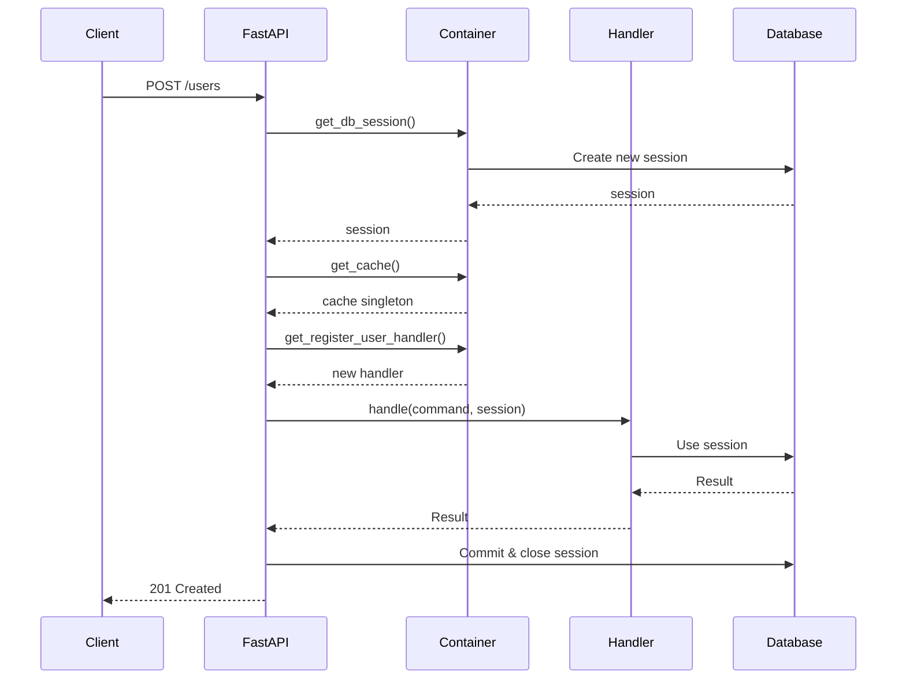

# Dependency Injection Architecture

## Overview

This document defines the centralized dependency injection strategy for Dashtam,
combining application-scoped singletons (custom container) with request-scoped
dependencies (FastAPI Depends). This ensures consistent, maintainable, and
testable dependency management across all architectural layers.

**Related**: See [Import Guidelines](../guides/import-guidelines.md) for cross-layer import rules.

---

## 0. Protocol-First Pattern

**Core Principle**: All cross-layer dependencies use **protocols** (interfaces), not concrete implementations.

### Why Protocol-First?

1. **Clean Architecture**: Application layer depends only on domain protocols, not infrastructure
2. **Testability**: Easy to mock protocols in unit tests without real database/cache
3. **Flexibility**: Swap implementations (PostgreSQL → MongoDB) without changing handlers
4. **No Circular Imports**: Protocols in domain, implementations in infrastructure

### Protocol Locations

All protocols live in `src/domain/protocols/`:

- `user_repository.py` - User persistence
- `email_verification_token_repository.py` - Email token persistence
- `refresh_token_repository.py` - Refresh token persistence
- `password_reset_token_repository.py` - Password reset token persistence
- `cache_protocol.py` - Cache operations (Redis)
- `password_hashing_protocol.py` - Password hashing (bcrypt)
- `token_generation_protocol.py` - JWT/token generation
- `event_bus_protocol.py` - Domain event publishing
- `audit_protocol.py` - Audit trail recording
- `logger_protocol.py` - Structured logging
- `secrets_protocol.py` - Secrets management

### Container Pattern

Container returns protocol types, creates concrete implementations:

```python
# ✅ CORRECT: Return protocol type, create implementation
def get_user_repository(session: AsyncSession) -> UserRepository:
    from src.infrastructure.persistence.repositories.user_repository import (
        UserRepository as UserRepositoryImpl
    )
    return UserRepositoryImpl(session=session)
```

### Handler Pattern

Handlers depend on protocols via constructor injection:

```python
class RegisterUserHandler:
    def __init__(
        self,
        user_repo: UserRepository,           # Protocol from domain
        password_hasher: PasswordHashingProtocol,  # Protocol from domain
        event_bus: EventBusProtocol,         # Protocol from domain
    ):
        self._user_repo = user_repo
        self._password_hasher = password_hasher
        self._event_bus = event_bus
```

---

## 1. Two-Tier Dependency Injection

### 1.1 Application-Scoped (Container)

**Purpose**: Singletons that live for the entire application lifetime.

**Location**: `src/core/container.py`

**Pattern**: Functions decorated with `@lru_cache()` return same instance

**Use Cases**:

- Cache clients (Redis connection pool)
- Secrets managers (env/AWS adapters)
- Configuration (Settings singleton)
- Event bus (in-memory or external)
- Logger instances

**Benefits**:

- Efficient resource usage (connection pooling)
- Consistent state across requests
- Easy to mock in tests
- Clear dependency graph

### 1.2 Request-Scoped (FastAPI Depends)

**Purpose**: Dependencies created fresh per HTTP request.

**Location**: Dependency functions in `src/core/container.py` or endpoint files

**Pattern**: Generator functions with `yield` (cleanup after request)

**Use Cases**:

- Database sessions (new transaction per request)
- Current user (authentication per request)
- Request context (headers, query params)
- Command/Query handlers (stateless per request)

**Note on Auth Dependencies**: Authentication dependencies (`get_current_user`, `require_role`)
use FastAPI-idiomatic `HTTPException` for auth failures instead of Result types. This is acceptable
because auth is an HTTP concern, not business logic. See `docs/architecture/error-handling-architecture.md`
"FastAPI-Idiomatic Exceptions" section.

**Benefits**:

- Automatic cleanup (FastAPI calls finally block)
- Request isolation (no state leakage)
- Transaction boundaries clear
- Testable with TestClient

---

## 2. Container Implementation

### 2.1 Container Structure

```python
# src/core/container.py
"""Centralized dependency injection container.

Provides both application-scoped singletons and request-scoped dependencies
for use across all architectural layers.

Architecture:
    - Application-scoped: @lru_cache() decorated functions (singletons)
    - Request-scoped: Generator functions with yield (per-request)
"""

from functools import lru_cache
from typing import AsyncGenerator

from sqlalchemy.ext.asyncio import AsyncSession

from src.core.config import settings
from src.domain.protocols.cache import CacheProtocol
from src.domain.protocols.secrets_protocol import SecretsProtocol
from src.infrastructure.persistence.database import Database


# ============================================================================
# Application-Scoped Dependencies (Singletons)
# ============================================================================

@lru_cache()
def get_secrets() -> SecretsProtocol:
    """Get secrets manager singleton (app-scoped).
    
    Container owns factory logic - decides which adapter based on SECRETS_BACKEND.
    This follows the Composition Root pattern (industry best practice).
    
    Returns correct adapter based on SECRETS_BACKEND environment variable:
        - 'env': EnvAdapter (local development)
        - 'aws': AWSAdapter (production)
    
    Returns:
        Secrets manager implementing SecretsProtocol.
    
    Usage:
        # Application Layer
        secrets = get_secrets()
        db_url = secrets.get_secret("database/url")
        
        # Presentation Layer
        secrets: SecretsProtocol = Depends(get_secrets)
    """
    import os
    
    backend = os.getenv("SECRETS_BACKEND", "env")
    
    if backend == "aws":
        from src.infrastructure.secrets.aws_adapter import AWSAdapter
        region = os.getenv("AWS_REGION", "us-east-1")
        return AWSAdapter(environment=settings.environment, region=region)
    elif backend == "env":
        from src.infrastructure.secrets.env_adapter import EnvAdapter
        return EnvAdapter()
    else:
        raise ValueError(f"Unsupported SECRETS_BACKEND: {backend}")


@lru_cache()
def get_cache() -> CacheProtocol:
    """Get cache client singleton (app-scoped).
    
    Container creates RedisAdapter directly with connection pooling.
    This follows the Composition Root pattern (industry best practice).
    
    Returns:
        Cache client implementing CacheProtocol.
    
    Usage:
        # Application Layer
        cache = get_cache()
        await cache.set("key", "value")
        
        # Presentation Layer
        cache: CacheProtocol = Depends(get_cache)
    """
    from redis.asyncio import ConnectionPool, Redis
    from src.infrastructure.cache.redis_adapter import RedisAdapter
    
    # Container owns Redis configuration
    pool = ConnectionPool.from_url(
        settings.redis_url,
        max_connections=50,
        decode_responses=False,
        socket_connect_timeout=5,
        socket_timeout=5,
        retry_on_timeout=True,
        socket_keepalive=True,
        socket_keepalive_options={1: 1, 2: 1, 3: 5},
    )
    redis_client = Redis(connection_pool=pool)
    return RedisAdapter(redis_client=redis_client)


@lru_cache()
def get_database() -> Database:
    """Get database manager singleton (app-scoped).
    
    Returns Database instance with connection pool.
    Use get_db_session() for per-request sessions.
    
    Returns:
        Database manager instance.
    
    Note:
        This is rarely used directly. Prefer get_db_session() for sessions.
    """
    return Database(
        database_url=settings.database_url,
        echo=settings.db_echo,
    )


# ============================================================================
# Request-Scoped Dependencies (Per-Request)
# ============================================================================

async def get_db_session() -> AsyncGenerator[AsyncSession, None]:
    """Get database session (request-scoped).
    
    Creates new session per request with automatic transaction management:
        - Commits on success
        - Rolls back on exception
        - Always closes session
    
    Yields:
        Database session for request duration.
    
    Usage:
        # Presentation Layer (FastAPI endpoint)
        @router.post("/users")
        async def create_user(
            session: AsyncSession = Depends(get_db_session)
        ):
            # Use session
            ...
    """
    db = get_database()
    async with db.get_session() as session:
        yield session


# ============================================================================
# Handler Factories (Request-Scoped)
# ============================================================================

def get_register_user_handler():
    """Get RegisterUser command handler (request-scoped).
    
    Creates new handler instance per request.
    Handler uses application-scoped dependencies internally.
    
    Returns:
        RegisterUserHandler instance.
    
    Usage:
        @router.post("/users")
        async def create_user(
            handler: RegisterUserHandler = Depends(get_register_user_handler)
        ):
            result = await handler.handle(command)
    """
    from src.application.commands.handlers.register_user_handler import (
        RegisterUserHandler,
    )
    
    # Handler uses container internally for app-scoped dependencies
    return RegisterUserHandler()
```

---

## 3. Usage Patterns by Layer

### 3.1 Domain Layer

**Rule**: Domain should NOT depend on container (pure domain logic).

```python
# src/domain/entities/user.py
# Domain entities are pure - NO container imports
@dataclass(slots=True, kw_only=True)
class User:
    id: UUID
    email: str
    # Pure business logic only
```

### 3.2 Application Layer

**Rule**: Use container directly for app-scoped dependencies.

```python
# src/application/commands/handlers/register_user_handler.py
from src.core.container import get_cache, get_secrets

class RegisterUserHandler:
    def __init__(self):
        # Application layer uses container directly
        self.cache = get_cache()      # ← App-scoped singleton
        self.secrets = get_secrets()  # ← App-scoped singleton
    
    async def handle(
        self, 
        cmd: RegisterUser, 
        session: AsyncSession  # ← Injected from presentation layer
    ) -> Result[UUID, Error]:
        # Use dependencies
        db_url = self.secrets.get_secret("database/url")
        await self.cache.set(f"user:{cmd.email}", "pending")
        
        # Use injected session
        user = User(email=cmd.email)
        session.add(user)
        return Success(user.id)
```

### 3.3 Infrastructure Layer

**Rule**: Adapters can use container for dependencies, but avoid circular imports.

```python
# src/infrastructure/providers/schwab_provider.py
from src.core.container import get_secrets

class SchwabProvider:
    def __init__(self):
        # Infrastructure can use container
        secrets = get_secrets()
        self.api_key = secrets.get_secret("schwab/api_key")
```

### 3.4 Presentation Layer

**Rule**: Use FastAPI `Depends()` for ALL dependencies.

```python
# src/presentation/api/v1/users.py
from fastapi import Depends

@router.post("/users", status_code=201)
async def create_user(
    data: UserCreate,
    session: AsyncSession = Depends(get_db_session),  # ← Request-scoped
    cache: CacheProtocol = Depends(get_cache),        # ← App-scoped
    handler: RegisterUserHandler = Depends(get_register_user_handler),  # ← Request-scoped
) -> UserResponse:
    """Create new user.
    
    FastAPI automatically injects dependencies:
        - get_db_session(): New session per request
        - get_cache(): Shared cache singleton
        - get_register_user_handler(): New handler per request
    """
    result = await handler.handle(
        RegisterUser(email=data.email, password=data.password),
        session
    )
    
    match result:
        case Success(user_id):
            return UserResponse(id=user_id, email=data.email)
        case Failure(error):
            raise HTTPException(400, detail=error.message)
```

---

## 4. Testing Strategy

### 4.1 Unit Tests - Mock Container

```python
# tests/unit/test_application_register_user_handler.py
from unittest.mock import Mock, patch

def test_register_user_handler():
    """Test handler with mocked dependencies."""
    # Mock container functions
    with patch("src.core.container.get_cache") as mock_cache:
        with patch("src.core.container.get_secrets") as mock_secrets:
            # Configure mocks
            mock_cache.return_value = Mock(CacheProtocol)
            mock_secrets.return_value = Mock(SecretsProtocol)
            
            # Test handler
            handler = RegisterUserHandler()
            # Handler uses mocked dependencies
            ...
```

### 4.2 Integration Tests - Real Dependencies

```python
# tests/integration/test_cache_redis.py
from src.core.container import get_cache

async def test_cache_integration():
    """Test with real Redis (integration test)."""
    cache = get_cache()  # Real Redis adapter
    
    result = await cache.set("test:key", "value")
    assert result is Success
    
    result = await cache.get("test:key")
    assert result.value == "value"
```

### 4.3 API Tests - FastAPI TestClient

```python
# tests/api/test_users_endpoints.py
from fastapi.testclient import TestClient

def test_create_user_endpoint(client: TestClient):
    """Test endpoint with real dependencies."""
    # TestClient uses real container (test environment)
    response = client.post("/api/v1/users", json={
        "email": "test@example.com",
        "password": "SecurePass123!"
    })
    
    assert response.status_code == 201
```

---

## 5. Dependency Lifecycle

### 5.1 Application Startup

```python
# src/main.py
from contextlib import asynccontextmanager

@asynccontextmanager
async def lifespan(app: FastAPI):
    """Application lifespan - initialize singletons."""
    # Singletons created on first access (lazy initialization)
    get_cache()      # ← Creates Redis connection pool
    get_secrets()    # ← Creates secrets adapter
    get_database()   # ← Creates database connection pool
    
    yield
    
    # Cleanup
    await close_cache()
    await close_database()

app = FastAPI(lifespan=lifespan)
```

### 5.2 Request Lifecycle



---

## 6. Benefits

### 6.1 Maintainability

- ✅ Single source of truth for all dependencies
- ✅ Easy to find where dependencies are created
- ✅ Clear lifecycle management (app vs request scope)
- ✅ No scattered factory functions across codebase

### 6.2 Testability

- ✅ Easy to mock entire container
- ✅ Easy to provide test implementations
- ✅ Clear dependency boundaries
- ✅ Isolated tests (no global state leakage)

### 6.3 Performance

- ✅ Connection pooling for expensive resources (Redis, Database)
- ✅ Singleton pattern reduces object creation
- ✅ `@lru_cache()` provides zero-cost singleton
- ✅ Request-scoped sessions prevent connection leaks

### 6.4 Type Safety

- ✅ All dependencies return Protocol types
- ✅ IDE autocomplete works correctly
- ✅ Type checkers (mypy) can verify dependencies
- ✅ Refactoring is safe

---

## 7. Migration Guide

### 7.1 From Scattered Factories

**Before** (inconsistent):

```python
# src/infrastructure/cache/__init__.py
def get_cache():  # ← Singleton in __init__.py
    ...

# src/infrastructure/secrets/factory.py
def create_secrets_manager():  # ← Factory function
    ...

# Direct instantiation
db = Database(settings.database_url)  # ← No abstraction
```

**After** (centralized):

```python
# src/core/container.py
@lru_cache()
def get_cache(): ...

@lru_cache()
def get_secrets(): ...

@lru_cache()
def get_database(): ...
```

### 7.2 Update Import Statements

**Before** (scattered across infrastructure):

```python
# Old: Import from infrastructure modules
from src.infrastructure.cache import get_cache  # Singleton in __init__.py
from src.infrastructure.secrets.env_adapter import EnvAdapter  # Direct import
from src.infrastructure.persistence.database import Database  # Direct instantiation
```

**After** (centralized in container):

```python
# New: All dependencies from container
from src.core.container import get_cache, get_secrets, get_database
```

---

## 8. Anti-Patterns to Avoid

### 8.1 ❌ Direct Instantiation in Application Layer

```python
# WRONG - Don't create dependencies directly
class RegisterUserHandler:
    def __init__(self):
        self.cache = RedisAdapter(...)  # ❌ Tight coupling!
```

### 8.2 ❌ Importing Infrastructure in Domain

```python
# WRONG - Domain should be pure
# src/domain/entities/user.py
from src.core.container import get_cache  # ❌ Domain depends on infrastructure!
```

### 8.3 ❌ Using App-Scoped for Request-Specific Data

```python
# WRONG - Don't use singleton for request data
@lru_cache()
def get_current_user():  # ❌ Current user should be request-scoped!
    ...
```

### 8.4 ❌ Using Request-Scoped for Expensive Resources

```python
# WRONG - Don't create new connections per request
async def get_cache():  # ❌ No @lru_cache - creates new Redis connection per request!
    return RedisAdapter(...)
```

---

## 9. Integration with Architecture

### 9.1 Hexagonal Architecture Compliance

- ✅ **Domain Layer**: No container imports (pure)
- ✅ **Application Layer**: Uses container for app-scoped dependencies
- ✅ **Infrastructure Layer**: Implements protocols, can use container
- ✅ **Presentation Layer**: Uses FastAPI Depends (delegates to container)

### 9.2 CQRS Pattern

```python
# Command handlers use container
class RegisterUserHandler:
    def __init__(self):
        self.cache = get_cache()

# Query handlers use container
class GetUserHandler:
    def __init__(self):
        self.cache = get_cache()

# Presentation layer injects via Depends
@router.post("/users")
async def create_user(
    handler: RegisterUserHandler = Depends(get_register_user_handler)
):
    ...
```

### 9.3 Repository Pattern

```python
# Repositories receive session from presentation layer
class UserRepository:
    def __init__(self, session: AsyncSession):
        self.session = session  # ← Injected, not created

# Presentation layer provides session
@router.get("/users/{id}")
async def get_user(
    id: UUID,
    session: AsyncSession = Depends(get_db_session)
):
    repo = UserRepository(session)
    user = await repo.find_by_id(id)
    ...
```

---

**Created**: 2025-11-13 | **Last Updated**: 2025-11-13
