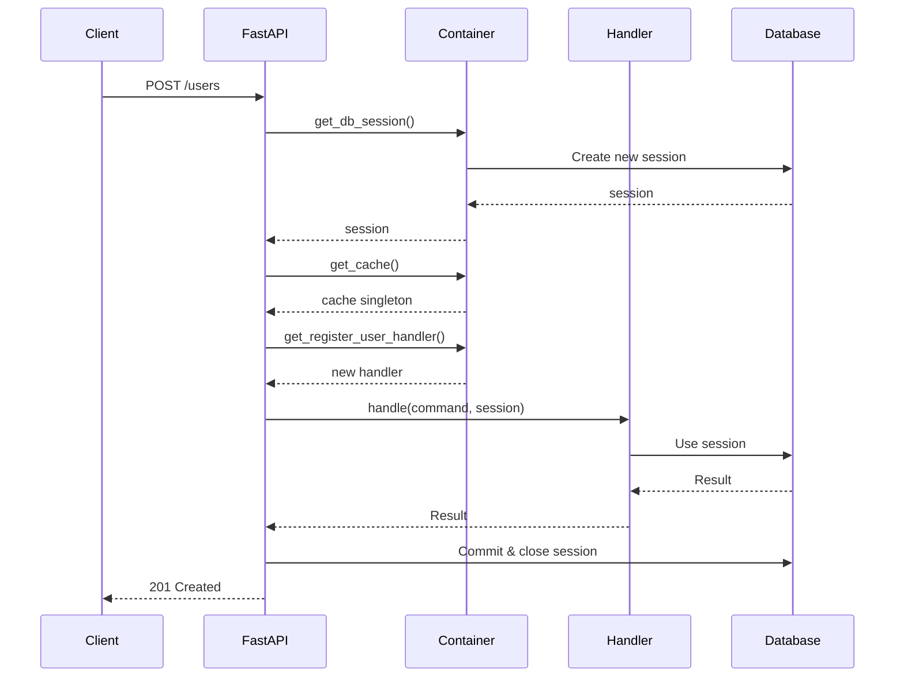

# Dependency Injection Architecture

## Overview

This document defines the centralized dependency injection strategy for Dashtam,
combining application-scoped singletons (custom container) with request-scoped
dependencies (FastAPI Depends). This ensures consistent, maintainable, and
testable dependency management across all architectural layers.

**Related**: See [Import Guidelines](../guides/imports.md) for cross-layer import rules.

---

## 0. Protocol-First Pattern

**Core Principle**: All cross-layer dependencies use **protocols** (interfaces), not concrete implementations.

### Why Protocol-First?

1. **Clean Architecture**: Application layer depends only on domain protocols, not infrastructure
2. **Testability**: Easy to mock protocols in unit tests without real database/cache
3. **Flexibility**: Swap implementations (PostgreSQL → MongoDB) without changing handlers
4. **No Circular Imports**: Protocols in domain, implementations in infrastructure

### Protocol Locations

All protocols live in `src/domain/protocols/` (29 protocols):

**Repository Protocols** (12):

- `user_repository.py` - User persistence
- `email_verification_token_repository.py` - Email token persistence
- `refresh_token_repository.py` - Refresh token persistence
- `password_reset_token_repository.py` - Password reset token persistence
- `session_repository.py` - Session persistence
- `security_config_repository.py` - Security configuration
- `provider_connection_repository.py` - Provider connections
- `provider_repository.py` - Provider metadata
- `account_repository.py` - Account persistence
- `transaction_repository.py` - Transaction persistence
- `balance_snapshot_repository.py` - Balance snapshot persistence
- `holding_repository.py` - Holding persistence

**Service Protocols** (17):

- `cache_protocol.py` - Cache operations (Redis)
- `session_cache_protocol.py` - Session caching
- `provider_connection_cache_protocol.py` - Provider connection caching
- `password_hashing_protocol.py` - Password hashing (bcrypt)
- `token_generation_protocol.py` - JWT generation
- `refresh_token_service_protocol.py` - Refresh token operations
- `password_reset_token_service_protocol.py` - Password reset tokens
- `event_bus_protocol.py` - Domain event publishing
- `audit_protocol.py` - Audit trail recording
- `logger_protocol.py` - Structured logging
- `secrets_protocol.py` - Secrets management
- `email_protocol.py` - Email sending
- `email_service_protocol.py` - Email service operations
- `rate_limit_protocol.py` - Rate limiting
- `authorization_protocol.py` - RBAC authorization
- `provider_protocol.py` - Financial provider operations
- `session_enricher_protocol.py` - Session metadata enrichment

### Container Pattern

Container returns protocol types, creates concrete implementations:

```python
# ✅ CORRECT: Return protocol type, create implementation
def get_user_repository(session: AsyncSession) -> UserRepository:
    from src.infrastructure.persistence.repositories.user_repository import (
        UserRepository as UserRepositoryImpl
    )
    return UserRepositoryImpl(session=session)
```

### Handler Pattern

Handlers depend on protocols via constructor injection:

```python
class RegisterUserHandler:
    def __init__(
        self,
        user_repo: UserRepository,           # Protocol from domain
        password_hasher: PasswordHashingProtocol,  # Protocol from domain
        event_bus: EventBusProtocol,         # Protocol from domain
    ):
        self._user_repo = user_repo
        self._password_hasher = password_hasher
        self._event_bus = event_bus
```

---

## 1. Two-Tier Dependency Injection

### 1.1 Application-Scoped (Container)

**Purpose**: Singletons that live for the entire application lifetime.

**Location**: `src/core/container/` (modular structure)

**Pattern**: Functions decorated with `@lru_cache()` return same instance

**Use Cases**:

- Cache clients (Redis connection pool)
- Secrets managers (env/AWS adapters)
- Configuration (Settings singleton)
- Event bus (in-memory or external)
- Logger instances

**Benefits**:

- Efficient resource usage (connection pooling)
- Consistent state across requests
- Easy to mock in tests
- Clear dependency graph

### 1.2 Request-Scoped (FastAPI Depends)

**Purpose**: Dependencies created fresh per HTTP request.

**Location**: Dependency functions in `src/core/container/` modules

**Pattern**: Generator functions with `yield` (cleanup after request)

**Use Cases**:

- Database sessions (new transaction per request)
- Current user (authentication per request)
- Request context (headers, query params)
- Command/Query handlers (stateless per request)

**Note on Auth Dependencies**: Authentication dependencies (`get_current_user`, `require_role`)
use FastAPI-idiomatic `HTTPException` for auth failures instead of Result types. This is acceptable
because auth is an HTTP concern, not business logic. See `docs/architecture/error-handling.md`
"FastAPI-Idiomatic Exceptions" section.

**Benefits**:

- Automatic cleanup (FastAPI calls finally block)
- Request isolation (no state leakage)
- Transaction boundaries clear
- Testable with TestClient

---

## 2. Container Implementation

### 2.1 Modular Container Structure

The container is organized into modules by domain responsibility:

```text
src/core/container/
├── __init__.py              # Re-exports all (single entry point preserved)
├── infrastructure.py        # Core services: cache, db, secrets, logging, etc.
├── events.py               # Event bus with all 27 subscriptions
├── repositories.py         # All repository factories
├── handler_factory.py      # Auto-wired CQRS handler injection (38 handlers)
├── providers.py            # Financial provider adapter factory
└── authorization.py        # Casbin RBAC enforcer
```

**Key Benefits**:

- **Maintainability**: Smaller, focused files (~200-500 lines each vs 2300+ monolith)
- **Team Development**: Multiple developers can work on different modules
- **Faster Navigation**: Find dependencies by domain area
- **Backward Compatible**: All imports still work via `__init__.py` re-exports

### 2.2 Module Responsibilities

**infrastructure.py** (~460 lines) - Application-scoped singletons:

- `get_cache()` - Redis connection pool
- `get_secrets()` - Env/AWS secrets adapter
- `get_encryption_service()` - AES-256-GCM encryption
- `get_database()` - PostgreSQL connection pool
- `get_db_session()` - Request-scoped session
- `get_audit_session()` - Separate audit session
- `get_audit()` - Audit trail adapter
- `get_password_service()` - Bcrypt hashing
- `get_token_service()` - JWT generation
- `get_email_service()` - Email adapter
- `get_rate_limit()` - Token bucket rate limiter
- `get_logger()` - Console/CloudWatch logger

**events.py** (~230 lines) - Domain event infrastructure:

- `get_event_bus()` - In-memory event bus with 27 subscriptions
- Registers LoggingEventHandler, AuditEventHandler, EmailEventHandler, SessionEventHandler

**repositories.py** (~230 lines) - Repository factories:

- `get_user_repository()`
- `get_provider_connection_repository()`
- `get_provider_repository()`
- `get_account_repository()`
- `get_transaction_repository()`

**auth_handlers.py** (~530 lines) - Authentication handlers:

- Registration, login, logout handlers
- Token refresh, email verification
- Password reset (request and confirm)
- Session management (list, get, revoke)
- Token rotation (global and per-user)

**provider_handlers.py** (~190 lines) - Provider handlers:

- Connect/disconnect provider
- Refresh provider tokens
- Get/list provider connections

**data_handlers.py** (~390 lines) - Account/transaction handlers:

- Account queries (get, list by connection, list by user)
- Transaction queries (get, list, date range, security)
- Sync handlers (accounts, transactions)

**handler_factory.py** (~200 lines) - Auto-wired handler injection:

- `handler_factory()` - Generic handler factory using type hints
- `SESSION_SERVICE_TYPES` - Session-scoped services (e.g., `OwnershipVerifier`)
- Supports all 38+ CQRS handlers without manual factory functions

**providers.py** (~80 lines) - Provider factory:

- `get_provider(slug)` - Returns Schwab (future: Chase, Fidelity)

**authorization.py** (~160 lines) - Casbin RBAC:

- `init_enforcer()` - Initialize at startup
- `get_enforcer()` - Get singleton
- `get_authorization()` - Request-scoped adapter

### 2.3 Usage (Unchanged)

All existing imports continue to work:

```python
# Single import point preserved
from src.core.container import get_cache, get_db_session, get_register_user_handler

# Or import from specific module for clarity
from src.core.container.infrastructure import get_cache
from src.core.container.auth_handlers import get_register_user_handler
```

---

## 3. Usage Patterns by Layer

### 3.1 Domain Layer

**Rule**: Domain should NOT depend on container (pure domain logic).

```python
# src/domain/entities/user.py
# Domain entities are pure - NO container imports
@dataclass(slots=True, kw_only=True)
class User:
    id: UUID
    email: str
    # Pure business logic only
```

### 3.2 Application Layer

**Rule**: Handlers receive dependencies via **constructor injection**. The container factories
assemble handlers with their dependencies - handlers never import container directly.

```python
# src/application/commands/handlers/register_user_handler.py
# NO container imports - only domain protocols!
from src.domain.protocols import UserRepository, PasswordHashingProtocol
from src.domain.protocols.event_bus_protocol import EventBusProtocol

class RegisterUserHandler:
    """Handler receives all dependencies via constructor."""
    
    def __init__(
        self,
        user_repo: UserRepository,              # ← Injected protocol
        password_service: PasswordHashingProtocol,  # ← Injected protocol
        event_bus: EventBusProtocol,            # ← Injected protocol
    ) -> None:
        self._user_repo = user_repo
        self._password_service = password_service
        self._event_bus = event_bus
    
    async def handle(self, cmd: RegisterUser) -> Result[UUID, str]:
        # Use injected dependencies - no container knowledge
        password_hash = self._password_service.hash_password(cmd.password)
        user = User(email=cmd.email, password_hash=password_hash, ...)
        await self._user_repo.save(user)
        await self._event_bus.publish(UserRegistrationSucceeded(...))
        return Success(value=user.id)
```

**Container factory assembles the handler** (`src/core/container/auth_handlers.py`):

```python
async def get_register_user_handler(
    session: AsyncSession = Depends(get_db_session),
) -> RegisterUserHandler:
    """Container factory wires dependencies."""
    from src.infrastructure.persistence.repositories import UserRepository
    
    return RegisterUserHandler(
        user_repo=UserRepository(session=session),
        password_service=get_password_service(),  # App-scoped singleton
        event_bus=get_event_bus(),                # App-scoped singleton
    )
```

### 3.3 Infrastructure Layer

**Rule**: Adapters can use container for dependencies, but avoid circular imports.

```python
# src/infrastructure/providers/schwab_provider.py
from src.core.container import get_secrets

class SchwabProvider:
    def __init__(self):
        # Infrastructure can use container
        secrets = get_secrets()
        self.api_key = secrets.get_secret("schwab/api_key")
```

### 3.4 Presentation Layer

**Rule**: Use FastAPI `Depends()` for ALL dependencies.

```python
# src/presentation/api/v1/users.py
from fastapi import Depends

@router.post("/users", status_code=201)
async def create_user(
    data: UserCreate,
    session: AsyncSession = Depends(get_db_session),  # ← Request-scoped
    cache: CacheProtocol = Depends(get_cache),        # ← App-scoped
    handler: RegisterUserHandler = Depends(get_register_user_handler),  # ← Request-scoped
) -> UserResponse:
    """Create new user.
    
    FastAPI automatically injects dependencies:
        - get_db_session(): New session per request
        - get_cache(): Shared cache singleton
        - get_register_user_handler(): New handler per request
    """
    result = await handler.handle(
        RegisterUser(email=data.email, password=data.password),
        session
    )
    
    match result:
        case Success(user_id):
            return UserResponse(id=user_id, email=data.email)
        case Failure(error):
            raise HTTPException(400, detail=error.message)
```

---

## 4. Testing Strategy

### 4.1 Unit Tests - Direct Dependency Injection

Since handlers use **constructor injection**, unit testing is straightforward - create
mock dependencies and pass them directly:

```python
# tests/unit/test_application_register_user_handler.py
from unittest.mock import AsyncMock, Mock
import pytest

@pytest.mark.asyncio
async def test_register_user_handler_success():
    """Test handler with mock dependencies - NO patching needed."""
    # Create mock dependencies directly
    mock_user_repo = Mock()
    mock_user_repo.find_by_email = AsyncMock(return_value=None)  # No existing user
    mock_user_repo.save = AsyncMock()
    
    mock_password_service = Mock()
    mock_password_service.hash_password.return_value = "hashed_password"
    
    mock_event_bus = Mock()
    mock_event_bus.publish = AsyncMock()
    
    # Instantiate handler with mocks
    handler = RegisterUserHandler(
        user_repo=mock_user_repo,
        password_service=mock_password_service,
        event_bus=mock_event_bus,
    )
    
    # Test the handler
    result = await handler.handle(RegisterUser(email="test@example.com", password="secure"))
    
    assert isinstance(result, Success)
    mock_user_repo.save.assert_called_once()
    mock_event_bus.publish.assert_called()  # Events emitted
```

**Benefits of constructor injection testing**:

- No `patch()` context managers needed
- Test isolation - each test has fresh mocks
- Clear dependency graph visible in test setup
- IDE autocomplete works on mock setup

### 4.2 Integration Tests - Real Dependencies

```python
# tests/integration/test_cache_redis.py
from src.core.container import get_cache

async def test_cache_integration():
    """Test with real Redis (integration test)."""
    cache = get_cache()  # Real Redis adapter
    
    result = await cache.set("test:key", "value")
    assert result is Success
    
    result = await cache.get("test:key")
    assert result.value == "value"
```

### 4.3 API Tests - FastAPI TestClient

```python
# tests/api/test_users_endpoints.py
from fastapi.testclient import TestClient

def test_create_user_endpoint(client: TestClient):
    """Test endpoint with real dependencies."""
    # TestClient uses real container (test environment)
    response = client.post("/api/v1/users", json={
        "email": "test@example.com",
        "password": "SecurePass123!"
    })
    
    assert response.status_code == 201
```

---

## 5. Dependency Lifecycle

### 5.1 Application Startup

```python
# src/main.py
from contextlib import asynccontextmanager

@asynccontextmanager
async def lifespan(app: FastAPI):
    """Application lifespan - initialize singletons."""
    # Singletons created on first access (lazy initialization)
    get_cache()      # ← Creates Redis connection pool
    get_secrets()    # ← Creates secrets adapter
    get_database()   # ← Creates database connection pool
    
    yield
    
    # Cleanup
    await close_cache()
    await close_database()

app = FastAPI(lifespan=lifespan)
```

### 5.2 Request Lifecycle



---

## 6. Benefits

### 6.1 Maintainability

- ✅ Single source of truth for all dependencies
- ✅ Easy to find where dependencies are created
- ✅ Clear lifecycle management (app vs request scope)
- ✅ No scattered factory functions across codebase

### 6.2 Testability

- ✅ Easy to mock entire container
- ✅ Easy to provide test implementations
- ✅ Clear dependency boundaries
- ✅ Isolated tests (no global state leakage)

### 6.3 Performance

- ✅ Connection pooling for expensive resources (Redis, Database)
- ✅ Singleton pattern reduces object creation
- ✅ `@lru_cache()` provides zero-cost singleton
- ✅ Request-scoped sessions prevent connection leaks

### 6.4 Type Safety

- ✅ All dependencies return Protocol types
- ✅ IDE autocomplete works correctly
- ✅ Type checkers (mypy) can verify dependencies
- ✅ Refactoring is safe

---

## 7. Migration Guide

### 7.1 From Scattered Factories

**Before** (inconsistent):

```python
# src/infrastructure/cache/__init__.py
def get_cache():  # ← Singleton in __init__.py
    ...

# src/infrastructure/secrets/factory.py
def create_secrets_manager():  # ← Factory function
    ...

# Direct instantiation
db = Database(settings.database_url)  # ← No abstraction
```

**After** (centralized):

```python
# src/core/container.py
@lru_cache()
def get_cache(): ...

@lru_cache()
def get_secrets(): ...

@lru_cache()
def get_database(): ...
```

### 7.2 Update Import Statements

**Before** (scattered across infrastructure):

```python
# Old: Import from infrastructure modules
from src.infrastructure.cache import get_cache  # Singleton in __init__.py
from src.infrastructure.secrets.env_adapter import EnvAdapter  # Direct import
from src.infrastructure.persistence.database import Database  # Direct instantiation
```

**After** (centralized in container):

```python
# New: All dependencies from container
from src.core.container import get_cache, get_secrets, get_database
```

---

## 8. Anti-Patterns to Avoid

### 8.1 ❌ Direct Instantiation in Application Layer

```python
# WRONG - Don't create dependencies directly
class RegisterUserHandler:
    def __init__(self):
        self.cache = RedisAdapter(...)  # ❌ Tight coupling!
```

### 8.2 ❌ Importing Infrastructure in Domain

```python
# WRONG - Domain should be pure
# src/domain/entities/user.py
from src.core.container import get_cache  # ❌ Domain depends on infrastructure!
```

### 8.3 ❌ Using App-Scoped for Request-Specific Data

```python
# WRONG - Don't use singleton for request data
@lru_cache()
def get_current_user():  # ❌ Current user should be request-scoped!
    ...
```

### 8.4 ❌ Using Request-Scoped for Expensive Resources

```python
# WRONG - Don't create new connections per request
async def get_cache():  # ❌ No @lru_cache - creates new Redis connection per request!
    return RedisAdapter(...)
```

---

## 9. Integration with Architecture

### 9.1 Hexagonal Architecture Compliance

- ✅ **Domain Layer**: No container imports (pure, only protocols)
- ✅ **Application Layer**: Handlers receive dependencies via constructor injection
- ✅ **Infrastructure Layer**: Implements protocols, can use container for assembly
- ✅ **Presentation Layer**: Uses FastAPI Depends (delegates to container factories)

### 9.2 CQRS Pattern

Handlers are **protocol-dependent** and **container-agnostic**:

```python
# Command handler - depends only on protocols
class RegisterUserHandler:
    def __init__(self, user_repo: UserRepository, event_bus: EventBusProtocol):
        self._user_repo = user_repo
        self._event_bus = event_bus

# Query handler with ownership verification - uses OwnershipVerifier service
class GetAccountHandler:
    def __init__(self, ownership_verifier: OwnershipVerifier):
        self._verifier = ownership_verifier
    
    async def handle(self, query: GetAccount) -> Result[AccountResult, str]:
        result = await self._verifier.verify_account_ownership(
            query.account_id, query.user_id
        )
        if isinstance(result, Failure):
            return Failure(error=error_map[result.error.code])
        account = result.value
        # ... map to DTO

# Presentation layer uses handler_factory for auto-wiring
from src.core.container.handler_factory import handler_factory

@router.get("/accounts/{account_id}")
async def get_account(
    handler: GetAccountHandler = Depends(handler_factory(GetAccountHandler))
):
    result = await handler.handle(query)
    ...
```

### 9.3 Session-Scoped Services

Some services need database session but aren't repositories. These are registered in `handler_factory.py`:

```python
# src/core/container/handler_factory.py
SESSION_SERVICE_TYPES: set[type] = {
    OwnershipVerifier,  # Needs repos for ownership chain verification
}

def _get_session_service_instance(service_type: type, session: AsyncSession) -> Any:
    """Create session-scoped service instance."""
    if service_type is OwnershipVerifier:
        return OwnershipVerifier(
            transaction_repo=TransactionRepository(session=session),
            holding_repo=HoldingRepository(session=session),
            account_repo=AccountRepository(session=session),
            connection_repo=ProviderConnectionRepository(session=session),
        )
    raise ValueError(f"Unknown session service type: {service_type}")
```

**Use `OwnershipVerifier` when**: Query handlers need to verify ownership chains
(e.g., Account → Connection → User). This avoids DRY violations across handlers.

### 9.3 Repository Pattern

```python
# Repositories receive session from presentation layer
class UserRepository:
    def __init__(self, session: AsyncSession):
        self.session = session  # ← Injected, not created

# Presentation layer provides session
@router.get("/users/{id}")
async def get_user(
    id: UUID,
    session: AsyncSession = Depends(get_db_session)
):
    repo = UserRepository(session)
    user = await repo.find_by_id(id)
    ...
```

---

**Created**: 2025-11-13 | **Last Updated**: 2026-01-17
