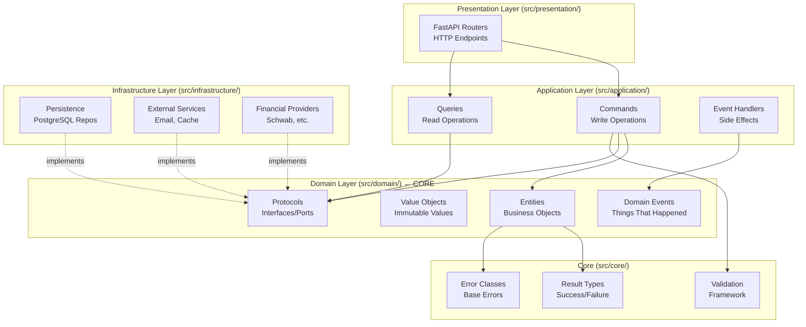
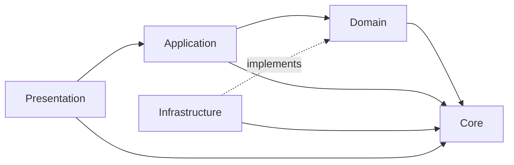
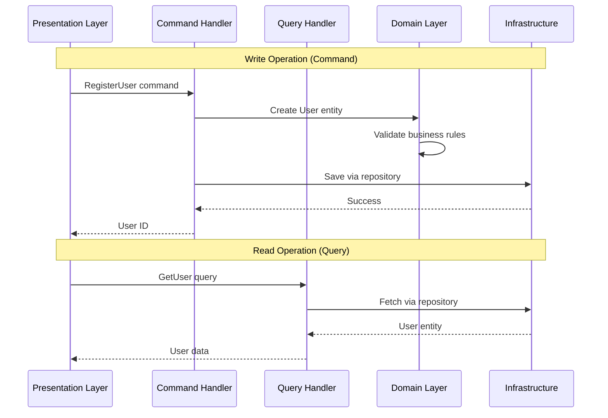

# Directory Structure - Hexagonal Architecture

## Overview

Dashtam follows **Hexagonal Architecture** (Ports & Adapters) with strict
layer separation. The domain layer is at the center, completely independent of
frameworks and infrastructure.

**Core Principle**: Domain depends on NOTHING. All dependencies point inward
toward the domain.

---

## Architecture Diagram



---

## Directory Structure

### Core Layer (`src/core/`)

**Purpose**: Shared kernel utilities used across all layers.

**Contents**:

- `result.py` - Result types for railway-oriented programming (`Success[T]`, `Failure[E]`)
- `errors.py` - Base error classes (`DashtamError`, `ValidationError`, etc.)
- `validation.py` - Common validation functions
- `config.py` - Application settings with Pydantic
- `container.py` - Centralized dependency injection container

**Dependencies**: None (pure Python 3.13+)

**Rules**:

- No business logic
- No framework imports (except FastAPI Depends in container)
- Only foundational utilities
- Keep flat (no subdirectories)
- Container provides both app-scoped (singletons) and request-scoped dependencies

**See also**: `dependency-injection-architecture.md` for container pattern details.

---

### Domain Layer (`src/domain/`)

**Purpose**: Pure business logic - the heart of the application.

**Structure**:

```text
src/domain/
├── __init__.py
├── entities/          # Domain entities (mutable, have identity)
├── value_objects/     # Value objects (immutable, no identity)
├── protocols/         # Protocols (repository interfaces, service interfaces)
└── events/            # Domain events (things that happened)
```

**Dependencies**: `src/core/` only (Result types, errors)

**Rules**:

- NO framework imports (FastAPI, SQLModel, etc.)
- NO infrastructure imports (database, Redis, etc.)
- Pure Python dataclasses and Protocol definitions
- All business rules live here
- Use `Protocol` for interfaces (NOT ABC)

**Examples**:

- `entities/user.py` - User entity with business methods
- `value_objects/email.py` - Email value object with validation
- `protocols/user_repository.py` - UserRepository protocol (port)
- `events/user_registered.py` - UserRegistered domain event

---

### Application Layer (`src/application/`)

**Purpose**: Use cases and orchestration following CQRS pattern.

**Structure**:

```text
src/application/
├── __init__.py
├── commands/          # Write operations
│   ├── __init__.py
│   └── handlers/      # Command handler implementations
├── queries/           # Read operations
│   ├── __init__.py
│   └── handlers/      # Query handler implementations
└── events/            # Event handlers
    ├── __init__.py
    └── handlers/      # Domain event handler implementations
```

**Dependencies**: `src/domain/`, `src/core/`

**Rules**:

- Commands change state (write operations)
- Queries fetch data (read-only, can cache)
- Event handlers react to domain events (side effects)
- No business logic (orchestrate domain entities)
- One handler per command/query

**Examples**:

- `commands/register_user.py` - RegisterUser command dataclass
- `commands/handlers/register_user_handler.py` - Handler implementation
- `queries/get_user.py` - GetUser query dataclass
- `queries/handlers/get_user_handler.py` - Handler implementation
- `events/handlers/user_registered_handler.py` - Send verification email

---

### Infrastructure Layer (`src/infrastructure/`)

**Purpose**: Adapters that implement domain protocols (ports).

**Structure**:

```text
src/infrastructure/
├── __init__.py
├── persistence/       # Database adapters (PostgreSQL repositories)
├── external/          # External service clients (email, cache, secrets)
└── providers/         # Financial provider integrations (OAuth, data sync)
```

**Dependencies**: `src/domain/`, `src/core/`, external libraries

**Rules**:

- Implements domain protocols
- Contains framework imports (SQLModel, Redis, etc.)
- Database models live here (NOT in domain)
- Mapping functions: domain entity ↔ database model
- No business logic

**Examples**:

- `persistence/postgres_user_repository.py` - PostgreSQL UserRepository implementation
- `persistence/models/user.py` - SQLModel database model
- `external/redis_cache.py` - Redis cache adapter
- `providers/schwab/oauth_client.py` - Schwab OAuth implementation

---

### Presentation Layer (`src/presentation/`)

**Purpose**: HTTP API endpoints using FastAPI.

**Structure**:

```text
src/presentation/
├── __init__.py
└── api/
    ├── __init__.py
    └── v1/            # API version 1
        ├── users.py   # User endpoints
        ├── auth.py    # Authentication endpoints
        └── accounts.py # Account endpoints
```

**Dependencies**: `src/application/`, `src/core/`

**Rules**:

- Thin layer - NO business logic
- Dispatches commands/queries to application layer
- Translates HTTP → Command/Query → HTTP
- RESTful URLs (resource-based, NOT verb-based)
- Proper HTTP methods (GET/POST/PATCH/DELETE)
- All schemas in `src/schemas/` (NOT inline)

**Examples**:

- `api/v1/users.py` - User CRUD endpoints (`/api/v1/users`)
- `api/v1/auth.py` - Authentication endpoints (`/api/v1/auth/login`)

---

## Test Structure (`tests/`)

**Purpose**: Test pyramid with isolated test layers.

**Structure**:

```text
tests/
├── __init__.py
├── unit/              # 70% - Test domain logic in isolation
├── integration/       # 20% - Test cross-module interactions
├── api/               # 10% - Test HTTP endpoints end-to-end
└── smoke/             # Critical user journeys (E2E)
```

**Rules**:

- Unit tests: Mock all dependencies, test domain in isolation
- Integration tests: Real database, mocked external APIs
- API tests: Complete flows with TestClient
- Smoke tests: Critical user journeys (registration → login → data sync)
- All tests run in Docker (isolated test database, Redis)

**Examples**:

- `unit/domain/test_user.py` - Test User entity validation
- `integration/infrastructure/test_user_repository.py` - Test database operations
- `api/test_users.py` - Test POST /api/v1/users endpoint
- `smoke/test_onboarding_flow.py` - Test complete onboarding flow

---

## Dependency Flow

**CRITICAL**: Dependencies flow inward toward the domain.



**Key Points**:

- **Domain depends on NOTHING** (except Core shared kernel)
- **Infrastructure depends on Domain** (implements protocols)
- **Application depends on Domain** (uses entities, protocols)
- **Presentation depends on Application** (dispatches commands/queries)
- **NEVER** let Domain depend on Infrastructure or Presentation

---

## CQRS Pattern

Commands and Queries are separated from the start.



---

## File Naming Conventions

### Python Files and Classes (PEP 8 Standard)

**Universal Rule**: File name should match the main class name in `snake_case`

**Class Names**: `CapWords` (also known as PascalCase)

- `UserRepository`, `PostgresUserRepository`, `RegisterUser`

**File Names**: `lowercase_with_underscores` matching the class

- `user_repository.py` → `UserRepository` class
- `postgres_user_repository.py` → `PostgresUserRepository` class
- `register_user.py` → `RegisterUser` class
- `redis_adapter.py` → `RedisAdapter` class
- `env_adapter.py` → `EnvAdapter` class
- `aws_adapter.py` → `AWSAdapter` class

**Benefits**:

- Easy to find: See `UserRepository` in code? Look for `user_repository.py`
- PEP 8 compliant: Industry standard Python style
- IDE-friendly: Auto-imports work correctly
- Consistent: Same pattern everywhere

**Examples Across Layers**:

```python
# Domain
src/domain/entities/user.py              → class User
src/domain/value_objects/email.py        → class Email
src/domain/protocols/user_repository.py  → class UserRepository

# Application
src/application/commands/register_user.py         → class RegisterUser
src/application/commands/handlers/register_user_handler.py → class RegisterUserHandler

# Infrastructure
src/infrastructure/persistence/postgres_user_repository.py → class PostgresUserRepository
src/infrastructure/cache/redis_adapter.py                  → class RedisAdapter
src/infrastructure/secrets/env_adapter.py                  → class EnvAdapter
src/infrastructure/secrets/aws_adapter.py                  → class AWSAdapter
```

**Python Directories**: `snake_case/`

- `value_objects/`
- `auth_strategies/`

**Documentation**: `kebab-case.md`

- `directory-structure.md`
- `oauth-flow.md`

**Config Files**: `kebab-case.yml`

- `docker-compose.dev.yml`
- `docker-compose.test.yml`

**Test Files**: `test_*.py` (pytest convention)

- `test_user.py`
- `test_user_repository.py`

---

## Key Architectural Decisions

### 1. Protocol over ABC

**Use `Protocol` for all new interfaces** (structural typing, no inheritance).

```python
from typing import Protocol

class UserRepository(Protocol):
    async def save(self, user: User) -> None: ...
    async def find_by_email(self, email: str) -> User | None: ...
```

### 2. Result Types over Exceptions

**Use Result types in domain layer** (explicit error handling).

```python
from src.core.result import Result, Success, Failure

def create_user(email: str) -> Result[User, ValidationError]:
    if not is_valid_email(email):
        return Failure(ValidationError(message="Invalid email"))
    return Success(user)
```

### 3. CQRS from Day One

**Separate commands (write) from queries (read)** from the start.

```python
# Command (write)
@dataclass(frozen=True, kw_only=True)
class RegisterUser:
    email: str
    password: str

# Query (read)
@dataclass(frozen=True, kw_only=True)
class GetUser:
    user_id: UUID
```

### 4. Immutable Commands/Queries

**All commands and queries are immutable** (`frozen=True`, `kw_only=True`).

### 5. Domain Events for Critical Workflows

**Emit domain events ONLY for critical workflows** with side effects.

```python
@dataclass(frozen=True, kw_only=True)
class UserRegistered:
    event_id: UUID
    occurred_at: datetime
    user_id: UUID
```

---

## Benefits of This Structure

**Testability**: Domain logic testable without database or HTTP.

**Maintainability**: Clear boundaries, easy to understand where code belongs.

**Flexibility**: Easy to swap implementations (PostgreSQL → MongoDB, Redis → Memcached).

**Framework Independence**: Domain survives framework upgrades.

**Team Scalability**: Multiple developers can work on different layers without conflicts.

---

**Created**: 2025-11-08 | **Last Updated**: 2025-11-13
