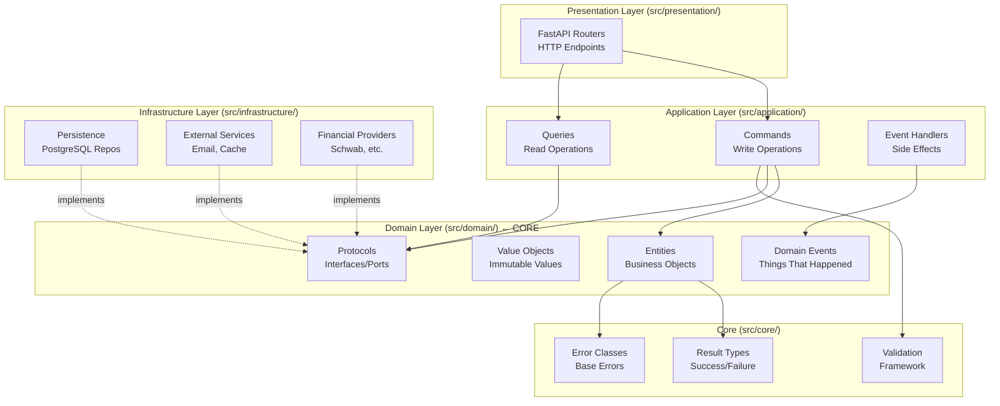
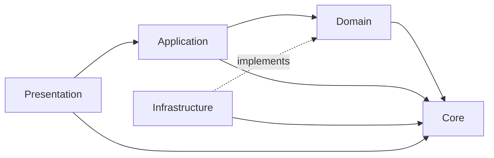
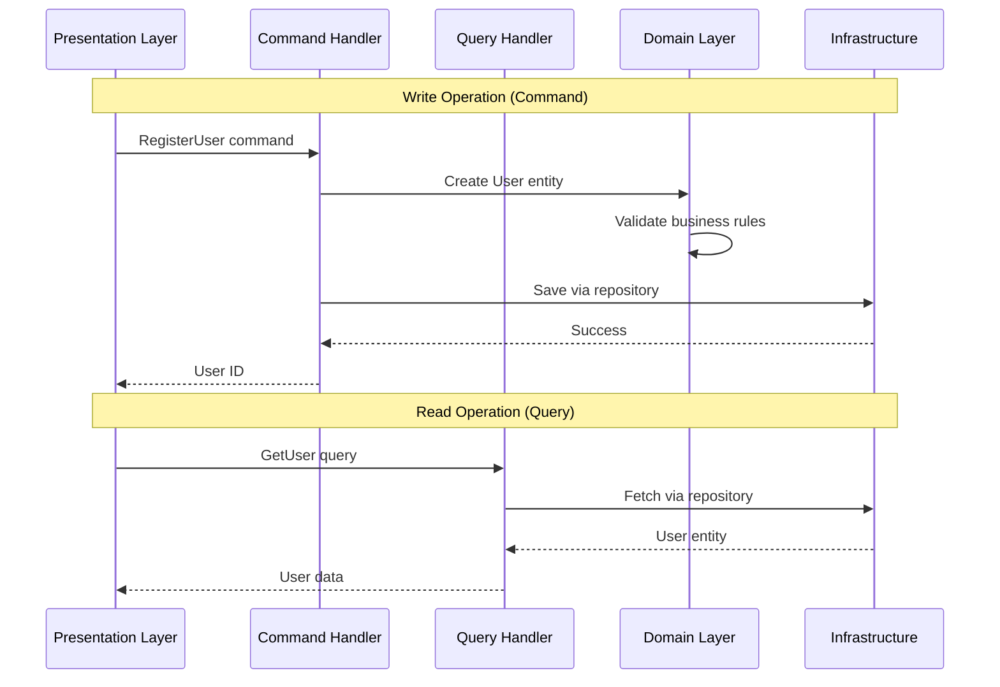

# Directory Structure - Hexagonal Architecture

## Overview

Dashtam follows **Hexagonal Architecture** (Ports & Adapters) with strict
layer separation. The domain layer is at the center, completely independent of
frameworks and infrastructure.

**Core Principle**: Domain depends on NOTHING. All dependencies point inward
toward the domain.

---

## Architecture Diagram



---

## Directory Structure

### Core Layer (`src/core/`)

**Purpose**: Shared kernel utilities used across all layers.

**Contents**:

- `result.py` - Result types for railway-oriented programming (`Success[T]`, `Failure[E]`)
- `errors/` - Core error classes (base and generic errors)
  - `domain_error.py` - DomainError (base class for all errors)
  - `common_errors.py` - ValidationError, NotFoundError, ConflictError, etc.
- `enums/` - Core enums (error codes, environment)
  - `error_code.py` - ErrorCode enum (domain-level error codes)
  - `environment.py` - Environment enum (dev, test, prod, ci)
- `validation.py` - Common validation functions
- `config.py` - Application settings with Pydantic
- `container.py` - Centralized dependency injection container

**Dependencies**: None (pure Python 3.13+)

**Rules**:

- No business logic
- No framework imports (except FastAPI Depends in container)
- Only foundational utilities
- Keep flat (no subdirectories)
- Container provides both app-scoped (singletons) and request-scoped dependencies

**See also**: `dependency-injection-architecture.md` for container pattern details.

---

### Domain Layer (`src/domain/`)

**Purpose**: Pure business logic - the heart of the application.

**Structure**:

```text
src/domain/
├── __init__.py
├── entities/          # Domain entities (mutable, have identity)
├── value_objects/     # Value objects (immutable, no identity)
├── enums/             # Domain enums (audit actions, provider types, etc.)
├── errors/            # Domain-specific errors (audit, secrets, etc.)
├── protocols/         # ALL protocols consolidated here (repositories, services, etc.)
├── events/            # Domain events (things that happened)
├── types.py           # Annotated types (Email, Password, etc.)
└── validators.py      # Centralized validation functions
```

**Protocol Consolidation** (CRITICAL):

All protocols are in `domain/protocols/` - NO separate `domain/repositories/` directory:

```text
src/domain/protocols/
├── __init__.py                            # Exports all protocols
├── user_repository.py                     # User persistence protocol
├── email_verification_token_repository.py # Email token persistence
├── refresh_token_repository.py            # Refresh token persistence
├── password_reset_token_repository.py     # Password reset token persistence
├── cache_protocol.py                      # Cache operations (Redis)
├── password_hashing_protocol.py           # Password hashing (bcrypt)
├── token_generation_protocol.py           # JWT/token generation
├── event_bus_protocol.py                  # Domain event publishing
├── audit_protocol.py                      # Audit trail recording
├── logger_protocol.py                     # Structured logging
├── secrets_protocol.py                    # Secrets management
└── email_protocol.py                      # Email sending
```

**Dependencies**: `src/core/` only (Result types, errors)

**Rules**:

- NO framework imports (FastAPI, SQLModel, etc.)
- NO infrastructure imports (database, Redis, etc.)
- Pure Python dataclasses and Protocol definitions
- All business rules live here
- Use `Protocol` for interfaces (NOT ABC)

**Examples**:

- `entities/user.py` - User entity with business methods
- `value_objects/email.py` - Email value object with validation
- `enums/audit_action.py` - AuditAction enum (extensible audit events)
- `enums/provider_type.py` - ProviderType enum (schwab, plaid, etc.)
- `errors/audit_error.py` - AuditError (audit system failures)
- `errors/secrets_error.py` - SecretsError (secrets retrieval failures)
- `protocols/user_repository.py` - UserRepository protocol (port)
- `protocols/cache_protocol.py` - CacheProtocol (port)
- `events/auth_events.py` - Authentication domain events (12 events)

---

### Application Layer (`src/application/`)

**Purpose**: Use cases and orchestration following CQRS pattern.

**Structure**:

```text
src/application/
├── __init__.py
├── commands/          # Write operations
│   ├── __init__.py
│   └── handlers/      # Command handler implementations
├── queries/           # Read operations
│   ├── __init__.py
│   └── handlers/      # Query handler implementations
└── events/            # Event handlers
    ├── __init__.py
    └── handlers/      # Domain event handler implementations
```

**Dependencies**: `src/domain/` ONLY (protocols, entities, events, errors), `src/core/`

**Rules**:

- Commands change state (write operations)
- Queries fetch data (read-only, can cache)
- Event handlers react to domain events (side effects)
- No business logic (orchestrate domain entities)
- One handler per command/query
- **CRITICAL**: Application layer imports ONLY from `domain/` and `core/` - NEVER from `infrastructure/`

**Examples**:

- `commands/register_user.py` - RegisterUser command dataclass
- `commands/handlers/register_user_handler.py` - Handler implementation
- `queries/get_user.py` - GetUser query dataclass
- `queries/handlers/get_user_handler.py` - Handler implementation
- `events/handlers/user_registered_handler.py` - Send verification email

---

### Infrastructure Layer (`src/infrastructure/`)

**Purpose**: Adapters that implement domain protocols (ports).

**Structure**:

```text
src/infrastructure/
├── __init__.py
├── persistence/       # Database adapters (PostgreSQL repositories)
├── external/          # External service clients (email, cache, secrets)
├── providers/         # Financial provider integrations (OAuth, data sync)
├── enums/             # Infrastructure enums (error codes)
└── errors/            # Infrastructure errors (database, cache, providers)
```

**Dependencies**: `src/domain/`, `src/core/`, external libraries

**Rules**:

- Implements domain protocols
- Contains framework imports (SQLModel, Redis, etc.)
- Database models live here (NOT in domain)
- Mapping functions: domain entity ↔ database model
- No business logic

**Examples**:

- `persistence/postgres_user_repository.py` - PostgreSQL UserRepository implementation
- `persistence/models/user.py` - SQLModel database model
- `external/redis_cache.py` - Redis cache adapter
- `providers/schwab/oauth_client.py` - Schwab OAuth implementation

---

### Presentation Layer (`src/presentation/`)

**Purpose**: HTTP API endpoints using FastAPI.

**Structure**:

```text
src/presentation/
├── __init__.py
└── api/
    ├── __init__.py
    └── v1/            # API version 1
        ├── users.py   # User endpoints
        ├── auth.py    # Authentication endpoints
        └── accounts.py # Account endpoints
```

**Dependencies**: `src/application/`, `src/core/`

**Rules**:

- Thin layer - NO business logic
- Dispatches commands/queries to application layer
- Translates HTTP → Command/Query → HTTP
- RESTful URLs (resource-based, NOT verb-based)
- Proper HTTP methods (GET/POST/PATCH/DELETE)
- All schemas in `src/schemas/` (NOT inline)

**Examples**:

- `api/v1/users.py` - User CRUD endpoints (`/api/v1/users`)
- `api/v1/auth.py` - Authentication endpoints (`/api/v1/auth/login`)

---

## Test Structure (`tests/`)

**Purpose**: Test pyramid with isolated test layers.

**Structure**:

```text
tests/
├── __init__.py
├── unit/              # 70% - Test domain logic in isolation
├── integration/       # 20% - Test cross-module interactions
├── api/               # 10% - Test HTTP endpoints end-to-end
└── smoke/             # Critical user journeys (E2E)
```

**Rules**:

- Unit tests: Mock all dependencies, test domain in isolation
- Integration tests: Real database, mocked external APIs
- API tests: Complete flows with TestClient
- Smoke tests: Critical user journeys (registration → login → data sync)
- All tests run in Docker (isolated test database, Redis)

**Examples**:

- `unit/domain/test_user.py` - Test User entity validation
- `integration/infrastructure/test_user_repository.py` - Test database operations
- `api/test_users.py` - Test POST /api/v1/users endpoint
- `smoke/test_onboarding_flow.py` - Test complete onboarding flow

---

## Dependency Flow

**CRITICAL**: Dependencies flow inward toward the domain.



**Key Points**:

- **Domain depends on NOTHING** (except Core shared kernel)
- **Infrastructure depends on Domain** (implements protocols)
- **Application depends on Domain** (uses entities, protocols)
- **Presentation depends on Application** (dispatches commands/queries)
- **NEVER** let Domain depend on Infrastructure or Presentation

---

## CQRS Pattern

Commands and Queries are separated from the start.



---

## File Naming Conventions

### Python Files and Classes (PEP 8 Standard)

**Universal Rule**: File name should match the main class name in `snake_case`

**Class Names**: `CapWords` (also known as PascalCase)

- `UserRepository`, `RegisterUser`, `RedisAdapter`

**File Names**: `lowercase_with_underscores` matching the class

- `user_repository.py` → `UserRepository` class
- `register_user.py` → `RegisterUser` class
- `redis_adapter.py` → `RedisAdapter` class
- `env_adapter.py` → `EnvAdapter` class
- `aws_adapter.py` → `AWSAdapter` class

**Benefits**:

- Easy to find: See `UserRepository` in code? Look for `user_repository.py`
- PEP 8 compliant: Industry standard Python style
- IDE-friendly: Auto-imports work correctly
- Consistent: Same pattern everywhere

**Examples Across Layers**:

```python
# Domain
src/domain/entities/user.py              → class User
src/domain/value_objects/email.py        → class Email
src/domain/protocols/user_repository.py  → class UserRepository

# Application
src/application/commands/register_user.py         → class RegisterUser
src/application/commands/handlers/register_user_handler.py → class RegisterUserHandler

# Infrastructure
src/infrastructure/persistence/repositories/user_repository.py → class UserRepository
src/infrastructure/cache/redis_adapter.py                       → class RedisAdapter
src/infrastructure/secrets/env_adapter.py                  → class EnvAdapter
src/infrastructure/secrets/aws_adapter.py                  → class AWSAdapter
```

**Python Directories**: `snake_case/`

- `value_objects/`
- `auth_strategies/`

**Documentation**: `kebab-case.md`

- `directory-structure.md`
- `oauth-flow.md`

**Config Files**: `kebab-case.yml`

- `docker-compose.dev.yml`
- `docker-compose.test.yml`

**Test Files**: `test_*.py` (pytest convention)

- `test_user.py`
- `test_user_repository.py`

---

## Key Architectural Decisions

### 1. Protocol over ABC

**Use `Protocol` for all new interfaces** (structural typing, no inheritance).

```python
from typing import Protocol

class UserRepository(Protocol):
    async def save(self, user: User) -> None: ...
    async def find_by_email(self, email: str) -> User | None: ...
```

### 2. Result Types over Exceptions

**Use Result types in domain layer** (explicit error handling).

```python
from src.core.result import Result, Success, Failure

def create_user(email: str) -> Result[User, ValidationError]:
    if not is_valid_email(email):
        return Failure(ValidationError(message="Invalid email"))
    return Success(user)
```

### 3. CQRS from Day One

**Separate commands (write) from queries (read)** from the start.

```python
# Command (write)
@dataclass(frozen=True, kw_only=True)
class RegisterUser:
    email: str
    password: str

# Query (read)
@dataclass(frozen=True, kw_only=True)
class GetUser:
    user_id: UUID
```

### 4. Immutable Commands/Queries

**All commands and queries are immutable** (`frozen=True`, `kw_only=True`).

### 5. Domain Events for Critical Workflows

**Emit domain events ONLY for critical workflows** with side effects.

```python
@dataclass(frozen=True, kw_only=True)
class UserRegistered:
    event_id: UUID
    occurred_at: datetime
    user_id: UUID
```

---

## Benefits of This Structure

**Testability**: Domain logic testable without database or HTTP.

**Maintainability**: Clear boundaries, easy to understand where code belongs.

**Flexibility**: Easy to swap implementations (PostgreSQL → MongoDB, Redis → Memcached).

**Framework Independence**: Domain survives framework upgrades.

**Team Scalability**: Multiple developers can work on different layers without conflicts.

---

## Enum Organization

**Architectural Decision**: Enums are centralized in dedicated `enums/` directories
for discoverability, maintainability, and to avoid circular import issues.

### Why Centralized Enums?

**Problem**: As the project scales, we'll have 10+ enums. Inline enums cause:

- Large files mixing concerns (protocols + enums + errors)
- Hard to discover ("Where is `AuditAction` defined?")
- Circular import risks (enum used by multiple modules)
- Violates Single Responsibility Principle

**Solution**: Treat enums as **Value Objects** in DDD - they get their own directory.

### Directory Structure for Enums

```text
src/core/enums/
├── __init__.py           # Export all core enums
├── error_code.py        # ErrorCode enum (domain errors)
└── environment.py       # Environment enum (dev/test/prod/ci)

src/domain/enums/
├── __init__.py           # Export all domain enums
├── audit_action.py      # AuditAction enum (audit events)
├── provider_type.py     # ProviderType enum (schwab, plaid, yodlee)
├── account_type.py      # AccountType enum (checking, savings, investment)
├── transaction_type.py  # TransactionType enum (debit, credit, transfer)
└── sync_status.py       # SyncStatus enum (pending, in_progress, completed)

src/infrastructure/enums/
├── __init__.py                      # Export infrastructure enums
└── infrastructure_error_code.py    # InfrastructureErrorCode enum
```

### Enum Naming Convention

**File names**: `snake_case.py` (e.g., `audit_action.py`)  
**Class names**: `PascalCase` (e.g., `AuditAction`)  
**Enum values**: `UPPER_SNAKE_CASE` (e.g., `USER_LOGIN = "user_login"`)

**Export all enums in `__init__.py`**:

```python
# src/domain/enums/__init__.py
from src.domain.enums.audit_action import AuditAction
from src.domain.enums.provider_type import ProviderType
from src.domain.enums.account_type import AccountType

__all__ = ["AuditAction", "ProviderType", "AccountType"]
```

**Import from enums package**:

```python
# ✅ CORRECT: Import from enums package
from src.domain.enums import AuditAction, ProviderType

# ✅ ALSO CORRECT: Direct import (if only need one)
from src.domain.enums.audit_action import AuditAction

# ❌ WRONG: Don't import from parent module
from src.domain import AuditAction  # No!
```

### Enum Template

**Every enum file follows this structure**:

```python
# src/domain/enums/audit_action.py
"""Audit action types for compliance tracking.

This enum defines all auditable actions in the system (PCI-DSS, SOC 2, GDPR).
Extensible via enum values - no database schema changes needed.
"""

from enum import Enum


class AuditAction(str, Enum):
    """Audit action types (extensible via enum).
    
    Organized by category for clarity. Add new actions as needed
    without database schema changes (metadata stores action-specific data).
    
    Categories:
    - Authentication (USER_*)
    - Authorization (ACCESS_*)
    - Data Operations (DATA_*)
    - Administrative (ADMIN_*)
    - Provider (PROVIDER_*)
    """
    
    # Authentication events (PCI-DSS required)
    USER_LOGIN = "user_login"
    USER_LOGOUT = "user_logout"
    USER_LOGIN_FAILED = "user_login_failed"
    # ... more values ...
```

### Benefits of Centralized Enums

✅ **Discoverability**: All enums in one place per layer  
✅ **Scalability**: Easy to add new enums without bloating other files  
✅ **Single Responsibility**: Each file has one enum  
✅ **Avoids Circular Imports**: Enums are leaf nodes in dependency graph  
✅ **Industry Standard**: Django, FastAPI complex projects use this pattern  
✅ **DDD Compliant**: Enums are treated as Value Objects

---

## Error Organization

**Architectural Decision**: Error classes are centralized in dedicated `errors/`
directories, organized by architectural layer (core vs domain vs infrastructure).

### Why Centralized Errors?

**Problem**: As the project scales, we'll have 20+ error types. Scattered
errors cause:

- Hard to discover ("Where is `AuditError` defined?")
- Inconsistent error handling
- Difficult to understand error hierarchy
- Mixed concerns (protocols + errors in same file)

**Solution**: Group errors by layer in dedicated directories.

### Directory Structure for Errors

```text
src/core/errors/
├── __init__.py              # Export all core errors
├── domain_error.py          # DomainError (base class for all errors)
└── common_errors.py         # ValidationError, NotFoundError, ConflictError,
                             # AuthenticationError, AuthorizationError

src/domain/errors/
├── __init__.py              # Export all domain errors
├── audit_error.py           # AuditError (audit system failures)
└── secrets_error.py         # SecretsError (secrets retrieval failures)

src/infrastructure/errors/
├── __init__.py              # Export all infrastructure errors
└── infrastructure_error.py  # InfrastructureError, DatabaseError, CacheError,
                             # ExternalServiceError, ProviderError
```

### When to Use Each Layer

**Core Errors** (`src/core/errors/`):

- **DomainError**: Base class for ALL application errors
- **Generic errors**: Used across ALL domains and layers
- Examples: ValidationError, NotFoundError, ConflictError, AuthenticationError

**Domain Errors** (`src/domain/errors/`):

- **Domain-specific errors**: Tied to specific domain concepts
- Examples: AuditError (audit trail), SecretsError (secrets management)
- Future: ProviderError, TransactionError, AccountError

**Infrastructure Errors** (`src/infrastructure/errors/`):

- **Infrastructure failures**: Database, cache, external services
- Examples: DatabaseError, CacheError, ProviderError
- Maps to domain errors when flowing to domain layer

### Error Naming Convention

**File names**: `snake_case.py` (e.g., `audit_error.py`)  
**Class names**: `PascalCase` ending in `Error` (e.g., `AuditError`)

**Export all errors in `__init__.py`**:

```python
# src/domain/errors/__init__.py
from src.domain.errors.audit_error import AuditError
from src.domain.errors.secrets_error import SecretsError

__all__ = ["AuditError", "SecretsError"]
```

**Import from errors package**:

```python
# ✅ CORRECT: Import from errors package
from src.core.errors import DomainError, ValidationError
from src.domain.errors import AuditError, SecretsError

# ✅ ALSO CORRECT: Direct import (if only need one)
from src.domain.errors.audit_error import AuditError

# ❌ WRONG: Don't import from parent module
from src.domain import AuditError  # No!
```

### Error Template

**Every error file follows this structure**:

```python
# src/domain/errors/audit_error.py
"""Audit trail error types.

Used when audit trail recording or querying fails.
Returned in Result types, not raised as exceptions.
"""

from dataclasses import dataclass

from src.core.errors import DomainError


@dataclass(frozen=True, slots=True, kw_only=True)
class AuditError(DomainError):
    """Audit system failure.
    
    Used when audit trail recording fails (database error, connection loss).
    
    Attributes:
        code: ErrorCode enum (AUDIT_RECORD_FAILED, AUDIT_QUERY_FAILED).
        message: Human-readable message.
        details: Additional context.
    """
    
    pass  # Inherits all fields from DomainError
```

### Protocol vs Inheritance: When to Use Each

**CRITICAL DISTINCTION**: Our "Protocol over ABC" rule applies to
**interfaces/behavior**, NOT data structures.

**Use Protocol (Structural Typing) For**:

**Interfaces that define BEHAVIOR** - Multiple implementations with same interface:

```python
# ✅ CORRECT: Protocol for behavior/interface
class CacheProtocol(Protocol):
    async def get(self, key: str) -> Result[str | None, DomainError]: ...
    async def set(self, key: str, value: str) -> Result[None, DomainError]: ...

# Implementations DON'T inherit (duck typing)
class RedisAdapter:  # No inheritance
    async def get(self, key: str) -> ...

class MemcachedAdapter:  # No inheritance
    async def get(self, key: str) -> ...
```

**Why Protocol?**

- Different implementations (Redis, Memcached, InMemory)
- Structural typing (no inheritance required)
- Easy to swap implementations
- Follows Python 3.13+ best practices

**Examples**: CacheProtocol, SecretsProtocol, LoggerProtocol, AuditProtocol

**Use Inheritance (Dataclass) For**:

**Data structures that share FIELDS** - Subclasses add additional fields:

```python
# ✅ CORRECT: Inheritance for data structures
@dataclass(frozen=True, slots=True, kw_only=True)
class DomainError:
    code: ErrorCode
    message: str
    details: dict | None = None

class ValidationError(DomainError):  # Inherits base fields
    field: str | None = None  # Adds new field

class AuditError(DomainError):  # Inherits base fields
    pass  # No additional fields
```

**Why Inheritance?**

- Errors are data structures (carry information)
- Subclasses extend base structure with additional fields
- Type safety: `Result[T, DomainError]` accepts all error subclasses
- Standard Python pattern (like `Exception` hierarchy)

**Examples**: Error classes, Domain events, Commands/Queries

#### Summary Table

<!-- markdownlint-disable MD013 -->
| Use Case | Pattern | Example | Why |
| -------- | ------- | ------- | --- |
| **Interfaces/Behavior** | Protocol | CacheProtocol, LoggerProtocol | Multiple implementations |
| **Data Structures** | Inheritance | DomainError → ValidationError | Shared structure + fields |
<!-- markdownlint-enable MD013 -->

**Industry Examples**:

- Django: Errors use inheritance ✅, Views use ABC/Protocol ✅
- FastAPI: HTTPException uses inheritance ✅, Dependencies use duck typing ✅
- Python stdlib: Exception uses inheritance ✅, collections.abc uses Protocol ✅

**Our Architecture**:

- ✅ Protocol for: Cache, Secrets, Logger, Audit (interfaces)
- ✅ Inheritance for: Errors, Events, Commands, Queries (data structures)

### Benefits of Centralized Errors

✅ **Discoverability**: All errors in one place per layer  
✅ **Type Safety**: Clear error hierarchy with base class  
✅ **Single Responsibility**: Errors separated from protocols  
✅ **Consistency**: Same pattern across all layers  
✅ **Industry Standard**: Mirrors Django, FastAPI error organization  
✅ **DDD Compliant**: Domain errors separate from infrastructure errors

---

**Related Documentation**:

- [Import Guidelines](../guides/import-guidelines.md)
- [Dependency Injection Architecture](dependency-injection-architecture.md)

**Created**: 2025-11-08 | **Last Updated**: 2025-11-25
