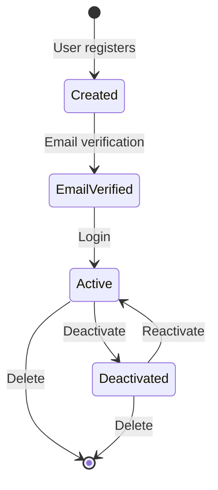

# Domain-Driven Design Architecture

## Overview

**Purpose**: Apply Domain-Driven Design (DDD) principles pragmatically to model complex business domains, focusing on ubiquitous language, bounded contexts, and domain integrity.

**Problem**: Business logic scattered across layers:

- Domain concepts mixed with infrastructure code
- No clear separation between business rules and technical details
- Lack of shared language between developers and domain experts
- Difficult to understand and maintain business logic
- Tight coupling between domain and frameworks

**Solution**: Pragmatic DDD in Dashtam:

- **Ubiquitous Language**: Shared vocabulary between code and business
- **Domain at Core**: Business logic in pure domain layer (no framework deps)
- **Tactical Patterns**: Entities, Value Objects, Domain Events, Repositories
- **Strategic Patterns**: Bounded Contexts (planned for multi-provider future)
- **Pragmatic Approach**: Use patterns when they add value, skip when they don't

---

## What "Pragmatic DDD" Means in Dashtam

**DDD can be dogmatic** — full implementation requires significant infrastructure (aggregates, domain services, specifications, factories, etc.). Many DDD books advocate for patterns that add complexity without clear ROI in smaller systems.

**Dashtam's Pragmatic Approach**:

✅ **Use DDD patterns that provide clear value**:

- Entities (identity-based domain objects)
- Value Objects (immutable, equality-based)
- Domain Events (communication within bounded context)
- Repository Protocols (persistence abstraction)
- Ubiquitous Language (consistent naming)

❌ **Skip DDD patterns with unclear ROI for current scale**:

- Aggregates (one-to-many relationships are simple enough)
- Domain Services (application layer handles this)
- Specifications (query logic is straightforward)
- Factories (dataclass constructors suffice)

**Key Principle**: **Start simple, add complexity only when pain points emerge.**

---

## Core DDD Concepts

### 1. Ubiquitous Language

**Definition**: A shared vocabulary between developers, domain experts, and business stakeholders that is reflected consistently in code.

**Example from Dashtam**:

| Business Term | Code Representation | Explanation |
|---------------|---------------------|-------------|
| User Registration | `RegisterUser` command | User intent to create account |
| Account Sync | `SyncAccounts` command | Fetch latest account data |
| Provider Token | `ProviderToken` entity | OAuth credentials for provider |
| Transaction | `Transaction` entity | Financial transaction |
| Balance Snapshot | `BalanceSnapshot` value object | Point-in-time account balance |

**Consistency**:

- ✅ Domain entities named after business concepts
- ✅ Commands named after user actions (verbs)
- ✅ Domain events describe what happened (past tense)
- ❌ NO technical jargon in domain layer (`UserDTO`, `UserDAO`)

**Example**:

```python
# ✅ GOOD: Ubiquitous language
class User:
    """Domain entity representing a registered user."""
    id: UUID
    email: str
    is_verified: bool
    
    def verify_email(self) -> None:
        """Mark user's email as verified."""
        self.is_verified = True

# ❌ BAD: Technical language
class UserRecord:  # "Record" is technical
    user_pk: int  # "pk" is database term
    email_addr: str
    verified_flag: int  # "flag" is technical
```

### 2. Domain Layer (Pure Business Logic)

**Core Principle**: Domain layer depends on NOTHING — no frameworks, no infrastructure, no external libraries.

**Domain Layer Structure**:

```text
src/domain/
├── entities/           # Identity-based objects (User, Account, Transaction)
├── value_objects/      # Immutable, equality-based (Money, DateRange)
├── events/             # Domain events (UserRegistered, AccountSynced)
├── protocols/          # Ports for infrastructure (UserRepository, CacheProtocol)
├── enums/              # Domain enums (UserRole, AccountType)
├── errors/             # Domain errors (ValidationError, BusinessRuleError)
├── types.py            # Annotated types (Email, Password, Money)
└── validators.py       # Validation functions
```

**What Lives in Domain**:

✅ **Business rules**: "User must verify email before login"  
✅ **Domain logic**: "Calculate account balance from transactions"  
✅ **Domain concepts**: `User`, `Account`, `Transaction`, `ProviderToken`  
✅ **Domain events**: `UserRegistered`, `AccountSynced`

❌ **NOT in domain**:

- Database queries
- HTTP requests
- Framework imports (FastAPI, SQLAlchemy)
- External API calls
- Infrastructure concerns

**Example**:

```python
# ✅ CORRECT: Pure domain entity
from dataclasses import dataclass
from uuid import UUID

@dataclass
class User:
    """Domain entity for registered user."""
    id: UUID
    email: str
    is_verified: bool
    
    def verify_email(self) -> None:
        """Mark email as verified."""
        if self.is_verified:
            raise BusinessRuleError("Email already verified")
        self.is_verified = True

# ❌ WRONG: Framework imports in domain
from sqlalchemy.orm import Mapped  # NO!
from fastapi import HTTPException   # NO!

@dataclass
class User:
    id: Mapped[UUID]  # SQLAlchemy in domain - WRONG!
```

### 3. Entities (Identity-Based)

**Definition**: Objects with unique identity that persists over time, even as their attributes change.

**Characteristics**:

- ✅ Has unique ID (UUID, int, etc.)
- ✅ Mutable (attributes can change)
- ✅ Equality based on ID, NOT attributes
- ✅ Encapsulates business logic

**Example from Dashtam**:

```python
# src/domain/entities/user.py
from dataclasses import dataclass
from uuid import UUID

@dataclass
class User:
    """Registered user entity.
    
    Identity: user_id (UUID)
    Lifecycle: Created → Email Verified → Active → Deleted
    """
    id: UUID
    email: str
    is_verified: bool
    is_active: bool
    
    def verify_email(self) -> None:
        """Mark user's email as verified.
        
        Business Rule: User must verify email before login.
        """
        if self.is_verified:
            raise BusinessRuleError("Email already verified")
        self.is_verified = True
    
    def deactivate(self) -> None:
        """Deactivate user account.
        
        Business Rule: Deactivated users cannot login.
        """
        if not self.is_active:
            raise BusinessRuleError("User already deactivated")
        self.is_active = False
    
    def __eq__(self, other: object) -> bool:
        """Equality based on ID."""
        if not isinstance(other, User):
            return False
        return self.id == other.id
    
    def __hash__(self) -> int:
        """Hash based on ID."""
        return hash(self.id)
```

**Entity Lifecycle**:



### 4. Value Objects (Immutable, Equality-Based)

**Definition**: Objects without identity, defined only by their attributes. Two value objects with same attributes are considered equal.

**Characteristics**:

- ✅ Immutable (`frozen=True`)
- ✅ Equality based on ALL attributes
- ✅ No unique ID
- ✅ Represent domain concepts (Money, DateRange, Address)

**When to Use**:

- ✅ **Descriptive concepts**: Money, DateRange, EmailAddress
- ✅ **Measurements**: Weight, Distance, Temperature
- ✅ **Immutable data**: Address, Coordinates

**Example from Dashtam**:

```python
# src/domain/value_objects/money.py
from dataclasses import dataclass
from decimal import Decimal

@dataclass(frozen=True, kw_only=True)
class Money:
    """Value object representing monetary amount.
    
    Immutable: Once created, cannot be modified.
    Equality: Two Money instances with same amount and currency are equal.
    """
    amount: Decimal
    currency: str  # ISO 4217 code (USD, EUR, etc.)
    
    def add(self, other: "Money") -> "Money":
        """Add two Money values.
        
        Business Rule: Can only add money with same currency.
        
        Args:
            other: Money to add.
            
        Returns:
            New Money instance with sum.
            
        Raises:
            BusinessRuleError: If currencies don't match.
        """
        if self.currency != other.currency:
            raise BusinessRuleError(
                f"Cannot add {self.currency} and {other.currency}"
            )
        return Money(amount=self.amount + other.amount, currency=self.currency)
    
    def multiply(self, factor: Decimal) -> "Money":
        """Multiply money by scalar factor.
        
        Args:
            factor: Multiplication factor.
            
        Returns:
            New Money instance with result.
        """
        return Money(amount=self.amount * factor, currency=self.currency)
```

**Value Object Example 2**:

```python
# src/domain/value_objects/date_range.py
from dataclasses import dataclass
from datetime import date

@dataclass(frozen=True, kw_only=True)
class DateRange:
    """Value object representing date range.
    
    Business Rule: start_date must be <= end_date.
    """
    start_date: date
    end_date: date
    
    def __post_init__(self) -> None:
        """Validate business rule."""
        if self.start_date > self.end_date:
            raise ValidationError("start_date must be <= end_date")
    
    def contains(self, target: date) -> bool:
        """Check if date is within range.
        
        Args:
            target: Date to check.
            
        Returns:
            True if target is within range.
        """
        return self.start_date <= target <= self.end_date
    
    def days(self) -> int:
        """Calculate number of days in range.
        
        Returns:
            Number of days (inclusive).
        """
        return (self.end_date - self.start_date).days + 1
```

### 5. Entity vs Value Object: Decision Tree

**How to decide**:

```text
Does the object need a unique identity?
│
├─ YES ──→ Entity
│          Examples: User, Account, Transaction
│          Why: User with ID=1 is SAME user even if email changes
│
└─ NO ──→ Does it represent a descriptive concept?
           │
           ├─ YES ──→ Value Object
           │          Examples: Money, DateRange, Address
           │          Why: Two Money(100, USD) are identical
           │
           └─ NO ──→ Simple data type or Pydantic schema
                      Examples: UserCreate (request), UserResponse (response)
                      Why: No domain logic, just data transfer
```

**Examples**:

| Concept | Type | Reasoning |
|---------|------|-----------|
| User | **Entity** | Has unique ID, lifecycle, mutable |
| Account | **Entity** | Has unique account_id, balance changes |
| Transaction | **Entity** | Has unique transaction_id |
| ProviderToken | **Entity** | Has unique token, expires over time |
| Money | **Value Object** | No ID, immutable, equality by value |
| DateRange | **Value Object** | No ID, immutable, descriptive |
| Address | **Value Object** | No ID, immutable, descriptive |
| UserCreate | **Pydantic Schema** | Request DTO, no domain logic |

---

## DDD Patterns Used in Dashtam

### 1. Entities

**All entities in `src/domain/entities/`**:

- `user.py` - Registered user
- `account.py` - Financial account (brokerage, bank, etc.)
- `transaction.py` - Financial transaction
- `provider_token.py` - OAuth token for provider
- `balance_snapshot.py` - Point-in-time account balance
- `holding.py` - Asset holding (stocks, bonds, etc.)

**Common Entity Pattern**:

```python
from dataclasses import dataclass
from uuid import UUID

@dataclass
class Account:
    """Financial account entity."""
    id: UUID
    user_id: UUID
    provider_id: UUID
    account_type: AccountType
    balance: Money
    is_active: bool
    
    def update_balance(self, new_balance: Money) -> None:
        """Update account balance.
        
        Business Rule: Balance currency must match account currency.
        """
        if new_balance.currency != self.balance.currency:
            raise BusinessRuleError("Currency mismatch")
        self.balance = new_balance
    
    def deactivate(self) -> None:
        """Deactivate account."""
        self.is_active = False
```

### 2. Value Objects

**All value objects in `src/domain/value_objects/`**:

- `money.py` - Monetary amount with currency
- `date_range.py` - Date range (start/end)

**Note**: Dashtam currently has few value objects because most domain concepts are entities. As complexity grows, more value objects will emerge (Address, PhoneNumber, AccountNumber, etc.).

### 3. Domain Events

**All domain events in `src/domain/events/`**:

Domain events represent **something that happened** in the domain that other parts of the system care about.

**3-State Pattern** (ATTEMPT → OUTCOME):

1. `*Attempted` - Before business logic (audit: ATTEMPTED)
2. `*Succeeded` - After successful commit (audit: outcome)
3. `*Failed` - After failure (audit: FAILED)

**Example Events**:

```python
# src/domain/events/auth_events.py
from dataclasses import dataclass
from uuid import UUID
from datetime import datetime
from src.domain.events.base import DomainEvent

@dataclass(frozen=True, kw_only=True)
class UserRegistrationAttempted(DomainEvent):
    """Emitted when user registration is attempted."""
    email: str
    ip_address: str | None

@dataclass(frozen=True, kw_only=True)
class UserRegistrationSucceeded(DomainEvent):
    """Emitted after successful user registration."""
    user_id: UUID
    email: str

@dataclass(frozen=True, kw_only=True)
class UserRegistrationFailed(DomainEvent):
    """Emitted when user registration fails."""
    email: str
    reason: str
```

**When to Emit Domain Events**:

✅ **Emit when**:

- Critical workflow needs audit trail (registration, login, sync)
- Multiple side effects needed (logging, audit, email, session management)
- Cross-cutting concerns (security monitoring, rate limiting)

❌ **Don't emit when**:

- Simple CRUD operations (find_by_id, list users)
- Internal calculations (no side effects)
- Performance-critical paths (avoid overhead)

**See**: [Event Registry Pattern Architecture](registry.md) for complete event system details.

### 4. Repository Protocols

**All repository protocols in `src/domain/protocols/`**:

Repositories abstract persistence, allowing domain to define what it needs without knowing HOW data is stored.

**Repository Protocol Pattern**:

```python
# src/domain/protocols/user_repository.py
from typing import Protocol
from uuid import UUID
from src.domain.entities.user import User

class UserRepository(Protocol):
    """Repository port for user persistence.
    
    Domain defines WHAT it needs, infrastructure provides HOW.
    """
    
    async def find_by_id(self, user_id: UUID) -> User | None:
        """Find user by ID."""
        ...
    
    async def find_by_email(self, email: str) -> User | None:
        """Find user by email."""
        ...
    
    async def save(self, user: User) -> None:
        """Persist user entity."""
        ...
    
    async def delete(self, user_id: UUID) -> None:
        """Delete user."""
        ...
```

**Key Points**:

- ✅ Protocol in domain layer (port)
- ✅ Implementation in infrastructure layer (adapter)
- ✅ Returns domain entities, NOT database models
- ✅ No SQL, no framework imports

**See**: [Protocol-Based Architecture](protocols.md) for complete protocol details.

### 5. Domain Services (Minimal Use)

**Domain Services** handle domain logic that doesn't belong to a single entity.

**When to Use**:

✅ **Use domain service when**:

- Logic spans multiple entities
- No clear "home" entity for the logic
- Complex calculation involving multiple domain objects

**Dashtam's Approach**: **Application layer handles most "service" logic.**

**Example (NOT currently in Dashtam, but illustrative)**:

```python
# Hypothetical: Portfolio value calculation
class PortfolioService:
    """Domain service for portfolio calculations.
    
    Doesn't fit in Account entity (spans multiple holdings).
    """
    
    def calculate_total_value(
        self,
        holdings: list[Holding],
        market_prices: dict[str, Money],
    ) -> Money:
        """Calculate total portfolio value.
        
        Business Rule: Sum of (quantity * market_price) for all holdings.
        """
        total = Money(amount=Decimal("0"), currency="USD")
        
        for holding in holdings:
            price = market_prices.get(holding.symbol)
            if price:
                value = price.multiply(Decimal(holding.quantity))
                total = total.add(value)
        
        return total
```

**Why minimal use in Dashtam**: Most calculations fit in handlers or entities, keeping domain layer simple.

---

## DDD Patterns NOT Used (And Why)

### 1. Aggregates (Not Used)

**What They Are**: Cluster of entities and value objects with a single root entity. Only the root can be accessed from outside.

**Why We Skip**:

- ❌ Current one-to-many relationships are simple enough
- ❌ No complex invariants spanning multiple entities yet
- ❌ Adds complexity without clear ROI at current scale

**When We'll Add**:

- ✅ If we need transactional consistency across entities
- ✅ If business rules span multiple entities (e.g., Order → OrderLine)

**Example (NOT in Dashtam)**:

```python
# Aggregate: Order (root) + OrderLines
class Order:
    """Aggregate root."""
    id: UUID
    lines: list[OrderLine]  # Child entities
    
    def add_line(self, item: Item, quantity: int) -> None:
        """Add order line (enforces invariant)."""
        # Business rule: No duplicate items
        if any(line.item_id == item.id for line in self.lines):
            raise BusinessRuleError("Item already in order")
        self.lines.append(OrderLine(item_id=item.id, quantity=quantity))
```

### 2. Specifications (Not Used)

**What They Are**: Reusable query criteria encapsulated as objects.

**Why We Skip**:

- ❌ Query logic is straightforward (no complex filtering)
- ❌ Repository methods are specific enough
- ❌ Adds abstraction layer without clear benefit

**When We'll Add**:

- ✅ If we need complex, composable query logic
- ✅ If filtering logic is reused across multiple contexts

**Example (NOT in Dashtam)**:

```python
# Specification pattern
class ActiveUserSpecification:
    def is_satisfied_by(self, user: User) -> bool:
        return user.is_active and user.is_verified

class EmailDomainSpecification:
    def __init__(self, domain: str):
        self.domain = domain
    
    def is_satisfied_by(self, user: User) -> bool:
        return user.email.endswith(f"@{self.domain}")
```

### 3. Factories (Not Used)

**What They Are**: Objects that encapsulate complex entity creation logic.

**Why We Skip**:

- ❌ Entity creation is simple (dataclass constructors)
- ❌ No complex initialization logic yet
- ❌ Handlers can create entities directly

**When We'll Add**:

- ✅ If entity creation involves complex business rules
- ✅ If multiple creation paths need consistency

**Example (NOT in Dashtam)**:

```python
# Factory pattern
class UserFactory:
    def create_user(
        self,
        email: str,
        password: str,
        role: UserRole = UserRole.USER,
    ) -> User:
        """Create user with default values and validation."""
        hashed_password = self._hash_password(password)
        
        return User(
            id=uuid7(),
            email=email.lower(),
            hashed_password=hashed_password,
            role=role,
            is_verified=False,
            is_active=True,
            created_at=utc_now(),
        )
```

**Current Approach**: Handlers create entities directly, keeping code simple.

---

## Integration with Other Architectures

### 1. DDD + Hexagonal Architecture

**How They Fit**:

- **Domain layer** = Core hexagon (business logic)
- **Repository Protocols** = Ports (interfaces domain needs)
- **Repository Implementations** = Adapters (infrastructure provides)

```text
┌───────────────────────────────────────────────┐
│ Domain Layer (DDD Core)                       │
│ - Entities (User, Account, Transaction)      │
│ - Value Objects (Money, DateRange)           │
│ - Domain Events (UserRegistered, etc.)       │
│ - Repository Protocols (Ports)               │
└───────────────────────────────────────────────┘
          ↑ implements                          
          │                                     
┌───────────────────────────────────────────────┐
│ Infrastructure Layer (Adapters)               │
│ - PostgreSQL Repository Implementations      │
│ - Redis Cache Adapter                        │
│ - Schwab Provider Adapter                    │
└───────────────────────────────────────────────┘
```

**Key Point**: DDD defines WHAT (domain concepts), Hexagonal defines WHERE (layer placement).

**See**: [Hexagonal Architecture](hexagonal.md)

### 2. DDD + CQRS

**How They Fit**:

- **Commands** = Write operations that modify domain entities
- **Queries** = Read operations that fetch data
- **Domain Events** = Side effects after command execution

```text
Command (RegisterUser)
    ↓
Handler creates User entity (DDD)
    ↓
Save via UserRepository protocol (DDD)
    ↓
Emit UserRegistrationSucceeded event (DDD)
    ↓
Event handlers react (logging, audit, email)
```

**Key Point**: CQRS defines HOW (command/query separation), DDD defines WHAT (domain entities/events).

**See**: [CQRS Pattern](cqrs.md)

### 3. DDD + Protocol-Based Architecture

**How They Fit**:

- **Domain** defines Repository protocols (ports)
- **Infrastructure** implements protocols without inheritance (adapters)
- **Protocol** = Interface abstraction (structural typing)

```python
# Domain defines protocol (DDD port)
class UserRepository(Protocol):
    async def save(self, user: User) -> None: ...

# Infrastructure implements (Hexagonal adapter)
class PostgresUserRepository:  # No inheritance!
    async def save(self, user: User) -> None:
        # Map User entity → UserModel (database)
        ...
```

**Key Point**: Protocol provides TYPE-SAFE abstraction for DDD repositories.

**See**: [Protocol-Based Architecture](protocols.md)

### 4. DDD + Event Registry Pattern

**How They Fit**:

- **Domain Events** = DDD tactical pattern
- **Event Registry** = Single source of truth for all events
- **Event Handlers** = Side effects after domain changes

**Event Lifecycle**:

1. Domain entity state changes
2. Domain event emitted (`UserRegistrationSucceeded`)
3. Event bus dispatches to registered handlers
4. Handlers react (logging, audit, email, session)

**Key Point**: Event Registry manages HOW events are dispatched, DDD defines WHAT events mean.

**See**: [Event Registry Pattern Architecture](registry.md)

---

## Domain vs Application Services

**Core Question**: Where does business logic go?

### Domain Services

**Lives in**: `src/domain/` (rare in Dashtam)

**Use when**:

- Logic spans multiple entities
- Pure domain calculation (no side effects)
- Reusable across multiple use cases

**Example (Hypothetical)**:

```python
# src/domain/services/portfolio_service.py
class PortfolioService:
    """Domain service for portfolio calculations."""
    
    def calculate_total_value(
        self,
        holdings: list[Holding],
        market_prices: dict[str, Money],
    ) -> Money:
        """Calculate total portfolio value (pure calculation)."""
        # Pure domain logic, no side effects
        ...
```

### Application Services (Handlers)

**Lives in**: `src/application/commands/handlers/`, `src/application/queries/handlers/`

**Use when** (most common):

- Orchestrating domain entities
- Coordinating multiple repositories
- Emitting domain events
- Side effects (logging, email, etc.)

**Example (Current Dashtam Pattern)**:

```python
# src/application/commands/handlers/register_user_handler.py
class RegisterUserHandler:
    """Application service for user registration."""
    
    def __init__(
        self,
        user_repo: UserRepository,
        event_bus: EventBusProtocol,
    ):
        self._user_repo = user_repo
        self._event_bus = event_bus
    
    async def handle(self, cmd: RegisterUser) -> Result[UUID, DomainError]:
        """Handle user registration command.
        
        Orchestrates:
        1. Create User entity (domain logic)
        2. Save via repository (infrastructure)
        3. Emit domain event (side effect)
        """
        # Emit ATTEMPT event
        await self._event_bus.publish(
            UserRegistrationAttempted(email=cmd.email, ...)
        )
        
        # Create domain entity
        user = User(
            id=uuid7(),
            email=cmd.email,
            is_verified=False,
            is_active=True,
        )
        
        # Persist
        await self._user_repo.save(user)
        
        # Emit SUCCESS event
        await self._event_bus.publish(
            UserRegistrationSucceeded(user_id=user.id, email=user.email)
        )
        
        return Success(value=user.id)
```

**Decision Rule**: **Default to application handlers**, only extract domain service if logic is pure and reusable.

---

## Testing Strategy for DDD Components

### 1. Entity Tests (Unit)

**Test**: Business logic in entities.

```python
# tests/unit/test_domain_user_entity.py
def test_user_verify_email():
    """Test email verification business rule."""
    user = User(
        id=uuid7(),
        email="test@example.com",
        is_verified=False,
    )
    
    user.verify_email()
    
    assert user.is_verified

def test_user_verify_email_already_verified():
    """Test cannot verify email twice."""
    user = User(id=uuid7(), email="test@example.com", is_verified=True)
    
    with pytest.raises(BusinessRuleError, match="already verified"):
        user.verify_email()
```

### 2. Value Object Tests (Unit)

**Test**: Immutability, equality, domain logic.

```python
# tests/unit/test_domain_money_value_object.py
def test_money_add_same_currency():
    """Test adding money with same currency."""
    m1 = Money(amount=Decimal("100.00"), currency="USD")
    m2 = Money(amount=Decimal("50.00"), currency="USD")
    
    result = m1.add(m2)
    
    assert result.amount == Decimal("150.00")
    assert result.currency == "USD"

def test_money_add_different_currency_raises():
    """Test cannot add different currencies."""
    m1 = Money(amount=Decimal("100.00"), currency="USD")
    m2 = Money(amount=Decimal("50.00"), currency="EUR")
    
    with pytest.raises(BusinessRuleError, match="Cannot add"):
        m1.add(m2)
```

### 3. Repository Tests (Integration)

**Test**: Repository implementation satisfies protocol, entity ↔ model mapping.

```python
# tests/integration/test_user_repository.py
@pytest.mark.asyncio
async def test_user_repository_save_and_find(db_session: AsyncSession):
    """Test repository saves and retrieves entity."""
    repo = UserRepository(session=db_session)
    
    user = User(
        id=uuid7(),
        email="test@example.com",
        is_verified=False,
    )
    
    # Save entity
    await repo.save(user)
    await db_session.commit()
    
    # Retrieve entity
    found = await repo.find_by_email("test@example.com")
    
    assert found is not None
    assert found.id == user.id
    assert found.email == user.email
```

### 4. Handler Tests (Unit with Mocks)

**Test**: Command/query handler orchestration with mocked repositories.

```python
# tests/unit/test_application_register_user_handler.py
@pytest.mark.asyncio
async def test_register_user_success():
    """Test user registration handler."""
    mock_repo = AsyncMock(spec=UserRepository)
    mock_repo.find_by_email.return_value = None
    
    mock_event_bus = AsyncMock(spec=EventBusProtocol)
    
    handler = RegisterUserHandler(
        user_repo=mock_repo,
        event_bus=mock_event_bus,
    )
    
    result = await handler.handle(
        RegisterUser(email="test@example.com", password="SecurePass123!")
    )
    
    assert isinstance(result, Success)
    mock_repo.save.assert_called_once()
    assert mock_event_bus.publish.call_count == 2  # ATTEMPT + SUCCESS
```

---

## Best Practices

### 1. Keep Domain Pure

**DO**:

✅ Domain depends on NOTHING (no framework imports)  
✅ Entities encapsulate business logic  
✅ Repository protocols in domain, implementations in infrastructure  
✅ Domain errors, not HTTP exceptions

**DON'T**:

❌ Import FastAPI, SQLAlchemy, Redis in domain  
❌ Database queries in domain entities  
❌ HTTP status codes in domain errors

### 2. Use Ubiquitous Language Consistently

**DO**:

✅ Commands named after user actions (`RegisterUser`, `SyncAccounts`)  
✅ Events describe what happened (past tense: `UserRegistered`)  
✅ Entities named after business concepts (`User`, `Account`)

**DON'T**:

❌ Technical jargon (`UserDTO`, `UserRecord`, `UserDAO`)  
❌ Generic names (`Manager`, `Service`, `Helper`)

### 3. Start Simple, Add Complexity When Needed

**DO**:

✅ Start with entities and value objects  
✅ Add domain events when side effects needed  
✅ Extract domain services only when logic doesn't fit entities

**DON'T**:

❌ Implement all DDD patterns upfront  
❌ Create factories, specifications, aggregates without clear need  
❌ Over-engineer for hypothetical future requirements

### 4. Separate Entity from Model

**DO**:

✅ Domain entity = business concept (`User` entity)  
✅ Database model = persistence structure (`UserModel`)  
✅ Repository maps entity ↔ model

**DON'T**:

❌ Mix domain entity with database model  
❌ SQLAlchemy annotations in domain entities

**Example**:

```python
# ✅ CORRECT: Separate entity and model

# Domain entity (pure)
@dataclass
class User:
    id: UUID
    email: str

# Database model (infrastructure)
class UserModel(Base):
    __tablename__ = "users"
    id: Mapped[UUID] = mapped_column(primary_key=True)
    email: Mapped[str] = mapped_column(unique=True)

# Repository maps entity ↔ model
class UserRepository:
    def _to_entity(self, model: UserModel) -> User:
        return User(id=model.id, email=model.email)
    
    def _to_model(self, user: User) -> UserModel:
        return UserModel(id=user.id, email=user.email)
```

### 5. Emit Domain Events for Critical Workflows

**DO**:

✅ Emit events for audit-critical workflows (registration, login, sync)  
✅ Use 3-state pattern (ATTEMPT → OUTCOME)  
✅ Multiple handlers per event (logging, audit, email, session)

**DON'T**:

❌ Emit events for every CRUD operation  
❌ Emit events for simple reads  
❌ Emit events without clear side effects

**See**: [Event Registry Pattern Architecture](registry.md)

---

## Common Pitfalls

### ❌ Pitfall 1: Anemic Domain Model

**Problem**: Entities are just data holders, all logic in services.

```python
# ❌ WRONG: Anemic entity
@dataclass
class User:
    id: UUID
    email: str
    is_verified: bool
    # No business logic!

# All logic in service
class UserService:
    def verify_email(self, user: User) -> None:
        if user.is_verified:
            raise Error("Already verified")
        user.is_verified = True
```

**Fix**: Move logic into entity.

```python
# ✅ CORRECT: Rich domain entity
@dataclass
class User:
    id: UUID
    email: str
    is_verified: bool
    
    def verify_email(self) -> None:
        """Business logic in entity."""
        if self.is_verified:
            raise BusinessRuleError("Already verified")
        self.is_verified = True
```

### ❌ Pitfall 2: Framework Leakage into Domain

**Problem**: Framework imports in domain layer.

```python
# ❌ WRONG: FastAPI in domain
from fastapi import HTTPException

@dataclass
class User:
    def verify_email(self) -> None:
        if self.is_verified:
            raise HTTPException(400, "Already verified")  # Framework!
```

**Fix**: Use domain errors.

```python
# ✅ CORRECT: Domain error
from src.domain.errors.business_rule_error import BusinessRuleError

@dataclass
class User:
    def verify_email(self) -> None:
        if self.is_verified:
            raise BusinessRuleError("Already verified")
```

### ❌ Pitfall 3: Entity/Model Confusion

**Problem**: Using database models as domain entities.

```python
# ❌ WRONG: SQLAlchemy model used as domain entity
from sqlalchemy.orm import Mapped

class User(Base):  # SQLAlchemy model
    __tablename__ = "users"
    id: Mapped[UUID] = mapped_column(primary_key=True)
    
    def verify_email(self) -> None:
        self.is_verified = True
```

**Fix**: Separate entity from model.

```python
# ✅ CORRECT: Separate concerns
# Domain entity (pure)
@dataclass
class User:
    id: UUID
    email: str
    
    def verify_email(self) -> None:
        self.is_verified = True

# Database model (infrastructure)
class UserModel(Base):
    __tablename__ = "users"
    id: Mapped[UUID] = mapped_column(primary_key=True)
```

---

## Benefits of Pragmatic DDD

### 1. Business Logic Clarity

**Before DDD**: Logic scattered across layers.

```python
# ❌ Business logic in router (BAD)
@router.post("/users")
async def create_user(data: UserCreate):
    if not is_valid_email(data.email):  # Validation in router
        raise HTTPException(400, "Invalid email")
    # Database logic in router
    user = UserModel(email=data.email, ...)
    await db.add(user)
```

**With DDD**: Logic in domain.

```python
# ✅ Business logic in entity (GOOD)
@dataclass
class User:
    def verify_email(self) -> None:
        if self.is_verified:
            raise BusinessRuleError("Already verified")
```

### 2. Testability

**Before DDD**: Hard to test (coupled to database).

**With DDD**: Easy unit tests (pure domain logic).

```python
def test_user_verify_email():
    user = User(id=uuid7(), email="test@example.com", is_verified=False)
    user.verify_email()
    assert user.is_verified
```

### 3. Maintainability

**Before DDD**: Changes ripple across layers.

**With DDD**: Business rules centralized in domain entities.

### 4. Framework Independence

**Before DDD**: Tied to FastAPI, SQLAlchemy, etc.

**With DDD**: Domain layer survives framework changes.

---

## References

**Related Architecture Documents**:

- [Hexagonal Architecture](hexagonal.md) - Domain as core hexagon
- [Protocol-Based Architecture](protocols.md) - Repository protocols
- [CQRS Pattern](cqrs.md) - Commands/queries with domain entities
- [Event Registry Pattern](registry.md) - Domain events
- [Directory Structure](directory-structure.md) - Domain layer organization

**External Resources**:

- [Domain-Driven Design (Eric Evans)](https://www.domainlanguage.com/ddd/)
- [Implementing Domain-Driven Design (Vaughn Vernon)](https://vaughnvernon.co/)
- [Domain-Driven Design Distilled (Vaughn Vernon)](https://www.oreilly.com/library/view/domain-driven-design-distilled/9780134434964/)

---

**Created**: 2025-12-30 | **Last Updated**: 2025-12-30
