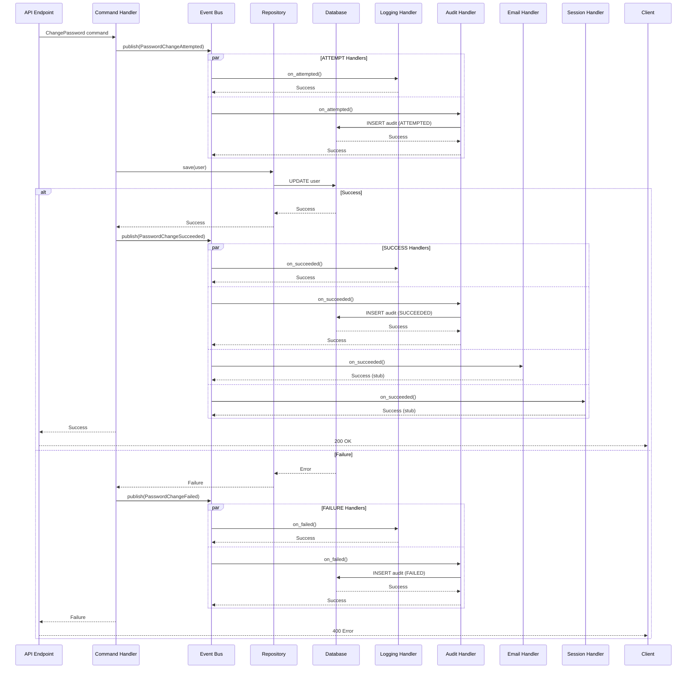
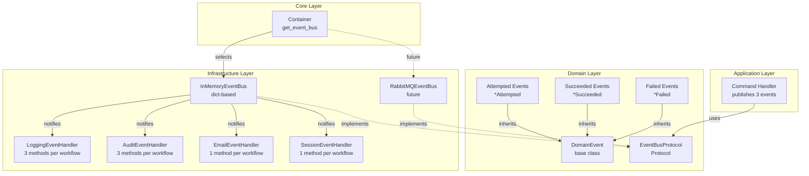

# Domain Events Architecture

## Overview

**Purpose**: Decouple side effects from business logic using full event-driven architecture with ATTEMPT → OUTCOME pattern for audit semantic accuracy.

**Problem**: When critical workflows occur (user registration, password changes, provider connections), we need:

1. **Audit trail compliance**: Record ATTEMPT before operation, SUCCESS/FAILURE after (PCI-DSS, SOC 2, GDPR)
2. **Technical observability**: Log all states for debugging
3. **Side effects coordination**: Email, session revocation, data sync (success only)

**Without domain events**: Business logic tightly coupled to all concerns:

```python
# ❌ TIGHTLY COUPLED - Handler does everything
async def change_password(cmd: ChangePassword):
    # Audit ATTEMPT
    await audit.record(PASSWORD_CHANGE_ATTEMPTED, ...)
    
    # Logging ATTEMPT
    logger.info("Password change attempted", ...)
    
    try:
        # Business logic
        user.password = hash_password(cmd.new_password)
        await repo.save(user)
        
        # Audit SUCCESS
        await audit.record(PASSWORD_CHANGED, ...)
        
        # Logging SUCCESS
        logger.info("Password changed", ...)
        
        # Email notification
        await email.send("password_changed", ...)
        
        # Session revocation
        await session.revoke_all(user.id)
        
    except Exception as e:
        # Audit FAILURE
        await audit.record(PASSWORD_CHANGE_FAILED, ...)
        
        # Logging FAILURE
        logger.warning("Password change failed", ...)
        
        raise

# Problems:
# 1. Handler does 8 different things (business + audit + logging + email + sessions)
# 2. Repeated 41 lines per handler × 17 workflows = 697 lines total
# 3. Hard to test (need to mock audit, logger, email, session)
# 4. Hard to extend (adding metrics requires changing all 17 handlers)
# 5. Fragile (if email fails, password change fails)
```

**With full event-driven architecture**: Business logic publishes events, handlers react:

```python
# ✅ DECOUPLED - Handler publishes events only
async def change_password(cmd: ChangePassword):
    # Event 1: ATTEMPT
    await event_bus.publish(PasswordChangeAttempted(
        event_id=uuid7(),
        occurred_at=datetime.now(UTC),
        user_id=cmd.user_id,
    ))
    
    try:
        # Business logic (pure)
        user.password = hash_password(cmd.new_password)
        await repo.save(user)
        
        # Event 2: SUCCESS
        await event_bus.publish(PasswordChangeSucceeded(
            event_id=uuid7(),
            occurred_at=datetime.now(UTC),
            user_id=user.id,
            initiated_by=cmd.initiated_by,
        ))
        
    except Exception as e:
        # Event 3: FAILURE
        await event_bus.publish(PasswordChangeFailed(
            event_id=uuid7(),
            occurred_at=datetime.now(UTC),
            user_id=cmd.user_id,
            reason=str(e),
        ))
        
        raise

# Handlers react (centralized):
# - AuditEventHandler.on_attempted() → audit.record(ATTEMPTED)
# - AuditEventHandler.on_succeeded() → audit.record(SUCCEEDED)
# - AuditEventHandler.on_failed() → audit.record(FAILED)
# - LoggingEventHandler.on_attempted() → logger.info()
# - LoggingEventHandler.on_succeeded() → logger.info()
# - LoggingEventHandler.on_failed() → logger.warning()
# - EmailEventHandler.on_succeeded() → email.send() (success only)
# - SessionEventHandler.on_succeeded() → session.revoke() (success only)

# Benefits:
# 1. Handler does 1 thing (business logic + publish events)
# 2. 20 lines per handler × 17 workflows = 340 lines total (49% reduction)
# 3. Easy to test (mock event bus, verify events published)
# 4. Easy to extend (add MetricsEventHandler without touching handlers)
# 5. Fail-open (if email fails, password change still succeeds)
```

---

## Design Decisions

### Decision 1: Full Event-Driven (3 Events per Workflow)

**Context**: Need to support audit semantic accuracy (ATTEMPT → OUTCOME) while keeping handlers clean.

**Options Considered**:

1. **Hybrid approach**: Direct audit/logging calls + SUCCESS events only
   - ❌ 41 lines per handler × 17 = 697 lines of duplication
   - ❌ Mixed concerns (direct calls + events)
   - ❌ Hard to test

2. **Decorator/middleware**: Auto-inject audit/logging
   - ❌ Magic (hidden behavior)
   - ❌ Complex (middleware pipeline)
   - ❌ Hard to read

3. **Full event-driven**: 3 events per workflow (ATTEMPTED, SUCCEEDED, FAILED)
   - ✅ **Explicit** (code shows exactly what happens)
   - ✅ **Consistent** (all concerns handled via events)
   - ✅ **Centralized** (side effects in event handlers)
   - ✅ **Scales** (17 workflows × 3 = 51 events, manageable)

**Decision**: Full event-driven architecture (Option 3)

**Rationale**:

1. **Clarity over cleverness**: Explicit event publishing beats hidden decorators
2. **Scales better**: 51 events with good naming > 697 lines of duplication
3. **Event-first mindset**: Already doing event-driven, go all in
4. **Compliance built-in**: ATTEMPT → OUTCOME pattern naturally fits 3 events
5. **Testability**: Mock event bus, verify 3 events published (simple)

### Decision 2: In-Memory Event Bus vs External Broker

**Context**: Need event bus to dispatch events to handlers.

**Decision**: Start with **in-memory** (MVP), use **Protocol abstraction** for future external brokers.

**Implementation**: Protocol-based abstraction allows swapping implementations:

```python
# Domain defines protocol (port)
class EventBusProtocol(Protocol):
    async def publish(self, event: DomainEvent) -> None: ...
    def subscribe(self, event_type: type, handler: Callable) -> None: ...

# Infrastructure implements adapters
class InMemoryEventBus:  # MVP (current)
    async def publish(self, event: DomainEvent) -> None:
        # In-process dispatch (zero latency)
        ...

class RabbitMQEventBus:  # Future (horizontal scaling)
    async def publish(self, event: DomainEvent) -> None:
        # Publish to message broker (distributed)
        ...

# Container selects implementation (Composition Root)
def get_event_bus() -> EventBusProtocol:
    if settings.EVENT_BUS_TYPE == "in-memory":
        return InMemoryEventBus()
    elif settings.EVENT_BUS_TYPE == "rabbitmq":
        return RabbitMQEventBus(url=settings.RABBITMQ_URL)
```

**Environment Configuration**:

```bash
# All environments start with in-memory
EVENT_BUS_TYPE=in-memory  # dev, test, ci, production (MVP)

# Future: upgrade to RabbitMQ when scaling
EVENT_BUS_TYPE=rabbitmq  # production (horizontal scaling)
```

**Migration Path** (zero code changes):

1. **Phase 1 (MVP)**: In-memory (we are here)
2. **Phase 2 (Scale)**: RabbitMQ (when traffic > 1000 req/sec)
3. **Phase 3 (Massive)**: Kafka (when traffic > 10,000 req/sec)

**Benefits**:

- ✅ Start simple (MVP ships fast)
- ✅ Upgrade when needed (config change only)
- ✅ Zero refactoring (Protocol abstraction decouples)

### Decision 3: Pragmatic DDD (Events for Critical Workflows Only)

**Context**: Not every operation needs domain events. Events add complexity.

**Decision**: Emit events **ONLY for critical workflows** (17 workflows identified).

**Rule**: If operation has **3+ side effects** OR **requires ATTEMPT → OUTCOME audit**, emit events.

**Critical workflows** (17 total):

**Phase 1: Authentication & Authorization** (7 workflows):

1. UserRegistered (attempted → succeeded/failed)
2. UserPasswordChanged (attempted → succeeded/failed)
3. UserEmailVerified (attempted → succeeded/failed)
4. UserPasswordReset (attempted → succeeded/failed)
5. UserLoginSuccess (attempted → succeeded/failed)
6. UserLogout (attempted → succeeded/failed)
7. SessionRevoked (attempted → succeeded/failed)

**Phase 2: Provider Integration** (4 workflows):

8. ProviderConnected (attempted → succeeded/failed)
9. ProviderDisconnected (attempted → succeeded/failed)
10. TokenRefreshFailed (attempted → succeeded/failed)
11. TokenRotated (attempted → succeeded/failed)

**Phase 3: Data Operations** (3 workflows):

12. AccountDataSynced (attempted → succeeded/failed)
13. TransactionCreated (attempted → succeeded/failed)
14. TransactionUpdated (attempted → succeeded/failed)

**Phase 4: Administrative** (3 workflows):

15. AdminUserCreated (attempted → succeeded/failed)
16. AdminUserDeleted (attempted → succeeded/failed)
17. AdminConfigChanged (attempted → succeeded/failed)

**Total**: 17 workflows × 3 events = **51 domain events** (planned)

**Current Implementation Status**:

- ~60 events defined across 5 event modules
- 27 handler subscriptions wired in container
- Remaining events defined for future use (see F6.16)

**Non-critical workflows** (NO events):

- User viewed account → No side effects, simple read
- User viewed transactions → No side effects, simple read
- User updated preference → Single database update, no side effects
- Admin viewed audit logs → No side effects, simple query

### Decision 4: Fail-Open Behavior

**Context**: If one event handler fails, should other handlers still execute?

**Decision**: **Fail-open** (continue executing other handlers even if one fails)

**Implementation**:

```python
async def publish(self, event: DomainEvent) -> None:
    for handler in self._handlers.get(type(event), []):
        try:
            await handler(event)
        except Exception as e:
            # Log error but continue to next handler
            logger.error(
                "Event handler failed",
                handler=handler.__name__,
                event_type=event.__class__.__name__,
                event_id=str(event.event_id),
                error=str(e),
            )
            # Continue to next handler (fail-open)
```

**Example**: PasswordChangeSucceeded event published

1. LoggingEventHandler executes → ✅ Success
2. AuditEventHandler executes → ❌ Failure (database timeout)
3. EmailEventHandler executes → ✅ Success (email sent)
4. SessionEventHandler executes → ✅ Success (sessions revoked)

**Result**: Audit failed BUT password changed, user got email, sessions revoked.

**Rationale**: Business continuity > perfect audit trail. If audit fails, we:

1. Log error with trace_id
2. Ops team fixes audit database
3. Retry audit from application logs (if needed)

### Decision 5: Event Naming Convention

**Decision**: All events use **past tense** (describes fact, not intent)

**Pattern**: `<Entity><Action><State>`

**Examples**:

- ✅ `UserPasswordChangeAttempted` (past tense - attempted)
- ✅ `UserPasswordChangeSucceeded` (past tense - succeeded)
- ✅ `UserPasswordChangeFailed` (past tense - failed)

- ❌ `ChangeUserPassword` (wrong - imperative, this is a command)
- ❌ `PasswordChangeAttempt` (wrong - noun, not clear state)

**Event vs Command**:

| Concept | Type    | Tense      | Example                   | Purpose             |
|---------|---------|------------|---------------------------|---------------------|
| Command | Request | Imperative | `ChangePassword`          | Trigger operation   |
| Event   | Fact    | Past       | `PasswordChangeAttempted` | Notify state change |

### Decision 6: Operational Events (Non-Workflow)

**Context**: Some events are needed for observability, security monitoring, or telemetry but don't represent critical workflows requiring the 3-state ATTEMPT → OUTCOME pattern.

**Decision**: Support **Operational Events** that:

- Do NOT follow 3-state pattern (single event, not attempted/succeeded/failed)
- Are used for telemetry, monitoring, security tracking
- Have lightweight handlers (logging, metrics, cache updates)
- Do NOT trigger audit records (unless security-relevant)

**Operational Event Categories**:

1. **Activity Tracking**: High-frequency events for monitoring
   - `SessionActivityUpdatedEvent` - Track session activity timestamps
   - `ProviderSyncProgressEvent` - Track sync progress

2. **Security Monitoring**: Events for anomaly detection
   - `SuspiciousSessionActivityEvent` - Flag suspicious patterns
   - `SessionLimitExceededEvent` - Track limit enforcement
   - `IPAddressChangedEvent` - Track IP changes within session

3. **Resource Access Tracking**: Audit-relevant access events
   - `SessionProviderAccessEvent` - Track which providers accessed per session
   - `SensitiveDataAccessedEvent` - Track PII/financial data access

**Naming Convention**: `<Entity><What>Event` (single past-tense fact)

- ✅ `SessionActivityUpdatedEvent` (activity was updated)
- ✅ `SessionProviderAccessEvent` (provider was accessed)
- ✅ `SuspiciousSessionActivityEvent` (suspicious activity detected)
- ❌ `UpdateSessionActivity` (imperative - this is a command)

**Implementation Pattern**:

```python
# Operational event - single state, no 3-state pattern
@dataclass(frozen=True, kw_only=True, slots=True)
class SessionActivityUpdatedEvent(DomainEvent):
    """Emitted when session activity is updated.

    Operational event for telemetry (not a workflow).
    Handlers should be lightweight (<10ms).
    """
    session_id: UUID
    user_id: UUID
    ip_address: str | None = None
    ip_changed: bool = False
```

**When to Use Operational Events** (vs Workflow Events):

| Criteria | Workflow Event (3-state) | Operational Event (single) |
|----------|--------------------------|----------------------------|
| Business operation | ✅ Yes | ❌ No |
| Requires audit trail | ✅ Yes (compliance) | ⚠️ Maybe (security only) |
| Has multiple side effects | ✅ Yes (3+) | ❌ No (1-2) |
| Can fail with user impact | ✅ Yes | ❌ No |
| High frequency | ❌ Usually no | ✅ Often yes |
| Examples | Login, Password Change | Activity tracking, Metrics |

**Handler Requirements for Operational Events**:

- **Lightweight**: Complete in <10ms (no database writes in critical path)
- **Fail-silent**: Failures logged but never block business flow
- **Async-safe**: Can be fire-and-forget
- **No audit**: Unless explicitly security-relevant

**Example: Session Management Operational Events**:

```python
# Session module operational events
SessionActivityUpdatedEvent      # High-frequency activity tracking
SessionProviderAccessEvent       # Provider access per session (audit)
SuspiciousSessionActivityEvent   # Security anomaly detection
SessionLimitExceededEvent        # Informational (limit enforcement)
```

**Why Not 3-State for These?**

1. **No business operation to fail**: Activity update is observation, not operation
2. **No user-facing outcome**: User doesn't care if activity tracking fails
3. **High frequency**: 3-state would triple event volume unnecessarily
4. **No audit requirement**: Compliance doesn't require ATTEMPT for observations

---

## Architecture Diagram

### Event Flow (Sequence)



### Component Architecture (Hexagonal)



---

## Domain Layer (Ports)

### 3.1 EventBusProtocol

**File**: `src/domain/protocols/event_bus_protocol.py`

```python
"""Event bus protocol for publishing domain events.

This protocol defines the interface for publishing and subscribing to
domain events. Implementations can be in-memory (MVP), RabbitMQ (scale),
or Kafka (massive scale) without changing business logic.
"""
from typing import Protocol, Callable
from src.domain.events.base_event import DomainEvent


class EventBusProtocol(Protocol):
    """Event bus for domain events (Protocol for hexagonal architecture).
    
    Implementations:
    - InMemoryEventBus: Simple dict-based (MVP, testing)
    - RabbitMQEventBus: Distributed message broker (production scale)
    - KafkaEventBus: High-throughput event streaming (massive scale)
    
    Usage:
        # Publish events (command handler)
        await event_bus.publish(PasswordChangeAttempted(...))
        await event_bus.publish(PasswordChangeSucceeded(...))
        
        # Subscribe handlers (infrastructure)
        event_bus.subscribe(PasswordChangeAttempted, logging.on_attempted)
        event_bus.subscribe(PasswordChangeSucceeded, logging.on_succeeded)
    """
    
    async def publish(self, event: DomainEvent) -> None:
        """Publish domain event to all subscribed handlers.
        
        Args:
            event: Domain event to publish (immutable dataclass).
            
        Note:
            - Handlers execute with fail-open behavior (one failure doesn't break others)
            - In-memory: Synchronous dispatch within same process
            - RabbitMQ/Kafka: Asynchronous dispatch via message broker
        """
        ...
    
    def subscribe(self, event_type: type, handler: Callable[[DomainEvent], None]) -> None:
        """Subscribe handler to event type.
        
        Args:
            event_type: Type of event to subscribe to (e.g., PasswordChangeAttempted).
            handler: Async callable that receives event.
            
        Note:
            - Handlers wired on application startup (container)
            - Multiple handlers can subscribe to same event type
            - Handler failures logged but don't break other handlers
        """
        ...
```

### 3.2 DomainEvent Base Class

**File**: `src/domain/events/base_event.py`

```python
"""Base domain event (immutable, past tense).

All domain events inherit from DomainEvent and follow these rules:
1. Past tense naming (*Attempted, *Succeeded, *Failed)
2. Immutable (frozen dataclass)
3. Include event_id (UUID) and occurred_at (datetime)
4. Describe WHAT happened, not WHY or WHAT TO DO
"""
from dataclasses import dataclass
from datetime import datetime
from uuid import UUID


@dataclass(frozen=True, slots=True, kw_only=True)
class DomainEvent:
    """Base class for all domain events.
    
    Attributes:
        event_id: Unique identifier for this event (for idempotency, tracing).
        occurred_at: When event occurred (UTC, set by publisher).
    
    Example:
        @dataclass(frozen=True, kw_only=True)
        class PasswordChangeAttempted(DomainEvent):
            user_id: UUID
    
    Note:
        - Events are IMMUTABLE (frozen=True)
        - Events use PAST TENSE naming (what happened)
        - Events are FACTS (cannot be canceled or modified)
    """
    event_id: UUID
    occurred_at: datetime
```

### 3.3 Critical Events (MVP - Phase 1)

**File**: `src/domain/events/authentication_events.py`

```python
"""Authentication domain events (Phase 1 - MVP).

Pattern: 3 events per workflow (ATTEMPTED → SUCCEEDED/FAILED)
- *Attempted: User initiated action (before business logic)
- *Succeeded: Operation completed successfully (after business commit)
- *Failed: Operation failed (after business rollback)

Handlers:
- LoggingEventHandler: ALL 3 events
- AuditEventHandler: ALL 3 events
- EmailEventHandler: SUCCEEDED only
- SessionEventHandler: SUCCEEDED only
"""
from dataclasses import dataclass
from uuid import UUID
from src.domain.events.base_event import DomainEvent


# ═══════════════════════════════════════════════════════════════
# User Registration (Workflow 1)
# ═══════════════════════════════════════════════════════════════

@dataclass(frozen=True, kw_only=True)
class UserRegistrationAttempted(DomainEvent):
    """User registration attempt initiated.
    
    Triggers:
    - LoggingEventHandler: Log attempt
    - AuditEventHandler: Record USER_REGISTRATION_ATTEMPTED
    
    Attributes:
        email: Email address attempted.
    """
    email: str


@dataclass(frozen=True, kw_only=True)
class UserRegistrationSucceeded(DomainEvent):
    """User registration completed successfully.
    
    Triggers:
    - LoggingEventHandler: Log success
    - AuditEventHandler: Record USER_REGISTERED
    - EmailEventHandler: Send verification email
    
    Attributes:
        user_id: ID of newly registered user.
        email: User's email address.
    """
    user_id: UUID
    email: str


@dataclass(frozen=True, kw_only=True)
class UserRegistrationFailed(DomainEvent):
    """User registration failed.
    
    Triggers:
    - LoggingEventHandler: Log failure
    - AuditEventHandler: Record USER_REGISTRATION_FAILED
    
    Attributes:
        email: Email address attempted.
        reason: Failure reason (e.g., "duplicate_email", "invalid_email").
    """
    email: str
    reason: str


# ═══════════════════════════════════════════════════════════════
# Password Change (Workflow 2)
# ═══════════════════════════════════════════════════════════════

@dataclass(frozen=True, kw_only=True)
class UserPasswordChangeAttempted(DomainEvent):
    """User password change attempt initiated.
    
    Triggers:
    - LoggingEventHandler: Log attempt
    - AuditEventHandler: Record USER_PASSWORD_CHANGE_ATTEMPTED
    
    Attributes:
        user_id: ID of user attempting password change.
    """
    user_id: UUID


@dataclass(frozen=True, kw_only=True)
class UserPasswordChangeSucceeded(DomainEvent):
    """User password change completed successfully.
    
    Triggers:
    - LoggingEventHandler: Log success
    - AuditEventHandler: Record USER_PASSWORD_CHANGED
    - EmailEventHandler: Send password changed notification
    - SessionEventHandler: Revoke all sessions (force re-login)
    
    Attributes:
        user_id: ID of user whose password changed.
        initiated_by: Who initiated change ("user" or "admin").
    """
    user_id: UUID
    initiated_by: str


@dataclass(frozen=True, kw_only=True)
class UserPasswordChangeFailed(DomainEvent):
    """User password change failed.
    
    Triggers:
    - LoggingEventHandler: Log failure
    - AuditEventHandler: Record USER_PASSWORD_CHANGE_FAILED
    
    Attributes:
        user_id: ID of user attempting password change.
        reason: Failure reason (e.g., "user_not_found", "invalid_password").
    """
    user_id: UUID
    reason: str


# ═══════════════════════════════════════════════════════════════
# Provider Connection (Workflow 3) - Placeholder for Phase 2
# ═══════════════════════════════════════════════════════════════

@dataclass(frozen=True, kw_only=True)
class ProviderConnectionAttempted(DomainEvent):
    """Provider connection attempt initiated (OAuth flow started)."""
    user_id: UUID
    provider_name: str


@dataclass(frozen=True, kw_only=True)
class ProviderConnectionSucceeded(DomainEvent):
    """Provider connected successfully (OAuth completed, tokens saved)."""
    user_id: UUID
    provider_id: UUID
    provider_name: str


@dataclass(frozen=True, kw_only=True)
class ProviderConnectionFailed(DomainEvent):
    """Provider connection failed (OAuth failed, API error)."""
    user_id: UUID
    provider_name: str
    reason: str


# ═══════════════════════════════════════════════════════════════
# Token Refresh (Workflow 4) - Placeholder for Phase 2
# ═══════════════════════════════════════════════════════════════

@dataclass(frozen=True, kw_only=True)
class TokenRefreshAttempted(DomainEvent):
    """Token refresh attempt initiated."""
    user_id: UUID
    provider_id: UUID
    provider_name: str


@dataclass(frozen=True, kw_only=True)
class TokenRefreshSucceeded(DomainEvent):
    """Token refresh completed successfully."""
    user_id: UUID
    provider_id: UUID
    provider_name: str


@dataclass(frozen=True, kw_only=True)
class TokenRefreshFailed(DomainEvent):
    """Token refresh failed (user action required - reconnect provider)."""
    user_id: UUID
    provider_id: UUID
    provider_name: str
    error_code: str
```

**Note**: Phase 2-4 events (workflows 5-17) will be added in `provider_events.py`, `data_events.py`, `admin_events.py` as those features are implemented.

---

## Infrastructure Layer (Adapters)

### 4.1 InMemoryEventBus (MVP Implementation)

**File**: `src/infrastructure/events/in_memory_event_bus.py`

```python
"""In-memory event bus (simple dict-based implementation).

Use for:
- MVP / single-instance deployment
- All testing (fast, reliable, no external dependencies)
- Local development

Upgrade to RabbitMQ/Kafka when:
- Horizontal scaling required (> 1 instance)
- Event replay required (regulatory compliance)
- > 1000 requests/second
"""
from collections import defaultdict
from typing import Callable
from src.domain.events.base_event import DomainEvent
from src.domain.protocols.logger_protocol import LoggerProtocol


class InMemoryEventBus:
    """In-memory event bus with fail-open behavior.
    
    Implementation:
    - Dict-based handler registry (event_type -> list of handlers)
    - Synchronous dispatch (handlers execute in same process)
    - Fail-open behavior (one handler failure doesn't break others)
    
    Performance:
    - Zero latency (no network calls)
    - No serialization overhead (events stay as Python objects)
    - Handles ~10,000 events/second on single core
    
    Limitations:
    - Single process only (won't work with horizontal scaling)
    - Events lost on process restart (not durable)
    - No event replay (fire-and-forget)
    
    Usage:
        event_bus = InMemoryEventBus(logger)
        event_bus.subscribe(PasswordChangeAttempted, handler.on_attempted)
        await event_bus.publish(PasswordChangeAttempted(...))
    """
    
    def __init__(self, logger: LoggerProtocol):
        """Initialize event bus.
        
        Args:
            logger: Structured logger for error logging.
        """
        self.logger = logger
        self._handlers: dict[type, list[Callable]] = defaultdict(list)
    
    def subscribe(self, event_type: type, handler: Callable[[DomainEvent], None]) -> None:
        """Subscribe handler to event type.
        
        Args:
            event_type: Event class to subscribe to.
            handler: Async callable that receives event.
            
        Example:
            event_bus.subscribe(
                PasswordChangeAttempted,
                logging_handler.on_attempted
            )
        """
        self._handlers[event_type].append(handler)
        self.logger.debug(
            "Event handler subscribed",
            event_type=event_type.__name__,
            handler=handler.__name__,
        )
    
    async def publish(self, event: DomainEvent) -> None:
        """Publish event to all subscribed handlers (fail-open).
        
        Args:
            event: Domain event to publish.
            
        Note:
            - Handlers execute sequentially (await each handler)
            - If handler fails, log error and continue to next handler
            - All handlers get chance to execute even if one fails
        """
        event_type = type(event)
        handlers = self._handlers.get(event_type, [])
        
        if not handlers:
            self.logger.debug(
                "No handlers for event",
                event_type=event_type.__name__,
                event_id=str(event.event_id),
            )
            return
        
        self.logger.debug(
            "Publishing event",
            event_type=event_type.__name__,
            event_id=str(event.event_id),
            handler_count=len(handlers),
        )
        
        # Execute all handlers (fail-open)
        for handler in handlers:
            try:
                await handler(event)
            except Exception as e:
                # Log error but continue to next handler
                self.logger.error(
                    "Event handler failed",
                    event_type=event_type.__name__,
                    event_id=str(event.event_id),
                    handler=handler.__name__,
                    error=str(e),
                )
                # Continue to next handler (fail-open)
```

### 4.2 Event Handlers

#### LoggingEventHandler

**File**: `src/infrastructure/logging/event_handlers/logging_event_handler.py`

```python
"""Logging event handler (structured logging for all events).

Subscribes to ALL events (ATTEMPTED, SUCCEEDED, FAILED) and logs structured
data with trace_id correlation for CloudWatch Insights queries.

Pattern:
- *Attempted events → logger.info()
- *Succeeded events → logger.info()
- *Failed events → logger.warning()
"""
from src.domain.events.auth_events import (
    UserRegistrationAttempted,
    UserRegistrationSucceeded,
    UserRegistrationFailed,
    UserPasswordChangeAttempted,
    UserPasswordChangeSucceeded,
    UserPasswordChangeFailed,
    ProviderConnectionAttempted,
    ProviderConnectionSucceeded,
    ProviderConnectionFailed,
    TokenRefreshAttempted,
    TokenRefreshSucceeded,
    TokenRefreshFailed,
)
from src.domain.protocols.logger_protocol import LoggerProtocol


class LoggingEventHandler:
    """Event handler for structured logging.
    
    Subscribes to all events and logs structured data for observability.
    """
    
    def __init__(self, logger: LoggerProtocol):
        """Initialize handler.
        
        Args:
            logger: Structured logger (injected from container).
        """
        self.logger = logger
    
    # ═══════════════════════════════════════════════════════════════
    # User Registration (Workflow 1)
    # ═══════════════════════════════════════════════════════════════
    
    async def on_registration_attempted(self, event: UserRegistrationAttempted) -> None:
        """Log user registration attempt."""
        self.logger.info(
            "User registration attempted",
            email=event.email,
            event_id=str(event.event_id),
            occurred_at=event.occurred_at.isoformat(),
        )
    
    async def on_registration_succeeded(self, event: UserRegistrationSucceeded) -> None:
        """Log user registration success."""
        self.logger.info(
            "User registration succeeded",
            user_id=str(event.user_id),
            email=event.email,
            event_id=str(event.event_id),
            occurred_at=event.occurred_at.isoformat(),
        )
    
    async def on_registration_failed(self, event: UserRegistrationFailed) -> None:
        """Log user registration failure."""
        self.logger.warning(
            "User registration failed",
            email=event.email,
            reason=event.reason,
            event_id=str(event.event_id),
            occurred_at=event.occurred_at.isoformat(),
        )
    
    # ═══════════════════════════════════════════════════════════════
    # Password Change (Workflow 2)
    # ═══════════════════════════════════════════════════════════════
    
    async def on_password_change_attempted(self, event: UserPasswordChangeAttempted) -> None:
        """Log password change attempt."""
        self.logger.info(
            "User password change attempted",
            user_id=str(event.user_id),
            event_id=str(event.event_id),
            occurred_at=event.occurred_at.isoformat(),
        )
    
    async def on_password_change_succeeded(self, event: UserPasswordChangeSucceeded) -> None:
        """Log password change success."""
        self.logger.info(
            "User password change succeeded",
            user_id=str(event.user_id),
            initiated_by=event.initiated_by,
            event_id=str(event.event_id),
            occurred_at=event.occurred_at.isoformat(),
        )
    
    async def on_password_change_failed(self, event: UserPasswordChangeFailed) -> None:
        """Log password change failure."""
        self.logger.warning(
            "User password change failed",
            user_id=str(event.user_id),
            reason=event.reason,
            event_id=str(event.event_id),
            occurred_at=event.occurred_at.isoformat(),
        )
    
    # ═══════════════════════════════════════════════════════════════
    # Provider Connection (Workflow 3) - Placeholder
    # ═══════════════════════════════════════════════════════════════
    
    async def on_provider_connection_attempted(self, event: ProviderConnectionAttempted) -> None:
        """Log provider connection attempt."""
        self.logger.info(
            "Provider connection attempted",
            user_id=str(event.user_id),
            provider_name=event.provider_name,
            event_id=str(event.event_id),
        )
    
    async def on_provider_connection_succeeded(self, event: ProviderConnectionSucceeded) -> None:
        """Log provider connection success."""
        self.logger.info(
            "Provider connection succeeded",
            user_id=str(event.user_id),
            provider_id=str(event.provider_id),
            provider_name=event.provider_name,
            event_id=str(event.event_id),
        )
    
    async def on_provider_connection_failed(self, event: ProviderConnectionFailed) -> None:
        """Log provider connection failure."""
        self.logger.warning(
            "Provider connection failed",
            user_id=str(event.user_id),
            provider_name=event.provider_name,
            reason=event.reason,
            event_id=str(event.event_id),
        )
    
    # ═══════════════════════════════════════════════════════════════
    # Token Refresh (Workflow 4) - Placeholder
    # ═══════════════════════════════════════════════════════════════
    
    async def on_token_refresh_attempted(self, event: TokenRefreshAttempted) -> None:
        """Log token refresh attempt."""
        self.logger.info(
            "Token refresh attempted",
            user_id=str(event.user_id),
            provider_name=event.provider_name,
            event_id=str(event.event_id),
        )
    
    async def on_token_refresh_succeeded(self, event: TokenRefreshSucceeded) -> None:
        """Log token refresh success."""
        self.logger.info(
            "Token refresh succeeded",
            user_id=str(event.user_id),
            provider_name=event.provider_name,
            event_id=str(event.event_id),
        )
    
    async def on_token_refresh_failed(self, event: TokenRefreshFailed) -> None:
        """Log token refresh failure."""
        self.logger.warning(
            "Token refresh failed",
            user_id=str(event.user_id),
            provider_name=event.provider_name,
            error_code=event.error_code,
            event_id=str(event.event_id),
        )
```

#### AuditEventHandler

**File**: `src/infrastructure/audit/event_handlers/audit_event_handler.py`

```python
"""Audit event handler (compliance trail for all events).

Subscribes to ALL events (ATTEMPTED, SUCCEEDED, FAILED) and records immutable
audit entries. Maps domain events to AuditAction enums following semantic accuracy.

Pattern:
- *Attempted events → AuditAction.*_ATTEMPTED
- *Succeeded events → AuditAction.* (outcome without suffix)
- *Failed events → AuditAction.*_FAILED
"""
from src.domain.events.auth_events import (
    UserRegistrationAttempted,
    UserRegistrationSucceeded,
    UserRegistrationFailed,
    UserPasswordChangeAttempted,
    UserPasswordChangeSucceeded,
    UserPasswordChangeFailed,
    ProviderConnectionAttempted,
    ProviderConnectionSucceeded,
    ProviderConnectionFailed,
    TokenRefreshAttempted,
    TokenRefreshSucceeded,
    TokenRefreshFailed,
)
from src.domain.protocols.audit_protocol import AuditProtocol
from src.domain.enums.audit_action import AuditAction


class AuditEventHandler:
    """Event handler for audit trail (PCI-DSS, SOC 2, GDPR compliance).
    
    Subscribes to all events and records immutable audit entries.
    """
    
    def __init__(self, audit: AuditProtocol):
        """Initialize handler.
        
        Args:
            audit: Audit service (injected from container).
        """
        self.audit = audit
    
    # ═══════════════════════════════════════════════════════════════
    # User Registration (Workflow 1)
    # ═══════════════════════════════════════════════════════════════
    
    async def on_registration_attempted(self, event: UserRegistrationAttempted) -> None:
        """Record user registration attempt in audit trail."""
        await self.audit.record(
            action=AuditAction.USER_REGISTRATION_ATTEMPTED,
            user_id=None,  # Don't have user_id yet
            resource_type="user",
            metadata={
                "event_id": str(event.event_id),
                "email": event.email,
            },
        )
    
    async def on_registration_succeeded(self, event: UserRegistrationSucceeded) -> None:
        """Record user registration success in audit trail."""
        await self.audit.record(
            action=AuditAction.USER_REGISTERED,
            user_id=event.user_id,
            resource_type="user",
            resource_id=event.user_id,
            metadata={
                "event_id": str(event.event_id),
                "email": event.email,
            },
        )
    
    async def on_registration_failed(self, event: UserRegistrationFailed) -> None:
        """Record user registration failure in audit trail."""
        await self.audit.record(
            action=AuditAction.USER_REGISTRATION_FAILED,
            user_id=None,
            resource_type="user",
            metadata={
                "event_id": str(event.event_id),
                "email": event.email,
                "reason": event.reason,
            },
        )
    
    # ═══════════════════════════════════════════════════════════════
    # Password Change (Workflow 2)
    # ═══════════════════════════════════════════════════════════════
    
    async def on_password_change_attempted(self, event: UserPasswordChangeAttempted) -> None:
        """Record password change attempt in audit trail."""
        await self.audit.record(
            action=AuditAction.USER_PASSWORD_CHANGE_ATTEMPTED,
            user_id=event.user_id,
            resource_type="user",
            resource_id=event.user_id,
            metadata={"event_id": str(event.event_id)},
        )
    
    async def on_password_change_succeeded(self, event: UserPasswordChangeSucceeded) -> None:
        """Record password change success in audit trail."""
        await self.audit.record(
            action=AuditAction.USER_PASSWORD_CHANGED,
            user_id=event.user_id,
            resource_type="user",
            resource_id=event.user_id,
            metadata={
                "event_id": str(event.event_id),
                "initiated_by": event.initiated_by,
            },
        )
    
    async def on_password_change_failed(self, event: UserPasswordChangeFailed) -> None:
        """Record password change failure in audit trail."""
        await self.audit.record(
            action=AuditAction.USER_PASSWORD_CHANGE_FAILED,
            user_id=event.user_id,
            resource_type="user",
            resource_id=event.user_id,
            metadata={
                "event_id": str(event.event_id),
                "reason": event.reason,
            },
        )
    
    # ═══════════════════════════════════════════════════════════════
    # Provider Connection (Workflow 3) - Placeholder
    # ═══════════════════════════════════════════════════════════════
    
    async def on_provider_connection_attempted(self, event: ProviderConnectionAttempted) -> None:
        """Record provider connection attempt in audit trail."""
        await self.audit.record(
            action=AuditAction.PROVIDER_CONNECTION_ATTEMPTED,
            user_id=event.user_id,
            resource_type="provider",
            metadata={
                "event_id": str(event.event_id),
                "provider_name": event.provider_name,
            },
        )
    
    async def on_provider_connection_succeeded(self, event: ProviderConnectionSucceeded) -> None:
        """Record provider connection success in audit trail."""
        await self.audit.record(
            action=AuditAction.PROVIDER_CONNECTED,
            user_id=event.user_id,
            resource_type="provider",
            resource_id=event.provider_id,
            metadata={
                "event_id": str(event.event_id),
                "provider_name": event.provider_name,
            },
        )
    
    async def on_provider_connection_failed(self, event: ProviderConnectionFailed) -> None:
        """Record provider connection failure in audit trail."""
        await self.audit.record(
            action=AuditAction.PROVIDER_CONNECTION_FAILED,
            user_id=event.user_id,
            resource_type="provider",
            metadata={
                "event_id": str(event.event_id),
                "provider_name": event.provider_name,
                "reason": event.reason,
            },
        )
    
    # ═══════════════════════════════════════════════════════════════
    # Token Refresh (Workflow 4) - Placeholder
    # ═══════════════════════════════════════════════════════════════
    
    async def on_token_refresh_attempted(self, event: TokenRefreshAttempted) -> None:
        """Record token refresh attempt in audit trail."""
        await self.audit.record(
            action=AuditAction.PROVIDER_TOKEN_REFRESH_ATTEMPTED,
            user_id=event.user_id,
            resource_type="provider",
            resource_id=event.provider_id,
            metadata={
                "event_id": str(event.event_id),
                "provider_name": event.provider_name,
            },
        )
    
    async def on_token_refresh_succeeded(self, event: TokenRefreshSucceeded) -> None:
        """Record token refresh success in audit trail."""
        await self.audit.record(
            action=AuditAction.PROVIDER_TOKEN_REFRESHED,
            user_id=event.user_id,
            resource_type="provider",
            resource_id=event.provider_id,
            metadata={
                "event_id": str(event.event_id),
                "provider_name": event.provider_name,
            },
        )
    
    async def on_token_refresh_failed(self, event: TokenRefreshFailed) -> None:
        """Record token refresh failure in audit trail."""
        await self.audit.record(
            action=AuditAction.PROVIDER_TOKEN_REFRESH_FAILED,
            user_id=event.user_id,
            resource_type="provider",
            resource_id=event.provider_id,
            metadata={
                "event_id": str(event.event_id),
                "provider_name": event.provider_name,
                "error_code": event.error_code,
            },
        )
```

##### Session Lifecycle Management

**Problem**: AuditEventHandler creates database sessions inside event handlers, which causes "Event loop is closed" errors in integration tests when handlers are called during test teardown.

**Root Cause**: Event handlers creating async database sessions via `async with self._database.get_session()` violates async context lifecycle management - the session factory is invoked after the event loop context is closed.

**Solution**: Pass database session through event bus to handlers that need it.

**Architecture**:

```python
# EventBusProtocol updated to accept optional session
class EventBusProtocol(Protocol):
    async def publish(
        self,
        event: DomainEvent,
        session: AsyncSession | None = None,  # ← New parameter
    ) -> None:
        ...

# InMemoryEventBus stores session for handlers
class InMemoryEventBus:
    def __init__(self, logger: LoggerProtocol):
        self._session: AsyncSession | None = None  # Session storage
    
    async def publish(
        self,
        event: DomainEvent,
        session: AsyncSession | None = None,
    ) -> None:
        # Store session for handlers to access
        self._session = session
        
        try:
            # Execute handlers (handlers call get_session())
            ...
        finally:
            # Clear session after publish
            self._session = None
    
    def get_session(self) -> AsyncSession | None:
        """Get current session for event handlers."""
        return self._session

# AuditEventHandler uses session from event bus
class AuditEventHandler:
    def __init__(self, database: Database, event_bus: InMemoryEventBus):
        self._database = database  # Fallback
        self._event_bus = event_bus  # Preferred session source
    
    async def _create_audit_record(self, **kwargs):
        # Try event bus session first (proper lifecycle)
        session = self._event_bus.get_session()
        
        if session:
            # Use session from event bus (no new session created)
            audit = PostgresAuditAdapter(session=session)
            await audit.record(**kwargs)
        else:
            # Fallback: Create own session (backward compatibility)
            async with self._database.get_session() as session:
                audit = PostgresAuditAdapter(session=session)
                await audit.record(**kwargs)
```

**Usage** (in application layer):

```python
# Command handler publishes events with session
async def handle(self, cmd: RegisterUser) -> Result[UUID, Error]:
    async with self.database.get_session() as session:
        # Business logic
        user = User(...)
        await self.users.save(user)
        
        # Publish event with session
        await self.event_bus.publish(
            UserRegistrationSucceeded(user_id=user.id, email=user.email),
            session=session,  # ← Pass session to event handlers
        )
```

**Benefits**:

1. **Proper session lifecycle**: Session created in command handler, passed to event handlers
2. **No "Event loop is closed" errors**: Session lifecycle managed by caller, not handler
3. **Backward compatible**: Falls back to creating own session if none provided
4. **Aligns with F0.9.1**: Uses same separate audit session concept, just better injection

**Testing**:

```python
# Integration tests pass session to avoid lifecycle issues
async def test_event_creates_audit(test_database):
    event_bus = get_event_bus()
    
    async with test_database.get_session() as session:
        await event_bus.publish(
            UserRegistrationSucceeded(...),
            session=session,  # ← Tests provide session
        )
    
    # Verify audit record created
    ...
```

**Related**: See F0.9.1 (Separate Audit Session) for audit durability context and F0.9.3 (Audit Event Handler Session Lifecycle) in roadmap for complete implementation details.

---

#### EmailEventHandler (Stub)

**File**: `src/infrastructure/email/event_handlers/email_event_handler.py`

```python
"""Email event handler (stub for future email service integration).

Subscribes to SUCCEEDED events only (no emails for attempts or failures).
"""
from src.domain.events.auth_events import (
    UserRegistrationSucceeded,
    UserPasswordChangeSucceeded,
    ProviderConnectionSucceeded,
)
from src.domain.protocols.logger_protocol import LoggerProtocol


class EmailEventHandler:
    """Event handler for email notifications (stub).
    
    Future: Integrate with AWS SES, SendGrid, or Mailgun.
    For now, log emails that would be sent.
    """
    
    def __init__(self, logger: LoggerProtocol):
        """Initialize handler.
        
        Args:
            logger: Structured logger (injected from container).
        """
        self.logger = logger
    
    async def on_registration_succeeded(self, event: UserRegistrationSucceeded) -> None:
        """Send verification email (stub)."""
        self.logger.info(
            "Email would be sent",
            template="verification_email",
            recipient=event.email,
            user_id=str(event.user_id),
            event_id=str(event.event_id),
        )
    
    async def on_password_change_succeeded(self, event: UserPasswordChangeSucceeded) -> None:
        """Send password changed email (stub)."""
        self.logger.info(
            "Email would be sent",
            template="password_changed",
            user_id=str(event.user_id),
            event_id=str(event.event_id),
        )
    
    async def on_provider_connection_succeeded(self, event: ProviderConnectionSucceeded) -> None:
        """Send provider connected email (stub)."""
        self.logger.info(
            "Email would be sent",
            template="provider_connected",
            provider_name=event.provider_name,
            user_id=str(event.user_id),
            event_id=str(event.event_id),
        )
```

#### SessionEventHandler (Stub)

**File**: `src/infrastructure/session/event_handlers/session_event_handler.py`

```python
"""Session event handler (stub for future session revocation).

Subscribes to password change SUCCEEDED events only (revoke sessions on success).
"""
from src.domain.events.auth_events import UserPasswordChangeSucceeded
from src.domain.protocols.logger_protocol import LoggerProtocol


class SessionEventHandler:
    """Event handler for session management (stub).
    
    Future: Integrate with Redis token store to revoke sessions.
    For now, log sessions that would be revoked.
    """
    
    def __init__(self, logger: LoggerProtocol):
        """Initialize handler.
        
        Args:
            logger: Structured logger (injected from container).
        """
        self.logger = logger
    
    async def on_password_change_succeeded(self, event: UserPasswordChangeSucceeded) -> None:
        """Revoke all user sessions (stub)."""
        self.logger.info(
            "Sessions would be revoked",
            user_id=str(event.user_id),
            initiated_by=event.initiated_by,
            event_id=str(event.event_id),
        )
```

---

## Core Layer (Dependency Injection)

### 5.1 Container Integration

**File**: `src/core/container.py` (add to existing file)

```python
"""Centralized dependency injection container."""
from functools import lru_cache
from src.domain.protocols.event_bus_protocol import EventBusProtocol
from src.infrastructure.events.in_memory_event_bus import InMemoryEventBus

# Event handlers
from src.infrastructure.logging.event_handlers.logging_event_handler import LoggingEventHandler
from src.infrastructure.audit.event_handlers.audit_event_handler import AuditEventHandler
from src.infrastructure.email.event_handlers.email_event_handler import EmailEventHandler
from src.infrastructure.session.event_handlers.session_event_handler import SessionEventHandler

# Events
from src.domain.events.auth_events import (
    UserRegistrationAttempted,
    UserRegistrationSucceeded,
    UserRegistrationFailed,
    UserPasswordChangeAttempted,
    UserPasswordChangeSucceeded,
    UserPasswordChangeFailed,
    ProviderConnectionAttempted,
    ProviderConnectionSucceeded,
    ProviderConnectionFailed,
    TokenRefreshAttempted,
    TokenRefreshSucceeded,
    TokenRefreshFailed,
)


@lru_cache
def get_event_bus() -> EventBusProtocol:
    """Get event bus singleton (wired with all handlers).
    
    Returns:
        EventBusProtocol: Configured event bus with handlers subscribed.
        
    Implementation:
        - MVP: InMemoryEventBus (simple dict-based)
        - Future: RabbitMQEventBus (set EVENT_BUS_TYPE=rabbitmq)
        - Future: KafkaEventBus (set EVENT_BUS_TYPE=kafka)
        
    Handlers wired (4 handlers × 12 events = 48 subscriptions):
        - LoggingEventHandler: ALL events (12 methods)
        - AuditEventHandler: ALL events (12 methods)
        - EmailEventHandler: SUCCEEDED events only (3 methods)
        - SessionEventHandler: Password change SUCCEEDED only (1 method)
        
    Usage:
        # Inject into command handler
        def my_handler(event_bus: EventBusProtocol = Depends(get_event_bus)):
            await event_bus.publish(UserRegistrationAttempted(...))
    """
    # Create event bus (MVP: in-memory)
    event_bus = InMemoryEventBus(logger=get_logger())
    
    # Create handlers (inject dependencies)
    logging_handler = LoggingEventHandler(logger=get_logger())
    audit_handler = AuditEventHandler(audit=get_audit())
    email_handler = EmailEventHandler(logger=get_logger())
    session_handler = SessionEventHandler(logger=get_logger())
    
    # ═══════════════════════════════════════════════════════════════
    # Wire User Registration (Workflow 1)
    # ═══════════════════════════════════════════════════════════════
    
    # ATTEMPTED
    event_bus.subscribe(UserRegistrationAttempted, logging_handler.on_registration_attempted)
    event_bus.subscribe(UserRegistrationAttempted, audit_handler.on_registration_attempted)
    
    # SUCCEEDED
    event_bus.subscribe(UserRegistrationSucceeded, logging_handler.on_registration_succeeded)
    event_bus.subscribe(UserRegistrationSucceeded, audit_handler.on_registration_succeeded)
    event_bus.subscribe(UserRegistrationSucceeded, email_handler.on_registration_succeeded)
    
    # FAILED
    event_bus.subscribe(UserRegistrationFailed, logging_handler.on_registration_failed)
    event_bus.subscribe(UserRegistrationFailed, audit_handler.on_registration_failed)
    
    # ═══════════════════════════════════════════════════════════════
    # Wire Password Change (Workflow 2)
    # ═══════════════════════════════════════════════════════════════
    
    # ATTEMPTED
    event_bus.subscribe(UserPasswordChangeAttempted, logging_handler.on_password_change_attempted)
    event_bus.subscribe(UserPasswordChangeAttempted, audit_handler.on_password_change_attempted)
    
    # SUCCEEDED
    event_bus.subscribe(UserPasswordChangeSucceeded, logging_handler.on_password_change_succeeded)
    event_bus.subscribe(UserPasswordChangeSucceeded, audit_handler.on_password_change_succeeded)
    event_bus.subscribe(UserPasswordChangeSucceeded, email_handler.on_password_change_succeeded)
    event_bus.subscribe(UserPasswordChangeSucceeded, session_handler.on_password_change_succeeded)
    
    # FAILED
    event_bus.subscribe(UserPasswordChangeFailed, logging_handler.on_password_change_failed)
    event_bus.subscribe(UserPasswordChangeFailed, audit_handler.on_password_change_failed)
    
    # ═══════════════════════════════════════════════════════════════
    # Wire Provider Connection (Workflow 3) - Placeholder
    # ═══════════════════════════════════════════════════════════════
    
    # ATTEMPTED
    event_bus.subscribe(ProviderConnectionAttempted, logging_handler.on_provider_connection_attempted)
    event_bus.subscribe(ProviderConnectionAttempted, audit_handler.on_provider_connection_attempted)
    
    # SUCCEEDED
    event_bus.subscribe(ProviderConnectionSucceeded, logging_handler.on_provider_connection_succeeded)
    event_bus.subscribe(ProviderConnectionSucceeded, audit_handler.on_provider_connection_succeeded)
    event_bus.subscribe(ProviderConnectionSucceeded, email_handler.on_provider_connection_succeeded)
    
    # FAILED
    event_bus.subscribe(ProviderConnectionFailed, logging_handler.on_provider_connection_failed)
    event_bus.subscribe(ProviderConnectionFailed, audit_handler.on_provider_connection_failed)
    
    # ═══════════════════════════════════════════════════════════════
    # Wire Token Refresh (Workflow 4) - Placeholder
    # ═══════════════════════════════════════════════════════════════
    
    # ATTEMPTED
    event_bus.subscribe(TokenRefreshAttempted, logging_handler.on_token_refresh_attempted)
    event_bus.subscribe(TokenRefreshAttempted, audit_handler.on_token_refresh_attempted)
    
    # SUCCEEDED
    event_bus.subscribe(TokenRefreshSucceeded, logging_handler.on_token_refresh_succeeded)
    event_bus.subscribe(TokenRefreshSucceeded, audit_handler.on_token_refresh_succeeded)
    
    # FAILED
    event_bus.subscribe(TokenRefreshFailed, logging_handler.on_token_refresh_failed)
    event_bus.subscribe(TokenRefreshFailed, audit_handler.on_token_refresh_failed)
    
    return event_bus
```

---

## Application Layer (Usage Example)

### 6.1 Command Handler with Events

**File**: `src/application/commands/handlers/change_password_handler.py`

```python
"""Change password command handler (example of event-driven pattern)."""
from uuid_extensions import uuid7
from datetime import datetime, UTC
from src.application.commands.change_password import ChangePassword
from src.domain.protocols.user_repository import UserRepository
from src.domain.protocols.event_bus_protocol import EventBusProtocol
from src.domain.events.auth_events import (
    UserPasswordChangeAttempted,
    UserPasswordChangeSucceeded,
    UserPasswordChangeFailed,
)
from src.core.result import Result, Success, Failure
from src.core.errors import NotFoundError


class ChangePasswordHandler:
    """Change user password (event-driven pattern).
    
    Pattern:
    1. Publish *Attempted event (before business logic)
    2. Execute business logic
    3. Publish *Succeeded event (on success) OR *Failed event (on failure)
    
    Handlers automatically:
    - LoggingEventHandler: Logs all 3 states
    - AuditEventHandler: Records all 3 states in audit trail
    - EmailEventHandler: Sends email on success only
    - SessionEventHandler: Revokes sessions on success only
    """
    
    def __init__(
        self,
        user_repo: UserRepository,
        event_bus: EventBusProtocol,
    ):
        """Initialize handler.
        
        Args:
            user_repo: User repository (injected).
            event_bus: Event bus (injected).
        """
        self.user_repo = user_repo
        self.event_bus = event_bus
    
    async def handle(self, cmd: ChangePassword) -> Result[None, Error]:
        """Change user password.
        
        Args:
            cmd: Change password command.
            
        Returns:
            Result[None, Error]: Success or error.
        """
        # ═══════════════════════════════════════════════════════════
        # Event 1: ATTEMPTED
        # ═══════════════════════════════════════════════════════════
        await self.event_bus.publish(UserPasswordChangeAttempted(
            event_id=uuid7(),
            occurred_at=datetime.now(UTC),
            user_id=cmd.user_id,
        ))
        # → LoggingEventHandler.on_password_change_attempted()
        # → AuditEventHandler.on_password_change_attempted()
        
        
        # ═══════════════════════════════════════════════════════════
        # Business Logic
        # ═══════════════════════════════════════════════════════════
        
        # Fetch user
        result = await self.user_repo.find_by_id(cmd.user_id)
        
        match result:
            case Success(user):
                # Update password
                user.password = hash_password(cmd.new_password)
                
                # Save to database
                save_result = await self.user_repo.save(user)
                
                match save_result:
                    case Success(_):
                        # ═══════════════════════════════════════════
                        # Event 2: SUCCEEDED
                        # ═══════════════════════════════════════════
                        await self.event_bus.publish(UserPasswordChangeSucceeded(
                            event_id=uuid7(),
                            occurred_at=datetime.now(UTC),
                            user_id=user.id,
                            initiated_by=cmd.initiated_by,
                        ))
                        # → LoggingEventHandler.on_password_change_succeeded()
                        # → AuditEventHandler.on_password_change_succeeded()
                        # → EmailEventHandler.on_password_change_succeeded()
                        # → SessionEventHandler.on_password_change_succeeded()
                        
                        return Success(None)
                    
                    case Failure(error):
                        # ═══════════════════════════════════════════
                        # Event 3: FAILED (database error)
                        # ═══════════════════════════════════════════
                        await self.event_bus.publish(UserPasswordChangeFailed(
                            event_id=uuid7(),
                            occurred_at=datetime.now(UTC),
                            user_id=cmd.user_id,
                            reason=f"database_error: {error}",
                        ))
                        # → LoggingEventHandler.on_password_change_failed()
                        # → AuditEventHandler.on_password_change_failed()
                        
                        return Failure(error)
            
            case Failure(error):
                # ═══════════════════════════════════════════════════
                # Event 3: FAILED (user not found)
                # ═══════════════════════════════════════════════════
                await self.event_bus.publish(UserPasswordChangeFailed(
                    event_id=uuid7(),
                    occurred_at=datetime.now(UTC),
                    user_id=cmd.user_id,
                    reason="user_not_found",
                ))
                # → LoggingEventHandler.on_password_change_failed()
                # → AuditEventHandler.on_password_change_failed()
                
                return Failure(NotFoundError("User not found"))
```

---

## Testing Strategy

### 7.1 Unit Tests - Event Bus (20 tests)

**File**: `tests/unit/test_domain_events_event_bus.py`

**Test Categories**:

1. **Subscribe/Publish Basic Flow** (5 tests)
2. **Multiple Handlers** (5 tests)
3. **Fail-Open Behavior** (5 tests)
4. **Edge Cases** (5 tests)

### 7.2 Unit Tests - Events (45 tests)

**File**: `tests/unit/test_domain_events_authentication_events.py`

**Test Categories** (12 events × 3-4 tests each):

1. **Event Creation** (12 tests - one per event)
2. **Immutability** (12 tests - one per event)
3. **Required Fields** (12 tests - one per event)
4. **Type Validation** (9 tests - UUID, datetime types)

### 7.3 Unit Tests - Event Handlers (80 tests)

**File**: `tests/unit/test_infrastructure_event_handlers.py`

**Test Categories**:

1. **LoggingEventHandler** (24 tests - 12 events × 2 tests)
2. **AuditEventHandler** (24 tests - 12 events × 2 tests)
3. **EmailEventHandler** (6 tests - 3 events × 2 tests)
4. **SessionEventHandler** (2 tests - 1 event × 2 tests)
5. **Handler Isolation** (24 tests - verify mocking works)

### 7.4 Integration Tests - Event Flow (20 tests)

**File**: `tests/integration/test_domain_events_flow.py`

**Test Categories**:

1. **End-to-End Flow** (8 tests - 4 workflows × 2 paths)
2. **Handler Independence** (4 tests - fail-open behavior)
3. **Container Integration** (4 tests - singleton, wiring)
4. **Database Integration** (4 tests - real audit records)

**Total**: 165 tests

**Coverage Targets**:

- Event bus: 95%
- Events: 100%
- Event handlers: 90%
- Overall: 90%+

---

**Created**: 2025-11-17 | **Last Updated**: 2025-12-05
