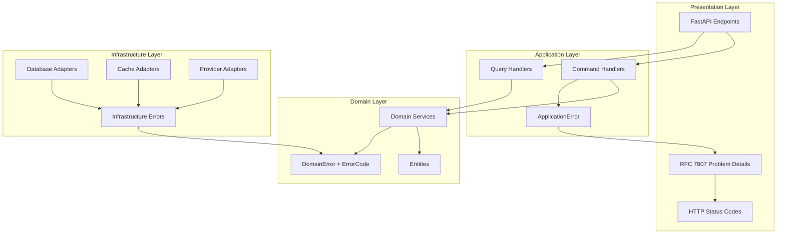

# Error Handling Architecture

## Overview

This document defines Dashtam's unified error handling strategy across all
architectural layers. The design follows **Railway-Oriented Programming**
principles with **Result types**, eliminating exceptions from domain logic
while maintaining proper error propagation and user-friendly HTTP responses.

---

## Design Principles

### Core Principles

1. **No Exceptions in Domain Business Logic**: Domain services and entities use Result types, not exceptions
2. **Railway-Oriented Programming**: Errors flow through pipeline as data
3. **RFC 7807 Compliance**: HTTP API errors follow industry standard
4. **Machine-Readable Codes**: All errors have enums for client handling
5. **User-Friendly Messages**: Human-readable descriptions for end users
6. **Detailed Logging**: Structured logs with trace IDs for debugging
7. **Type Safety**: Strong typing with Python 3.13+ features

### Exception Handling Boundaries

**IMPORTANT**: Not all exceptions are banned from the domain layer. The rule is nuanced:

**✅ Exceptions ALLOWED (Construction/Validation)**:

- **Value Objects**: Can raise `ValueError` in `__post_init__` during construction
- **Reason**: Python dataclasses require fail-fast validation at creation time
- **Handled by**: Application layer catches and converts to Result types

**❌ Exceptions FORBIDDEN (Business Logic)**:

- **Domain Services**: Must return `Result[T, DomainError]`, never raise exceptions
- **Entity Methods**: Must return Result types for fallible operations
- **Reason**: Business logic should be testable without exception handling

**Example - Value Object Construction (Exceptions OK)**:

```python
@dataclass(frozen=True)
class Email:
    value: str
    
    def __post_init__(self):
        try:
            validate_email(self.value)
        except EmailNotValidError as e:
            raise ValueError(f"Invalid email: {e}")  # ✅ OK in __post_init__
```

**Example - Domain Service (Must use Result)**:

```python
class UserService:
    async def create_user(self, email: str) -> Result[User, ValidationError]:
        # ✅ Returns Result, never raises
        if not email:
            return Failure(ValidationError(...))
        return Success(user)
```

**Example - Application Layer (Catches Value Object Exceptions)**:

```python
class RegisterUserHandler:
    async def handle(self, cmd: RegisterUser) -> Result[UUID, ApplicationError]:
        try:
            # Value object construction might raise ValueError
            email = Email(cmd.email)  # ← ValueError might be raised here
            password = Password(cmd.password)
        except ValueError as e:
            # Application layer catches and converts to Result
            return Failure(ApplicationError(
                code=ApplicationErrorCode.COMMAND_VALIDATION_FAILED,
                message=str(e),
            ))
        
        # Now call domain service (returns Result, no exceptions)
        result = await self.user_service.create_user(email, password)
        return result  # Result type flows through
```

**Why This Design?**:

1. **Pragmatic**: Python's `__post_init__` can't return values, must validate in-place
2. **Fail-Fast**: Invalid data caught immediately at construction
3. **Clear Boundaries**: Value objects are construction, services are business logic
4. **Simple**: No need for complex Result-based factory methods on value objects

### FastAPI-Idiomatic Exceptions (Presentation Layer)

**IMPORTANT**: FastAPI dependencies in the presentation layer MAY raise `HTTPException` directly
instead of returning Result types. This is the **FastAPI-idiomatic** approach and is acceptable
for specific scenarios.

**✅ HTTPException ALLOWED (FastAPI Dependencies)**:

- **Authentication dependencies**: `get_current_user()`, `require_role()`
- **Authorization checks**: Permission verification dependencies
- **Request validation**: Path/query parameter validation dependencies
- **Reason**: These are HTTP-specific concerns, not business logic

**Why FastAPI-Idiomatic for Auth?**:

1. **Standard pattern**: FastAPI's security docs use HTTPException for auth failures
2. **No business logic**: Auth extraction is HTTP concern, not domain logic
3. **Consistent response**: Auth failure is ALWAYS 401/403 - no endpoint-specific handling
4. **Reduces boilerplate**: Avoids repetitive Result handling in every protected endpoint
5. **Framework integration**: Works with FastAPI's OpenAPI schema generation

**Example - Auth Dependency (HTTPException OK)**:

```python
# src/presentation/api/middleware/auth_dependencies.py
from fastapi import Depends, HTTPException, status
from fastapi.security import HTTPBearer

async def get_current_user(
    credentials: HTTPAuthorizationCredentials = Depends(HTTPBearer()),
    token_service: TokenGenerationProtocol = Depends(get_token_service),
) -> CurrentUser:
    """Extract and validate JWT from Authorization header."""
    result = token_service.validate_access_token(credentials.credentials)
    
    match result:
        case Success(payload):
            return CurrentUser(
                user_id=UUID(payload["sub"]),
                email=payload["email"],
                roles=payload.get("roles", []),
            )
        case Failure(error):
            # ✅ HTTPException OK - this is HTTP auth concern, not business logic
            raise HTTPException(
                status_code=status.HTTP_401_UNAUTHORIZED,
                detail=error.message,
                headers={"WWW-Authenticate": "Bearer"},
            )
```

**Example - Role Checking (HTTPException OK)**:

```python
def require_role(required_role: str):
    """Dependency factory for role-based access control."""
    async def role_checker(
        current_user: CurrentUser = Depends(get_current_user),
    ) -> CurrentUser:
        if required_role not in current_user.roles:
            # ✅ HTTPException OK - authorization is HTTP concern
            raise HTTPException(
                status_code=status.HTTP_403_FORBIDDEN,
                detail=f"Role '{required_role}' required",
            )
        return current_user
    return role_checker
```

**Contrast with Business Logic (Result Required)**:

```python
# ❌ WRONG - Business logic should NOT raise HTTPException
class UserService:
    async def deactivate_user(self, user_id: UUID) -> None:
        user = await self.users.find_by_id(user_id)
        if not user:
            raise HTTPException(404)  # ❌ Domain should return Result!

# ✅ CORRECT - Business logic returns Result
class UserService:
    async def deactivate_user(self, user_id: UUID) -> Result[None, NotFoundError]:
        user = await self.users.find_by_id(user_id)
        if not user:
            return Failure(NotFoundError(...))  # ✅ Railway-oriented
        return Success(None)
```

**Decision Criteria** - Use HTTPException when ALL are true:

1. Code is in presentation layer (`src/presentation/`)
2. Concern is HTTP-specific (auth, headers, request validation)
3. Error response is always the same (401 for auth, 403 for authz)
4. No business logic involved (just extracting/validating HTTP data)

### Architectural Decisions

- **ErrorCode Enums**: All error codes are enums (not strings)
- **Frozen Dataclasses**: Errors are immutable
- **Result Types**: Success[T] and Failure[E] for all fallible operations
- **Pattern Matching**: Use match/case for error handling
- **No Exception Inheritance**: Domain errors do NOT inherit from Exception
- **Infrastructure Exceptions**: Only infra layer catches and maps to errors
- **Value Object Exceptions**: Value objects can raise ValueError in \_\_post\_init\_\_ (see Exception Handling Boundaries below)

---

## Industry Standards

### RFC 7807: Problem Details for HTTP APIs

**Official Standard**: [RFC 7807](https://datatracker.ietf.org/doc/html/rfc7807)

**Required Fields**:

- `type`: URI reference identifying the problem type
- `title`: Short, human-readable summary
- `status`: HTTP status code
- `detail`: Human-readable explanation

**Optional Fields**:

- `instance`: URI reference to specific occurrence
- `errors`: Array of field-specific errors (validation)
- `trace_id`: Request correlation ID

**Example Response**:

```json
{
  "type": "https://api.dashtam.com/errors/validation-error",
  "title": "Validation Failed",
  "status": 400,
  "detail": "The email address format is invalid",
  "instance": "/api/v1/auth/register",
  "errors": [
    {
      "field": "email",
      "code": "INVALID_EMAIL",
      "message": "Email must be a valid email address"
    }
  ],
  "trace_id": "550e8400-e29b-41d4-a716-446655440000"
}
```

### HTTP Status Codes

**2xx Success**:

- `200 OK`: Successful GET, PATCH, PUT
- `201 Created`: Successful POST
- `204 No Content`: Successful DELETE

**4xx Client Errors**:

- `400 Bad Request`: Validation errors
- `401 Unauthorized`: Authentication required/failed
- `403 Forbidden`: No permission
- `404 Not Found`: Resource doesn't exist
- `409 Conflict`: Resource conflict (duplicate)
- `422 Unprocessable Entity`: Semantic errors
- `429 Too Many Requests`: Rate limit exceeded

**5xx Server Errors**:

- `500 Internal Server Error`: Unexpected error
- `502 Bad Gateway`: Upstream failure
- `503 Service Unavailable`: Temporary overload
- `504 Gateway Timeout`: Upstream timeout

---

## Four-Layer Architecture



### Error Flow

1. **Infrastructure**: Catches exceptions → Maps to DomainError
2. **Domain**: Business logic returns Result[T, DomainError]
3. **Application**: Maps DomainError → ApplicationError
4. **Presentation**: Maps ApplicationError → RFC 7807 ProblemDetails

---

## Domain Layer Errors

### Location: `src/core/errors/`

Domain errors represent business rule violations and validation failures.
They do NOT inherit from Exception.

- **Base error**: `src/core/errors/domain_error.py` - DomainError base class
- **Common errors**: `src/core/errors/common_errors.py` - ValidationError,
  NotFoundError, ConflictError, AuthenticationError, AuthorizationError
- **ErrorCode enum**: `src/core/enums/error_code.py` - Domain error codes

### ErrorCode Enum

```python
from enum import Enum

class ErrorCode(Enum):
    """Domain-level error codes (machine-readable)."""
    
    # Validation errors
    INVALID_EMAIL = "invalid_email"
    INVALID_PASSWORD = "invalid_password"
    PASSWORD_TOO_WEAK = "password_too_weak"
    INVALID_PHONE_NUMBER = "invalid_phone_number"
    INVALID_DATE_RANGE = "invalid_date_range"
    
    # Resource errors
    USER_NOT_FOUND = "user_not_found"
    ACCOUNT_NOT_FOUND = "account_not_found"
    TRANSACTION_NOT_FOUND = "transaction_not_found"
    PROVIDER_NOT_FOUND = "provider_not_found"
    
    # Conflict errors
    USER_ALREADY_EXISTS = "user_already_exists"
    EMAIL_ALREADY_EXISTS = "email_already_exists"
    ACCOUNT_ALREADY_LINKED = "account_already_linked"
    
    # Authentication errors
    INVALID_CREDENTIALS = "invalid_credentials"
    TOKEN_EXPIRED = "token_expired"
    TOKEN_INVALID = "token_invalid"
    EMAIL_NOT_VERIFIED = "email_not_verified"
    
    # Authorization errors
    PERMISSION_DENIED = "permission_denied"
    RESOURCE_NOT_OWNED = "resource_not_owned"
    ACCOUNT_LOCKED = "account_locked"
    
    # Business rule violations
    INSUFFICIENT_BALANCE = "insufficient_balance"
    TRANSFER_LIMIT_EXCEEDED = "transfer_limit_exceeded"
    INVALID_TRANSACTION_TYPE = "invalid_transaction_type"
```

### Base Error Classes

```python
from dataclasses import dataclass

@dataclass(frozen=True, slots=True, kw_only=True)
class DomainError:
    """
    Base domain error (does NOT inherit from Exception).
    
    Domain errors represent business rule violations and validation failures.
    They flow through the system as data (Result types), not exceptions.
    
    Attributes:
        code: Machine-readable error code
        message: Human-readable error message
        details: Optional context for debugging
    """
    code: ErrorCode
    message: str
    details: dict[str, str] | None = None
    
    def __str__(self) -> str:
        return f"{self.code.value}: {self.message}"


@dataclass(frozen=True, slots=True, kw_only=True)
class ValidationError(DomainError):
    """
    Input validation failure.
    
    Attributes:
        code: ErrorCode enum
        message: Human-readable message
        field: Field name that failed validation
        details: Additional context
    """
    field: str | None = None


@dataclass(frozen=True, slots=True, kw_only=True)
class NotFoundError(DomainError):
    """
    Resource not found.
    
    Attributes:
        code: ErrorCode enum
        message: Human-readable message
        resource_type: Type of resource (User, Account, etc.)
        resource_id: ID of the resource that was not found
        details: Additional context
    """
    resource_type: str
    resource_id: str


@dataclass(frozen=True, slots=True, kw_only=True)
class ConflictError(DomainError):
    """
    Resource conflict (duplicate, state conflict).
    
    Attributes:
        code: ErrorCode enum
        message: Human-readable message
        resource_type: Type of resource in conflict
        conflicting_field: Field that has conflict (email, account_id, etc.)
        details: Additional context
    """
    resource_type: str
    conflicting_field: str | None = None


@dataclass(frozen=True, slots=True, kw_only=True)
class AuthenticationError(DomainError):
    """
    Authentication failure (invalid credentials, token expired).
    
    Attributes:
        code: ErrorCode enum
        message: Human-readable message
        details: Additional context
    """
    pass


@dataclass(frozen=True, slots=True, kw_only=True)
class AuthorizationError(DomainError):
    """
    Authorization failure (no permission).
    
    Attributes:
        code: ErrorCode enum
        message: Human-readable message
        required_permission: Permission that was required
        details: Additional context
    """
    required_permission: str | None = None
```

### Domain Service Example

```python
from src.core.result import Result, Success, Failure
from src.core.enums import ErrorCode
from src.core.errors import ValidationError, ConflictError

class UserService:
    """Domain service for user operations."""
    
    async def create_user(
        self,
        email: str,
        password: str,
    ) -> Result[User, ValidationError | ConflictError]:
        """
        Create new user with validation.
        
        Returns:
            Success(User) if created
            Failure(ValidationError) if invalid input
            Failure(ConflictError) if email exists
        """
        # Validate email
        if not self._is_valid_email(email):
            return Failure(ValidationError(
                code=ErrorCode.INVALID_EMAIL,
                message="Email address format is invalid",
                field="email",
            ))
        
        # Validate password
        if len(password) < 12:
            return Failure(ValidationError(
                code=ErrorCode.PASSWORD_TOO_WEAK,
                message="Password must be at least 12 characters",
                field="password",
            ))
        
        # Check for existing user
        existing = await self.users.find_by_email(email)
        if existing:
            return Failure(ConflictError(
                code=ErrorCode.EMAIL_ALREADY_EXISTS,
                message=f"User with email '{email}' already exists",
                resource_type="User",
                conflicting_field="email",
            ))
        
        # Create user
        user = User(id=uuid4(), email=email, ...)
        await self.users.save(user)
        
        return Success(user)
```

---

## Application Layer Errors

### Location: `src/application/errors.py`

Application errors wrap domain errors and add application-specific context.

### ApplicationErrorCode Enum

```python
from enum import Enum

class ApplicationErrorCode(Enum):
    """Application-level error codes."""
    
    COMMAND_VALIDATION_FAILED = "command_validation_failed"
    COMMAND_EXECUTION_FAILED = "command_execution_failed"
    QUERY_FAILED = "query_failed"
    UNAUTHORIZED = "unauthorized"
    FORBIDDEN = "forbidden"
    NOT_FOUND = "not_found"
    CONFLICT = "conflict"
    RATE_LIMIT_EXCEEDED = "rate_limit_exceeded"
```

### ApplicationError Class

```python
from dataclasses import dataclass
from src.core.errors import DomainError

@dataclass(frozen=True, slots=True, kw_only=True)
class ApplicationError:
    """
    Application layer error.
    
    Wraps domain errors with application-specific context.
    
    Attributes:
        code: Application error code
        message: Human-readable message
        domain_error: Original domain error (if applicable)
        details: Additional context
    """
    code: ApplicationErrorCode
    message: str
    domain_error: DomainError | None = None
    details: dict[str, str] | None = None
```

### Command Handler with Error Mapping

```python
from src.core.result import Result, Success, Failure
from src.core.errors import ValidationError, ConflictError
from src.application.errors import ApplicationError, ApplicationErrorCode

class CreateUserHandler:
    """Handle user creation command."""
    
    async def handle(
        self,
        command: CreateUserCommand,
    ) -> Result[UserId, ApplicationError]:
        """
        Execute user creation.
        
        Maps domain errors to application errors.
        """
        # Call domain service
        result = await self.user_service.create_user(
            email=command.email,
            password=command.password,
        )
        
        # Map errors using pattern matching
        match result:
            case Success(user):
                # Publish event
                await self.event_bus.publish(UserCreated(user_id=user.id))
                return Success(user.id)
            
            case Failure(ValidationError() as err):
                return Failure(ApplicationError(
                    code=ApplicationErrorCode.COMMAND_VALIDATION_FAILED,
                    message="User creation failed: validation error",
                    domain_error=err,
                    details={"field": err.field},
                ))
            
            case Failure(ConflictError() as err):
                return Failure(ApplicationError(
                    code=ApplicationErrorCode.CONFLICT,
                    message="User creation failed: email already exists",
                    domain_error=err,
                    details={"field": err.conflicting_field},
                ))
```

---

## Infrastructure Layer Errors

### Location: `src/infrastructure/errors/`

Infrastructure errors represent failures in external systems (database, cache, providers).

- **Base error**: `src/infrastructure/errors/infrastructure_error.py` -
  InfrastructureError and specific error classes
- **Error codes**: `src/infrastructure/enums/infrastructure_error_code.py` -
  Infrastructure-specific error codes

### InfrastructureErrorCode Enum

```python
from enum import Enum

class InfrastructureErrorCode(Enum):
    """Infrastructure-specific error codes."""
    
    # Database errors
    DATABASE_CONNECTION_FAILED = "database_connection_failed"
    DATABASE_TIMEOUT = "database_timeout"
    DATABASE_CONSTRAINT_VIOLATION = "database_constraint_violation"
    DATABASE_ERROR = "database_error"
    
    # Cache errors
    CACHE_CONNECTION_ERROR = "cache_connection_error"
    CACHE_TIMEOUT = "cache_timeout"
    CACHE_GET_ERROR = "cache_get_error"
    CACHE_SET_ERROR = "cache_set_error"
    CACHE_DELETE_ERROR = "cache_delete_error"
    
    # External service errors
    EXTERNAL_SERVICE_UNAVAILABLE = "external_service_unavailable"
    EXTERNAL_SERVICE_TIMEOUT = "external_service_timeout"
    EXTERNAL_SERVICE_ERROR = "external_service_error"
    
    # Provider errors
    PROVIDER_CONNECTION_FAILED = "provider_connection_failed"
    PROVIDER_AUTH_REQUIRED = "provider_auth_required"
    PROVIDER_RATE_LIMITED = "provider_rate_limited"
```

### Infrastructure Error Classes

```python
from dataclasses import dataclass
from src.core.errors import DomainError
from typing import Any

@dataclass(frozen=True, slots=True, kw_only=True)
class InfrastructureError(DomainError):
    """
    Base infrastructure error.
    
    Infrastructure errors still use ErrorCode enum (not InfrastructureErrorCode).
    The InfrastructureErrorCode is for internal infrastructure use only.
    
    Attributes:
        code: Domain ErrorCode (maps from InfrastructureErrorCode)
        message: Human-readable message
        infrastructure_code: Original infrastructure error code
        details: Additional context
    """
    infrastructure_code: InfrastructureErrorCode | None = None
    details: dict[str, Any] | None = None


@dataclass(frozen=True, slots=True, kw_only=True)
class DatabaseError(InfrastructureError):
    """Database-specific errors."""
    pass


@dataclass(frozen=True, slots=True, kw_only=True)
class CacheError(InfrastructureError):
    """Cache-specific errors."""
    pass


@dataclass(frozen=True, slots=True, kw_only=True)
class ProviderError(InfrastructureError):
    """Provider API errors."""
    provider_name: str
```

### Infrastructure Adapter Error Mapping

```python
from src.core.result import Result, Success, Failure
from src.core.enums import ErrorCode
from src.core.errors import DomainError
from src.infrastructure.enums import InfrastructureErrorCode
from src.infrastructure.errors import CacheError

class RedisAdapter:
    """Redis cache adapter."""
    
    async def get(self, key: str) -> Result[str | None, CacheError]:
        """Get value from cache."""
        try:
            value = await self._redis.get(key)
            return Success(value)
        except Exception as e:
            # Map infrastructure exception to infrastructure error
            return Failure(CacheError(
                code=ErrorCode.CACHE_ERROR,  # Domain error code
                infrastructure_code=InfrastructureErrorCode.CACHE_GET_ERROR,
                message=f"Failed to get key: {key}",
                details={"key": key, "error": str(e)},
            ))
```

---

## Presentation Layer (RFC 7807)

### Location: `src/presentation/api/v1/errors/`

### ProblemDetails Schema

```python
from pydantic import BaseModel, Field

class ErrorDetail(BaseModel):
    """Individual field error."""
    field: str = Field(..., description="Field name")
    code: str = Field(..., description="Machine-readable error code")
    message: str = Field(..., description="Human-readable error message")


class ProblemDetails(BaseModel):
    """RFC 7807 Problem Details for HTTP APIs."""
    
    type: str = Field(
        ...,
        description="URI reference identifying the problem type",
        examples=["https://api.dashtam.com/errors/validation-error"],
    )
    title: str = Field(
        ...,
        description="Short, human-readable summary",
        examples=["Validation Failed"],
    )
    status: int = Field(
        ...,
        description="HTTP status code",
        examples=[400],
    )
    detail: str = Field(
        ...,
        description="Human-readable explanation",
        examples=["The email address format is invalid"],
    )
    instance: str = Field(
        ...,
        description="URI reference identifying this occurrence",
        examples=["/api/v1/auth/register"],
    )
    errors: list[ErrorDetail] | None = Field(
        None,
        description="List of field-specific errors",
    )
    trace_id: str | None = Field(
        None,
        description="Request trace ID for debugging",
    )
```

### Error Response Builder

```python
from fastapi import Request, status
from fastapi.responses import JSONResponse
from src.application.errors import ApplicationError, ApplicationErrorCode

class ErrorResponseBuilder:
    """Build RFC 7807 Problem Details responses."""
    
    BASE_URL = "https://api.dashtam.com"
    
    @staticmethod
    def from_application_error(
        error: ApplicationError,
        request: Request,
        trace_id: str,
    ) -> JSONResponse:
        """Convert ApplicationError to RFC 7807 response."""
        
        # Map to HTTP status
        status_code = ErrorResponseBuilder._get_status_code(error.code)
        
        # Build Problem Details
        problem = ProblemDetails(
            type=f"{ErrorResponseBuilder.BASE_URL}/errors/{error.code.value}",
            title=ErrorResponseBuilder._get_title(error.code),
            status=status_code,
            detail=error.message,
            instance=str(request.url.path),
            trace_id=trace_id,
        )
        
        # Add field errors if validation failure
        if error.domain_error and hasattr(error.domain_error, 'field'):
            problem.errors = [
                ErrorDetail(
                    field=error.domain_error.field or "unknown",
                    code=error.domain_error.code.value,
                    message=error.domain_error.message,
                )
            ]
        
        return JSONResponse(
            status_code=status_code,
            content=problem.model_dump(exclude_none=True),
        )
    
    @staticmethod
    def _get_status_code(code: ApplicationErrorCode) -> int:
        """Map application error code to HTTP status."""
        mapping = {
            ApplicationErrorCode.COMMAND_VALIDATION_FAILED: status.HTTP_400_BAD_REQUEST,
            ApplicationErrorCode.UNAUTHORIZED: status.HTTP_401_UNAUTHORIZED,
            ApplicationErrorCode.FORBIDDEN: status.HTTP_403_FORBIDDEN,
            ApplicationErrorCode.NOT_FOUND: status.HTTP_404_NOT_FOUND,
            ApplicationErrorCode.CONFLICT: status.HTTP_409_CONFLICT,
            ApplicationErrorCode.RATE_LIMIT_EXCEEDED: status.HTTP_429_TOO_MANY_REQUESTS,
        }
        return mapping.get(code, status.HTTP_500_INTERNAL_SERVER_ERROR)
    
    @staticmethod
    def _get_title(code: ApplicationErrorCode) -> str:
        """Get human-readable title for error code."""
        mapping = {
            ApplicationErrorCode.COMMAND_VALIDATION_FAILED: "Validation Failed",
            ApplicationErrorCode.UNAUTHORIZED: "Authentication Required",
            ApplicationErrorCode.FORBIDDEN: "Access Denied",
            ApplicationErrorCode.NOT_FOUND: "Resource Not Found",
            ApplicationErrorCode.CONFLICT: "Resource Conflict",
            ApplicationErrorCode.RATE_LIMIT_EXCEEDED: "Rate Limit Exceeded",
        }
        return mapping.get(code, "Internal Server Error")
```

### API Endpoint with Error Handling

```python
from fastapi import APIRouter, Depends, Request
from src.core.result import Success, Failure

router = APIRouter(prefix="/api/v1/auth", tags=["Authentication"])

@router.post("/register", status_code=201)
async def register_user(
    data: UserRegistrationRequest,
    request: Request,
    handler: CreateUserHandler = Depends(get_create_user_handler),
    trace_id: str = Depends(get_trace_id),
):
    """
    Register new user.
    
    Returns:
        201: User created successfully
        400: Validation error
        409: User already exists
    """
    command = CreateUserCommand(
        email=data.email,
        password=data.password,
    )
    
    result = await handler.handle(command)
    
    match result:
        case Success(user_id):
            return {
                "id": str(user_id),
                "email": data.email,
                "message": "User registered successfully",
            }
        
        case Failure(error):
            return ErrorResponseBuilder.from_application_error(
                error=error,
                request=request,
                trace_id=trace_id,
            )
```

---

## Error Code Conventions

### Naming Pattern

**Format**: `ENTITY_ACTION_REASON` or `SYSTEM_ACTION_REASON`

**Examples**:

- `USER_NOT_FOUND` - Entity: User, Action: Lookup, Reason: Not Found
- `EMAIL_ALREADY_EXISTS` - Entity: Email, Action: Create, Reason: Already Exists
- `PASSWORD_TOO_WEAK` - Entity: Password, Action: Validate, Reason: Too Weak
- `CACHE_CONNECTION_ERROR` - System: Cache, Action: Connect, Reason: Error

### Categories

**Validation**: `INVALID_*`, `*_TOO_WEAK`, `*_TOO_SHORT`, `*_REQUIRED`
**Not Found**: `*_NOT_FOUND`
**Conflict**: `*_ALREADY_EXISTS`, `*_CONFLICT`
**Authentication**: `*_INVALID_CREDENTIALS`, `TOKEN_*`
**Authorization**: `PERMISSION_DENIED`, `*_NOT_OWNED`
**Infrastructure**: `*_CONNECTION_*`, `*_TIMEOUT`, `*_ERROR`

---

## Logging Strategy

### Structured Logging

```python
import structlog

logger = structlog.get_logger()

# Log error with context
logger.error(
    "User creation failed",
    error_code=error.code.value,
    error_message=error.message,
    user_email=command.email,
    trace_id=trace_id,
    request_path=request.url.path,
    request_method=request.method,
)
```

### Log Output (JSON)

```json
{
  "event": "User creation failed",
  "level": "error",
  "timestamp": "2025-11-11T05:00:00Z",
  "error_code": "email_already_exists",
  "error_message": "User with email 'user@example.com' already exists",
  "user_email": "user@example.com",
  "trace_id": "550e8400-e29b-41d4-a716-446655440000",
  "request_path": "/api/v1/auth/register",
  "request_method": "POST"
}
```

### Security Considerations

**NEVER log**:

- Passwords (plain or hashed)
- API keys or secrets
- OAuth tokens
- Credit card numbers
- SSNs or PII

**DO log**:

- Error codes
- User IDs (UUID)
- Request paths
- Trace IDs
- Timestamps

---

## Testing Error Paths

### Unit Tests (Domain Layer)

```python
def test_create_user_with_invalid_email():
    """Test validation error for invalid email."""
    service = UserService(...)
    
    result = await service.create_user(
        email="invalid-email",
        password="SecurePass123!",
    )
    
    match result:
        case Failure(ValidationError() as err):
            assert err.code == ErrorCode.INVALID_EMAIL
            assert err.field == "email"
        case _:
            pytest.fail("Expected ValidationError")
```

### Integration Tests (Application Layer)

```python
async def test_create_user_command_handler():
    """Test command handler error mapping."""
    handler = CreateUserHandler(...)
    command = CreateUserCommand(email="test@example.com", password="pass")
    
    result = await handler.handle(command)
    
    match result:
        case Success(user_id):
            assert isinstance(user_id, UUID)
        case Failure(ApplicationError() as err):
            assert err.code == ApplicationErrorCode.COMMAND_VALIDATION_FAILED
```

### API Tests (Presentation Layer)

```python
def test_register_user_validation_error(client):
    """Test API returns RFC 7807 response."""
    response = client.post("/api/v1/auth/register", json={
        "email": "invalid",
        "password": "weak",
    })
    
    assert response.status_code == 400
    data = response.json()
    assert data["type"] == "https://api.dashtam.com/errors/command_validation_failed"
    assert data["title"] == "Validation Failed"
    assert "errors" in data
```

---

### Adding New Error Codes

1. Add to appropriate enum (`ErrorCode`, `ApplicationErrorCode`, or `InfrastructureErrorCode`)
2. Follow naming convention: `ENTITY_ACTION_REASON`
3. Add error code to HTTP status mapping (if applicable)
4. Add error code to title mapping (if applicable)
5. Document in this file

### Checklist for New Features

- [ ] Domain errors defined with ErrorCode enum
- [ ] Domain services return Result[T, DomainError]
- [ ] Application handlers map to ApplicationError
- [ ] API endpoints use ErrorResponseBuilder
- [ ] Error codes follow naming convention
- [ ] Structured logging includes error codes
- [ ] Tests cover error paths
- [ ] No passwords/secrets in logs

---

## Summary

Dashtam's error handling architecture provides:

- **Type-Safe Errors**: ErrorCode enums with frozen dataclasses
- **Railway-Oriented Programming**: Result types throughout
- **RFC 7807 Compliance**: Industry-standard HTTP API errors
- **Clear Separation**: Domain → Application → Infrastructure → Presentation
- **User-Friendly**: Human-readable messages with machine-readable codes
- **Developer-Friendly**: Detailed logs with trace IDs for debugging
- **Testable**: All error paths can be unit/integration tested

This architecture eliminates inconsistent error messages, provides standardized
client error handling, and maintains clean separation of concerns across all
layers.

---

**Created**: 2025-11-11 | **Last Updated**: 2025-11-12
