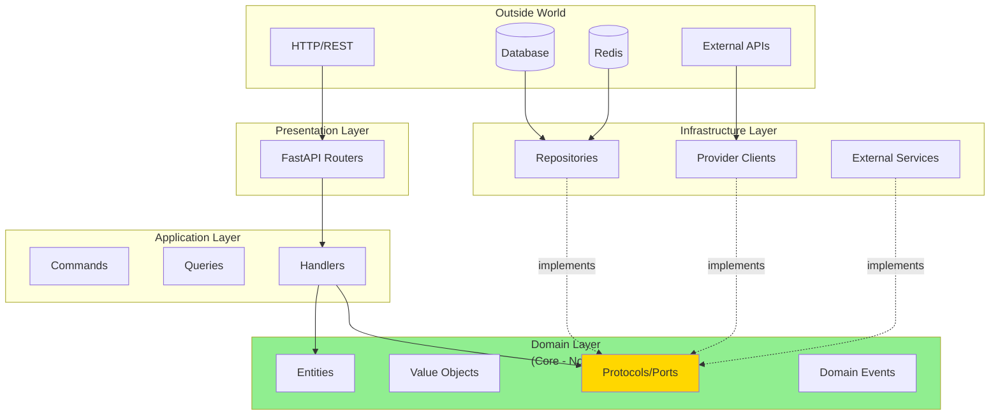
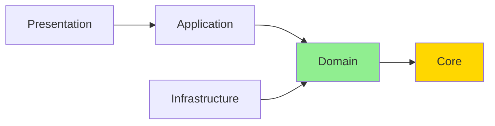
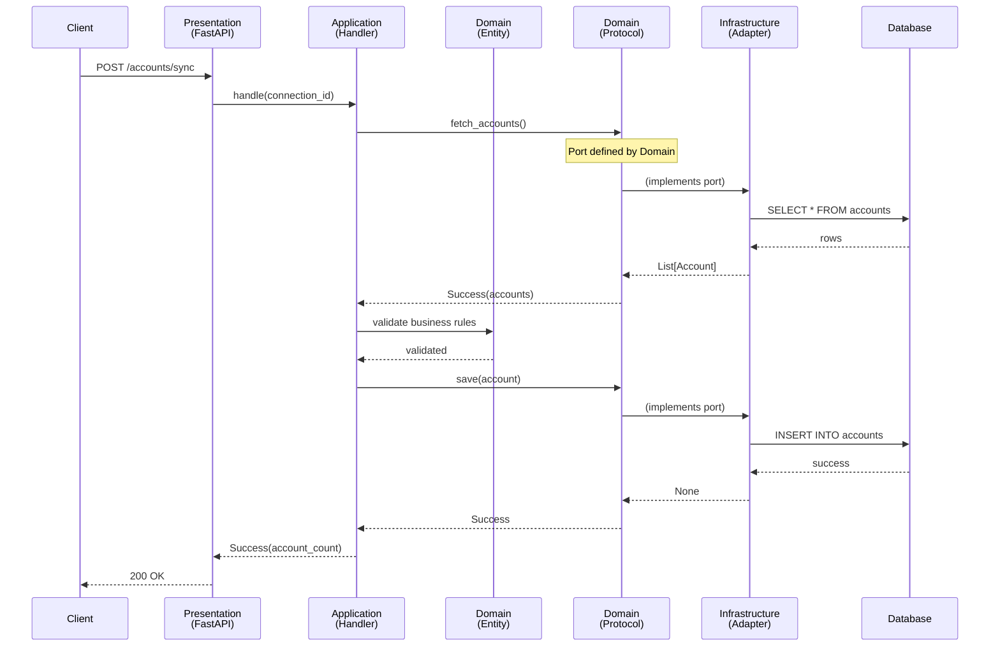

# Hexagonal Architecture

## Overview

**Purpose**: Isolate business logic from infrastructure concerns, making the system testable, maintainable, and framework-independent.

**Problem**: Traditional layered architectures create tight coupling:

- Business logic depends on frameworks (FastAPI, SQLModel)
- Database schema drives domain models
- Hard to test without full infrastructure
- Framework upgrades break business logic
- Cannot swap implementations (PostgreSQL → MongoDB)

**Solution**: Hexagonal Architecture (Ports & Adapters) inverts dependencies:

- **Domain at center**: Pure business logic, zero infrastructure imports
- **Ports**: Interfaces defined by domain (protocols)
- **Adapters**: Infrastructure implements domain ports
- **Dependency Rule**: All dependencies point inward toward domain

---

## Core Principles

### 1. The Dependency Rule

**CRITICAL**: Dependencies flow **inward** toward the domain. Domain depends on **NOTHING**.



**Rules**:

- ✅ **Domain**: Depends on nothing (except standard library + core utilities)
- ✅ **Application**: Depends on Domain
- ✅ **Infrastructure**: Depends on Domain (implements protocols)
- ✅ **Presentation**: Depends on Application
- ❌ **NEVER**: Domain depends on Infrastructure or Presentation

### 2. Ports and Adapters

**Port** (Interface): Defined by domain, declares what domain needs.

**Adapter** (Implementation): Infrastructure implements the port.

```python
# Domain defines PORT (protocol)
# src/domain/protocols/user_repository.py
from typing import Protocol
from src.domain.entities.user import User

class UserRepository(Protocol):
    """Repository port for user persistence."""
    
    async def find_by_email(self, email: str) -> User | None:
        """Find user by email address."""
        ...
    
    async def save(self, user: User) -> None:
        """Persist user entity."""
        ...
```

```python
# Infrastructure implements ADAPTER
# src/infrastructure/persistence/repositories/user_repository.py
from sqlalchemy.ext.asyncio import AsyncSession
from src.domain.entities.user import User
from src.infrastructure.persistence.models.user import UserModel

class UserRepository:  # No inheritance! Structural typing
    """PostgreSQL adapter for UserRepository port."""
    
    def __init__(self, session: AsyncSession) -> None:
        self._session = session
    
    async def find_by_email(self, email: str) -> User | None:
        """Find user by email in PostgreSQL."""
        result = await self._session.execute(
            select(UserModel).where(UserModel.email == email)
        )
        model = result.scalar_one_or_none()
        
        if model is None:
            return None
        
        # Map database model → domain entity
        return User(
            id=model.id,
            email=model.email,
            # ...
        )
    
    async def save(self, user: User) -> None:
        """Persist user entity to PostgreSQL."""
        model = UserModel(
            id=user.id,
            email=user.email,
            # ...
        )
        self._session.add(model)
        await self._session.flush()
```

**Key Points**:

- Domain defines **what** (port)
- Infrastructure defines **how** (adapter)
- No inheritance (structural typing via Protocol)
- Easy to swap implementations (PostgreSQL → MongoDB, just implement the port)

### 3. Inside-Out Design

Traditional (Outside-In):

```text
Database schema → Models → Business logic → API
(Infrastructure drives domain)
```

Hexagonal (Inside-Out):

```text
Domain entities → Protocols → Adapters → Infrastructure
(Domain drives infrastructure)
```

**Benefits**:

- Domain models reflect **business** reality, not database constraints
- Can design domain first, defer infrastructure decisions
- Business logic survives framework changes

### 4. Framework Independence

Domain layer has **zero** framework imports:

```python
# ✅ CORRECT: Domain entity (pure Python)
from dataclasses import dataclass
from uuid import UUID

@dataclass
class User:
    id: UUID
    email: str
    is_verified: bool
    
    def verify_email(self) -> None:
        """Mark user as verified."""
        self.is_verified = True
```

```python
# ❌ WRONG: Framework imports in domain
from sqlalchemy.orm import DeclarativeBase  # NO!
from fastapi import Depends  # NO!
from redis import Redis  # NO!

class User(DeclarativeBase):  # Domain coupled to SQLAlchemy
    ...
```

**Benefits**:

- Upgrade FastAPI without touching business logic
- Migrate PostgreSQL → MongoDB without rewriting domain
- Test domain in isolation (no database, no framework)

---

## Architecture Layers

### Layer 1: Core (Shared Kernel)

**Location**: `src/core/`

**Purpose**: Shared utilities used across all layers.

**Contents**:

- `result.py` - Result types (Success/Failure)
- `errors/` - Base error classes
- `enums/` - Core enums
- `config.py` - Settings
- `container/` - Dependency injection

**Dependencies**: None (pure Python)

**Example**:

```python
# src/core/result.py
from dataclasses import dataclass
from typing import Generic, TypeVar

T = TypeVar("T")
E = TypeVar("E")

@dataclass(frozen=True, kw_only=True)
class Success(Generic[T]):
    value: T

@dataclass(frozen=True, kw_only=True)
class Failure(Generic[E]):
    error: E

type Result[T, E] = Success[T] | Failure[E]
```

### Layer 2: Domain (Business Logic Core)

**Location**: `src/domain/`

**Purpose**: Pure business logic - the heart of the application.

**Contents**:

- `entities/` - Business objects with identity (mutable)
- `value_objects/` - Immutable values (no identity)
- `protocols/` - ALL ports (interfaces) consolidated
- `events/` - Domain events with Event Registry
- `enums/` - Domain enums
- `errors/` - Domain-specific errors
- `types.py` - Annotated types
- `validators.py` - Validation functions

**Dependencies**: `src/core/` only

**Rules**:

- NO framework imports (FastAPI, SQLModel, Redis)
- NO infrastructure imports (database, cache, external APIs)
- Pure Python dataclasses and Protocol definitions
- All business rules live here

**Example - Entity**:

```python
# src/domain/entities/account.py
from dataclasses import dataclass
from uuid import UUID
from src.domain.value_objects.money import Money
from src.domain.enums.account_type import AccountType

@dataclass
class Account:
    """Financial account entity."""
    
    id: UUID
    user_id: UUID
    provider_connection_id: UUID
    account_type: AccountType
    balance: Money
    is_active: bool
    
    def deactivate(self) -> None:
        """Deactivate account."""
        self.is_active = False
    
    def update_balance(self, new_balance: Money) -> None:
        """Update account balance."""
        if new_balance.currency != self.balance.currency:
            raise ValueError("Currency mismatch")
        self.balance = new_balance
```

**Example - Port (Protocol)**:

```python
# src/domain/protocols/account_repository.py
from typing import Protocol
from uuid import UUID
from src.domain.entities.account import Account

class AccountRepository(Protocol):
    """Repository port for account persistence."""
    
    async def find_by_id(self, account_id: UUID) -> Account | None:
        """Find account by ID."""
        ...
    
    async def find_by_user_id(self, user_id: UUID) -> list[Account]:
        """Find all accounts for user."""
        ...
    
    async def save(self, account: Account) -> None:
        """Persist account entity."""
        ...
```

### Layer 3: Application (Use Cases)

**Location**: `src/application/`

**Purpose**: Orchestrate use cases following CQRS pattern.

**Contents**:

- `commands/` - Write operations
- `commands/handlers/` - Command handler implementations
- `queries/` - Read operations
- `queries/handlers/` - Query handler implementations
- `events/handlers/` - Domain event handlers

**Dependencies**: `src/domain/`, `src/core/`

**Rules**:

- Orchestrate domain entities
- Depend ONLY on domain protocols (never infrastructure)
- Use Result types for error handling
- Emit domain events for critical workflows

**Example - Command Handler**:

```python
# src/application/commands/handlers/sync_accounts_handler.py
from uuid import UUID
from src.core.result import Result, Success, Failure
from src.domain.protocols.account_repository import AccountRepository
from src.domain.protocols.provider_protocol import ProviderProtocol
from src.domain.protocols.event_bus_protocol import EventBusProtocol
from src.domain.events.data_events import (
    AccountSyncAttempted,
    AccountSyncSucceeded,
    AccountSyncFailed,
)

class SyncAccountsHandler:
    """Handler for syncing accounts from provider."""
    
    def __init__(
        self,
        account_repo: AccountRepository,  # Port, not adapter!
        provider: ProviderProtocol,       # Port, not adapter!
        event_bus: EventBusProtocol,      # Port, not adapter!
    ) -> None:
        self._account_repo = account_repo
        self._provider = provider
        self._event_bus = event_bus
    
    async def handle(
        self,
        connection_id: UUID,
        credentials: dict[str, str],
    ) -> Result[int, str]:
        """Sync accounts from provider.
        
        Returns:
            Success(account_count) on success
            Failure(error_message) on failure
        """
        # 1. Emit ATTEMPTED event
        await self._event_bus.publish(
            AccountSyncAttempted(
                provider_connection_id=connection_id,
            )
        )
        
        try:
            # 2. Fetch accounts from provider (via port)
            result = await self._provider.fetch_accounts(credentials)
            
            if isinstance(result, Failure):
                await self._event_bus.publish(
                    AccountSyncFailed(
                        provider_connection_id=connection_id,
                        reason=result.error.message,
                    )
                )
                return Failure(error=result.error.message)
            
            accounts = result.value
            
            # 3. Save accounts (via port)
            for account in accounts:
                await self._account_repo.save(account)
            
            # 4. Emit SUCCEEDED event
            await self._event_bus.publish(
                AccountSyncSucceeded(
                    provider_connection_id=connection_id,
                    account_count=len(accounts),
                )
            )
            
            return Success(value=len(accounts))
            
        except Exception as e:
            await self._event_bus.publish(
                AccountSyncFailed(
                    provider_connection_id=connection_id,
                    reason=str(e),
                )
            )
            return Failure(error=str(e))
```

**Note**: Handler depends on **protocols** (ports), not concrete implementations (adapters).

### Layer 4: Infrastructure (Adapters)

**Location**: `src/infrastructure/`

**Purpose**: Implement domain ports with concrete technologies.

**Contents**:

- `persistence/` - Database adapters (PostgreSQL repositories)
- `providers/` - Financial provider clients (Schwab, Alpaca, Chase)
- `cache/` - Redis cache adapter
- `secrets/` - Secrets management adapters (env, AWS)
- `logging/` - Logging adapters (console, CloudWatch)
- `events/` - Event bus implementation, event handlers
- `authorization/` - Casbin RBAC adapter
- `security/` - JWT service, encryption
- `external/` - External API clients

**Dependencies**: `src/domain/`, `src/core/`, external libraries

**Rules**:

- Implements domain protocols (ports)
- Contains framework imports (SQLModel, Redis, boto3)
- Database models live here (NOT in domain)
- Mapping: domain entity ↔ database model

**Example - Repository Adapter**:

```python
# src/infrastructure/persistence/repositories/account_repository.py
from sqlalchemy.ext.asyncio import AsyncSession
from sqlalchemy import select
from uuid import UUID

from src.domain.entities.account import Account
from src.domain.value_objects.money import Money
from src.infrastructure.persistence.models.account import AccountModel

class AccountRepository:  # Implements port via structural typing
    """PostgreSQL adapter for AccountRepository port."""
    
    def __init__(self, session: AsyncSession) -> None:
        self._session = session
    
    async def find_by_id(self, account_id: UUID) -> Account | None:
        """Find account by ID in PostgreSQL."""
        result = await self._session.execute(
            select(AccountModel).where(AccountModel.id == account_id)
        )
        model = result.scalar_one_or_none()
        
        if model is None:
            return None
        
        # Map database model → domain entity
        return self._to_entity(model)
    
    async def find_by_user_id(self, user_id: UUID) -> list[Account]:
        """Find all accounts for user in PostgreSQL."""
        result = await self._session.execute(
            select(AccountModel).where(AccountModel.user_id == user_id)
        )
        models = result.scalars().all()
        
        return [self._to_entity(model) for model in models]
    
    async def save(self, account: Account) -> None:
        """Persist account entity to PostgreSQL."""
        # Check if exists
        existing = await self._session.get(AccountModel, account.id)
        
        if existing:
            # Update
            existing.balance_amount = account.balance.amount
            existing.balance_currency = account.balance.currency
            existing.is_active = account.is_active
        else:
            # Insert
            model = self._to_model(account)
            self._session.add(model)
        
        await self._session.flush()
    
    def _to_entity(self, model: AccountModel) -> Account:
        """Map database model to domain entity."""
        return Account(
            id=model.id,
            user_id=model.user_id,
            provider_connection_id=model.provider_connection_id,
            account_type=model.account_type,
            balance=Money(
                amount=model.balance_amount,
                currency=model.balance_currency,
            ),
            is_active=model.is_active,
        )
    
    def _to_model(self, account: Account) -> AccountModel:
        """Map domain entity to database model."""
        return AccountModel(
            id=account.id,
            user_id=account.user_id,
            provider_connection_id=account.provider_connection_id,
            account_type=account.account_type,
            balance_amount=account.balance.amount,
            balance_currency=account.balance.currency,
            is_active=account.is_active,
        )
```

**Key Points**:

- Adapter has infrastructure dependencies (SQLAlchemy, AsyncSession)
- Maps between domain entity and database model (boundary translation)
- Implements port without inheritance (structural typing)

### Layer 5: Presentation (API)

**Location**: `src/presentation/`

**Purpose**: HTTP API endpoints using FastAPI.

**Contents**:

- `routers/api/v1/` - Versioned API endpoints
- `routers/api/middleware/` - Rate limiting, auth dependencies
- `routers/oauth_callbacks.py` - OAuth callbacks

**Dependencies**: `src/application/`, `src/core/`

**Rules**:

- Thin layer - NO business logic
- Dispatches commands/queries to application layer
- Translates HTTP → Command/Query → HTTP
- RESTful URLs (resource-based)

**Example**:

```python
# src/presentation/routers/api/v1/accounts.py
from fastapi import APIRouter, Depends, HTTPException
from uuid import UUID

from src.application.commands.handlers.sync_accounts_handler import (
    SyncAccountsHandler,
)
from src.application.queries.handlers.list_accounts_handler import (
    ListAccountsHandler,
)
from src.schemas.account_schemas import AccountListResponse
from src.core.container.data_handlers import (
    get_sync_accounts_handler,
    get_list_accounts_handler,
)
from src.core.result import Success, Failure

router = APIRouter(prefix="/accounts", tags=["accounts"])

@router.post("/{connection_id}/sync")
async def sync_accounts(
    connection_id: UUID,
    handler: SyncAccountsHandler = Depends(get_sync_accounts_handler),
) -> dict[str, int]:
    """Sync accounts from provider."""
    
    # Application layer handles business logic
    result = await handler.handle(connection_id=connection_id)
    
    # Presentation translates Result → HTTP
    if isinstance(result, Failure):
        raise HTTPException(status_code=400, detail=result.error)
    
    return {"synced_count": result.value}

@router.get("/")
async def list_accounts(
    user_id: UUID,
    handler: ListAccountsHandler = Depends(get_list_accounts_handler),
) -> AccountListResponse:
    """List all accounts for user."""
    
    result = await handler.handle(user_id=user_id)
    
    if isinstance(result, Failure):
        raise HTTPException(status_code=400, detail=result.error)
    
    return result.value
```

---

## Dependency Flow

### Compile-Time Dependencies



**Rules**:

- All arrows point toward Domain/Core
- Domain has no outward arrows (zero dependencies)
- Infrastructure depends on Domain (implements ports)

### Runtime Flow



**Key Points**:

- Handler depends on **port** (protocol), not adapter
- At runtime, DI container injects **adapter** that implements port
- Handler doesn't know it's talking to PostgreSQL (could be MongoDB, in-memory, etc.)

---

## Testing Strategy

### Unit Testing Domain (Isolated)

**Goal**: Test business logic without infrastructure.

```python
# tests/unit/test_domain_account_entity.py
from uuid import uuid7
from src.domain.entities.account import Account
from src.domain.value_objects.money import Money
from src.domain.enums.account_type import AccountType

def test_account_deactivate():
    """Test account deactivation."""
    account = Account(
        id=uuid7(),
        user_id=uuid7(),
        provider_connection_id=uuid7(),
        account_type=AccountType.CHECKING,
        balance=Money(amount=1000.0, currency="USD"),
        is_active=True,
    )
    
    account.deactivate()
    
    assert account.is_active is False

def test_account_update_balance_same_currency():
    """Test balance update with same currency."""
    account = Account(
        id=uuid7(),
        user_id=uuid7(),
        provider_connection_id=uuid7(),
        account_type=AccountType.CHECKING,
        balance=Money(amount=1000.0, currency="USD"),
        is_active=True,
    )
    
    new_balance = Money(amount=2000.0, currency="USD")
    account.update_balance(new_balance)
    
    assert account.balance.amount == 2000.0

def test_account_update_balance_different_currency_raises():
    """Test balance update with different currency raises error."""
    account = Account(
        id=uuid7(),
        user_id=uuid7(),
        provider_connection_id=uuid7(),
        account_type=AccountType.CHECKING,
        balance=Money(amount=1000.0, currency="USD"),
        is_active=True,
    )
    
    new_balance = Money(amount=2000.0, currency="EUR")
    
    with pytest.raises(ValueError, match="Currency mismatch"):
        account.update_balance(new_balance)
```

**Benefits**:

- No database required
- No framework required
- Fast (milliseconds)
- Tests pure business logic

### Unit Testing Application (Mocked Ports)

**Goal**: Test handlers with mocked dependencies.

```python
# tests/unit/test_application_sync_accounts_handler.py
from unittest.mock import AsyncMock
from uuid import uuid7
import pytest

from src.application.commands.handlers.sync_accounts_handler import (
    SyncAccountsHandler,
)
from src.domain.protocols.account_repository import AccountRepository
from src.domain.protocols.provider_protocol import ProviderProtocol
from src.domain.protocols.event_bus_protocol import EventBusProtocol
from src.domain.entities.account import Account
from src.core.result import Success, Failure

@pytest.mark.asyncio
async def test_sync_accounts_success():
    """Test successful account sync."""
    # Arrange - Mock ports
    mock_repo = AsyncMock(spec=AccountRepository)
    mock_provider = AsyncMock(spec=ProviderProtocol)
    mock_event_bus = AsyncMock(spec=EventBusProtocol)
    
    # Mock provider returns accounts
    mock_provider.fetch_accounts.return_value = Success(value=[
        Account(...),
        Account(...),
    ])
    
    handler = SyncAccountsHandler(
        account_repo=mock_repo,
        provider=mock_provider,
        event_bus=mock_event_bus,
    )
    
    connection_id = uuid7()
    credentials = {"access_token": "test_token"}
    
    # Act
    result = await handler.handle(connection_id, credentials)
    
    # Assert
    assert isinstance(result, Success)
    assert result.value == 2  # 2 accounts synced
    
    # Verify events emitted
    assert mock_event_bus.publish.call_count == 2  # Attempted + Succeeded
    
    # Verify repository called
    assert mock_repo.save.call_count == 2
```

**Benefits**:

- Tests handler logic without real database/provider
- Fast (milliseconds)
- Verifies port interactions

### Integration Testing Infrastructure (Real Adapters)

**Goal**: Test adapters with real infrastructure.

```python
# tests/integration/test_account_repository.py
import pytest
from uuid import uuid7
from sqlalchemy.ext.asyncio import AsyncSession

from src.domain.entities.account import Account
from src.domain.value_objects.money import Money
from src.domain.enums.account_type import AccountType
from src.infrastructure.persistence.repositories.account_repository import (
    AccountRepository,
)

@pytest.mark.asyncio
async def test_save_and_find_account(db_session: AsyncSession):
    """Test saving and retrieving account."""
    repo = AccountRepository(session=db_session)
    
    # Create account
    account = Account(
        id=uuid7(),
        user_id=uuid7(),
        provider_connection_id=uuid7(),
        account_type=AccountType.CHECKING,
        balance=Money(amount=1000.0, currency="USD"),
        is_active=True,
    )
    
    # Save
    await repo.save(account)
    await db_session.commit()
    
    # Retrieve
    found = await repo.find_by_id(account.id)
    
    # Assert
    assert found is not None
    assert found.id == account.id
    assert found.balance.amount == 1000.0
    assert found.balance.currency == "USD"
```

**Benefits**:

- Tests real database operations
- Verifies entity ↔ model mapping
- Catches SQL errors, schema issues

### API Testing (End-to-End)

**Goal**: Test complete flow through all layers.

```python
# tests/api/test_accounts_endpoints.py
import pytest
from fastapi.testclient import TestClient
from uuid import uuid7

@pytest.mark.asyncio
async def test_sync_accounts_endpoint(client: TestClient, auth_headers: dict):
    """Test POST /accounts/{connection_id}/sync endpoint."""
    connection_id = uuid7()
    
    response = client.post(
        f"/api/v1/accounts/{connection_id}/sync",
        headers=auth_headers,
    )
    
    assert response.status_code == 200
    data = response.json()
    assert "synced_count" in data
    assert data["synced_count"] >= 0
```

### Test Pyramid

```text
           ▲
          ╱ ╲ 10% API Tests
         ╱───╲ - Complete flows
        ╱     ╲
       ╱       ╲ 20% Integration Tests
      ╱─────────╲ - Real adapters
     ╱           ╲
    ╱             ╲ 70% Unit Tests
   ╱───────────────╲ - Domain + Application
```

**Coverage Targets**:

| Layer | Test Type | Coverage Target |
|-------|-----------|-----------------|
| Domain | Unit | 95%+ |
| Application | Unit (mocked ports) | 90%+ |
| Infrastructure | Integration | 70%+ |
| Presentation | API | 85%+ |

---

## Benefits

### 1. Testability

**Problem Solved**: Can't test business logic without database/framework.

**Hexagonal Solution**: Test domain in complete isolation.

```python
# Domain test - NO database, NO framework
def test_account_deactivate():
    account = Account(...)
    account.deactivate()
    assert account.is_active is False
```

### 2. Maintainability

**Problem Solved**: Business logic scattered across layers.

**Hexagonal Solution**: All business logic centralized in domain.

```text
Before: Business logic in controllers, services, models, utilities
After: Business logic ONLY in domain entities
```

### 3. Flexibility

**Problem Solved**: Can't swap implementations (PostgreSQL → MongoDB).

**Hexagonal Solution**: Swap adapters without touching domain.

```python
# Domain depends on port
class SyncAccountsHandler:
    def __init__(self, account_repo: AccountRepository):  # Port
        ...

# Swap adapters via DI
# Development: In-memory adapter
# Production: PostgreSQL adapter
# Testing: Mock adapter
```

### 4. Framework Independence

**Problem Solved**: Framework upgrade breaks business logic.

**Hexagonal Solution**: Domain survives framework changes.

```text
FastAPI 0.100 → 0.110: Domain unchanged
PostgreSQL → MongoDB: Domain unchanged
Redis → Memcached: Domain unchanged
```

### 5. Team Scalability

**Problem Solved**: Multiple developers cause merge conflicts.

**Hexagonal Solution**: Clear boundaries enable parallel work.

```text
Team A: Works on domain (entities, protocols)
Team B: Works on adapters (PostgreSQL repository)
Team C: Works on API (FastAPI routers)

No conflicts - different layers!
```

---

## Common Pitfalls

### ❌ Pitfall 1: Domain Imports Infrastructure

```python
# WRONG: Domain imports infrastructure
from sqlalchemy.orm import DeclarativeBase

@dataclass
class User(DeclarativeBase):  # Domain coupled to SQLAlchemy!
    ...
```

**Fix**: Keep domain pure.

```python
# CORRECT: Pure domain entity
@dataclass
class User:
    id: UUID
    email: str
```

### ❌ Pitfall 2: Application Imports Infrastructure

```python
# WRONG: Handler imports concrete adapter
from src.infrastructure.persistence.repositories.user_repository import (
    UserRepository as PostgresUserRepository
)

class RegisterUserHandler:
    def __init__(self, user_repo: PostgresUserRepository):  # Concrete!
        ...
```

**Fix**: Depend on port.

```python
# CORRECT: Handler depends on port
from src.domain.protocols.user_repository import UserRepository

class RegisterUserHandler:
    def __init__(self, user_repo: UserRepository):  # Protocol!
        ...
```

### ❌ Pitfall 3: Leaking Infrastructure into Domain

```python
# WRONG: Domain entity returns database model
class Account:
    def to_model(self) -> AccountModel:  # Domain knows about database!
        ...
```

**Fix**: Mapping in adapter.

```python
# CORRECT: Adapter handles mapping
class AccountRepository:
    def _to_entity(self, model: AccountModel) -> Account:
        # Adapter responsibility
        ...
```

---

## Integration with Other Patterns

### Hexagonal + CQRS

**CQRS**: Separates commands (write) from queries (read)  
**Hexagonal**: Separates domain from infrastructure

```text
Presentation Layer
    ↓
Application Layer (CQRS)
    ├─ Commands → Write side
    └─ Queries → Read side
    ↓
Domain Layer (Hexagonal Core)
    ├─ Entities
    └─ Protocols (Ports)
    ↑ (implements)
Infrastructure Layer (Adapters)
    ├─ Repositories
    └─ Provider Clients
```

**See**: `cqrs-pattern.md` for CQRS details.

### Hexagonal + Protocol-Based

**Protocol-Based**: Use Python `Protocol` for ports (structural typing)  
**Hexagonal**: Ports defined by domain, adapters implement

```python
# Domain defines port (Protocol)
class UserRepository(Protocol):
    async def save(self, user: User) -> None: ...

# Infrastructure implements adapter (no inheritance)
class PostgresUserRepository:
    async def save(self, user: User) -> None:
        # PostgreSQL implementation
        ...
```

**See**: `protocol-based-architecture.md` for Protocol details.

### Hexagonal + DDD

**DDD**: Domain-Driven Design patterns (entities, value objects, events)  
**Hexagonal**: Isolates domain from infrastructure

```text
Hexagonal Architecture (Structure)
    ↓
Domain Layer contains:
    - Entities (DDD)
    - Value Objects (DDD)
    - Domain Events (DDD)
    - Repositories (DDD - as protocols/ports)
```

**See**: `domain-driven-design-architecture.md` for DDD details.

### Hexagonal + Event Registry

**Event Registry**: Single source of truth for domain events  
**Hexagonal**: Domain events live in domain layer, handlers in infrastructure

```python
# Domain: Define events
class AccountSyncSucceeded(DomainEvent):
    ...

# Domain: Event Registry (single source of truth)
EVENT_REGISTRY = [...]

# Infrastructure: Event handlers (adapters)
class AuditEventHandler:
    async def handle_account_sync_succeeded(self, event):
        # Audit infrastructure
        ...
```

**See**: `registry-pattern-architecture.md` for Event Registry details.

---

## Comparison: Hexagonal vs Traditional Layered

### Traditional Layered Architecture

```text
Presentation → Business Logic → Data Access → Database
(All layers know about each other, tight coupling)
```

**Problems**:

- Business logic depends on database schema
- Can't test without database
- Framework changes break business logic
- Hard to swap implementations

### Hexagonal Architecture

```text
        Presentation (Adapter)
              ↓
        Application Layer
              ↓
        Domain Layer (Core)
              ↑ (implements)
        Infrastructure (Adapters)
              ↑
        Database, Redis, External APIs
```

**Benefits**:

- Domain drives design, not database
- Test domain without infrastructure
- Framework-independent
- Easy to swap adapters

### Side-by-Side

| Aspect | Traditional Layered | Hexagonal |
|--------|---------------------|-----------|
| **Dependency Direction** | Top-down (Presentation → DB) | Inside-out (All → Domain) |
| **Business Logic** | Scattered across layers | Centralized in domain |
| **Testing** | Requires full stack | Domain tests isolated |
| **Framework** | Tightly coupled | Independent |
| **Swapping** | Hard (rewrites) | Easy (swap adapters) |
| **Team Work** | Conflicts common | Parallel work enabled |

---

## Adding New Features (Hexagonal Way)

### Example: Add "Transfer Money" Feature

**Step 1**: Define domain entities/value objects

```python
# src/domain/entities/transaction.py
@dataclass
class Transaction:
    id: UUID
    from_account_id: UUID
    to_account_id: UUID
    amount: Money
    status: TransactionStatus
```

**Step 2**: Define domain protocol (port)

```python
# src/domain/protocols/transaction_repository.py
class TransactionRepository(Protocol):
    async def save(self, transaction: Transaction) -> None: ...
    async def find_by_id(self, transaction_id: UUID) -> Transaction | None: ...
```

**Step 3**: Create application handler

```python
# src/application/commands/handlers/transfer_money_handler.py
class TransferMoneyHandler:
    def __init__(
        self,
        account_repo: AccountRepository,  # Port
        transaction_repo: TransactionRepository,  # Port
    ):
        self._account_repo = account_repo
        self._transaction_repo = transaction_repo
    
    async def handle(self, cmd: TransferMoney) -> Result[UUID, str]:
        # Business logic using domain entities
        ...
```

**Step 4**: Implement infrastructure adapter

```python
# src/infrastructure/persistence/repositories/transaction_repository.py
class TransactionRepository:  # Implements port
    def __init__(self, session: AsyncSession):
        self._session = session
    
    async def save(self, transaction: Transaction) -> None:
        # PostgreSQL implementation
        ...
```

**Step 5**: Create API endpoint

```python
# src/presentation/routers/api/v1/transactions.py
@router.post("/transfers")
async def transfer_money(
    data: TransferRequest,
    handler: TransferMoneyHandler = Depends(get_transfer_money_handler),
):
    result = await handler.handle(TransferMoney(...))
    # ...
```

**Step 6**: Write tests

```python
# tests/unit/test_domain_transaction.py - Domain tests (no infrastructure)
# tests/unit/test_application_transfer_handler.py - Handler tests (mocked ports)
# tests/integration/test_transaction_repository.py - Adapter tests (real DB)
# tests/api/test_transactions_endpoints.py - API tests (end-to-end)
```

**Key Points**:

- Start with domain (entities, protocols)
- Application depends on domain protocols
- Infrastructure implements protocols last
- API layer is thin (dispatch only)
- Test each layer independently

---

## Real-World Example from Dashtam

### Feature: Sync Accounts from Provider

**Domain Layer** (`src/domain/`):

```python
# entities/account.py - Business entity
@dataclass
class Account:
    id: UUID
    provider_connection_id: UUID
    balance: Money
    # ...

# protocols/account_repository.py - Port
class AccountRepository(Protocol):
    async def save(self, account: Account) -> None: ...

# protocols/provider_protocol.py - Port
class ProviderProtocol(Protocol):
    async def fetch_accounts(
        self,
        credentials: dict[str, str],
    ) -> Result[list[Account], ProviderError]: ...

# events/data_events.py - Domain events
@dataclass(frozen=True, kw_only=True)
class AccountSyncSucceeded(DomainEvent):
    provider_connection_id: UUID
    account_count: int
```

**Application Layer** (`src/application/`):

```python
# commands/handlers/sync_accounts_handler.py
class SyncAccountsHandler:
    def __init__(
        self,
        account_repo: AccountRepository,  # Port!
        provider: ProviderProtocol,  # Port!
        event_bus: EventBusProtocol,  # Port!
    ):
        self._account_repo = account_repo
        self._provider = provider
        self._event_bus = event_bus
    
    async def handle(
        self,
        connection_id: UUID,
        credentials: dict[str, str],
    ) -> Result[int, str]:
        # Fetch from provider
        result = await self._provider.fetch_accounts(credentials)
        
        if isinstance(result, Failure):
            return result
        
        accounts = result.value
        
        # Save to repository
        for account in accounts:
            await self._account_repo.save(account)
        
        # Emit event
        await self._event_bus.publish(
            AccountSyncSucceeded(
                provider_connection_id=connection_id,
                account_count=len(accounts),
            )
        )
        
        return Success(value=len(accounts))
```

**Infrastructure Layer** (`src/infrastructure/`):

```python
# persistence/repositories/account_repository.py - Adapter
class AccountRepository:  # Implements port (no inheritance)
    def __init__(self, session: AsyncSession):
        self._session = session
    
    async def save(self, account: Account) -> None:
        # PostgreSQL logic
        model = AccountModel(...)
        self._session.add(model)
        await self._session.flush()

# providers/schwab/schwab_provider.py - Adapter
class SchwabProvider:  # Implements port (no inheritance)
    async def fetch_accounts(
        self,
        credentials: dict[str, str],
    ) -> Result[list[Account], ProviderError]:
        # Schwab API logic
        response = await self._api_client.get_accounts(
            access_token=credentials["access_token"]
        )
        # Map Schwab response → domain Account entities
        accounts = [self._mapper.map(acc) for acc in response]
        return Success(value=accounts)
```

**Presentation Layer** (`src/presentation/`):

```python
# routers/api/v1/accounts.py - API endpoint
@router.post("/{connection_id}/sync")
async def sync_accounts(
    connection_id: UUID,
    handler: SyncAccountsHandler = Depends(get_sync_accounts_handler),
) -> dict[str, int]:
    # Thin layer - dispatch to handler
    result = await handler.handle(connection_id=connection_id)
    
    if isinstance(result, Failure):
        raise HTTPException(400, detail=result.error)
    
    return {"synced_count": result.value}
```

**Key Points**:

- ✅ Handler depends on **ports** (AccountRepository, ProviderProtocol)
- ✅ Infrastructure implements **adapters** (PostgresAccountRepository, SchwabProvider)
- ✅ Domain has zero infrastructure imports
- ✅ Easy to test (mock ports in unit tests)
- ✅ Easy to swap (Schwab → Alpaca, just change adapter)

---

## References

**Related Architecture Documents**:

- [CQRS Pattern](cqrs-pattern.md) - Command/Query separation
- [Protocol-Based Architecture](protocol-based-architecture.md) - Structural typing with Protocol
- [Domain-Driven Design](domain-driven-design-architecture.md) - Pragmatic DDD patterns
- [Event Registry Pattern](registry-pattern-architecture.md) - Single source of truth for events
- [Directory Structure](directory-structure.md) - File organization following hexagonal architecture
- [Dependency Injection](dependency-injection-architecture.md) - Container pattern for ports/adapters

**External Resources**:

- [Hexagonal Architecture (Alistair Cockburn)](https://alistair.cockburn.us/hexagonal-architecture/)
- [Clean Architecture (Robert Martin)](https://blog.cleancoder.com/uncle-bob/2012/08/13/the-clean-architecture.html)

---

**Created**: 2025-12-30 | **Last Updated**: 2025-12-30
