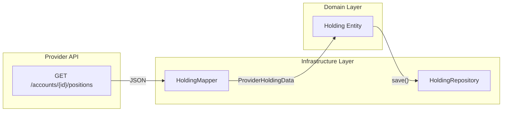

# Holding Domain Model Architecture

Investment holding (position) domain model for portfolio tracking.

---

## Overview

The Holding domain model represents a current security position in an investment account. Holdings are synced from providers and represent what the user currently owns at a point in time.

### Core Principle

> Holdings are READ-ONLY from Dashtam's perspective. Users buy/sell through their brokerage, then we sync the result.

### Design Goals

1. **Provider Agnostic**: Support any brokerage's position data structure
2. **Financial Precision**: Decimal precision for all monetary values (never float)
3. **Domain Purity**: Zero framework imports in domain layer
4. **Portfolio Analytics**: Enable gain/loss calculations and aggregations

---

## Domain Model

### Entity: Holding

```text
Holding
├── id: UUID                           # Unique identifier
├── account_id: UUID                   # FK to Account
├── provider_holding_id: str           # Provider's unique position ID
├── symbol: str                        # Security ticker (e.g., "AAPL")
├── security_name: str                 # Full name (e.g., "Apple Inc.")
├── asset_type: AssetType              # EQUITY, ETF, OPTION, etc.
├── quantity: Decimal                  # Shares/units held
├── cost_basis: Money                  # Total cost paid
├── market_value: Money                # Current market value
├── currency: str                      # ISO 4217 code
├── average_price: Money | None        # Avg price per share
├── current_price: Money | None        # Current market price
├── is_active: bool                    # Position still held
├── last_synced_at: datetime | None    # Last sync timestamp
├── provider_metadata: dict | None     # Raw provider data
├── created_at: datetime               # Record creation
└── updated_at: datetime               # Last modification
```

### Computed Properties

```python
class Holding:
    @property
    def unrealized_gain_loss(self) -> Money:
        """market_value - cost_basis (positive = gain, negative = loss)."""
        gain_loss = self.market_value.amount - self.cost_basis.amount
        return Money(amount=gain_loss, currency=self.currency)
    
    @property
    def unrealized_gain_loss_percent(self) -> Decimal:
        """Percentage gain/loss (e.g., 16.67 for 16.67% gain)."""
        if self.cost_basis.amount == 0:
            return Decimal("0")
        percent = (self.unrealized_gain_loss.amount / self.cost_basis.amount) * 100
        return percent.quantize(Decimal("0.01"))
```

### Query Methods

```python
class Holding:
    def is_profitable(self) -> bool:
        """Check if market_value > cost_basis."""
    
    def is_equity(self) -> bool:
        """Check if asset_type is EQUITY."""
    
    def is_etf(self) -> bool:
        """Check if asset_type is ETF."""
    
    def is_option(self) -> bool:
        """Check if asset_type is OPTION."""
    
    def is_crypto(self) -> bool:
        """Check if asset_type is CRYPTOCURRENCY."""
    
    def has_position(self) -> bool:
        """Check if quantity > 0."""
```

### Update Methods

```python
class Holding:
    def update_from_sync(
        self,
        quantity: Decimal,
        cost_basis: Money,
        market_value: Money,
        current_price: Money | None = None,
        provider_metadata: dict | None = None,
    ) -> None:
        """Update holding from provider sync.
        
        Side Effects:
            - Updates quantity, cost_basis, market_value
            - Updates current_price if provided
            - Updates provider_metadata if provided
            - Updates last_synced_at and updated_at
            - Sets is_active based on quantity
        """
    
    def mark_synced(self) -> None:
        """Record successful sync timestamp."""
    
    def deactivate(self) -> None:
        """Mark holding as inactive (sold)."""
```

---

## AssetType Enum

```python
class AssetType(str, Enum):
    """Type of security/asset."""
    EQUITY = "equity"              # Stocks (common, preferred)
    ETF = "etf"                    # Exchange-traded funds
    OPTION = "option"              # Options contracts
    MUTUAL_FUND = "mutual_fund"    # Mutual funds
    FIXED_INCOME = "fixed_income"  # Bonds, CDs, treasuries
    FUTURES = "futures"            # Futures contracts
    CRYPTOCURRENCY = "cryptocurrency"  # Crypto assets
    CASH_EQUIVALENT = "cash_equivalent"  # Money market, etc.
    OTHER = "other"                # Unknown/other
```

**Provider Mapping**: Each provider mapper maps provider-specific asset types to these canonical values.

---

## Money Value Object

Holdings use the `Money` value object for all monetary amounts:

```python
@dataclass(frozen=True)
class Money:
    """Immutable monetary value with currency."""
    amount: Decimal
    currency: str  # ISO 4217 code
    
    def __add__(self, other: "Money") -> "Money": ...
    def __sub__(self, other: "Money") -> "Money": ...
    def __mul__(self, scalar: Decimal) -> "Money": ...
```

**Rules**:

- All monetary fields use `Money` (never raw `Decimal` or `float`)
- Currency must match across `cost_basis`, `market_value`, `average_price`, `current_price`
- Currency validated in `__post_init__`

---

## Repository Protocol

```python
class HoldingRepository(Protocol):
    """Port for holding persistence."""
    
    async def find_by_id(self, holding_id: UUID) -> Holding | None:
        """Find holding by ID."""
    
    async def find_by_account_id(
        self, 
        account_id: UUID,
        active_only: bool = True,
    ) -> list[Holding]:
        """Find all holdings for an account."""
    
    async def find_by_provider_holding_id(
        self,
        account_id: UUID,
        provider_holding_id: str,
    ) -> Holding | None:
        """Find holding by provider's position ID."""
    
    async def find_by_user_id(
        self,
        user_id: UUID,
        active_only: bool = True,
    ) -> list[Holding]:
        """Find all holdings across user's accounts."""
    
    async def save(self, holding: Holding) -> None:
        """Persist holding (insert or update)."""
    
    async def save_many(self, holdings: list[Holding]) -> None:
        """Bulk persist holdings."""
    
    async def delete(self, holding_id: UUID) -> None:
        """Remove holding record."""
```

---

## Provider Data Flow



### Sync Process

1. **Fetch**: Provider adapter calls API to get positions
2. **Map**: Provider-specific mapper converts JSON → `ProviderHoldingData`
3. **Transform**: Handler creates/updates `Holding` entity
4. **Persist**: Repository saves to database
5. **Snapshot**: Balance snapshot captured (optional)

---

## Validation Rules

### Holding Entity

- `id`: Required, valid UUID
- `account_id`: Required, valid UUID (references Account)
- `provider_holding_id`: Required, non-empty string
- `symbol`: Required, non-empty string
- `security_name`: Required, non-empty string
- `asset_type`: Required, valid AssetType
- `quantity`: Required, non-negative Decimal
- `currency`: Required, 3-letter ISO code

### Currency Consistency

All monetary fields must have matching currency:

- `cost_basis.currency == currency`
- `market_value.currency == currency`
- `average_price.currency == currency` (if present)
- `current_price.currency == currency` (if present)

---

## File Structure

```text
src/domain/
├── entities/
│   └── holding.py              # Holding entity
├── enums/
│   └── asset_type.py           # AssetType enum
├── value_objects/
│   └── money.py                # Money value object
└── protocols/
    └── holding_repository.py   # Repository protocol

src/infrastructure/
├── persistence/
│   ├── models/
│   │   └── holding.py          # SQLAlchemy model
│   └── repositories/
│       └── holding_repository.py  # PostgreSQL adapter
└── providers/
    └── schwab/
        └── mappers/
            └── holding_mapper.py  # Schwab → ProviderHoldingData

tests/
├── unit/
│   ├── test_domain_holding_entity.py
│   └── test_infrastructure_schwab_holding_mapper.py
└── integration/
    └── test_holding_repository.py
```

---

## Testing Strategy

### Unit Tests (~50+ tests)

**Holding Entity**:

- Entity creation with valid/invalid fields
- Currency consistency validation
- Computed properties: `unrealized_gain_loss`, `unrealized_gain_loss_percent`
- Query methods: `is_profitable()`, `is_equity()`, `has_position()`
- Update methods: `update_from_sync()`, `mark_synced()`, `deactivate()`

**Provider Mapper**:

- Required field mapping
- Asset type mapping (all provider types → Dashtam types)
- Optional field handling
- Invalid data handling (returns None, doesn't raise)
- Position ID generation

### Integration Tests (~15+ tests)

**Repository**:

- CRUD operations
- Query by account, user, provider_holding_id
- Bulk save performance
- Active/inactive filtering

### Coverage Target

- Domain layer: 95%+
- Infrastructure mapper: 95%+
- Repository: 70%+

---

## Security Considerations

1. **No sensitive data in holdings**: Holdings contain public market data only
2. **User isolation**: All queries filter by user_id (enforced at handler level)
3. **Audit trail**: Sync operations logged with structured logging
4. **Provider metadata**: Raw data preserved for debugging but never exposed to clients

---

**Created**: 2025-12-26 | **Last Updated**: 2025-12-26
