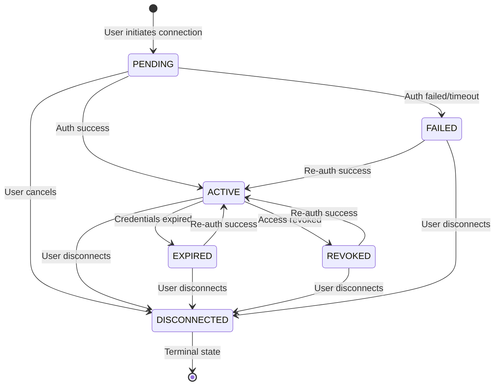

# Provider Domain Model Architecture

Provider Connection Domain Model - the foundation for multi-provider financial data aggregation.

---

## Overview

The Provider Connection domain model represents the relationship between a user and a financial data provider (Schwab, Chase, Plaid, etc.). This model is **authentication-agnostic** - the domain layer has no knowledge of OAuth, API keys, or other authentication mechanisms.

### Core Principle

> The domain cares about CONNECTION STATE, not authentication mechanics. Infrastructure layer handles provider-specific authentication details.

### Design Goals

1. **Authentication Agnostic**: Support OAuth2, API keys, Link tokens, certificates without domain changes
2. **Provider Extensible**: Adding new providers requires only infrastructure adapters
3. **Domain Purity**: Zero framework or authentication imports in domain layer
4. **Credential Security**: Encrypted opaque blobs - domain never sees raw credentials

---

## Domain Model

### Entity: ProviderConnection

```text
ProviderConnection
├── id: UUID                           # Unique identifier
├── user_id: UUID                      # Owning user
├── provider_id: UUID                  # FK to Provider registry
├── provider_slug: str                 # Denormalized ("schwab") for logging/display
├── alias: str | None                  # User-friendly name ("My Schwab IRA")
├── status: ConnectionStatus           # PENDING, ACTIVE, EXPIRED, etc.
├── credentials: ProviderCredentials | None  # Encrypted, opaque
├── connected_at: datetime | None      # When connection established
├── last_sync_at: datetime | None      # Last successful data sync
├── created_at: datetime               # Record creation
└── updated_at: datetime               # Last modification
```

### Business Methods

All state transition methods return `Result[None, str]` (Railway-Oriented Programming). Handlers create domain events, not the entity.

```python
class ProviderConnection:
    # Query methods (read-only)
    def is_connected(self) -> bool:
        """Connection is active and credentials valid."""
    
    def needs_reauthentication(self) -> bool:
        """Credentials expired, revoked, or require refresh."""
    
    def is_credentials_expired(self) -> bool:
        """Check if credentials have passed expiration time."""
    
    def is_credentials_expiring_soon(self) -> bool:
        """Check if credentials will expire within 5 minutes."""
    
    def can_sync(self) -> bool:
        """Check if connection can perform data synchronization."""
    
    # State transition methods (return Result)
    def mark_connected(self, credentials: ProviderCredentials) -> Result[None, str]:
        """Transition to ACTIVE with new credentials."""
    
    def mark_disconnected(self) -> Result[None, str]:
        """Transition to DISCONNECTED (terminal state)."""
    
    def mark_expired(self) -> Result[None, str]:
        """Transition to EXPIRED when credentials no longer valid."""
    
    def mark_revoked(self) -> Result[None, str]:
        """Transition to REVOKED when user/provider revokes access."""
    
    def mark_failed(self) -> Result[None, str]:
        """Transition to FAILED when authentication fails."""
    
    def update_credentials(self, credentials: ProviderCredentials) -> Result[None, str]:
        """Update credentials (e.g., after token refresh)."""
    
    def record_sync(self) -> Result[None, str]:
        """Update last_sync_at timestamp after successful data sync."""
```

### State Machine



---

## Value Objects

### ProviderCredentials (Authentication-Agnostic)

```python
@dataclass(frozen=True)
class ProviderCredentials:
    """Encrypted, opaque credential storage.
    
    Domain layer treats this as an opaque blob. Only infrastructure
    layer understands the internal format based on credential_type.
    
    Examples:
    - OAuth2: {"access_token": "...", "refresh_token": "...", "token_type": "Bearer"}
    - API Key: {"api_key": "...", "api_secret": "..."}
    - Link Token: {"access_token": "...", "item_id": "..."}
    """
    encrypted_data: bytes           # Encrypted credential blob
    credential_type: CredentialType # Routing hint for infrastructure
    expires_at: datetime | None     # When credentials expire (None = never)
    
    def is_expired(self) -> bool:
        """Check if credentials have expired."""
    
    def is_expiring_soon(self, threshold: timedelta = timedelta(minutes=5)) -> bool:
        """Check if credentials will expire within threshold."""
    
    def time_until_expiry(self) -> timedelta | None:
        """Time remaining until expiration."""
    
    def supports_refresh(self) -> bool:
        """Check if credential type supports automatic refresh."""
```

**Why opaque?** The domain doesn't need to know if we're storing OAuth tokens, API keys, or anything else. This allows:

- Adding new auth mechanisms without domain changes
- Provider-specific credential formats
- Future-proofing for unknown auth types

---

## Provider Identification

Providers are dynamic entities managed via a registry rather than hardcoded enums. This allows adding new providers through configuration without code changes.

### Domain Layer Reference

```python
class ProviderConnection:
    provider_id: UUID    # FK to Provider registry
    provider_slug: str   # Denormalized for logging/display ("schwab")
```

### Infrastructure Layer Registry

```python
class Provider:  # Stored in DB or config
    id: UUID
    slug: str            # "schwab", "chase" (unique, URL-safe)
    name: str            # "Charles Schwab", "Chase Bank"
    credential_type: CredentialType
    is_active: bool

class ProviderRegistry(Protocol):
    def get_by_id(self, provider_id: UUID) -> Provider | None: ...
    def get_by_slug(self, slug: str) -> Provider | None: ...
    def list_available(self) -> list[Provider]: ...
    def get_credential_handler(self, provider_id: UUID) -> CredentialHandler: ...
```

---

## Enums

### ConnectionStatus

```python
class ConnectionStatus(str, Enum):
    """Provider connection lifecycle states."""
    PENDING = "pending"           # Auth initiated, awaiting completion
    ACTIVE = "active"             # Connected and credentials valid
    EXPIRED = "expired"           # Credentials expired, needs re-auth
    REVOKED = "revoked"           # Access revoked by user or provider
    FAILED = "failed"             # Authentication failed
    DISCONNECTED = "disconnected" # User explicitly disconnected
    
    @classmethod
    def values(cls) -> list[str]:
        """Get all status values as strings."""
    
    @classmethod
    def is_valid(cls, value: str) -> bool:
        """Check if a string is a valid status."""
    
    @classmethod
    def active_states(cls) -> list["ConnectionStatus"]:
        """Get states where connection is usable (ACTIVE only)."""
    
    @classmethod
    def needs_reauth_states(cls) -> list["ConnectionStatus"]:
        """Get states requiring re-authentication (EXPIRED, REVOKED, FAILED)."""
    
    @classmethod
    def terminal_states(cls) -> list["ConnectionStatus"]:
        """Get terminal states (DISCONNECTED)."""
```

### CredentialType

```python
class CredentialType(str, Enum):
    """Authentication mechanism type - used by infrastructure layer."""
    OAUTH2 = "oauth2"             # OAuth 2.0 (Schwab, most brokerages)
    API_KEY = "api_key"           # Simple API key authentication
    LINK_TOKEN = "link_token"     # Plaid-style link tokens
    CERTIFICATE = "certificate"   # mTLS certificate-based auth
    CUSTOM = "custom"             # Provider-specific custom auth
    
    @classmethod
    def values(cls) -> list[str]:
        """Get all credential type values as strings."""
    
    @classmethod
    def is_valid(cls, value: str) -> bool:
        """Check if a string is a valid credential type."""
    
    @classmethod
    def supports_refresh(cls) -> list["CredentialType"]:
        """Get types that support automatic refresh (OAUTH2, LINK_TOKEN)."""
    
    @classmethod
    def never_expires(cls) -> list["CredentialType"]:
        """Get types that typically don't expire (API_KEY, CERTIFICATE)."""
```

---

## Domain Events

Three workflows × three states = 9 events following the ATTEMPT → OUTCOME pattern.

### Connection Events

```python
# Workflow: User initiates provider connection
ProviderConnectionAttempted   # Before auth flow starts
ProviderConnectionSucceeded   # After successful auth + credential storage
ProviderConnectionFailed      # Auth failed or user cancelled
```

### Disconnection Events

```python
# Workflow: User disconnects provider
ProviderDisconnectionAttempted  # Before disconnection process
ProviderDisconnectionSucceeded  # After successful disconnection
ProviderDisconnectionFailed     # Disconnection failed (rare)
```

### Token Refresh Events

```python
# Workflow: System refreshes expiring credentials
ProviderTokenRefreshAttempted   # Before credential refresh
ProviderTokenRefreshSucceeded   # After successful refresh
ProviderTokenRefreshFailed      # Refresh failed, may need re-auth
```

### Event Data

```python
@dataclass(frozen=True, kw_only=True)
class ProviderConnectionSucceeded(DomainEvent):
    """Emitted after successful provider connection."""
    connection_id: UUID
    user_id: UUID
    provider_id: UUID
    provider_slug: str  # For logging/audit without lookup
    # Note: Never include credentials in events
```

---

## Repository Protocol

```python
class ProviderConnectionRepository(Protocol):
    """Port for provider connection persistence."""
    
    async def find_by_id(self, connection_id: UUID) -> ProviderConnection | None:
        """Find connection by ID."""
        ...
    
    async def find_by_user_id(self, user_id: UUID) -> list[ProviderConnection]:
        """Find all connections for a user."""
        ...
    
    async def find_by_user_and_provider(
        self, 
        user_id: UUID, 
        provider_id: UUID,
    ) -> list[ProviderConnection]:
        """Find all connections for user + provider (user may have multiple)."""
        ...
    
    async def find_active_by_user(self, user_id: UUID) -> list[ProviderConnection]:
        """Find all active connections for a user."""
        ...
    
    async def find_expiring_soon(
        self,
        minutes: int = 30,
    ) -> list[ProviderConnection]:
        """Find connections with credentials expiring within threshold."""
        ...
    
    async def save(self, connection: ProviderConnection) -> None:
        """Persist connection (insert or update)."""
        ...
    
    async def delete(self, connection_id: UUID) -> None:
        """Remove connection record."""
        ...
```

---

## Layer Responsibilities

### Domain Layer (This Feature)

- Entity with business methods and state transitions (returns Result types)
- Value objects for type safety
- Domain events for audit/side effects (handlers create events, not entity)
- Repository protocol (port)
- Error constants for ROP pattern
- **NO knowledge of OAuth, API keys, encryption**

### Application Layer

- Commands: `ConnectProvider`, `DisconnectProvider`, `RefreshProviderCredentials`
- Queries: `GetProviderConnection`, `ListUserProviders`
- Event handlers for logging, audit, notifications

### Infrastructure Layer

- `PostgresProviderConnectionRepository` - Persistence adapter
- Provider-specific credential handlers:
  - `SchwabOAuthHandler` - OAuth2 flow + token encryption
  - `PlaidLinkHandler` - Link token management (future)
  - `ChaseApiHandler` - API key management (future)
- Encryption service for credential storage

---

## File Structure

```text
src/domain/
├── entities/
│   └── provider_connection.py      # ProviderConnection entity
├── value_objects/
│   └── provider_credentials.py     # ProviderCredentials value object
├── enums/
│   ├── connection_status.py        # ConnectionStatus enum
│   └── credential_type.py          # CredentialType enum
├── errors/
│   └── provider_connection_error.py  # Error constants for ROP
├── events/
│   └── provider_events.py          # 9 provider domain events
└── protocols/
    └── provider_connection_repository.py  # Repository protocol

tests/unit/
├── test_domain_provider_connection.py     # Entity tests
├── test_domain_provider_credentials.py    # Value object tests
└── test_domain_provider_events.py         # Event tests
```

**Note**: `ProviderType` enum removed - providers are dynamic via registry (F4.x).

---

## Validation Rules

### ProviderConnection

- `id`: Required, valid UUID
- `user_id`: Required, valid UUID
- `provider_id`: Required, valid UUID (references Provider registry)
- `provider_slug`: Required, non-empty string (denormalized from Provider)
- `alias`: Optional, max 100 characters
- `status`: Required, valid ConnectionStatus
- `credentials`: Required when status is ACTIVE

### ProviderCredentials

- `encrypted_data`: Required, non-empty bytes
- `credential_type`: Required, valid CredentialType
- `expires_at`: Optional, must be future datetime if provided

### State Transition Rules

- PENDING → ACTIVE: Requires valid credentials
- PENDING → FAILED: Auth failed or timed out
- ACTIVE → EXPIRED: Credentials past expiry
- ACTIVE → REVOKED: User or provider revoked access
- Any state → DISCONNECTED: User explicitly disconnects

---

## Security Considerations

1. **Credentials never in events**: Domain events contain IDs only, never raw credentials
2. **Opaque credential storage**: Domain treats credentials as encrypted blobs
3. **Audit trail**: All state changes emit events for audit logging
4. **Encryption at rest**: Infrastructure layer encrypts before storage
5. **No credential logging**: Credentials excluded from all logging contexts

---

## Testing Strategy

### Unit Tests (~107 tests total, 95%+ coverage)

**ProviderConnection Entity (~61 tests):**

- Entity creation with valid/invalid fields
- State transitions (all valid paths + invalid rejection)
- Query methods: `is_connected()`, `needs_reauthentication()`, `can_sync()`, `is_credentials_expiring_soon()`
- Result type handling for all state transitions

**ProviderCredentials Value Object (~46 tests):**

- Creation with valid/invalid data
- Expiration logic: `is_expired()`, `is_expiring_soon()`, `time_until_expiry()`
- `supports_refresh()` for credential types
- Immutability verification

### Test Categories

1. **Entity Creation**: Valid/invalid construction, validation errors
2. **State Transitions**: All valid paths + invalid transition rejection (Result types)
3. **Business Methods**: `is_connected()`, `needs_reauthentication()`, `can_sync()`, etc.
4. **Credentials**: Expiration logic, type validation, supports_refresh()
5. **Enums**: ConnectionStatus and CredentialType helper methods

---

**Created**: 2025-11-29 | **Last Updated**: 2025-12-05
