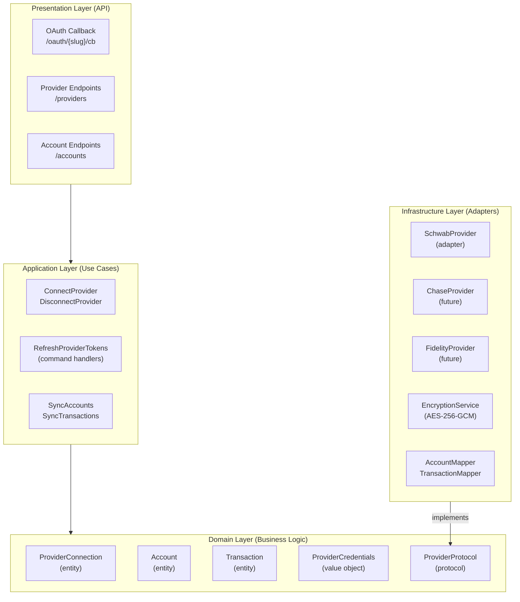
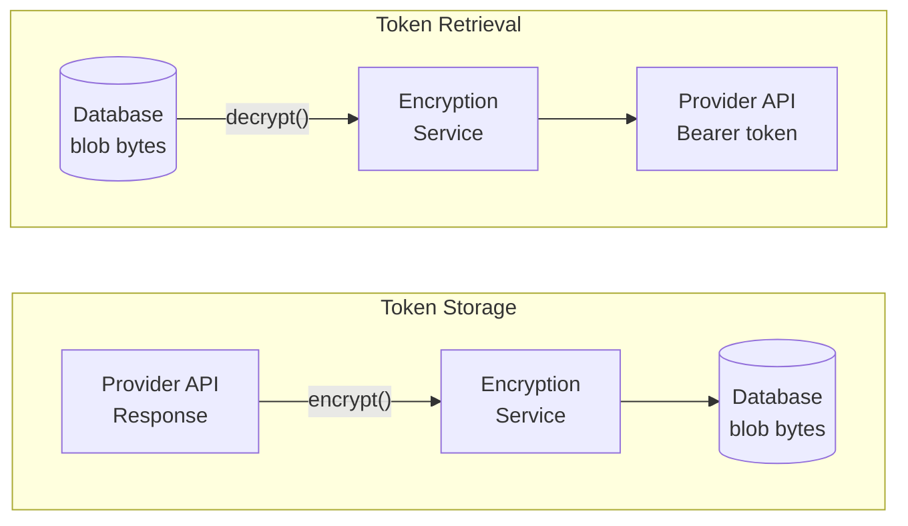
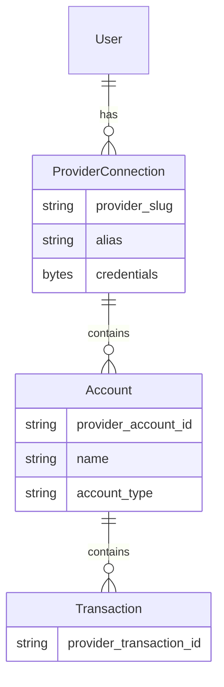

# Provider Integration Architecture

## Overview

**Purpose**: Define how Dashtam integrates with external financial providers (Schwab, Chase, Fidelity, etc.) using hexagonal architecture patterns.

**Problem**: Financial providers have different APIs, authentication mechanisms, and data formats. We need:

1. **Provider abstraction**: Single interface for all providers (hexagonal adapter pattern)
2. **Credential security**: Encrypted storage of sensitive tokens
3. **Multi-provider support**: Users can connect multiple providers
4. **Multi-account support**: Each provider connection can have multiple accounts

**Solution**: Define a `ProviderProtocol` in the domain layer (port), implement provider-specific adapters in infrastructure layer.

---

## Architecture Overview



---

## Design Decisions

### Decision 1: Protocol-Based Provider Abstraction

**Context**: Need a single interface for all financial providers regardless of their authentication mechanism or API structure.

**Decision**: Use Python `Protocol` (structural typing) to define `ProviderProtocol` in the domain layer.

**Why Protocol over ABC**:

- ✅ **Structural typing**: Implementations don't need inheritance
- ✅ **Pythonic**: Duck typing with type safety
- ✅ **Testable**: Easy to create test doubles
- ✅ **Flexible**: Providers can implement additional methods

```python
# src/domain/protocols/provider_protocol.py
from typing import Protocol
from src.core.result import Result
from src.core.errors import ProviderError

class ProviderProtocol(Protocol):
    """Port for financial provider adapters.
    
    Each provider implements this protocol to integrate with Dashtam.
    Methods return Result types (railway-oriented programming).
    """
    
    @property
    def slug(self) -> str:
        """Unique provider identifier (e.g., 'schwab', 'chase')."""
        ...
    
    async def exchange_code_for_tokens(
        self, 
        authorization_code: str,
    ) -> Result["OAuthTokens", ProviderError]:
        """Exchange OAuth authorization code for tokens.
        
        Returns:
            Success(OAuthTokens) if exchange successful.
            Failure(ProviderAuthenticationError) if code is invalid/expired.
            Failure(ProviderUnavailableError) if provider API is down.
        """
        ...
    
    async def refresh_access_token(
        self, 
        refresh_token: str,
    ) -> Result["OAuthTokens", ProviderError]:
        """Refresh access token using refresh token.
        
        Returns:
            Success(OAuthTokens) with new tokens.
            Failure(ProviderAuthenticationError) if refresh token is invalid/expired.
            Failure(ProviderUnavailableError) if provider API is down.
        """
        ...
    
    async def fetch_accounts(
        self, 
        access_token: str,
    ) -> Result[list["ProviderAccountData"], ProviderError]:
        """Fetch all accounts for the authenticated user.
        
        Returns:
            Success(list[ProviderAccountData]) with account data.
            Failure(ProviderAuthenticationError) if token is invalid/expired.
            Failure(ProviderUnavailableError) if provider API is down.
        """
        ...
    
    async def fetch_transactions(
        self,
        access_token: str,
        provider_account_id: str,
        start_date: date | None = None,
        end_date: date | None = None,
    ) -> Result[list["ProviderTransactionData"], ProviderError]:
        """Fetch transactions for a specific account.
        
        Returns:
            Success(list[ProviderTransactionData]) with transaction data.
            Failure(ProviderAuthenticationError) if token is invalid/expired.
            Failure(ProviderUnavailableError) if provider API is down.
        """
        ...
```

### Decision 2: Simple Factory Pattern for Provider Resolution

**Context**: Need to instantiate the correct provider adapter based on provider slug.

**Options Considered**:

1. **Decorator registry** (old Dashtam approach):

   ```python
   @register_provider(key="schwab", ...)
   class SchwabProvider: ...
   ```

   - ❌ Magic (hidden registration)
   - ❌ Import side effects
   - ❌ Hard to test

2. **Simple factory function** (chosen):

   ```python
   def get_provider(slug: str) -> ProviderProtocol:
       match slug:
           case "schwab": return SchwabProvider()
           case _: raise ProviderNotFoundError(slug)
   ```

   - ✅ **Explicit**: No hidden behavior
   - ✅ **Testable**: Easy to mock
   - ✅ **Consistent**: Matches existing container pattern

**Decision**: Simple factory in `container.py`

```python
# src/core/container.py
def get_provider(slug: str) -> ProviderProtocol:
    """Factory for provider adapters.
    
    Args:
        slug: Provider identifier (e.g., 'schwab', 'chase').
        
    Returns:
        Provider adapter implementing ProviderProtocol.
        
    Raises:
        ProviderNotFoundError: If provider slug is unknown.
    """
    from src.infrastructure.providers.schwab import SchwabProvider
    
    match slug:
        case "schwab":
            return SchwabProvider()
        case _:
            raise ProviderNotFoundError(f"Unknown provider: {slug}")
```

### Decision 3: Opaque Encrypted Credentials

**Context**: Provider credentials (access tokens, refresh tokens) must be stored securely.

**Decision**: Store credentials as opaque encrypted blobs using AES-256-GCM.

**Why This Approach**:

1. **Defense in depth**: Even if database is compromised, tokens are encrypted
2. **Auth-agnostic**: Domain layer doesn't know OAuth vs API key vs certificates
3. **Centralized**: Single encryption service for all providers

**Implementation**:

```python
# Domain value object (already exists)
@dataclass(frozen=True)
class ProviderCredentials:
    encrypted_data: bytes        # AES-256-GCM encrypted blob
    credential_type: CredentialType  # OAUTH2, API_KEY, etc.
    expires_at: datetime | None  # Token expiration (if applicable)

# Infrastructure encryption service (returns Result types)
class EncryptionService:
    @classmethod
    def create(cls, key: bytes) -> Result["EncryptionService", EncryptionKeyError]:
        """Factory with key validation."""
        ...
    
    def encrypt(self, data: dict) -> Result[bytes, EncryptionError]:
        """Encrypt credentials dict to bytes."""
        ...
    
    def decrypt(self, encrypted: bytes) -> Result[dict, EncryptionError]:
        """Decrypt bytes back to credentials dict."""
        ...
```

**Encryption Flow**:



---

## Credential Encryption Details

### Algorithm: AES-256-GCM

**Why AES-256-GCM**:

- ✅ **Authenticated**: Detects tampering (GCM provides integrity)
- ✅ **Industry standard**: NIST approved, widely audited
- ✅ **Fast**: Hardware acceleration on modern CPUs
- ✅ **Python support**: `cryptography` library (already a dependency)

### Implementation

The encryption service follows railway-oriented programming with Result types:

```python
# src/infrastructure/providers/encryption_service.py
from src.core.result import Result, Success, Failure
from src.core.enums import ErrorCode
from src.core.errors import DomainError

@dataclass(frozen=True, slots=True, kw_only=True)
class EncryptionError(DomainError):
    """Base encryption error (does NOT inherit from Exception)."""
    pass

class EncryptionService:
    """AES-256-GCM encryption for provider credentials."""
    
    IV_SIZE = 12  # 96 bits (NIST recommended for GCM)
    
    @classmethod
    def create(cls, key: bytes) -> Result["EncryptionService", EncryptionKeyError]:
        """Factory method with key validation.
        
        Returns:
            Success(EncryptionService) if key is valid.
            Failure(EncryptionKeyError) if key is invalid.
        """
        if len(key) != 32:
            return Failure(EncryptionKeyError(
                code=ErrorCode.ENCRYPTION_KEY_INVALID,
                message="Encryption key must be 32 bytes (256 bits)",
            ))
        return Success(cls(AESGCM(key)))
    
    def encrypt(self, data: dict) -> Result[bytes, EncryptionError]:
        """Encrypt credentials dictionary to bytes.
        
        Returns:
            Success(bytes) with IV || ciphertext || auth_tag.
            Failure(EncryptionError) if encryption fails.
        """
        ...
    
    def decrypt(self, encrypted: bytes) -> Result[dict, EncryptionError]:
        """Decrypt bytes back to credentials dictionary.
        
        Returns:
            Success(dict) with original credentials.
            Failure(DecryptionError) if decryption fails.
        """
        ...
```

**Usage with pattern matching**:

```python
match encryption_service.decrypt(encrypted_blob):
    case Success(credentials):
        access_token = credentials["access_token"]
    case Failure(error):
        logger.error(f"Decryption failed: {error.message}")
        # Handle error - user may need to re-authenticate
```

### Key Management

**Current (Development/MVP)**: Key from environment variable

```python
# src/core/config.py (already exists)
encryption_key: bytes = Field(
    description="32-byte AES-256 encryption key for provider credentials"
)

@field_validator("encryption_key", mode="before")
@classmethod
def validate_encryption_key(cls, v: str | bytes) -> bytes:
    if isinstance(v, str):
        key_bytes = v.encode("utf-8")
    else:
        key_bytes = v
    if len(key_bytes) != 32:
        raise ValueError("encryption_key must be exactly 32 bytes")
    return key_bytes
```

**Future (Production)**: AWS KMS or HashiCorp Vault

```python
# Future: KMS-backed encryption
class KMSEncryptionService:
    """AWS KMS envelope encryption.
    
    - Data key generated per encryption
    - Data key encrypted by KMS master key
    - Automatic key rotation
    """
    ...
```

---

## Multi-Provider / Multi-Account Support

### Data Model



### Use Cases

1. **Multiple providers**: User connects Schwab AND Chase
   - Two `ProviderConnection` records (different `provider_slug`)

2. **Multiple accounts per provider**: Schwab user has IRA + Brokerage
   - One `ProviderConnection`, two `Account` records

3. **Multiple connections to same provider**: User has personal + business Schwab
   - Two `ProviderConnection` records (same `provider_slug`, different `alias`)

### Uniqueness Constraints

```sql
-- User can have multiple connections to same provider (via alias)
UNIQUE (user_id, provider_slug, alias)

-- Each account is unique within a connection
UNIQUE (connection_id, provider_account_id)

-- Each transaction is unique within an account
UNIQUE (account_id, provider_transaction_id)
```

---

## Provider Data Types

### OAuthTokens (returned by provider)

```python
@dataclass(frozen=True)
class OAuthTokens:
    """OAuth tokens returned by provider after authentication.
    
    Note: refresh_token may be None if provider doesn't rotate tokens.
    """
    access_token: str
    refresh_token: str | None
    expires_in: int  # seconds until access_token expires
    token_type: str  # typically "Bearer"
    scope: str | None = None
```

### ProviderAccountData (raw provider response)

```python
@dataclass(frozen=True)
class ProviderAccountData:
    """Account data as returned by provider (before mapping to domain).
    
    Provider adapters return this; mappers convert to Account entity.
    """
    provider_account_id: str
    account_number_masked: str
    name: str
    account_type: str  # Provider's type string (mapped by AccountMapper)
    balance: Decimal
    available_balance: Decimal | None
    currency: str
    is_active: bool
    raw_data: dict  # Full provider response for metadata
```

### ProviderTransactionData (raw provider response)

```python
@dataclass(frozen=True)
class ProviderTransactionData:
    """Transaction data as returned by provider (before mapping to domain).
    
    Provider adapters return this; mappers convert to Transaction entity.
    """
    provider_transaction_id: str
    transaction_type: str  # Provider's type string
    subtype: str | None
    amount: Decimal
    currency: str
    description: str
    transaction_date: date
    settlement_date: date | None
    # Security details (for trades)
    symbol: str | None
    quantity: Decimal | None
    unit_price: Decimal | None
    commission: Decimal | None
    # Metadata
    status: str
    raw_data: dict
```

---

## Integration with Existing Infrastructure

### Domain Events (F0.10)

Provider operations emit domain events for audit trail and side effects:

| Event | When Emitted | Handlers |
|-------|--------------|----------|
| `ProviderConnectionAttempted` | OAuth flow started | Audit, Logging |
| `ProviderConnectionSucceeded` | Tokens stored | Audit, Logging, Email |
| `ProviderConnectionFailed` | Auth failed | Audit, Logging |
| `ProviderTokenRefreshAttempted` | Refresh started | Audit, Logging |
| `ProviderTokenRefreshSucceeded` | New tokens stored | Audit, Logging |
| `ProviderTokenRefreshFailed` | Refresh failed | Audit, Logging, Email |
| `ProviderDisconnectionAttempted` | User disconnects | Audit, Logging |
| `ProviderDisconnectionSucceeded` | Connection removed | Audit, Logging, Email |
| `ProviderDisconnectionFailed` | Disconnect failed | Audit, Logging |

### Audit Trail (F0.9)

All provider operations are audited:

```python
AuditAction.PROVIDER_CONNECTION_ATTEMPTED
AuditAction.PROVIDER_CONNECTED
AuditAction.PROVIDER_CONNECTION_FAILED
AuditAction.PROVIDER_TOKEN_REFRESH_ATTEMPTED
AuditAction.PROVIDER_TOKEN_REFRESHED
AuditAction.PROVIDER_TOKEN_REFRESH_FAILED
AuditAction.PROVIDER_DISCONNECTED
```

### Rate Limiting

OAuth callback endpoints are rate-limited to prevent abuse:

```python
# Suggested rate limits
RATE_LIMIT_RULES = {
    "GET /oauth/{slug}/authorize": RateLimitRule(capacity=10, refill_rate=1/60),  # 10/min
    "GET /oauth/{slug}/callback": RateLimitRule(capacity=5, refill_rate=1/60),   # 5/min
}
```

---

## File Structure

```text
src/
├── domain/
│   ├── protocols/
│   │   └── provider_protocol.py    # ProviderProtocol (port)
│   ├── entities/
│   │   └── provider_connection.py  # Already exists
│   └── value_objects/
│       └── provider_credentials.py # Already exists
│
├── infrastructure/
│   └── providers/
│       ├── encryption_service.py   # AES-256-GCM encryption
│       ├── provider_types.py       # OAuthTokens, ProviderAccountData, etc.
│       └── schwab/
│           ├── __init__.py
│           ├── schwab_provider.py  # Implements ProviderProtocol
│           ├── schwab_oauth.py     # OAuth helpers
│           ├── api/
│           │   ├── accounts_api.py
│           │   └── transactions_api.py
│           └── mappers/
│               ├── account_mapper.py
│               └── transaction_mapper.py
│
└── core/
    └── container.py                # get_provider() factory
```

---

## Adding a New Provider

To add a new provider (e.g., Chase):

1. **Create provider directory**:

   ```text
   src/infrastructure/providers/chase/
   ```

2. **Implement ProviderProtocol**:

   ```python
   class ChaseProvider:
       @property
       def slug(self) -> str:
           return "chase"
       
       async def exchange_code_for_tokens(self, code: str) -> OAuthTokens:
           # Chase OAuth token exchange
           ...
   ```

3. **Create mappers**:

   ```python
   class ChaseAccountMapper:
       def map(self, chase_data: dict) -> Account:
           # Map Chase account format to domain Account
           ...
   ```

4. **Register in factory**:

   ```python
   # src/core/container.py
   def get_provider(slug: str) -> ProviderProtocol:
       match slug:
           case "schwab": return SchwabProvider()
           case "chase": return ChaseProvider()  # Add new case
           case _: raise ProviderNotFoundError(slug)
   ```

5. **Add configuration**:

   ```python
   # src/core/config.py
   chase_api_key: str | None = None
   chase_api_secret: str | None = None
   chase_redirect_uri: str | None = None
   ```

---

**Created**: 2025-12-03 | **Last Updated**: 2025-12-05
