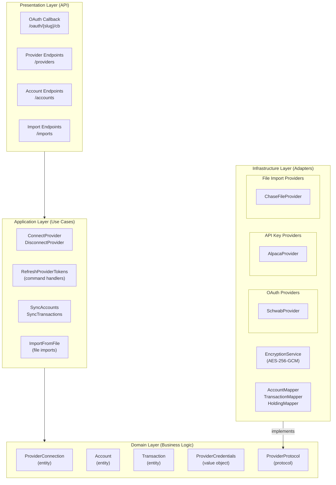
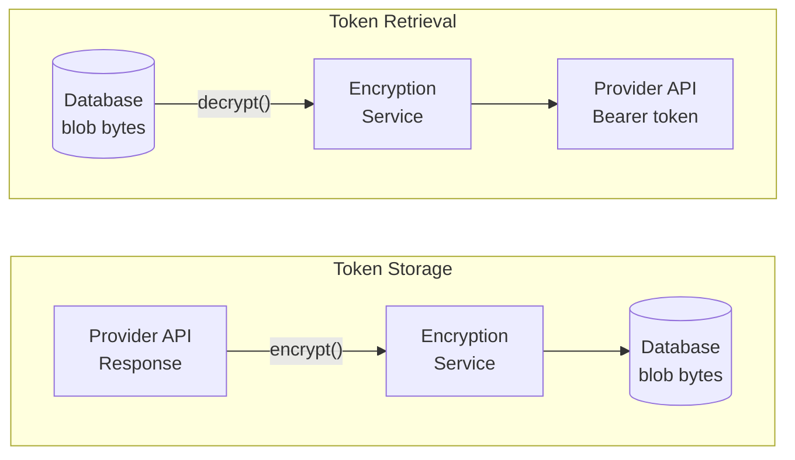
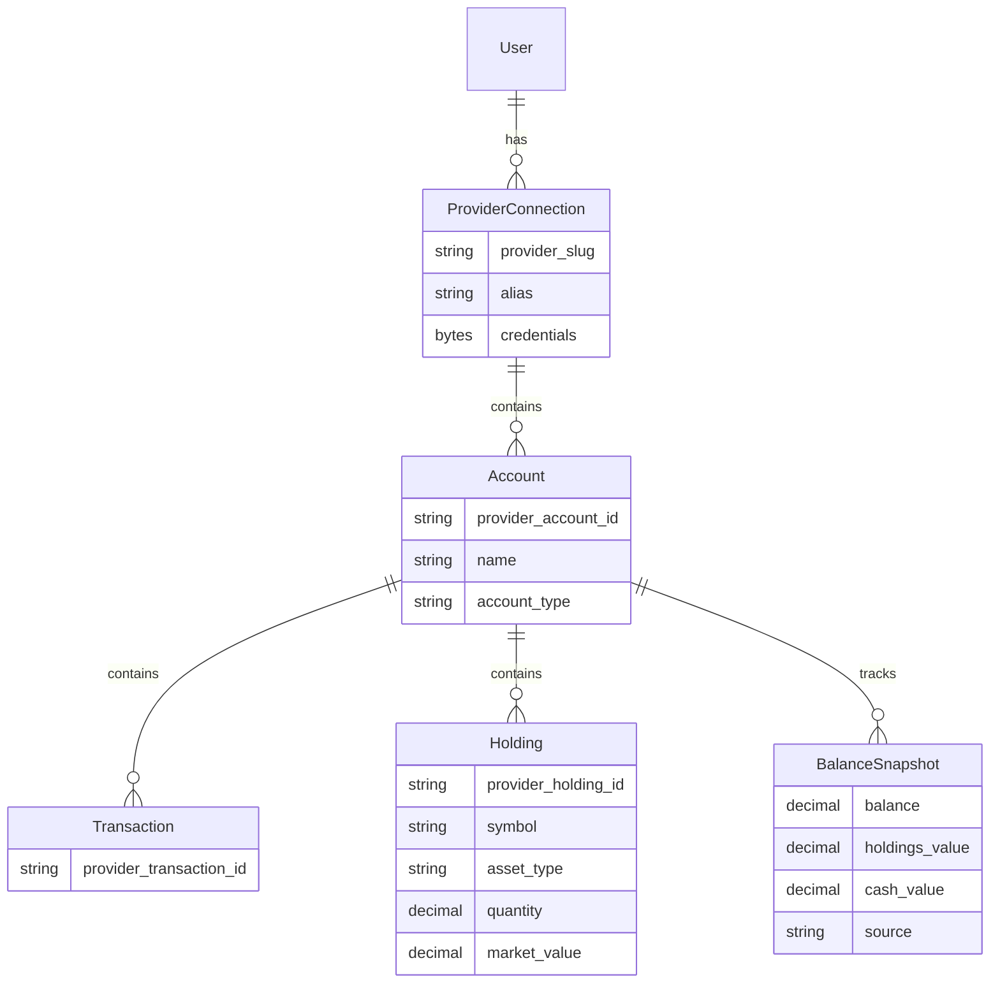

# Provider Integration Architecture

## Overview

**Purpose**: Define how Dashtam integrates with external financial providers (Schwab, Alpaca, Chase, etc.) using hexagonal architecture patterns.

**Problem**: Financial providers have different APIs, authentication mechanisms, and data formats. We need:

1. **Provider abstraction**: Single interface for all providers (hexagonal adapter pattern)
2. **Auth-agnostic design**: Same interface regardless of auth type (OAuth, API Key, etc.)
3. **Credential security**: Encrypted storage of sensitive tokens/keys
4. **Multi-provider support**: Users can connect multiple providers
5. **Multi-account support**: Each provider connection can have multiple accounts

**Solution**: Define an **auth-agnostic** `ProviderProtocol` in the domain layer (port), implement provider-specific adapters in infrastructure layer. OAuth-specific operations use an extended `OAuthProviderProtocol` with capability checking.

---

## Architecture Overview



### Provider Categories

| Category | Auth Type | Data Flow | Credential Type | Examples |
|----------|-----------|-----------|-----------------|----------|
| **OAuth** | OAuth 2.0 Authorization Code | Real-time API | `oauth2` | Schwab |
| **API Key** | API Key headers | Real-time API | `api_key` | Alpaca |
| **File Import** | File Upload | Manual import | `file_import` | Chase |

---

## Design Decisions

### Decision 1: Auth-Agnostic Provider Protocol

**Context**: Need a single interface for all financial providers regardless of their authentication mechanism (OAuth, API Key, Certificate, etc.) or API structure.

**Decision**: Use Python `Protocol` with **auth-agnostic** design:

1. **Base `ProviderProtocol`**: Only data-fetching methods (fetch_accounts, fetch_transactions, fetch_holdings)
2. **Extended `OAuthProviderProtocol`**: Adds OAuth-specific methods (exchange_code_for_tokens, refresh_access_token)
3. **TypeGuard capability checking**: `is_oauth_provider()` for runtime type narrowing

**Why Auth-Agnostic**:

- ✅ **Single interface**: Sync handlers work identically for OAuth and API Key providers
- ✅ **No leaky abstractions**: Handlers don't know or care about auth type
- ✅ **Extensible**: Easy to add new auth types (Certificate, Link Token, etc.)
- ✅ **Clean separation**: OAuth logic isolated to callbacks and token refresh

**Why Protocol over ABC**:

- ✅ **Structural typing**: Implementations don't need inheritance
- ✅ **Pythonic**: Duck typing with type safety
- ✅ **Testable**: Easy to create test doubles
- ✅ **Flexible**: Providers can implement additional methods

```python
# src/domain/protocols/provider_protocol.py
from typing import Any, Protocol
from src.core.result import Result
from src.core.errors import ProviderError

class ProviderProtocol(Protocol):
    """Auth-agnostic protocol for financial provider adapters.
    
    Each provider implements this protocol to integrate with Dashtam.
    Credentials are passed as opaque dict - provider extracts what it needs.
    Methods return Result types (railway-oriented programming).
    
    Credentials Dict Structure (by CredentialType):
        - OAUTH2: {"access_token": ..., "refresh_token": ..., "expires_at": ...}
        - API_KEY: {"api_key": ..., "api_secret": ...}
        - FILE_IMPORT: {"file_content": bytes, "file_format": str, "file_name": str}
        - LINK_TOKEN: {"access_token": ..., "item_id": ...}
    """
    
    @property
    def slug(self) -> str:
        """Unique provider identifier (e.g., 'schwab', 'alpaca')."""
        ...
    
    async def fetch_accounts(
        self, 
        credentials: dict[str, Any],
    ) -> Result[list["ProviderAccountData"], ProviderError]:
        """Fetch all accounts for the authenticated user.
        
        Args:
            credentials: Decrypted credentials dict. Provider extracts
                what it needs (access_token, api_key, etc.).
        
        Returns:
            Success(list[ProviderAccountData]) with account data.
            Failure(ProviderAuthenticationError) if credentials invalid.
            Failure(ProviderUnavailableError) if provider API is down.
        """
        ...
    
    async def fetch_transactions(
        self,
        credentials: dict[str, Any],
        provider_account_id: str,
        start_date: date | None = None,
        end_date: date | None = None,
    ) -> Result[list["ProviderTransactionData"], ProviderError]:
        """Fetch transactions for a specific account.
        
        Args:
            credentials: Decrypted credentials dict.
            provider_account_id: Provider's account identifier.
            start_date: Beginning of date range.
            end_date: End of date range.
        
        Returns:
            Success(list[ProviderTransactionData]) with transaction data.
            Failure(ProviderAuthenticationError) if credentials invalid.
            Failure(ProviderUnavailableError) if provider API is down.
        """
        ...
    
    async def fetch_holdings(
        self,
        credentials: dict[str, Any],
        provider_account_id: str,
    ) -> Result[list["ProviderHoldingData"], ProviderError]:
        """Fetch holdings (positions) for a specific account.
        
        Args:
            credentials: Decrypted credentials dict.
            provider_account_id: Provider's account identifier.
        
        Returns:
            Success(list[ProviderHoldingData]) with holding data.
            Failure(ProviderAuthenticationError) if credentials invalid.
            Failure(ProviderUnavailableError) if provider API is down.
        """
        ...


class OAuthProviderProtocol(ProviderProtocol, Protocol):
    """Extended protocol for OAuth 2.0 providers.
    
    Adds OAuth-specific methods for token exchange and refresh.
    Only OAuth providers (Schwab, Chase) implement this.
    API Key providers (Alpaca) only implement base ProviderProtocol.
    """
    
    async def exchange_code_for_tokens(
        self, 
        authorization_code: str,
    ) -> Result["OAuthTokens", ProviderError]:
        """Exchange OAuth authorization code for tokens."""
        ...
    
    async def refresh_access_token(
        self, 
        refresh_token: str,
    ) -> Result["OAuthTokens", ProviderError]:
        """Refresh access token using refresh token."""
        ...
```

### Decision 2: Factory with Capability Checking

**Context**: Need to instantiate providers and check their capabilities (OAuth vs API Key) at runtime.

**Decision**: Single factory function `get_provider()` with TypeGuard-based capability checking via `is_oauth_provider()`.

**Why This Approach**:

- ✅ **Single entry point**: All providers via `get_provider(slug)`
- ✅ **Type-safe**: TypeGuard narrows type after capability check
- ✅ **Explicit**: Caller decides when OAuth methods are needed
- ✅ **Clean**: Sync handlers don't need OAuth checks at all

```python
# src/core/container/providers.py
from typing import TypeGuard
from src.domain.providers.registry import (
    get_provider_metadata,
    get_oauth_providers,
    get_all_provider_slugs,
)

def get_provider(slug: Provider) -> ProviderProtocol:
    """Factory for provider adapters (Registry-Driven - F8.1).
    
    The Provider Integration Registry validates provider exists and required
    settings are present before instantiation.
    
    All providers implement the base ProviderProtocol.
    OAuth providers additionally implement OAuthProviderProtocol.
    
    Returns:
        Provider implementing ProviderProtocol.
        
    Raises:
        ValueError: If provider slug is unknown or not configured.
    """
    # Registry validation (before instantiation)
    metadata = get_provider_metadata(slug)  # Raises ValueError if not in registry
    
    # Settings validation via registry
    settings = get_settings()
    for setting in metadata.required_settings:
        if not hasattr(settings, setting) or not getattr(settings, setting):
            supported = ", ".join(p.value for p in get_all_provider_slugs())
            raise ValueError(
                f"Provider '{slug.value}' not configured. "
                f"Required settings: {metadata.required_settings}. "
                f"Supported providers: {supported}"
            )
    
    # Lazy instantiation via match/case
    match slug:
        # OAuth providers (implement OAuthProviderProtocol)
        case Provider.SCHWAB:
            return SchwabProvider(settings=settings)
        # API Key providers (base ProviderProtocol only)
        case Provider.ALPACA:
            return AlpacaProvider(settings=settings)
        # File Import providers (base ProviderProtocol only)
        case Provider.CHASE_FILE:
            return ChaseFileProvider()
        case _:
            # This should never happen (registry validation above)
            supported = ", ".join(p.value for p in get_all_provider_slugs())
            raise ValueError(
                f"Provider '{slug.value}' implementation missing. "
                f"Supported: {supported}"
            )

def is_oauth_provider(
    provider: ProviderProtocol,
) -> TypeGuard[OAuthProviderProtocol]:
    """Check if provider supports OAuth (Registry-Driven - F8.1).
    
    Uses Provider Integration Registry to determine OAuth capability.
    
    TypeGuard narrows type after check returns True.
    
    Usage:
        provider = get_provider(slug)
        if is_oauth_provider(provider):
            # Type is now OAuthProviderProtocol
            tokens = await provider.exchange_code_for_tokens(code)
    """
    return Provider(provider.slug) in get_oauth_providers()
```

**Registry Integration (v1.6.0)**:

Since v1.6.0, the container uses the **Provider Integration Registry** for validation:

- **Provider lookup**: `get_provider_metadata()` validates provider exists in registry
- **OAuth filtering**: `get_oauth_providers()` replaces manual `OAUTH_PROVIDERS` set
- **Settings validation**: Uses `metadata.required_settings` from registry
- **Error messages**: Automatically list all supported providers

See `docs/architecture/provider-registry-architecture.md` for complete registry documentation.

**Usage Patterns**:

```python
# Sync handlers (ALL providers - auth-agnostic)
provider = get_provider(connection.provider_slug)
result = await provider.fetch_accounts(credentials)  # Works for OAuth AND API Key

# OAuth callbacks (OAuth providers only)
provider = get_provider("schwab")
if is_oauth_provider(provider):
    tokens = await provider.exchange_code_for_tokens(code)
else:
    raise ValueError(f"Provider does not support OAuth")

# Token refresh (OAuth providers only)
provider = get_provider(connection.provider_slug)
if is_oauth_provider(provider):
    tokens = await provider.refresh_access_token(refresh_token)
else:
    # API Key providers don't need token refresh
    pass
```

### Decision 3: Opaque Encrypted Credentials

**Context**: Provider credentials (access tokens, refresh tokens) must be stored securely.

**Decision**: Store credentials as opaque encrypted blobs using AES-256-GCM.

**Why This Approach**:

1. **Defense in depth**: Even if database is compromised, tokens are encrypted
2. **Auth-agnostic**: Domain layer doesn't know OAuth vs API key vs certificates
3. **Centralized**: Single encryption service for all providers

**Implementation**:

```python
# Domain value object (already exists)
@dataclass(frozen=True)
class ProviderCredentials:
    encrypted_data: bytes        # AES-256-GCM encrypted blob
    credential_type: CredentialType  # OAUTH2, API_KEY, etc.
    expires_at: datetime | None  # Token expiration (if applicable)

# Infrastructure encryption service (returns Result types)
class EncryptionService:
    @classmethod
    def create(cls, key: bytes) -> Result["EncryptionService", EncryptionKeyError]:
        """Factory with key validation."""
        ...
    
    def encrypt(self, data: dict) -> Result[bytes, EncryptionError]:
        """Encrypt credentials dict to bytes."""
        ...
    
    def decrypt(self, encrypted: bytes) -> Result[dict, EncryptionError]:
        """Decrypt bytes back to credentials dict."""
        ...
```

**Encryption Flow**:



---

## Credential Encryption Details

### Algorithm: AES-256-GCM

**Why AES-256-GCM**:

- ✅ **Authenticated**: Detects tampering (GCM provides integrity)
- ✅ **Industry standard**: NIST approved, widely audited
- ✅ **Fast**: Hardware acceleration on modern CPUs
- ✅ **Python support**: `cryptography` library (already a dependency)

### Implementation

The encryption service follows railway-oriented programming with Result types:

```python
# src/infrastructure/providers/encryption_service.py
from src.core.result import Result, Success, Failure
from src.core.enums import ErrorCode
from src.core.errors import DomainError

@dataclass(frozen=True, slots=True, kw_only=True)
class EncryptionError(DomainError):
    """Base encryption error (does NOT inherit from Exception)."""
    pass

class EncryptionService:
    """AES-256-GCM encryption for provider credentials."""
    
    IV_SIZE = 12  # 96 bits (NIST recommended for GCM)
    
    @classmethod
    def create(cls, key: bytes) -> Result["EncryptionService", EncryptionKeyError]:
        """Factory method with key validation.
        
        Returns:
            Success(EncryptionService) if key is valid.
            Failure(EncryptionKeyError) if key is invalid.
        """
        if len(key) != 32:
            return Failure(EncryptionKeyError(
                code=ErrorCode.ENCRYPTION_KEY_INVALID,
                message="Encryption key must be 32 bytes (256 bits)",
            ))
        return Success(cls(AESGCM(key)))
    
    def encrypt(self, data: dict) -> Result[bytes, EncryptionError]:
        """Encrypt credentials dictionary to bytes.
        
        Returns:
            Success(bytes) with IV || ciphertext || auth_tag.
            Failure(EncryptionError) if encryption fails.
        """
        ...
    
    def decrypt(self, encrypted: bytes) -> Result[dict, EncryptionError]:
        """Decrypt bytes back to credentials dictionary.
        
        Returns:
            Success(dict) with original credentials.
            Failure(DecryptionError) if decryption fails.
        """
        ...
```

**Usage with pattern matching**:

```python
match encryption_service.decrypt(encrypted_blob):
    case Success(credentials):
        access_token = credentials["access_token"]
    case Failure(error):
        logger.error(f"Decryption failed: {error.message}")
        # Handle error - user may need to re-authenticate
```

### Key Management

**Current (Development/MVP)**: Key from environment variable

```python
# src/core/config.py (already exists)
encryption_key: bytes = Field(
    description="32-byte AES-256 encryption key for provider credentials"
)

@field_validator("encryption_key", mode="before")
@classmethod
def validate_encryption_key(cls, v: str | bytes) -> bytes:
    if isinstance(v, str):
        key_bytes = v.encode("utf-8")
    else:
        key_bytes = v
    if len(key_bytes) != 32:
        raise ValueError("encryption_key must be exactly 32 bytes")
    return key_bytes
```

**Future (Production)**: AWS KMS or HashiCorp Vault

```python
# Future: KMS-backed encryption
class KMSEncryptionService:
    """AWS KMS envelope encryption.
    
    - Data key generated per encryption
    - Data key encrypted by KMS master key
    - Automatic key rotation
    """
    ...
```

---

## Multi-Provider / Multi-Account Support

### Data Model



### Use Cases

1. **Multiple providers**: User connects Schwab AND Chase
   - Two `ProviderConnection` records (different `provider_slug`)

2. **Multiple accounts per provider**: Schwab user has IRA + Brokerage
   - One `ProviderConnection`, two `Account` records

3. **Multiple connections to same provider**: User has personal + business Schwab
   - Two `ProviderConnection` records (same `provider_slug`, different `alias`)

### Uniqueness Constraints

```sql
-- User can have multiple connections to same provider (via alias)
UNIQUE (user_id, provider_slug, alias)

-- Each account is unique within a connection
UNIQUE (connection_id, provider_account_id)

-- Each transaction is unique within an account
UNIQUE (account_id, provider_transaction_id)
```

---

## Provider Data Types

### OAuthTokens (returned by provider)

```python
@dataclass(frozen=True)
class OAuthTokens:
    """OAuth tokens returned by provider after authentication.
    
    Note: refresh_token may be None if provider doesn't rotate tokens.
    """
    access_token: str
    refresh_token: str | None
    expires_in: int  # seconds until access_token expires
    token_type: str  # typically "Bearer"
    scope: str | None = None
```

### ProviderAccountData (raw provider response)

```python
@dataclass(frozen=True)
class ProviderAccountData:
    """Account data as returned by provider (before mapping to domain).
    
    Provider adapters return this; mappers convert to Account entity.
    """
    provider_account_id: str
    account_number_masked: str
    name: str
    account_type: str  # Provider's type string (mapped by AccountMapper)
    balance: Decimal
    available_balance: Decimal | None
    currency: str
    is_active: bool
    raw_data: dict  # Full provider response for metadata
```

### ProviderTransactionData (raw provider response)

```python
@dataclass(frozen=True)
class ProviderTransactionData:
    """Transaction data as returned by provider (before mapping to domain).
    
    Provider adapters return this; mappers convert to Transaction entity.
    """
    provider_transaction_id: str
    transaction_type: str  # Provider's type string
    subtype: str | None
    amount: Decimal
    currency: str
    description: str
    transaction_date: date
    settlement_date: date | None
    # Security details (for trades)
    symbol: str | None
    quantity: Decimal | None
    unit_price: Decimal | None
    commission: Decimal | None
    # Metadata
    status: str
    raw_data: dict
```

### ProviderHoldingData (raw provider response)

```python
@dataclass(frozen=True)
class ProviderHoldingData:
    """Holding (position) data as returned by provider (before mapping to domain).
    
    Provider adapters return this; mappers convert to Holding entity.
    """
    provider_holding_id: str      # Provider's unique position identifier
    symbol: str                   # Security ticker symbol (e.g., "AAPL")
    security_name: str            # Full security name
    asset_type: str               # equity, etf, option, mutual_fund, etc.
    quantity: Decimal             # Number of shares/units
    cost_basis: Decimal           # Total cost paid for position
    market_value: Decimal         # Current market value
    currency: str                 # ISO 4217 currency code
    average_price: Decimal | None # Average price per share
    current_price: Decimal | None # Current market price per share
    raw_data: dict                # Full provider response
```

**Reference**: `src/domain/protocols/provider_protocol.py` for full type definitions.

---

## Integration with Existing Infrastructure

### Domain Events (F0.10)

Provider operations emit domain events for audit trail and side effects:

| Event | When Emitted | Handlers |
|-------|--------------|----------|
| `ProviderConnectionAttempted` | OAuth flow started | Audit, Logging |
| `ProviderConnectionSucceeded` | Tokens stored | Audit, Logging, Email |
| `ProviderConnectionFailed` | Auth failed | Audit, Logging |
| `ProviderTokenRefreshAttempted` | Refresh started | Audit, Logging |
| `ProviderTokenRefreshSucceeded` | New tokens stored | Audit, Logging |
| `ProviderTokenRefreshFailed` | Refresh failed | Audit, Logging, Email |
| `ProviderDisconnectionAttempted` | User disconnects | Audit, Logging |
| `ProviderDisconnectionSucceeded` | Connection removed | Audit, Logging, Email |
| `ProviderDisconnectionFailed` | Disconnect failed | Audit, Logging |

### Audit Trail (F0.9)

All provider operations are audited:

```python
AuditAction.PROVIDER_CONNECTION_ATTEMPTED
AuditAction.PROVIDER_CONNECTED
AuditAction.PROVIDER_CONNECTION_FAILED
AuditAction.PROVIDER_TOKEN_REFRESH_ATTEMPTED
AuditAction.PROVIDER_TOKEN_REFRESHED
AuditAction.PROVIDER_TOKEN_REFRESH_FAILED
AuditAction.PROVIDER_DISCONNECTED
```

### Rate Limiting

OAuth callback endpoints are rate-limited to prevent abuse:

```python
# Suggested rate limits
RATE_LIMIT_RULES = {
    "GET /oauth/{slug}/authorize": RateLimitRule(capacity=10, refill_rate=1/60),  # 10/min
    "GET /oauth/{slug}/callback": RateLimitRule(capacity=5, refill_rate=1/60),   # 5/min
}
```

---

## File Structure

```text
src/
├── domain/
│   ├── protocols/
│   │   └── provider_protocol.py    # ProviderProtocol (port)
│   ├── entities/
│   │   └── provider_connection.py  # Already exists
│   ├── enums/
│   │   └── credential_type.py      # OAUTH2, API_KEY, FILE_IMPORT
│   └── value_objects/
│       └── provider_credentials.py # Already exists
│
├── infrastructure/
│   └── providers/
│       ├── encryption_service.py   # AES-256-GCM encryption
│       ├── provider_types.py       # OAuthTokens, ProviderAccountData, etc.
│       │
│       ├── schwab/                  # OAuth Provider
│       │   ├── __init__.py
│       │   ├── schwab_provider.py  # Implements OAuthProviderProtocol
│       │   ├── schwab_oauth.py     # OAuth helpers
│       │   ├── api/
│       │   │   ├── accounts_api.py
│       │   │   ├── transactions_api.py
│       │   │   └── holdings_api.py
│       │   └── mappers/
│       │       ├── account_mapper.py
│       │       ├── transaction_mapper.py
│       │       └── holding_mapper.py
│       │
│       ├── alpaca/                  # API Key Provider
│       │   ├── __init__.py
│       │   ├── alpaca_provider.py  # Implements ProviderProtocol
│       │   ├── api/
│       │   │   ├── accounts_api.py
│       │   │   └── transactions_api.py
│       │   └── mappers/
│       │       ├── account_mapper.py
│       │       ├── transaction_mapper.py
│       │       └── holding_mapper.py
│       │
│       └── chase/                   # File Import Provider
│           ├── __init__.py
│           ├── chase_file_provider.py  # Implements ProviderProtocol
│           └── parsers/
│               ├── __init__.py
│               ├── qfx_parser.py   # QFX/OFX SGML parser
│               └── csv_parser.py   # CSV parser (checking + credit)
│
└── core/
    └── container/
        └── providers.py            # get_provider() factory
```

---

## Adding a New Provider

For comprehensive step-by-step guidance on adding new providers, see:

**[Adding New Providers Guide](../guides/adding-new-providers.md)**

The guide covers all three provider types with detailed phases:

### OAuth Providers (e.g., Schwab)

1. **Registry**: Add to `PROVIDER_REGISTRY` with `auth_type=OAUTH` (v1.6.0+)
2. Domain layer: Provider config in settings
3. Infrastructure: API clients, mappers, provider implementation
4. Container: Add provider case to `get_provider()` match statement
5. Application: OAuth flow handlers
6. Presentation: OAuth callback endpoints (auto-registered via registry)
7. Testing: Unit + integration + API tests

### API Key Providers (e.g., Alpaca)

1. **Registry**: Add to `PROVIDER_REGISTRY` with `auth_type=API_KEY` (v1.6.0+)
2. Domain layer: Provider config in settings
3. Infrastructure: API clients, mappers, provider implementation
4. Container: Add provider case to `get_provider()` match statement
5. Application: Reuse existing sync handlers
6. Presentation: Manual connection endpoint (no OAuth callback)
7. Testing: Unit + integration + API tests

### File Import Providers (e.g., Chase)

1. Domain layer: `FILE_IMPORT` credential type already exists
2. Infrastructure: File parsers (QFX, CSV), provider implementation
3. Container: Register in factory
4. Application: `ImportFromFile` command handler
5. Presentation: File upload endpoint (`POST /imports`)
6. Testing: Parser tests with sanitized fixtures

**Key Architectural Points**:

- All providers implement `ProviderProtocol` (auth-agnostic)
- OAuth providers additionally implement `OAuthProviderProtocol`
- File providers receive data via `credentials["file_content"]`
- Use `is_oauth_provider()` TypeGuard for capability checking

---

**Created**: 2025-12-03 | **Last Updated**: 2025-12-31
