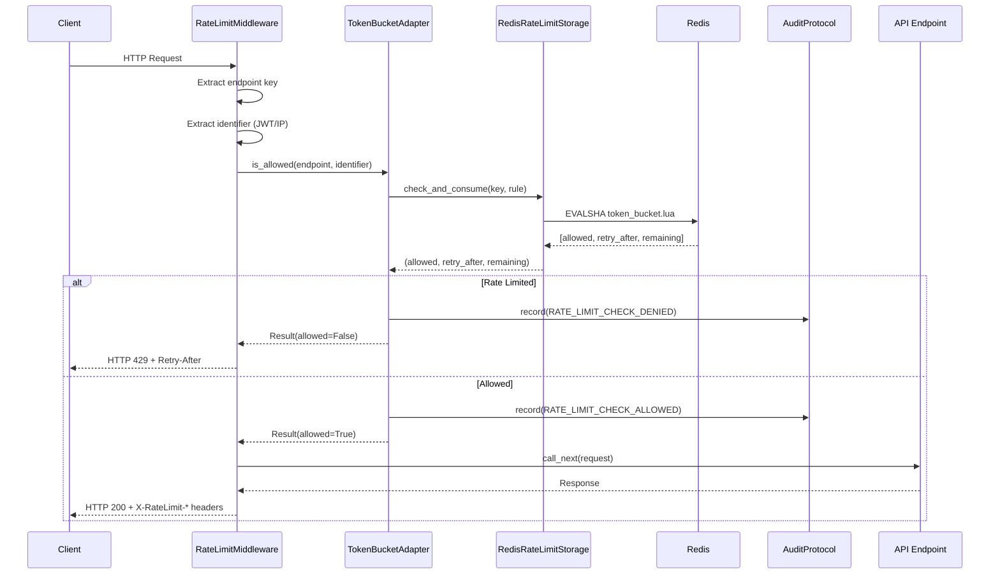

# Rate Limit Architecture

## 1. Overview

### Purpose

Provide production-ready, distributed rate limiting for Dashtam API endpoints using Token Bucket algorithm with Redis storage, integrated with hexagonal architecture and existing infrastructure (audit, logging, cache).

### Key Requirements

**Security First**:

- Protect authentication endpoints from brute force attacks (IP-scoped)
- Protect API endpoints from abuse (user-scoped)
- Protect provider APIs from excessive calls (user+provider scoped)
- Audit all rate limit violations (PCI-DSS compliance)

**Availability**:

- Fail-open design (never block requests if Redis fails)
- Sub-5ms latency for rate limit checks
- Atomic operations (no race conditions)

**Hexagonal Architecture**:

- Domain layer: `RateLimitProtocol` (port)
- Infrastructure layer: `TokenBucketAdapter`, `RedisRateLimitStorage` (adapters)
- Application layer: `rate_limit` dependency
- Presentation layer: `RateLimitMiddleware`

**Integration Requirements**:

- Use existing `CacheProtocol` infrastructure
- Use existing `AuditProtocol` for violation logging
- Use existing `LoggerProtocol` for structured logging
- Emit Domain Events for rate limit violations

---

## 2. Token Bucket Algorithm

### Decision: Token Bucket

**Why Token Bucket?**

- Allows bursts (better UX than fixed window)
- Smooth traffic (prevents timing attacks)
- Industry standard (AWS, Stripe, GitHub use this)
- Memory efficient (2 values per key: tokens + last_refill_time)

**Why not alternatives?**

| Algorithm | Pros | Cons | Decision |
|-----------|------|------|----------|
| Token Bucket | Burst capacity, smooth refills | Slightly complex | ✅ Selected |
| Fixed Window | Simple | Boundary burst attacks | ❌ Rejected |
| Sliding Window Log | Precise | High memory (timestamps) | ❌ Rejected |
| Leaky Bucket | Smooth output | No burst capacity | ❌ Rejected |

### How Token Bucket Works

```text
┌─────────────────────────────────────────────────────────────┐
│                 Token Bucket Algorithm                      │
├─────────────────────────────────────────────────────────────┤
│                                                             │
│   Configuration:                                            │
│   - max_tokens: 20 (bucket capacity)                        │
│   - refill_rate: 5.0 (tokens per minute)                    │
│                                                             │
│   ┌──────────────┐                                          │
│   │ Token Bucket │ ◄─── Refill: 1 token every 12 seconds    │
│   │              │                                          │
│   │  ████████    │  Current: 8 tokens                       │
│   │  ████████    │                                          │
│   │              │  Capacity: 20 tokens                     │
│   └──────┬───────┘                                          │
│          │                                                  │
│          ▼                                                  │
│   Request arrives (cost=1):                                 │
│   - If tokens >= cost: ALLOW, consume tokens                │
│   - If tokens < cost: DENY, return retry_after              │
│                                                             │
│   Burst Example:                                            │
│   - 20 requests arrive at once                              │
│   - All 20 allowed (burst capacity)                         │
│   - Request 21 denied, retry_after=12s                      │
│                                                             │
└─────────────────────────────────────────────────────────────┘
```

**Token Bucket Formula**:

```python
# Calculate current tokens
elapsed_seconds = now - last_refill_time
tokens_to_add = elapsed_seconds * (refill_rate / 60.0)
current_tokens = min(tokens + tokens_to_add, max_tokens)

# Check if allowed
if current_tokens >= cost:
    new_tokens = current_tokens - cost
    return (True, 0.0)  # Allowed
else:
    tokens_needed = cost - current_tokens
    retry_after = tokens_needed / (refill_rate / 60.0)
    return (False, retry_after)  # Denied
```

---

## 3. Redis Storage with Lua Scripts

### Decision: Atomic Lua Scripts

**Why Lua Scripts?**

- Atomicity: Script runs inside Redis (no race conditions)
- Performance: Single Redis roundtrip (~2-3ms)
- Correctness: Check-and-consume happens atomically
- Simplicity: No WATCH/MULTI/EXEC complexity

**Why not alternatives?**

| Approach | Pros | Cons | Decision |
|----------|------|------|----------|
| Lua Script | Atomic, fast | Learning curve | ✅ Selected |
| WATCH/MULTI | Native Redis | Race conditions | ❌ Rejected |
| Multiple GETs | Simple | Not atomic | ❌ Rejected |
| PostgreSQL | Persistent | Too slow (~10ms) | ❌ Rejected |

### Lua Script Implementation

```lua
-- token_bucket.lua
-- KEYS[1]: Redis key for bucket (e.g., "rate_limit:ip:192.168.1.1:login")
-- ARGV[1]: max_tokens (bucket capacity)
-- ARGV[2]: refill_rate (tokens per minute)
-- ARGV[3]: cost (tokens to consume)
-- ARGV[4]: current_timestamp (seconds since epoch)
-- Returns: [allowed (0/1), retry_after, remaining_tokens]

local tokens_key = KEYS[1] .. ":tokens"
local time_key = KEYS[1] .. ":time"

local max_tokens = tonumber(ARGV[1])
local refill_rate = tonumber(ARGV[2])
local cost = tonumber(ARGV[3])
local now = tonumber(ARGV[4])

-- Get current state
local current_tokens = tonumber(redis.call("GET", tokens_key))
local last_refill_time = tonumber(redis.call("GET", time_key))

-- Initialize if first request
if not current_tokens or not last_refill_time then
    current_tokens = max_tokens
    last_refill_time = now
end

-- Calculate tokens to refill
local elapsed_seconds = now - last_refill_time
local tokens_to_add = elapsed_seconds * (refill_rate / 60.0)
current_tokens = math.min(current_tokens + tokens_to_add, max_tokens)

-- TTL = time to refill + 60s buffer
local ttl = math.ceil((max_tokens / refill_rate) * 60) + 60

if current_tokens >= cost then
    -- Allowed: consume tokens
    local new_tokens = current_tokens - cost
    redis.call("SETEX", tokens_key, ttl, new_tokens)
    redis.call("SETEX", time_key, ttl, now)
    return {1, 0, math.floor(new_tokens)}
else
    -- Denied: calculate retry_after
    local tokens_needed = cost - current_tokens
    local retry_after = tokens_needed / (refill_rate / 60.0)
    redis.call("SETEX", tokens_key, ttl, current_tokens)
    redis.call("SETEX", time_key, ttl, now)
    return {0, retry_after, math.floor(current_tokens)}
end
```

### Redis Key Structure

```text
rate_limit:{scope}:{identifier}:{endpoint}:tokens  → float (current tokens)
rate_limit:{scope}:{identifier}:{endpoint}:time    → float (last refill timestamp)

Examples:
- rate_limit:ip:192.168.1.1:POST /api/v1/auth/login:tokens
- rate_limit:user:abc-123:GET /api/v1/accounts:tokens
- rate_limit:user_provider:abc-123:schwab:sync:tokens
```

---

## 4. Hexagonal Architecture Integration

### Layer Responsibilities

```text
┌─────────────────────────────────────────────────────────────┐
│ Presentation Layer (FastAPI)                                │
│ ┌─────────────────────────────────────────────────────────┐ │
│ │  RateLimitMiddleware                                    │ │
│ │  - Intercepts all HTTP requests                         │ │
│ │  - Extracts endpoint key and identifier                 │ │
│ │  - Returns HTTP 429 with Retry-After header             │ │
│ │  - Adds X-RateLimit-* headers to responses              │ │
│ └───────────────────────────┬─────────────────────────────┘ │
└─────────────────────────────┼───────────────────────────────┘
                              │ uses
                              ↓
┌─────────────────────────────────────────────────────────────┐
│ Application Layer                                           │
│ ┌─────────────────────────────────────────────────────────┐ │
│ │  rate_limit Dependency                                  │ │
│ │  - FastAPI Depends() for endpoint-level rate limits     │ │
│ │  - Publishes RateLimitViolation domain events           │ │
│ └───────────────────────────┬─────────────────────────────┘ │
└─────────────────────────────┼───────────────────────────────┘
                              │ uses
                              ↓
┌─────────────────────────────────────────────────────────────┐
│ Domain Layer (Protocols)                                    │
│ ┌─────────────────────────────────────────────────────────┐ │
│ │  RateLimitProtocol (PORT)                               │ │
│ │  - is_allowed(endpoint, identifier, cost) -> Result     │ │
│ │  - get_remaining(endpoint, identifier) -> Result        │ │
│ │  - reset(endpoint, identifier) -> Result                │ │
│ └───────────────────────────┬─────────────────────────────┘ │
│                             │                               │
│ ┌─────────────────────────────────────────────────────────┐ │
│ │  RateLimitRule (Value Object)                           │ │
│ │  - max_tokens, refill_rate, scope, cost, enabled        │ │
│ └─────────────────────────────────────────────────────────┘ │
│                             │                               │
│ ┌─────────────────────────────────────────────────────────┐ │
│ │  RateLimitScope (Enum)                                  │ │
│ │  - IP, USER, USER_PROVIDER, GLOBAL                      │ │
│ └─────────────────────────────────────────────────────────┘ │
└─────────────────────────────┼───────────────────────────────┘
                              ↑ implements
                              │
┌─────────────────────────────────────────────────────────────┐
│ Infrastructure Layer                                        │
│ ┌─────────────────────────────────────────────────────────┐ │
│ │  TokenBucketAdapter (ADAPTER)                           │ │
│ │  - Implements RateLimitProtocol                         │ │
│ │  - Coordinates storage, audit, logging                  │ │
│ │  - Fail-open error handling                             │ │
│ └───────────────────────────┬─────────────────────────────┘ │
│                             │ uses                          │
│ ┌─────────────────────────────────────────────────────────┐ │
│ │  RedisStorage                                           │ │
│ │  - Executes Lua scripts for atomic operations           │ │
│ │  - Uses existing Redis connection (via CacheProtocol)   │ │
│ │  - TTL-based automatic cleanup                          │ │
│ └───────────────────────────┬─────────────────────────────┘ │
│                             │ uses                          │
│ ┌─────────────────────────────────────────────────────────┐ │
│ │  RateLimitConfig (SSOT)                                 │ │
│ │  - Per-endpoint rate limit rules                        │ │
│ │  - Scope configuration                                  │ │
│ └─────────────────────────────────────────────────────────┘ │
└─────────────────────────────────────────────────────────────┘
```

### Integration with Existing Infrastructure

```text
┌─────────────────────────────────────────────────────────────┐
│                 Rate Limit Integration                      │
├─────────────────────────────────────────────────────────────┤
│                                                             │
│   TokenBucketAdapter                                        │
│         │                                                   │
│         ├──► LoggerProtocol                                 │
│         │    - Structured logging of all decisions          │
│         │    - Execution time tracking                      │
│         │                                                   │
│         ├──► AuditProtocol                                  │
│         │    - RATE_LIMIT_CHECK_ATTEMPTED                   │
│         │    - RATE_LIMIT_CHECK_ALLOWED                     │
│         │    - RATE_LIMIT_CHECK_DENIED                      │
│         │                                                   │
│         ├──► EventBusProtocol                               │
│         │    - RateLimitCheckAttempted                      │
│         │    - RateLimitCheckSucceeded/Failed               │
│         │                                                   │
│         └──► Redis                                          │
│              - Direct redis-py client for Lua scripts       │
│              - Separate from CacheProtocol (different ops)  │
│                                                             │
└─────────────────────────────────────────────────────────────┘
```

---

## 5. Rate Limit Rules Configuration

### Single Source of Truth (SSOT)

```python
# src/infrastructure/rate_limit/config.py

RATE_LIMIT_RULES: dict[str, RateLimitRule] = {
    # Authentication endpoints (IP-scoped, restrictive)
    "POST /api/v1/auth/login": RateLimitRule(
        max_tokens=5,
        refill_rate=5.0,  # 5 tokens/min = 1 per 12 seconds
        scope=RateLimitScope.IP,
        cost=1,
        enabled=True,
    ),
    "POST /api/v1/auth/register": RateLimitRule(
        max_tokens=3,
        refill_rate=3.0,  # 3 tokens/min
        scope=RateLimitScope.IP,
        cost=1,
        enabled=True,
    ),
    "POST /api/v1/auth/password-reset": RateLimitRule(
        max_tokens=3,
        refill_rate=3.0,
        scope=RateLimitScope.IP,
        cost=1,
        enabled=True,
    ),
    
    # User API endpoints (user-scoped, generous)
    "GET /api/v1/accounts": RateLimitRule(
        max_tokens=100,
        refill_rate=100.0,  # 100 tokens/min
        scope=RateLimitScope.USER,
        cost=1,
        enabled=True,
    ),
    "GET /api/v1/transactions": RateLimitRule(
        max_tokens=100,
        refill_rate=100.0,
        scope=RateLimitScope.USER,
        cost=1,
        enabled=True,
    ),
    
    # Provider sync (user+provider scoped, expensive)
    "POST /api/v1/providers/{provider_id}/sync": RateLimitRule(
        max_tokens=10,
        refill_rate=10.0,  # 10 syncs/min per user per provider
        scope=RateLimitScope.USER_PROVIDER,
        cost=1,
        enabled=True,
    ),
}
```

### Scope Types

| Scope | Key Format | Use Case |
|-------|------------|----------|
| `IP` | `ip:{address}:{endpoint}` | Unauthenticated endpoints (login) |
| `USER` | `user:{user_id}:{endpoint}` | Authenticated API endpoints |
| `USER_PROVIDER` | `user_provider:{user_id}:{provider}:{endpoint}` | Provider-specific operations |
| `GLOBAL` | `global:{endpoint}` | System-wide limits (rare) |

### Variable Cost

```python
# Expensive operations cost more tokens
"POST /api/v1/reports/generate": RateLimitRule(
    max_tokens=10,
    refill_rate=10.0,
    scope=RateLimitScope.USER,
    cost=5,  # Costs 5 tokens (expensive operation)
    enabled=True,
)
```

---

## 6. Fail-Open Strategy

### Design Philosophy

Rate limit failures MUST NEVER cause denial-of-service. The system fails open at every layer.

```text
┌─────────────────────────────────────────────────────────────┐
│                 Fail-Open Architecture                      │
├─────────────────────────────────────────────────────────────┤
│                                                             │
│   Layer 1: Middleware                                       │
│   ┌─────────────────────────────────────────────────────┐   │
│   │ try:                                                │   │
│   │     result = rate_limit.is_allowed(...)             │   │
│   │ except Exception:                                   │   │
│   │     logger.error("Rate limit failed")               │   │
│   │     return await call_next(request)  # ALLOW        │   │
│   └─────────────────────────────────────────────────────┘   │
│                                                             │
│   Layer 2: TokenBucketAdapter                               │
│   ┌─────────────────────────────────────────────────────┐   │
│   │ try:                                                │   │
│   │     result = storage.check_and_consume(...)         │   │
│   │ except Exception:                                   │   │
│   │     logger.error("Algorithm failed")                │   │
│   │     return Success(RateLimitResult(allowed=True))   │   │
│   └─────────────────────────────────────────────────────┘   │
│                                                             │
│   Layer 3: RedisRateLimitStorage                            │
│   ┌─────────────────────────────────────────────────────┐   │
│   │ try:                                                │   │
│   │     result = redis.evalsha(lua_script, ...)         │   │
│   │ except RedisError:                                  │   │
│   │     logger.error("Redis failed")                    │   │
│   │     return (True, 0.0, max_tokens)  # ALLOW         │   │
│   └─────────────────────────────────────────────────────┘   │
│                                                             │
│   Layer 4: Audit Logging                                    │
│   ┌─────────────────────────────────────────────────────┐   │
│   │ try:                                                │   │
│   │     audit.record(RATE_LIMIT_CHECK_DENIED, ...)      │   │
│   │ except Exception:                                   │   │
│   │     logger.error("Audit failed")                    │   │
│   │     # Continue without audit (don't block)          │   │
│   └─────────────────────────────────────────────────────┘   │
│                                                             │
└─────────────────────────────────────────────────────────────┘
```

### Fail-Open Logging

All fail-open events are logged for monitoring:

```python
logger.error(
    "Rate limit fail-open",
    extra={
        "endpoint": endpoint,
        "identifier": identifier,
        "error": str(e),
        "layer": "storage",  # middleware, adapter, storage, audit
        "result": "fail_open",
    },
)
```

**Alert Threshold**: If fail_open events > 10/minute, trigger ops alert (rate limit degraded).

---

## 7. HTTP Response Headers

### Rate Limit Headers (RFC 6585)

**On Allowed Requests**:

```http
HTTP/1.1 200 OK
X-RateLimit-Limit: 100
X-RateLimit-Remaining: 87
X-RateLimit-Reset: 60
```

**On Rate Limited Requests**:

```http
HTTP/1.1 429 Too Many Requests
Retry-After: 12
X-RateLimit-Limit: 5
X-RateLimit-Remaining: 0
X-RateLimit-Reset: 12
Content-Type: application/json

{
    "type": "{api_base_url}/errors/rate-limit-exceeded",
    "title": "Rate Limit Exceeded",
    "status": 429,
    "detail": "Too many requests. Please try again in 12 seconds.",
    "instance": "/api/v1/auth/login",
    "retry_after": 12
}
```

> **Note**: `{api_base_url}` is dynamically set from `settings.api_base_url` (e.g., `https://api.dashtam.local` in dev, `https://api.dashtam.com` in prod).

### Header Definitions

| Header | Description |
|--------|-------------|
| `Retry-After` | Seconds until retry allowed (RFC 6585) |
| `X-RateLimit-Limit` | Maximum requests in window |
| `X-RateLimit-Remaining` | Requests remaining |
| `X-RateLimit-Reset` | Seconds until bucket fully refills |

---

## 8. Domain Events

### Event Definitions

```python
# src/domain/events/rate_limit_events.py

@dataclass(frozen=True, kw_only=True)
class RateLimitCheckAttempted(DomainEvent):
    """Emitted before rate limit check."""
    endpoint: str
    identifier: str
    scope: str
    cost: int

@dataclass(frozen=True, kw_only=True)
class RateLimitCheckAllowed(DomainEvent):
    """Emitted when request is allowed."""
    endpoint: str
    identifier: str
    scope: str
    remaining_tokens: int
    execution_time_ms: float

@dataclass(frozen=True, kw_only=True)
class RateLimitCheckDenied(DomainEvent):
    """Emitted when request is rate limited."""
    endpoint: str
    identifier: str
    scope: str
    retry_after: float
    execution_time_ms: float
```

### Event Handlers

```text
RateLimitCheckDenied
    ├──► LoggingEventHandler    → Structured log (WARNING)
    ├──► AuditEventHandler      → Audit record (compliance)
    └──► AlertEventHandler      → (future) Slack/PagerDuty alerts
```

---

## 9. Audit Trail Integration

### Audit Actions

```python
# Add to src/domain/enums/audit_action.py

# Rate Limiter audit actions (ATTEMPT → OUTCOME pattern)
RATE_LIMIT_CHECK_ATTEMPTED = "rate_limit_check_attempted"
RATE_LIMIT_CHECK_ALLOWED = "rate_limit_check_allowed"
RATE_LIMIT_CHECK_DENIED = "rate_limit_check_denied"
```

### Audit Record Example

```json
{
    "action": "RATE_LIMIT_CHECK_DENIED",
    "resource_type": "rate_limit",
    "resource_id": "POST /api/v1/auth/login",
    "user_id": null,
    "ip_address": "203.0.113.42",
    "metadata": {
        "scope": "ip",
        "identifier": "ip:203.0.113.42",
        "retry_after": 12.5,
        "limit": 5,
        "remaining": 0
    }
}
```

---

## 10. Request Flow

### Complete Flow Diagram



### Latency Breakdown

| Stage | Operation | Latency (p95) |
|-------|-----------|---------------|
| 1 | Middleware entry | <0.1ms |
| 2 | Endpoint key extraction | <0.5ms |
| 3 | Identifier extraction (JWT) | 1-2ms |
| 4 | Redis Lua execution | 2-3ms |
| 5 | Audit logging (async) | Non-blocking |
| **Total** | **Allowed path** | **~5ms** |

---

## 11. Security Considerations

### Threats Addressed

| Threat | Mitigation |
|--------|------------|
| Brute force login | IP-scoped limits (5/min) |
| API abuse | User-scoped limits (100/min) |
| Provider API exhaustion | User+provider scoped limits |
| DDoS amplification | Per-endpoint limits |

### Security Best Practices

- **IP extraction**: Handle X-Forwarded-For properly (take first IP)
- **Identifier sanitization**: Validate UUIDs, sanitize IPs
- **No sensitive data in logs**: Log identifier hashes if needed
- **Audit trail**: All violations logged for forensics

---

## 12. Testing Strategy

### Unit Tests

- `test_infrastructure_token_bucket.py` - Algorithm logic (20+ tests)
- `test_domain_rate_limit_rule.py` - Value object validation (10+ tests)
- `test_domain_rate_limit_scope.py` - Key building (15+ tests)

### Integration Tests

- `test_infrastructure_redis_rate_limit_storage.py` - Lua script execution (20+ tests)
- `test_infrastructure_token_bucket_adapter.py` - Full adapter flow (15+ tests)

### API Tests

- `test_rate_limit_middleware.py` - HTTP 429 responses (15+ tests)
- `test_rate_limit_headers.py` - Header correctness (10+ tests)

### Coverage Target

- 85%+ overall coverage
- 95%+ for Lua script logic (critical path)

---

## 13. File Structure

```text
src/domain/
├── protocols/
│   └── rate_limit_protocol.py      # RateLimitProtocol
├── value_objects/
│   └── rate_limit_rule.py          # RateLimitRule value object
├── enums/
│   └── rate_limit_scope.py         # RateLimitScope enum (single source)
├── errors/
│   └── rate_limit_error.py         # RateLimitError domain error
└── events/
    └── rate_limit_events.py        # Domain events

src/infrastructure/
└── rate_limit/
    ├── __init__.py
    ├── token_bucket_adapter.py     # TokenBucketAdapter (implements RateLimitProtocol)
    ├── redis_storage.py            # RedisStorage (atomic Lua operations)
    ├── config.py                   # RATE_LIMIT_RULES (SSOT)
    └── lua_scripts/
        └── token_bucket.lua        # Atomic Lua script

src/presentation/
└── api/
    └── middleware/
        └── rate_limit_middleware.py # RateLimitMiddleware (Starlette)

src/application/
└── dependencies/
    └── rate_limit.py               # rate_limit FastAPI dependency

tests/
├── unit/
│   ├── test_domain_rate_limit_rule.py
│   ├── test_domain_rate_limit_scope.py
│   └── test_infrastructure_token_bucket.py
├── integration/
│   ├── test_infrastructure_redis_rate_limit_storage.py
│   └── test_infrastructure_token_bucket_adapter.py
└── api/
    ├── test_rate_limit_middleware.py
    └── test_rate_limit_headers.py
```

---

## 14. Future Enhancements

- **Dynamic rule updates**: Hot-reload rules without restart
- **Sliding window**: Additional algorithm option
- **Circuit breaker**: Automatic backoff for repeat offenders
- **Dashboard**: Admin UI for viewing rate limit status
- **Distributed Redis**: Redis Cluster support for higher scale

---

**Created**: 2025-11-28 | **Last Updated**: 2025-12-05
