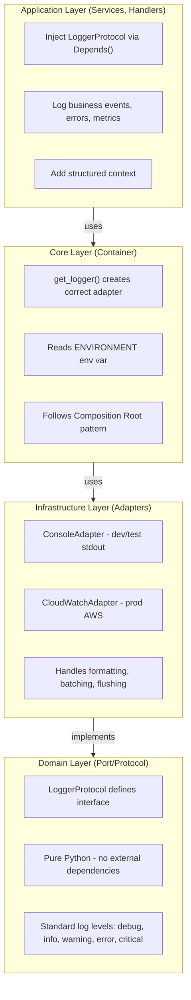

# Structured Logging Architecture

## Overview

This document describes the structured logging implementation for Dashtam,
following hexagonal architecture principles with clear separation between
domain protocols and infrastructure adapters. The architecture provides
environment-agnostic logging with support for multiple backends (console for
development, CloudWatch for production) while maintaining strict security
standards and comprehensive observability.

**Key Distinction**: This is **technical logging** for debugging and monitoring.
For compliance audit trails, see `audit-trail-architecture.md`. For workflow
coordination, see `domain-events-architecture.md`.

---

## 1. Key Principles

### 1.1 Core Principles

- ✅ **Hexagonal Architecture**: Domain defines protocol (port), infrastructure
  provides adapters
- ✅ **Structured Logging**: JSON format with key-value context (NOT f-strings)
- ✅ **Trace Correlation**: OpenTelemetry trace_id in ALL logs (mandatory)
- ✅ **Environment Abstraction**: Same code works across all environments
  (dev/test/prod)
- ✅ **Dependency Injection**: Container pattern selects correct adapter via
  `ENVIRONMENT`
- ✅ **Security First**: NEVER log passwords, tokens, API keys, SSNs, credit
  cards
- ✅ **Performance**: Async logging, non-blocking, minimal overhead

### 1.2 Logging vs Audit vs Events

Three **separate** concerns with different purposes:

| Concern | Purpose | Storage | Retention | Layer |
| ------- | ------- | ------- | --------- | -------------- |
| **Logging** | Technical debugging | CloudWatch | 30-90 days | Infrastructure |
| **Audit** | Compliance forensics | PostgreSQL | 7+ years | Domain |
| **Events** | Workflow coordination | In-memory | N/A | Domain |

**Why separate?**

- Different retention requirements (30 days vs 7+ years)
- Different query patterns (grep logs vs SQL audit queries)
- Different compliance needs (optional vs PCI-DSS required)
- Different access controls (engineers vs auditors)

### 1.3 Multi-Tier Strategy

| Environment | Backend | Output | Use Case |
| ----------- | ---------- | ------ | ------------------------ |
| **Local Development** | Console | stdout | Fast colorized |
| **Testing** | Console | stdout (JSON) | CI/CD integration |
| **CI/CD** | Console | stdout (JSON) | GitHub Actions logs |
| **Staging** | CloudWatch | AWS | Production monitoring |
| **Production** | CloudWatch | AWS | Monitoring alerting |

---

## 2. Hexagonal Architecture

### 2.1 Layer Responsibilities



### 2.2 Dependency Flow

- **Domain** → Defines `LoggerProtocol` (no dependencies)
- **Infrastructure** → Implements protocol with adapters (structlog, boto3)
- **Core/Container** → Creates correct adapter based on configuration
- **Application** → Consumes logger via protocol (backend-agnostic)

**Benefits**:

- Domain layer remains pure (no logging framework imports)
- Easy to add new backends (Datadog, ELK, Sentry)
- Testable (mock protocol, no complex setup)
- Configuration-driven (change backend via env var)

### 2.3 Why the logger API is synchronous

- Call sites stay simple (no await in domain/application/presentation).
- Works in both sync and async contexts (startup hooks, background threads, tests).
- Async/IO work is hidden behind adapters:
  - ConsoleAdapter writes to stdout quickly (dev/test).
  - CloudWatchAdapter batches and flushes via background thread to
    avoid blocking requests.
- If we need true async I/O later, we can swap adapter
  implementations behind the same Protocol without changing call sites.

---

## 3. Domain Layer - Protocol Definition

### 3.1 LoggerProtocol Interface

```python
# src/domain/protocols/logger_protocol.py
from typing import Protocol, Any


class LoggerProtocol(Protocol):
    """Protocol for structured logging systems.
    
    All logging must be structured (key-value pairs, NOT f-strings).
    All logs must include trace_id for request correlation.
    
    Implementations:
    - ConsoleAdapter: Local development (stdout)
    - CloudWatchAdapter: Production (AWS CloudWatch Logs)
    
    Security:
    - NEVER log: passwords, tokens, API keys, SSNs, credit cards
    - Always sanitize user input before logging
    """
    
    def debug(self, message: str, **context: Any) -> None:
        """Log debug-level message with structured context.
        
        Args:
            message: Human-readable message (do NOT use f-strings)
            **context: Structured key-value context
            
        Example:
            logger.debug(
                "Cache miss",
                cache_key="user:123",
                ttl=3600,
                trace_id=trace_id
            )
        """
        ...
    
    def info(self, message: str, **context: Any) -> None:
        """Log info-level message with structured context.
        
        Args:
            message: Human-readable message
            **context: Structured key-value context
            
        Example:
            logger.info(
                "User registered",
                user_id=str(user_id),
                email=user.email,
                trace_id=trace_id
            )
        """
        ...
    
    def warning(self, message: str, **context: Any) -> None:
        """Log warning-level message with structured context.
        
        Args:
            message: Human-readable message
            **context: Structured key-value context
            
        Example:
            logger.warning(
                "Rate limit approaching",
                user_id=str(user_id),
                current_rate=45,
                limit=50,
                trace_id=trace_id
            )
        """
        ...
    
    def error(
        self, 
        message: str, 
        error: Exception | None = None, 
        **context: Any
    ) -> None:
        """Log error-level message with optional exception.
        
        Args:
            message: Human-readable message
            error: Exception instance (if applicable)
            **context: Structured key-value context
            
        Example:
            logger.error(
                "Database connection failed",
                error=exc,
                database_url=settings.database_url,  # Safe to log
                retry_count=3,
                trace_id=trace_id
            )
        """
        ...
    
    def critical(
        self, 
        message: str, 
        error: Exception | None = None, 
        **context: Any
    ) -> None:
        """Log critical-level message for catastrophic failures.
        
        Use CRITICAL for system-wide failures requiring immediate attention:
        - Complete service outages
        - Data corruption detected
        - Security breaches
        - Unrecoverable errors affecting all users
        
        Args:
            message: Human-readable message
            error: Exception instance (if applicable)
            **context: Structured key-value context
            
        Example:
            logger.critical(
                "Database connection pool exhausted",
                error=exc,
                active_connections=0,
                max_connections=50,
                trace_id=trace_id
            )
        
        Note:
            CRITICAL logs typically trigger immediate alerts (PagerDuty, SMS).
            Use sparingly - only for events requiring immediate human intervention.
        """
        ...
    
    def bind(self, **context: Any) -> LoggerProtocol:
        """Return new logger with permanently bound context.
        
        Bound context is automatically included in all subsequent log calls.
        Original logger instance remains unchanged (immutable pattern).
        
        Args:
            **context: Context to bind to all future logs
            
        Returns:
            New logger instance with bound context
            
        Example:
            # Bind request-scoped context once
            request_logger = logger.bind(
                trace_id=trace_id,
                user_id=str(user_id),
                request_path=request.url.path
            )
            
            # All logs automatically include bound context
            request_logger.info("Request started")
            request_logger.info("Validation passed")
            request_logger.error("Processing failed")
            # trace_id, user_id, request_path included automatically
        
        Use Cases:
            - Request-scoped logging (bind trace_id, user_id)
            - Handler-scoped logging (bind handler_name, operation)
            - Background job logging (bind job_id, batch_id)
        """
        ...
    
    def with_context(self, **context: Any) -> LoggerProtocol:
        """Alias for bind() - return logger with bound context.
        
        Functionally identical to bind(), provided for semantic clarity
        in certain contexts.
        
        Args:
            **context: Context to bind to all future logs
            
        Returns:
            New logger instance with bound context
            
        Example:
            scoped_logger = logger.with_context(
                operation="batch_import",
                batch_id="abc-123"
            )
        """
        ...
```

### 3.2 Log Levels

**Standard 5-level hierarchy** (aligned with Python logging, structlog, CloudWatch):

| Level | Severity | Use Case | Alert |
| ----------- | -------- | ------------------------------------ | ----- |
| **DEBUG** | Lowest | Detailed diagnostic info (dev only) | No |
| **INFO** | Normal | Standard operational events | No |
| **WARNING** | Medium | Degraded service approaching limits | No |
| **ERROR** | High | Operation failed but system continues | Maybe |
| **CRITICAL** | Highest | System-wide failure immediate action | Yes |

**When to use each level**:

```python
# DEBUG: Detailed tracing (typically disabled in production)
logger.debug("Cache lookup", key="user:123", found=True)

# INFO: Normal business events
logger.info("User registered", user_id=str(user_id))

# WARNING: Degraded but operational
logger.warning("Rate limit approaching", current=45, limit=50)

# ERROR: Operation failed, system continues
logger.error("Failed to send email", error=exc, retry_count=3)

# CRITICAL: System-wide failure, immediate attention
logger.critical("Database unreachable", error=exc, downtime_seconds=30)
```

### 3.3 Required Context Fields

**MANDATORY** fields in every log:

- `trace_id` (str): OpenTelemetry trace ID for request correlation
- `timestamp` (datetime): ISO 8601 format with timezone
- `level` (str): Log level (DEBUG, INFO, WARNING, ERROR, CRITICAL)
- `message` (str): Human-readable message

**RECOMMENDED** fields (if available):

- `user_id` (UUID str): Authenticated user ID
- `request_path` (str): API endpoint path
- `http_method` (str): GET, POST, PUT, DELETE
- `status_code` (int): HTTP status code
- `duration_ms` (int): Request/operation duration
- `error_code` (str): Application error code (from ErrorCode enum)
- `action` (str): Business action (e.g., "user_registration", "token_refresh")

### 3.4 Context Binding Pattern

**Problem**: Repeating the same context in every log call is verbose and error-prone.

```python
# ❌ REPETITIVE: Manual context in every call
def handle_request(user_id: UUID, trace_id: str):
    logger.info("Request started", user_id=str(user_id), trace_id=trace_id)
    logger.info("Validating input", user_id=str(user_id), trace_id=trace_id)
    logger.error("Validation failed", user_id=str(user_id), trace_id=trace_id)
    # Easy to forget trace_id!
```

**Solution**: Use `bind()` to create request-scoped logger with permanent context.

```python
# ✅ CLEAN: Bind context once
def handle_request(user_id: UUID, trace_id: str):
    request_logger = logger.bind(user_id=str(user_id), trace_id=trace_id)
    
    request_logger.info("Request started")
    request_logger.info("Validating input")
    request_logger.error("Validation failed")
    # trace_id and user_id automatically included
```

**FastAPI Middleware Pattern**:

```python
from src.core.container import get_logger

@app.middleware("http")
async def bind_request_context(request: Request, call_next):
    trace_id = request.headers.get("X-Trace-ID") or str(uuid7())
    
    # Create request-scoped logger
    request_logger = get_logger().bind(
        trace_id=trace_id,
        request_path=request.url.path,
        http_method=request.method
    )
    
    # Store in request state
    request.state.logger = request_logger
    
    response = await call_next(request)
    return response

@router.post("/users")
async def create_user(request: Request, data: UserCreate):
    # Logger already has trace_id, path, method bound
    logger = request.state.logger
    logger.info("Creating user", email=data.email)
```

**Benefits**:

- ✅ No repeated context boilerplate
- ✅ Can't forget mandatory fields (trace_id)
- ✅ Immutable pattern (original logger unchanged)
- ✅ Works with nested function calls

### 3.5 Security Standards

**NEVER log sensitive data**:

- ❌ Passwords (plaintext or hashed)
- ❌ API keys, tokens, secrets
- ❌ SSNs, credit card numbers
- ❌ OAuth tokens (access, refresh)
- ❌ Session IDs, CSRF tokens

**Safe to log**:

- ✅ User IDs (UUIDs)
- ✅ Email addresses (PII, but needed for debugging)
- ✅ Request paths, HTTP methods
- ✅ Error codes, error messages
- ✅ Performance metrics (duration, count)
- ✅ Resource IDs (account, provider, transaction)

**Sanitize user input**:

```python
# ❌ WRONG: Direct user input
logger.info("User search", query=user_input)

# ✅ CORRECT: Truncate and sanitize
safe_query = user_input[:100].replace("\n", "").replace("\r", "")
logger.info("User search", query=safe_query, query_length=len(user_input))
```

---

## 4. Infrastructure Layer - Adapters

### 4.1 ConsoleAdapter (Local Development)

**Purpose**: Human-readable logs for local development and testing.

**File**: `src/infrastructure/logging/console_adapter.py`

```python
import sys
from datetime import datetime, UTC
from typing import Any

import structlog


class ConsoleAdapter:
    """Console logging adapter for development/testing.
    
    Outputs human-readable logs to stdout with colors (dev) or JSON (CI).
    Uses structlog for structured context and automatic trace_id injection.
    
    Configuration:
    - Dev: Human-readable with colors
    - Test/CI: JSON format for parsing
    
    Performance:
    - Synchronous writes (acceptable for dev/test)
    - No buffering (immediate output)
    """
    
    def __init__(self, use_json: bool = False):
        """Initialize console logger.
        
        Args:
            use_json: If True, output JSON (CI). If False, human-readable (dev).
        """
        processors = [
            structlog.stdlib.add_log_level,
            structlog.processors.TimeStamper(fmt="iso", utc=True),
            structlog.processors.StackInfoRenderer(),
        ]
        
        if use_json:
            # CI/CD: JSON format for log aggregation
            processors.append(structlog.processors.JSONRenderer())
        else:
            # Dev: Human-readable with colors
            processors.append(
                structlog.dev.ConsoleRenderer(colors=True)
            )
        
        structlog.configure(
            processors=processors,
            wrapper_class=structlog.make_filtering_bound_logger(logging.INFO),
            context_class=dict,
            logger_factory=structlog.PrintLoggerFactory(file=sys.stdout),
            cache_logger_on_first_use=True,
        )
        
        self._logger = structlog.get_logger()
    
    def debug(self, message: str, **context: Any) -> None:
        """Log debug message."""
        self._logger.debug(message, **context)
    
    def info(self, message: str, **context: Any) -> None:
        """Log info message."""
        self._logger.info(message, **context)
    
    def warning(self, message: str, **context: Any) -> None:
        """Log warning message."""
        self._logger.warning(message, **context)
    
    def error(
        self, 
        message: str, 
        error: Exception | None = None, 
        **context: Any
    ) -> None:
        """Log error message with optional exception."""
        if error:
            context["error_type"] = type(error).__name__
            context["error_message"] = str(error)
        self._logger.error(message, **context)
```

**Output Examples**:

**Development (human-readable)**:

```text
2025-11-13T19:00:00.123Z [INFO    ] User registered
user_id=123e4567-e89b-12d3-a456-426614174000 email=user@example.com
trace_id=abc123
2025-11-13T19:00:01.456Z [WARNING ] Rate limit approaching
user_id=123e4567... current_rate=45 limit=50 trace_id=abc123
2025-11-13T19:00:02.789Z [ERROR   ] Database connection failed
error_type=OperationalError error_message=Connection refused
retry_count=3 trace_id=abc123
```

**CI/CD (JSON)**:

```json
{"timestamp": "2025-11-13T19:00:00.123Z", "level": "info",
"message": "User registered",
"user_id": "123e4567-e89b-12d3-a456-426614174000",
"email": "user@example.com", "trace_id": "abc123"}
{"timestamp": "2025-11-13T19:00:01.456Z", "level": "warning",
"message": "Rate limit approaching", "user_id": "123e4567...",
"current_rate": 45, "limit": 50, "trace_id": "abc123"}
{"timestamp": "2025-11-13T19:00:02.789Z", "level": "error",
"message": "Database connection failed",
"error_type": "OperationalError",
"error_message": "Connection refused", "retry_count": 3,
"trace_id": "abc123"}
```

### 4.2 CloudWatchAdapter (Production)

**Purpose**: Structured logs for AWS CloudWatch with async batching.

**File**: `src/infrastructure/logging/cloudwatch_adapter.py`

```python
import asyncio
from datetime import datetime, UTC
from typing import Any
from collections import deque

import boto3
import structlog
from botocore.exceptions import ClientError


class CloudWatchAdapter:
    """CloudWatch logging adapter for production.
    
    Sends structured logs to AWS CloudWatch Logs with:
    - Async batching (reduces API calls)
    - Automatic retry on failure
    - Graceful degradation (fallback to console on error)
    
    Configuration:
    - Log group: /dashtam/{environment}/app
    - Log stream: {instance_id}/{date}
    - Batch size: 100 messages or 5 seconds
    
    Performance:
    - Async writes (non-blocking)
    - Batching (reduces API calls to ~12/minute)
    - Connection pooling (reuses boto3 client)
    
    Cost:
    - ~$0.50/GB ingestion
    - ~$0.03/GB storage (first 5GB free)
    - Typical: $5-10/month for small app
    """
    
    def __init__(
        self,
        log_group: str,
        log_stream: str,
        region: str = "us-east-1",
        batch_size: int = 100,
        batch_interval: float = 5.0,
    ):
        """Initialize CloudWatch logger.
        
        Args:
            log_group: CloudWatch log group name
            log_stream: CloudWatch log stream name
            region: AWS region
            batch_size: Number of logs to batch before sending
            batch_interval: Max seconds to wait before sending batch
        """
        self._client = boto3.client("logs", region_name=region)
        self._log_group = log_group
        self._log_stream = log_stream
        self._batch_size = batch_size
        self._batch_interval = batch_interval
        
        # Batching state
        self._batch: deque = deque()
        self._last_flush = datetime.now(UTC)
        self._sequence_token: str | None = None
        
        # Fallback to console on CloudWatch errors
        self._console = ConsoleAdapter(use_json=True)
        
        # Ensure log group and stream exist
        self._ensure_log_destination()
        
        # Start background flush task
        self._flush_task = asyncio.create_task(self._flush_loop())
    
    def _ensure_log_destination(self) -> None:
        """Create log group and stream if they don't exist."""
        try:
            # Create log group
            self._client.create_log_group(logGroupName=self._log_group)
        except ClientError as e:
            if e.response["Error"]["Code"] != "ResourceAlreadyExistsException":
                raise
        
        try:
            # Create log stream
            self._client.create_log_stream(
                logGroupName=self._log_group,
                logStreamName=self._log_stream,
            )
        except ClientError as e:
            if e.response["Error"]["Code"] != "ResourceAlreadyExistsException":
                raise
    
    async def _flush_loop(self) -> None:
        """Background task to flush batches periodically."""
        while True:
            await asyncio.sleep(self._batch_interval)
            await self._flush_batch()
    
    async def _flush_batch(self) -> None:
        """Flush current batch to CloudWatch."""
        if not self._batch:
            return
        
        events = []
        while self._batch:
            log_entry = self._batch.popleft()
            events.append({
                "timestamp": int(log_entry["timestamp"].timestamp() * 1000),
                "message": structlog.processors.JSONRenderer()(
                    None, None, log_entry
                ),
            })
        
        try:
            kwargs = {
                "logGroupName": self._log_group,
                "logStreamName": self._log_stream,
                "logEvents": events,
            }
            if self._sequence_token:
                kwargs["sequenceToken"] = self._sequence_token
            
            response = self._client.put_log_events(**kwargs)
            self._sequence_token = response.get("nextSequenceToken")
            
        except ClientError as e:
            # Fallback to console logging
            self._console.error(
                "CloudWatch batch failed",
                error=e,
                batch_size=len(events),
            )
            # Re-add events to batch for retry
            for event in events:
                self._batch.append(event)
    
    def _add_to_batch(self, level: str, message: str, context: dict) -> None:
        """Add log entry to batch."""
        log_entry = {
            "timestamp": datetime.now(UTC),
            "level": level,
            "message": message,
            **context,
        }
        self._batch.append(log_entry)
        
        # Flush if batch is full
        if len(self._batch) >= self._batch_size:
            asyncio.create_task(self._flush_batch())
    
    def debug(self, message: str, **context: Any) -> None:
        """Log debug message."""
        self._add_to_batch("DEBUG", message, context)
    
    def info(self, message: str, **context: Any) -> None:
        """Log info message."""
        self._add_to_batch("INFO", message, context)
    
    def warning(self, message: str, **context: Any) -> None:
        """Log warning message."""
        self._add_to_batch("WARNING", message, context)
    
    def error(
        self, 
        message: str, 
        error: Exception | None = None, 
        **context: Any
    ) -> None:
        """Log error message with optional exception."""
        if error:
            context["error_type"] = type(error).__name__
            context["error_message"] = str(error)
        self._add_to_batch("ERROR", message, context)
    
    async def close(self) -> None:
        """Flush remaining logs and close adapter."""
        self._flush_task.cancel()
        await self._flush_batch()
```

**CloudWatch Configuration**:

```python
# Log group naming
LOG_GROUP = f"/dashtam/{environment}/app"

# Log stream naming (one per instance per day)
LOG_STREAM = f"{instance_id}/{date.today().isoformat()}"

# Retention
RETENTION_DAYS = 30  # Automatically delete logs older than 30 days
```

**Benefits**:

- Centralized logging (all instances in one place)
- Powerful search (CloudWatch Insights)
- Alerting integration (CloudWatch Alarms)
- Cost-effective (~$5-10/month)

### 4.3 Adapter Comparison

| Feature | ConsoleAdapter | CloudWatchAdapter |
| -------------- | ---------------------- | ---------------------- |
| **Environment** | Dev/Test | Staging/Production |
| **Output** | stdout | AWS CloudWatch |
| **Format** | Human-readable or JSON | JSON only |
| **Async** | No (synchronous) | Yes (batched) |
| **Cost** | Free | ~$5-10/month |
| **Search** | grep, jq | CloudWatch Insights |
| **Retention** | N/A (not stored) | 30 days (configurable) |
| **Alerting** | No | Yes (CloudWatch Alarms) |

---

## 5. Core Layer - Container Integration

### 5.1 Container Pattern

**File**: `src/core/container.py` (add to existing file)

```python
# ============================================================================
# Logging Dependencies
# ============================================================================

@lru_cache()
def get_logger() -> LoggerProtocol:
    """Get logger singleton (app-scoped).
    
    Container owns factory logic - decides which adapter based on ENVIRONMENT.
    This follows the Composition Root pattern (industry best practice).
    
    Returns correct adapter based on ENVIRONMENT environment variable:
        - 'development': ConsoleAdapter (human-readable)
        - 'testing': ConsoleAdapter (JSON)
        - 'production': CloudWatchAdapter (AWS CloudWatch)
    
    Returns:
        Logger implementing LoggerProtocol.
    
    Usage:
        # Application Layer
        logger = get_logger()
        logger.info("Operation started", operation="sync_accounts")
        
        # Presentation Layer (FastAPI)
        logger: LoggerProtocol = Depends(get_logger)
    """
    from src.core.config import settings
    
    if settings.environment == "production":
        from src.infrastructure.logging.cloudwatch_adapter import CloudWatchAdapter
        
        log_group = f"/dashtam/{settings.environment}/app"
        log_stream = f"{settings.instance_id}/{datetime.now(UTC).date().isoformat()}"
        
        return CloudWatchAdapter(
            log_group=log_group,
            log_stream=log_stream,
            region=settings.aws_region,
        )
    elif settings.environment == "testing":
        from src.infrastructure.logging.console_adapter import ConsoleAdapter
        return ConsoleAdapter(use_json=True)  # JSON for CI/CD
    else:
        from src.infrastructure.logging.console_adapter import ConsoleAdapter
        return ConsoleAdapter(use_json=False)  # Human-readable for dev


def clear_container_cache() -> None:
    """Clear all container caches.
    
    Used in testing to reset singletons between tests.
    """
    get_secrets.cache_clear()
    get_cache.cache_clear()
    get_database.cache_clear()
    get_logger.cache_clear()  # Add logger to cache clearing
```

### 5.2 Configuration

**File**: `src/core/config.py` (add to existing Settings)

```python
class Settings(BaseSettings):
    # ... existing settings ...
    
    # Logging configuration
    environment: str = "development"  # Already exists
    aws_region: str = "us-east-1"  # Already exists
    instance_id: str = Field(
        default_factory=lambda: socket.gethostname(),
        description="Instance ID for log stream naming"
    )
    log_level: str = Field(
        default="INFO",
        description="Minimum log level (DEBUG, INFO, WARNING, ERROR)"
    )
    
    class Config:
        env_file = ".env"
```

**Environment Variables**:

```bash
# env/.env.dev.example
ENVIRONMENT=development
LOG_LEVEL=DEBUG

# env/.env.test.example
ENVIRONMENT=testing
LOG_LEVEL=INFO

# env/.env.prod.example
ENVIRONMENT=production
AWS_REGION=us-east-1
LOG_LEVEL=INFO
```

---

## 6. Application Layer Integration

### 6.1 Injecting Logger

**FastAPI endpoints** (request-scoped):

```python
# src/presentation/api/v1/users.py
from fastapi import APIRouter, Depends
from src.core.container import get_logger
from src.domain.protocols.logger_protocol import LoggerProtocol

router = APIRouter()


@router.post("/users", status_code=201)
async def create_user(
    data: UserCreate,
    logger: LoggerProtocol = Depends(get_logger),
    trace_id: str = Depends(get_trace_id),
):
    """Create new user."""
    logger.info(
        "User registration started",
        email=data.email,
        trace_id=trace_id,
    )
    
    # ... business logic ...
    
    logger.info(
        "User registered successfully",
        user_id=str(user_id),
        email=data.email,
        trace_id=trace_id,
    )
    
    return {"id": user_id}
```

**Application services** (app-scoped):

```python
# src/application/services/auth_service.py
from src.core.container import get_logger

class AuthService:
    def __init__(self):
        self.logger = get_logger()  # Singleton from container
    
    async def authenticate_user(
        self, email: str, password: str
    ) -> Result[User, DomainError]:
        self.logger.debug(
            "Authentication attempt",
            email=email,
            trace_id=get_current_trace_id(),
        )
        
        # ... authentication logic ...
        
        if authentication_failed:
            self.logger.warning(
                "Authentication failed",
                email=email,
                reason="invalid_credentials",
                trace_id=get_current_trace_id(),
            )
            return Failure(AuthenticationError("Invalid credentials"))
        
        self.logger.info(
            "User authenticated",
            user_id=str(user.id),
            email=email,
            trace_id=get_current_trace_id(),
        )
        return Success(user)
```

### 6.2 OpenTelemetry Trace ID

**Middleware** (inject trace_id into all requests):

```python
# src/presentation/api/middleware/trace_middleware.py
from uuid_extensions import uuid7
from contextvars import ContextVar
from starlette.middleware.base import BaseHTTPMiddleware

# Context variable for trace ID (thread-safe)
trace_id_context: ContextVar[str] = ContextVar("trace_id", default=None)


class TraceMiddleware(BaseHTTPMiddleware):
    """Inject trace_id into every request."""
    
    async def dispatch(self, request, call_next):
        # Generate or extract trace_id
        trace_id = request.headers.get("X-Trace-Id") or str(uuid7())
        
        # Store in context variable
        trace_id_context.set(trace_id)
        
        # Add to response headers
        response = await call_next(request)
        response.headers["X-Trace-Id"] = trace_id
        
        return response


def get_trace_id() -> str:
    """Get current trace_id from context."""
    trace_id = trace_id_context.get()
    if not trace_id:
        # Fallback for non-HTTP contexts (background tasks)
        trace_id = str(uuid7())
        trace_id_context.set(trace_id)
    return trace_id


# Add to FastAPI app
app.add_middleware(TraceMiddleware)
```

**Usage with logger**:

```python
from src.presentation.routers.api.middleware.trace_middleware import get_trace_id

logger.info(
    "Operation completed",
    operation="sync_accounts",
    duration_ms=123,
    trace_id=get_trace_id(),  # Automatically injected
)
```

### 6.3 Error Logging

**Application layer** (handlers):

```python
# src/application/commands/handlers/register_user_handler.py
class RegisterUserHandler:
    def __init__(self, logger: LoggerProtocol):
        self.logger = logger
    
    async def handle(self, cmd: RegisterUser) -> Result[UUID, ApplicationError]:
        try:
            # Business logic
            result = await self.user_service.register(cmd.email, cmd.password)
            
            match result:
                case Success(user_id):
                    self.logger.info(
                        "User registered",
                        user_id=str(user_id),
                        email=cmd.email,
                        trace_id=get_trace_id(),
                    )
                    return Success(user_id)
                
                case Failure(error):
                    self.logger.warning(
                        "User registration failed",
                        email=cmd.email,
                        error_code=error.code,
                        error_message=error.message,
                        trace_id=get_trace_id(),
                    )
                    return Failure(ApplicationError.from_domain_error(error))
        
        except Exception as exc:
            # Unexpected errors
            self.logger.error(
                "Unexpected error in user registration",
                error=exc,
                email=cmd.email,
                trace_id=get_trace_id(),
            )
            raise
```

**Presentation layer** (FastAPI exception handlers):

```python
# src/presentation/api/exception_handlers.py
from fastapi import Request, status
from fastapi.responses import JSONResponse

@app.exception_handler(Exception)
async def global_exception_handler(
    request: Request, 
    exc: Exception,
    logger: LoggerProtocol = Depends(get_logger),
):
    """Log all unhandled exceptions."""
    logger.error(
        "Unhandled exception",
        error=exc,
        request_path=request.url.path,
        http_method=request.method,
        trace_id=get_trace_id(),
    )
    
    return JSONResponse(
        status_code=status.HTTP_500_INTERNAL_SERVER_ERROR,
        content={
            "type": "about:blank",
            "title": "Internal Server Error",
            "status": 500,
            "trace_id": get_trace_id(),
        },
    )
```

---

## 7. Testing Strategy

### 7.1 Unit Tests (Mock Protocol)

**Test pattern**: Mock `LoggerProtocol` to verify logging calls.

```python
# tests/unit/application/test_register_user_handler.py
from unittest.mock import Mock
import pytest

from src.application.commands.register_user import RegisterUser
from src.application.commands.handlers.register_user_handler import RegisterUserHandler


@pytest.fixture
def mock_logger():
    """Mock logger for testing."""
    return Mock(spec=LoggerProtocol)


async def test_register_user_logs_success(mock_logger):
    """RegisterUserHandler logs successful registration."""
    handler = RegisterUserHandler(
        user_service=mock_user_service,
        logger=mock_logger,
    )
    
    result = await handler.handle(RegisterUser(
        email="test@example.com",
        password="SecurePass123!",
    ))
    
    assert result.is_success()
    
    # Verify logger was called
    mock_logger.info.assert_called_once_with(
        "User registered",
        user_id=mock.ANY,
        email="test@example.com",
        trace_id=mock.ANY,
    )


async def test_register_user_logs_failure(mock_logger):
    """RegisterUserHandler logs registration failures."""
    handler = RegisterUserHandler(
        user_service=mock_user_service_that_fails,
        logger=mock_logger,
    )
    
    result = await handler.handle(RegisterUser(
        email="duplicate@example.com",
        password="SecurePass123!",
    ))
    
    assert result.is_failure()
    
    # Verify warning was logged
    mock_logger.warning.assert_called_once_with(
        "User registration failed",
        email="duplicate@example.com",
        error_code=mock.ANY,
        error_message=mock.ANY,
        trace_id=mock.ANY,
    )
```

### 7.2 Integration Tests (Real Adapter)

**Test pattern**: Use real `ConsoleAdapter` with captured output.

```python
# tests/integration/logging/test_console_adapter.py
import pytest
import sys
from io import StringIO

from src.infrastructure.logging.console_adapter import ConsoleAdapter


@pytest.fixture
def console_logger():
    """Create console logger with captured output."""
    return ConsoleAdapter(use_json=True)


def test_console_adapter_json_output(console_logger, capsys):
    """ConsoleAdapter outputs valid JSON."""
    console_logger.info(
        "Test message",
        user_id="123",
        action="test",
        trace_id="abc",
    )
    
    captured = capsys.readouterr()
    log_entry = json.loads(captured.out)
    
    assert log_entry["level"] == "info"
    assert log_entry["message"] == "Test message"
    assert log_entry["user_id"] == "123"
    assert log_entry["action"] == "test"
    assert log_entry["trace_id"] == "abc"
    assert "timestamp" in log_entry


def test_console_adapter_error_with_exception(console_logger, capsys):
    """ConsoleAdapter includes exception details."""
    exc = ValueError("Something went wrong")
    
    console_logger.error(
        "Error occurred",
        error=exc,
        trace_id="abc",
    )
    
    captured = capsys.readouterr()
    log_entry = json.loads(captured.out)
    
    assert log_entry["level"] == "error"
    assert log_entry["error_type"] == "ValueError"
    assert log_entry["error_message"] == "Something went wrong"
```

### 7.3 Integration Tests (CloudWatch)

**Test pattern**: Use `moto` to mock AWS CloudWatch.

```python
# tests/integration/logging/test_cloudwatch_adapter.py
import pytest
from moto import mock_logs
import boto3

from src.infrastructure.logging.cloudwatch_adapter import CloudWatchAdapter


@pytest.fixture
def cloudwatch_logger():
    """Create CloudWatch logger with mocked AWS."""
    with mock_logs():
        # Create mock CloudWatch client
        client = boto3.client("logs", region_name="us-east-1")
        
        logger = CloudWatchAdapter(
            log_group="/dashtam/test/app",
            log_stream="test-stream",
            region="us-east-1",
            batch_size=10,
            batch_interval=0.1,  # Fast for testing
        )
        
        yield logger
        
        # Cleanup
        await logger.close()


@pytest.mark.asyncio
async def test_cloudwatch_adapter_batching(cloudwatch_logger):
    """CloudWatchAdapter batches logs efficiently."""
    # Log multiple messages
    for i in range(15):
        cloudwatch_logger.info(
            f"Message {i}",
            index=i,
            trace_id="abc",
        )
    
    # Wait for batch flush
    await asyncio.sleep(0.2)
    
    # Verify logs were sent to CloudWatch
    client = boto3.client("logs", region_name="us-east-1")
    response = client.filter_log_events(
        logGroupName="/dashtam/test/app",
        logStreamName="test-stream",
    )
    
    assert len(response["events"]) == 15
    
    # Verify batching reduced API calls (should be 2 batches: 10 + 5)
    # (In real implementation, track API call count)
```

### 7.4 Coverage Target

- **Unit tests**: 90%+ coverage for adapters
- **Integration tests**: 85%+ coverage for real logging flows
- **Total coverage**: 85%+ for logging infrastructure

---

## 8. Production Deployment

### 8.1 CloudWatch Setup

**Create log group** (once per environment):

```bash
aws logs create-log-group \
    --log-group-name /dashtam/production/app \
    --region us-east-1

# Set retention
aws logs put-retention-policy \
    --log-group-name /dashtam/production/app \
    --retention-in-days 30
```

**IAM permissions** (EC2/ECS task role):

```json
{
  "Version": "2012-10-17",
  "Statement": [
    {
      "Effect": "Allow",
      "Action": [
        "logs:CreateLogGroup",
        "logs:CreateLogStream",
        "logs:PutLogEvents",
        "logs:DescribeLogStreams"
      ],
      "Resource": "arn:aws:logs:us-east-1:*:log-group:/dashtam/*"
    }
  ]
}
```

### 8.2 CloudWatch Insights Queries

**Find all errors for specific user**:

```text
fields @timestamp, message, error_type, error_message, trace_id
| filter level = "ERROR" and user_id = "123e4567-e89b-12d3-a456-426614174000"
| sort @timestamp desc
| limit 100
```

**Track request duration (P50, P95, P99)**:

```text
fields @timestamp, message, duration_ms
| filter message = "Request completed"
| stats percentile(duration_ms, 50) as p50,
  percentile(duration_ms, 95) as p95, percentile(duration_ms, 99) as p99
```

**Count errors by type**:

```text
fields error_type
| filter level = "ERROR"
| stats count() by error_type
| sort count desc
```

**Trace specific request** (by trace_id):

```text
fields @timestamp, level, message
| filter trace_id = "abc123def456"
| sort @timestamp asc
```

### 8.3 CloudWatch Alarms

**High error rate**:

```bash
aws cloudwatch put-metric-alarm \
    --alarm-name dashtam-production-high-error-rate \
    --alarm-description "Alert when error rate exceeds 5%" \
    --metric-name ErrorCount \
    --namespace Dashtam \
    --statistic Sum \
    --period 300 \
    --evaluation-periods 1 \
    --threshold 50 \
    --comparison-operator GreaterThanThreshold \
    --alarm-actions arn:aws:sns:us-east-1:123456789:dashtam-alerts
```

**Slow requests** (P95 > 1000ms):

```bash
aws cloudwatch put-metric-alarm \
    --alarm-name dashtam-production-slow-requests \
    --alarm-description "Alert when P95 latency > 1000ms" \
    --metric-name RequestDuration \
    --namespace Dashtam \
    --statistic p95 \
    --period 300 \
    --evaluation-periods 2 \
    --threshold 1000 \
    --comparison-operator GreaterThanThreshold \
    --alarm-actions arn:aws:sns:us-east-1:123456789:dashtam-alerts
```

### 8.4 Cost Optimization

**Estimated costs** (production):

- Ingestion: $0.50/GB (~2GB/month = $1)
- Storage: $0.03/GB (~5GB = free tier)
- CloudWatch Insights: $0.005/query (100 queries/month = $0.50)

**Total**: ~$1.50/month (very cost-effective)

**Cost reduction strategies**:

1. **Log sampling** (trace every 10th request instead of all)
2. **Shorter retention** (7 days instead of 30)
3. **Filter debug logs** (only INFO+ in production)
4. **Batch aggressively** (200 messages per batch)

---

## 9. Common Patterns

### 9.1 Performance Logging

```python
import time

async def sync_accounts(user_id: UUID, logger: LoggerProtocol):
    """Sync accounts with performance tracking."""
    start_time = time.time()
    trace_id = get_trace_id()
    
    logger.info(
        "Account sync started",
        user_id=str(user_id),
        trace_id=trace_id,
    )
    
    try:
        # ... sync logic ...
        
        duration_ms = int((time.time() - start_time) * 1000)
        logger.info(
            "Account sync completed",
            user_id=str(user_id),
            account_count=len(accounts),
            duration_ms=duration_ms,
            trace_id=trace_id,
        )
    
    except Exception as exc:
        duration_ms = int((time.time() - start_time) * 1000)
        logger.error(
            "Account sync failed",
            error=exc,
            user_id=str(user_id),
            duration_ms=duration_ms,
            trace_id=trace_id,
        )
        raise
```

### 9.2 External API Logging

```python
async def call_schwab_api(
    endpoint: str,
    logger: LoggerProtocol,
) -> Result[dict, DomainError]:
    """Call Schwab API with comprehensive logging."""
    trace_id = get_trace_id()
    
    logger.debug(
        "Schwab API request",
        endpoint=endpoint,
        trace_id=trace_id,
    )
    
    try:
        response = await http_client.get(endpoint)
        
        logger.info(
            "Schwab API response",
            endpoint=endpoint,
            status_code=response.status_code,
            duration_ms=response.elapsed.total_seconds() * 1000,
            trace_id=trace_id,
        )
        
        return Success(response.json())
    
    except httpx.HTTPStatusError as exc:
        logger.error(
            "Schwab API error",
            error=exc,
            endpoint=endpoint,
            status_code=exc.response.status_code,
            trace_id=trace_id,
        )
        return Failure(ExternalAPIError("Schwab API failed"))
```

### 9.3 Background Task Logging

```python
from src.presentation.routers.api.middleware.trace_middleware import trace_id_context

@app.on_event("startup")
async def start_background_tasks():
    """Start background tasks with logging."""
    logger = get_logger()
    
    async def refresh_tokens():
        # Generate new trace_id for background task
        trace_id = str(uuid7())
        trace_id_context.set(trace_id)
        
        logger.info(
            "Token refresh task started",
            trace_id=trace_id,
        )
        
        try:
            # ... refresh logic ...
            
            logger.info(
                "Token refresh completed",
                tokens_refreshed=count,
                trace_id=trace_id,
            )
        
        except Exception as exc:
            logger.error(
                "Token refresh failed",
                error=exc,
                trace_id=trace_id,
            )
    
    # Schedule task
    asyncio.create_task(refresh_tokens())
```

---

## 10. Security Checklist

**Before deploying to production**:

- [ ] NO passwords logged (check all logger calls)
- [ ] NO API keys/tokens logged (check all logger calls)
- [ ] NO SSNs or credit card numbers logged
- [ ] User input sanitized (truncated, special chars removed)
- [ ] IAM permissions locked down (only `logs:PutLogEvents`)
- [ ] Log retention configured (30 days max)
- [ ] CloudWatch encryption enabled (KMS key)
- [ ] Trace IDs in ALL logs (for correlation)
- [ ] Error messages don't expose internal details

---

## 11. Troubleshooting

### 11.1 Logs Not Appearing (Development)

**Problem**: Console logs not showing in terminal.

**Solutions**:

1. Check log level: `LOG_LEVEL=DEBUG` in `.env`
2. Verify logger is injected: `logger: LoggerProtocol = Depends(get_logger)`
3. Check trace_id is passed: `trace_id=get_trace_id()`
4. Restart dev server: `make dev-restart`

### 11.2 CloudWatch Logs Missing (Production)

**Problem**: Logs not appearing in CloudWatch.

**Solutions**:

1. **IAM permissions**: Verify EC2/ECS role has `logs:PutLogEvents`
2. **Log group exists**: Check log group was created
3. **Network connectivity**: Verify outbound HTTPS allowed
4. **Batching delay**: Wait 5-10 seconds for batch flush
5. **Fallback to console**: Check stderr for CloudWatch errors

### 11.3 High CloudWatch Costs

**Problem**: CloudWatch logs bill is high.

**Solutions**:

1. **Reduce retention**: 7 days instead of 30
2. **Filter debug logs**: Only INFO+ in production
3. **Increase batch size**: 200 messages per batch
4. **Sample logs**: Log every 10th request for high-volume endpoints
5. **Use log sampling**: `if random.random() < 0.1: logger.debug(...)`

### 11.4 Cannot Correlate Requests

**Problem**: Can't trace requests across services.

**Solutions**:

1. **Verify trace_id**: Check `X-Trace-Id` header in response
2. **Middleware installed**: Verify `TraceMiddleware` added to app
3. **Context propagation**: Use `get_trace_id()` in all logs
4. **Background tasks**: Manually set trace_id for async tasks

---

## 12. Migration Guide

### 12.1 From Print Statements

**Before** (ad-hoc prints):

```python
print(f"User registered: {user.email}")
```

**After** (structured logging):

```python
logger.info(
    "User registered",
    user_id=str(user.id),
    email=user.email,
    trace_id=get_trace_id(),
)
```

### 12.2 From Python logging Module

**Before** (stdlib logging):

```python
import logging
logger = logging.getLogger(__name__)
logger.info(f"User {user_id} registered")
```

**After** (LoggerProtocol):

```python
from src.core.container import get_logger

logger = get_logger()
logger.info(
    "User registered",
    user_id=str(user_id),
    trace_id=get_trace_id(),
)
```

### 12.3 From Direct structlog Usage

**Before** (direct structlog):

```python
import structlog
logger = structlog.get_logger()
logger.info("user_registered", user_id=user_id)
```

**After** (via protocol):

```python
logger: LoggerProtocol = Depends(get_logger)
logger.info(
    "User registered",
    user_id=str(user_id),
    trace_id=get_trace_id(),
)
```

---

## 13. Future Enhancements

### 13.1 Additional Adapters

- **DatadogAdapter**: Send logs to Datadog for APM integration
- **SentryAdapter**: Send errors to Sentry for error tracking
- **ELKAdapter**: Send logs to Elasticsearch for advanced search

### 13.2 Log Sampling

**Dynamic sampling** based on log level:

- DEBUG: 1% sampling (reduce noise)
- INFO: 10% sampling (high-volume endpoints)
- WARNING: 100% (always log)
- ERROR: 100% (always log)

### 13.3 Structured Metrics

**Emit metrics** alongside logs:

```python
logger.info(
    "Request completed",
    duration_ms=123,
    status_code=200,
    trace_id=trace_id,
    _metrics={  # Special field for metrics
        "http.request.duration": 123,
        "http.response.status_code": 200,
    },
)
```

### 13.4 Log Forwarding

**Forward logs** to multiple destinations:

```python
class MultiAdapter:
    """Forward logs to multiple adapters."""
    
    def __init__(self, adapters: list[LoggerProtocol]):
        self.adapters = adapters
    
    def info(self, message: str, **context: Any) -> None:
        for adapter in self.adapters:
            adapter.info(message, **context)
```

---

## 14. References

### 14.1 Related Documentation

- `audit-trail-architecture.md` - Compliance audit logging (7+ year retention)
- `domain-events-architecture.md` - Event-driven workflow coordination
- `error-handling-architecture.md` - Result types and error mapping
- `dependency-injection-architecture.md` - Container pattern and DI strategy

### 14.2 External Standards

- [Structured Logging Best Practices](https://www.structlog.org/)
- [OpenTelemetry Tracing](https://opentelemetry.io/docs/concepts/signals/traces/)
- [AWS CloudWatch Logs](https://docs.aws.amazon.com/AmazonCloudWatch/latest/logs/)
- [12-Factor App Logging](https://12factor.net/logs)

### 14.3 Industry Examples

- **Stripe**: Structured logging with trace_id correlation
- **GitHub**: CloudWatch with custom metrics
- **Uber**: ELK stack with log sampling
- **Netflix**: Multi-region logging with 30-day retention

---

## Appendix A: Complete Example

### A.1 Full Request Lifecycle

```python
# 1. Middleware injects trace_id
@app.middleware("http")
async def trace_middleware(request: Request, call_next):
    trace_id = str(uuid7())
    trace_id_context.set(trace_id)
    
    logger = get_logger()
    logger.info(
        "Request received",
        http_method=request.method,
        request_path=request.url.path,
        trace_id=trace_id,
    )
    
    start_time = time.time()
    response = await call_next(request)
    duration_ms = int((time.time() - start_time) * 1000)
    
    logger.info(
        "Request completed",
        http_method=request.method,
        request_path=request.url.path,
        status_code=response.status_code,
        duration_ms=duration_ms,
        trace_id=trace_id,
    )
    
    return response


# 2. Endpoint logs business logic
@router.post("/users")
async def create_user(
    data: UserCreate,
    logger: LoggerProtocol = Depends(get_logger),
):
    trace_id = get_trace_id()
    
    logger.info(
        "User creation started",
        email=data.email,
        trace_id=trace_id,
    )
    
    # ... call handler ...
    
    logger.info(
        "User created",
        user_id=str(user_id),
        email=data.email,
        trace_id=trace_id,
    )
    
    return {"id": user_id}


# 3. Handler logs application events
class CreateUserHandler:
    def __init__(self, logger: LoggerProtocol):
        self.logger = logger
    
    async def handle(self, cmd: CreateUser) -> Result[UUID, ApplicationError]:
        trace_id = get_trace_id()
        
        self.logger.debug(
            "Validating user data",
            email=cmd.email,
            trace_id=trace_id,
        )
        
        # ... validation ...
        
        self.logger.info(
            "User data validated",
            email=cmd.email,
            trace_id=trace_id,
        )
        
        return Success(user_id)


# 4. Domain service logs domain events
class UserService:
    def __init__(self, logger: LoggerProtocol):
        self.logger = logger
    
    async def create_user(self, email: str) -> Result[User, DomainError]:
        trace_id = get_trace_id()
        
        # Check for duplicates
        existing = await self.repo.find_by_email(email)
        if existing:
            self.logger.warning(
                "Duplicate user email",
                email=email,
                trace_id=trace_id,
            )
            return Failure(ConflictError("Email already exists"))
        
        # Create user
        user = User(email=email)
        await self.repo.save(user)
        
        self.logger.info(
            "User persisted",
            user_id=str(user.id),
            email=email,
            trace_id=trace_id,
        )
        
        return Success(user)
```

**CloudWatch Insights Query** (trace full request):

```text
fields @timestamp, level, message
| filter trace_id = "abc-123-def-456"
| sort @timestamp asc
```

**Output**:

```text
2025-11-13T19:00:00.123Z [INFO] Request received http_method=POST
request_path=/users trace_id=abc-123
2025-11-13T19:00:00.145Z [INFO] User creation started
email=user@example.com trace_id=abc-123
2025-11-13T19:00:00.156Z [DEBUG] Validating user data
email=user@example.com trace_id=abc-123
2025-11-13T19:00:00.167Z [INFO] User data validated
email=user@example.com trace_id=abc-123
2025-11-13T19:00:00.178Z [INFO] User persisted
user_id=123e4567... email=user@example.com trace_id=abc-123
2025-11-13T19:00:00.189Z [INFO] User created user_id=123e4567...
email=user@example.com trace_id=abc-123
2025-11-13T19:00:00.200Z [INFO] Request completed http_method=POST
request_path=/users status_code=201 duration_ms=77 trace_id=abc-123
```

---

**Created**: 2025-11-13 | **Last Updated**: 2025-11-13
