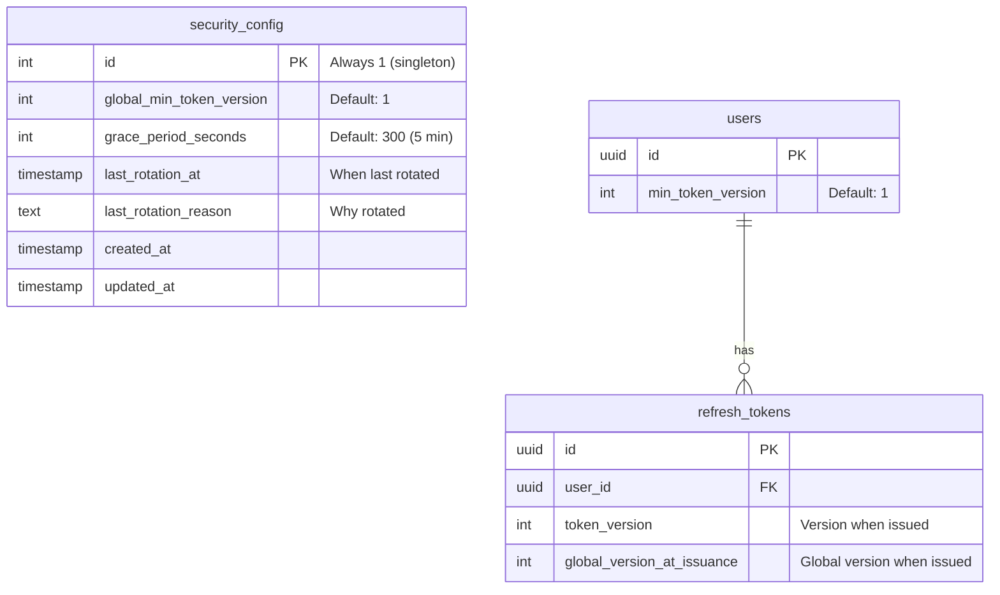
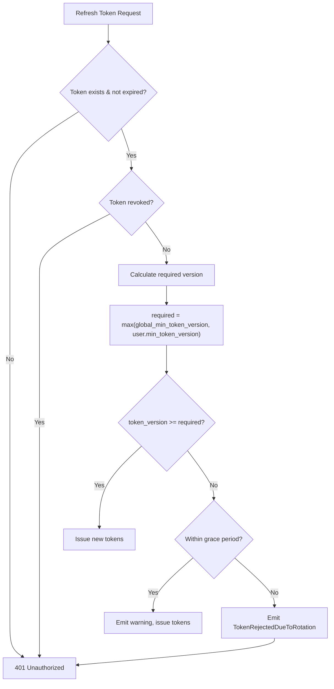

# Token Breach Rotation Architecture

## 1. Overview

### Purpose

Provide emergency mass token invalidation capability for security incidents (database breach, token theft) with configurable grace periods for gradual rollout.

### Problem Statement

Without this feature, if refresh tokens are compromised, the only options are:

1. Revoke individual tokens manually
2. Wait for tokens to expire naturally (30 days)

This is unacceptable for security incidents requiring immediate response.

### Solution: Hybrid Version-Based Rotation

```text
Token Validation Rule:
token_version >= max(global_min_token_version, user.min_token_version)
```

**Two rotation levels:**

- **Global rotation**: Increment `global_min_token_version` → invalidates ALL tokens below that version
- **Per-user rotation**: Increment `user.min_token_version` → invalidates only that user's tokens

**Grace period**: Allow old tokens for N seconds after rotation (gradual rollout, prevent mass logout disruption).

---

## 2. Architecture

### Database Schema



### Token Validation Flow



### Hexagonal Layers

```text
┌─────────────────────────────────────────────────────┐
│ Presentation Layer (Admin API)                      │
│ - POST /admin/security/rotations (global)           │
│ - POST /admin/users/{id}/rotations (per-user)       │
│ - GET /admin/security/config                        │
└──────────────────┬──────────────────────────────────┘
                   │
                   ↓
┌─────────────────────────────────────────────────────┐
│ Application Layer                                   │
│ - TriggerGlobalTokenRotationHandler                 │
│ - TriggerUserTokenRotationHandler                   │
│ - RefreshAccessTokenHandler (version check added)   │
│ - GenerateAuthTokensHandler (sets version fields)   │
└──────────────────┬──────────────────────────────────┘
                   │
                   ↓
┌─────────────────────────────────────────────────────┐
│ Domain Layer                                        │
│ - SecurityConfig entity                             │
│ - SecurityConfigRepository protocol                 │
│ - 7 rotation events (3-state pattern)               │
└──────────────────┬──────────────────────────────────┘
                   │
                   ↓
┌─────────────────────────────────────────────────────┐
│ Infrastructure Layer                                │
│ - SecurityConfigRepository implementation           │
│ - User model (min_token_version field)              │
│ - RefreshToken model (version fields)               │
└─────────────────────────────────────────────────────┘
```

---

## 3. Domain Events (3-State Pattern)

Token rotation follows the 3-state event pattern for audit compliance:

### Global Rotation Events (Workflow 10)

| Event | When Emitted | Key Fields |
|-------|--------------|------------|
| `GlobalTokenRotationAttempted` | Before rotation | `triggered_by`, `reason` |
| `GlobalTokenRotationSucceeded` | After success | `previous_version`, `new_version`, `grace_period_seconds` |
| `GlobalTokenRotationFailed` | After failure | `failure_reason` |

### Per-User Rotation Events (Workflow 11)

| Event | When Emitted | Key Fields |
|-------|--------------|------------|
| `UserTokenRotationAttempted` | Before rotation | `user_id`, `triggered_by`, `reason` |
| `UserTokenRotationSucceeded` | After success | `user_id`, `previous_version`, `new_version` |
| `UserTokenRotationFailed` | After failure | `user_id`, `failure_reason` |

### Token Rejection Event

| Event | When Emitted | Key Fields |
|-------|--------------|------------|
| `TokenRejectedDueToRotation` | When old token rejected | `user_id`, `token_version`, `required_version`, `rejection_type` |

---

## 4. Rotation Triggers

### Per-User Rotation (`user.min_token_version`)

| Trigger | Initiated By | Use Case |
|---------|--------------|----------|
| Password change | Automatic | Security best practice |
| "Log out everywhere" | User (future) | User security concern |
| Admin action | Admin API | Suspicious activity |

### Global Rotation (`global_min_token_version`)

| Trigger | Initiated By | Use Case |
|---------|--------------|----------|
| Admin action | Admin API | Database breach, vulnerability |

---

## 5. Grace Period

Grace period allows gradual token invalidation to prevent mass logout disruption.

**Default**: 300 seconds (5 minutes)

**Behavior during grace period:**

1. Old tokens still work (no user disruption)
2. Warning logged for monitoring
3. New tokens issued with current version

**Behavior after grace period:**

1. Old tokens rejected
2. `TokenRejectedDueToRotation` event emitted
3. User must re-authenticate

---

## 6. Admin API

### Endpoints

| Method | Endpoint | Description |
|--------|----------|-------------|
| POST | `/api/v1/admin/security/rotations` | Trigger global rotation |
| POST | `/api/v1/admin/users/{id}/rotations` | Trigger per-user rotation |
| GET | `/api/v1/admin/security/config` | Get current config |

### Request/Response Examples

**Global Rotation Request:**

```json
{
  "reason": "Database breach detected - rotating all tokens"
}
```

**Global Rotation Response (201 Created):**

```json
{
  "previous_version": 1,
  "new_version": 2,
  "grace_period_seconds": 300,
  "message": "Global token rotation triggered successfully"
}
```

**Security Config Response (200 OK):**

```json
{
  "global_min_token_version": 2,
  "grace_period_seconds": 300,
  "last_rotation_at": "2025-11-27T03:00:00Z",
  "last_rotation_reason": "Database breach detected"
}
```

---

## 7. Implementation Files

### Created Files

| Layer | File | Purpose |
|-------|------|---------|
| Domain | `src/domain/entities/security_config.py` | SecurityConfig entity |
| Domain | `src/domain/protocols/security_config_repository.py` | Repository protocol |
| Infrastructure | `src/infrastructure/persistence/models/security_config.py` | SQLAlchemy model |
| Infrastructure | `src/infrastructure/persistence/repositories/security_config_repository.py` | Repository impl |
| Application | `src/application/commands/rotation_commands.py` | Commands + DTOs |
| Application | `src/application/commands/handlers/trigger_global_rotation_handler.py` | Global handler |
| Application | `src/application/commands/handlers/trigger_user_rotation_handler.py` | Per-user handler |
| Presentation | `src/presentation/api/v1/admin/__init__.py` | Admin router init |
| Presentation | `src/presentation/api/v1/admin/token_rotation.py` | Admin endpoints |
| Schemas | `src/schemas/rotation_schemas.py` | Request/response schemas |

### Modified Files

| Layer | File | Changes |
|-------|------|---------|
| Domain | `src/domain/events/auth_events.py` | Added 7 rotation events |
| Infrastructure | `src/infrastructure/persistence/models/user.py` | Added `min_token_version` |
| Infrastructure | `src/infrastructure/persistence/models/refresh_token.py` | Added version fields |
| Application | `src/application/commands/handlers/refresh_access_token_handler.py` | Version validation |
| Application | `src/application/commands/handlers/generate_auth_tokens_handler.py` | Sets version on new tokens |
| Core | `src/core/container.py` | Handler factories |

---

## 8. Scope Clarification

### Included (This Feature)

- ✅ Version-based token invalidation mechanism
- ✅ Admin API to trigger rotation (manual)
- ✅ Grace period for gradual rollout
- ✅ Audit trail via domain events
- ✅ Integration with token refresh flow

### Not Included (Future Features)

- ❌ Automatic breach detection
- ❌ Anomaly detection heuristics
- ❌ Integration with password change (auto per-user rotation)
- ❌ User-facing "log out everywhere" API

---

## 9. Testing

### Test Coverage

| Test Type | File | Count |
|-----------|------|-------|
| Unit | `tests/unit/test_application_rotation_handlers.py` | 12 tests |
| Integration | `tests/integration/test_security_config_repository.py` | 10 tests |
| API | `tests/api/test_admin_rotation_api.py` | 15 tests |

### Key Test Scenarios

**Unit Tests:**

- Global rotation increments version
- Per-user rotation increments user version
- User not found returns failure
- Events emitted correctly (ATTEMPTED → SUCCEEDED/FAILED)

**Integration Tests:**

- SecurityConfig singleton behavior
- Version update persists
- Grace period update persists

**API Tests:**

- 201 Created for successful rotation
- 404 Not Found for non-existent user
- Response includes version info

---

**Created**: 2025-11-27 | **Last Updated**: 2026-01-10
