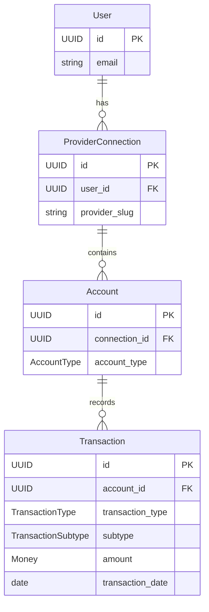

# Transaction Domain Model Architecture

Transaction Domain Model - representing historical financial activity records from provider accounts.

---

## Overview

The Transaction domain model represents **historical financial activity** that has already occurred on an account. Transactions are records of past events - they are never created or modified by Dashtam, only synced from providers.

### Core Principle

> Transactions are HISTORICAL RECORDS of past activity. They represent completed, settled financial events - NOT pending orders or future actions.

### What Transaction IS

- **Executed security transactions**: BUY/SELL that have already settled
- **Cash movements**: Deposits, withdrawals, transfers that completed
- **Income events**: Dividends, interest, distributions received
- **Fees charged**: Service fees, commissions, other charges

### What Transaction is NOT (Phase 6+)

- **Holdings/Positions**: Current portfolio state (separate entity)
- **Orders**: Pending or active trade orders (separate entity)
- **Watchlists**: User-created watch lists (separate entity)
- **Market Data**: Quotes, charts, real-time data (separate entity)

### Design Goals

1. **Immutable Records**: Transactions represent historical facts - no updates
2. **Provider Agnostic**: Works for any provider (brokerage, bank, fintech)
3. **Financial Precision**: Use Decimal/Money for all amounts
4. **Complete History**: Capture full transaction details for audit/reporting

---

## Provider API Comparison

Different providers use different approaches for transaction types. Our design must accommodate all.

### Brokerages (Investment Accounts)

**Charles Schwab API** - Uses high-level types:

- `TRADE` - All executed trades (stocks, ETFs, options, mutual funds)
- `DIVIDEND_OR_INTEREST` - Income payments
- `ACH_RECEIPT`, `ACH_DISBURSEMENT` - ACH transfers
- `WIRE_IN`, `WIRE_OUT` - Wire transfers
- `JOURNAL` - Internal transfers
- `RECEIVE_AND_DELIVER` - Security transfers
- `MARGIN_CALL`, `MONEY_MARKET`, etc.

The **instruction** field (BUY, SELL, SHORT_SELL, etc.) and **asset_type** (EQUITY, OPTION, etc.) provide specific details.

**Chase Investment API** - Uses type + instruction:

- **Types**: `TRADE`, `TRANSFER`, `INCOME`, `FEE`
- **Instructions**: `BUY`, `SELL`, `DEPOSIT`, `WITHDRAWAL`, `DIVIDEND`, etc.

### Banks (Deposit/Credit Accounts)

**Chase Transactions API** - Uses transaction categories:

- **Primary categories**: `INCOME`, `TRANSFER`, `PAYMENT`, `FEE`, etc.
- **Status**: `PENDING`, `POSTED`

**FDX (Financial Data Exchange) Standard** - Industry standard:

- Transaction status: `PENDING`, `POSTED`, `MEMO`, `AUTHORIZATION`
- Aligns with CFPB open banking regulations

### Key Insight: Two-Level Classification

Providers consistently use a **two-level** approach:

1. **High-level type**: Broad category (TRADE, CASH, FEE)
2. **Subtype/instruction**: Specific action (BUY, SELL, dividend, wire_in)

### Our Approach

We use **normalized types** that can be mapped from any provider:

```text
Provider Data → Adapter Layer → Normalized Transaction

Schwab TRADE + instruction=BUY    → type=TRADE, subtype=BUY
Chase TRADE + instruction=BUY     → type=TRADE, subtype=BUY  
Chase INCOME + type=dividend      → type=INCOME, subtype=DIVIDEND
```

The adapter (infrastructure layer) handles provider-specific mapping.

---

## Domain Model

### Entity: Transaction

```text
Transaction
├── id: UUID                              # Unique identifier (internal)
├── account_id: UUID                      # FK to Account
├── provider_transaction_id: str          # Provider's unique transaction identifier
│
│ # Classification (two-level)
├── transaction_type: TransactionType     # High-level: TRADE, TRANSFER, INCOME, FEE, OTHER
├── subtype: TransactionSubtype           # Specific: BUY, SELL, DEPOSIT, DIVIDEND, etc.
├── status: TransactionStatus             # PENDING, SETTLED, FAILED, CANCELLED
│
│ # Core Financial Data
├── amount: Money                         # Net cash impact (+/-)
├── description: str                      # Provider-supplied description
│
│ # Security Fields (for TRADE transactions)
├── asset_type: AssetType | None          # EQUITY, OPTION, ETF, MUTUAL_FUND, etc.
├── symbol: str | None                    # Security symbol (e.g., "AAPL", option symbols)
├── security_name: str | None             # Security name (e.g., "Apple Inc.")
├── quantity: Decimal | None              # Number of shares/units/contracts
├── unit_price: Money | None              # Price per share/unit
├── commission: Money | None              # Commission/fee for trade
│
│ # Dates
├── transaction_date: date                # When transaction occurred
├── settlement_date: date | None          # When transaction settled
│
│ # Metadata
├── provider_metadata: dict[str, Any] | None  # Provider-specific data (raw response)
├── created_at: datetime                  # Record creation
└── updated_at: datetime                  # Last modification (sync)
```

### Key Fields Explained

#### `amount: Money`

The **net cash impact** of the transaction:

- **DEPOSIT**: Positive (cash in)
- **WITHDRAWAL**: Negative (cash out)
- **BUY**: Negative (cash out for purchase)
- **SELL**: Positive (cash from sale)
- **DIVIDEND**: Positive (income received)
- **FEE**: Negative (charge deducted)

#### Security Fields

Only populated for security-related transactions:

- `symbol`: Stock ticker or fund symbol
- `security_name`: Full name of security
- `quantity`: Number of shares/units (Decimal for fractional shares)
- `unit_price`: Price per share at transaction time
- `commission`: Trading commission (separate from amount)

Example: BUY 100 AAPL @ $150.00 with $4.95 commission

- `amount`: -$15,004.95 (total cash out)
- `quantity`: 100.0
- `unit_price`: $150.00
- `commission`: $4.95

### Business Methods

Transaction entity is **read-only** with query methods only. No update methods - transactions are immutable historical records.

```python
class Transaction:
    # Query methods (type classification)
    def is_trade(self) -> bool:
        """Check if this is a TRADE transaction."""
    
    def is_transfer(self) -> bool:
        """Check if this is a TRANSFER transaction."""
    
    def is_income(self) -> bool:
        """Check if this is an INCOME transaction."""
    
    def is_fee(self) -> bool:
        """Check if this is a FEE transaction."""
    
    # Query methods (amount direction)
    def is_debit(self) -> bool:
        """Check if transaction decreases account value (negative amount)."""
    
    def is_credit(self) -> bool:
        """Check if transaction increases account value (positive amount)."""
    
    # Query methods (status/details)
    def is_settled(self) -> bool:
        """Check if transaction has settled (status == SETTLED)."""
    
    def has_security_details(self) -> bool:
        """Check if transaction has security information (symbol, quantity, unit_price)."""
```

### Entity Relationships



---

## Enums

### TransactionType (High-Level)

Broad category of financial activity. Normalized from provider-specific types.

```python
class TransactionType(str, Enum):
    """High-level transaction category (normalized).
    
    We use simplified, normalized types rather than provider-specific ones.
    This allows consistent behavior across different providers while
    the subtype field captures the specific action.
    
    Provider mapping examples:
    - Schwab TRADE -> TRADE
    - Schwab ACH_RECEIPT -> TRANSFER
    - Schwab DIVIDEND_OR_INTEREST -> INCOME
    - Chase buy/sell -> TRADE
    - Chase dividend -> INCOME
    """
    
    # Security transactions (executed trades)
    TRADE = "trade"           # Buy/sell/short/cover of any security
    
    # Cash movements
    TRANSFER = "transfer"     # Deposits, withdrawals, ACH, wire, etc.
    
    # Income (passive)
    INCOME = "income"         # Dividends, interest, distributions
    
    # Fees and charges
    FEE = "fee"               # Account fees, commissions, other charges
    
    # Other/Administrative  
    OTHER = "other"           # Journal entries, adjustments, uncategorized
```

**Helper Methods:**

```python
@classmethod
def security_related(cls) -> list["TransactionType"]:
    """Types that may involve securities."""
    return [cls.TRADE, cls.INCOME]  # INCOME includes dividends on securities
```

### TransactionSubtype (Specific Action)

Granular classification within each type. Captures the specific action.

```python
class TransactionSubtype(str, Enum):
    """Specific transaction action within a type.
    
    Subtypes provide granular detail while types provide broad categories.
    Not all subtypes are valid for all types - see valid combinations below.
    
    Asset Class Note:
    ----------------
    Securities can be stocks, ETFs, options, futures, mutual funds, bonds, etc.
    The subtype does NOT specify asset class - that's captured in:
    - `asset_type` field (EQUITY, OPTION, MUTUAL_FUND, FIXED_INCOME, etc.)
    - `symbol` field (AAPL, AAPL230120C00150000 for options, etc.)
    
    For options specifically:
    - BUY/SELL = opening or closing positions
    - EXERCISE = exercising an option contract
    - ASSIGNMENT = being assigned on a short option
    - EXPIRATION = option expired worthless
    """
    
    # TRADE subtypes (executed security transactions)
    BUY = "buy"                     # Purchase security (long)
    SELL = "sell"                   # Sell security (close long)
    SHORT_SELL = "short_sell"       # Short sale (open short)
    BUY_TO_COVER = "buy_to_cover"   # Cover short position
    
    # TRADE subtypes - options/derivatives specific
    EXERCISE = "exercise"           # Exercise option contract
    ASSIGNMENT = "assignment"       # Assigned on short option
    EXPIRATION = "expiration"       # Option expired
    
    # TRANSFER subtypes (cash movements)
    DEPOSIT = "deposit"             # Cash deposited (ACH, check, etc.)
    WITHDRAWAL = "withdrawal"       # Cash withdrawn
    WIRE_IN = "wire_in"             # Incoming wire transfer
    WIRE_OUT = "wire_out"           # Outgoing wire transfer
    TRANSFER_IN = "transfer_in"     # Security/cash transferred in
    TRANSFER_OUT = "transfer_out"   # Security/cash transferred out
    INTERNAL = "internal"           # Internal account transfer
    
    # INCOME subtypes (passive income)
    DIVIDEND = "dividend"           # Stock/fund dividend
    INTEREST = "interest"           # Interest earned
    CAPITAL_GAIN = "capital_gain"   # Capital gain distribution
    DISTRIBUTION = "distribution"   # Other distribution
    
    # FEE subtypes
    COMMISSION = "commission"       # Trading commission
    ACCOUNT_FEE = "account_fee"     # Account maintenance fee
    MARGIN_INTEREST = "margin_interest"  # Margin interest charged
    OTHER_FEE = "other_fee"         # Other fees
    
    # OTHER subtypes
    ADJUSTMENT = "adjustment"       # Balance adjustment
    JOURNAL = "journal"             # Journal entry
    UNKNOWN = "unknown"             # Unmapped/unknown
```

**Valid Type-Subtype Combinations:**

| Type | Valid Subtypes |
|------|----------------|
| TRADE | BUY, SELL, SHORT_SELL, BUY_TO_COVER, EXERCISE, ASSIGNMENT, EXPIRATION |
| TRANSFER | DEPOSIT, WITHDRAWAL, WIRE_IN, WIRE_OUT, TRANSFER_IN, TRANSFER_OUT, INTERNAL |
| INCOME | DIVIDEND, INTEREST, CAPITAL_GAIN, DISTRIBUTION |
| FEE | COMMISSION, ACCOUNT_FEE, MARGIN_INTEREST, OTHER_FEE |
| OTHER | ADJUSTMENT, JOURNAL, UNKNOWN |

**Helper Methods:**

```python
@classmethod
def trade_subtypes(cls) -> list["TransactionSubtype"]:
    """Subtypes for TRADE transactions."""
    return [
        cls.BUY, cls.SELL, cls.SHORT_SELL, cls.BUY_TO_COVER,
        cls.EXERCISE, cls.ASSIGNMENT, cls.EXPIRATION,
    ]

@classmethod
def transfer_subtypes(cls) -> list["TransactionSubtype"]:
    """Subtypes for TRANSFER transactions."""
    return [
        cls.DEPOSIT, cls.WITHDRAWAL, cls.WIRE_IN, cls.WIRE_OUT,
        cls.TRANSFER_IN, cls.TRANSFER_OUT, cls.INTERNAL,
    ]

@classmethod
def income_subtypes(cls) -> list["TransactionSubtype"]:
    """Subtypes for INCOME transactions."""
    return [cls.DIVIDEND, cls.INTEREST, cls.CAPITAL_GAIN, cls.DISTRIBUTION]

@classmethod
def fee_subtypes(cls) -> list["TransactionSubtype"]:
    """Subtypes for FEE transactions."""
    return [cls.COMMISSION, cls.ACCOUNT_FEE, cls.MARGIN_INTEREST, cls.OTHER_FEE]
```

### AssetType (Security Classification)

Classifies the type of security involved in TRADE transactions.

```python
class AssetType(str, Enum):
    """Type of security/asset involved in transaction.
    
    Only populated for TRADE transactions. Captures what KIND of
    instrument was traded, separate from the action (buy/sell).
    
    This allows the same BUY subtype to work for:
    - Stocks: BUY + EQUITY
    - Options: BUY + OPTION (with option_type for call/put)
    - ETFs: BUY + ETF
    - Mutual Funds: BUY + MUTUAL_FUND
    - Bonds: BUY + FIXED_INCOME
    - Crypto: BUY + CRYPTOCURRENCY
    """
    
    EQUITY = "equity"               # Stocks (common, preferred)
    ETF = "etf"                     # Exchange-traded funds
    OPTION = "option"               # Options contracts
    MUTUAL_FUND = "mutual_fund"     # Mutual funds
    FIXED_INCOME = "fixed_income"   # Bonds, CDs, treasuries
    FUTURES = "futures"             # Futures contracts
    CRYPTOCURRENCY = "cryptocurrency"  # Crypto assets
    CASH_EQUIVALENT = "cash_equivalent"  # Money market, etc.
    OTHER = "other"                 # Unknown/other
```

### TransactionStatus

Transaction lifecycle states:

```python
class TransactionStatus(str, Enum):
    """Transaction settlement status.
    
    Most transactions from providers are already SETTLED.
    PENDING status is rare for historical data.
    
    Lifecycle Flow:
        PENDING → SETTLED (normal flow)
        PENDING → FAILED (sync/processing error)
        PENDING → CANCELLED (voided by provider)
    """
    
    PENDING = "pending"       # Awaiting settlement
    SETTLED = "settled"       # Completed and settled
    FAILED = "failed"         # Transaction failed
    CANCELLED = "cancelled"   # Transaction cancelled
    
    @classmethod
    def terminal_states(cls) -> list["TransactionStatus"]:
        """Return statuses that represent final states."""
        return [cls.SETTLED, cls.FAILED, cls.CANCELLED]
    
    @classmethod
    def active_states(cls) -> list["TransactionStatus"]:
        """Return statuses that may still change."""
        return [cls.PENDING]
```

**Note:** Unlike Orders (Phase 6+) which have many active states, Transactions are mostly `SETTLED` since they represent historical data.

---

## No Domain Events

Unlike ProviderConnection (F2.1), Transactions do **NOT** emit domain events because:

1. **Synced Data**: Transactions are imported from providers, not created by users
2. **Historical Records**: No user actions to audit (data already exists)
3. **Bulk Operations**: Syncing many transactions at once - events would be noise

Domain events are reserved for user-initiated actions that require audit trails (authentication, provider connections, etc.).

---

## Repository Protocol

```python
class TransactionRepository(Protocol):
    """Transaction repository protocol (port).
    
    Defines interface for transaction persistence operations.
    Infrastructure layer provides concrete implementation.
    
    Design Principles:
    - Read methods return domain entities, not database models
    - All queries scoped to account_id (multi-tenancy boundary)
    - Pagination support for large result sets
    - Bulk operations for efficient provider sync
    """
    
    async def find_by_id(self, transaction_id: UUID) -> Transaction | None:
        """Find transaction by internal ID."""
    
    async def find_by_account_id(
        self,
        account_id: UUID,
        limit: int = 50,
        offset: int = 0,
    ) -> list[Transaction]:
        """Find transactions for an account with pagination.
        
        Returns transactions ordered by transaction_date DESC.
        """
    
    async def find_by_account_and_type(
        self,
        account_id: UUID,
        transaction_type: TransactionType,
        limit: int = 50,
    ) -> list[Transaction]:
        """Find transactions by account and type."""
    
    async def find_by_date_range(
        self,
        account_id: UUID,
        start_date: date,
        end_date: date,
    ) -> list[Transaction]:
        """Find transactions within date range (inclusive)."""
    
    async def find_by_provider_transaction_id(
        self,
        account_id: UUID,
        provider_transaction_id: str,
    ) -> Transaction | None:
        """Find by provider's transaction identifier (for dedup during sync)."""
    
    async def find_security_transactions(
        self,
        account_id: UUID,
        symbol: str,
        limit: int = 50,
    ) -> list[Transaction]:
        """Find TRADE transactions for a specific security symbol."""
    
    async def save(self, transaction: Transaction) -> None:
        """Create or update transaction."""
    
    async def save_many(self, transactions: list[Transaction]) -> None:
        """Bulk save transactions (efficient for sync)."""
    
    async def delete(self, transaction_id: UUID) -> None:
        """Remove transaction (rare - usually for cleanup)."""
```

---

## Error Constants

```python
class TransactionError:
    """Transaction error constants for Result types.
    
    Used in railway-oriented programming pattern.
    These are NOT exceptions - they are error value constants.
    """
    
    # Validation errors
    INVALID_AMOUNT = "Invalid transaction amount"
    INVALID_PROVIDER_TRANSACTION_ID = "Invalid provider transaction ID"
    INVALID_TRANSACTION_DATE = "Invalid transaction date"
    
    # Security/trade validation errors
    MISSING_SECURITY_SYMBOL = "Missing security symbol"
    MISSING_QUANTITY = "Missing quantity"
    INVALID_QUANTITY = "Invalid quantity"
    MISSING_UNIT_PRICE = "Missing unit price"
    MISSING_ASSET_TYPE = "Missing asset type"
    
    # Status/lifecycle errors
    TRANSACTION_NOT_FOUND = "Transaction not found"
    TRANSACTION_ALREADY_SETTLED = "Transaction already settled"
    DUPLICATE_PROVIDER_TRANSACTION = "Duplicate provider transaction"
```

---

## Implementation Notes

### Why Transactions are Immutable

1. **Historical Facts**: Once a trade executes or deposit clears, it cannot be "undone"
2. **Audit Compliance**: Financial records must not be altered
3. **Provider Authority**: Provider data is source of truth
4. **Corrections**: If provider sends correction, it's a new transaction (ADJUSTMENT)

### Handling Provider Updates

If a provider updates a transaction (rare):

1. Match by `provider_transaction_id`
2. Update the record (this is sync, not user modification)
3. `updated_at` timestamp reflects last sync

### Decimal Precision for Quantities

```python
# Use Decimal for share quantities (fractional shares are common)
quantity: Decimal = Decimal("0.12345")  # Fractional shares

# NOT float - precision matters for portfolio calculations
quantity: float = 0.12345  # WRONG - loses precision
```

---

## File Structure

```text
src/domain/
├── entities/
│   └── transaction.py           # Transaction entity
├── enums/
│   ├── transaction_type.py      # TransactionType enum (5 values)
│   ├── transaction_subtype.py   # TransactionSubtype enum (24 values)
│   ├── transaction_status.py    # TransactionStatus enum (4 values)
│   └── asset_type.py            # AssetType enum (9 values)
├── errors/
│   └── transaction_error.py     # Error constants
└── protocols/
    └── transaction_repository.py  # Repository protocol

tests/unit/
└── test_domain_transaction.py  # All transaction tests (~60 tests)

docs/architecture/
└── transaction.md  # This document
```

---

## Testing Strategy

### Unit Tests (~44 tests)

**Transaction Entity:**

- Creation with all fields
- Creation with minimal fields (optional fields None)
- Query methods (is_trade, is_transfer, is_income, is_fee, is_debit, is_credit, is_settled, has_security_details)
- Immutability verification (frozen dataclass)

**TransactionType Enum:**

- All 5 values accessible (TRADE, TRANSFER, INCOME, FEE, OTHER)
- Helper method security_related()
- String serialization

**TransactionSubtype Enum:**

- All 24 values accessible
- Helper methods (trade_subtypes, transfer_subtypes, income_subtypes, fee_subtypes)

**TransactionStatus Enum:**

- All 4 values accessible
- terminal_states() and active_states() helpers

**AssetType Enum:**

- All 9 values accessible

Coverage target: 100%

---

**Created**: 2025-11-30 | **Last Updated**: 2025-12-05
