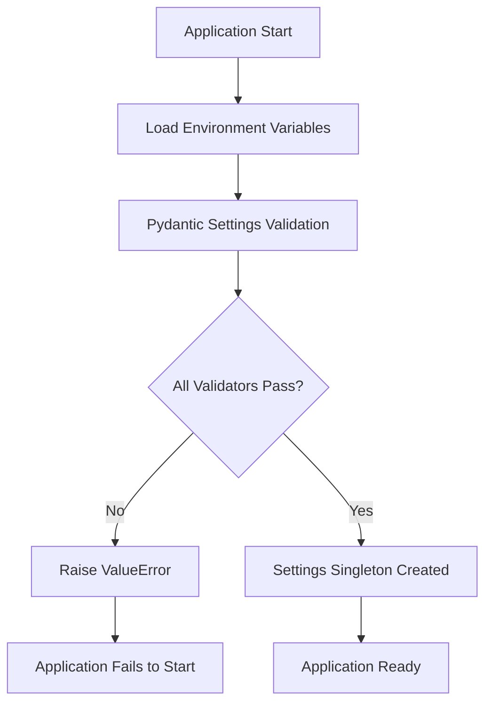
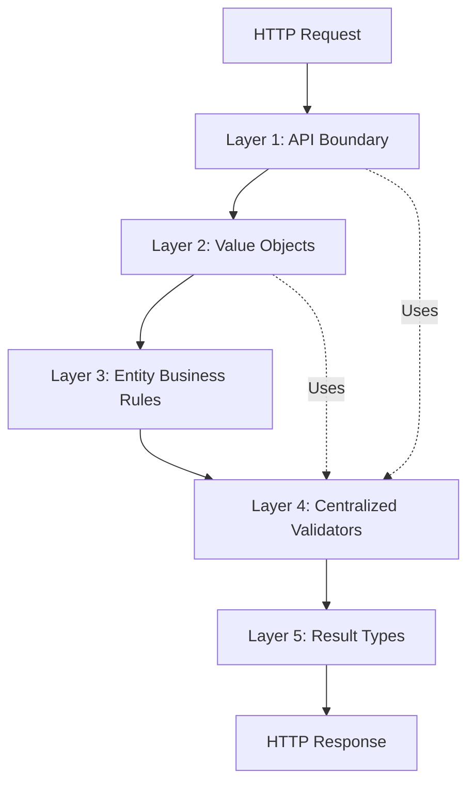
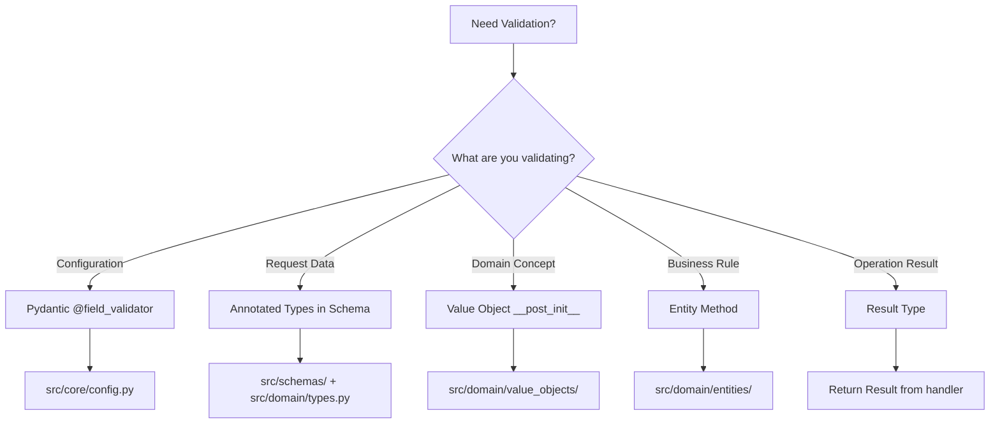

# Validation Architecture

## Overview

Dashtam implements a **defense-in-depth validation strategy** with two distinct validation phases:

1. **Startup Validation**: Configuration validation at application startup (fail-fast)
2. **Runtime Validation**: Multi-layered validation during request processing (defense-in-depth)

This architecture ensures data integrity at every layer while maintaining clean separation of concerns and following the **DRY (Don't Repeat Yourself)** principle through centralized validation logic.

**Key Principles**:

- **Fail-Fast**: Invalid configuration prevents application startup
- **Defense-in-Depth**: Multiple validation layers (API → Schema → Value Object → Entity)
- **Type Safety**: Annotated types with automatic validation
- **Explicit Errors**: Result types force error handling (no hidden exceptions)
- **DRY**: Single source of truth for validation logic

---

## 1. Startup Validation (Configuration-Only)

**Purpose**: Validate critical configuration at application startup to prevent runtime failures.

**Location**: `src/core/config.py`

**Philosophy**: **Fail-fast** - Application refuses to start if configuration is invalid.

### Configuration Validators

Dashtam uses Pydantic `@field_validator` for configuration validation with 5 critical validators:

#### 1.1 Secret Key Validation

```python
@field_validator("secret_key")
@classmethod
def validate_secret_key(cls, v: str) -> str:
    """Validate JWT secret key minimum length."""
    if len(v) < 32:
        raise ValueError(
            f"secret_key must be at least 32 characters (256 bits), got {len(v)}"
        )
    return v
```

**Purpose**: Ensure JWT signing key is cryptographically secure (≥256 bits).

**Compliance**: NIST SP 800-63B, PCI-DSS 8.2.1

#### 1.2 Encryption Key Validation

```python
@field_validator("encryption_key")
@classmethod
def validate_encryption_key(cls, v: str) -> str:
    """Validate encryption key length for AES-256."""
    if len(v) != 32:
        raise ValueError(
            f"encryption_key must be exactly 32 characters (256 bits), got {len(v)}"
        )
    return v
```

**Purpose**: Enforce AES-256-GCM encryption key length (exactly 32 bytes).

**Compliance**: NIST SP 800-38D, PCI-DSS 3.4

#### 1.3 Bcrypt Rounds Validation

```python
@field_validator("bcrypt_rounds")
@classmethod
def validate_bcrypt_rounds(cls, v: int) -> int:
    """Validate bcrypt rounds are within safe range."""
    if not 4 <= v <= 31:
        raise ValueError("bcrypt_rounds must be between 4 and 31")
    return v
```

**Purpose**: Prevent performance issues (too high) or security issues (too low).

**Recommended**: 12 rounds (~300ms hashing time)

#### 1.4 URL Normalization

```python
@field_validator("api_base_url", "callback_base_url", "verification_url_base")
@classmethod
def validate_url(cls, v: str) -> str:
    """Remove trailing slashes from URLs."""
    return v.rstrip("/")
```

**Purpose**: Normalize URLs for consistent path concatenation.

#### 1.5 CORS Origin Parsing

```python
@field_validator("cors_origins")
@classmethod
def parse_cors_origins(cls, v: str) -> list[str]:
    """Parse comma-separated CORS origins."""
    return [origin.strip() for origin in v.split(",")]
```

**Purpose**: Convert comma-separated string to list for CORS middleware.

### Startup Validation Flow



**Critical**: If any validator fails, application **refuses to start** (fail-fast).

---

## 2. Runtime Validation (Multi-Layered)

Runtime validation occurs during request processing with **5 distinct layers** providing defense-in-depth security.

### Architecture Overview



Each layer has a specific responsibility and validates at the appropriate level of abstraction.

---

### Layer 1: API Boundary (Request Schema Validation)

**Purpose**: Validate incoming HTTP requests before they reach application logic.

**Location**: `src/schemas/` (Pydantic models)

**Technology**: FastAPI + Pydantic automatic validation

#### How It Works

Pydantic models with **Annotated types** automatically validate requests:

```python
# src/schemas/user_schemas.py
from src.domain.types import Email, Password

class UserCreate(BaseModel):
    email: Email          # Automatic email validation
    password: Password    # Automatic password validation
```

FastAPI automatically:

1. Parses request body JSON
2. Validates against schema
3. Returns 422 Unprocessable Entity if validation fails
4. Passes validated data to handler

#### Request Schema Examples

**User Registration**:

```python
class UserCreate(BaseModel):
    """User registration request."""
    email: Email                    # Validated, normalized email
    password: Password              # Strong password requirements
    
    model_config = ConfigDict(
        json_schema_extra={
            "examples": [
                {
                    "email": "user@example.com",
                    "password": "SecurePass123!"
                }
            ]
        }
    )
```

**Email Verification**:

```python
class VerifyEmailRequest(BaseModel):
    """Email verification request."""
    token: VerificationToken        # Hex token format validation
```

**Token Refresh**:

```python
class RefreshTokenRequest(BaseModel):
    """Token refresh request."""
    refresh_token: RefreshToken     # urlsafe base64 format validation
```

#### Validation Error Response

FastAPI automatically returns RFC 7807-compliant error responses:

```json
{
  "type": "validation_error",
  "title": "Validation Error",
  "status": 422,
  "detail": "Invalid request data",
  "instance": "/api/v1/users",
  "errors": [
    {
      "loc": ["body", "email"],
      "msg": "Invalid email format: invalid-email",
      "type": "value_error"
    }
  ]
}
```

#### Benefits

- ✅ **Automatic**: No manual validation code in endpoints
- ✅ **Type-Safe**: Validated data has correct types
- ✅ **Documented**: OpenAPI schema auto-generated
- ✅ **Consistent**: Same validation everywhere via Annotated types

---

### Layer 2: Domain Value Objects

**Purpose**: Validate invariants for domain concepts with validation in constructor.

**Location**: `src/domain/value_objects/`

**Pattern**: Immutable frozen dataclasses with `__post_init__` validation

#### Value Object Pattern

Value objects are **immutable** and validate themselves:

```python
@dataclass(frozen=True)
class Email:
    """Email value object with format validation."""
    value: str

    def __post_init__(self) -> None:
        """Validate email format after initialization."""
        try:
            validated = validate_email(self.value, check_deliverability=False)
            object.__setattr__(self, "value", validated.normalized)
        except EmailNotValidError as e:
            raise ValueError(f"Invalid email: {e}") from e
```

**Key Features**:

- `frozen=True` → Immutable (cannot be modified after creation)
- `__post_init__` → Validation runs automatically after `__init__`
- `object.__setattr__` → Required to set normalized value on frozen dataclass

#### Email Value Object

**Location**: `src/domain/value_objects/email.py`

**Validation**:

- Uses `email-validator` library (RFC-compliant)
- Normalizes to lowercase
- Checks format only (no deliverability check for performance)

**Example**:

```python
>>> email = Email("User@Example.COM")
>>> email.value
'user@example.com'

>>> Email("invalid")
ValueError: Invalid email: ...
```

#### Password Value Object

**Location**: `src/domain/value_objects/password.py`

**Requirements**:

- At least 8 characters
- At least one uppercase letter
- At least one lowercase letter
- At least one digit
- At least one special character (`!@#$%^&*(),.?":{}|<>`)

**Example**:

```python
>>> password = Password("SecurePass123!")
>>> str(password)
'**************'  # Masked for security

>>> Password("weak")
ValueError: Password must be at least 8 characters
```

**Security Note**: `__str__()` returns masked password (never plaintext).

#### Money Value Object

**Location**: `src/domain/value_objects/money.py`

**Validation**:

- Uses `Decimal` for precision (no float rounding errors)
- Validates currency code (ISO 4217)
- Prevents negative amounts for certain operations

**Example**:

```python
>>> money = Money(amount=Decimal("100.50"), currency="USD")
>>> money.amount
Decimal('100.50')

>>> Money(amount=Decimal("-10"), currency="USD")
ValueError: Amount cannot be negative
```

#### ProviderCredentials Value Object

**Location**: `src/domain/value_objects/provider_credentials.py`

**Validation**:

- Opaque (encrypted) credentials
- Validates encryption integrity (AES-256-GCM authentication tag)
- Never exposes plaintext credentials

#### Value Object Benefits

- ✅ **Type Safety**: Compile-time type checking
- ✅ **Immutability**: Cannot be modified (prevents bugs)
- ✅ **Self-Validating**: Impossible to create invalid value object
- ✅ **Domain-Driven**: Represents domain concepts accurately
- ✅ **Reusable**: Used across application and domain layers

---

### Layer 3: Entity Business Rules

**Purpose**: Validate business invariants and enforce business rules.

**Location**: `src/domain/entities/`

**Pattern**: Entity methods that enforce business logic

#### Entity Validation Pattern

Entities validate **business rules** (not just data format):

```python
@dataclass
class User:
    """User entity with authentication business rules."""
    id: UUID
    email: str
    is_verified: bool
    is_active: bool
    failed_login_attempts: int
    locked_until: datetime | None
    
    def can_login(self) -> bool:
        """Check if user can login (verified, active, not locked)."""
        return self.is_verified and self.is_active and not self.is_locked()
    
    def is_locked(self) -> bool:
        """Check if account is currently locked."""
        if self.locked_until is None:
            return False
        return datetime.now(UTC) < self.locked_until
    
    def increment_failed_login(self) -> None:
        """Increment failed login counter and lock after 5 attempts."""
        self.failed_login_attempts += 1
        if self.failed_login_attempts >= 5:
            self.locked_until = datetime.now(UTC) + timedelta(minutes=15)
```

#### User Entity Business Rules

**Business Rule 1**: Email verification required before login

```python
def can_login(self) -> bool:
    return self.is_verified and self.is_active and not self.is_locked()
```

**Business Rule 2**: Lock account after 5 failed login attempts

```python
def increment_failed_login(self) -> None:
    self.failed_login_attempts += 1
    if self.failed_login_attempts >= 5:
        self.locked_until = datetime.now(UTC) + timedelta(minutes=15)
```

**Business Rule 3**: Reset lockout on successful login

```python
def reset_failed_login(self) -> None:
    self.failed_login_attempts = 0
    self.locked_until = None
```

#### ProviderConnection Entity Business Rules

**Location**: `src/domain/entities/provider_connection.py`

**State Transition Validation**:

```python
def mark_as_connecting(self) -> Result[None, str]:
    """Transition to CONNECTING state."""
    if self.connection_status != ConnectionStatus.DISCONNECTED:
        return Failure(error="Can only connect from DISCONNECTED state")
    self.connection_status = ConnectionStatus.CONNECTING
    return Success(value=None)
```

**Valid State Transitions**:

- `DISCONNECTED` → `CONNECTING`
- `CONNECTING` → `CONNECTED` or `FAILED`
- `CONNECTED` → `SYNCING` or `DISCONNECTING`
- `SYNCING` → `CONNECTED` or `ERROR`
- `ERROR` → `SYNCING` or `DISCONNECTING`
- Any state → `DISCONNECTING` → `DISCONNECTED`

#### Account Entity Business Rules

**Location**: `src/domain/entities/account.py`

**Balance Update Validation**:

```python
def update_balance(self, new_balance: Money) -> Result[None, str]:
    """Update account balance with validation."""
    if new_balance.currency != self.balance.currency:
        return Failure(error="Currency mismatch")
    
    if new_balance.amount < Decimal("0"):
        return Failure(error="Balance cannot be negative")
    
    self.balance = new_balance
    self.last_updated = datetime.now(UTC)
    return Success(value=None)
```

#### Entity Validation Benefits

- ✅ **Business Logic**: Encapsulates domain rules
- ✅ **Testable**: Pure functions, easy to unit test
- ✅ **Self-Documenting**: Method names describe rules
- ✅ **Type-Safe**: Result types force error handling
- ✅ **Maintainable**: Single location for business rules

---

### Layer 4: Centralized Validators (DRY Principle)

**Purpose**: Single source of truth for validation logic, reused via Annotated types.

**Location**: `src/domain/validators.py`

**Pattern**: Pure functions that raise `ValueError` on validation failure

#### Centralized Validator Pattern

Validators are **pure functions** with no side effects:

```python
def validate_email(v: str) -> str:
    """Validate email format.
    
    Args:
        v: Email address to validate.
    
    Returns:
        Normalized email (lowercase).
    
    Raises:
        ValueError: If email format is invalid.
    """
    pattern = r"^[a-zA-Z0-9._%+-]+@[a-zA-Z0-9.-]+\.[a-zA-Z]{2,}$"
    if not re.match(pattern, v):
        raise ValueError(f"Invalid email format: {v}")
    return v.lower()  # Normalize to lowercase
```

#### Available Validators

**1. Email Validator**:

**Location**: `src/domain/validators.py:validate_email`

**Validation**:

- RFC-compliant email pattern
- Normalizes to lowercase

**Usage**:

```python
# In domain/types.py
Email = Annotated[
    str,
    Field(min_length=5, max_length=255),
    AfterValidator(validate_email)  # Reuses validator
]
```

**2. Password Validator**:

**Location**: `src/domain/validators.py:validate_strong_password`

**Validation**:

- At least 8 characters
- Contains uppercase, lowercase, digit, special character

**Usage**:

```python
# In domain/types.py
Password = Annotated[
    str,
    Field(min_length=8, max_length=128),
    AfterValidator(validate_strong_password)  # Reuses validator
]
```

**3. Token Format Validator**:

**Location**: `src/domain/validators.py:validate_token_format`

**Validation**:

- Hexadecimal string (used for email verification, password reset)
- Pattern: `^[a-fA-F0-9]+$`

**Usage**:

```python
# In domain/types.py
VerificationToken = Annotated[
    str,
    Field(min_length=16, max_length=128, pattern=r"^[a-fA-F0-9]+$"),
    AfterValidator(validate_token_format)  # Reuses validator
]
```

**4. Refresh Token Format Validator**:

**Location**: `src/domain/validators.py:validate_refresh_token_format`

**Validation**:

- urlsafe base64 format (opaque token)
- Pattern: `^[A-Za-z0-9_-]+$`

**Usage**:

```python
# In domain/types.py
RefreshToken = Annotated[
    str,
    Field(min_length=16, max_length=256, pattern=r"^[A-Za-z0-9_-]+$"),
    AfterValidator(validate_refresh_token_format)  # Reuses validator
]
```

#### Annotated Types (DRY Pattern)

**Location**: `src/domain/types.py`

**Purpose**: Define validation once, use everywhere.

**Pattern**:

```python
from typing import Annotated
from pydantic import Field, AfterValidator
from src.domain.validators import validate_email

Email = Annotated[
    str,
    Field(min_length=5, max_length=255, description="Email address"),
    AfterValidator(validate_email)
]
```

**Usage across codebase**:

```python
# In schemas/user_schemas.py
class UserCreate(BaseModel):
    email: Email  # Validation included automatically!

# In application/commands/register_user.py
@dataclass(frozen=True, kw_only=True)
class RegisterUser:
    email: Email  # Same validation!

# Everywhere you use Email type, validation is automatic
```

#### Centralized Validator Benefits

- ✅ **DRY**: Validation logic defined once
- ✅ **Consistent**: Same validation everywhere
- ✅ **Maintainable**: Update in one place
- ✅ **Testable**: Pure functions, easy to test
- ✅ **Type-Safe**: Integrated with Pydantic

---

### Layer 5: Result Types (Railway-Oriented Programming)

**Purpose**: Explicit error handling with type-safe success/failure paths.

**Location**: `src/core/result.py`

**Pattern**: Domain and application layers return `Result[T, E]` instead of raising exceptions

#### Result Type Pattern

```python
from src.core.result import Result, Success, Failure

def authenticate_user(email: str, password: str) -> Result[User, str]:
    """Authenticate user with explicit error handling."""
    user = user_repository.find_by_email(email)
    
    if user is None:
        return Failure(error="Invalid credentials")
    
    if not user.can_login():
        return Failure(error="Account not verified or locked")
    
    if not verify_password(password, user.password_hash):
        return Failure(error="Invalid credentials")
    
    return Success(value=user)
```

**Usage** (forces error handling):

```python
result = authenticate_user(email, password)

if isinstance(result, Failure):
    # Handle error
    logger.warning("Login failed", error=result.error)
    return HTTPException(401, detail="Invalid credentials")

# Type narrowing: result is Success[User]
user = result.value
```

#### Why Result Types?

**Problem with exceptions**:

```python
def authenticate_user(email: str, password: str) -> User:
    # Hidden error paths - caller doesn't know what exceptions to catch!
    raise AuthenticationError("Invalid credentials")
    raise AccountLockedError("Account locked")
    raise EmailNotVerifiedError("Email not verified")
```

**Solution with Result types**:

```python
def authenticate_user(email: str, password: str) -> Result[User, AuthError]:
    # Explicit error path - caller MUST handle Success/Failure
    return Failure(error=AuthError.INVALID_CREDENTIALS)
```

#### Result Type Benefits

- ✅ **Explicit Errors**: Error handling visible in type signature
- ✅ **Type Safety**: Compiler enforces error handling
- ✅ **No Hidden Exceptions**: All error paths documented
- ✅ **Railway-Oriented**: Clear success/failure paths
- ✅ **Testable**: Easy to test both success and failure cases

#### Domain Layer Usage

All domain entity methods that can fail return `Result`:

```python
# src/domain/entities/provider_connection.py
def mark_as_connecting(self) -> Result[None, str]:
    """Transition to CONNECTING state."""
    if self.connection_status != ConnectionStatus.DISCONNECTED:
        return Failure(error="Can only connect from DISCONNECTED state")
    
    self.connection_status = ConnectionStatus.CONNECTING
    return Success(value=None)
```

#### Application Layer Usage

All command/query handlers return `Result`:

```python
# src/application/commands/handlers/authenticate_user_handler.py
async def handle(self, cmd: AuthenticateUser) -> Result[LoginResult, str]:
    """Authenticate user with explicit error handling."""
    result = await self._users.find_by_email(cmd.email)
    
    if isinstance(result, Failure):
        return Failure(error="Invalid credentials")
    
    user = result.value
    
    if not user.can_login():
        return Failure(error="Account not active")
    
    # ... continue with authentication logic
    
    return Success(value=LoginResult(
        access_token=access_token,
        refresh_token=refresh_token
    ))
```

#### Presentation Layer Usage

API routers handle `Result` and convert to HTTP responses:

```python
# src/presentation/routers/api/v1/sessions.py
@router.post("/sessions", status_code=201)
async def login(
    data: LoginRequest,
    handler: AuthenticateUserHandler = Depends(get_authenticate_user_handler),
) -> LoginResponse:
    """Login endpoint."""
    result = await handler.handle(AuthenticateUser(
        email=data.email,
        password=data.password
    ))
    
    if isinstance(result, Failure):
        # Convert to RFC 7807 error response
        raise HTTPException(
            status_code=401,
            detail={"error": result.error}
        )
    
    # Type narrowing: result is Success[LoginResult]
    return LoginResponse(
        access_token=result.value.access_token,
        refresh_token=result.value.refresh_token
    )
```

---

## 3. Validation Patterns Summary

### Pattern 1: Annotated Types (DRY)

**When to use**: Reusable validation across schemas, commands, queries.

**Location**: `src/domain/types.py`

**Example**:

```python
Email = Annotated[
    str,
    Field(min_length=5, max_length=255),
    AfterValidator(validate_email)
]

# Used everywhere
class UserCreate(BaseModel):
    email: Email  # Automatic validation!
```

**Benefits**: Define once, use everywhere (DRY principle).

---

### Pattern 2: Value Object `__post_init__`

**When to use**: Domain concepts with validation invariants.

**Location**: `src/domain/value_objects/`

**Example**:

```python
@dataclass(frozen=True)
class Email:
    value: str
    
    def __post_init__(self) -> None:
        validated = validate_email(self.value)
        object.__setattr__(self, "value", validated.normalized)
```

**Benefits**: Immutable, self-validating, type-safe.

---

### Pattern 3: Entity Business Methods

**When to use**: Complex business rules, state transitions.

**Location**: `src/domain/entities/`

**Example**:

```python
def can_login(self) -> bool:
    """Business rule: verified + active + not locked."""
    return self.is_verified and self.is_active and not self.is_locked()
```

**Benefits**: Encapsulates business logic, testable, self-documenting.

---

### Pattern 4: Result Types

**When to use**: Operations that can fail (domain/application layers).

**Location**: Domain entities, application handlers

**Example**:

```python
def authenticate(email: str, pwd: str) -> Result[User, AuthError]:
    if invalid:
        return Failure(error=AuthError.INVALID_CREDENTIALS)
    return Success(value=user)
```

**Benefits**: Explicit error handling, type-safe, no hidden exceptions.

---

### Pattern 5: Pydantic @field_validator

**When to use**: Configuration validation at startup.

**Location**: `src/core/config.py`

**Example**:

```python
@field_validator("secret_key")
@classmethod
def validate_secret_key(cls, v: str) -> str:
    if len(v) < 32:
        raise ValueError("secret_key must be at least 32 characters")
    return v
```

**Benefits**: Fail-fast, prevents misconfiguration.

---

## 4. Validation Decision Guide

### Where to Place Validation



### Decision Matrix

| Scenario | Pattern | Location | Example |
|----------|---------|----------|---------|
| JWT secret key length | `@field_validator` | `config.py` | `secret_key` ≥32 chars |
| Email format validation | Annotated Type | `types.py` + `validators.py` | `Email` type |
| Password strength | Annotated Type | `types.py` + `validators.py` | `Password` type |
| Money amount precision | Value Object | `value_objects/money.py` | Decimal validation |
| User can login check | Entity Method | `entities/user.py` | `can_login()` |
| State transition | Entity Method | `entities/provider_connection.py` | `mark_as_connecting()` |
| Authentication result | Result Type | Handler return type | `Result[User, AuthError]` |

### Validation Layer Responsibilities

| Layer | Responsibility | Example |
|-------|----------------|---------|
| **Startup** | Configuration validation | `secret_key` length |
| **API Boundary** | Request format validation | JSON schema, field types |
| **Value Object** | Domain concept validation | Email format, Money precision |
| **Entity** | Business rule enforcement | User lockout, state transitions |
| **Result Type** | Explicit error handling | Authentication success/failure |

---

## 5. Testing Strategy

### Testing Startup Validation

**Test File**: `tests/unit/test_core_config.py`

**Pattern**: Test validator rejection of invalid config

```python
def test_secret_key_too_short():
    """Test secret_key validator rejects short keys."""
    with pytest.raises(ValueError, match="secret_key must be at least 32 characters"):
        Settings(
            secret_key="short",  # Only 5 characters
            encryption_key="x" * 32,
            # ... other required fields
        )

def test_encryption_key_wrong_length():
    """Test encryption_key validator rejects wrong length."""
    with pytest.raises(ValueError, match="encryption_key must be exactly 32 characters"):
        Settings(
            secret_key="x" * 32,
            encryption_key="wrong",  # Not 32 characters
            # ... other required fields
        )
```

**Coverage**: Test both valid and invalid config for each validator.

---

### Testing Annotated Types

**Test File**: `tests/unit/test_domain_types.py`

**Pattern**: Test Pydantic model validation with Annotated types

```python
def test_email_type_validation():
    """Test Email annotated type validates format."""
    class TestModel(BaseModel):
        email: Email
    
    # Valid email
    model = TestModel(email="user@example.com")
    assert model.email == "user@example.com"
    
    # Invalid email
    with pytest.raises(ValidationError):
        TestModel(email="invalid")

def test_password_type_validation():
    """Test Password annotated type validates strength."""
    class TestModel(BaseModel):
        password: Password
    
    # Valid password
    model = TestModel(password="SecurePass123!")
    assert model.password == "SecurePass123!"
    
    # Weak password (no uppercase)
    with pytest.raises(ValidationError, match="uppercase letter"):
        TestModel(password="weakpass123!")
```

---

### Testing Value Objects

**Test Files**: `tests/unit/test_domain_value_objects.py`

**Pattern**: Test `__post_init__` validation

```python
def test_email_value_object_valid():
    """Test Email value object with valid email."""
    email = Email("User@Example.COM")
    assert email.value == "user@example.com"  # Normalized

def test_email_value_object_invalid():
    """Test Email value object rejects invalid email."""
    with pytest.raises(ValueError, match="Invalid email"):
        Email("invalid")

def test_password_value_object_weak():
    """Test Password value object rejects weak password."""
    with pytest.raises(ValueError, match="at least 8 characters"):
        Password("weak")

def test_money_value_object_negative():
    """Test Money value object rejects negative amount."""
    with pytest.raises(ValueError, match="cannot be negative"):
        Money(amount=Decimal("-10"), currency="USD")
```

---

### Testing Entity Business Rules

**Test Files**: `tests/unit/test_domain_entities.py`

**Pattern**: Test entity method logic

```python
def test_user_can_login_verified_active():
    """Test user can login when verified and active."""
    user = User(
        id=uuid7(),
        email="user@example.com",
        is_verified=True,
        is_active=True,
        failed_login_attempts=0,
        locked_until=None,
        # ... other fields
    )
    assert user.can_login() is True

def test_user_cannot_login_not_verified():
    """Test user cannot login when not verified."""
    user = User(
        # ... same fields but is_verified=False
    )
    assert user.can_login() is False

def test_user_lockout_after_5_failed_attempts():
    """Test user locked after 5 failed login attempts."""
    user = User(failed_login_attempts=4, ...)
    
    user.increment_failed_login()
    
    assert user.failed_login_attempts == 5
    assert user.is_locked() is True
    assert user.locked_until is not None
```

---

### Testing Result Types

**Test Files**: `tests/unit/test_application_handlers.py`

**Pattern**: Test both success and failure paths

```python
async def test_authenticate_user_success(mock_user_repo, mock_password_service):
    """Test successful authentication returns Success."""
    # Setup mocks
    mock_user_repo.find_by_email.return_value = Success(value=user)
    mock_password_service.verify.return_value = True
    
    handler = AuthenticateUserHandler(
        users=mock_user_repo,
        passwords=mock_password_service,
    )
    
    result = await handler.handle(AuthenticateUser(
        email="user@example.com",
        password="SecurePass123!"
    ))
    
    # Assert Success
    assert isinstance(result, Success)
    assert result.value.user_id == user.id

async def test_authenticate_user_invalid_credentials(mock_user_repo):
    """Test invalid credentials returns Failure."""
    # Setup: user not found
    mock_user_repo.find_by_email.return_value = Failure(error="Not found")
    
    handler = AuthenticateUserHandler(users=mock_user_repo, ...)
    
    result = await handler.handle(AuthenticateUser(
        email="invalid@example.com",
        password="wrong"
    ))
    
    # Assert Failure
    assert isinstance(result, Failure)
    assert "Invalid credentials" in result.error
```

---

### Testing API Schema Validation

**Test Files**: `tests/api/test_*_api.py`

**Pattern**: Test FastAPI automatic validation

```python
async def test_register_user_invalid_email(client: TestClient):
    """Test registration with invalid email returns 422."""
    response = client.post("/api/v1/users", json={
        "email": "invalid",  # Invalid email format
        "password": "SecurePass123!"
    })
    
    assert response.status_code == 422
    error = response.json()
    assert error["type"] == "validation_error"
    assert "email" in str(error["errors"])

async def test_register_user_weak_password(client: TestClient):
    """Test registration with weak password returns 422."""
    response = client.post("/api/v1/users", json={
        "email": "user@example.com",
        "password": "weak"  # Weak password
    })
    
    assert response.status_code == 422
    error = response.json()
    assert "password" in str(error["errors"])
```

---

## 6. Best Practices

### DO ✅

**1. Use Annotated Types for Reusable Validation**:

```python
Email = Annotated[str, Field(...), AfterValidator(validate_email)]

# Use everywhere
class UserCreate(BaseModel):
    email: Email
```

**2. Validate at the Appropriate Layer**:

- Configuration → Startup validation
- Request format → API boundary (schemas)
- Domain concepts → Value objects
- Business rules → Entity methods
- Operation results → Result types

**3. Return Result Types from Domain/Application**:

```python
def authenticate(email, pwd) -> Result[User, AuthError]:
    if invalid:
        return Failure(error=AuthError.INVALID_CREDENTIALS)
    return Success(value=user)
```

**4. Use Immutable Value Objects**:

```python
@dataclass(frozen=True)
class Email:
    value: str
```

**5. Fail-Fast on Configuration Errors**:

```python
@field_validator("secret_key")
def validate_secret_key(cls, v: str) -> str:
    if len(v) < 32:
        raise ValueError("secret_key too short")
    return v
```

---

### DON'T ❌

**1. Don't Duplicate Validation Logic**:

```python
# ❌ WRONG: Validation in multiple places
def validate_email_in_schema(email: str):
    # validation logic

def validate_email_in_handler(email: str):
    # same validation logic (duplicate!)

# ✅ CORRECT: Single validator via Annotated type
Email = Annotated[str, AfterValidator(validate_email)]
```

**2. Don't Raise Exceptions in Domain/Application Layers**:

```python
# ❌ WRONG: Hidden exception
def authenticate(email, pwd) -> User:
    raise AuthenticationError("Invalid credentials")

# ✅ CORRECT: Explicit Result type
def authenticate(email, pwd) -> Result[User, AuthError]:
    return Failure(error=AuthError.INVALID_CREDENTIALS)
```

**3. Don't Mix Validation Concerns**:

```python
# ❌ WRONG: Business rule in value object
@dataclass(frozen=True)
class Email:
    def can_receive_marketing(self) -> bool:  # Business rule!
        return not self.value.endswith("@competitor.com")

# ✅ CORRECT: Business rule in entity
class User:
    def can_receive_marketing(self) -> bool:
        return not self.email.endswith("@competitor.com")
```

**4. Don't Skip Validation at Any Layer**:

```python
# ❌ WRONG: Assume data is valid
def handle(self, cmd: RegisterUser):
    # No validation - assumes email is valid
    user = User(email=cmd.email, ...)

# ✅ CORRECT: Validation at API boundary via Annotated type
class RegisterUser(BaseModel):
    email: Email  # Validated automatically
```

**5. Don't Return Raw Exceptions to API**:

```python
# ❌ WRONG: Expose internal exceptions
@router.post("/users")
async def register(data: UserCreate):
    user = handler.handle(...)  # May raise exception
    return user  # Exception leaks to client

# ✅ CORRECT: Convert Result to HTTP response
@router.post("/users")
async def register(data: UserCreate):
    result = await handler.handle(...)
    if isinstance(result, Failure):
        raise HTTPException(400, detail=result.error)
    return result.value
```

---

## 7. Compliance & Security

### Validation Compliance

| Standard | Requirement | Dashtam Implementation |
|----------|-------------|------------------------|
| **OWASP A03:2021** | Input Validation | 5-layer defense-in-depth |
| **OWASP A04:2021** | Insecure Design | Result types, explicit errors |
| **PCI-DSS 6.5.1** | Input Validation | API boundary validation |
| **NIST SP 800-63B** | Password Strength | Password validator |
| **GDPR Article 5** | Data Accuracy | Value object validation |

### Security Benefits

- ✅ **Defense-in-Depth**: Multiple validation layers
- ✅ **Fail-Fast**: Invalid config prevents startup
- ✅ **No SQL Injection**: Pydantic validates types before DB
- ✅ **Type Safety**: Compile-time type checking
- ✅ **Explicit Errors**: Result types prevent information leakage
- ✅ **Audit Trail**: All validation failures logged

---

## 8. Summary

Dashtam's validation architecture implements **defense-in-depth** with 5 runtime layers and 1 startup layer:

**Startup Validation** (Configuration):

- Pydantic `@field_validator` in `config.py`
- Fail-fast: Application refuses to start if invalid
- 5 validators: secret_key, encryption_key, bcrypt_rounds, URLs, CORS

**Runtime Validation** (Multi-Layered):

1. **API Boundary**: Request schema validation (FastAPI + Pydantic)
2. **Value Objects**: Domain concept validation (`__post_init__`)
3. **Entity Methods**: Business rule enforcement
4. **Centralized Validators**: DRY validation logic via Annotated types
5. **Result Types**: Explicit error handling (Railway-Oriented Programming)

**Key Principles**:

- **DRY**: Validation defined once in `validators.py`, reused via Annotated types
- **Type Safety**: Pydantic + Result types ensure type correctness
- **Explicit Errors**: No hidden exceptions, all errors in type signatures
- **Defense-in-Depth**: Multiple validation layers for security
- **Testable**: Each layer independently testable

**Architecture Documents**:

- Configuration: `docs/architecture/database.md` (Settings)
- Error Handling: `docs/architecture/error-handling.md` (Result types)
- Domain Model: `docs/architecture/*-domain-model.md` (Value objects, entities)

---

**Created**: 2025-12-12 | **Last Updated**: 2025-12-12
