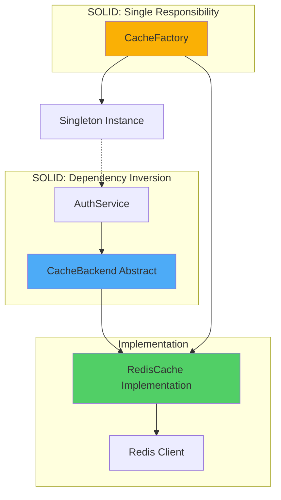
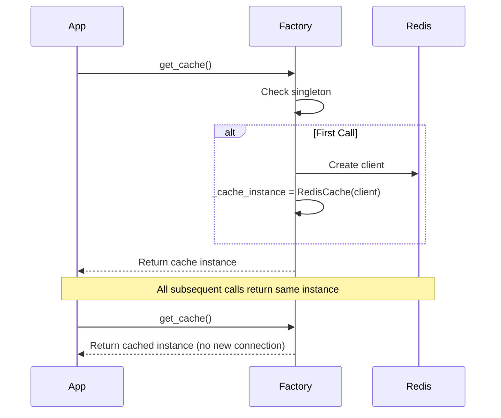

# Cache Layer Architecture

Redis-based caching infrastructure using factory pattern, dependency injection, and SOLID principles for session management and token blacklisting.

---

## Overview

The cache layer provides a clean abstraction over Redis for caching operations, specifically designed for JWT token blacklisting and session management. It follows SOLID principles with an abstract base class, concrete Redis implementation, and factory-based instantiation with singleton lifecycle management.

### Why This Approach?

**SOLID Compliance Benefits:**

- **Testability**: Abstract base allows mocking without Redis
- **Flexibility**: Easy to swap Redis for Memcached/memory cache
- **Separation**: Cache concerns isolated from business logic
- **Dependency Inversion**: Services depend on abstractions, not implementations

## Context

The application requires fast, distributed caching for:

1. **Token Blacklisting**: Revoked JWT refresh tokens (TTL: up to 30 days)
2. **Session Management**: Active session tracking and validation
3. **Future Use Cases**: API response caching, rate limit state (separate Redis DB)

**Key Requirements:**

- Sub-5ms latency for cache operations
- Atomic operations (no race conditions)
- Separate from rate limiter Redis (different DB)
- Production-safe error handling
- Testable without external dependencies

## Architecture Goals

- **Abstraction First**: Define interfaces before implementations (SOLID: DIP)
- **Single Responsibility**: Each component has one clear purpose (SOLID: SRP)
- **Open/Closed**: Extensible without modifying existing code (SOLID: OCP)
- **Liskov Substitution**: Implementations interchangeable (SOLID: LSP)
- **Interface Segregation**: Minimal, focused interfaces (SOLID: ISP)

## Design Decisions

### Decision 1: Abstract Base Class Pattern

**Rationale:** Defines contract for cache operations, enabling dependency injection and test mocking.

**SOLID Principle**: Dependency Inversion Principle (DIP)

```python
# Services depend on abstraction, not concrete Redis
class AuthService:
    def __init__(self, cache: CacheBackend):  # Abstract type
        self.cache = cache
```

**Alternatives Considered:**

- **Direct Redis usage**: Tight coupling, hard to test
- **Protocol classes**: Less explicit, no runtime enforcement

**Trade-offs:**

- ✅ **Pros**: Testable, flexible, clear contract
- ⚠️ **Cons**: Extra layer of abstraction (minimal overhead)

### Decision 2: Factory Pattern with Singleton

**Rationale:** Centralized cache instance creation with connection reuse across requests.

**SOLID Principle**: Single Responsibility Principle (SRP)

```python
def get_cache() -> CacheBackend:
    global _cache_instance
    if _cache_instance is None:
        _cache_instance = RedisCache(redis_client)
    return _cache_instance
```

**Benefits:**

- Connection pooling (one Redis client for entire app)
- Configuration centralization
- Lazy initialization

**Trade-offs:**

- ✅ **Pros**: Efficient, simple, production-tested pattern
- ⚠️ **Cons**: Singleton state (requires reset in tests)

### Decision 3: Separate Redis Database

**Rationale:** Session management cache uses Redis DB 1; rate limiter uses DB 0. Independent scaling and isolation.

**Configuration:**

- **DB 0**: Rate limiting state (high churn, short TTL)
- **DB 1**: Session/token blacklist (longer TTL, lower churn)

**Trade-offs:**

- ✅ **Pros**: Independent configuration, clear separation
- ⚠️ **Cons**: Two Redis connections (negligible overhead)

## Components



### Component 1: CacheBackend (Abstract Base)

**Purpose:** Define contract for all cache implementations.

**SOLID Principle:** Interface Segregation Principle (ISP) - Minimal, focused interface

**Responsibilities:**

- Define CRUD operations (set, get, delete, exists)
- Define lifecycle methods (close)
- Specify async signatures

**Interface:**

```python
class CacheBackend(ABC):
    @abstractmethod
    async def set(self, key: str, value: str, ttl_seconds: int) -> None:
        pass
    
    @abstractmethod
    async def get(self, key: str) -> Optional[str]:
        pass
    
    @abstractmethod
    async def delete(self, key: str) -> None:
        pass
    
    @abstractmethod
    async def exists(self, key: str) -> bool:
        pass
    
    @abstractmethod
    async def close(self) -> None:
        pass
```

**Why These Methods:**

- **set**: Store token with TTL (blacklist revoked tokens)
- **get**: Retrieve session data (if needed in future)
- **delete**: Remove token from blacklist (if needed)
- **exists**: Check if token blacklisted (fast boolean check)
- **close**: Clean shutdown (connection cleanup)

### Component 2: RedisCache (Concrete Implementation)

**Purpose:** Redis-specific implementation of CacheBackend.

**SOLID Principle:** Liskov Substitution Principle (LSP) - Drop-in replacement for abstract base

**Responsibilities:**

- Execute Redis commands via async client
- Handle Redis-specific errors
- Map abstract operations to Redis commands

**Redis Command Mapping:**

```python
set()    → SETEX key ttl value
get()    → GET key
delete() → DEL key
exists() → EXISTS key
close()  → CLOSE connection
```

**Error Handling:**

```python
try:
    await self.client.setex(key, ttl_seconds, value)
except RedisError as e:
    logger.error(f"Redis SET failed: {e}")
    raise CacheError(f"Failed to set cache key: {key}") from e
```

**Why Wrap Exceptions:**

- **Abstraction**: Hide Redis-specific errors from callers
- **Consistency**: All cache errors are `CacheError`
- **Logging**: Centralized error logging

### Component 3: Cache Factory

**Purpose:** Centralized cache instance creation and lifecycle management.

**SOLID Principle:** Single Responsibility Principle (SRP) - Only creates cache instances

**Responsibilities:**

- Create Redis client with correct configuration
- Instantiate RedisCache with client
- Maintain singleton instance
- Provide factory function `get_cache()`

**Configuration:**

```python
def get_cache() -> CacheBackend:
    global _cache_instance
    if _cache_instance is None:
        settings = get_settings()
        redis_client = Redis(
            host=settings.REDIS_HOST,
            port=settings.REDIS_PORT,
            db=1,  # Separate from rate limiter (DB 0)
            decode_responses=True,
            socket_connect_timeout=5,
            socket_timeout=5,
        )
        _cache_instance = RedisCache(redis_client)
    return _cache_instance
```

**Lifecycle:**



## Implementation Details

### Code Organization

```text
src/core/cache/
├── __init__.py          # Public API exports
├── base.py              # CacheBackend abstract base
├── redis_cache.py       # RedisCache implementation
├── factory.py           # Cache factory + singleton
└── exceptions.py        # CacheError exception

src/services/
└── auth_service.py      # Uses cache via DI
```

### Dependency Injection Pattern

**Services receive cache via constructor:**

```python
class AuthService:
    def __init__(
        self,
        db: AsyncSession,
        jwt_service: JWTService,
        password_service: PasswordService,
        cache: CacheBackend = Depends(get_cache),  # DI here
    ):
        self.cache = cache
    
    async def logout(self, refresh_token: str):
        # Blacklist token
        blacklist_key = f"revoked_token:{token_hash}"
        await self.cache.set(blacklist_key, "1", ttl_seconds=2592000)
```

**Benefits:**

- **Testability**: Inject mock cache in tests
- **Flexibility**: Swap implementations without changing services
- **Explicit dependencies**: Clear what service needs

### Key Patterns Used

**1. Abstract Base Class (ABC)**:

```python
from abc import ABC, abstractmethod

class CacheBackend(ABC):
    @abstractmethod
    async def set(self, key: str, value: str, ttl_seconds: int) -> None:
        pass
```

**2. Factory Pattern**:

```python
_cache_instance: Optional[CacheBackend] = None

def get_cache() -> CacheBackend:
    global _cache_instance
    if _cache_instance is None:
        _cache_instance = create_instance()
    return _cache_instance
```

**3. Dependency Injection**:

```python
def some_endpoint(cache: CacheBackend = Depends(get_cache)):
    await cache.exists("key")
```

### Configuration

**Environment Variables:**

```bash
# .env.dev
REDIS_HOST=redis
REDIS_PORT=6379

# Cache uses DB 1 (rate limiter uses DB 0)
```

**Settings:**

```python
class Settings(BaseSettings):
    REDIS_HOST: str = "redis"
    REDIS_PORT: int = 6379
```

## Security Considerations

### Threats Addressed

#### 1. Token Replay Attacks

- **Threat**: Revoked tokens used after logout
- **Mitigation**: Blacklist stores revoked token hashes with TTL matching token expiry

#### 2. Data Leakage

- **Threat**: Sensitive data in cache exposed
- **Mitigation**: Store only token hashes (not plaintext tokens), short TTLs

#### 3. Cache Poisoning

- **Threat**: Malicious data injected into cache
- **Mitigation**: Input validation before caching, hashed keys

### Security Best Practices

**1. Hash Before Storage**:

```python
token_hash = hashlib.sha256(refresh_token.encode()).hexdigest()
blacklist_key = f"revoked_token:{token_hash}"
```

**2. Appropriate TTLs**:

- Match token expiry times
- Don't store indefinitely
- Automatic cleanup via Redis TTL

**3. Network Security**:

- Redis on private network only
- No public Redis access
- TLS for Redis connections (production)

## Performance Considerations

### Performance Characteristics

**Latency (Redis Operations):**

- `EXISTS`: 0.5-1ms (p50), 2-3ms (p95)
- `SETEX`: 1-2ms (p50), 3-4ms (p95)
- `GET`: 0.5-1ms (p50), 2-3ms (p95)

**Throughput:**

- Redis: 100K+ ops/sec on single instance
- Connection pooling: Reuses connections efficiently
- Async operations: Non-blocking I/O

### Optimization Strategies

**1. Connection Pooling (Built-in)**:

```python
redis_client = Redis(
    connection_pool_max_size=50  # Reuse connections
)
```

**2. Pipelining (Future Enhancement)**:

```python
# Batch multiple operations
async with redis_client.pipeline() as pipe:
    pipe.exists(key1)
    pipe.exists(key2)
    results = await pipe.execute()
```

**3. Appropriate TTLs**:

- Short TTLs for high-churn data
- Match business logic TTLs (don't over-cache)

## Testing Strategy

### Unit Tests

**Abstract Base Contract** (`tests/unit/core/test_cache_backend.py`):

- Verify abstract methods defined
- Test exception types

**RedisCache Implementation** (`tests/unit/core/test_cache_backend.py`):

- Mock Redis client
- Test error handling
- Verify command mapping

### Integration Tests

**Redis Storage** (`tests/integration/core/test_cache_backend.py`):

- Real Redis connection
- TTL expiration behavior
- Concurrent access patterns

### Test Fixtures

**Cache Singleton Reset:**

```python
@pytest.fixture(scope="function", autouse=True)
def reset_cache_singleton():
    from src.core.cache import factory
    factory._cache_instance = None
    yield
    factory._cache_instance = None
```

**Why This Matters:**

- Function-scoped fixtures create new cache per test
- Singleton persists across tests without reset
- **Lesson learned**: Always reset singletons in test fixtures

## Future Enhancements

### Priority: P2 (Next Sprint)

1. **Multi-Backend Support**
   - In-memory cache for development
   - Memcached implementation
   - Requires: New concrete implementations

2. **Cache Metrics**
   - Hit/miss rates
   - Operation latency
   - Requires: Prometheus integration

3. **Cache Warmup**
   - Preload frequently accessed data
   - Startup optimization
   - Requires: Warmup strategy

### Priority: P3 (Future)

1. **Distributed Caching**
   - Redis Cluster support
   - Multi-region caching
   - Requires: Infrastructure changes

2. **Cache Compression**
   - Compress large values
   - Reduce network bandwidth
   - Requires: Compression library

3. **TTL Management**
   - Dynamic TTL adjustment
   - Cache invalidation strategies
   - Requires: Policy framework

## References

**Source Code:**

- `src/core/cache/base.py` - CacheBackend abstract base class
- `src/core/cache/redis_cache.py` - RedisCache implementation
- `src/core/cache/factory.py` - Cache factory with singleton pattern

**Documentation:**

- [Testing Guide](../guides/testing-guide.md)
- [SOLID Principles](https://en.wikipedia.org/wiki/SOLID)

---

## Document Information

**Created:** 2025-10-29  
**Last Updated:** 2025-10-29
