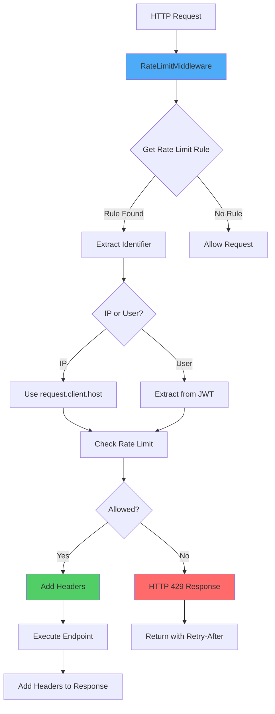
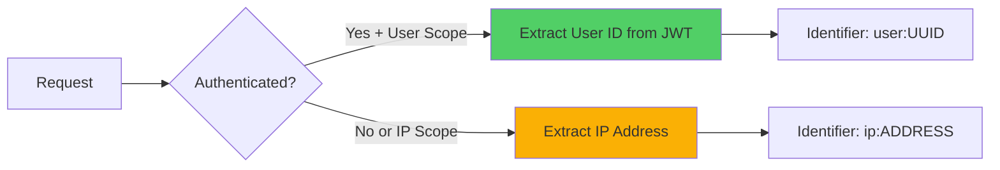

# Rate Limiting Middleware Integration

FastAPI middleware integration for token bucket rate limiting with Redis storage, providing per-endpoint request throttling with fail-open behavior.

---

## Overview

The rate limiting middleware integrates the rate_limiter package with FastAPI, providing HTTP request throttling across all API endpoints. It enforces configurable rate limits per endpoint, adds standard HTTP rate limit headers, and handles violations with HTTP 429 responses.

### Why This Approach?

Middleware-level rate limiting provides:

- **Centralized enforcement**: All requests pass through one enforcement point
- **Framework integration**: Seamless FastAPI integration with standard HTTP semantics
- **Transparent operation**: No changes required to endpoint implementations
- **Standard compliance**: RFC 6585 compliant HTTP 429 responses

## Context

This middleware sits between FastAPI's HTTP layer and application endpoints, evaluating every incoming request against configured rate limits before allowing execution. It uses the independent rate_limiter package for the actual limiting logic and Redis storage.

**Key Requirements:**

- Enforce per-endpoint rate limits without modifying endpoint code
- Add standard rate limit headers to all responses
- Return HTTP 429 with retry information when limits exceeded
- Support both IP-based (unauthenticated) and user-based (authenticated) scoping
- Fail open when rate limiter unavailable (availability > correctness)

## Architecture Goals

- **Zero endpoint coupling**: Endpoints remain unaware of rate limiting
- **Standard HTTP semantics**: Use HTTP 429, Retry-After, X-RateLimit-* headers
- **High availability**: Fail-open behavior prevents rate limiter from blocking traffic
- **Flexibility**: Support multiple scoping strategies (IP, user, endpoint)
- **Observability**: Comprehensive logging and audit trail

## Design Decisions

### Decision 1: ASGI Middleware Pattern

**Rationale:** ASGI middleware provides request/response interception at the framework level, allowing rate limit enforcement before endpoint execution.

**Alternatives Considered:**

- **Dependency injection**: Would require modifying every endpoint
- **Decorator pattern**: Not composable with FastAPI's dependency system
- **Gateway-level**: Requires external infrastructure

**Trade-offs:**

- ✅ **Pros**: Centralized, transparent, no endpoint changes required
- ⚠️ **Cons**: Runs on every request (including static files if not filtered)

### Decision 2: Fail-Open on Errors

**Rationale:** If Redis is down or rate limiter fails, allow requests rather than blocking all traffic. Availability is more important than perfect rate limiting.

**Alternatives Considered:**

- **Fail-closed**: Block all requests on error (too disruptive)
- **Fallback limits**: Use in-memory limits (state loss on restart)

**Trade-offs:**

- ✅ **Pros**: High availability, graceful degradation
- ⚠️ **Cons**: Temporarily unprotected endpoints during outages

### Decision 3: Standard HTTP Headers

**Rationale:** Use RFC 6585 (HTTP 429) and draft-polli-ratelimit-headers standards for client compatibility.

**Headers Added:**

- `X-RateLimit-Limit`: Maximum requests allowed
- `X-RateLimit-Remaining`: Requests remaining in window
- `X-RateLimit-Reset`: Unix timestamp when bucket refills
- `Retry-After`: Seconds to wait before retry (on 429 only)

**Trade-offs:**

- ✅ **Pros**: Standard compliance, client library support
- ⚠️ **Cons**: Slight response size increase (~100 bytes)

## Components



### Component 1: RateLimitMiddleware

**Purpose:** ASGI middleware that intercepts HTTP requests and enforces rate limits.

**Responsibilities:**

- Extract endpoint key from request (method + path)
- Determine scoping (IP-based or user-based)
- Call rate limiter service to check/consume tokens
- Add rate limit headers to responses
- Generate HTTP 429 responses for violations

**Interfaces:**

- **Input**: ASGI scope, receive, send callables
- **Output**: Modified HTTP response with headers, or HTTP 429

**Dependencies:**

- `RateLimitService`: Core rate limiting logic
- `RateLimitConfig`: Endpoint configuration rules
- `PostgreSQLAuditBackend`: Violation logging (optional)

### Component 2: Endpoint Key Extraction

**Purpose:** Build standardized endpoint identifier for rate limit matching.

**Format:** `{METHOD} {path}`

**Examples:**

- `POST /api/v1/auth/register`
- `GET /api/v1/providers`
- `PATCH /api/v1/auth/me`

**Path Normalization:**

- Path parameters preserved: `/api/v1/providers/{provider_id}`
- Query parameters ignored: `/api/v1/providers?page=1` → `/api/v1/providers`

### Component 3: Identifier Extraction

**Purpose:** Determine rate limit bucket identifier (IP or user).

**Scoping Strategies:**



**IP Extraction:**

- Primary: `request.client.host`
- Fallback: `X-Forwarded-For` header (first IP)
- Test clients: Use "testclient" placeholder

**User Extraction:**

- Source: JWT `sub` claim (user ID)
- Requires: Valid authentication token
- Falls back to IP if JWT invalid

## Implementation Details

### Middleware Registration

```python
# src/main.py
from src.rate_limiter.middleware import RateLimitMiddleware

app.add_middleware(RateLimitMiddleware)
```

**Execution Order:**

1. CORS middleware
2. Trusted host middleware
3. **Rate limit middleware** ← Request evaluated here
4. Route matching
5. Authentication dependencies
6. Endpoint execution

### Rate Limit Configuration

```python
# src/rate_limiter/config.py
class RateLimitConfig:
    RULES = {
        "POST /api/v1/auth/register": RateLimitRule(
            max_tokens=10,
            refill_rate=2.0,  # 2 tokens/minute
            scope=RateLimitScope.IP,
        ),
        "GET /api/v1/providers": RateLimitRule(
            max_tokens=100,
            refill_rate=50.0,  # 50 tokens/minute
            scope=RateLimitScope.USER,
        ),
    }
```

### HTTP 429 Response Format

```json
{
  "error": "Rate limit exceeded",
  "message": "Too many requests. Please wait before retrying.",
  "retry_after": 30,
  "endpoint": "POST /api/v1/auth/register"
}
```

**Headers Included:**

```http
HTTP/1.1 429 Too Many Requests
Retry-After: 30
X-RateLimit-Limit: 10
X-RateLimit-Remaining: 0
X-RateLimit-Reset: 1730213400
Content-Type: application/json
```

### Code Organization

```text
src/rate_limiter/
├── middleware.py          # ASGI middleware (THIS DOCUMENT)
├── config.py             # Endpoint rate limit rules
├── service.py            # Core rate limiting service
├── storage/              # Redis storage backend
├── algorithm/            # Token bucket implementation
└── audit/                # Violation logging

src/main.py               # Middleware registration
```

## Security Considerations

### Threats Addressed

#### 1. API Abuse/DoS Prevention

- **Threat**: Malicious actors overwhelming API with requests
- **Mitigation**: Per-IP rate limits on public endpoints (registration, login)

#### 2. Credential Stuffing

- **Threat**: Automated login attempts with stolen credentials
- **Mitigation**: Strict rate limits on `/auth/login` (10 requests/min per IP)

#### 3. Resource Exhaustion

- **Threat**: Expensive operations consuming excessive resources
- **Mitigation**: Per-user rate limits on authenticated endpoints

### Security Best Practices

**1. Layered Defense**: Rate limiting is one layer; combine with:

- Input validation
- Authentication/authorization
- Request payload limits
- CAPTCHA for sensitive operations

**2. IP Spoofing Protection**:

- Trust `X-Forwarded-For` only from known proxies
- Validate IP format before storage
- Use first IP in `X-Forwarded-For` chain

**3. User Enumeration Prevention**:

- Same rate limits for valid/invalid requests
- Don't reveal user existence in error messages

## Performance Considerations

### Performance Characteristics

**Latency Impact:**

- Redis roundtrip: 1-3ms (p50)
- Lua script execution: < 1ms
- Total middleware overhead: 2-5ms (p95)

**Throughput:**

- Redis can handle 100K+ ops/sec
- Middleware adds negligible CPU overhead
- Bottleneck is Redis network latency, not computation

### Optimization Strategies

**1. Redis Connection Pooling**:

```python
# Reuse connections across requests
redis_client = Redis(
    host="redis",
    connection_pool_max_size=50
)
```

**2. Lua Script Atomicity**:

- Single Redis roundtrip for check + consume
- Atomic operations prevent race conditions

**3. Fail-Fast on Unconfigured Endpoints**:

- Early return if endpoint not in RULES
- Avoids unnecessary Redis calls

## Testing Strategy

### Unit Tests

**Middleware Logic** (`tests/api/test_rate_limiting_middleware.py`):

- HTTP 429 response structure
- Rate limit headers present and accurate
- Retry-After calculation
- Fail-open behavior on errors

**Endpoint Key Extraction**:

- Path normalization
- Method + path format
- Query parameter handling

### Integration Tests

**Redis Storage** (`tests/integration/rate_limiter/test_redis_storage_integration.py`):

- Token bucket state persistence
- Concurrent request handling
- Redis connection failures

**Middleware + FastAPI** (`tests/api/test_rate_limiting_middleware.py`):

- Rate limit enforcement on real endpoints
- IP-based vs user-based scoping
- Independent buckets per endpoint

### End-to-End Tests

**Smoke Tests** (`tests/smoke/test_rate_limiting.py`):

- Complete request flow with rate limiting
- Authenticated vs unauthenticated paths
- Rate limit recovery after waiting

## Future Enhancements

### Priority: P2 (Next Sprint)

1. **Dynamic Rate Limit Adjustment**
   - Adjust limits based on server load
   - Premium users get higher limits
   - Requires: Database-backed configuration

2. **Rate Limit Dashboard**
   - Real-time monitoring of rate limit hits
   - Top violators by IP/user
   - Requires: Grafana + Prometheus integration

3. **Bypass Mechanism**
   - Allow specific IPs/users to bypass limits
   - Useful for testing, internal services
   - Requires: Whitelist configuration

### Priority: P3 (Future)

1. **Distributed Rate Limiting**
   - Support multi-instance deployments
   - Redis cluster for HA
   - Requires: Infrastructure setup

2. **Cost-Based Rate Limiting**
   - Different endpoints consume different "costs"
   - Expensive operations cost more tokens
   - Requires: Cost calculation framework

## References

**Source Code:**

- `src/rate_limiter/` - Rate limiting package (independent component)
- `src/rate_limiter/config.py` - Endpoint rate limit configuration
- `src/rate_limiter/middleware.py` - FastAPI middleware integration

**Documentation:**

- [Testing Guide](../guides/testing-guide.md)
- [RFC 6585: HTTP 429 Status Code](https://tools.ietf.org/html/rfc6585)

---

## Document Information

**Created:** 2025-10-29  
**Last Updated:** 2025-10-29
