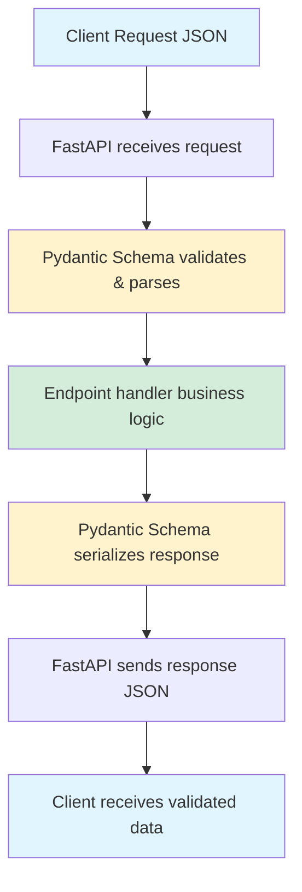

# API Schemas Architecture & Design

Comprehensive guide to Pydantic schema design patterns, validation strategies, and architectural decisions for Dashtam's API data contracts.

## Overview

Schemas in Dashtam are **Pydantic models** that define the structure, validation rules, and documentation for data flowing through our API endpoints. They serve as the **contract** between our API and its clients.

### Key Roles

1. **Request Validation** - Validate incoming data from clients
2. **Response Serialization** - Structure outgoing data to clients
3. **Documentation Generation** - Automatically generate OpenAPI/Swagger docs
4. **Type Safety** - Provide IDE autocomplete and static type checking
5. **Data Transformation** - Convert between API formats and internal models

## Context

Dashtam's API schemas operate within a FastAPI-based architecture, serving as the data contract layer between clients and backend services.

**Operating Environment:**

- **Framework**: FastAPI with Pydantic v2 for data validation
- **API Consumers**: Web frontend, mobile apps, potential third-party integrations
- **Data Flow**: JSON over HTTPS for all client-server communication
- **Validation Layer**: Request validation at API boundary, before business logic
- **Documentation**: Auto-generated OpenAPI (Swagger) specifications

**System Constraints:**

- **Type Safety Required**: Full type hints for IDE support and static analysis
- **Performance**: Sub-millisecond validation overhead for typical requests
- **Maintainability**: Schemas must be reusable across multiple endpoints
- **Versioning**: Support for API version evolution without breaking clients
- **Standards Compliance**: REST API best practices and OpenAPI 3.0 specification

**Key Requirements:**

1. **Separation of Concerns**: Schemas separate from business logic and database models
2. **Comprehensive Validation**: Catch invalid data at API boundary
3. **Self-Documenting**: Schemas generate complete API documentation
4. **Developer Experience**: Clear error messages and IDE autocomplete
5. **Security**: Never expose sensitive internal data in responses

## Architecture Goals

1. **Data Validation** - Ensure all incoming data meets requirements before reaching business logic
2. **Type Safety** - Enable compile-time type checking and IDE autocomplete for all data structures
3. **API Documentation** - Auto-generate comprehensive OpenAPI documentation from schema definitions
4. **Separation of Concerns** - Decouple data structure definitions from business logic and database models
5. **Reusability** - Single source of truth for data structures used across multiple endpoints
6. **Security by Design** - Prevent exposure of sensitive data through strict response schema control
7. **Developer Experience** - Provide clear validation errors and examples for API consumers
8. **Maintainability** - Centralized schema management for easier updates and versioning

## Design Decisions

### What Are Schemas?

### Pydantic Models

Schemas are Python classes that inherit from Pydantic's `BaseModel`:

```python
from pydantic import BaseModel, EmailStr, Field

class LoginRequest(BaseModel):
    """Request schema for user login."""
    
    email: EmailStr = Field(..., description="User's email address")
    password: str = Field(..., description="User's password", min_length=1)
```

### Key Components

1. **Type Annotations** - Define field types (`str`, `int`, `EmailStr`, etc.)
2. **Field Constraints** - Validation rules (`min_length`, `max_length`, etc.)
3. **Descriptions** - Human-readable field documentation
4. **Examples** - Sample data for API documentation
5. **Validators** - Custom validation logic

### Data Flow



### Why Separate Schemas?

**Historical Context:**

**Before** (Inline Approach):

```python
# src/api/v1/providers.py
class ProviderTypeInfo(BaseModel):
    key: str
    name: str
    # ... mixed with endpoint logic

@router.get("/available")
async def get_providers() -> List[ProviderTypeInfo]:
    # ...
```

**Problems:**

- ❌ Tight coupling between API and schemas
- ❌ Cannot reuse schemas across modules
- ❌ Harder to test schemas in isolation
- ❌ Large API files become unwieldy
- ❌ Difficult to maintain consistency

**After** (Separated Approach):

```python
# src/schemas/provider.py
class ProviderTypeInfo(BaseModel):
    key: str
    name: str
    # ... comprehensive documentation

# src/api/v1/providers.py
from src.schemas.provider import ProviderTypeInfo

@router.get("/available")
async def get_providers() -> List[ProviderTypeInfo]:
    # Clean, focused endpoint logic
```

**Benefits:**

- ✅ Single source of truth for data structures
- ✅ Reusable across multiple endpoints
- ✅ Testable independently
- ✅ Clear separation of concerns
- ✅ Easier to maintain and evolve

**Architectural Principles:**

1. **Separation of Concerns** - Schemas handle data structure, endpoints handle logic
2. **DRY (Don't Repeat Yourself)** - One schema definition, used everywhere
3. **Single Responsibility** - Each schema has one job
4. **Open/Closed Principle** - Easy to extend without modifying existing code
5. **Interface Segregation** - Specific schemas for specific purposes

## Components

### Directory Structure

```bash
src/schemas/
├── __init__.py          # Package initialization & documentation
├── common.py            # Shared/utility schemas
├── auth.py              # Authentication & user management
├── provider.py          # Provider management
└── [future-modules]     # Accounts, transactions, etc.
```

### Module Organization

#### common.py

**Purpose:** Schemas used across multiple domains

```python
"""Common schemas shared across API modules."""

class MessageResponse(BaseModel):
    """Generic success/status message."""
    message: str
    detail: Optional[str] = None

class PaginationParams(BaseModel):
    """Standard pagination parameters."""
    page: int = Field(default=1, ge=1)
    page_size: int = Field(default=20, ge=1, le=100)
```

**When to use:**

- Generic responses (success, error messages)
- Pagination, filtering, sorting
- Common enums and constants
- Utility types used everywhere

#### auth.py

**Purpose:** Authentication and user management schemas

```python
"""Authentication schemas for JWT-based auth."""

class RegisterRequest(BaseModel):
    """User registration input."""
    email: EmailStr
    password: str
    name: str

class LoginResponse(BaseModel):
    """Login success with tokens and user info."""
    access_token: str
    refresh_token: str
    token_type: str = "bearer"
    user: UserResponse
```

**When to use:**

- User registration, login, logout
- Token management (refresh, revoke)
- Password reset flows
- Email verification
- Profile management

#### provider.py

**Purpose:** Financial provider management schemas

```python
"""Provider management schemas."""

class ProviderTypeInfo(BaseModel):
    """Available provider type metadata."""
    key: str
    name: str
    is_configured: bool

class CreateProviderRequest(BaseModel):
    """Create new provider connection."""
    provider_key: str
    alias: str
```

**When to use:**

- Provider CRUD operations
- OAuth connection flows
- Provider status and metadata
- Token refresh operations

### Import Patterns

#### Direct Import (Recommended)

```python
# In API endpoints
from src.schemas.auth import LoginRequest, LoginResponse
from src.schemas.provider import ProviderTypeInfo

@router.post("/login", response_model=LoginResponse)
async def login(request: LoginRequest):
    # ...
```

#### Package Import (Alternative)

```python
# For multiple schemas
from src.schemas import auth, provider

@router.post("/login", response_model=auth.LoginResponse)
async def login(request: auth.LoginRequest):
    # ...
```

## Implementation Details

### Schema Types

#### 1. Request Schemas

**Purpose:** Validate incoming data from clients

**Naming Convention:** `*Request`

**Example:**

```python
class RegisterRequest(BaseModel):
    """Request to register a new user account.
    
    Validates email format, password strength, and required fields.
    """
    
    email: EmailStr = Field(..., description="User's email address")
    password: str = Field(
        ...,
        min_length=8,
        max_length=128,
        description="Password (8+ chars, mixed case, digit, special)"
    )
    name: str = Field(..., min_length=1, max_length=100)
```

**Features:**

- Required fields marked with `...`
- Optional fields have defaults
- Validation constraints (`min_length`, `max_length`, etc.)
- Type coercion (string → EmailStr)
- Custom validators for complex logic

#### 2. Response Schemas

**Purpose:** Structure and document outgoing data

**Naming Convention:** `*Response`

**Example:**

```python
class UserResponse(BaseModel):
    """User profile information returned by API.
    
    Never includes sensitive data like password hashes or tokens.
    """
    
    id: UUID
    email: str
    name: Optional[str]
    email_verified: bool
    is_active: bool
    created_at: datetime
    last_login_at: Optional[datetime]
    
    model_config = {
        "json_schema_extra": {
            "example": {
                "id": "123e4567-e89b-12d3-a456-426614174000",
                "email": "john@example.com",
                "name": "John Doe",
                "email_verified": True,
                "is_active": True,
                "created_at": "2025-10-04T20:00:00Z",
                "last_login_at": "2025-10-04T20:30:00Z"
            }
        }
    }
```

**Features:**

- Read-only data (ID, timestamps)
- Computed fields excluded
- Example data for documentation
- Consistent date formatting
- Nested schemas supported

#### 3. Shared/Common Schemas

**Purpose:** Reusable components across domains

**Example:**

```python
class MessageResponse(BaseModel):
    """Generic message for simple operations.
    
    Used when no complex data needs to be returned,
    just a success/status message.
    """
    
    message: str = Field(..., min_length=1)
    detail: Optional[str] = None
```

**Use Cases:**

- Success messages (`"Registration successful"`)
- Status updates (`"Email sent"`)
- Simple confirmations (`"Provider disconnected"`)

#### 4. Nested Schemas

**Purpose:** Complex data structures

**Example:**

```python
class LoginResponse(BaseModel):
    """Login response with tokens and user profile."""
    
    access_token: str
    refresh_token: str
    token_type: str = "bearer"
    expires_in: int = 1800
    user: UserResponse  # Nested schema
```

**Benefits:**

- Structured, hierarchical data
- Reusable nested components
- Clear data relationships
- Better OpenAPI documentation

### Design Patterns

#### Pattern 1: Request-Response Pair

**When:** Endpoint has specific input/output structure

```python
# Registration flow
class RegisterRequest(BaseModel):
    email: EmailStr
    password: str
    name: str

class RegisterResponse(BaseModel):  # or MessageResponse
    message: str
    # Could include user details if needed
```

#### Pattern 2: Shared Response Type

**When:** Multiple endpoints return same structure

```python
# Multiple endpoints return user data
class UserResponse(BaseModel):
    id: UUID
    email: str
    # ...

# Used by multiple endpoints
@router.get("/me", response_model=UserResponse)
@router.patch("/me", response_model=UserResponse)
```

#### Pattern 3: Inheritance for Variations

**When:** Schemas share common fields

```python
class BaseTokenResponse(BaseModel):
    access_token: str
    token_type: str = "bearer"
    expires_in: int

class LoginResponse(BaseTokenResponse):
    refresh_token: str
    user: UserResponse

class RefreshResponse(BaseTokenResponse):
    refresh_token: str
    # No user data on refresh
```

#### Pattern 4: Optional Update Schema

**When:** PATCH endpoints allow partial updates

```python
class UpdateUserRequest(BaseModel):
    """All fields optional for partial updates."""
    
    name: Optional[str] = None
    email: Optional[EmailStr] = None
    
    @field_validator("name")
    @classmethod
    def validate_name(cls, v: Optional[str]) -> Optional[str]:
        if v is not None and not v.strip():
            raise ValueError("Name cannot be empty")
        return v.strip() if v else v
```

#### Pattern 5: Enum for Constants

**When:** Field has fixed set of values

```python
from enum import Enum

class UserRole(str, Enum):
    """User role types."""
    ADMIN = "admin"
    USER = "user"
    READONLY = "readonly"

class UserResponse(BaseModel):
    id: UUID
    role: UserRole  # Validated against enum
```

### Validation & Type Safety

#### Built-in Validators

```python
from pydantic import (
    EmailStr,      # Valid email format
    HttpUrl,       # Valid URL
    UUID4,         # Valid UUID v4
    constr,        # Constrained string
    conint,        # Constrained integer
    Field,         # Field metadata
)

class ExampleSchema(BaseModel):
    # Email validation
    email: EmailStr
    
    # String constraints
    name: str = Field(min_length=1, max_length=100)
    
    # Integer constraints
    age: int = Field(ge=0, le=150)  # ge = greater/equal, le = less/equal
    
    # URL validation
    website: HttpUrl
    
    # UUID validation
    user_id: UUID4
```

#### Custom Validators

```python
from pydantic import field_validator

class PasswordResetConfirm(BaseModel):
    token: str
    new_password: str
    
    @field_validator("new_password")
    @classmethod
    def validate_password_strength(cls, v: str) -> str:
        """Ensure password meets complexity requirements."""
        if len(v) < 8:
            raise ValueError("Password must be at least 8 characters")
        if not any(c.isupper() for c in v):
            raise ValueError("Password must contain uppercase letter")
        if not any(c.islower() for c in v):
            raise ValueError("Password must contain lowercase letter")
        if not any(c.isdigit() for c in v):
            raise ValueError("Password must contain digit")
        return v
```

#### Model Validators

```python
from pydantic import model_validator

class DateRangeRequest(BaseModel):
    start_date: datetime
    end_date: datetime
    
    @model_validator(mode="after")
    def validate_date_range(self) -> "DateRangeRequest":
        """Ensure end_date is after start_date."""
        if self.end_date <= self.start_date:
            raise ValueError("end_date must be after start_date")
        return self
```

#### Type Coercion

Pydantic automatically converts types when possible:

```python
# Input: {"age": "25", "active": "true"}
class User(BaseModel):
    age: int        # "25" → 25 (string to int)
    active: bool    # "true" → True (string to bool)

# But fails on invalid data:
# Input: {"age": "invalid"}
# Raises: ValidationError
```

### OpenAPI Integration

#### Automatic Documentation

Schemas automatically generate OpenAPI (Swagger) documentation:

```python
class LoginRequest(BaseModel):
    """Request to log in to an existing account."""
    
    email: EmailStr = Field(..., description="User's email address")
    password: str = Field(..., description="User's password")
    
    model_config = {
        "json_schema_extra": {
            "example": {
                "email": "john@example.com",
                "password": "SecurePass123!"
            }
        }
    }
```

**Generates:**

- Field names and types
- Field descriptions
- Required vs optional
- Validation constraints
- Example values
- Nested object structure

#### Viewing Documentation

1. **Swagger UI:** http://localhost:8000/docs
2. **ReDoc:** http://localhost:8000/redoc

#### Response Model Declaration

```python
from fastapi import APIRouter
from src.schemas.auth import LoginRequest, LoginResponse

router = APIRouter()

@router.post(
    "/login",
    response_model=LoginResponse,  # Declares response schema
    summary="User Login",
    description="Authenticate user and return JWT tokens"
)
async def login(request: LoginRequest):
    # FastAPI automatically:
    # 1. Validates request against LoginRequest
    # 2. Documents endpoint with both schemas
    # 3. Serializes response using LoginResponse
    # 4. Validates response matches schema (in dev)
    pass
```

### Best Practices

#### 1. Comprehensive Documentation

**Always include:**

- Class docstring explaining purpose
- Field descriptions
- Example data
- Validation rules

```python
class RegisterRequest(BaseModel):
    """Request to register a new user account.
    
    Validates email format, password strength, and required fields.
    Email must be unique in the system.
    """
    
    email: EmailStr = Field(..., description="User's email address")
    password: str = Field(
        ...,
        description="Password (min 8 chars, mixed case, digit, special char)",
        min_length=8,
        max_length=128
    )
    
    model_config = {
        "json_schema_extra": {
            "example": {
                "email": "john@example.com",
                "password": "SecurePass123!",
                "name": "John Doe"
            }
        }
    }
```

#### 2. Consistent Naming

```python
# Request schemas
*Request       # LoginRequest, RegisterRequest
*Params        # PaginationParams, FilterParams

# Response schemas
*Response      # UserResponse, TokenResponse
*Info          # ProviderTypeInfo (metadata)

# Lists
List[*]        # List[UserResponse], List[ProviderTypeInfo]
```

#### 3. Field Ordering

**Logical order:**

1. Required fields first
2. Optional fields after
3. Grouped by category
4. Most important first

```python
class UserResponse(BaseModel):
    # Identity (required, most important)
    id: UUID
    email: str
    
    # Profile (required)
    name: str
    
    # Status (required)
    email_verified: bool
    is_active: bool
    
    # Metadata (optional)
    created_at: datetime
    last_login_at: Optional[datetime]
```

#### 4. Validation Before Database

**Always validate in schemas first:**

```python
# ❌ BAD: Validation in service layer
async def register_user(email: str, password: str):
    if len(password) < 8:
        raise ValueError("Password too short")
    # Database logic...

# ✅ GOOD: Validation in schema
class RegisterRequest(BaseModel):
    password: str = Field(min_length=8)

async def register_user(request: RegisterRequest):
    # Already validated, safe to use
    # Database logic...
```

#### 5. Never Expose Sensitive Data

```python
# ❌ BAD: Exposes password hash
class UserResponse(BaseModel):
    email: str
    password_hash: str  # NEVER DO THIS

# ✅ GOOD: Only safe data
class UserResponse(BaseModel):
    email: str
    # No password_hash field
```

#### 6. Use Type Hints Everywhere

```python
from typing import List, Optional
from uuid import UUID

# ✅ Clear type hints
async def get_user(user_id: UUID) -> UserResponse:
    pass

async def list_users() -> List[UserResponse]:
    pass

async def find_user(email: str) -> Optional[UserResponse]:
    pass
```

#### 7. Separate DTOs from Database Models

**Don't mix concerns:**

```python
# Database model (SQLModel)
class User(SQLModel, table=True):
    id: UUID
    email: str
    password_hash: str  # Internal field
    # ... database-specific fields

# API schema (Pydantic)
class UserResponse(BaseModel):
    id: UUID
    email: str
    # NO password_hash
    # ... API-specific fields
```

#### 8. Version Your Schemas

**For breaking changes:**

```python
# src/schemas/auth_v1.py
class LoginRequestV1(BaseModel):
    username: str
    password: str

# src/schemas/auth_v2.py
class LoginRequestV2(BaseModel):
    email: EmailStr  # Breaking change
    password: str
```

### Examples & Usage

#### Example 1: User Registration Flow

**Schema Definition:**

```python
# src/schemas/auth.py
class RegisterRequest(BaseModel):
    email: EmailStr
    password: str = Field(min_length=8)
    name: str

class MessageResponse(BaseModel):
    message: str
```

**Endpoint Implementation:**

```python
# src/api/v1/auth_jwt.py
from src.schemas.auth import RegisterRequest, MessageResponse
from src.services.auth_service import AuthService

@router.post("/register", response_model=MessageResponse)
async def register(
    request: RegisterRequest,
    session: AsyncSession = Depends(get_session)
):
    auth_service = AuthService(session)
    user, token = await auth_service.register_user(
        email=request.email,
        password=request.password,
        name=request.name
    )
    
    # Send verification email
    await send_verification_email(user.email, token)
    
    return MessageResponse(
        message="Registration successful. Please check your email."
    )
```

**Client Usage:**

```bash
curl -X POST http://localhost:8000/api/v1/auth/register \
  -H "Content-Type: application/json" \
  -d '{
    "email": "john@example.com",
    "password": "SecurePass123!",
    "name": "John Doe"
  }'
```

#### Example 2: Login with Nested Response

**Schema Definition:**

```python
class LoginRequest(BaseModel):
    email: EmailStr
    password: str

class UserResponse(BaseModel):
    id: UUID
    email: str
    name: str
    email_verified: bool

class LoginResponse(BaseModel):
    access_token: str
    refresh_token: str
    token_type: str = "bearer"
    expires_in: int = 1800
    user: UserResponse  # Nested
```

**Endpoint Implementation:**

```python
@router.post("/login", response_model=LoginResponse)
async def login(
    request: LoginRequest,
    session: AsyncSession = Depends(get_session)
):
    auth_service = AuthService(session)
    
    # Authenticate
    user = await auth_service.authenticate_user(
        request.email, 
        request.password
    )
    
    if not user:
        raise HTTPException(401, "Invalid credentials")
    
    # Generate tokens
    access_token = create_access_token(user.id, user.email)
    refresh_token = await create_refresh_token(user.id)
    
    return LoginResponse(
        access_token=access_token,
        refresh_token=refresh_token,
        user=UserResponse(
            id=user.id,
            email=user.email,
            name=user.name,
            email_verified=user.email_verified
        )
    )
```

#### Example 3: PATCH with Optional Fields

**Schema Definition:**

```python
class UpdateUserRequest(BaseModel):
    name: Optional[str] = None
    email: Optional[EmailStr] = None
    
    @field_validator("name")
    @classmethod
    def validate_name(cls, v: Optional[str]) -> Optional[str]:
        if v is not None and not v.strip():
            raise ValueError("Name cannot be empty")
        return v.strip() if v else v
```

**Endpoint Implementation:**

```python
@router.patch("/me", response_model=UserResponse)
async def update_profile(
    request: UpdateUserRequest,
    current_user: User = Depends(get_current_user),
    session: AsyncSession = Depends(get_session)
):
    # Only update provided fields
    if request.name is not None:
        current_user.name = request.name
    
    if request.email is not None:
        current_user.email = request.email
        current_user.email_verified = False
    
    await session.commit()
    await session.refresh(current_user)
    
    return UserResponse.from_orm(current_user)
```

## Security Considerations

### Data Validation at API Boundary

- **Request Validation**: All incoming data validated before reaching business logic
- **Type Safety**: Pydantic ensures type correctness and prevents type confusion attacks
- **Input Sanitization**: Field constraints prevent injection attacks (SQL, NoSQL, command injection)

### Sensitive Data Protection

- **Response Filtering**: Never expose password hashes, tokens, or internal IDs in response schemas
- **Field Exclusion**: Use separate response schemas that explicitly exclude sensitive fields
- **Example Validation**: Ensure example data in schemas doesn't contain real credentials

### Validation Security

- **Length Limits**: All string fields have `max_length` constraints to prevent DOS attacks
- **Email Validation**: Use `EmailStr` type to prevent email header injection
- **Custom Validators**: Implement password complexity, allowed characters, format validation

## Performance Considerations

### Validation Overhead

- **Sub-millisecond Performance**: Pydantic v2 validation is highly optimized (Rust core)
- **Lazy Validation**: Validation only occurs when data is accessed
- **Schema Caching**: Pydantic caches schema compilation for reuse

### Response Serialization

- **Efficient JSON Serialization**: FastAPI uses optimized JSON serialization
- **Field Exclusion**: Use `response_model_exclude` for large objects when needed
- **Pagination**: Always paginate list responses to prevent large payload overhead

### Schema Compilation

- **Startup Overhead**: Schemas compiled at application startup (one-time cost)
- **Reusability**: Share common schemas across endpoints to reduce compilation overhead

## Testing Strategy

### Unit Testing Schemas

```python
# tests/unit/schemas/test_auth_schemas.py
import pytest
from pydantic import ValidationError
from src.schemas.auth import RegisterRequest, LoginRequest

class TestRegisterRequest:
    """Test registration request validation."""
    
    def test_valid_registration(self):
        """Test valid registration data."""
        data = {
            "email": "test@example.com",
            "password": "SecurePass123!",
            "name": "Test User"
        }
        request = RegisterRequest(**data)
        assert request.email == "test@example.com"
        assert request.name == "Test User"
    
    def test_invalid_email(self):
        """Test invalid email format."""
        with pytest.raises(ValidationError) as exc:
            RegisterRequest(
                email="invalid-email",
                password="SecurePass123!",
                name="Test"
            )
        assert "email" in str(exc.value)
    
    def test_short_password(self):
        """Test password too short."""
        with pytest.raises(ValidationError) as exc:
            RegisterRequest(
                email="test@example.com",
                password="short",
                name="Test"
            )
        assert "min_length" in str(exc.value).lower()
    
    def test_empty_name(self):
        """Test empty name rejection."""
        with pytest.raises(ValidationError) as exc:
            RegisterRequest(
                email="test@example.com",
                password="SecurePass123!",
                name=""
            )
        assert "name" in str(exc.value)
```

### Integration Testing with Endpoints

```python
# tests/api/test_auth_jwt_endpoints.py
from fastapi.testclient import TestClient

def test_register_success(client: TestClient):
    """Test successful registration."""
    response = client.post("/api/v1/auth/register", json={
        "email": "newuser@example.com",
        "password": "SecurePass123!",
        "name": "New User"
    })
    
    assert response.status_code == 200
    data = response.json()
    assert "message" in data
    assert "successful" in data["message"].lower()

def test_register_invalid_email(client: TestClient):
    """Test registration with invalid email."""
    response = client.post("/api/v1/auth/register", json={
        "email": "invalid-email",
        "password": "SecurePass123!",
        "name": "Test"
    })
    
    assert response.status_code == 422  # Validation error
    data = response.json()
    assert "email" in str(data).lower()
```

### Migration Guide

#### Migrating Inline Schemas to Separate Files

**Step 1: Extract Schema:**

Before:

```python
# src/api/v1/providers.py
class ProviderTypeInfo(BaseModel):
    key: str
    name: str

@router.get("/available")
async def get_providers() -> List[ProviderTypeInfo]:
    pass
```

After:

```python
# src/schemas/provider.py
class ProviderTypeInfo(BaseModel):
    """Available provider type information."""
    key: str = Field(..., description="Provider identifier")
    name: str = Field(..., description="Display name")

# src/api/v1/providers.py
from src.schemas.provider import ProviderTypeInfo

@router.get("/available")
async def get_providers() -> List[ProviderTypeInfo]:
    pass
```

**Step 2: Update Imports:**

Find all usages:

```bash
grep -r "ProviderTypeInfo" src/
```

Update imports:

```python
# Old
from src.api.v1.providers import ProviderTypeInfo

# New
from src.schemas.provider import ProviderTypeInfo
```

**Step 3: Test:**

```bash
# Run tests
make test

# Check API docs still work
open http://localhost:8000/docs
```

## Future Enhancements

### Planned Improvements

- **Schema Versioning Strategy**: Implement systematic API versioning (v1, v2) for breaking changes
- **Advanced Validation**: Add cross-field validation patterns for complex business rules
- **Performance Optimization**: Profile and optimize validation for high-throughput endpoints
- **Documentation Enhancement**: Auto-generate client SDKs from OpenAPI schemas
- **Testing Utilities**: Create schema factories and fixtures for easier test data generation

### Known Limitations

- **Manual Schema Updates**: Schema changes require manual updates to maintain consistency
- **Limited Datetime Validation**: No built-in validation for business-specific date rules
- **Complex Nested Validation**: Deeply nested schemas can be challenging to validate comprehensively

## References

### Related Dashtam Documentation

- [RESTful API Design](restful-api-design.md) - API design standards and best practices
- [JWT Authentication Architecture](jwt-authentication.md) - Auth schemas implementation
- [Async vs Sync Patterns](async-vs-sync-patterns.md) - Service layer patterns

### External Resources

- **Pydantic Documentation**: https://docs.pydantic.dev/
- **FastAPI Documentation**: https://fastapi.tiangolo.com/
- **OpenAPI Specification**: https://swagger.io/specification/

### Project Files

- `src/schemas/` - All Pydantic schema definitions
- `tests/unit/schemas/` - Unit tests for schema validation
- `tests/api/` - API endpoint integration tests

---

## Document Information

**Template:** [architecture-template.md](../../templates/architecture-template.md)
**Created:** 2025-10-04
**Last Updated:** 2025-10-16
