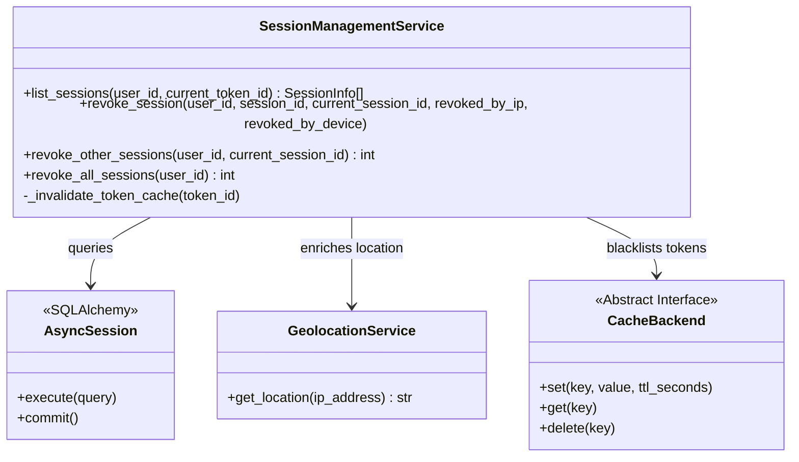
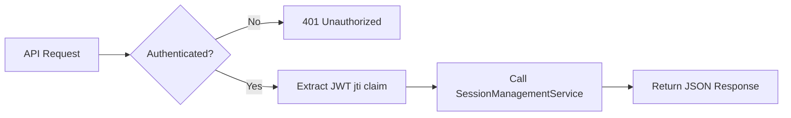
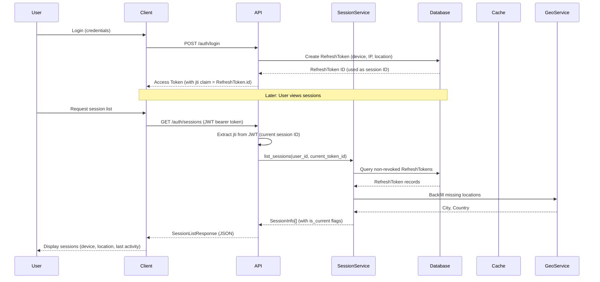
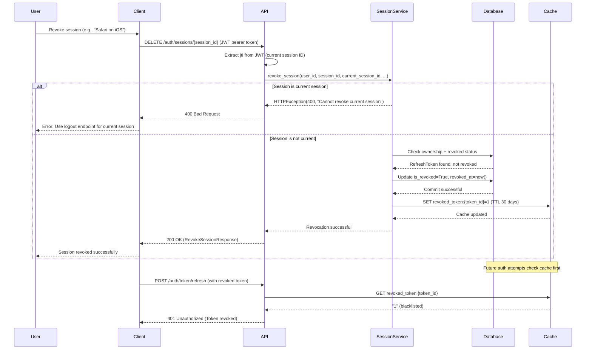
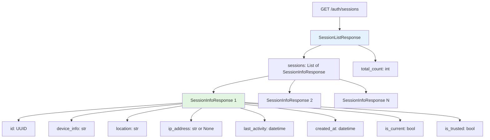

# Session Management Architecture

JWT-based session management with multi-device tracking, token blacklisting, and comprehensive session control APIs for enhanced security and user experience.

---

## Overview

The session management architecture provides users with visibility and control over their active authentication sessions across multiple devices. Unlike traditional session stores, this system leverages JWT access tokens for stateless authentication while maintaining persistent refresh token metadata for session tracking and revocation.

### Why This Approach?

Modern applications require balancing security with user experience. Users need to:

- See where they're logged in (devices, locations, timestamps)
- Revoke compromised sessions immediately
- Maintain single or multiple device access based on preference
- Respond quickly to security incidents

This architecture achieves these goals while maintaining the performance benefits of JWT-based authentication.

## Context

### Constraints and Requirements

**Security Requirements:**

- Immediate session revocation capability (security incident response)
- Token blacklisting with cache (prevent token replay)
- Audit trail for all session operations
- Protection against token theft and replay attacks

**User Experience Requirements:**

- Intuitive session list (device, location, last activity)
- Current session identification
- Granular revocation control (single, others, all)
- No performance degradation from session tracking

**Technical Constraints:**

- JWT access tokens (stateless, 30-minute TTL)
- Opaque refresh tokens (stateful, 30-day TTL)
- Redis cache for blacklist (sub-millisecond lookups)
- PostgreSQL for persistent session metadata

## Architecture Goals

- **Visibility**: Users can see all active sessions with enriched metadata (device, location, timestamps)
- **Control**: Granular session revocation (single, others, all) with immediate effect
- **Security**: Token blacklisting, audit logging, and protection against current session revocation
- **Performance**: Cache-backed blacklist checks, minimal database overhead
- **Compliance**: PCI-DSS, GDPR-compliant session management with audit trails

## Design Decisions

### Decision 1: Refresh Tokens as Sessions

**Rationale:** Each refresh token represents a unique session (device login). Tracking refresh tokens provides session metadata without duplicating data structures.

**Alternatives Considered:**

- **Alternative A: Separate session table** - Why not chosen: Redundant with refresh tokens, doubles storage, complicates synchronization
- **Alternative B: JWT-only (no refresh tokens)** - Why not chosen: No revocation capability, security risk, no session visibility

**Trade-offs:**

- ✅ **Pros:** Single source of truth, no data duplication, natural session lifecycle matches token expiry
- ⚠️ **Cons:** Refresh token table serves dual purpose (auth + session tracking), conceptual coupling

### Decision 2: Redis Cache for Token Blacklist

**Rationale:** Immediate revocation requires checking blacklist on every authentication request. Redis provides sub-millisecond lookups with TTL support.

**Alternatives Considered:**

- **Alternative A: Database-only blacklist** - Why not chosen: Performance bottleneck (network + query latency)
- **Alternative B: JWT revocation lists** - Why not chosen: No standard, requires token versioning, client-side complexity

**Trade-offs:**

- ✅ **Pros:** Sub-millisecond lookups, automatic TTL expiration, cache warming strategies
- ⚠️ **Cons:** Additional infrastructure dependency, cache invalidation complexity

### Decision 3: Cannot Revoke Current Session Individually

**Rationale:** Prevent accidental self-lockout. Users must use dedicated logout endpoint for current session.

**Alternatives Considered:**

- **Alternative A: Allow current session revocation** - Why not chosen: User confusion, accidental lockouts
- **Alternative B: Confirmation prompt** - Why not chosen: API-level decision, frontend can add confirmation

**Trade-offs:**

- ✅ **Pros:** Prevents accidental lockouts, clear separation of concerns (logout vs. revoke)
- ⚠️ **Cons:** Additional validation logic, slightly less flexible for power users

### Decision 4: Device Fingerprinting via User-Agent

**Rationale:** Use User-Agent header for device identification (browser, OS). Balance between simplicity and accuracy.

**Alternatives Considered:**

- **Alternative A: Canvas fingerprinting** - Why not chosen: Privacy concerns, requires JavaScript, client-side complexity
- **Alternative B: No fingerprinting** - Why not chosen: No device visibility, poor UX

**Trade-offs:**

- ✅ **Pros:** Simple, no client-side code, privacy-friendly, works with all clients
- ⚠️ **Cons:** User-Agent spoofing possible, lower accuracy than advanced fingerprinting

## Components

### Component 1: SessionManagementService

**Purpose:** Core business logic for session operations (list, revoke, bulk operations)

**Responsibilities:**

- Query and enrich active sessions (device, location, timestamps)
- Revoke sessions with authorization checks
- Cache invalidation (token blacklist)
- Audit logging for all operations

**Interfaces:**

- **Input:** User ID, session ID, request context (IP, device)
- **Output:** Session metadata (SessionInfo), revocation confirmations

**Dependencies:**

- **AsyncSession:** Database operations (query, update, commit)
- **GeolocationService:** IP → city/country conversion
- **CacheBackend:** Token blacklist for immediate revocation



### Component 2: Sessions API Router

**Purpose:** REST API endpoints for user-facing session control

**Responsibilities:**

- Expose session list, revoke, bulk revoke endpoints
- JWT authentication and authorization
- Rate limiting configuration (per-endpoint)
- Extract current session ID from JWT (jti claim)

**Interfaces:**

- **Input:** HTTP requests (GET, DELETE) with JWT bearer token
- **Output:** JSON responses (SessionListResponse, RevokeSessionResponse, BulkRevokeResponse)

**Dependencies:**

- **SessionManagementService:** Business logic delegation
- **JWTService:** Token decoding (jti claim extraction)
- **get_current_user:** Authentication dependency (JWT validation)



### Component 3: SessionInfo Data Class

**Purpose:** Intermediate data structure for session metadata (database → API layer)

**Responsibilities:**

- Enrich device and location fields with defaults
- Calculate current session flag (compare token IDs)
- Provide to_dict() serialization

**Interfaces:**

- **Input:** RefreshToken model fields
- **Output:** Dictionary for JSON serialization

**Dependencies:** None (pure data class)

### Component 4: Session Pydantic Schemas

**Purpose:** Request/response validation and API documentation

**Responsibilities:**

- SessionInfoResponse: Single session metadata
- SessionListResponse: List of sessions with total count
- RevokeSessionResponse: Single revocation confirmation
- BulkRevokeResponse: Bulk revocation confirmation

**Interfaces:**

- **Input:** SessionManagementService outputs
- **Output:** JSON-serializable dictionaries

**Dependencies:** Pydantic v2 (validation, ConfigDict)

## Implementation Details

### Key Patterns Used

- **Dependency Injection:** Service dependencies (session, geo_service, cache) injected via constructor
- **Repository Pattern (Implicit):** SessionManagementService encapsulates database queries
- **DTO (Data Transfer Object):** SessionInfo bridges database models and API schemas
- **Fail-Safe Cache Invalidation:** Cache errors logged but don't fail revocation (DB is source of truth)

### Code Organization

```text
src/
├── api/
│   └── v1/
│       └── sessions.py            # API endpoints (GET /sessions, DELETE /sessions/{id}, etc.)
├── services/
│   └── session_management_service.py   # Business logic (list, revoke, bulk ops)
├── schemas/
│   └── session.py                 # Pydantic models (SessionInfoResponse, etc.)
├── models/
│   └── auth.py                    # RefreshToken SQLModel (reused for sessions)
└── core/
    ├── cache/                     # Cache abstraction (CacheBackend, RedisCache)
    └── fingerprinting.py          # format_device_info(user_agent)
```

### Session Tracking Flow



### Token Revocation Flow



### Session List API Response Structure



### Configuration

**Environment Variables:**

- **REDIS_URL:** Cache backend connection string (e.g., `redis://localhost:6379/0`)
- **JWT_SECRET_KEY:** JWT signing key for token validation
- **ACCESS_TOKEN_EXPIRE_MINUTES:** Access token TTL (default: 30 minutes)
- **REFRESH_TOKEN_EXPIRE_DAYS:** Refresh token TTL (default: 30 days)

**Rate Limiting (see RateLimitConfig):**

- `GET /auth/sessions`: 10 requests/minute per user
- `DELETE /auth/sessions/{id}`: 20 requests/minute per user
- `DELETE /auth/sessions/others/revoke`: 5 requests/hour per user
- `DELETE /auth/sessions/all/revoke`: 3 requests/hour per user

**Cache TTL:**

- Blacklisted tokens: 30 days (matches refresh token expiration)
- Geolocation cache: 7 days (IP → location mapping)

## Security Considerations

### Threats Addressed

#### Threat 1: Token Theft and Replay

- **Mitigation:** Redis cache blacklist for immediate revocation, database revocation as source of truth
- **Impact:** Stolen tokens rendered useless within seconds (cache propagation delay)

#### Threat 2: Unauthorized Session Revocation

- **Mitigation:** JWT authentication required, ownership check (session.user_id == current_user.id)
- **Impact:** Users can only revoke their own sessions, not others'

#### Threat 3: Accidental Self-Lockout

- **Mitigation:** Cannot revoke current session individually (must use logout endpoint)
- **Impact:** Prevents user confusion and accidental lockouts

#### Threat 4: Session Hijacking

- **Mitigation:** Device fingerprinting, location tracking, audit logs, email alerts (planned)
- **Impact:** Suspicious sessions detected and revoked quickly

#### Threat 5: Brute Force Session Enumeration

- **Mitigation:** Rate limiting (5-20 requests/minute), UUID session IDs (not sequential)
- **Impact:** Attackers cannot enumerate or guess session IDs

### Security Best Practices

- **Token Hash Storage:** Refresh tokens stored as bcrypt hashes (not plaintext)
- **Immediate Revocation:** Cache check before database query (fail-fast)
- **Audit Logging:** All session operations logged (user, IP, device, timestamp)
- **TTL Alignment:** Cache blacklist TTL matches token expiration (no stale entries)
- **Authorization Checks:** Every operation validates user owns session

## Performance Considerations

### Performance Characteristics

**List Sessions:**

- **Query Complexity:** `O(n)` where n = number of user sessions (typically 1-5)
- **Database:** Single SELECT with WHERE + ORDER BY (indexed on user_id)
- **Geolocation:** Cached lookups (7-day TTL), backfill on cache miss
- **Expected Latency:** 50-150ms (database + cache + geolocation)

**Revoke Session:**

- **Query Complexity:** `O(1)` (single SELECT + UPDATE)
- **Database:** Two queries (ownership check + revocation)
- **Cache Invalidation:** Single SET operation (sub-millisecond)
- **Expected Latency:** 20-50ms (database + cache)

**Bulk Revocation (Others):**

- **Query Complexity:** `O(n)` where n = number of other sessions
- **Database:** Bulk UPDATE (not individual queries)
- **Cache Invalidation:** Parallel SET operations
- **Expected Latency:** 50-200ms (depends on session count)

**Bulk Revocation (All):**

- **Query Complexity:** `O(n)` where n = total sessions
- **Database:** Bulk UPDATE
- **Cache Invalidation:** Parallel SET operations
- **Expected Latency:** 50-200ms

### Optimization Strategies

**Database Indexes:**

```sql
-- Existing indexes on RefreshToken table
CREATE INDEX idx_refresh_tokens_user_id ON refresh_tokens(user_id);
CREATE INDEX idx_refresh_tokens_expires_at ON refresh_tokens(expires_at);
CREATE INDEX idx_refresh_tokens_is_revoked ON refresh_tokens(is_revoked);

-- Composite index for session listing (optimal)
CREATE INDEX idx_session_lookup ON refresh_tokens(user_id, is_revoked, expires_at)
WHERE is_revoked = FALSE AND expires_at > NOW();
```

**Cache Warming:**

- Preload geolocation cache for common IP ranges (ISPs, data centers)
- Geolocation service uses MaxMind GeoLite2 database (local, no network calls)

**Pagination (Future):**

- For users with >50 sessions (rare), implement cursor-based pagination
- Current implementation loads all sessions (acceptable for typical 1-5 sessions per user)

**Connection Pooling:**

- PostgreSQL connection pool: 10-20 connections (FastAPI async)
- Redis connection pool: 10 connections (aioredis)

## Testing Strategy

### Unit Tests

**Session Service Unit Tests (15 tests planned):**

- list_sessions: Query logic, enrichment, sorting
- revoke_session: Authorization, ownership, current session protection
- revoke_other_sessions: Bulk logic, current session exclusion
- revoke_all_sessions: Nuclear option logic
- _invalidate_token_cache: Cache interaction, error handling

**Fixture Strategy:**

- Function-scoped fixtures for test isolation (no state pollution)
- Mock GeolocationService (no external API calls)
- Mock CacheBackend (in-memory cache for tests)

### Integration Tests

**Session Service Integration Tests (8 tests planned):**

- End-to-end flows with real database and Redis cache
- Verify cache invalidation persists
- Verify database state after revocation
- Verify geolocation backfill on cache miss

**Test Database:**

- Isolated test database (not shared with dev/prod)
- Alembic migrations run automatically in test environment

### API Endpoint Tests

**Sessions API Tests (12 tests - COMPLETE):**

- ✅ **Authentication:** Endpoints require JWT (401 without token)
- ✅ **List Sessions:** Returns all active sessions with metadata
- ✅ **Revoke Session:** Successfully revokes non-current session
- ✅ **Current Session Protection:** Cannot revoke current session (400)
- ✅ **Authorization:** Cannot revoke other users' sessions (404)
- ✅ **Bulk Revoke (Others):** Keeps current, revokes all others
- ✅ **Bulk Revoke (All):** Revokes all sessions including current

**Test Coverage:**

- 12/12 API tests passing (100%)
- All happy paths, error paths, and edge cases covered
- No issues when running in full suite (fixture scopes fixed)

### End-to-End Tests

**Smoke Tests (Session Management Flow):**

1. Register user
2. Login from Device A (Chrome on macOS)
3. Login from Device B (Safari on iOS)
4. List sessions (verify 2 sessions, 1 current)
5. Revoke Device B from Device A
6. List sessions (verify 1 session)
7. Attempt to refresh token from Device B (expect 401)

**Planned E2E Tests:**

- Multi-device login and revocation flow
- Session hijacking detection (suspicious IP/device)
- Email alert triggering (security incident)

## Future Enhancements

### Priority 1: Email Alerts

**Description:** Send email alerts when session is revoked from different device/IP

**Rationale:** Security awareness for users, detect account compromise

**Implementation:**

- Trigger email in `revoke_session()` when revoked_by_ip != token.ip_address
- Email template: "Your session on [device] was revoked from [revoked_by_device] at [timestamp]"
- Use existing EmailService (AWS SES integration)

### Priority 2: Trusted Device Management

**Description:** Allow users to mark devices as trusted, skip 2FA on trusted devices

**Rationale:** Improve UX for frequently used devices

**Implementation:**

- Add `is_trusted_device` flag to RefreshToken (already exists)
- Add API endpoint: `PATCH /auth/sessions/{id}/trust` (toggle trust flag)
- Integrate with 2FA flow (skip 2FA if `is_trusted_device=True`)

### Priority 3: Session Analytics

**Description:** Track session usage patterns (login frequency, device trends, location anomalies)

**Rationale:** Security insights, detect suspicious behavior

**Implementation:**

- Aggregate session data (daily/weekly login counts)
- Detect anomalies (new location, new device type)
- Dashboard endpoint: `GET /auth/sessions/analytics`

### Priority 4: Session Expiry Notifications

**Description:** Notify users 7 days before refresh token expires

**Rationale:** Prevent unexpected logouts, improve UX

**Implementation:**

- Background job (Celery) checks expiring tokens daily
- Email notification: "Your session will expire in 7 days, please log in again"
- Add endpoint: `POST /auth/sessions/{id}/extend` (extend token TTL)

### Priority 5: Admin Session Management

**Description:** Allow admins to view and revoke user sessions (security response)

**Rationale:** Support team needs session management for compromised accounts

**Implementation:**

- Admin-only endpoints: `GET /admin/users/{user_id}/sessions`, `DELETE /admin/users/{user_id}/sessions/{session_id}`
- Audit log with admin details (who revoked what)
- Rate limiting: 100 requests/hour (admin operations)

## References

- [JWT Authentication Architecture](jwt-authentication.md) - Overall auth system design
- [Cache Layer Architecture](cache-layer-architecture.md) - Redis cache implementation
- [Rate Limiting Middleware Integration](rate-limiting-middleware-integration.md) - Rate limiting for session endpoints
- [RESTful API Design](restful-api-design.md) - REST compliance standards
- [Testing Guide](../guides/testing-guide.md) - Testing strategy and fixture best practices

**External Resources:**

- [RFC 7519: JSON Web Token (JWT)](https://datatracker.ietf.org/doc/html/rfc7519)
- [RFC 6749: OAuth 2.0 (Token Revocation)](https://datatracker.ietf.org/doc/html/rfc6749)
- [OWASP Session Management Cheat Sheet](https://cheatsheetseries.owasp.org/cheatsheets/Session_Management_Cheat_Sheet.html)

---

## Document Information

**Template:** [architecture-template.md](../../templates/architecture-template.md)
**Created:** 2025-10-29
**Last Updated:** 2025-10-29
