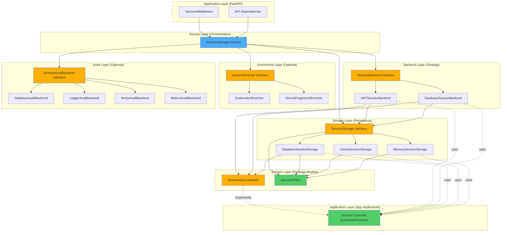

# Session Manager Package Architecture

Pluggable, framework-agnostic session management package following SOLID principles and Strategy Pattern, designed for reusability across multiple applications and frameworks.

---

## Overview

The `session_manager` package provides comprehensive session management capabilities (creation, tracking, revocation, enrichment) with zero coupling to specific frameworks, databases, or authentication mechanisms. It follows the exact architectural patterns established by the `rate_limiter` package, ensuring consistency and maintainability.

### Why This Approach?

**Pluggable architecture provides:**

- **Reusability**: Use across FastAPI, Flask, Django, vanilla Python, microservices
- **Framework independence**: Zero coupling to FastAPI, SQLModel, or Dashtam-specific code
- **Storage flexibility**: Swap PostgreSQL, Redis, memory, or custom storage backends
- **Backend flexibility**: Support JWT-based, database-backed, or hybrid session strategies
- **SOLID compliance**: All 5 SOLID principles explicitly implemented
- **Testability**: Mock any component for isolated testing
- **Consistency**: Mirrors rate_limiter architecture (familiar pattern)

## Context

### Problem Statement

Current session management (`src/services/session_management_service.py`) is tightly coupled to:

- Dashtam's specific models (`RefreshToken`)
- SQLModel/PostgreSQL
- FastAPI dependencies
- JWT refresh token implementation

**Result**: Cannot reuse in other projects, hard to test, difficult to extend

### Solution: Pluggable Package

Build standalone `src/session_manager/` package following rate_limiter pattern:

- Abstract interfaces (SessionBackend, SessionStorage)
- Concrete implementations (JWT backend, PostgreSQL storage, Redis storage)
- Dependency injection (factory pattern)
- Framework adapters (FastAPI middleware)
- Zero application coupling

## Architecture Goals

1. **G1: Framework Independence** - Works with any Python web framework or standalone
2. **G2: Storage Abstraction** - Support PostgreSQL, Redis, memory, or custom storage
3. **G3: Backend Abstraction** - Support different session strategies (JWT, opaque, hybrid)
4. **G4: SOLID Compliance** - All 5 principles explicitly implemented and documented
5. **G5: Consistency** - Mirror rate_limiter architecture exactly (same patterns, same structure)
6. **G6: Test Coverage** - 100% coverage with isolated unit tests (no database required)
7. **G7: Reusability** - Package can be extracted and used independently

## Design Decisions

### Decision 1: Three-Layer Architecture (Like Rate Limiter)

**Rationale**: Separate concerns using Strategy Pattern with dependency injection

**Layers**:

1. **Interface Layer**: Abstract base classes (SessionBackend, SessionStorage)
2. **Implementation Layer**: Concrete backends/storage (JWT backend, Postgres storage)
3. **Orchestration Layer**: Service class that combines components (SessionManagerService)

**SOLID Principle**: Dependency Inversion Principle (DIP)

**Alternatives Considered**:

- **Single monolithic class**: Rejected - violates SRP, hard to test, no flexibility
- **Direct framework coupling**: Rejected - not reusable, tight coupling

**Trade-offs**:

- ✅ **Pros**: Testable, flexible, reusable, follows industry patterns
- ⚠️ **Cons**: More files/classes than monolithic approach

### Decision 2: SessionBackend Abstraction (Session Strategy)

**Rationale**: Abstract "what is a session" from "how sessions are stored"

**Interface** (`src/session_manager/backends/base.py`):

```python
from abc import ABC, abstractmethod
from typing import Optional, List
from src.session_manager.models.base import SessionBase

class SessionBackend(ABC):
    """Abstract session backend (session strategy).
    
    Works with SessionBase (abstract). App provides concrete Session implementation.
    
    Implementations define session lifecycle (creation, validation, enrichment).
    Examples: JWT-based sessions, opaque token sessions, hybrid sessions.
    """
    
    @abstractmethod
    async def create_session(
        self, user_id: str, device_info: str, ip_address: str, **metadata
    ) -> str:
        """Create session, return session ID.
        
        Backend creates app's concrete Session model (via dependency injection).
        """
        pass
    
    @abstractmethod
    async def get_session(self, session_id: str) -> Optional[SessionBase]:
        """Retrieve session by ID.
        
        Returns app's concrete Session model implementing SessionBase.
        """
        pass
    
    @abstractmethod
    async def list_sessions(self, user_id: str) -> List[SessionBase]:
        """List all active sessions for user.
        
        Returns list of app's concrete Session models.
        """
        pass
    
    @abstractmethod
    async def revoke_session(self, session_id: str, reason: str) -> bool:
        """Revoke specific session."""
        pass
```

**SOLID Principle**: Single Responsibility Principle (SRP) + Interface Segregation (ISP)

**Implementations**:

- `JWTSessionBackend`: JWT refresh token sessions (like current Dashtam)
- `DatabaseSessionBackend`: Traditional database-backed sessions
- Custom backends: Application-specific strategies

### Decision 3: SessionStorage Abstraction (Persistence)

**Rationale**: Abstract storage mechanism from session logic (like rate_limiter storage)

**Interface** (`src/session_manager/storage/base.py`):

```python
from abc import ABC, abstractmethod
from typing import Optional, List, Type
from src.session_manager.models.base import SessionBase
from src.session_manager.models.filters import SessionFilters

class SessionStorage(ABC):
    """Abstract storage backend for session persistence.
    
    Works with SessionBase (abstract). App provides concrete Session implementation.
    Storage implementations never import app's concrete Session model.
    
    Implementations handle CRUD operations for sessions.
    Examples: PostgreSQL, Redis, memory, custom storage.
    """
    
    @abstractmethod
    async def save_session(self, session: SessionBase) -> None:
        """Persist session to storage.
        
        Args:
            session: App's concrete Session model (implements SessionBase)
        """
        pass
    
    @abstractmethod
    async def get_session(self, session_id: str) -> Optional[SessionBase]:
        """Retrieve session from storage.
        
        Returns:
            App's concrete Session model or None if not found
        """
        pass
    
    @abstractmethod
    async def list_sessions(
        self, user_id: str, filters: Optional[SessionFilters] = None
    ) -> List[SessionBase]:
        """List sessions with optional filters.
        
        Args:
            user_id: User ID to list sessions for
            filters: Optional filters (active_only, device_type, ip_address, etc.)
                    See SessionFilters model in src/session_manager/models/filters.py
        
        Returns:
            List of app's concrete Session models
        """
        pass
    
    @abstractmethod
    async def revoke_session(self, session_id: str, reason: str) -> bool:
        """Mark session as revoked."""
        pass
    
    @abstractmethod
    async def delete_session(self, session_id: str) -> bool:
        """Permanently delete session."""
        pass
```

**SOLID Principle**: Open-Closed Principle (OCP) + Liskov Substitution (LSP)

**Implementations**:

- `DatabaseSessionStorage`: Database-backed storage (PostgreSQL, MySQL, SQLite - app provides AsyncSession + model)
- `CacheSessionStorage`: Cache-backed storage (Redis, Memcached - app provides cache client)
- `MemorySessionStorage`: In-memory dict storage (testing/development - no external dependencies)
- Custom storage: Application-specific persistence

**Key Design**: Storage implementations are database/cache-agnostic. App provides database session + model (for database storage) or cache client (for cache storage). Package never dictates database or cache choice.

### Decision 4: Domain Model (Abstract Base Class Pattern)

**Rationale**: Package defines interface, application implements concrete model (follows rate_limiter pattern)

**Architecture Pattern** (Same as rate_limiter):

```text
session_manager/models/base.py     ← Package defines SessionBase (abstract)
app/src/models/session.py          ← App implements Session (concrete SQLModel/Pydantic)
```

**Why This Pattern**:

- ✅ **Database Agnostic**: App chooses PostgreSQL, MySQL, SQLite, etc.
- ✅ **ORM Freedom**: App uses SQLModel, Django ORM, raw SQLAlchemy, etc.
- ✅ **Native Types**: App uses PostgreSQL INET, MySQL VARCHAR, etc.
- ✅ **Migration Control**: App manages Alembic/Django migrations
- ✅ **Zero Coupling**: Package never imports Pydantic, SQLModel, or any ORM
- ✅ **Consistency**: Matches rate_limiter pattern exactly

**Package Interface** (`src/session_manager/models/base.py`):

```python
from abc import ABC
from datetime import datetime
from typing import Optional
from uuid import UUID

class SessionBase(ABC):
    """Abstract base model for sessions.
    
    Package defines REQUIRED fields and business logic interface.
    Apps implement concrete models with their chosen ORM and database types.
    
    Design Principles:
        - Database Agnostic: No PostgreSQL, MySQL, or SQLite assumptions
        - ORM Freedom: Apps choose SQLModel, Django ORM, SQLAlchemy, etc.
        - Interface Definition: Defines structure, apps implement storage
        - Business Logic: Core session logic (is_active) defined here
    
    Required Fields:
        id: Session identifier (UUID recommended)
        user_id: User identifier (format determined by app)
        device_info: Device/browser information
        ip_address: Client IP (storage format determined by app)
            - PostgreSQL: INET type
            - MySQL: VARCHAR(45)
            - SQLite: TEXT
        user_agent: Full user agent string
        location: Geographic location (from IP enrichment)
        created_at: Session creation timestamp (timezone-aware UTC)
        last_activity: Last activity timestamp
        expires_at: Session expiration timestamp
        is_revoked: Whether session is revoked
        is_trusted: Whether device is trusted
        revoked_at: When session was revoked
        revoked_reason: Why session was revoked
    
    Business Logic:
        is_active(): Check if session is valid (not revoked, not expired)
    
    Example Implementation (Dashtam with SQLModel + PostgreSQL):
        ```python
        from sqlmodel import Field, SQLModel, Column
        from sqlalchemy.dialects.postgresql import INET
        
        class Session(SQLModel, table=True):
            __tablename__ = "sessions"
            
            id: UUID = Field(default_factory=uuid4, primary_key=True)
            user_id: str = Field(sa_column=Column(String(255)))
            ip_address: Optional[str] = Field(sa_column=Column(INET))  # PostgreSQL native
            # ... other fields ...
            
            def is_active(self) -> bool:
                # Inherit/override base logic
                return super().is_active()
        ```
    
    Example Implementation (MySQL):
        ```python
        class Session(SQLModel, table=True):
            __tablename__ = "sessions"
            
            id: UUID = Field(default_factory=uuid4, primary_key=True)
            ip_address: Optional[str] = Field(sa_column=Column(String(45)))  # VARCHAR
            # ... rest same structure ...
        ```
    """
    
    # Required fields (apps implement with database-specific types)
    id: UUID
    user_id: str
    device_info: Optional[str]
    ip_address: Optional[str]  # Format depends on database (INET, VARCHAR, TEXT)
    user_agent: Optional[str]
    location: Optional[str]
    created_at: datetime  # Must be timezone-aware (UTC)
    last_activity: Optional[datetime]
    expires_at: Optional[datetime]
    is_revoked: bool
    is_trusted: bool
    revoked_at: Optional[datetime]
    revoked_reason: Optional[str]
    
    def is_active(self) -> bool:
        """Check if session is active (not revoked, not expired).
        
        Apps can override this method to add custom logic.
        
        Returns:
            True if session is active, False otherwise
        """
        if self.is_revoked:
            return False
        if self.expires_at and datetime.now(timezone.utc) > self.expires_at:
            return False
        return True
```

**SOLID Principle**: Single Responsibility Principle (SRP) + Dependency Inversion (DIP)

**Comparison with rate_limiter Pattern**:

| Aspect | rate_limiter | session_manager |
|--------|--------------|------------------|
| Abstract model | `RateLimitAuditLogBase` | `SessionBase` |
| Package location | `rate_limiter/models/base.py` | `session_manager/models/base.py` |
| App implementation | `src/models/rate_limit_audit.py` | `src/models/session.py` |
| ORM choice | App decides (SQLModel) | App decides (SQLModel) |
| Database types | App decides (INET) | App decides (INET) |
| Migrations | App manages (Alembic) | App manages (Alembic) |

**Pattern**: Identical to rate_limiter for consistency

**SessionFilters Model**: Companion model for filtering session queries:

```python
@dataclass
class SessionFilters:
    """Filter options for listing sessions."""
    active_only: bool = True  # Only return non-revoked, non-expired sessions
    device_type: Optional[str] = None  # Filter by device (e.g., "mobile", "desktop")
    ip_address: Optional[str] = None  # Filter by IP address
    location: Optional[str] = None  # Filter by location
    created_after: Optional[datetime] = None  # Filter by creation date
    created_before: Optional[datetime] = None
```

**Usage**: SessionFilters is used by `SessionStorage.list_sessions()` to provide flexible querying. All storage implementations (PostgreSQL, Redis, Memory) accept SessionFilters to filter session results.

### Decision 5: SessionManagerService (Orchestrator)

**Rationale**: Facade pattern - simple interface to complex subsystem (like RateLimiterService)

**Service** (`src/session_manager/service.py`):

```python
class SessionManagerService:
    """Session manager orchestrator (Facade pattern).
    
    Combines backend and storage to provide simple session management API.
    Depends on abstractions (DIP), not concrete implementations.
    """
    
    def __init__(
        self,
        backend: SessionBackend,
        storage: SessionStorage,
        enrichers: Optional[List[SessionEnricher]] = None,
    ):
        """Initialize with injected dependencies.
        
        Args:
            backend: Session strategy (JWT, opaque, hybrid)
            storage: Persistence layer (Postgres, Redis, memory)
            enrichers: Optional enrichers (geolocation, device fingerprinting)
        """
        self.backend = backend
        self.storage = storage
        self.enrichers = enrichers or []
    
    async def create_session(
        self, user_id: str, device_info: str, ip_address: str, **metadata
    ) -> Session:
        """Create new session."""
        session = await self.backend.create_session(user_id, device_info, ip_address, **metadata)
        
        # Enrich session (geolocation, device parsing)
        for enricher in self.enrichers:
            session = await enricher.enrich(session)
        
        # Persist to storage
        await self.storage.save_session(session)
        
        return session
    
    async def list_sessions(self, user_id: str) -> List[Session]:
        """List all active sessions for user."""
        return await self.backend.list_sessions(user_id)
    
    async def revoke_session(self, session_id: str, reason: str) -> bool:
        """Revoke specific session."""
        return await self.backend.revoke_session(session_id, reason)
```

**SOLID Principle**: Dependency Inversion Principle (DIP) + Single Responsibility (SRP)

### Decision 6: Session Enrichers (Optional)

**Rationale**: Geolocation, device parsing as optional plugins (like middleware)

**Interface** (`src/session_manager/enrichers/base.py`):

```python
class SessionEnricher(ABC):
    """Optional session enricher (decorator pattern).
    
    Enrichers add metadata to sessions (geolocation, device parsing, etc.).
    Enrichers are optional and injected via dependency injection.
    """
    
    @abstractmethod
    async def enrich(self, session: Session) -> Session:
        """Enrich session with additional metadata."""
        pass
```

**Implementations**:

- `GeolocationEnricher`: IP → city/country
- `DeviceFingerprintEnricher`: User-Agent → browser/OS
- `CustomEnricher`: Application-specific enrichment

**SOLID Principle**: Open-Closed Principle (OCP)

### Decision 7: Session Audit Backend (Security & Compliance)

**Rationale**: Track all session operations for security, compliance, and forensics (like rate_limiter audit)

**Interface** (`src/session_manager/interfaces/audit.py`):

```python
class SessionAuditBackend(ABC):
    """Abstract audit backend for session operations.
    
    Tracks all session lifecycle events for security monitoring,
    compliance (audit trails), and forensics (incident investigation).
    """
    
    @abstractmethod
    async def log_session_created(
        self, session: Session, context: Dict[str, Any]
    ) -> None:
        """Log session creation event.
        
        Args:
            session: Newly created session
            context: Additional context (IP, device, location)
        """
        pass
    
    @abstractmethod
    async def log_session_revoked(
        self, session_id: str, reason: str, context: Dict[str, Any]
    ) -> None:
        """Log session revocation event.
        
        Args:
            session_id: Revoked session ID
            reason: Revocation reason ("user_logout", "suspicious_activity", etc.)
            context: Who revoked it, from where
        """
        pass
    
    @abstractmethod
    async def log_session_accessed(
        self, session_id: str, context: Dict[str, Any]
    ) -> None:
        """Log session access event (optional, high-security scenarios).
        
        Args:
            session_id: Accessed session ID
            context: Access metadata (endpoint, operation)
        """
        pass
    
    @abstractmethod
    async def log_suspicious_activity(
        self, session_id: str, event: str, context: Dict[str, Any]
    ) -> None:
        """Log suspicious activity detected.
        
        Args:
            session_id: Session involved
            event: Suspicious event type ("multiple_ips", "unusual_location", etc.)
            context: Event details
        """
        pass
```

**SOLID Principle**: Single Responsibility Principle (SRP) + Interface Segregation (ISP)

**Implementations**:

- `DatabaseAuditBackend`: Database audit table (app provides AsyncSession + audit model)
- `LoggerAuditBackend`: Python stdlib logging (concrete - uses logging module)
- `NoOpAuditBackend`: No-op for testing (default if not configured)
- `MetricsAuditBackend`: Prometheus/StatsD metrics (observability)
- Custom audit: Application-specific logging/SIEM integration

**Why Audit Backend Needed**:

1. **Security monitoring**: Detect account takeover attempts (multiple IPs, unusual locations)
2. **Compliance**: GDPR, SOC2, PCI-DSS require audit trails
3. **Forensics**: Investigate compromised accounts ("When was this session created? From where?")
4. **Metrics**: Session creation rate, average session duration, revocation reasons

**Usage in SessionManagerService**:

```python
class SessionManagerService:
    def __init__(
        self,
        backend: SessionBackend,
        storage: SessionStorage,
        audit: Optional[SessionAuditBackend] = None,  # ← Optional (defaults to NoOp)
        enrichers: Optional[List[SessionEnricher]] = None,
    ):
        self.backend = backend
        self.storage = storage
        self.audit = audit or NoOpAuditBackend()  # Default: no-op
        self.enrichers = enrichers or []
    
    async def create_session(self, user_id: str, device_info: str, ip_address: str, **metadata) -> Session:
        session = await self.backend.create_session(user_id, device_info, ip_address, **metadata)
        
        # Enrich
        for enricher in self.enrichers:
            session = await enricher.enrich(session)
        
        # Persist
        await self.storage.save_session(session)
        
        # Audit
        await self.audit.log_session_created(
            session, context={"device": device_info, "ip": ip_address}
        )
        
        return session
```

**Optional vs. Required**: Audit backend is **optional** (defaults to `NoOpAuditBackend`) to avoid forcing applications to implement auditing. Production deployments should use `DatabaseAuditBackend`.

## Components



---

## Application Integration Pattern

### How Applications Implement Session Model

Applications implement the concrete `Session` model following the `SessionBase` interface. This gives apps full control over:

- **ORM Choice**: SQLModel, Django ORM, raw SQLAlchemy, Pydantic, etc.
- **Database Types**: PostgreSQL INET, MySQL VARCHAR, SQLite TEXT, etc.
- **Migrations**: Alembic, Django migrations, Flyway, etc.
- **Validation**: Pydantic validators, custom logic, etc.

### Example: Dashtam's Implementation

**Location**: `src/models/session.py` (app, not package)

```python
from datetime import datetime, timezone
from typing import Optional
from uuid import UUID, uuid4

from sqlmodel import Field, SQLModel, Column
from sqlalchemy.dialects.postgresql import INET
from pydantic import ConfigDict, field_validator

class Session(SQLModel, table=True):
    """Dashtam's PostgreSQL implementation of SessionBase.
    
    Uses SQLModel + PostgreSQL native types.
    Managed by Dashtam's Alembic migrations.
    """
    
    __tablename__ = "sessions"
    
    # PostgreSQL-optimized types
    id: UUID = Field(default_factory=uuid4, primary_key=True)
    user_id: str = Field(sa_column=Column(String(255), nullable=False, index=True))
    
    # PostgreSQL INET for IP addresses (validates IPv4/IPv6)
    ip_address: Optional[str] = Field(
        sa_column=Column(INET, nullable=True),
        description="Client IP (PostgreSQL INET type)"
    )
    
    device_info: Optional[str] = Field(default=None)
    user_agent: Optional[str] = Field(default=None)
    location: Optional[str] = Field(default=None)
    
    # Timezone-aware timestamps (TIMESTAMPTZ)
    created_at: datetime = Field(
        default_factory=lambda: datetime.now(timezone.utc),
        sa_type=DateTime(timezone=True),
        nullable=False
    )
    last_activity: Optional[datetime] = Field(default=None)
    expires_at: Optional[datetime] = Field(default=None)
    
    is_revoked: bool = Field(default=False)
    is_trusted: bool = Field(default=False)
    revoked_at: Optional[datetime] = Field(default=None)
    revoked_reason: Optional[str] = Field(default=None)
    
    # Pydantic validators (app-specific)
    @field_validator("created_at", "last_activity", "expires_at", "revoked_at", mode="before")
    @classmethod
    def ensure_timezone_aware(cls, v: Optional[datetime]) -> Optional[datetime]:
        """Ensure datetimes are timezone-aware (Dashtam requirement)."""
        if v is None:
            return None
        if v.tzinfo is None:
            return v.replace(tzinfo=timezone.utc)
        return v.astimezone(timezone.utc)
    
    # Inherit business logic from SessionBase
    def is_active(self) -> bool:
        """Check if session is active.
        
        Inherits from SessionBase, can override for custom logic.
        """
        if self.is_revoked:
            return False
        if self.expires_at and datetime.now(timezone.utc) > self.expires_at:
            return False
        return True
    
    model_config = ConfigDict(
        from_attributes=True,
        validate_assignment=True,
    )
```

### App Also Implements Audit Model

**Location**: `src/models/session_audit.py` (app, not package)

```python
from datetime import datetime, timezone
from typing import Optional
from uuid import UUID, uuid4

from sqlmodel import Field, SQLModel, Column
from sqlalchemy.dialects.postgresql import INET
from pydantic import ConfigDict

class SessionAuditLog(SQLModel, table=True):
    """Dashtam's audit log for session operations.
    
    Like Session model, app owns this table structure.
    Package never creates audit tables.
    """
    
    __tablename__ = "session_audit_logs"
    
    id: UUID = Field(default_factory=uuid4, primary_key=True)
    session_id: UUID = Field(nullable=False, index=True)
    
    # PostgreSQL INET for IP addresses
    ip_address: Optional[str] = Field(sa_column=Column(INET, nullable=True))
    
    event_type: str = Field(...)  # "created", "revoked", "accessed", "suspicious"
    event_details: Optional[str] = Field(default=None)  # JSON or text
    
    timestamp: datetime = Field(
        default_factory=lambda: datetime.now(timezone.utc),
        sa_type=DateTime(timezone=True),
        nullable=False,
        index=True
    )
    
    model_config = ConfigDict(
        from_attributes=True,
        validate_assignment=True,
    )
```

**Key Point**: App manages BOTH `sessions` and `session_audit_logs` tables via Alembic. Package never touches database schema.

### How Storage Uses App's Session Model

**Pattern**: Storage implementations receive app's Session class via dependency injection.

```python
# In app's main.py (Dashtam example)
from src.models.session import Session  # App's concrete model
from src.core.database import get_session  # App's AsyncSession factory
from src.session_manager.storage.database import DatabaseSessionStorage

# App provides BOTH AsyncSession and Session model
db_session = await anext(get_session())  # App's database session
storage = DatabaseSessionStorage(
    db_session=db_session,  # ← App's AsyncSession (PostgreSQL, MySQL, SQLite)
    session_model=Session  # ← App's concrete Session model
)
```

**Storage implementation**:

```python
# src/session_manager/storage/database.py
from sqlalchemy.ext.asyncio import AsyncSession
from sqlalchemy import select
from src.session_manager.storage.base import SessionStorage
from src.session_manager.models.base import SessionBase
from typing import Optional, List, Type

class DatabaseSessionStorage(SessionStorage):
    """Database-agnostic storage implementation.
    
    Works with ANY SQLAlchemy-compatible database (PostgreSQL, MySQL, SQLite).
    App provides AsyncSession and concrete Session model.
    Package NEVER creates tables - app manages schema via Alembic.
    
    Design Pattern:
        - Database-agnostic (works with PostgreSQL, MySQL, SQLite)
        - App controls connection string (determines database type)
        - App provides AsyncSession (from their database configuration)
        - App provides Session model (with database-specific types)
    
    Example (PostgreSQL):
        db_session = await anext(get_session())  # PostgreSQL AsyncSession
        storage = DatabaseSessionStorage(db_session, Session)
    
    Example (MySQL):
        db_session = await anext(get_session())  # MySQL AsyncSession
        storage = DatabaseSessionStorage(db_session, Session)
    """
    
    def __init__(self, db_session: AsyncSession, session_model: Type[SessionBase]):
        """Initialize storage with app's database session and model.
        
        Args:
            db_session: AsyncSession for database operations (app provides)
            session_model: App's concrete Session class (e.g., Dashtam's SQLModel)
        """
        self.db = db_session
        self.session_model = session_model  # ← App's concrete class
    
    async def save_session(self, session: SessionBase) -> None:
        """Persist app's Session model to database."""
        self.db.add(session)  # session is app's concrete Session
        await self.db.commit()
    
    async def get_session(self, session_id: str) -> Optional[SessionBase]:
        """Query returns app's concrete Session model."""
        result = await self.db.execute(
            select(self.session_model).where(self.session_model.id == session_id)
        )
        return result.scalar_one_or_none()
    
    async def list_sessions(
        self, user_id: str, filters: Optional[SessionFilters] = None
    ) -> List[SessionBase]:
        """List sessions using app's model."""
        stmt = select(self.session_model).where(self.session_model.user_id == user_id)
        # Apply filters...
        result = await self.db.execute(stmt)
        return list(result.scalars().all())
```

### Key Benefits

- ✅ **App controls schema**: Dashtam uses PostgreSQL INET, another app could use VARCHAR
- ✅ **App controls migrations**: Dashtam uses Alembic, Django app uses Django migrations
- ✅ **App controls validation**: Dashtam enforces timezone-aware datetimes
- ✅ **Package stays agnostic**: Works with any database, ORM, or framework

---

### Cache Storage Implementation

**Pattern**: Cache-agnostic storage using Protocol pattern.

**CacheClient Protocol** (`src/session_manager/storage/cache.py`):

```python
from typing import Protocol, Optional

class CacheClient(Protocol):
    """Abstract cache client interface.
    
    App can provide ANY cache client implementing this protocol:
    - Redis (via redis-py or aioredis)
    - Memcached (via aiomemcache)
    - Custom cache implementation
    
    This enables cache-agnostic storage - package doesn't depend on any specific cache library.
    """
    
    async def get(self, key: str) -> Optional[str]:
        """Get value by key.
        
        Args:
            key: Cache key
        
        Returns:
            Value as string, or None if key doesn't exist
        """
        ...
    
    async def set(self, key: str, value: str, ttl: int) -> None:
        """Set value with TTL.
        
        Args:
            key: Cache key
            value: Value to store (as string)
            ttl: Time-to-live in seconds
        """
        ...
    
    async def delete(self, key: str) -> None:
        """Delete key from cache.
        
        Args:
            key: Cache key to delete
        """
        ...

class CacheSessionStorage(SessionStorage):
    """Cache-backed session storage.
    
    Works with ANY cache implementing CacheClient protocol.
    Sessions serialized to JSON before caching.
    
    Design Pattern:
        - Cache-agnostic (Redis, Memcached, etc.)
        - App provides cache client
        - Package handles serialization/deserialization
        - TTL-based expiration
    
    Example (Redis):
        ```python
        from redis.asyncio import Redis
        
        # App's Redis client
        redis_client = Redis.from_url("redis://localhost")
        
        # Create cache storage
        storage = CacheSessionStorage(cache=redis_client)
        ```
    
    Example (Memcached):
        ```python
        from aiomemcache import Client
        
        # App's Memcached client
        memcache_client = Client("localhost", 11211)
        
        # Same interface!
        storage = CacheSessionStorage(cache=memcache_client)
        ```
    """
    
    def __init__(self, cache: CacheClient):
        """Initialize with app's cache client.
        
        Args:
            cache: Any client implementing CacheClient protocol
        """
        self.cache = cache
    
    async def save_session(self, session: SessionBase) -> None:
        """Serialize and cache session with TTL."""
        key = f"session:{session.id}"
        value = session.model_dump_json()  # Pydantic serialization
        ttl = int((session.expires_at - datetime.now(timezone.utc)).total_seconds())
        await self.cache.set(key, value, ttl)
    
    async def get_session(self, session_id: str) -> Optional[SessionBase]:
        """Fetch and deserialize session from cache."""
        key = f"session:{session_id}"
        value = await self.cache.get(key)
        if not value:
            return None
        return SessionBase.model_validate_json(value)  # Pydantic deserialization
```

**Why Protocol Pattern**:

- ✅ **No redis-py dependency**: Package doesn't import redis, memcached, etc.
- ✅ **Runtime duck typing**: Any object with `get`, `set`, `delete` methods works
- ✅ **Testing friendly**: Easy to mock cache clients
- ✅ **Flexibility**: App chooses cache library and configuration

---

### Logger Audit Backend Implementation

**Pattern**: Concrete implementation using Python stdlib.

**LoggerAuditBackend** (`src/session_manager/audit/logger.py`):

```python
import logging
from typing import Optional, Dict, Any
from src.session_manager.audit.base import SessionAuditBackend

class LoggerAuditBackend(SessionAuditBackend):
    """Audit backend using Python's stdlib logging.
    
    This is a CONCRETE implementation (no abstraction needed).
    
    App configures logging handlers to control where logs go:
    - Files (FileHandler)
    - Syslog (SysLogHandler)
    - Cloud services (CloudWatch, Stackdriver, etc.)
    - Aggregators (Datadog, Splunk, Elasticsearch, etc.)
    - JSON structured logging (python-json-logger)
    
    Why Concrete (not abstract):
        - Python logging is a universal standard
        - stdlib module (no external dependencies)
        - Handlers provide the abstraction (not this class)
        - Similar to MemorySessionStorage (concrete)
    
    Example Configuration (Dashtam):
        ```python
        import logging
        from pythonjsonlogger import jsonlogger
        
        # Configure JSON logging to file
        logger = logging.getLogger("session_manager.audit")
        handler = logging.FileHandler("/var/log/session_audit.log")
        formatter = jsonlogger.JsonFormatter()
        handler.setFormatter(formatter)
        logger.addHandler(handler)
        logger.setLevel(logging.INFO)
        
        # Use logger backend
        audit = LoggerAuditBackend(logger_name="session_manager.audit")
        ```
    
    Example (CloudWatch):
        ```python
        from watchtower import CloudWatchLogHandler
        
        logger = logging.getLogger("session_manager.audit")
        handler = CloudWatchLogHandler(log_group="/aws/session-manager")
        logger.addHandler(handler)
        
        # Same interface!
        audit = LoggerAuditBackend(logger_name="session_manager.audit")
        ```
    """
    
    def __init__(self, logger_name: str = "session_manager.audit"):
        """Initialize with logger name.
        
        Args:
            logger_name: Logger name (app configures handlers for this logger)
        """
        self.logger = logging.getLogger(logger_name)
    
    async def log_session_created(
        self, session: SessionBase, context: Dict[str, Any]
    ) -> None:
        """Log session creation event."""
        self.logger.info(
            "Session created",
            extra={
                "event_type": "session_created",
                "session_id": str(session.id),
                "user_id": session.user_id,
                "ip_address": session.ip_address,
                "device_info": session.device_info,
                "location": session.location,
                "created_at": session.created_at.isoformat(),
                **context,
            }
        )
    
    async def log_session_revoked(
        self, session_id: str, reason: str, context: Dict[str, Any]
    ) -> None:
        """Log session revocation event."""
        self.logger.warning(
            "Session revoked",
            extra={
                "event_type": "session_revoked",
                "session_id": session_id,
                "reason": reason,
                **context,
            }
        )
    
    async def log_session_accessed(
        self, session_id: str, context: Dict[str, Any]
    ) -> None:
        """Log session access event (optional, high-security scenarios)."""
        self.logger.debug(
            "Session accessed",
            extra={
                "event_type": "session_accessed",
                "session_id": session_id,
                **context,
            }
        )
    
    async def log_suspicious_activity(
        self, session_id: str, event: str, context: Dict[str, Any]
    ) -> None:
        """Log suspicious activity detected."""
        self.logger.error(
            f"Suspicious activity: {event}",
            extra={
                "event_type": "suspicious_activity",
                "session_id": session_id,
                "suspicious_event": event,
                **context,
            }
        )
```

**Comparison: Abstract vs. Concrete Audit Backends**:

| Backend | Type | Reason |
|---------|------|--------|
| `DatabaseAuditBackend` | Abstract | App provides database session + audit model |
| `LoggerAuditBackend` | Concrete | Uses Python stdlib logging (universal) |
| `NoOpAuditBackend` | Concrete | No external dependencies |
| `MetricsAuditBackend` | Abstract | Would depend on app's metrics client |

**When to use LoggerAuditBackend**:

- ✅ **Development/staging**: Quick setup with file logging
- ✅ **Cloud deployments**: Easy CloudWatch/Stackdriver integration
- ✅ **Log aggregation**: Works with Datadog, Splunk, ELK stack
- ✅ **Structured logging**: Use python-json-logger for JSON output
- ❌ **Complex queries**: Use DatabaseAuditBackend instead (queryable)
- ❌ **Long-term retention**: Use DatabaseAuditBackend (persistent)

---

## Package Structure

```text
src/session_manager/                    ← Standalone package (zero coupling)
├── __init__.py                         ← Public API exports
│
├── backends/                           ← Session backend implementations
│   ├── __init__.py
│   ├── base.py                         ← SessionBackend (abstract interface)
│   ├── jwt_backend.py                  ← JWT refresh token sessions
│   └── database_backend.py             ← Traditional DB sessions
│
├── storage/                            ← Storage implementations
│   ├── __init__.py
│   ├── base.py                         ← SessionStorage (abstract interface)
│   ├── database.py                     ← Database storage (PostgreSQL/MySQL/SQLite)
│   ├── cache.py                        ← Cache storage (Redis/Memcached)
│   └── memory.py                       ← In-memory dict (testing)
│
├── audit/                              ← Audit backend implementations
│   ├── __init__.py
│   ├── base.py                         ← SessionAuditBackend (abstract interface)
│   ├── database.py                     ← Database audit (app provides model)
│   ├── logger.py                       ← Python logging (stdlib - concrete)
│   ├── noop.py                         ← No-op (default, testing)
│   └── metrics.py                      ← Prometheus/StatsD metrics
│
├── enrichers/                          ← Optional session enrichers
│   ├── __init__.py
│   ├── base.py                         ← SessionEnricher interface
│   ├── geolocation.py                  ← IP → location
│   └── device_fingerprint.py           ← User-Agent parsing
│
├── models/                             ← Domain models (framework-agnostic)
│   ├── __init__.py
│   ├── base.py                         ← SessionBase (abstract interface)
│   ├── filters.py                      ← SessionFilters (dataclass)
│   └── config.py                       ← Configuration models
│
├── middleware/                         ← Framework adapters (NO base.py)
│   ├── __init__.py
│   └── fastapi_middleware.py           ← FastAPI-specific middleware
│   
│   Note: Middleware does NOT have base.py because:
│   - Framework-specific by nature (FastAPI vs Django vs Flask)
│   - No meaningful abstraction across frameworks
│   - Each framework has different middleware APIs
│   - Middleware is adapter layer (framework → package)
│   - Core package interfaces remain framework-agnostic
│
├── service.py                          ← SessionManagerService (orchestrator)
├── factory.py                          ← Dependency injection factory
│
└── tests/                              ← Co-located tests (DDD)
    ├── __init__.py
    ├── unit/                           ← Unit tests (mocked dependencies)
    │   ├── test_backends.py
    │   ├── test_storage.py
    │   └── test_service.py
    ├── integration/                    ← Integration tests (real components)
    │   ├── test_jwt_backend_postgres.py
    │   └── test_full_flow.py
    └── fixtures/                       ← Test fixtures
        └── mock_sessions.py
```

## SOLID Principles Mapping

### Single Responsibility Principle (SRP) ✅

Each component has ONE clear responsibility:

| Component | Responsibility |
|-----------|---------------|
| `SessionBackend` | Define session lifecycle (create, validate, revoke) |
| `SessionStorage` | Persist sessions (CRUD operations) |
| `SessionAuditBackend` | Track session operations (security, compliance, forensics) |
| `SessionEnricher` | Add metadata to sessions |
| `SessionManagerService` | Orchestrate components (facade) |
| `Session` | Represent session data (domain model) |
| `FastAPIMiddleware` | Integrate with FastAPI (framework adapter) |

**Proof**: No component does multiple things; each has one reason to change

**Note on Session Model**:

- **Package** defines `SessionBase` (abstract interface) - responsibility: define required fields and business logic interface
- **Application** implements `Session` (concrete model) - responsibility: provide ORM/database-specific implementation
- This separation ensures package remains framework-agnostic (SRP + DIP)

### Open-Closed Principle (OCP) ✅

System open for extension, closed for modification:

**Extensions without modification**:

- ✅ Add new backend: Create `class CustomBackend(SessionBackend)`
- ✅ Add new storage: Create `class DynamoDBStorage(SessionStorage)`
- ✅ Add new enricher: Create `class CustomEnricher(SessionEnricher)`
- ✅ Add new framework: Create `class DjangoMiddleware`

**No need to modify**:

- ❌ Don't touch `SessionManagerService` (works with any backend/storage)
- ❌ Don't touch existing implementations

**Proof**: Abstract interfaces enable extension via inheritance

### Liskov Substitution Principle (LSP) ✅

All implementations substitutable for their interfaces:

```python
# All SessionBackends interchangeable:
backend: SessionBackend = JWTSessionBackend()  # Works
backend: SessionBackend = DatabaseSessionBackend()  # Also works
backend: SessionBackend = CustomBackend()  # Also works

# All SessionStorage implementations interchangeable:
storage: SessionStorage = DatabaseSessionStorage()  # Works (PostgreSQL, MySQL, SQLite)
storage: SessionStorage = CacheSessionStorage()  # Also works (Redis, Memcached)
storage: SessionStorage = MemorySessionStorage()  # Also works (in-memory dict)

# SessionManagerService works with ANY combination:
service = SessionManagerService(backend=any_backend, storage=any_storage)
```

**Proof**: Interface contracts guarantee substitutability

### Interface Segregation Principle (ISP) ✅

Interfaces are minimal and focused:

| Interface | Methods | Purpose |
|-----------|---------|---------|
| `SessionBackend` | 4 methods | Session lifecycle only |
| `SessionStorage` | 5 methods | CRUD operations only |
| `SessionAuditBackend` | 4 methods | Audit logging only |
| `SessionEnricher` | 1 method | Enrichment only |

**No fat interfaces**: Clients never depend on methods they don't use

**Proof**: Each interface has minimal, focused contract

### Dependency Inversion Principle (DIP) ✅

High-level modules depend on abstractions, not implementations:

```python
# ✅ CORRECT: SessionManagerService depends on abstractions
class SessionManagerService:
    def __init__(
        self,
        backend: SessionBackend,  # Abstract interface
        storage: SessionStorage,  # Abstract interface
    ):
        self.backend = backend
        self.storage = storage

# ❌ WRONG: Would be depending on concrete implementations
class SessionManagerService:
    def __init__(self):
        self.backend = JWTSessionBackend()  # Concrete class - BAD!
        self.storage = DatabaseSessionStorage()  # Concrete class - BAD!
```

**Proof**: All dependencies injected as abstractions

## Implementation Details

### Factory Pattern (Dependency Injection)

**File**: `src/session_manager/factory.py`

```python
"""Session manager factory for dependency injection."""

from src.session_manager.backends.base import SessionBackend
from src.session_manager.storage.base import SessionStorage
from src.session_manager.audit.base import SessionAuditBackend
from src.session_manager.backends.jwt_backend import JWTSessionBackend
from src.session_manager.storage.database import DatabaseSessionStorage
from src.session_manager.storage.cache import CacheSessionStorage
from src.session_manager.service import SessionManagerService

def get_session_manager(
    session_model: Type[SessionBase],  # ← App provides Session model
    audit_model: Optional[Type] = None,  # ← App provides audit model (for database audit)
    backend_type: str = "jwt",
    storage_type: str = "database",
    audit_type: str = "noop",
    **config
) -> SessionManagerService:
    """Create SessionManagerService with configured dependencies.
    
    CRITICAL: App must provide models (Session + audit if using database audit).
    
    Args:
        session_model: App's concrete Session class (e.g., Dashtam's Session SQLModel)
        audit_model: App's concrete audit log class (e.g., Dashtam's SessionAuditLog)
        backend_type: Session backend ("jwt", "database", "custom")
        storage_type: Storage backend ("database", "cache", "memory")
        audit_type: Audit backend ("noop", "database", "logger", "metrics") - defaults to "noop"
        **config: Configuration for backends/storage/audit
    
    Returns:
        Configured SessionManagerService instance
    
    Example (Dashtam):
        ```python
        # App imports its concrete models
        from src.models.session import Session  # App's Session model
        from src.models.session_audit import SessionAuditLog  # App's audit model
        from src.core.database import get_session  # App's AsyncSession
        
        # Application configures session manager
        db_session = await anext(get_session())
        session_manager = get_session_manager(
            session_model=Session,  # ← App provides Session model
            audit_model=SessionAuditLog,  # ← App provides audit model
            backend_type="jwt",
            storage_type="database",  # Database storage (PostgreSQL in Dashtam)
            audit_type="database",  # Enable audit logging
            db_session=db_session,  # ← App provides AsyncSession
            cache_client=redis_client,  # ← Optional: for cache storage
        )
        
        # Use in middleware/dependencies
        app.add_middleware(SessionMiddleware, session_manager=session_manager)
        ```
    """
    # Create backend
    backend: SessionBackend
    if backend_type == "jwt":
        backend = JWTSessionBackend()
    elif backend_type == "database":
        backend = DatabaseSessionBackend()
    else:
        raise ValueError(f"Unknown backend: {backend_type}")
    
    # Create storage (pass app's Session model)
    storage: SessionStorage
    if storage_type == "database":
        storage = DatabaseSessionStorage(
            db_session=config["db_session"],  # ← App's AsyncSession
            session_model=session_model  # ← App's concrete class
        )
    elif storage_type == "cache":
        storage = CacheSessionStorage(
            cache=config["cache_client"],  # ← App's cache client (Redis/Memcached)
        )
    elif storage_type == "memory":
        storage = MemorySessionStorage(
            session_model=session_model  # ← App's concrete class
        )
    else:
        raise ValueError(f"Unknown storage: {storage_type}")
    
    # Create audit backend
    audit: SessionAuditBackend
    if audit_type == "database":
        from src.session_manager.audit.database import DatabaseAuditBackend
        audit = DatabaseAuditBackend(
            db_session=config["db_session"],
            audit_model=audit_model,  # ← App's concrete audit model
        )
    elif audit_type == "logger":
        from src.session_manager.audit.logger import LoggerAuditBackend
        audit = LoggerAuditBackend(logger_name="session_manager.audit")
    elif audit_type == "metrics":
        from src.session_manager.audit.metrics import MetricsAuditBackend
        audit = MetricsAuditBackend()
    else:  # "noop" or default
        from src.session_manager.audit.noop import NoOpAuditBackend
        audit = NoOpAuditBackend()
    
    # Create enrichers (optional)
    enrichers = []
    if config.get("enable_geolocation"):
        from src.session_manager.enrichers.geolocation import GeolocationEnricher
        enrichers.append(GeolocationEnricher())
    if config.get("enable_device_fingerprint"):
        from src.session_manager.enrichers.device_fingerprint import DeviceFingerprintEnricher
        enrichers.append(DeviceFingerprintEnricher())
    
    # Create and return service
    return SessionManagerService(
        backend=backend,
        storage=storage,
        audit=audit,
        enrichers=enrichers,
    )
```

### Framework Integration (FastAPI Example)

**File**: `src/session_manager/middleware/fastapi_middleware.py`

```python
"""FastAPI middleware integration for session manager."""

from fastapi import FastAPI, Request, Depends
from src.session_manager import SessionManagerService

class SessionMiddleware:
    """FastAPI middleware for session management.
    
    This is framework-specific adapter. Other frameworks
    would have their own adapters (DjangoMiddleware, FlaskMiddleware, etc.)
    """
    
    def __init__(self, app: FastAPI, session_manager: SessionManagerService):
        self.app = app
        self.session_manager = session_manager
    
    async def __call__(self, request: Request, call_next):
        # Add session manager to request state
        request.state.session_manager = self.session_manager
        response = await call_next(request)
        return response

# Dependency injection helper
async def get_session_manager(request: Request) -> SessionManagerService:
    """FastAPI dependency for session manager."""
    return request.state.session_manager
```

## Migration Strategy

### Phase 0: Architecture & Design (CURRENT PHASE)

**Deliverables**:

- ✅ This architecture document
- ✅ Interface specifications
- ✅ SOLID principles mapping
- ✅ Component diagram
- ✅ Package structure

**Approval Gate**: Get sign-off before Phase 1

### Phase 1: Core Package Structure (Clean Room Build)

**Goal**: Build `src/session_manager/` with zero coupling

**Steps**:

1. Create package structure (directories)
2. Implement abstract interfaces (backend, storage, enricher)
3. Implement domain models (Session dataclass)
4. Implement service (SessionManagerService)
5. Unit tests for abstractions (100% coverage)

**Duration**: 8 hours
**Verification**: Package imports cleanly, tests pass

### Phase 2: Concrete Implementations

**Goal**: Build working backends and storage

**Steps**:

1. Implement JWTSessionBackend
2. Implement PostgreSQLSessionStorage (SQLAlchemy Core, async)
3. Implement RedisSessionStorage (redis-py async)
4. Implement MemorySessionStorage (dict-based, testing only)
5. Implement GeolocationEnricher
6. Implement DeviceFingerprintEnricher
7. Unit tests for each implementation
8. Integration tests (backend + storage)

**Duration**: 12 hours
**Verification**: 150+ tests passing, works with mock application

### Phase 3: Framework Integration

**Goal**: Create FastAPI middleware

**Steps**:

1. Implement SessionMiddleware (FastAPI)
2. Implement dependency injection helpers
3. Integration tests with FastAPI TestClient
4. Verify works in isolation

**Duration**: 4 hours
**Verification**: Middleware tests pass

### Phase 4: Parallel Testing (Dashtam Integration)

**Goal**: Test alongside old system (not replacing yet)

**Steps**:

1. Install session_manager in Dashtam
2. Create test endpoints using session_manager
3. Run same operations through both systems
4. Verify identical behavior
5. Performance benchmark

**Duration**: 4 hours
**Verification**: Confidence level 95%+

### Phase 5: Atomic Swap

**Goal**: Replace old system with new session_manager

**Steps**:

1. Update API endpoints to use session_manager
2. Update dependencies
3. Remove `src/services/session_management_service.py`
4. Run full test suite
5. Deploy

**Duration**: 6 hours
**Verification**: All tests pass, zero regressions

## Success Criteria

### Phase 0 Complete When

- [x] Architecture document written
- [x] SOLID principles explicitly mapped
- [x] All interfaces designed
- [x] Component diagram created
- [x] Migration strategy documented
- [ ] **USER APPROVAL RECEIVED** ← Critical gate

### Phase 1 Complete When

- [ ] Package structure created
- [ ] All interface files exist
- [ ] Domain models implemented
- [ ] Service implemented
- [ ] Zero coupling to Dashtam verified
- [ ] Structure mirrors rate_limiter

### Phase 2 Complete When

- [ ] All backends implemented
- [ ] All storage implementations working
- [ ] All enrichers implemented
- [ ] 150+ tests passing
- [ ] Works with mock application

### Phase 3 Complete When

- [ ] FastAPI middleware implemented
- [ ] Dependency injection working
- [ ] Integration tests pass

### Phase 4 Complete When

- [ ] Tested alongside old system
- [ ] Identical behavior proven
- [ ] Performance acceptable
- [ ] Confidence: 95%+

### Phase 5 Complete When

- [ ] Old system removed
- [ ] All Dashtam tests passing
- [ ] Zero regressions
- [ ] Documentation updated

## Testing Strategy

### Unit Tests (No External Dependencies)

```python
# tests/unit/test_service.py
async def test_create_session():
    # Mock backend and storage
    backend = MockBackend()
    storage = MockStorage()
    service = SessionManagerService(backend, storage)
    
    # Test session creation
    session = await service.create_session(
        user_id="123",
        device_info="Chrome",
        ip_address="192.168.1.1"
    )
    
    assert session.user_id == "123"
    assert storage.saved_sessions[session.id] == session
```

**Coverage Target**: 100% of core logic

### Integration Tests (Real Components)

```python
# tests/integration/test_jwt_backend_postgres.py
async def test_full_session_lifecycle():
    # Real backend + real storage (test database)
    backend = JWTSessionBackend()
    storage = PostgreSQLSessionStorage(test_db_url)
    service = SessionManagerService(backend, storage)
    
    # Create session
    session = await service.create_session("user123", "Chrome", "1.2.3.4")
    
    # List sessions
    sessions = await service.list_sessions("user123")
    assert len(sessions) == 1
    
    # Revoke session
    await service.revoke_session(session.id, "test")
    
    # Verify revoked
    session = await service.get_session(session.id)
    assert session.is_revoked
```

**Coverage Target**: All backend/storage combinations

## Security Considerations

### Threats Addressed

1. **Session Hijacking**
   - **Mitigation**: Token blacklist, immediate revocation capability

2. **Session Fixation**
   - **Mitigation**: New session ID on authentication

3. **Token Theft**
   - **Mitigation**: Device fingerprinting, location tracking, suspicious activity detection

### Security Best Practices

- ✅ Immediate revocation (cache-backed blacklist)
- ✅ Audit logging (all session operations)
- ✅ Current session protection (prevent self-lockout)
- ✅ Token rotation on security events
- ✅ IP/location tracking

## Performance Considerations

### Latency Targets

| Operation | Target | Implementation |
|-----------|--------|----------------|
| Create session | < 50ms | Single DB insert + Redis cache |
| List sessions | < 100ms | Single DB query + enrichment |
| Revoke session | < 50ms | DB update + cache invalidation |
| Check active session | < 5ms | Redis cache lookup |

### Scalability

- **Horizontal scaling**: Stateless service (any instance can handle any request)
- **Storage scaling**: PostgreSQL for durability, Redis for speed
- **Cache warming**: Preload active sessions on startup

## Future Enhancements

### Planned Features

1. **Additional Enrichers**: Browser fingerprinting, risk scoring, anomaly detection
2. **Advanced Filtering**: Time-based queries, device family filtering, location-based searches
3. **Session Analytics**: Dashboard for session patterns, concurrent session limits
4. **Multi-tenancy Support**: Tenant isolation, per-tenant configuration
5. **Distributed Tracing**: OpenTelemetry integration for observability

### Known Limitations

- **Enrichment Latency**: Geolocation/device parsing adds 50-200ms to session creation
- **Storage Migration**: Moving between storage backends requires data migration (not automated)
- **Audit Volume**: High-traffic apps may generate large audit logs (consider log rotation)

## Appendix: Public API

**What applications will use**:

```python
# Application setup (main.py)
from src.session_manager import get_session_manager, SessionMiddleware

session_manager = get_session_manager(
    backend_type="jwt",
    storage_type="postgres",
    database_url="postgresql://...",
    enable_geolocation=True,
)

app.add_middleware(SessionMiddleware, session_manager=session_manager)

# In endpoints (FastAPI example)
from src.session_manager import SessionManagerService, get_session_manager

@router.get("/sessions")
async def list_sessions(
    session_manager: SessionManagerService = Depends(get_session_manager),
    user_id: str = Depends(get_current_user_id),
):
    sessions = await session_manager.list_sessions(user_id)
    return {"sessions": [s.to_dict() for s in sessions]}
```

Clean, simple, framework-independent!

## References

- [Rate Limiter Architecture](rate-limiting-middleware-integration.md) - Similar package architecture pattern
- [Current Session Management](session-management.md) - System being replaced
- [Testing Guide](../guides/testing-guide.md) - Testing patterns and best practices
- [SOLID Principles](https://en.wikipedia.org/wiki/SOLID) - Design principles applied

---

## Document Information

**Created:** 2025-11-01
**Last Updated:** 2025-11-01
