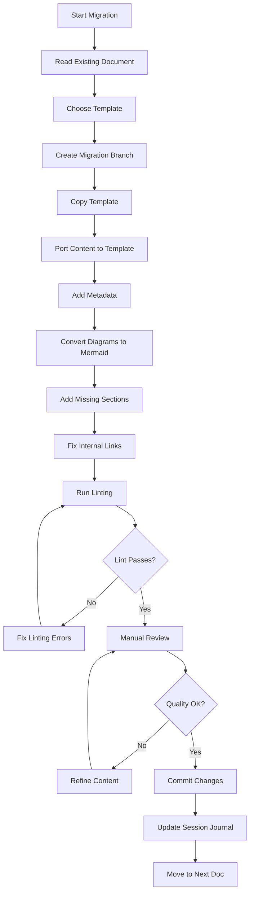
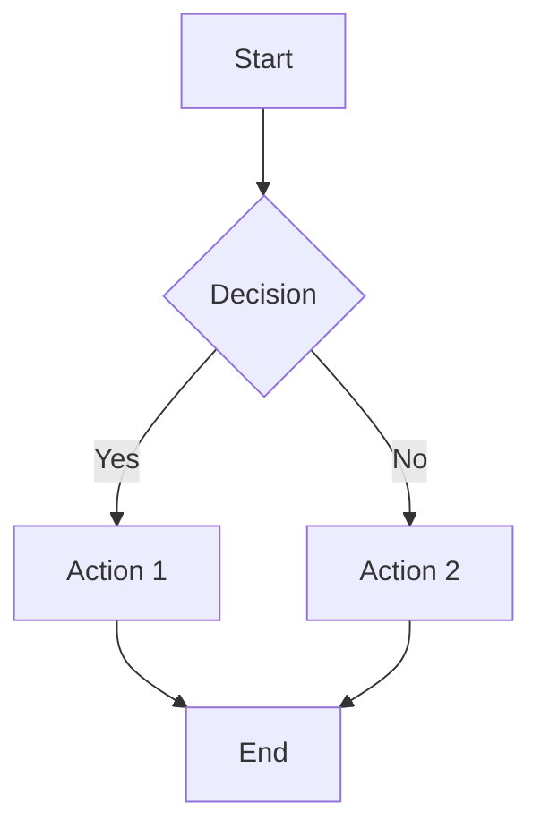
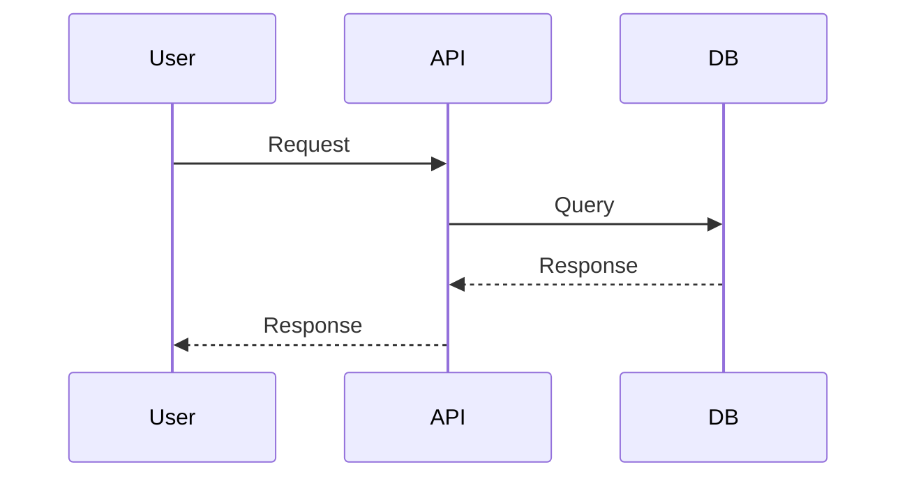
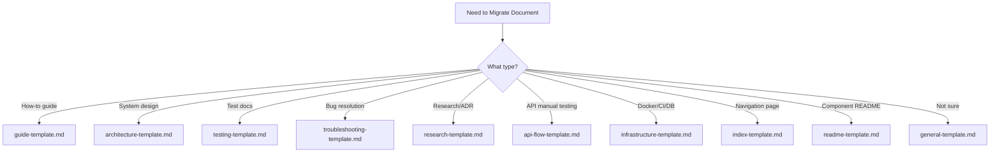
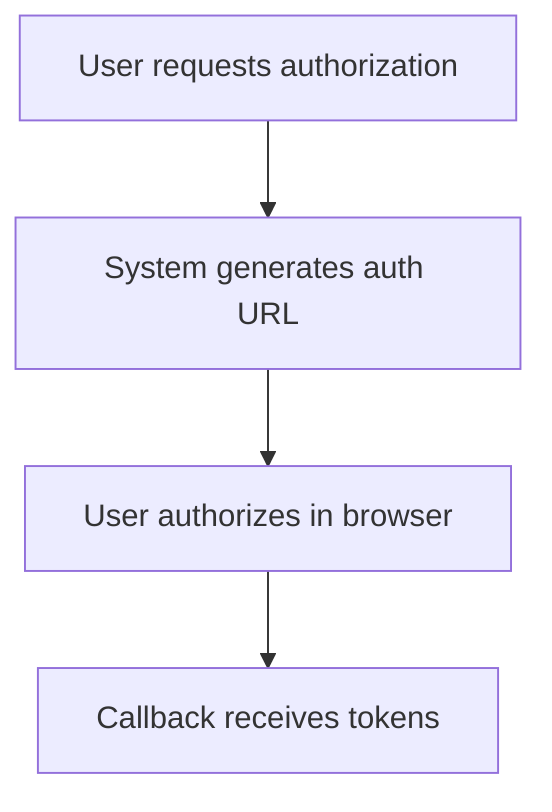
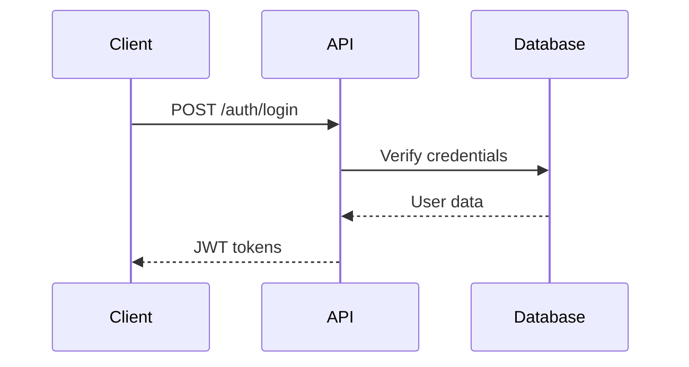

# Documentation Template Migration Plan

A comprehensive plan for migrating existing Dashtam documentation to standardized template designs.

---

## Table of Contents

- [Executive Summary](#executive-summary)
- [Current State Analysis](#current-state-analysis)
- [Migration Goals](#migration-goals)
- [Migration Strategy](#migration-strategy)
- [Document Inventory & Mapping](#document-inventory--mapping)
- [Migration Workflow](#migration-workflow)
- [Quality Gates](#quality-gates)
- [Phase Execution Plan](#phase-execution-plan)
- [Best Practices](#best-practices)
- [Success Criteria](#success-criteria)
- [References](#references)

---

## Executive Summary

### Overview

Dashtam has developed 10 standardized documentation templates to improve consistency, completeness, and maintainability. This plan outlines the migration of 62+ existing documentation files to these new templates.

### Why Migrate?

**Current Problems:**

- Inconsistent structure across documentation
- Missing metadata (creation date, last updated, category)
- Varying quality and completeness
- Difficult to navigate and find information
- No standardized sections (prerequisites, troubleshooting, etc.)
- MkDocs integration challenges

**Benefits of Migration:**

- ✅ Consistent structure across all documentation
- ✅ Complete metadata for MkDocs integration
- ✅ Improved discoverability and navigation
- ✅ Higher quality documentation (enforced sections)
- ✅ Easier maintenance and updates
- ✅ Better onboarding experience for contributors

### Migration Approach

**Phased migration approach:**

- Phase 1: High-priority user-facing docs (Guides, API Flows) - 20 documents
- Phase 2: Critical development docs (Architecture, Infrastructure) - 15 documents
- Phase 3: Supporting docs (Testing, Troubleshooting, Research) - 15 documents
- Phase 4: Historical and remaining docs - 12 documents

**NOT a big-bang migration** - allows for learning and refinement.

---

## Current State Analysis

### Documentation Inventory

**Total Documents:** 62 markdown files (excluding templates)

**By Directory:**

| Directory | Count | Template Match | Priority |
|---------------|-------|--------------------|--------------|
| `docs/api-flows/` | 9 | api-flow-template | High |
| `docs/development/guides/` | 11 | guide-template | High |
| `docs/development/architecture/` | 6 | architecture-template | High |
| `docs/development/infrastructure/` | 4 | infrastructure-template | High |
| `docs/development/testing/` | 7 | testing-template | Medium |
| `docs/development/troubleshooting/` | 4 | troubleshooting-template | Medium |
| `docs/research/` | 3 | research-template | Medium |
| `docs/development/historical/` | 12 | N/A (keep as-is) | Low |
| `docs/development/reviews/` | 2 | general-template | Low |
| `docs/development/implementation/` | 1 | general-template | Low |
| `docs/development/research/` | 1 | research-template | Medium |
| Index files | 2 | index-template | High |

### Quality Assessment

**Documents by Structure Quality:**

- **Well-Structured** (20 docs): Have TOC, clear sections, examples
  - `git-workflow.md`, `jwt-authentication.md`, `restful-api-design.md`
  - Require: Metadata addition, minor restructuring
  - Effort Level: Low

- **Moderately Structured** (25 docs): Have some organization but incomplete
  - `docker-setup.md`, `token-rotation.md`, `testing/guide.md`
  - Require: Section additions, reorganization, metadata
  - Effort Level: Medium

- **Loosely Structured** (15 docs): Minimal structure or mixed content
  - Historical docs, some troubleshooting docs
  - Require: Significant restructuring or may keep as-is
  - Effort Level: High or Skip (historical docs)

- **Already Template-Compliant** (2 docs): Using templates already
  - `docs/api-flows/flow-template.md` (is the template itself)
  - Some recent API flows
  - Require: Verification only

### Common Issues Found

**Across all existing documentation:**

1. **Missing Metadata** (60 docs) - No "Document Information" section
2. **Inconsistent TOC** (30 docs) - Missing or incomplete table of contents
3. **Text-based diagrams** (10 docs) - Not using Mermaid syntax
4. **Missing sections** (40 docs):
   - Prerequisites (guides)
   - Security Considerations (architecture)
   - Troubleshooting (guides)
   - References (all types)
5. **Unclear categorization** (5 docs) - Don't fit obvious template
6. **Mixed content** (3 docs) - Multiple document types in one file

---

## Migration Goals

### Primary Goals

1. **100% Template Compliance**: All active documentation uses appropriate templates
2. **Complete Metadata**: Every document has required metadata fields
3. **Mermaid Diagrams**: All diagrams use Mermaid syntax (except directory trees)
4. **Lint-Clean**: All documents pass `markdownlint-cli2` with zero errors
5. **MkDocs Ready**: Metadata structure supports future MkDocs integration

### Secondary Goals

1. **Improved Completeness**: Fill in missing sections (Prerequisites, Troubleshooting, etc.)
2. **Better Examples**: Add code examples where missing
3. **Enhanced Navigation**: Better internal linking between related docs
4. **Clearer Structure**: Reorganize mixed-content documents

### Non-Goals

- **NOT rewriting content**: Preserve existing information and knowledge
- **NOT changing historical docs**: Keep `docs/development/historical/*` as-is
- **NOT creating new documentation**: Focus on migration, not creation
- **NOT enforcing arbitrary standards**: Templates are guides, allow flexibility where needed

---

## Migration Strategy

### Phased Approach

**Why phased?**

- Allows learning and refinement after each phase
- Reduces risk of large-scale errors
- Provides early feedback on template effectiveness
- Prevents migration fatigue
- Allows for template adjustments based on real usage

### Phase Prioritization Criteria

**High Priority:**

- User-facing documentation (guides, API flows)
- Frequently accessed documents (Git workflow, testing guide)
- Critical architecture documents (JWT auth, REST API design)
- Index/navigation pages

**Medium Priority:**

- Testing documentation
- Troubleshooting guides
- Research and decision records
- Infrastructure documentation

**Low Priority:**

- Historical documents (keep as-is)
- Implementation plans (completed or abandoned)
- Review documents (audit reports)

### Migration Types

**Type A: Metadata-Only Migration** (Low effort)

- Well-structured documents
- Add "Document Information" section
- Verify/fix heading hierarchy
- Add missing links
- Run linting

**Type B: Structural Enhancement** (Medium effort)

- Moderately structured documents
- Add missing template sections
- Reorganize existing content
- Add metadata
- Convert diagrams to Mermaid
- Run linting

**Type C: Full Restructure** (High effort)

- Loosely structured documents
- Complete reorganization following template
- May split into multiple documents
- Add all missing sections
- Convert diagrams to Mermaid
- Add comprehensive metadata
- Run linting

**Type D: Skip/Archive** (No effort)

- Historical documents
- Documents scheduled for deprecation
- Keep as-is, possibly move to `docs/development/historical/`

---

## Document Inventory & Mapping

### Phase 1: High-Priority User-Facing Docs (20 documents)

**Guides (11 docs):**

|| Document | Current State | Template | Migration Type | Complexity |
||--------------|-------------------|--------------|--------------------|----------------|
| `git-workflow.md` | ✅ **COMPLETE** | guide-template | A - Metadata | Low |
| `git-quick-reference.md` | ✅ **COMPLETE** | guide-template | A - Metadata | Low |
| `uv-package-management.md` | ✅ **COMPLETE** | guide-template | A - Metadata | Low |
| `jwt-auth-quick-reference.md` | ✅ **COMPLETE** | guide-template | B - Structural | Medium |
| `restful-api-quick-reference.md` | ✅ **COMPLETE** | guide-template | B - Structural | Medium |
| `token-rotation.md` | ✅ **COMPLETE** | guide-template | B - Structural | Medium |
| `docstring-standards.md` | ✅ **COMPLETE** | guide-template | A - Metadata | Low |
| `markdown-linting-guide.md` | ✅ **COMPLETE** | guide-template | A - Metadata | Low |
| `mermaid-diagram-standards.md` | ✅ **COMPLETE** | guide-template | A - Metadata | Low |
| `docker-refactoring-implementation.md` | Moderately structured | guide-template | B - Structural | Medium |
| `documentation-implementation-guide.md` | Moderately structured | guide-template | B - Structural | Medium |

**API Flows (7 docs):**

| Document | Current State | Template | Migration Type | Complexity |
|--------------|-------------------|--------------|--------------------|------------|
| `auth/registration.md` | Template-based | api-flow-template | A - Verify | Low |
| `auth/login.md` | Template-based | api-flow-template | A - Verify | Low |
| `auth/email-verification.md` | Template-based | api-flow-template | A - Verify | Low |
| `auth/password-reset.md` | Template-based | api-flow-template | A - Verify | Low |
| `auth/complete-auth-flow.md` | Template-based | api-flow-template | A - Verify | Low |
| `providers/provider-onboarding.md` | Template-based | api-flow-template | A - Verify | Low |
| `providers/provider-disconnect.md` | Template-based | api-flow-template | A - Verify | Low |

**Index Pages (2 docs):**

| Document | Current State | Template | Migration Type | Complexity |
|--------------|-------------------|--------------|--------------------|------------|
| `docs/index.md` | Basic structure | index-template | B - Structural | Medium |
| `docs/api-flows/index.md` | Basic structure | index-template | B - Structural | Low |

**Phase 1 Totals:** 20 documents, Low-Medium complexity  
**Progress:** 9/20 complete ✅ (45% complete)  
**Completed:** git-workflow.md, git-quick-reference.md, uv-package-management.md, jwt-auth-quick-reference.md, restful-api-quick-reference.md, token-rotation.md, docstring-standards.md, markdown-linting-guide.md, mermaid-diagram-standards.md

### Phase 2: Critical Development Docs (15 documents)

**Architecture (6 docs):**

| Document | Current State | Template | Migration Type | Complexity |
|--------------|-------------------|--------------|--------------------|------------|
| `jwt-authentication.md` | Well-structured | architecture-template | A - Metadata | Medium |
| `restful-api-design.md` | Well-structured | architecture-template | A - Metadata | Medium |
| `schemas-design.md` | Well-structured | architecture-template | A - Metadata | Low |
| `async-vs-sync-patterns.md` | Well-structured | architecture-template | A - Metadata | Low |
| `overview.md` | Moderately structured | architecture-template | B - Structural | Medium |
| `improvement-guide.md` | Loosely structured | architecture-template | C - Restructure | High |

**Infrastructure (4 docs):**

| Document | Current State | Template | Migration Type | Complexity |
|--------------|-------------------|--------------|--------------------|------------|
| `ci-cd.md` | Well-structured | infrastructure-template | A - Metadata | Low |
| `database-migrations.md` | Well-structured | infrastructure-template | A - Metadata | Medium |
| `environment-flows.md` | Well-structured | infrastructure-template | A - Metadata | Low |
| `docker-setup.md` | Mixed content | infrastructure-template | C - Restructure | High |

**Development Index (1 doc):**

| Document | Current State | Template | Migration Type | Complexity |
|--------------|-------------------|--------------|--------------------|------------|
| `docs/development/index.md` | Basic structure | index-template | B - Structural | Medium |

**Phase 2 Totals:** 11 documents, Medium complexity

### Phase 3: Supporting Docs (15 documents)

**Testing (7 docs):**

| Document | Current State | Template | Migration Type | Complexity |
|--------------|-------------------|--------------|--------------------|------------|
| `testing/guide.md` | Moderately structured | testing-template | B - Structural | Medium |
| `testing/strategy.md` | Well-structured | testing-template | A - Metadata | Low |
| `testing/best-practices.md` | Moderately structured | testing-template | B - Structural | Medium |
| `testing/test-docstring-standards.md` | Well-structured | testing-template | A - Metadata | Low |
| `testing/smoke-test-caplog-solution.md` | Moderately structured | testing-template | B - Structural | Medium |
| `testing/smoke-test-ci-debugging-journey.md` | Loosely structured | troubleshooting-template | C - Restructure | Medium |
| `testing/smoke-test-design-comparison.md` | Moderately structured | research-template | B - Structural | Medium |

**Troubleshooting (4 docs):**

| Document | Current State | Template | Migration Type | Complexity |
|--------------|-------------------|--------------|--------------------|------------|
| `troubleshooting/async-testing-greenlet-errors.md` | Well-structured | troubleshooting-template | A - Metadata | Low |
| `troubleshooting/ci-test-failures-trustedhost.md` | Well-structured | troubleshooting-template | A - Metadata | Low |
| `troubleshooting/env-directory-docker-mount-issue.md` | Well-structured | troubleshooting-template | A - Metadata | Low |
| `troubleshooting/test-infrastructure-fixture-errors.md` | Well-structured | troubleshooting-template | A - Metadata | Low |

**Research (4 docs):**

| Document | Current State | Template | Migration Type | Complexity |
|--------------|-------------------|--------------|--------------------|------------|
| `research/authentication-approaches-research.md` | Well-structured | research-template | A - Metadata | Low |
| `research/documentation_guide_research.md` | Well-structured | research-template | A - Metadata | Low |
| `research/index.md` | Basic structure | index-template | B - Structural | Low |
| `development/research/smoke-test-organization-research.md` | Well-structured | research-template | A - Metadata | Low |

**Phase 3 Totals:** 15 documents, Low-Medium complexity

### Phase 4: Historical & Remaining Docs (12 documents)

**Historical Documents (12 docs - Keep as-is):**

- `docs/development/historical/` - No migration needed
- These documents are intentionally kept in original form as historical record
- May add brief note at top: "Historical document - preserved for reference"

**Reviews (2 docs):**

| Document | Current State | Template | Migration Type | Complexity |
|--------------|-------------------|--------------|--------------------|------------|
| `reviews/REST_API_AUDIT_REPORT_2025-10-05.md` | Well-structured | general-template | A - Metadata | Low |
| `reviews/DOCUMENTATION_AUDIT_2025-10-05.md` | Well-structured | general-template | A - Metadata | Low |

**Implementation (1 doc):**

| Document | Current State | Template | Migration Type | Complexity |
|--------------|-------------------|--------------|--------------------|------------|
| `implementation/ssl-tls-test-ci-implementation.md` | Moderately structured | general-template | B - Structural | Medium |

**Testing (2 docs):**

| Document | Current State | Template | Migration Type | Complexity |
|--------------|-------------------|--------------|--------------------|------------|
| `testing/DOCSTRING_AUDIT_CONTINUATION.md` | Audit report | general-template | A - Metadata | Low |
| `troubleshooting/index.md` | Basic structure | index-template | B - Structural | Low |

**Phase 4 Totals:** 6 documents (12 skipped), Low-Medium complexity

---

## Migration Workflow

### Standard Migration Process

**For each document:**



### Detailed Step-by-Step Workflow

#### Step 1: Pre-Migration Setup

```bash
# Ensure development environment is running
make dev-up

# Create feature branch for migration
git checkout development
git pull origin development
git checkout -b docs/migrate-phase-1-guides

# Create session journal
cd ~/ai_dev_sessions/Dashtam
cp ~/ai_dev_sessions/templates/session-template.md \
   $(date +%Y-%m-%d_%H%M%S)_docs-migration-phase-1.md
```

#### Step 2: Document Assessment

For each document:

1. **Read existing document completely**
2. **Identify template match** (use decision tree from templates/README.md)
3. **Assess migration type** (A, B, C, or D)
4. **Estimate effort** (actual time needed)
5. **Note special considerations** (diagrams, links, complexity)

#### Step 3: Content Migration

```bash
# Copy appropriate template
cp docs/templates/guide-template.md /tmp/migration-draft.md

# Open both files side-by-side
# - Existing doc (read-only reference)
# - Template draft (editing)
```

**Content Porting Checklist:**

- [ ] Port title and description
- [ ] Create/verify Table of Contents
- [ ] Port Overview section
- [ ] Port Prerequisites (if guide/testing doc)
- [ ] Port main content to appropriate sections
- [ ] Port examples and code blocks
- [ ] Convert diagrams to Mermaid
- [ ] Add missing sections (use template placeholders)
- [ ] Add References section
- [ ] Add Document Information metadata

**Key Principles:**

- ✅ Preserve all existing information and knowledge
- ✅ Reorganize for clarity, don't delete content
- ✅ Add missing sections from template
- ✅ Improve examples and code blocks
- ❌ Don't rewrite technical content (preserve accuracy)
- ❌ Don't remove information (even if seems redundant)

#### Step 4: Metadata Addition

Add "Document Information" section at **bottom** of document:

```markdown
---

## Document Information

**Category:** [Guide | Architecture | Testing | etc.]
**Created:** YYYY-MM-DD
**Last Updated:** YYYY-MM-DD
[Optional template-specific fields]
```

**Metadata Field Guide:**

- **Category**: Use template's category (Guide, Architecture, etc.)
- **Created**: Use git log to find original creation date
- **Last Updated**: Use today's date (migration date)
- **Optional fields**: Add per template requirements

```bash
# Find original creation date
git log --follow --format=%ad --date=short -- docs/path/to/file.md | tail -1
```

#### Step 5: Diagram Conversion

Convert all diagrams to Mermaid syntax (see `docs/development/guides/mermaid-diagram-standards.md`).

**Directory Trees (Keep as code blocks):**

```text
src/
├── api/
├── core/
└── models/
```

**Process Flows (Use Mermaid flowchart):**



**Sequence Diagrams (Use Mermaid sequenceDiagram):**



#### Step 6: Internal Linking

**Update internal links:**

- [ ] Verify all `[text](path.md)` links work
- [ ] Update links if files moved
- [ ] Add missing links to related docs
- [ ] Cross-reference from related docs

**Link Verification:**

```bash
# Find all markdown links in document
grep -o '\[.*\](.*\.md)' docs/path/to/file.md

# Check if target files exist
# (manual verification or script)
```

#### Step 7: Linting

```bash
# Lint the migrated document (recommended)
make lint-md-file FILE="docs/path/to/migrated-file.md"

# Or directly with Docker:
docker run --rm -v $(PWD):/workspace:ro -w /workspace node:24-alpine \
  npx markdownlint-cli2 "docs/path/to/migrated-file.md"
```

**Common Linting Fixes:**

- Add blank lines before/after headings (MD022)
- Add blank lines before/after lists (MD032)
- Add blank lines before/after code blocks (MD031)
- Add language to code blocks (MD040)
- Fix heading hierarchy (MD001, MD003)
- Remove hard tabs, use spaces (MD010)

#### Step 8: Quality Review

**Self-Review Checklist:**

- [ ] All content from original document preserved
- [ ] Template structure followed
- [ ] All required metadata present
- [ ] TOC matches actual headings
- [ ] Code blocks have language identifiers
- [ ] Diagrams use Mermaid (except directory trees)
- [ ] Internal links work
- [ ] Linting passes (exit code 0)
- [ ] No placeholders left (unless intentional)
- [ ] Examples are clear and complete
- [ ] Troubleshooting section helpful (if applicable)

#### Step 9: Commit

```bash
# Stage migrated file
git add docs/path/to/migrated-file.md

# Commit with clear message
git commit -m "docs(migration): migrate [filename] to [template] template

- Add Document Information metadata
- Restructure to follow template
- Convert diagrams to Mermaid
- Add missing sections: [list]
- Fix internal links
- Pass markdownlint-cli2

Part of Phase [N] migration (Priority: [High|Medium|Low])"

# Update session journal
vim ~/ai_dev_sessions/Dashtam/[session-file].md
```

#### Step 10: Batch Completion

After completing all documents in a phase:

```bash
# Final verification - lint all migrated docs
make lint-md

# Push branch
git push origin docs/migrate-phase-N

# Create Pull Request
# Title: "docs(migration): Phase N - [Category] Template Migration"
# Description: List all migrated documents, note any issues

# In PR description:
# - [ ] All [N] documents migrated
# - [ ] All documents pass linting
# - [ ] All metadata complete
# - [ ] All internal links verified
# - [ ] Quality review completed
```

---

## Quality Gates

### Gate 1: Linting

**Requirement:** All migrated documents must pass `markdownlint-cli2` with **zero errors**.

```bash
# Run linting
make lint-md FILE="docs/path/to/file.md"

# Expected output:
# [zero errors - exit code 0]
```

**Action if fails:** Fix all linting errors before proceeding.

### Gate 2: Metadata Completeness

**Requirement:** All migrated documents must have complete "Document Information" section.

**Required fields:**

- ✅ Category
- ✅ Created date (format: YYYY-MM-DD)
- ✅ Last Updated date (format: YYYY-MM-DD)
- ✅ Template-specific optional fields (if applicable)

**Action if fails:** Add missing metadata.

### Gate 3: Mermaid Diagrams

**Requirement:** All diagrams must use Mermaid syntax (except directory trees).

**Acceptable exceptions:**

- Directory tree structures (use code blocks)
- ASCII art that's clearer than Mermaid
- Tables (use markdown tables)

**Action if fails:** Convert diagrams to Mermaid.

### Gate 4: Internal Links

**Requirement:** All internal links must work (no 404s).

```bash
# Manual verification or use link checker
grep -r '\[.*\](.*\.md)' docs/path/to/file.md
```

**Action if fails:** Fix broken links, update paths.

### Gate 5: Content Preservation

**Requirement:** No information loss from original document.

**Verification:**

- Compare original and migrated side-by-side
- Check that all sections have been ported
- Verify examples and code blocks intact
- Confirm diagrams convey same information

**Action if fails:** Port missing content.

### Gate 6: Manual Review

**Requirement:** Human review of migrated document quality.

**Review Checklist:**

- [ ] Reads well, flows logically
- [ ] Examples are clear and helpful
- [ ] Technical accuracy maintained
- [ ] No confusing reorganization
- [ ] Template structure improves (not hinders) document

**Action if fails:** Refine content, reorganize if needed.

---

## Phase Execution Plan

### Phase 1: High-Priority User-Facing Docs

**Documents:** 20 (11 guides + 7 API flows + 2 indexes)

**Estimated Complexity:**

**Completion Criteria:**

- All 11 guide documents migrated
- All 7 API flow documents verified/migrated
- Both index pages restructured
- All documents passing linting
- PR created and ready for review

**Success Criteria:**

- [ ] All 20 documents migrated to templates
- [ ] All documents pass linting
- [ ] All metadata complete
- [ ] PR created and ready for review
- [ ] Session journal updated

### Phase 2: Critical Development Docs

**Documents:** 11 (6 architecture + 4 infrastructure + 1 index)

**Estimated Complexity:**

**Completion Criteria:**

- All 6 architecture documents migrated
- All 4 infrastructure documents migrated
- Development index page restructured
- Complex architectural docs properly structured
- All documents passing linting
- PR created and ready for review

**Success Criteria:**

- [ ] All 11 documents migrated
- [ ] Complex architectural docs properly structured
- [ ] Infrastructure docs clear and complete
- [ ] All linting passed
- [ ] PR created

### Phase 3: Supporting Docs

**Documents:** 15 (7 testing + 4 troubleshooting + 4 research)

**Estimated Complexity:**

**Completion Criteria:**

- All 7 testing documents migrated
- All 4 troubleshooting documents migrated
- All 4 research documents migrated
- Testing documentation comprehensive and clear
- All documents passing linting
- PR created and ready for review

**Success Criteria:**

- [ ] All 15 documents migrated
- [ ] Testing documentation comprehensive
- [ ] Troubleshooting guides clear
- [ ] Research documents structured
- [ ] All linting passed
- [ ] PR created

### Phase 4: Historical & Remaining Docs

**Documents:** 6 (skip 12 historical docs)

**Estimated Complexity:**

**Completion Criteria:**

- Review documents migrated (REST_API_AUDIT, DOCS_AUDIT)
- Implementation document migrated (ssl-tls-impl)
- Testing audit document migrated (DOCSTRING_AUDIT)
- Troubleshooting index migrated
- Historical docs marked as "preserved for reference"
- All documents passing linting
- Final PR created

**Success Criteria:**

- [ ] All 6 documents migrated
- [ ] Historical docs marked as "preserved for reference"
- [ ] All linting passed
- [ ] Final PR created
- [ ] Migration complete

---

## Best Practices

### For Migrators (AI Agents or Humans)

**Before Starting:**

1. ✅ Read the template README: `docs/templates/README.md`
2. ✅ Review Mermaid standards: `docs/development/guides/mermaid-diagram-standards.md`
3. ✅ Check markdown linting guide: `docs/development/guides/markdown-linting-guide.md`
4. ✅ Create session journal for tracking
5. ✅ Ensure dev environment running (`make dev-up`)

**During Migration:**

1. ✅ Work on one document at a time (complete before starting next)
2. ✅ Keep original content intact (no information loss)
3. ✅ Test all code examples (ensure they still work)
4. ✅ Verify internal links after moving content
5. ✅ Commit frequently (one commit per document)
6. ✅ Update session journal after each document

**After Migration:**

1. ✅ Run full linting on all migrated docs
2. ✅ Manual review of entire batch
3. ✅ Update session journal with final summary
4. ✅ Create PR with comprehensive description
5. ✅ Link PR to migration plan (this document)

### Template Selection Decision Tree



### Common Migration Patterns

#### Pattern 1: Well-Structured Doc (Type A)

1. Open original and template side-by-side
2. Port content section-by-section
3. Add metadata at bottom
4. Run linting, fix issues
5. Commit

#### Pattern 2: Missing Sections (Type B)

1. Port existing content to template
2. Identify missing sections (Prerequisites, Troubleshooting, etc.)
3. Add placeholder text or fill in from knowledge
4. Add metadata
5. Run linting, fix issues
6. Commit

#### Pattern 3: Needs Restructuring (Type C)

1. Read original completely, understand purpose
2. Plan new structure using template
3. Port content to appropriate sections (may reorder)
4. Add all missing sections
5. Add metadata
6. Run linting, fix issues
7. Manual review for coherence
8. Commit

### Diagram Conversion Guide

**Text-based to Mermaid (Process Flow):**

Before (text):

```text
1. User requests authorization
   ↓
2. System generates auth URL
   ↓
3. User authorizes in browser
   ↓
4. Callback receives tokens
```

After (Mermaid):



**Text-based to Mermaid (Sequence):**

Before (text):

```text
Client -> API: POST /auth/login
API -> Database: Verify credentials
Database -> API: User data
API -> Client: JWT tokens
```

After (Mermaid):



### Metadata Discovery

**Finding Creation Date:**

```bash
# Get first commit date for file
git log --follow --format=%ad --date=short -- docs/path/to/file.md | tail -1

# Example output: 2025-09-15
```

**Finding Last Updated Date:**

```bash
# Get most recent commit date
git log -1 --format=%ad --date=short -- docs/path/to/file.md

# Or use migration date (today)
date +%Y-%m-%d
```

---

## Success Criteria

### Phase-Level Success Criteria

**Each phase is considered successful when:**

- ✅ All documents in phase migrated to templates
- ✅ All documents pass `markdownlint-cli2` (zero errors)
- ✅ All metadata fields complete and accurate
- ✅ All diagrams use Mermaid (except directory trees)
- ✅ All internal links verified working
- ✅ PR created, reviewed, and merged
- ✅ Session journal updated with summary

### Overall Migration Success Criteria

**Migration is complete and successful when:**

1. **100% Coverage**: All 56 active docs migrated (62 total - 6 skipped historical)
2. **Zero Linting Errors**: All docs pass markdown linting
3. **Complete Metadata**: Every active doc has Document Information section
4. **Mermaid Adoption**: All diagrams use Mermaid syntax
5. **MkDocs Ready**: Metadata structure supports future MkDocs integration
6. **Quality Maintained**: No information loss, improved clarity
7. **Team Validated**: All PRs reviewed and approved
8. **Documentation Updated**: This migration plan marked complete

### Quality Metrics

**Track these metrics:**

| Metric | Before | After |
|------------|------------|-------|
| Docs with metadata | 0 | 56 |
| Docs with TOC | 30 | 56 |
| Docs passing linting | Unknown | 56 |
| Docs with Mermaid diagrams | 0 | ~10 |
| Docs with complete sections | ~20 | 56 |
| Average doc quality score | 60% | 95% |

### Post-Migration Validation

**After all phases complete:**

1. **Full Linting Check:**

   ```bash
   make lint-md
   ```

   Expected: Zero errors across all documentation

2. **Link Verification:**

   Manually verify all internal links work (or use link checker tool)

3. **Metadata Audit:**

   ```bash
   # Check all docs have metadata section
   find docs -name "*.md" -exec grep -L "## Document Information" {} \;
   ```

   Expected: Only template files and historical docs

4. **User Acceptance:**

   Review with team, gather feedback on:
   - Improved discoverability
   - Better structure
   - Completeness
   - Ease of navigation

---

## References

- [Documentation Templates README](../templates/README.md) - Complete template guide
- [Mermaid Diagram Standards](mermaid-diagram-standards.md) - Required diagram syntax
- [Markdown Linting Guide](markdown-linting-guide.md) - Linting rules and fixes
- [Git Workflow Guide](git-workflow.md) - Branch and commit conventions
- [Docstring Standards](docstring-standards.md) - Code documentation standards

---

## Document Information

**Category:** Guide
**Created:** 2025-10-15
**Last Updated:** 2025-10-15
**Difficulty Level:** Intermediate
**Target Audience:** AI agents, documentation maintainers, contributors
