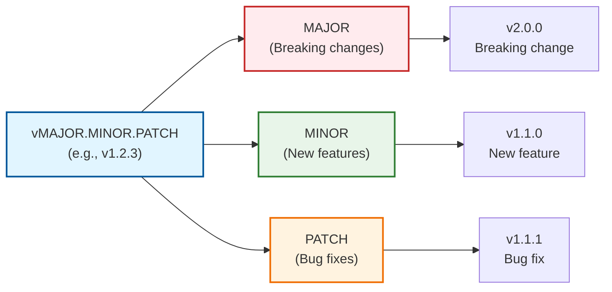
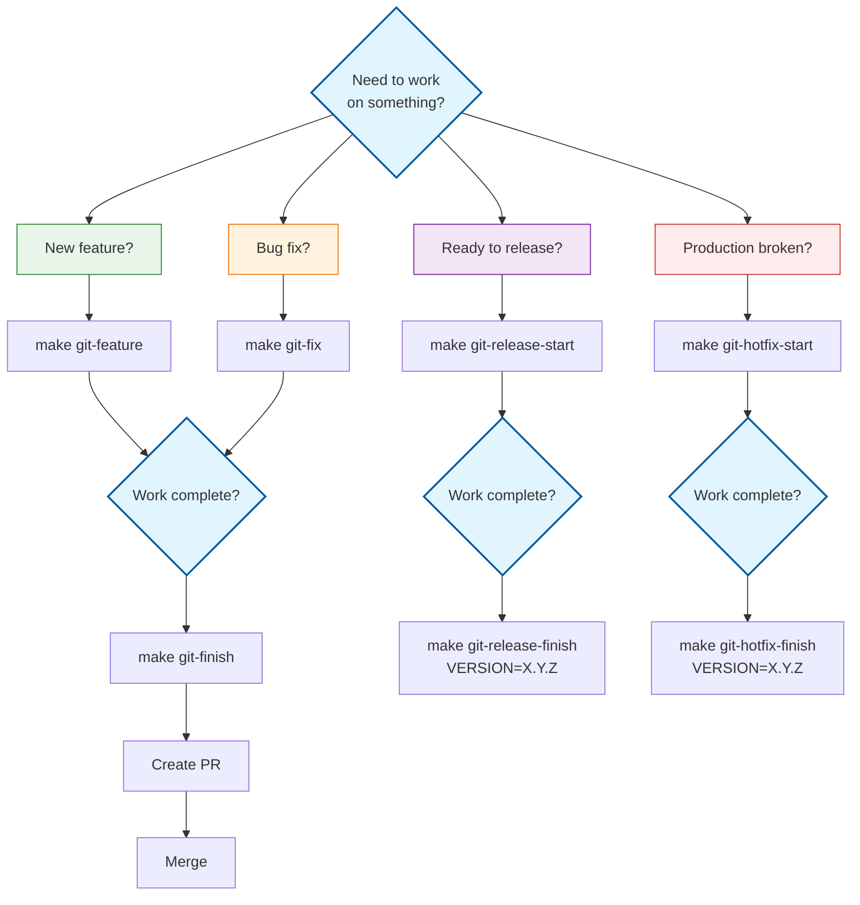

# Git Quick Reference

One-page cheat sheet for Git Flow operations, commands, and workflows at Dashtam.

## Overview

This quick reference provides essential Git Flow commands and workflows for daily development at Dashtam. It's designed as a one-page cheat sheet for developers who need fast access to common operations without reading the full workflow guide.

### What You'll Learn

- Quick commands for common Git Flow operations (feature, fix, release, hotfix)
- Essential Git commands for daily work (sync, commit, branch management)
- GitHub CLI commands for PR management
- Commit message conventions and semantic versioning
- Emergency procedures for common problems

### When to Use This Guide

Use this quick reference when you need to:

- Quickly look up a specific Git Flow command
- Remember commit message format
- Find the right make command for a workflow
- Resolve a common Git issue quickly
- Check branch protection requirements
- Execute emergency procedures

**For detailed explanations and comprehensive workflows, see the [Git Workflow Guide](git-workflow.md).**

## Prerequisites

Before using these commands, ensure you have:

- [ ] Git installed (version 2.23+)
- [ ] GitHub account with repository access
- [ ] GitHub CLI (`gh`) installed (recommended)
- [ ] Write access to Dashtam repository
- [ ] Basic understanding of Git Flow concepts

**Required Tools:**

- Git - Version 2.23+
- GitHub CLI - Latest version
- Make - For automated commands

**Required Knowledge:**

- Basic Git Flow branching model
- Dashtam's branch structure (main, development)
- Commit message conventions

## Step-by-Step Instructions

### Step 1: Understanding Branch Structure

Dashtam uses Git Flow with this hierarchy:

```text
main (production)               ← v1.2.0, v1.1.1 (tags)
  ├── development (integration) ← default branch
  │   ├── feature/my-feature
  │   └── fix/my-bug-fix
  ├── release/v1.2.0            ← preparing release
  └── hotfix/v1.1.1             ← emergency fix
```

**Branch Roles:**

- **main** - Production-ready code with version tags
- **development** - Integration branch (default)
- **feature/*** - New features (temporary)
- **fix/*** - Bug fixes (temporary)
- **release/*** - Release preparation (temporary)
- **hotfix/*** - Emergency production fixes (temporary)

**What This Does:** Understanding the branch structure helps you choose the right branch type and workflow for your task.

### Step 2: Daily Feature Development

**Start New Feature:**

```bash
make git-feature
# Or manually:
git checkout development
git pull origin development
git checkout -b feature/feature-name
```

**Make Changes:**

```bash
# Make your changes
git add .
git commit -m "feat(scope): description"
```

**Finish Feature:**

```bash
make git-finish
# This automatically:
# 1. Runs all tests
# 2. Runs linting
# 3. Pushes to remote
# 4. Shows PR creation link
```

**What This Does:** The feature workflow isolates new development in dedicated branches, ensuring clean integration through PRs.

### Step 3: Bug Fix Workflow

**Quick Bug Fix:**

```bash
make git-fix                              # Create fix branch
# Make fixes
git commit -m "fix(scope): description"   # Commit
make git-finish                           # Push & create PR
```

**What This Does:** Bug fixes follow the same isolation pattern as features but use `fix/` prefix for clarity.

### Step 4: Commit Message Format

**Standard Format:**

```text
<type>(<scope>): <subject>

<body>

<footer>
```

**Commit Types:**

- `feat:` - New feature (minor version bump)
- `fix:` - Bug fix (patch version bump)
- `docs:` - Documentation only
- `test:` - Tests
- `refactor:` - Code refactoring
- `chore:` - Maintenance
- `perf:` - Performance improvement
- `ci:` - CI/CD changes

**Quick Examples:**

```bash
feat(api): add account listing endpoint
fix(auth): prevent race condition in token refresh
docs: update API documentation
test(integration): add OAuth flow tests
chore(deps): update FastAPI to 0.110.0
```

**Breaking Changes:**

```bash
feat(api)!: change authentication structure

BREAKING CHANGE: Auth endpoint moved to /api/v1/auth
```

**What This Does:** Conventional commits enable automated changelog generation and semantic versioning.

### Step 5: Pull Request Management with GitHub CLI

**Create PR:**

```bash
# Interactive creation
gh pr create

# Quick inline creation
gh pr create --base development --title "feat: my feature" --body "Description"

# With reviewers and labels
gh pr create --base development --reviewer user1 --label enhancement

# Draft PR
gh pr create --base development --draft --title "WIP: my feature"
```

**Review PR:**

```bash
# Approve
gh pr review 16 --approve --body "LGTM!"

# Request changes
gh pr review 16 --request-changes --body "Please fix X"
```

**Merge PR:**

```bash
# Squash merge (recommended)
gh pr merge 16 --squash --delete-branch

# Admin merge (bypass protection)
gh pr merge 16 --squash --delete-branch --admin

# Auto-merge when checks pass
gh pr merge 16 --squash --auto --delete-branch
```

**What This Does:** GitHub CLI enables fast PR management from the command line without switching to the browser.

### Step 6: Release Workflow

**Start Release:**

```bash
make git-release-start                    # Enter version: 1.2.0
# Update pyproject.toml
# Update CHANGELOG.md
git commit -m "chore: bump version to 1.2.0"
git commit -m "docs: update changelog for v1.2.0"
make test                                 # Final testing
git push -u origin release/v1.2.0
# Create PR to main
```

**Finish Release (after PR merged):**

```bash
make git-release-finish VERSION=1.2.0
# This automatically:
# 1. Tags v1.2.0 on main
# 2. Merges back to development
# 3. Cleans up release branch
```

**What This Does:** The release workflow creates stable, tagged versions ready for production deployment.

### Step 7: Emergency Hotfix Workflow

**Start Hotfix:**

```bash
make git-hotfix-start                     # Enter version: 1.1.1
# Fix critical issue ONLY
git commit -m "fix(critical): description"
# Update version and CHANGELOG
make test                                 # Test thoroughly
git push -u origin hotfix/v1.1.1
# Create URGENT PR to main
```

**Finish Hotfix (after PR merged):**

```bash
make git-hotfix-finish VERSION=1.1.1
# Deploy immediately!
```

**What This Does:** Hotfix workflow enables rapid response to production issues while maintaining code quality.

## Examples

### Example 1: Daily Feature Development

**Scenario:** Build new account listing API

```bash
# Start feature
make git-feature
# Name: account-listing-api

# Develop incrementally
git add src/api/accounts.py tests/test_accounts.py
git commit -m "feat(api): add account model and endpoint"

git add src/services/account_service.py
git commit -m "feat(api): add account filtering service"

# Finish and create PR
make git-finish
```

**Result:** Feature branch pushed, tests passing, ready for PR creation.

### Example 2: Quick Bug Fix

**Scenario:** Fix token refresh race condition

```bash
# Create fix branch
make git-fix
# Name: token-refresh-error

# Fix the bug
git add src/services/token_service.py tests/test_token_service.py
git commit -m "fix(auth): prevent race condition in token refresh"

# Push and create PR
make git-finish
```

**Result:** Bug fixed with tests, PR created for review.

### Example 3: Check PR Status

**Scenario:** Verify PR is ready to merge

```bash
# Check PR status
gh pr view 16 --json mergeable,mergeStateStatus

# Output shows:
{
  "mergeable": "MERGEABLE",
  "mergeStateStatus": "CLEAN"  # ✅ Ready to merge
}

# Merge it
gh pr merge 16 --squash --delete-branch
```

**Result:** PR merged with confidence, branch automatically deleted.

### Example 4: Emergency Hotfix

**Scenario:** Production API key leak in logs

```bash
# Start hotfix from main
make git-hotfix-start
# Version: 1.2.1

# Fix quickly
git add src/core/security.py
git commit -m "fix(security): prevent API key exposure in logs"

# Update version and changelog
git commit -m "chore: bump version to 1.2.1"

# Test and push
make test
git push -u origin hotfix/v1.2.1

# Create urgent PR, get approval, merge

# Finish and deploy
make git-hotfix-finish VERSION=1.2.1
```

**Result:** Critical security issue patched and deployed within hours.

## Verification

How to verify your Git workflow is working correctly.

### Check 1: Branch Protection Active

**Verify protection rules:**

```bash
# Check main branch protection
gh api repos/faiyaz7283/Dashtam/branches/main/protection \
  | jq '.required_pull_request_reviews.required_approving_review_count'

# Expected: 1
```

**Expected Result:** Branch protection requires 1 approval and passing status checks.

### Check 2: Tests Pass Before Push

**Verify quality checks:**

```bash
# Run all tests
make test

# Check linting
make lint

# Both should pass before git push
```

**Expected Result:** Exit code 0 for both commands.

### Check 3: PR Mergeable

**Check PR status:**

```bash
gh pr view 16 --json mergeStateStatus

# Expected: {"mergeStateStatus": "CLEAN"}
```

**Expected Result:** PR shows CLEAN status when ready to merge.

## Troubleshooting

### Issue 1: Branch Behind Remote

**Symptoms:**

- Git warns branch is behind
- Push rejected

**Solution:**

```bash
git pull origin development
# Or if you have local commits:
git pull --rebase origin development
```

### Issue 2: Merge Conflict

**Symptoms:**

- Conflict markers in files
- Merge/rebase stopped

**Solution:**

```bash
# View conflicted files
git status

# Edit files, resolve conflicts (remove markers)
git add <resolved-files>

# Continue
git rebase --continue  # If rebasing
git merge --continue   # If merging
```

### Issue 3: Accidentally Committed to Wrong Branch

**Symptoms:**

- Commits on wrong branch

**Solution:**

```bash
git branch feature/correct-branch    # Create branch with commits
git reset --hard origin/development  # Reset current branch
git checkout feature/correct-branch  # Switch to correct branch
```

### Issue 4: Need to Undo Last Commit

**Symptoms:**

- Committed wrong changes

**Solution:**

```bash
# Keep changes
git reset --soft HEAD~1

# Discard changes
git reset --hard HEAD~1
```

### Issue 5: Tests Failing Locally

**Symptoms:**

- `make test` fails
- PR checks will fail

**Solution:**

```bash
# Run specific test suites
make test-unit              # Check unit tests
make test-integration       # Check integration tests

# Fix issues, then verify
make test
```

## Best Practices

Follow these practices for efficient Git workflow.

### Quick Commands Reference

**Sync & Update:**

```bash
git fetch origin                          # Fetch updates
git pull origin development               # Pull development
git rebase origin/development             # Rebase on development
```

**Status & History:**

```bash
git status                                # Current status
git log --oneline --graph -10             # Recent commits
git diff                                  # Unstaged changes
git diff --staged                         # Staged changes
```

**Stashing:**

```bash
git stash                                 # Stash changes
git stash list                            # List stashes
git stash pop                             # Apply & remove stash
```

**Branch Management:**

```bash
git branch                                # List local branches
git branch -a                             # List all branches
git branch -d feature/name                # Delete local branch
git push origin --delete feature/name     # Delete remote branch
```

### Important Rules

❌ **NEVER:**

- Commit directly to `main` or `development`
- Force push to shared branches
- Commit secrets or sensitive data
- Mix multiple unrelated changes
- Skip running tests before pushing

✅ **ALWAYS:**

- Create feature/fix branch for changes
- Write meaningful commit messages
- Run tests before pushing (`make test`)
- Run linting before pushing (`make lint`)
- Keep branches short-lived (< 1 week)
- Delete branches after merging

### Make Commands Cheat Sheet

**Git Flow:**

```bash
make git-status                        # Show Git status
make git-sync                          # Sync with development
make git-feature                       # Create feature branch
make git-fix                           # Create fix branch
make git-finish                        # Finish & push branch
make git-release-start                 # Start release
make git-release-finish VERSION=X.Y.Z  # Finish release
make git-hotfix-start                  # Start hotfix
make git-hotfix-finish VERSION=X.Y.Z   # Finish hotfix
make git-cleanup                       # Clean merged branches
```

**Testing & Quality:**

```bash
make test                # All tests with coverage
make test-unit           # Unit tests only
make test-integration    # Integration tests only
make lint                # Run linting
make format              # Format code
```

### Semantic Versioning Quick Guide



**Version Format:**

- **MAJOR** - Breaking changes (not backwards compatible)
- **MINOR** - New features (backwards compatible)
- **PATCH** - Bug fixes (backwards compatible)

**Examples:**

- `v1.0.0` → Initial release
- `v1.1.0` → New feature added
- `v1.1.1` → Bug fix
- `v2.0.0` → Breaking change

### Workflow Decision Tree



### PR Checklist

Before creating PR:

- [ ] All tests pass (`make test`)
- [ ] Linting passes (`make lint`)
- [ ] Code is formatted (`make format`)
- [ ] Documentation updated
- [ ] Commit messages follow conventions
- [ ] Branch is up to date with development

## Common Mistakes to Avoid

- ❌ **Forgetting to pull** before creating branch - Always sync first
- ❌ **Skipping tests** - Always run `make test` before pushing
- ❌ **Vague commit messages** - Be specific and descriptive
- ❌ **Large commits** - Break work into smaller, focused commits
- ❌ **Not cleaning branches** - Run `make git-cleanup` regularly

## Next Steps

After mastering these quick commands, consider:

- [ ] Read the [Git Workflow Guide](git-workflow.md) for detailed explanations
- [ ] Set up Git aliases for frequently used commands
- [ ] Learn interactive rebase for cleaning commit history
- [ ] Study the [Testing Guide](testing-guide.md)
- [ ] Review `WARP.md` (project root) for complete project rules

## References

### Essential Links

- [Git Workflow Guide](git-workflow.md) - Complete workflow documentation
- `WARP.md` (project root) - Project rules and conventions
- [Conventional Commits](https://www.conventionalcommits.org/) - Commit specification
- [Semantic Versioning](https://semver.org/) - Versioning specification
- [Git Flow Cheatsheet](https://danielkummer.github.io/git-flow-cheatsheet/) - Visual guide

### Pro Tips

1. **Use make commands** - They include safeguards and run tests automatically
2. **Commit often** - Small, focused commits are easier to review
3. **Pull before push** - Always sync with development first
4. **Review your own PR** - Check the diff before requesting reviews
5. **Keep branches current** - Regularly rebase on development
6. **Clean up regularly** - Run `make git-cleanup` to remove merged branches
7. **Use descriptive names** - `feature/account-api` not `feature/stuff`
8. **Write good messages** - Future you will thank current you

---

## Document Information

**Template:** guide-template.md
**Created:** 2025-10-03
**Last Updated:** 2025-10-20
