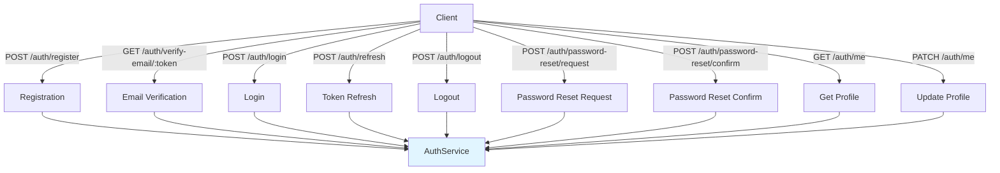

# JWT Authentication API Guide

Complete guide to implementing and using the authentication API endpoints in Dashtam.

---

## Table of Contents

- [Overview](#overview)
  - [What You'll Learn](#what-youll-learn)
  - [When to Use This Guide](#when-to-use-this-guide)
- [Prerequisites](#prerequisites)
- [Step-by-Step Instructions](#step-by-step-instructions)
  - [Step 1: Understand the API Architecture](#step-1-understand-the-api-architecture)
  - [Step 2: Define Request/Response Schemas](#step-2-define-requestresponse-schemas)
    - [Registration Schemas](#registration-schemas)
    - [Login Schemas](#login-schemas)
    - [Token Refresh Schemas](#token-refresh-schemas)
    - [Email Verification Schemas](#email-verification-schemas)
    - [Password Reset Schemas](#password-reset-schemas)
    - [User Profile Schemas](#user-profile-schemas)
  - [Step 3: Implement Registration Endpoint](#step-3-implement-registration-endpoint)
  - [Step 4: Implement Email Verification Endpoint](#step-4-implement-email-verification-endpoint)
  - [Step 5: Implement Login Endpoint](#step-5-implement-login-endpoint)
  - [Step 6: Implement Token Refresh Endpoint](#step-6-implement-token-refresh-endpoint)
  - [Step 7: Implement Logout Endpoint](#step-7-implement-logout-endpoint)
  - [Step 8: Implement Password Reset Request Endpoint](#step-8-implement-password-reset-request-endpoint)
  - [Step 9: Implement Password Reset Confirm Endpoint](#step-9-implement-password-reset-confirm-endpoint)
  - [Step 10: Implement User Profile Endpoints](#step-10-implement-user-profile-endpoints)
  - [Step 11: Implement Authentication Dependency](#step-11-implement-authentication-dependency)
  - [Step 12: Register Router with FastAPI](#step-12-register-router-with-fastapi)
- [Examples](#examples)
  - [Example 1: Complete Registration Flow](#example-1-complete-registration-flow)
  - [Example 2: Login and Token Refresh](#example-2-login-and-token-refresh)
  - [Example 3: Password Reset Flow](#example-3-password-reset-flow)
  - [Example 4: Authenticated Request](#example-4-authenticated-request)
- [Verification](#verification)
  - [Check 1: Test Registration Endpoint](#check-1-test-registration-endpoint)
  - [Check 2: Test Login Flow](#check-2-test-login-flow)
  - [Check 3: Test Protected Endpoints](#check-3-test-protected-endpoints)
- [Troubleshooting](#troubleshooting)
  - [Issue 1: 422 Validation Error on Registration](#issue-1-422-validation-error-on-registration)
  - [Issue 2: 401 Unauthorized on Protected Endpoints](#issue-2-401-unauthorized-on-protected-endpoints)
  - [Issue 3: CORS Errors in Browser](#issue-3-cors-errors-in-browser)
  - [Issue 4: Slow Response Times](#issue-4-slow-response-times)
- [Best Practices](#best-practices)
- [Common Mistakes to Avoid](#common-mistakes-to-avoid)
- [Next Steps](#next-steps)
- [References](#references)

---

## Overview

This guide covers all authentication API endpoints, including registration, login, logout, token refresh, email verification, password reset, and user profile management. Each endpoint includes request/response schemas, implementation details, and practical examples.

### What You'll Learn

- How to implement RESTful authentication endpoints
- Request and response schema design with Pydantic
- JWT-based authentication middleware
- Error handling and validation
- HTTP status code usage
- API endpoint testing strategies

### When to Use This Guide

Use this guide when:

- Building authentication API endpoints for Dashtam
- Understanding the authentication API contract
- Testing authentication flows manually or programmatically
- Integrating frontend applications with authentication
- Troubleshooting authentication API issues

## Prerequisites

Before starting, ensure you have:

- [x] Database schema created (see [Database Guide](jwt-authentication-database-guide.md))
- [x] Services implemented (see [Services Guide](jwt-authentication-services-guide.md))
- [x] FastAPI application setup
- [x] Understanding of REST API principles
- [x] Familiarity with Pydantic models

**Required Tools:**

- FastAPI 0.110+ with async support
- Pydantic v2 for schema validation
- HTTPie or curl for API testing

**Required Knowledge:**

- RESTful API design principles
- HTTP methods (GET, POST, PATCH)
- HTTP status codes
- Request/response body formats

## Step-by-Step Instructions

### Step 1: Understand the API Architecture

The authentication API follows RESTful principles with resource-oriented URLs.

**API Endpoint Structure:**



**API Endpoint Summary:**

| Endpoint | Method | Auth Required | Purpose |
|----------|--------|---------------|---------|
| `/api/v1/auth/register` | POST | No | Register new user |
| `/api/v1/auth/verify-email/{token}` | GET | No | Verify email address |
| `/api/v1/auth/login` | POST | No | Login and get tokens |
| `/api/v1/auth/refresh` | POST | No | Refresh access token |
| `/api/v1/auth/logout` | POST | Yes | Logout and revoke token |
| `/api/v1/auth/password-reset/request` | POST | No | Request password reset |
| `/api/v1/auth/password-reset/confirm` | POST | No | Confirm password reset |
| `/api/v1/auth/me` | GET | Yes | Get user profile |
| `/api/v1/auth/me` | PATCH | Yes | Update user profile |

### Step 2: Define Request/Response Schemas

All schemas are defined in `src/schemas/auth.py` following Pydantic v2 standards.

**File**: `src/schemas/auth.py`

#### Registration Schemas

```python
from pydantic import BaseModel, EmailStr, Field, ConfigDict
from uuid import UUID
from datetime import datetime


class UserRegistrationRequest(BaseModel):
    """Request schema for user registration."""
    
    email: EmailStr = Field(..., description="User email address")
    name: str = Field(..., min_length=1, max_length=255, description="User full name")
    password: str = Field(..., min_length=8, description="User password")
    
    model_config = ConfigDict(
        json_schema_extra={
            "example": {
                "email": "john.doe@example.com",
                "name": "John Doe",
                "password": "SecurePass123!"
            }
        }
    )


class UserRegistrationResponse(BaseModel):
    """Response schema for user registration."""
    
    id: UUID
    email: str
    name: str
    email_verified: bool
    created_at: datetime
    message: str = Field(
        default="Registration successful. Please check your email to verify your account."
    )
    
    model_config = ConfigDict(from_attributes=True)
```

**Key Points:**

- `EmailStr` validates email format automatically
- Password minimum 8 characters (complexity checked by service)
- Response includes user details and verification message
- `from_attributes=True` enables ORM model conversion

#### Login Schemas

```python
class UserLoginRequest(BaseModel):
    """Request schema for user login."""
    
    email: EmailStr = Field(..., description="User email address")
    password: str = Field(..., description="User password")
    
    model_config = ConfigDict(
        json_schema_extra={
            "example": {
                "email": "john.doe@example.com",
                "password": "SecurePass123!"
            }
        }
    )


class TokenResponse(BaseModel):
    """Response schema for login (contains tokens)."""
    
    access_token: str = Field(..., description="JWT access token (30 min TTL)")
    refresh_token: str = Field(..., description="Opaque refresh token (30 days TTL)")
    token_type: str = Field(default="bearer", description="Token type")
    expires_in: int = Field(default=1800, description="Access token TTL in seconds")
    user: "UserResponse"  # Forward reference
    
    model_config = ConfigDict(
        json_schema_extra={
            "example": {
                "access_token": "eyJhbGciOiJIUzI1NiIsInR5cCI6IkpXVCJ9...",
                "refresh_token": "abc123def456...",
                "token_type": "bearer",
                "expires_in": 1800,
                "user": {
                    "id": "123e4567-e89b-12d3-a456-426614174000",
                    "email": "john.doe@example.com",
                    "name": "John Doe",
                    "email_verified": True
                }
            }
        }
    )


class UserResponse(BaseModel):
    """User details in responses."""
    
    id: UUID
    email: str
    name: str
    email_verified: bool
    created_at: datetime
    last_login_at: datetime | None = None
    
    model_config = ConfigDict(from_attributes=True)
```

**Token Response Fields:**

- `access_token`: JWT for API requests (30 min)
- `refresh_token`: Opaque token for getting new access token (30 days)
- `token_type`: Always "bearer"
- `expires_in`: Access token TTL in seconds (1800 = 30 min)
- `user`: Complete user profile

#### Token Refresh Schemas

```python
class TokenRefreshRequest(BaseModel):
    """Request schema for token refresh."""
    
    refresh_token: str = Field(..., description="Refresh token from login")
    
    model_config = ConfigDict(
        json_schema_extra={
            "example": {
                "refresh_token": "abc123def456..."
            }
        }
    )


class TokenRefreshResponse(BaseModel):
    """Response schema for token refresh."""
    
    access_token: str
    refresh_token: str
    token_type: str = "bearer"
    expires_in: int = 1800
```

**Important Notes:**

- Old refresh token automatically revoked
- New refresh token issued (one-time use)
- Access token TTL reset to 30 minutes

#### Email Verification Schemas

```python
class EmailVerificationResponse(BaseModel):
    """Response schema for email verification."""
    
    message: str = "Email verified successfully"
    user: UserResponse
```

**Note**: No request body - token passed in URL path parameter.

#### Password Reset Schemas

```python
class PasswordResetRequestRequest(BaseModel):
    """Request schema for password reset request."""
    
    email: EmailStr = Field(..., description="User email address")
    
    model_config = ConfigDict(
        json_schema_extra={
            "example": {
                "email": "john.doe@example.com"
            }
        }
    )


class PasswordResetRequestResponse(BaseModel):
    """Response schema for password reset request."""
    
    message: str = Field(
        default="If an account exists, a password reset email has been sent."
    )


class PasswordResetConfirmRequest(BaseModel):
    """Request schema for password reset confirmation."""
    
    token: str = Field(..., description="Reset token from email")
    new_password: str = Field(..., min_length=8, description="New password")
    
    model_config = ConfigDict(
        json_schema_extra={
            "example": {
                "token": "abc123def456...",
                "new_password": "NewSecurePass123!"
            }
        }
    )


class PasswordResetConfirmResponse(BaseModel):
    """Response schema for password reset confirmation."""
    
    message: str = "Password reset successfully. Please login with your new password."
```

**Security Note**: Password reset request always returns success message (prevents email enumeration).

#### User Profile Schemas

```python
class UserProfileUpdateRequest(BaseModel):
    """Request schema for profile update (partial update)."""
    
    name: str | None = Field(None, min_length=1, max_length=255)
    
    model_config = ConfigDict(
        json_schema_extra={
            "example": {
                "name": "John Updated Doe"
            }
        }
    )


class UserProfileResponse(BaseModel):
    """Response schema for user profile."""
    
    id: UUID
    email: str
    name: str
    email_verified: bool
    created_at: datetime
    updated_at: datetime | None
    last_login_at: datetime | None
    
    model_config = ConfigDict(from_attributes=True)
```

**Note**: Only `name` field is updatable via PATCH endpoint.

### Step 3: Implement Registration Endpoint

**File**: `src/api/auth.py`

```python
from fastapi import APIRouter, Depends, HTTPException, status, Request
from sqlalchemy.ext.asyncio import AsyncSession

from src.core.database import get_session
from src.schemas.auth import (
    UserRegistrationRequest,
    UserRegistrationResponse
)
from src.services.auth_service import AuthService
from src.services.password_service import PasswordService
from src.services.jwt_service import JWTService
from src.services.email_service import EmailService

router = APIRouter(prefix="/api/v1/auth", tags=["Authentication"])


def get_auth_service(session: AsyncSession = Depends(get_session)) -> AuthService:
    """Dependency to get AuthService instance."""
    password_service = PasswordService()
    jwt_service = JWTService(secret_key=settings.SECRET_KEY)
    email_service = EmailService(
        aws_access_key_id=settings.AWS_ACCESS_KEY_ID,
        aws_secret_access_key=settings.AWS_SECRET_ACCESS_KEY,
        aws_region=settings.AWS_REGION,
        from_email=settings.FROM_EMAIL
    )
    return AuthService(session, password_service, jwt_service, email_service)


@router.post(
    "/register",
    response_model=UserRegistrationResponse,
    status_code=status.HTTP_201_CREATED,
    summary="Register new user",
    description="Register a new user account and send email verification"
)
async def register(
    request: UserRegistrationRequest,
    auth_service: AuthService = Depends(get_auth_service)
) -> UserRegistrationResponse:
    """Register new user and send verification email.
    
    Args:
        request: Registration request with email, name, password
        auth_service: Auth service dependency
        
    Returns:
        User registration response with user details
        
    Raises:
        HTTPException 400: If email already exists or password weak
    """
    try:
        user, token = await auth_service.register_user(
            email=request.email,
            name=request.name,
            password=request.password
        )
        return UserRegistrationResponse.model_validate(user)
        
    except ValueError as e:
        raise HTTPException(
            status_code=status.HTTP_400_BAD_REQUEST,
            detail=str(e)
        )
```

**Endpoint Details:**

- **Method**: POST
- **Path**: `/api/v1/auth/register`
- **Status**: 201 Created (success)
- **Auth**: Not required
- **Errors**: 400 (email exists, weak password), 422 (validation error)

**What This Does**: Creates user account, generates verification token, sends email.

### Step 4: Implement Email Verification Endpoint

```python
@router.get(
    "/verify-email/{token}",
    response_model=EmailVerificationResponse,
    status_code=status.HTTP_200_OK,
    summary="Verify email address",
    description="Verify user email with token from email"
)
async def verify_email(
    token: str,
    auth_service: AuthService = Depends(get_auth_service)
) -> EmailVerificationResponse:
    """Verify user email address.
    
    Args:
        token: Verification token from email URL
        auth_service: Auth service dependency
        
    Returns:
        Verification response with user details
        
    Raises:
        HTTPException 400: If token invalid or expired
    """
    try:
        user = await auth_service.verify_email(token)
        return EmailVerificationResponse(
            user=UserResponse.model_validate(user)
        )
        
    except ValueError as e:
        raise HTTPException(
            status_code=status.HTTP_400_BAD_REQUEST,
            detail=str(e)
        )
```

**Endpoint Details:**

- **Method**: GET
- **Path**: `/api/v1/auth/verify-email/{token}`
- **Status**: 200 OK
- **Auth**: Not required
- **Errors**: 400 (invalid/expired token)

**What This Does**: Marks user email as verified, enables login.

### Step 5: Implement Login Endpoint

```python
@router.post(
    "/login",
    response_model=TokenResponse,
    status_code=status.HTTP_200_OK,
    summary="Login user",
    description="Authenticate user and return access + refresh tokens"
)
async def login(
    request: UserLoginRequest,
    http_request: Request,
    auth_service: AuthService = Depends(get_auth_service)
) -> TokenResponse:
    """Authenticate user and return tokens.
    
    Args:
        request: Login request with email and password
        http_request: FastAPI request object (for IP and user agent)
        auth_service: Auth service dependency
        
    Returns:
        Token response with access token, refresh token, and user
        
    Raises:
        HTTPException 400: If credentials invalid or email not verified
        HTTPException 429: If account locked due to failed attempts
    """
    # Extract client info
    ip_address = http_request.client.host if http_request.client else "unknown"
    user_agent = http_request.headers.get("user-agent", "unknown")
    
    try:
        access_token, refresh_token, user = await auth_service.login(
            email=request.email,
            password=request.password,
            ip_address=ip_address,
            user_agent=user_agent
        )
        
        return TokenResponse(
            access_token=access_token,
            refresh_token=refresh_token,
            user=UserResponse.model_validate(user)
        )
        
    except ValueError as e:
        error_message = str(e)
        
        # Return 429 for account lockout
        if "Account locked" in error_message:
            raise HTTPException(
                status_code=status.HTTP_429_TOO_MANY_REQUESTS,
                detail=error_message
            )
        
        # Return 400 for other errors
        raise HTTPException(
            status_code=status.HTTP_400_BAD_REQUEST,
            detail=error_message
        )
```

**Endpoint Details:**

- **Method**: POST
- **Path**: `/api/v1/auth/login`
- **Status**: 200 OK
- **Auth**: Not required
- **Errors**: 400 (invalid credentials), 429 (account locked)

**What This Does**: Verifies credentials, creates session, returns tokens.

### Step 6: Implement Token Refresh Endpoint

```python
@router.post(
    "/refresh",
    response_model=TokenRefreshResponse,
    status_code=status.HTTP_200_OK,
    summary="Refresh access token",
    description="Get new access token using refresh token"
)
async def refresh_token(
    request: TokenRefreshRequest,
    auth_service: AuthService = Depends(get_auth_service)
) -> TokenRefreshResponse:
    """Refresh access token using refresh token.
    
    Args:
        request: Token refresh request with refresh token
        auth_service: Auth service dependency
        
    Returns:
        New access token and refresh token
        
    Raises:
        HTTPException 401: If refresh token invalid or expired
    """
    try:
        access_token, new_refresh_token = await auth_service.refresh_access_token(
            refresh_token=request.refresh_token
        )
        
        return TokenRefreshResponse(
            access_token=access_token,
            refresh_token=new_refresh_token
        )
        
    except ValueError as e:
        raise HTTPException(
            status_code=status.HTTP_401_UNAUTHORIZED,
            detail=str(e)
        )
```

**Endpoint Details:**

- **Method**: POST
- **Path**: `/api/v1/auth/refresh`
- **Status**: 200 OK
- **Auth**: Not required (refresh token in body)
- **Errors**: 401 (invalid/expired refresh token)

**What This Does**: Issues new access token, revokes old refresh token, issues new refresh token.

### Step 7: Implement Logout Endpoint

```python
@router.post(
    "/logout",
    status_code=status.HTTP_204_NO_CONTENT,
    summary="Logout user",
    description="Revoke refresh token and logout user"
)
async def logout(
    request: TokenRefreshRequest,  # Reuse schema (same structure)
    current_user: User = Depends(get_current_user),  # Requires authentication
    auth_service: AuthService = Depends(get_auth_service)
) -> None:
    """Logout user by revoking refresh token.
    
    Args:
        request: Request with refresh token to revoke
        current_user: Current authenticated user
        auth_service: Auth service dependency
        
    Raises:
        HTTPException 401: If refresh token invalid
    """
    try:
        await auth_service.logout(refresh_token=request.refresh_token)
        
    except ValueError as e:
        raise HTTPException(
            status_code=status.HTTP_401_UNAUTHORIZED,
            detail=str(e)
        )
```

**Endpoint Details:**

- **Method**: POST
- **Path**: `/api/v1/auth/logout`
- **Status**: 204 No Content
- **Auth**: Required (Bearer token)
- **Errors**: 401 (invalid refresh token or no auth)

**What This Does**: Revokes refresh token, terminates session.

### Step 8: Implement Password Reset Request Endpoint

```python
@router.post(
    "/password-reset/request",
    response_model=PasswordResetRequestResponse,
    status_code=status.HTTP_200_OK,
    summary="Request password reset",
    description="Request password reset email"
)
async def request_password_reset(
    request: PasswordResetRequestRequest,
    http_request: Request,
    auth_service: AuthService = Depends(get_auth_service)
) -> PasswordResetRequestResponse:
    """Request password reset for user.
    
    Always returns success to prevent email enumeration.
    
    Args:
        request: Password reset request with email
        http_request: FastAPI request object
        auth_service: Auth service dependency
        
    Returns:
        Success message
    """
    ip_address = http_request.client.host if http_request.client else "unknown"
    user_agent = http_request.headers.get("user-agent", "unknown")
    
    await auth_service.request_password_reset(
        email=request.email,
        ip_address=ip_address,
        user_agent=user_agent
    )
    
    return PasswordResetRequestResponse()
```

**Endpoint Details:**

- **Method**: POST
- **Path**: `/api/v1/auth/password-reset/request`
- **Status**: 200 OK (always)
- **Auth**: Not required
- **Errors**: None (always returns success)

**Security Note**: Always returns success to prevent email enumeration attacks.

### Step 9: Implement Password Reset Confirm Endpoint

```python
@router.post(
    "/password-reset/confirm",
    response_model=PasswordResetConfirmResponse,
    status_code=status.HTTP_200_OK,
    summary="Confirm password reset",
    description="Reset password with token from email"
)
async def confirm_password_reset(
    request: PasswordResetConfirmRequest,
    auth_service: AuthService = Depends(get_auth_service)
) -> PasswordResetConfirmResponse:
    """Confirm password reset with token.
    
    Args:
        request: Reset confirmation with token and new password
        auth_service: Auth service dependency
        
    Returns:
        Success message
        
    Raises:
        HTTPException 400: If token invalid or password weak
    """
    try:
        await auth_service.confirm_password_reset(
            token=request.token,
            new_password=request.new_password
        )
        
        return PasswordResetConfirmResponse()
        
    except ValueError as e:
        raise HTTPException(
            status_code=status.HTTP_400_BAD_REQUEST,
            detail=str(e)
        )
```

**Endpoint Details:**

- **Method**: POST
- **Path**: `/api/v1/auth/password-reset/confirm`
- **Status**: 200 OK
- **Auth**: Not required (token in body)
- **Errors**: 400 (invalid/expired token, weak password)

**What This Does**: Resets password, revokes all refresh tokens, forces re-login.

### Step 10: Implement User Profile Endpoints

```python
@router.get(
    "/me",
    response_model=UserProfileResponse,
    status_code=status.HTTP_200_OK,
    summary="Get user profile",
    description="Get current user profile"
)
async def get_profile(
    current_user: User = Depends(get_current_user)
) -> UserProfileResponse:
    """Get current user profile.
    
    Args:
        current_user: Current authenticated user
        
    Returns:
        User profile details
    """
    return UserProfileResponse.model_validate(current_user)


@router.patch(
    "/me",
    response_model=UserProfileResponse,
    status_code=status.HTTP_200_OK,
    summary="Update user profile",
    description="Update current user profile (partial update)"
)
async def update_profile(
    request: UserProfileUpdateRequest,
    current_user: User = Depends(get_current_user),
    session: AsyncSession = Depends(get_session)
) -> UserProfileResponse:
    """Update current user profile.
    
    Args:
        request: Profile update request (only name updatable)
        current_user: Current authenticated user
        session: Database session
        
    Returns:
        Updated user profile
    """
    # Update fields
    if request.name is not None:
        current_user.name = request.name
    
    current_user.updated_at = datetime.now(timezone.utc)
    
    await session.commit()
    await session.refresh(current_user)
    
    return UserProfileResponse.model_validate(current_user)
```

**Endpoint Details:**

| Endpoint | Method | Status | Auth | Purpose |
|----------|--------|--------|------|---------|
| `/api/v1/auth/me` | GET | 200 | Required | Get profile |
| `/api/v1/auth/me` | PATCH | 200 | Required | Update profile |

**What This Does**: Retrieves or updates authenticated user's profile.

### Step 11: Implement Authentication Dependency

**File**: `src/api/dependencies/auth.py`

```python
from fastapi import Depends, HTTPException, status
from fastapi.security import HTTPBearer, HTTPAuthorizationCredentials
from sqlalchemy.ext.asyncio import AsyncSession
from sqlmodel import select

from src.core.database import get_session
from src.models.user import User
from src.services.jwt_service import JWTService
from src.core.config import settings

security = HTTPBearer()


async def get_current_user(
    credentials: HTTPAuthorizationCredentials = Depends(security),
    session: AsyncSession = Depends(get_session)
) -> User:
    """Get current authenticated user from JWT token.
    
    Args:
        credentials: HTTP Bearer credentials with JWT token
        session: Database session
        
    Returns:
        Current authenticated user
        
    Raises:
        HTTPException 401: If token invalid or user not found
    """
    token = credentials.credentials
    
    # Validate JWT token
    jwt_service = JWTService(secret_key=settings.SECRET_KEY)
    user_id = jwt_service.validate_access_token(token)
    
    if not user_id:
        raise HTTPException(
            status_code=status.HTTP_401_UNAUTHORIZED,
            detail="Invalid or expired token",
            headers={"WWW-Authenticate": "Bearer"}
        )
    
    # Get user from database
    result = await session.execute(
        select(User).where(User.id == user_id)
    )
    user = result.scalar_one_or_none()
    
    if not user or not user.is_active:
        raise HTTPException(
            status_code=status.HTTP_401_UNAUTHORIZED,
            detail="User not found or inactive",
            headers={"WWW-Authenticate": "Bearer"}
        )
    
    return user
```

**What This Does**: Extracts JWT from Authorization header, validates token, loads user from database.

**Usage in Endpoints:**

```python
@router.get("/protected")
async def protected_endpoint(
    current_user: User = Depends(get_current_user)
):
    return {"message": f"Hello {current_user.name}!"}
```

### Step 12: Register Router with FastAPI

**File**: `src/main.py`

```python
from fastapi import FastAPI
from src.api.auth import router as auth_router

app = FastAPI(
    title="Dashtam API",
    description="Financial data aggregation platform",
    version="1.0.0"
)

# Register authentication router
app.include_router(auth_router)

@app.get("/health")
async def health_check():
    return {"status": "healthy"}
```

**What This Does**: Registers all authentication endpoints with FastAPI application.

## Examples

### Example 1: Complete Registration Flow

```bash
# 1. Register new user
curl -X POST https://localhost:8000/api/v1/auth/register \
  -H "Content-Type: application/json" \
  -d '{
    "email": "john.doe@example.com",
    "name": "John Doe",
    "password": "SecurePass123!"
  }'

# Response (201 Created):
{
  "id": "123e4567-e89b-12d3-a456-426614174000",
  "email": "john.doe@example.com",
  "name": "John Doe",
  "email_verified": false,
  "created_at": "2025-10-19T14:30:00Z",
  "message": "Registration successful. Please check your email to verify your account."
}

# 2. User receives email with verification link
# https://localhost:8000/api/v1/auth/verify-email/abc123def456...

# 3. User clicks link (or use curl)
curl -X GET https://localhost:8000/api/v1/auth/verify-email/abc123def456...

# Response (200 OK):
{
  "message": "Email verified successfully",
  "user": {
    "id": "123e4567-e89b-12d3-a456-426614174000",
    "email": "john.doe@example.com",
    "name": "John Doe",
    "email_verified": true,
    "created_at": "2025-10-19T14:30:00Z"
  }
}
```

**Result**: User account created and verified, ready to login.

### Example 2: Login and Token Refresh

```bash
# 1. Login
curl -X POST https://localhost:8000/api/v1/auth/login \
  -H "Content-Type: application/json" \
  -d '{
    "email": "john.doe@example.com",
    "password": "SecurePass123!"
  }'

# Response (200 OK):
{
  "access_token": "eyJhbGciOiJIUzI1NiIsInR5cCI6IkpXVCJ9...",
  "refresh_token": "abc123def456ghi789...",
  "token_type": "bearer",
  "expires_in": 1800,
  "user": {
    "id": "123e4567-e89b-12d3-a456-426614174000",
    "email": "john.doe@example.com",
    "name": "John Doe",
    "email_verified": true,
    "created_at": "2025-10-19T14:30:00Z",
    "last_login_at": "2025-10-19T15:00:00Z"
  }
}

# 2. Save tokens for subsequent requests
ACCESS_TOKEN="eyJhbGciOiJIUzI1NiIsInR5cCI6IkpXVCJ9..."
REFRESH_TOKEN="abc123def456ghi789..."

# 3. Make authenticated request
curl -X GET https://localhost:8000/api/v1/auth/me \
  -H "Authorization: Bearer $ACCESS_TOKEN"

# Response (200 OK):
{
  "id": "123e4567-e89b-12d3-a456-426614174000",
  "email": "john.doe@example.com",
  "name": "John Doe",
  "email_verified": true,
  "created_at": "2025-10-19T14:30:00Z",
  "updated_at": null,
  "last_login_at": "2025-10-19T15:00:00Z"
}

# 4. Refresh access token (after 30 minutes)
curl -X POST https://localhost:8000/api/v1/auth/refresh \
  -H "Content-Type: application/json" \
  -d "{\"refresh_token\": \"$REFRESH_TOKEN\"}"

# Response (200 OK):
{
  "access_token": "eyJhbGciOiJIUzI1NiIsInR5cCI6IkpXVCJ9...",  # New token
  "refresh_token": "xyz789abc123def456...",  # New token
  "token_type": "bearer",
  "expires_in": 1800
}
```

**Result**: User logged in, tokens obtained, authenticated requests working.

### Example 3: Password Reset Flow

```bash
# 1. Request password reset
curl -X POST https://localhost:8000/api/v1/auth/password-reset/request \
  -H "Content-Type: application/json" \
  -d '{
    "email": "john.doe@example.com"
  }'

# Response (200 OK - always):
{
  "message": "If an account exists, a password reset email has been sent."
}

# 2. User receives email with reset link containing token

# 3. Confirm password reset
curl -X POST https://localhost:8000/api/v1/auth/password-reset/confirm \
  -H "Content-Type: application/json" \
  -d '{
    "token": "reset_token_from_email",
    "new_password": "NewSecurePass456!"
  }'

# Response (200 OK):
{
  "message": "Password reset successfully. Please login with your new password."
}

# 4. Login with new password
curl -X POST https://localhost:8000/api/v1/auth/login \
  -H "Content-Type: application/json" \
  -d '{
    "email": "john.doe@example.com",
    "password": "NewSecurePass456!"
  }'
```

**Result**: Password updated, all previous sessions terminated, user can login with new password.

### Example 4: Authenticated Request

```bash
# Update user profile (requires authentication)
curl -X PATCH https://localhost:8000/api/v1/auth/me \
  -H "Authorization: Bearer $ACCESS_TOKEN" \
  -H "Content-Type: application/json" \
  -d '{
    "name": "John Updated Doe"
  }'

# Response (200 OK):
{
  "id": "123e4567-e89b-12d3-a456-426614174000",
  "email": "john.doe@example.com",
  "name": "John Updated Doe",  # Updated
  "email_verified": true,
  "created_at": "2025-10-19T14:30:00Z",
  "updated_at": "2025-10-19T16:00:00Z",  # Updated timestamp
  "last_login_at": "2025-10-19T15:00:00Z"
}

# Logout
curl -X POST https://localhost:8000/api/v1/auth/logout \
  -H "Authorization: Bearer $ACCESS_TOKEN" \
  -H "Content-Type: application/json" \
  -d "{\"refresh_token\": \"$REFRESH_TOKEN\"}"

# Response (204 No Content)
```

**Result**: Profile updated, session terminated on logout.

## Verification

### Check 1: Test Registration Endpoint

```bash
# Test successful registration
curl -X POST https://localhost:8000/api/v1/auth/register \
  -H "Content-Type: application/json" \
  -d '{
    "email": "test@example.com",
    "name": "Test User",
    "password": "TestPass123!"
  }'

# Expected: 201 Created with user details

# Test duplicate email
curl -X POST https://localhost:8000/api/v1/auth/register \
  -H "Content-Type: application/json" \
  -d '{
    "email": "test@example.com",
    "name": "Another User",
    "password": "TestPass123!"
  }'

# Expected: 400 Bad Request - "Email already registered"

# Test weak password
curl -X POST https://localhost:8000/api/v1/auth/register \
  -H "Content-Type: application/json" \
  -d '{
    "email": "test2@example.com",
    "name": "Test User 2",
    "password": "weak"
  }'

# Expected: 400 Bad Request - "Password must be at least 8 characters"
```

### Check 2: Test Login Flow

```bash
# Test successful login
curl -X POST https://localhost:8000/api/v1/auth/login \
  -H "Content-Type: application/json" \
  -d '{
    "email": "test@example.com",
    "password": "TestPass123!"
  }'

# Expected: 200 OK with tokens

# Test invalid credentials
curl -X POST https://localhost:8000/api/v1/auth/login \
  -H "Content-Type: application/json" \
  -d '{
    "email": "test@example.com",
    "password": "WrongPassword"
  }'

# Expected: 400 Bad Request - "Invalid email or password"

# Test unverified email
curl -X POST https://localhost:8000/api/v1/auth/login \
  -H "Content-Type: application/json" \
  -d '{
    "email": "unverified@example.com",
    "password": "TestPass123!"
  }'

# Expected: 400 Bad Request - "Email not verified"
```

### Check 3: Test Protected Endpoints

```bash
# Test without token
curl -X GET https://localhost:8000/api/v1/auth/me

# Expected: 403 Forbidden - "Not authenticated"

# Test with invalid token
curl -X GET https://localhost:8000/api/v1/auth/me \
  -H "Authorization: Bearer invalid_token"

# Expected: 401 Unauthorized - "Invalid or expired token"

# Test with valid token
curl -X GET https://localhost:8000/api/v1/auth/me \
  -H "Authorization: Bearer $ACCESS_TOKEN"

# Expected: 200 OK with user profile
```

## Troubleshooting

### Issue 1: 422 Validation Error on Registration

**Symptoms:**

- Registration fails with 422 status
- Error: "field required" or "invalid email format"

**Cause:** Request body doesn't match schema validation rules.

**Solution:**

```bash
# Check request body matches schema exactly
# Common mistakes:
# 1. Missing required fields (email, name, password)
# 2. Invalid email format (must have @ and domain)
# 3. Password too short (<8 characters)

# Correct format:
curl -X POST https://localhost:8000/api/v1/auth/register \
  -H "Content-Type: application/json" \
  -d '{
    "email": "valid@example.com",
    "name": "Full Name Required",
    "password": "AtLeast8Chars!"
  }'
```

### Issue 2: 401 Unauthorized on Protected Endpoints

**Symptoms:**

- Protected endpoint returns 401
- Error: "Invalid or expired token"

**Cause:** Missing, invalid, or expired JWT token.

**Solution:**

```bash
# Verify token format
# Must be: Authorization: Bearer <token>

# Check token expiration (30 min TTL)
# If expired, refresh token:
curl -X POST https://localhost:8000/api/v1/auth/refresh \
  -H "Content-Type: application/json" \
  -d "{\"refresh_token\": \"$REFRESH_TOKEN\"}"

# Use new access token for requests
```

### Issue 3: CORS Errors in Browser

**Symptoms:**

- Browser console shows CORS error
- Request blocked by browser

**Cause:** CORS not configured in FastAPI application.

**Solution:**

```python
# Add CORS middleware in src/main.py
from fastapi.middleware.cors import CORSMiddleware

app.add_middleware(
    CORSMiddleware,
    allow_origins=["http://localhost:3000"],  # Frontend URL
    allow_credentials=True,
    allow_methods=["*"],
    allow_headers=["*"],
)
```

### Issue 4: Slow Response Times

**Symptoms:**

- Login endpoint takes >1 second
- Registration slow

**Cause:** bcrypt password hashing is CPU-intensive.

**Solution:**

```python
# Reduce bcrypt rounds in development
# In src/services/password_service.py
class PasswordService:
    BCRYPT_ROUNDS = 10  # Development (faster)
    # BCRYPT_ROUNDS = 12  # Production (secure)
```

**Note**: Always use 12 rounds in production.

## Best Practices

- ✅ **Use proper HTTP status codes**: 200 (OK), 201 (Created), 204 (No Content), 400 (Bad Request), 401 (Unauthorized), 429 (Too Many Requests)
- ✅ **Separate schemas for requests and responses**: Clear API contract
- ✅ **Include examples in schema documentation**: Helps API consumers
- ✅ **Use dependency injection**: Services injected via FastAPI Depends
- ✅ **Validate all inputs with Pydantic**: Automatic validation before endpoint logic
- ✅ **Return consistent error formats**: HTTPException with detail message
- ✅ **Track IP and user agent**: Useful for security monitoring
- ✅ **Test all endpoints**: Manual curl tests + automated pytest

## Common Mistakes to Avoid

- ❌ **Missing Content-Type header**: Always use `Content-Type: application/json`
- ❌ **Returning 500 for validation errors**: Use 400 or 422 instead
- ❌ **Storing tokens in URL parameters**: Use request body or headers
- ❌ **Not handling expired tokens**: Implement token refresh flow
- ❌ **Revealing internal errors**: Return generic messages to clients
- ❌ **No rate limiting**: Implement rate limiting for login/registration
- ❌ **Testing only happy path**: Test error cases and edge cases

## Next Steps

After completing this guide, consider:

- [ ] [JWT Authentication Database Guide](jwt-authentication-database-guide.md) - Database schema reference
- [ ] [JWT Authentication Services Guide](jwt-authentication-services-guide.md) - Service implementation
- [ ] [Testing Guide](testing-guide.md) - Automated API testing
- [ ] [API Flow Guides](../../api-flows/) - Manual testing flows
- [ ] Implement rate limiting for authentication endpoints
- [ ] Set up API monitoring and alerting

## References

- [JWT Authentication Architecture](../architecture/jwt-authentication.md) - Complete architecture guide
- [RESTful API Design](../architecture/restful-api-design.md) - REST API standards
- [API Endpoint Tests](../../../tests/integration/test_api_auth.py) - Integration test examples
- [FastAPI Documentation](https://fastapi.tiangolo.com/) - FastAPI framework
- [Pydantic V2 Documentation](https://docs.pydantic.dev/latest/) - Schema validation
- [HTTP Status Codes](https://developer.mozilla.org/en-US/docs/Web/HTTP/Status) - Status code reference

---

## Document Information

**Category:** Guide  
**Created:** 2025-10-19  
**Last Updated:** 2025-10-19  
**Difficulty Level:** Intermediate  
**Estimated Time:** 90 minutes
