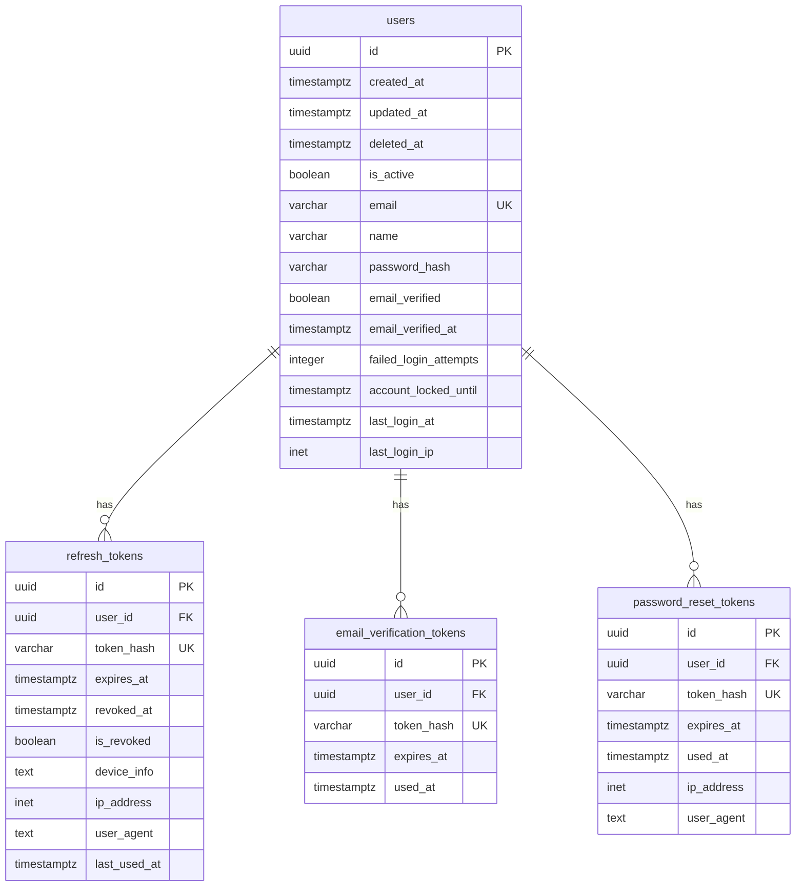

# JWT Authentication Database Guide

Complete guide to setting up and understanding the database schema for JWT authentication in Dashtam.

## Overview

This guide covers the complete database schema for JWT authentication, including user accounts, refresh tokens, email verification tokens, and password reset tokens. By following this guide, you'll understand how to set up the authentication database and how each table supports the authentication workflow.

### What You'll Learn

- Database schema design for JWT authentication
- Table relationships and foreign keys
- Migration strategies with Alembic
- Index optimization for authentication queries
- Token storage and hashing patterns

### When to Use This Guide

Use this guide when:

- Setting up authentication for a new Dashtam instance
- Understanding the authentication database architecture
- Adding custom authentication fields
- Troubleshooting authentication database issues
- Optimizing authentication query performance

## Prerequisites

Before starting, ensure you have:

- [x] Docker and Docker Compose installed
- [x] PostgreSQL 17.6+ running (via Docker)
- [x] Alembic installed in development environment
- [x] Understanding of relational databases and SQL
- [x] Familiarity with database migrations

**Required Tools:**

- PostgreSQL 17.6 or higher
- Alembic 1.13+ (async support)
- Docker Compose v2

**Required Knowledge:**

- Familiarity with PostgreSQL and SQL
- Understanding of database indexes
- Basic knowledge of Alembic migrations

## Step-by-Step Instructions

### Step 1: Understand the Database Schema

The authentication system uses 4 primary tables:

1. **users** - User accounts and authentication state
2. **refresh_tokens** - Long-lived tokens for obtaining new access tokens
3. **email_verification_tokens** - One-time tokens for email verification
4. **password_reset_tokens** - One-time tokens for password reset

**Database Entity Relationship:**



**What This Does:** Establishes the foundational database structure for all authentication operations.

### Step 2: Create Users Table

The users table stores core account information and authentication state.

**Table Definition:**

```sql
CREATE TABLE users (
    -- Primary key
    id UUID PRIMARY KEY DEFAULT gen_random_uuid(),
    
    -- Timestamps (all timezone-aware)
    created_at TIMESTAMPTZ NOT NULL DEFAULT NOW(),
    updated_at TIMESTAMPTZ,
    deleted_at TIMESTAMPTZ,
    
    -- Status
    is_active BOOLEAN NOT NULL DEFAULT TRUE,
    
    -- Authentication
    email VARCHAR(255) UNIQUE NOT NULL,
    name VARCHAR(255) NOT NULL,
    password_hash VARCHAR(255),
    
    -- Email verification
    email_verified BOOLEAN NOT NULL DEFAULT FALSE,
    email_verified_at TIMESTAMPTZ,
    
    -- Account security
    failed_login_attempts INTEGER NOT NULL DEFAULT 0,
    account_locked_until TIMESTAMPTZ,
    
    -- Login tracking
    last_login_at TIMESTAMPTZ,
    last_login_ip INET
);

-- Indexes
CREATE INDEX idx_users_email ON users(email);
CREATE INDEX idx_users_is_active ON users(is_active);
CREATE INDEX idx_users_email_verified ON users(email_verified);
```

**Key Fields Explained:**

- `password_hash`: bcrypt hash with 12 rounds (~300ms verification time)
- `email_verified`: MUST be true before user can login
- `failed_login_attempts`: Incremented on failed login, reset on success
- `account_locked_until`: Set after 10 failed attempts (1-hour lockout)
- `last_login_at` / `last_login_ip`: Audit trail for security monitoring

**Important Notes:**

- ⚠️ All timestamps use `TIMESTAMPTZ` (timezone-aware) for PCI-DSS compliance
- ℹ️ Email addresses are case-insensitive (lowercase before storage)
- ℹ️ `deleted_at` supports soft deletes (retain user data for audit trail)

### Step 3: Create Refresh Tokens Table

Refresh tokens enable long-lived sessions without storing passwords.

**Table Definition:**

```sql
CREATE TABLE refresh_tokens (
    -- Primary key
    id UUID PRIMARY KEY DEFAULT gen_random_uuid(),
    
    -- Timestamps
    created_at TIMESTAMPTZ NOT NULL DEFAULT NOW(),
    updated_at TIMESTAMPTZ,
    deleted_at TIMESTAMPTZ,
    is_active BOOLEAN NOT NULL DEFAULT TRUE,
    
    -- Foreign key
    user_id UUID NOT NULL REFERENCES users(id) ON DELETE CASCADE,
    
    -- Token data
    token_hash VARCHAR(255) UNIQUE NOT NULL,
    expires_at TIMESTAMPTZ NOT NULL,
    
    -- Revocation
    revoked_at TIMESTAMPTZ,
    is_revoked BOOLEAN NOT NULL DEFAULT FALSE,
    
    -- Device tracking
    device_info TEXT,
    ip_address INET,
    user_agent TEXT,
    last_used_at TIMESTAMPTZ
);

-- Indexes
CREATE INDEX idx_refresh_tokens_user_id ON refresh_tokens(user_id);
CREATE INDEX idx_refresh_tokens_is_revoked ON refresh_tokens(is_revoked);
CREATE INDEX idx_refresh_tokens_token_hash ON refresh_tokens(token_hash);
CREATE INDEX idx_refresh_tokens_expires_at ON refresh_tokens(expires_at);
```

**Key Fields Explained:**

- `token_hash`: bcrypt hash of random 64-character token (NEVER store plain token)
- `expires_at`: 30 days from creation (configurable)
- `is_revoked`: Set to true on logout or password reset
- `device_info`: Browser/OS information for session management
- `last_used_at`: Updated on every token refresh (useful for cleanup)

**Important Notes:**

- ⚠️ Tokens are hashed with bcrypt before storage (defense in depth)
- ℹ️ `ON DELETE CASCADE` ensures tokens deleted when user deleted
- ℹ️ Unique constraint on `token_hash` prevents duplicate tokens

### Step 4: Create Email Verification Tokens Table

Email verification tokens confirm user email ownership.

**Table Definition:**

```sql
CREATE TABLE email_verification_tokens (
    -- Primary key
    id UUID PRIMARY KEY DEFAULT gen_random_uuid(),
    
    -- Timestamps
    created_at TIMESTAMPTZ NOT NULL DEFAULT NOW(),
    updated_at TIMESTAMPTZ,
    deleted_at TIMESTAMPTZ,
    is_active BOOLEAN NOT NULL DEFAULT TRUE,
    
    -- Foreign key
    user_id UUID NOT NULL REFERENCES users(id) ON DELETE CASCADE,
    
    -- Token data
    token_hash VARCHAR(255) UNIQUE NOT NULL,
    expires_at TIMESTAMPTZ NOT NULL,
    used_at TIMESTAMPTZ
);

-- Indexes
CREATE INDEX idx_email_verification_tokens_user_id ON email_verification_tokens(user_id);
CREATE INDEX idx_email_verification_tokens_expires_at ON email_verification_tokens(expires_at);
```

**Key Fields Explained:**

- `token_hash`: bcrypt hash of email verification token
- `expires_at`: 24 hours from creation
- `used_at`: Timestamp when token was used (prevents reuse)

**Important Notes:**

- ⚠️ One-time use tokens (check `used_at IS NULL` before accepting)
- ℹ️ Expires after 24 hours (security vs UX trade-off)

### Step 5: Create Password Reset Tokens Table

Password reset tokens enable secure password recovery.

**Table Definition:**

```sql
CREATE TABLE password_reset_tokens (
    -- Primary key
    id UUID PRIMARY KEY DEFAULT gen_random_uuid(),
    
    -- Timestamps
    created_at TIMESTAMPTZ NOT NULL DEFAULT NOW(),
    updated_at TIMESTAMPTZ,
    deleted_at TIMESTAMPTZ,
    is_active BOOLEAN NOT NULL DEFAULT TRUE,
    
    -- Foreign key
    user_id UUID NOT NULL REFERENCES users(id) ON DELETE CASCADE,
    
    -- Token data
    token_hash VARCHAR(255) UNIQUE NOT NULL,
    expires_at TIMESTAMPTZ NOT NULL,
    used_at TIMESTAMPTZ,
    
    -- Request metadata
    ip_address INET,
    user_agent TEXT
);

-- Indexes
CREATE INDEX idx_password_reset_tokens_user_id ON password_reset_tokens(user_id);
CREATE INDEX idx_password_reset_tokens_expires_at ON password_reset_tokens(expires_at);
```

**Key Fields Explained:**

- `token_hash`: bcrypt hash of password reset token
- `expires_at`: 1 hour from creation (shorter for security)
- `ip_address` / `user_agent`: Track reset requests for security audit

**Important Notes:**

- ⚠️ Shorter expiration than email verification (1 hour vs 24 hours)
- ℹ️ IP and user agent tracking helps detect unauthorized reset attempts
- ℹ️ All active refresh tokens revoked when password reset completes

### Step 6: Run Database Migrations

Use Alembic to create the database schema automatically.

**Run Migrations:**

```bash
# Development environment
make migrate-up

# Or manually
docker compose -f compose/docker-compose.dev.yml exec app uv run alembic upgrade head
```

**Expected Output:**

```text
INFO  [alembic.runtime.migration] Running upgrade  -> bce8c437167b, Initial authentication schema
```

**What This Does:** Creates all authentication tables with proper indexes and constraints.

**Verify Migration:**

```bash
# Check migration status
make migrate-history

# Or manually
docker compose -f compose/docker-compose.dev.yml exec app uv run alembic current
```

## Examples

### Example 1: Query User with Active Refresh Tokens

```sql
-- Find user with all active refresh tokens
SELECT 
    u.id,
    u.email,
    u.name,
    u.email_verified,
    COUNT(rt.id) as active_sessions
FROM users u
LEFT JOIN refresh_tokens rt ON u.id = rt.user_id 
    AND rt.is_revoked = FALSE 
    AND rt.expires_at > NOW()
WHERE u.email = 'user@example.com'
GROUP BY u.id;
```

**Result:** Shows user details with count of active sessions.

### Example 2: Find Expired Tokens for Cleanup

```sql
-- Find expired tokens eligible for deletion
SELECT 
    COUNT(*) as expired_count,
    'refresh_tokens' as table_name
FROM refresh_tokens
WHERE expires_at < NOW() - INTERVAL '7 days'

UNION ALL

SELECT 
    COUNT(*) as expired_count,
    'email_verification_tokens' as table_name
FROM email_verification_tokens
WHERE expires_at < NOW() - INTERVAL '7 days'

UNION ALL

SELECT 
    COUNT(*) as expired_count,
    'password_reset_tokens' as table_name
FROM password_reset_tokens
WHERE expires_at < NOW() - INTERVAL '7 days';
```

**Result:** Counts of expired tokens by table (useful for cleanup jobs).

### Example 3: Audit User Login History

```sql
-- Get login history via refresh token creation
SELECT 
    u.email,
    rt.created_at as login_time,
    rt.ip_address,
    rt.device_info,
    rt.revoked_at as logout_time,
    CASE 
        WHEN rt.is_revoked THEN 'Logged Out'
        WHEN rt.expires_at < NOW() THEN 'Expired'
        ELSE 'Active'
    END as status
FROM users u
JOIN refresh_tokens rt ON u.id = rt.user_id
WHERE u.email = 'user@example.com'
ORDER BY rt.created_at DESC
LIMIT 10;
```

**Result:** Login history with device info and session status.

## Verification

### Check 1: Verify Tables Exist

```bash
# Connect to database
docker compose -f compose/docker-compose.dev.yml exec postgres psql -U dashtam -d dashtam

# List tables
\dt
```

**Expected Result:** Should see `users`, `refresh_tokens`, `email_verification_tokens`, `password_reset_tokens`.

### Check 2: Verify Indexes

```sql
-- Check indexes on users table
SELECT indexname, indexdef 
FROM pg_indexes 
WHERE tablename = 'users';
```

**Expected Result:** Should see indexes on `email`, `is_active`, `email_verified`.

### Check 3: Verify Foreign Key Constraints

```sql
-- Check foreign key constraints
SELECT
    conname AS constraint_name,
    conrelid::regclass AS table_name,
    confrelid::regclass AS foreign_table
FROM pg_constraint
WHERE contype = 'f'
AND connamespace = 'public'::regnamespace;
```

**Expected Result:** All token tables should reference `users(id)` with `ON DELETE CASCADE`.

## Troubleshooting

### Issue 1: Migration Fails with "relation already exists"

**Symptoms:**

- Alembic upgrade fails
- Error message: "relation 'users' already exists"

**Cause:** Database already has tables from previous manual creation.

**Solution:**

```bash
# Option A: Drop all tables and recreate
docker compose -f compose/docker-compose.dev.yml exec postgres psql -U dashtam -d dashtam -c "DROP SCHEMA public CASCADE; CREATE SCHEMA public;"
make migrate-up

# Option B: Stamp current migration without running
docker compose -f compose/docker-compose.dev.yml exec app uv run alembic stamp head
```

### Issue 2: Slow Token Validation Queries

**Symptoms:**

- Refresh token endpoint slow (>500ms)
- High CPU usage on PostgreSQL

**Cause:** Missing index on `token_hash` or `is_revoked`.

**Solution:**

```sql
-- Verify indexes exist
SELECT schemaname, tablename, indexname 
FROM pg_indexes 
WHERE tablename = 'refresh_tokens';

-- Create missing indexes if needed
CREATE INDEX IF NOT EXISTS idx_refresh_tokens_token_hash ON refresh_tokens(token_hash);
CREATE INDEX IF NOT EXISTS idx_refresh_tokens_is_revoked ON refresh_tokens(is_revoked);
```

### Issue 3: Timezone Issues with Timestamps

**Symptoms:**

- Token expiration times incorrect
- Login times show wrong timezone

**Cause:** Using `TIMESTAMP` instead of `TIMESTAMPTZ`.

**Solution:**

All timestamp columns MUST use `TIMESTAMPTZ` (timezone-aware). If using `TIMESTAMP`:

```sql
-- Convert existing columns to TIMESTAMPTZ
ALTER TABLE users 
    ALTER COLUMN created_at TYPE TIMESTAMPTZ,
    ALTER COLUMN updated_at TYPE TIMESTAMPTZ,
    ALTER COLUMN last_login_at TYPE TIMESTAMPTZ;

-- Repeat for all timestamp columns in all tables
```

## Best Practices

- ✅ **Always use TIMESTAMPTZ:** Ensures timezone-aware timestamps (PCI-DSS compliance)
- ✅ **Hash tokens before storage:** Defense in depth - bcrypt all tokens (refresh, email, password reset)
- ✅ **Use indexes wisely:** Index frequently queried columns (email, token_hash, is_revoked, expires_at)
- ✅ **Implement cleanup jobs:** Periodically delete expired tokens (7+ days old)
- ✅ **Use CASCADE deletes:** Ensures tokens deleted when user deleted
- ✅ **Track device info:** Helps users identify suspicious sessions
- ✅ **Soft deletes for users:** Set `deleted_at` instead of hard delete (audit trail)

### Common Mistakes to Avoid

- ❌ **Storing plain tokens:** Always hash tokens before storage (use bcrypt)
- ❌ **Using TIMESTAMP instead of TIMESTAMPTZ:** Causes timezone bugs and compliance issues
- ❌ **Missing indexes:** Results in slow queries as data grows
- ❌ **No cleanup jobs:** Database grows unbounded with expired tokens
- ❌ **Hard deletes:** Lose audit trail, use soft deletes instead

## Next Steps

After completing this guide, consider:

- [ ] [JWT Authentication Services Guide](jwt-authentication-services-guide.md) - Implement authentication services
- [ ] [JWT Authentication API Guide](jwt-authentication-api-guide.md) - Build authentication endpoints
- [ ] [Database Migrations Guide](../infrastructure/database-migrations.md) - Advanced Alembic usage
- [ ] Set up automated token cleanup job (cron or scheduled task)

## References

- [JWT Authentication Architecture](../architecture/jwt-authentication.md) - Comprehensive architecture guide
- [Database Migrations Guide](../infrastructure/database-migrations.md) - Alembic best practices
- [Token Rotation Guide](token-rotation.md) - Universal token rotation patterns
- [PostgreSQL TIMESTAMPTZ Documentation](https://www.postgresql.org/docs/current/datatype-datetime.html) - Official docs
- [Alembic Documentation](https://alembic.sqlalchemy.org/en/latest/) - Migration tool

---

## Document Information

**Template:** guide-template.md
**Created:** 2025-10-19
**Last Updated:** 2025-10-19
