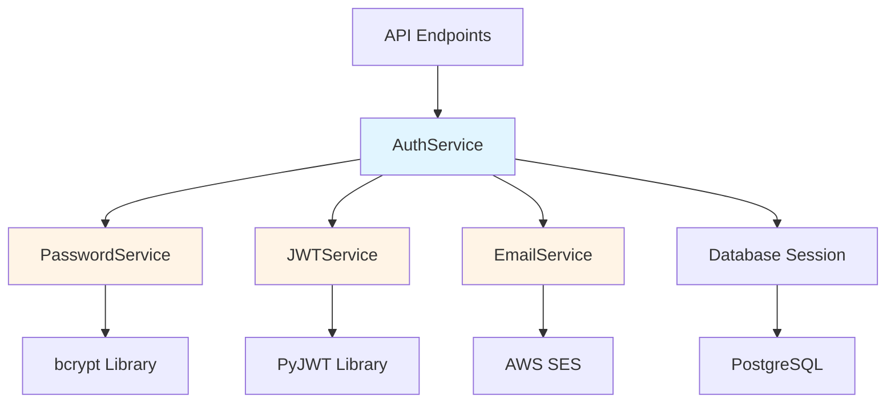

# JWT Authentication Services Guide

Complete guide to implementing and understanding the authentication services layer in Dashtam.

---

## Table of Contents

- [Overview](#overview)
  - [What You'll Learn](#what-youll-learn)
  - [When to Use This Guide](#when-to-use-this-guide)
- [Prerequisites](#prerequisites)
- [Step-by-Step Instructions](#step-by-step-instructions)
  - [Step 1: Understand the Services Architecture](#step-1-understand-the-services-architecture)
  - [Step 2: Implement PasswordService](#step-2-implement-passwordservice)
    - [Password Hashing with bcrypt](#password-hashing-with-bcrypt)
    - [Password Verification](#password-verification)
    - [Password Complexity Validation](#password-complexity-validation)
  - [Step 3: Implement JWTService](#step-3-implement-jwtservice)
    - [Generate Access Tokens](#generate-access-tokens)
    - [Validate Access Tokens](#validate-access-tokens)
    - [Handle Token Expiration](#handle-token-expiration)
  - [Step 4: Implement EmailService](#step-4-implement-emailservice)
    - [Configure AWS SES](#configure-aws-ses)
    - [Create Email Templates](#create-email-templates)
    - [Send Verification Emails](#send-verification-emails)
    - [Send Password Reset Emails](#send-password-reset-emails)
  - [Step 5: Implement AuthService](#step-5-implement-authservice)
    - [User Registration Flow](#user-registration-flow)
    - [Email Verification Flow](#email-verification-flow)
    - [Login Flow](#login-flow)
    - [Token Refresh Flow](#token-refresh-flow)
    - [Logout Flow](#logout-flow)
    - [Password Reset Request Flow](#password-reset-request-flow)
    - [Password Reset Confirm Flow](#password-reset-confirm-flow)
  - [Step 6: Implement Token Generation](#step-6-implement-token-generation)
  - [Step 7: Implement Account Lockout Logic](#step-7-implement-account-lockout-logic)
- [Examples](#examples)
  - [Example 1: Register New User](#example-1-register-new-user)
  - [Example 2: Login and Get Tokens](#example-2-login-and-get-tokens)
  - [Example 3: Refresh Access Token](#example-3-refresh-access-token)
  - [Example 4: Password Reset Flow](#example-4-password-reset-flow)
- [Verification](#verification)
  - [Check 1: Verify PasswordService](#check-1-verify-passwordservice)
  - [Check 2: Verify JWTService](#check-2-verify-jwtservice)
  - [Check 3: Verify AuthService Integration](#check-3-verify-authservice-integration)
- [Troubleshooting](#troubleshooting)
  - [Issue 1: bcrypt Hash Verification Slow](#issue-1-bcrypt-hash-verification-slow)
  - [Issue 2: JWT Token Validation Fails](#issue-2-jwt-token-validation-fails)
  - [Issue 3: Email Sending Fails](#issue-3-email-sending-fails)
  - [Issue 4: Account Lockout Not Working](#issue-4-account-lockout-not-working)
- [Best Practices](#best-practices)
  - [Common Mistakes to Avoid](#common-mistakes-to-avoid)
- [Next Steps](#next-steps)
- [References](#references)
- [Document Information](#document-information)

---

## Overview

This guide covers the complete authentication services layer, including password management, JWT token handling, email notifications, and the core authentication service that orchestrates user registration, login, logout, and password reset flows.

### What You'll Learn

- How to implement secure password hashing with bcrypt
- JWT access token generation and validation
- Opaque refresh token management (stateful, hashed)
- Email service integration with AWS SES
- Complete authentication flow orchestration
- Account security features (lockout, failed attempts)

### When to Use This Guide

Use this guide when:

- Setting up authentication services for a new Dashtam instance
- Understanding how authentication services work together
- Implementing custom authentication logic
- Troubleshooting authentication service issues
- Adding new authentication features

## Prerequisites

Before starting, ensure you have:

- [x] Database schema created (see [Database Guide](jwt-authentication-database-guide.md))
- [x] Python 3.13+ environment
- [x] Understanding of async/await patterns
- [x] Familiarity with bcrypt and JWT concepts
- [x] AWS SES account configured (for email service)

**Required Tools:**

- Python 3.13 or higher
- bcrypt library (12 rounds for password hashing)
- PyJWT library for JWT token handling
- boto3 for AWS SES integration

**Required Knowledge:**

- Async Python programming
- Understanding of JWT tokens
- Basic cryptography concepts
- Email service configuration

## Step-by-Step Instructions

### Step 1: Understand the Services Architecture

The authentication system uses 4 core services:

1. **PasswordService** - Password hashing, verification, and validation
2. **JWTService** - JWT access token generation and validation
3. **EmailService** - Email notifications (verification, password reset)
4. **AuthService** - Orchestrates all authentication flows

**Service Dependency Flow:**



**What This Does:** Shows how services interact and their dependencies.

### Step 2: Implement PasswordService

The PasswordService handles all password-related operations with bcrypt.

**File**: `src/services/password_service.py`

#### Password Hashing with bcrypt

```python
import bcrypt


class PasswordService:
    """Service for password hashing, verification, and validation.
    
    Uses bcrypt with 12 rounds (~300ms verification time) for secure
    password hashing. This provides strong security while maintaining
    acceptable performance.
    """
    
    BCRYPT_ROUNDS = 12  # ~300ms verification time
    
    def hash_password(self, password: str) -> str:
        """Hash a password using bcrypt.
        
        Args:
            password: Plain text password to hash
            
        Returns:
            Hashed password as string (bcrypt format)
            
        Example:
            >>> service = PasswordService()
            >>> hashed = service.hash_password("MyPassword123!")
            >>> print(hashed)
            $2b$12$abcd...xyz
        """
        salt = bcrypt.gensalt(rounds=self.BCRYPT_ROUNDS)
        hashed = bcrypt.hashpw(password.encode('utf-8'), salt)
        return hashed.decode('utf-8')
```

**Key Points:**

- 12 rounds provides ~300ms verification time (security vs UX trade-off)
- Salt automatically generated per password
- Returns string (not bytes) for database storage

#### Password Verification

```python
    def verify_password(self, password: str, hashed: str) -> bool:
        """Verify a password against its hash.
        
        Args:
            password: Plain text password to verify
            hashed: Stored bcrypt hash
            
        Returns:
            True if password matches hash, False otherwise
            
        Example:
            >>> service = PasswordService()
            >>> valid = service.verify_password("MyPassword123!", stored_hash)
            >>> print(valid)
            True
        """
        try:
            return bcrypt.checkpw(
                password.encode('utf-8'),
                hashed.encode('utf-8')
            )
        except Exception:
            return False
```

**Important Notes:**

- ⚠️ Always use try/except - invalid hash formats will raise exceptions
- ℹ️ Constant-time comparison prevents timing attacks
- ℹ️ Returns False for any error (safe default)

#### Password Complexity Validation

```python
    def validate_password_strength(self, password: str) -> tuple[bool, str]:
        """Validate password meets complexity requirements.
        
        Requirements:
        - At least 8 characters
        - At least 1 uppercase letter
        - At least 1 lowercase letter
        - At least 1 digit
        - At least 1 special character
        
        Args:
            password: Password to validate
            
        Returns:
            Tuple of (is_valid, error_message)
            
        Example:
            >>> service = PasswordService()
            >>> valid, error = service.validate_password_strength("weak")
            >>> print(valid, error)
            False, "Password must be at least 8 characters"
        """
        if len(password) < 8:
            return False, "Password must be at least 8 characters"
        
        if not any(c.isupper() for c in password):
            return False, "Password must contain uppercase letter"
        
        if not any(c.islower() for c in password):
            return False, "Password must contain lowercase letter"
        
        if not any(c.isdigit() for c in password):
            return False, "Password must contain digit"
        
        special_chars = "!@#$%^&*()_+-=[]{}|;:,.<>?"
        if not any(c in special_chars for c in password):
            return False, "Password must contain special character"
        
        return True, ""
```

**Complexity Requirements:**

- Minimum 8 characters
- Mixed case (upper + lower)
- At least 1 digit
- At least 1 special character

### Step 3: Implement JWTService

The JWTService handles JWT access token generation and validation.

**File**: `src/services/jwt_service.py`

#### Generate Access Tokens

```python
from datetime import datetime, timedelta, timezone
import jwt
from uuid import UUID


class JWTService:
    """Service for JWT access token generation and validation.
    
    Generates stateless JWT access tokens with 30-minute TTL.
    Tokens contain user_id claim for authentication.
    """
    
    def __init__(self, secret_key: str, algorithm: str = "HS256"):
        """Initialize JWT service.
        
        Args:
            secret_key: Secret key for signing tokens
            algorithm: JWT algorithm (default: HS256)
        """
        self.secret_key = secret_key
        self.algorithm = algorithm
        self.access_token_ttl = timedelta(minutes=30)
    
    def generate_access_token(self, user_id: UUID) -> str:
        """Generate JWT access token.
        
        Args:
            user_id: User UUID
            
        Returns:
            Signed JWT access token string
            
        Example:
            >>> service = JWTService(secret_key="your-secret")
            >>> token = service.generate_access_token(user_id)
            >>> print(token)
            eyJhbGciOiJIUzI1NiIsInR5cCI6IkpXVCJ9...
        """
        now = datetime.now(timezone.utc)
        expires_at = now + self.access_token_ttl
        
        payload = {
            "sub": str(user_id),  # Subject (user ID)
            "iat": now,           # Issued at
            "exp": expires_at,    # Expiration
            "type": "access"      # Token type
        }
        
        return jwt.encode(payload, self.secret_key, algorithm=self.algorithm)
```

**Token Structure:**

- `sub`: User ID (subject)
- `iat`: Issued at timestamp
- `exp`: Expiration timestamp (30 minutes)
- `type`: Token type (access vs refresh)

#### Validate Access Tokens

```python
    def validate_access_token(self, token: str) -> UUID | None:
        """Validate JWT access token and extract user ID.
        
        Args:
            token: JWT access token string
            
        Returns:
            User UUID if valid, None if invalid/expired
            
        Example:
            >>> service = JWTService(secret_key="your-secret")
            >>> user_id = service.validate_access_token(token)
            >>> if user_id:
            ...     print(f"Valid token for user: {user_id}")
        """
        try:
            payload = jwt.decode(
                token,
                self.secret_key,
                algorithms=[self.algorithm]
            )
            
            # Verify token type
            if payload.get("type") != "access":
                return None
            
            # Extract user ID
            user_id_str = payload.get("sub")
            if not user_id_str:
                return None
            
            return UUID(user_id_str)
            
        except jwt.ExpiredSignatureError:
            return None  # Token expired
        except jwt.InvalidTokenError:
            return None  # Invalid token
        except Exception:
            return None  # Any other error
```

**Validation Checks:**

- Signature verification (HMAC SHA-256)
- Expiration check (automatic with PyJWT)
- Token type verification (must be "access")
- User ID extraction and validation

#### Handle Token Expiration

**Token Expiration Strategy:**

- **Access tokens**: 30 minutes (stateless, short-lived)
- **Refresh tokens**: 30 days (stateful, long-lived)
- **Client responsibility**: Refresh access token before expiration

```python
    def is_token_expired(self, token: str) -> bool:
        """Check if token is expired without full validation.
        
        Args:
            token: JWT token string
            
        Returns:
            True if expired, False otherwise
            
        Example:
            >>> service = JWTService(secret_key="your-secret")
            >>> if service.is_token_expired(token):
            ...     print("Token needs refresh")
        """
        try:
            payload = jwt.decode(
                token,
                self.secret_key,
                algorithms=[self.algorithm],
                options={"verify_exp": False}  # Skip expiration check
            )
            
            exp = payload.get("exp")
            if not exp:
                return True
            
            now = datetime.now(timezone.utc).timestamp()
            return now > exp
            
        except Exception:
            return True  # Treat errors as expired
```

### Step 4: Implement EmailService

The EmailService handles email notifications via AWS SES.

**File**: `src/services/email_service.py`

#### Configure AWS SES

```python
import boto3
from botocore.exceptions import ClientError


class EmailService:
    """Service for sending authentication emails via AWS SES.
    
    Supports email verification and password reset notifications
    with HTML templates.
    """
    
    def __init__(
        self,
        aws_access_key_id: str,
        aws_secret_access_key: str,
        aws_region: str,
        from_email: str
    ):
        """Initialize email service with AWS SES.
        
        Args:
            aws_access_key_id: AWS access key
            aws_secret_access_key: AWS secret key
            aws_region: AWS region (e.g., us-east-1)
            from_email: Sender email address
        """
        self.ses_client = boto3.client(
            'ses',
            aws_access_key_id=aws_access_key_id,
            aws_secret_access_key=aws_secret_access_key,
            region_name=aws_region
        )
        self.from_email = from_email
```

**AWS SES Requirements:**

- Verified sender email address
- AWS credentials with SES send permissions
- Production: Domain verification required
- Development: Sandbox mode (verified recipients only)

#### Create Email Templates

```python
    def _get_verification_email_template(
        self,
        user_name: str,
        verification_url: str
    ) -> tuple[str, str]:
        """Get email verification template.
        
        Args:
            user_name: User's name
            verification_url: URL with verification token
            
        Returns:
            Tuple of (subject, html_body)
        """
        subject = "Verify Your Email - Dashtam"
        
        html_body = f"""
        <html>
        <head></head>
        <body>
            <h2>Welcome to Dashtam, {user_name}!</h2>
            <p>Please verify your email address by clicking the link below:</p>
            <p>
                <a href="{verification_url}" 
                   style="background-color: #4CAF50; 
                          color: white; 
                          padding: 10px 20px; 
                          text-decoration: none; 
                          border-radius: 5px;">
                    Verify Email
                </a>
            </p>
            <p>Or copy this link: {verification_url}</p>
            <p>This link expires in 24 hours.</p>
            <p>If you didn't create this account, please ignore this email.</p>
        </body>
        </html>
        """
        
        return subject, html_body
```

#### Send Verification Emails

```python
    async def send_verification_email(
        self,
        to_email: str,
        user_name: str,
        verification_token: str,
        base_url: str
    ) -> bool:
        """Send email verification email.
        
        Args:
            to_email: Recipient email address
            user_name: User's name
            verification_token: Verification token
            base_url: Base URL for verification link
            
        Returns:
            True if sent successfully, False otherwise
            
        Example:
            >>> service = EmailService(...)
            >>> success = await service.send_verification_email(
            ...     to_email="user@example.com",
            ...     user_name="John Doe",
            ...     verification_token="abc123",
            ...     base_url="https://api.dashtam.com"
            ... )
        """
        verification_url = f"{base_url}/api/v1/auth/verify-email/{verification_token}"
        subject, html_body = self._get_verification_email_template(
            user_name, verification_url
        )
        
        try:
            self.ses_client.send_email(
                Source=self.from_email,
                Destination={'ToAddresses': [to_email]},
                Message={
                    'Subject': {'Data': subject},
                    'Body': {'Html': {'Data': html_body}}
                }
            )
            return True
        except ClientError as e:
            print(f"Error sending email: {e}")
            return False
```

#### Send Password Reset Emails

```python
    async def send_password_reset_email(
        self,
        to_email: str,
        user_name: str,
        reset_token: str,
        base_url: str
    ) -> bool:
        """Send password reset email.
        
        Args:
            to_email: Recipient email address
            user_name: User's name
            reset_token: Password reset token
            base_url: Base URL for reset link
            
        Returns:
            True if sent successfully, False otherwise
        """
        reset_url = f"{base_url}/api/v1/auth/reset-password/{reset_token}"
        
        subject = "Password Reset Request - Dashtam"
        html_body = f"""
        <html>
        <body>
            <h2>Password Reset Request</h2>
            <p>Hi {user_name},</p>
            <p>Click the link below to reset your password:</p>
            <p>
                <a href="{reset_url}" 
                   style="background-color: #f44336; 
                          color: white; 
                          padding: 10px 20px; 
                          text-decoration: none; 
                          border-radius: 5px;">
                    Reset Password
                </a>
            </p>
            <p>Or copy this link: {reset_url}</p>
            <p>This link expires in 1 hour.</p>
            <p>If you didn't request this, please ignore this email.</p>
        </body>
        </html>
        """
        
        try:
            self.ses_client.send_email(
                Source=self.from_email,
                Destination={'ToAddresses': [to_email]},
                Message={
                    'Subject': {'Data': subject},
                    'Body': {'Html': {'Data': html_body}}
                }
            )
            return True
        except ClientError as e:
            print(f"Error sending email: {e}")
            return False
```

### Step 5: Implement AuthService

The AuthService orchestrates all authentication flows.

**File**: `src/services/auth_service.py`

#### User Registration Flow

```python
from uuid import UUID
from datetime import datetime, timezone, timedelta
from sqlalchemy.ext.asyncio import AsyncSession
from sqlmodel import select

from src.models.user import User
from src.models.email_verification_token import EmailVerificationToken
from src.services.password_service import PasswordService
from src.services.email_service import EmailService


class AuthService:
    """Service orchestrating authentication flows.
    
    Handles registration, login, logout, token refresh,
    and password reset operations.
    """
    
    def __init__(
        self,
        session: AsyncSession,
        password_service: PasswordService,
        jwt_service: JWTService,
        email_service: EmailService
    ):
        """Initialize auth service with dependencies."""
        self.session = session
        self.password_service = password_service
        self.jwt_service = jwt_service
        self.email_service = email_service
    
    async def register_user(
        self,
        email: str,
        name: str,
        password: str
    ) -> tuple[User, str]:
        """Register new user and send verification email.
        
        Args:
            email: User email (will be lowercased)
            name: User full name
            password: Plain text password
            
        Returns:
            Tuple of (created_user, verification_token)
            
        Raises:
            ValueError: If email exists or password weak
            
        Example:
            >>> service = AuthService(...)
            >>> user, token = await service.register_user(
            ...     email="user@example.com",
            ...     name="John Doe",
            ...     password="SecurePass123!"
            ... )
        """
        # Normalize email
        email = email.lower().strip()
        
        # Check if user exists
        result = await self.session.execute(
            select(User).where(User.email == email)
        )
        if result.scalar_one_or_none():
            raise ValueError("Email already registered")
        
        # Validate password strength
        valid, error = self.password_service.validate_password_strength(password)
        if not valid:
            raise ValueError(error)
        
        # Hash password
        password_hash = self.password_service.hash_password(password)
        
        # Create user
        user = User(
            email=email,
            name=name,
            password_hash=password_hash,
            email_verified=False
        )
        self.session.add(user)
        await self.session.commit()
        await self.session.refresh(user)
        
        # Generate verification token
        token = secrets.token_urlsafe(32)
        token_hash = self.password_service.hash_password(token)
        
        # Store verification token
        verification_token = EmailVerificationToken(
            user_id=user.id,
            token_hash=token_hash,
            expires_at=datetime.now(timezone.utc) + timedelta(hours=24)
        )
        self.session.add(verification_token)
        await self.session.commit()
        
        # Send verification email
        await self.email_service.send_verification_email(
            to_email=user.email,
            user_name=user.name,
            verification_token=token,
            base_url=settings.BASE_URL
        )
        
        return user, token
```

**Registration Steps:**

1. Normalize email (lowercase, strip whitespace)
2. Check for existing user
3. Validate password complexity
4. Hash password with bcrypt
5. Create user record (email_verified=False)
6. Generate verification token (32 bytes, URL-safe)
7. Hash token and store with 24-hour expiration
8. Send verification email

#### Email Verification Flow

```python
    async def verify_email(self, token: str) -> User:
        """Verify user email with token.
        
        Args:
            token: Email verification token from URL
            
        Returns:
            Verified user
            
        Raises:
            ValueError: If token invalid, expired, or used
            
        Example:
            >>> service = AuthService(...)
            >>> user = await service.verify_email(token="abc123...")
        """
        # Find all active verification tokens
        result = await self.session.execute(
            select(EmailVerificationToken)
            .where(
                EmailVerificationToken.used_at.is_(None),
                EmailVerificationToken.expires_at > datetime.now(timezone.utc)
            )
        )
        tokens = result.scalars().all()
        
        # Check token against all hashes
        verification_token = None
        for t in tokens:
            if self.password_service.verify_password(token, t.token_hash):
                verification_token = t
                break
        
        if not verification_token:
            raise ValueError("Invalid or expired verification token")
        
        # Mark token as used
        verification_token.used_at = datetime.now(timezone.utc)
        
        # Get user and mark email verified
        result = await self.session.execute(
            select(User).where(User.id == verification_token.user_id)
        )
        user = result.scalar_one()
        
        user.email_verified = True
        user.email_verified_at = datetime.now(timezone.utc)
        
        await self.session.commit()
        
        return user
```

**Verification Steps:**

1. Query all active (unused, non-expired) tokens
2. Compare provided token against all hashes
3. Mark token as used (prevents reuse)
4. Update user: email_verified=True
5. Set email_verified_at timestamp

#### Login Flow

```python
    async def login(
        self,
        email: str,
        password: str,
        ip_address: str,
        user_agent: str
    ) -> tuple[str, str, User]:
        """Authenticate user and create session.
        
        Args:
            email: User email
            password: Plain text password
            ip_address: Client IP address
            user_agent: Client user agent
            
        Returns:
            Tuple of (access_token, refresh_token, user)
            
        Raises:
            ValueError: If credentials invalid or email not verified
            
        Example:
            >>> service = AuthService(...)
            >>> access, refresh, user = await service.login(
            ...     email="user@example.com",
            ...     password="SecurePass123!",
            ...     ip_address="192.168.1.1",
            ...     user_agent="Mozilla/5.0..."
            ... )
        """
        email = email.lower().strip()
        
        # Get user
        result = await self.session.execute(
            select(User).where(User.email == email)
        )
        user = result.scalar_one_or_none()
        
        if not user:
            raise ValueError("Invalid email or password")
        
        # Check account lockout
        if user.account_locked_until and user.account_locked_until > datetime.now(timezone.utc):
            raise ValueError("Account locked due to failed login attempts")
        
        # Verify password
        if not self.password_service.verify_password(password, user.password_hash):
            # Increment failed attempts
            user.failed_login_attempts += 1
            
            # Lock account after 10 failures
            if user.failed_login_attempts >= 10:
                user.account_locked_until = datetime.now(timezone.utc) + timedelta(hours=1)
            
            await self.session.commit()
            raise ValueError("Invalid email or password")
        
        # Check email verified
        if not user.email_verified:
            raise ValueError("Email not verified")
        
        # Reset failed attempts
        user.failed_login_attempts = 0
        user.account_locked_until = None
        user.last_login_at = datetime.now(timezone.utc)
        user.last_login_ip = ip_address
        
        # Generate tokens
        access_token = self.jwt_service.generate_access_token(user.id)
        refresh_token = secrets.token_urlsafe(64)
        refresh_token_hash = self.password_service.hash_password(refresh_token)
        
        # Store refresh token
        refresh_token_record = RefreshToken(
            user_id=user.id,
            token_hash=refresh_token_hash,
            expires_at=datetime.now(timezone.utc) + timedelta(days=30),
            ip_address=ip_address,
            user_agent=user_agent
        )
        self.session.add(refresh_token_record)
        await self.session.commit()
        
        return access_token, refresh_token, user
```

**Login Steps:**

1. Normalize email
2. Query user by email
3. Check account lockout status
4. Verify password with bcrypt
5. Increment failed attempts if password wrong (lock after 10)
6. Require email_verified=True
7. Reset failed attempts on success
8. Update last_login_at and last_login_ip
9. Generate JWT access token (30 min)
10. Generate opaque refresh token (64 bytes)
11. Hash and store refresh token (30 days)

#### Token Refresh Flow

```python
    async def refresh_access_token(
        self,
        refresh_token: str
    ) -> tuple[str, str]:
        """Refresh access token using refresh token.
        
        Args:
            refresh_token: Opaque refresh token
            
        Returns:
            Tuple of (new_access_token, new_refresh_token)
            
        Raises:
            ValueError: If refresh token invalid or revoked
            
        Example:
            >>> service = AuthService(...)
            >>> new_access, new_refresh = await service.refresh_access_token(
            ...     refresh_token="abc123..."
            ... )
        """
        # Find all active refresh tokens
        result = await self.session.execute(
            select(RefreshToken)
            .where(
                RefreshToken.is_revoked == False,
                RefreshToken.expires_at > datetime.now(timezone.utc)
            )
        )
        tokens = result.scalars().all()
        
        # Check token against all hashes
        refresh_token_record = None
        for t in tokens:
            if self.password_service.verify_password(refresh_token, t.token_hash):
                refresh_token_record = t
                break
        
        if not refresh_token_record:
            raise ValueError("Invalid or expired refresh token")
        
        # Update last used
        refresh_token_record.last_used_at = datetime.now(timezone.utc)
        
        # Generate new tokens
        access_token = self.jwt_service.generate_access_token(refresh_token_record.user_id)
        new_refresh_token = secrets.token_urlsafe(64)
        new_refresh_token_hash = self.password_service.hash_password(new_refresh_token)
        
        # Create new refresh token record
        new_token_record = RefreshToken(
            user_id=refresh_token_record.user_id,
            token_hash=new_refresh_token_hash,
            expires_at=datetime.now(timezone.utc) + timedelta(days=30),
            ip_address=refresh_token_record.ip_address,
            user_agent=refresh_token_record.user_agent
        )
        self.session.add(new_token_record)
        
        # Revoke old refresh token
        refresh_token_record.is_revoked = True
        refresh_token_record.revoked_at = datetime.now(timezone.utc)
        
        await self.session.commit()
        
        return access_token, new_refresh_token
```

**Token Refresh Steps:**

1. Query all active (non-revoked, non-expired) refresh tokens
2. Compare provided token against all hashes
3. Update last_used_at on matched token
4. Generate new JWT access token (30 min)
5. Generate new opaque refresh token (64 bytes)
6. Hash and store new refresh token
7. Revoke old refresh token (one-time use)

#### Logout Flow

```python
    async def logout(self, refresh_token: str) -> None:
        """Logout user by revoking refresh token.
        
        Args:
            refresh_token: Refresh token to revoke
            
        Raises:
            ValueError: If token not found
            
        Example:
            >>> service = AuthService(...)
            >>> await service.logout(refresh_token="abc123...")
        """
        # Find active refresh tokens
        result = await self.session.execute(
            select(RefreshToken)
            .where(
                RefreshToken.is_revoked == False,
                RefreshToken.expires_at > datetime.now(timezone.utc)
            )
        )
        tokens = result.scalars().all()
        
        # Find matching token
        refresh_token_record = None
        for t in tokens:
            if self.password_service.verify_password(refresh_token, t.token_hash):
                refresh_token_record = t
                break
        
        if not refresh_token_record:
            raise ValueError("Invalid refresh token")
        
        # Revoke token
        refresh_token_record.is_revoked = True
        refresh_token_record.revoked_at = datetime.now(timezone.utc)
        
        await self.session.commit()
```

**Logout Steps:**

1. Find matching refresh token (query active tokens, compare hashes)
2. Mark token as revoked (is_revoked=True)
3. Set revoked_at timestamp
4. Access token remains valid until expiration (30 min max)

#### Password Reset Request Flow

```python
    async def request_password_reset(
        self,
        email: str,
        ip_address: str,
        user_agent: str
    ) -> None:
        """Request password reset for user.
        
        Args:
            email: User email
            ip_address: Client IP address
            user_agent: Client user agent
            
        Note: Always returns success (even if email not found)
              to prevent email enumeration attacks
            
        Example:
            >>> service = AuthService(...)
            >>> await service.request_password_reset(
            ...     email="user@example.com",
            ...     ip_address="192.168.1.1",
            ...     user_agent="Mozilla/5.0..."
            ... )
        """
        email = email.lower().strip()
        
        # Get user
        result = await self.session.execute(
            select(User).where(User.email == email)
        )
        user = result.scalar_one_or_none()
        
        if not user:
            # Don't reveal if email exists (security)
            return
        
        # Generate reset token
        token = secrets.token_urlsafe(32)
        token_hash = self.password_service.hash_password(token)
        
        # Store reset token
        reset_token = PasswordResetToken(
            user_id=user.id,
            token_hash=token_hash,
            expires_at=datetime.now(timezone.utc) + timedelta(hours=1),
            ip_address=ip_address,
            user_agent=user_agent
        )
        self.session.add(reset_token)
        await self.session.commit()
        
        # Send reset email
        await self.email_service.send_password_reset_email(
            to_email=user.email,
            user_name=user.name,
            reset_token=token,
            base_url=settings.BASE_URL
        )
```

**Password Reset Request Steps:**

1. Normalize email
2. Query user (return success even if not found - prevents enumeration)
3. Generate reset token (32 bytes, URL-safe)
4. Hash token and store with 1-hour expiration
5. Track IP and user agent (security audit)
6. Send password reset email

#### Password Reset Confirm Flow

```python
    async def confirm_password_reset(
        self,
        token: str,
        new_password: str
    ) -> User:
        """Confirm password reset with token.
        
        Args:
            token: Password reset token from URL
            new_password: New password
            
        Returns:
            User with updated password
            
        Raises:
            ValueError: If token invalid or password weak
            
        Example:
            >>> service = AuthService(...)
            >>> user = await service.confirm_password_reset(
            ...     token="abc123...",
            ...     new_password="NewSecurePass123!"
            ... )
        """
        # Validate new password
        valid, error = self.password_service.validate_password_strength(new_password)
        if not valid:
            raise ValueError(error)
        
        # Find active reset tokens
        result = await self.session.execute(
            select(PasswordResetToken)
            .where(
                PasswordResetToken.used_at.is_(None),
                PasswordResetToken.expires_at > datetime.now(timezone.utc)
            )
        )
        tokens = result.scalars().all()
        
        # Check token against all hashes
        reset_token = None
        for t in tokens:
            if self.password_service.verify_password(token, t.token_hash):
                reset_token = t
                break
        
        if not reset_token:
            raise ValueError("Invalid or expired reset token")
        
        # Mark token as used
        reset_token.used_at = datetime.now(timezone.utc)
        
        # Get user
        result = await self.session.execute(
            select(User).where(User.id == reset_token.user_id)
        )
        user = result.scalar_one()
        
        # Update password
        user.password_hash = self.password_service.hash_password(new_password)
        
        # Revoke all refresh tokens (security: force re-login)
        result = await self.session.execute(
            select(RefreshToken)
            .where(
                RefreshToken.user_id == user.id,
                RefreshToken.is_revoked == False
            )
        )
        refresh_tokens = result.scalars().all()
        
        now = datetime.now(timezone.utc)
        for rt in refresh_tokens:
            rt.is_revoked = True
            rt.revoked_at = now
        
        await self.session.commit()
        
        return user
```

**Password Reset Confirm Steps:**

1. Validate new password complexity
2. Query active (unused, non-expired) reset tokens
3. Compare provided token against all hashes
4. Mark token as used (prevents reuse)
5. Hash and update user password
6. Revoke ALL active refresh tokens (force re-login everywhere)

### Step 6: Implement Token Generation

**Security Note**: All tokens use `secrets.token_urlsafe()` for cryptographically secure random generation.

```python
import secrets

# Email verification token (24-hour TTL)
verification_token = secrets.token_urlsafe(32)  # 32 bytes = 256 bits entropy

# Password reset token (1-hour TTL)
reset_token = secrets.token_urlsafe(32)  # 32 bytes = 256 bits entropy

# Refresh token (30-day TTL)
refresh_token = secrets.token_urlsafe(64)  # 64 bytes = 512 bits entropy
```

**Why Different Sizes:**

- Verification/reset: 32 bytes (sufficient for short TTL)
- Refresh: 64 bytes (longer TTL requires higher entropy)

### Step 7: Implement Account Lockout Logic

**Account Lockout Configuration:**

- Failed attempts tracked per user
- Lockout after 10 consecutive failures
- Lockout duration: 1 hour
- Reset failed attempts on successful login

```python
# In login flow (see Step 5 - Login Flow above)

# Check lockout status
if user.account_locked_until and user.account_locked_until > datetime.now(timezone.utc):
    raise ValueError("Account locked due to failed login attempts")

# Increment on failure
user.failed_login_attempts += 1
if user.failed_login_attempts >= 10:
    user.account_locked_until = datetime.now(timezone.utc) + timedelta(hours=1)

# Reset on success
user.failed_login_attempts = 0
user.account_locked_until = None
```

## Examples

### Example 1: Register New User

```python
# Initialize services
password_service = PasswordService()
jwt_service = JWTService(secret_key="your-secret")
email_service = EmailService(...)
auth_service = AuthService(session, password_service, jwt_service, email_service)

# Register user
try:
    user, token = await auth_service.register_user(
        email="john.doe@example.com",
        name="John Doe",
        password="SecurePass123!"
    )
    print(f"User registered: {user.email}")
    print(f"Verification email sent with token: {token}")
except ValueError as e:
    print(f"Registration failed: {e}")
```

**Result**: User created, verification email sent.

### Example 2: Login and Get Tokens

```python
# Login user
try:
    access_token, refresh_token, user = await auth_service.login(
        email="john.doe@example.com",
        password="SecurePass123!",
        ip_address="192.168.1.1",
        user_agent="Mozilla/5.0..."
    )
    print(f"Login successful for {user.email}")
    print(f"Access token (30 min): {access_token}")
    print(f"Refresh token (30 days): {refresh_token}")
except ValueError as e:
    print(f"Login failed: {e}")
```

**Result**: Access and refresh tokens generated.

### Example 3: Refresh Access Token

```python
# Refresh access token
try:
    new_access, new_refresh = await auth_service.refresh_access_token(
        refresh_token="existing_refresh_token"
    )
    print(f"New access token: {new_access}")
    print(f"New refresh token: {new_refresh}")
except ValueError as e:
    print(f"Token refresh failed: {e}")
```

**Result**: New tokens issued, old refresh token revoked.

### Example 4: Password Reset Flow

```python
# Request password reset
await auth_service.request_password_reset(
    email="john.doe@example.com",
    ip_address="192.168.1.1",
    user_agent="Mozilla/5.0..."
)
print("Password reset email sent (if account exists)")

# Confirm password reset (user clicks email link)
try:
    user = await auth_service.confirm_password_reset(
        token="reset_token_from_email",
        new_password="NewSecurePass456!"
    )
    print(f"Password reset successful for {user.email}")
    print("All refresh tokens revoked - user must login again")
except ValueError as e:
    print(f"Password reset failed: {e}")
```

**Result**: Password updated, all sessions terminated.

## Verification

### Check 1: Verify PasswordService

```python
# Test password hashing and verification
service = PasswordService()

password = "TestPass123!"
hashed = service.hash_password(password)

# Verify correct password
assert service.verify_password(password, hashed) == True

# Verify wrong password
assert service.verify_password("WrongPass", hashed) == False

# Test password validation
valid, error = service.validate_password_strength("weak")
assert valid == False
assert "at least 8 characters" in error

valid, error = service.validate_password_strength("SecurePass123!")
assert valid == True
```

**Expected Result**: All assertions pass.

### Check 2: Verify JWTService

```python
# Test JWT token generation and validation
service = JWTService(secret_key="test-secret")

user_id = UUID("12345678-1234-1234-1234-123456789012")
token = service.generate_access_token(user_id)

# Validate token
validated_user_id = service.validate_access_token(token)
assert validated_user_id == user_id

# Test expired token (wait 31 minutes or mock time)
assert service.is_token_expired(old_token) == True
```

**Expected Result**: Token validation works correctly.

### Check 3: Verify AuthService Integration

```python
# Test full registration -> verification -> login flow
auth_service = AuthService(session, password_service, jwt_service, email_service)

# 1. Register
user, verification_token = await auth_service.register_user(
    email="test@example.com",
    name="Test User",
    password="TestPass123!"
)
assert user.email_verified == False

# 2. Verify email
verified_user = await auth_service.verify_email(verification_token)
assert verified_user.email_verified == True

# 3. Login
access, refresh, login_user = await auth_service.login(
    email="test@example.com",
    password="TestPass123!",
    ip_address="127.0.0.1",
    user_agent="Test Agent"
)
assert access is not None
assert refresh is not None
```

**Expected Result**: Full auth flow works end-to-end.

## Troubleshooting

### Issue 1: bcrypt Hash Verification Slow

**Symptoms:**

- Login endpoint slow (>500ms)
- High CPU usage during password verification

**Cause:** bcrypt rounds too high (>12) or CPU-constrained environment.

**Solution:**

```python
# Reduce bcrypt rounds in development only
class PasswordService:
    BCRYPT_ROUNDS = 10  # Development: ~75ms
    # BCRYPT_ROUNDS = 12  # Production: ~300ms
```

**Note**: Never go below 10 rounds in production.

### Issue 2: JWT Token Validation Fails

**Symptoms:**

- `validate_access_token()` returns None
- Users forced to re-login frequently

**Cause:** Secret key mismatch or clock skew.

**Solution:**

```bash
# Verify secret key consistent
echo $SECRET_KEY  # Must match between services

# Check server time synchronization
ntpdate -q pool.ntp.org
```

### Issue 3: Email Sending Fails

**Symptoms:**

- Registration succeeds but no email received
- `send_verification_email()` returns False

**Cause:** AWS SES configuration issues.

**Solution:**

```python
# Test AWS SES connection
try:
    response = ses_client.get_send_quota()
    print(f"SES quota: {response}")
except ClientError as e:
    print(f"SES error: {e}")

# Check sender email verified
response = ses_client.list_verified_email_addresses()
print(f"Verified emails: {response['VerifiedEmailAddresses']}")
```

**Common Fixes:**

- Verify sender email in AWS SES console
- Check AWS credentials have SES permissions
- Production: Verify domain (not just email)
- Development: Add recipient to verified emails (sandbox mode)

### Issue 4: Account Lockout Not Working

**Symptoms:**

- Users can attempt login unlimited times
- `failed_login_attempts` not incrementing

**Cause:** Failed attempts not committed or lockout check missing.

**Solution:**

```python
# Ensure commit after failed attempt
user.failed_login_attempts += 1
if user.failed_login_attempts >= 10:
    user.account_locked_until = datetime.now(timezone.utc) + timedelta(hours=1)
await self.session.commit()  # ← CRITICAL: Must commit

# Verify lockout check at start of login
if user.account_locked_until and user.account_locked_until > datetime.now(timezone.utc):
    raise ValueError("Account locked due to failed login attempts")
```

## Best Practices

- ✅ **Always hash tokens before storage:** Refresh, email verification, password reset tokens
- ✅ **Use timezone-aware datetimes:** All datetime operations use `datetime.now(timezone.utc)`
- ✅ **Validate password complexity:** Enforce strong passwords before hashing
- ✅ **One-time use tokens:** Mark tokens as used after consumption
- ✅ **Revoke refresh tokens on password reset:** Force re-login for security
- ✅ **Track IP and user agent:** Useful for security monitoring
- ✅ **Email enumeration prevention:** Don't reveal if email exists in password reset
- ✅ **Account lockout:** Protect against brute force attacks

### Common Mistakes to Avoid

- ❌ **Storing plain tokens:** Always hash tokens before database storage
- ❌ **Using naive datetimes:** Always use timezone-aware datetimes
- ❌ **Weak password validation:** Enforce complexity requirements
- ❌ **Reusable tokens:** One-time tokens must check `used_at` field
- ❌ **No account lockout:** Vulnerable to brute force attacks
- ❌ **Revealing email existence:** Password reset should always return success
- ❌ **Not revoking tokens on password reset:** Old sessions remain valid

## Next Steps

After completing this guide, consider:

- [ ] [JWT Authentication API Guide](jwt-authentication-api-guide.md) - Build authentication endpoints
- [ ] [JWT Authentication Database Guide](jwt-authentication-database-guide.md) - Database schema reference
- [ ] [Testing Guide](testing-guide.md) - Test authentication services
- [ ] Set up monitoring for failed login attempts
- [ ] Configure AWS SES for production email sending

## References

- [JWT Authentication Architecture](../architecture/jwt-authentication.md) - Complete architecture guide
- [Password Service Tests](../../../tests/unit/test_password_service.py) - Unit test examples
- [JWT Service Tests](../../../tests/unit/test_jwt_service.py) - JWT testing patterns
- [bcrypt Documentation](https://github.com/pyca/bcrypt) - Password hashing library
- [PyJWT Documentation](https://pyjwt.readthedocs.io/) - JWT token library
- [AWS SES Documentation](https://docs.aws.amazon.com/ses/) - Email service setup

---

## Document Information

**Template:** [guide-template.md](../../templates/guide-template.md)
**Created:** 2025-10-19
**Last Updated:** 2025-10-19
