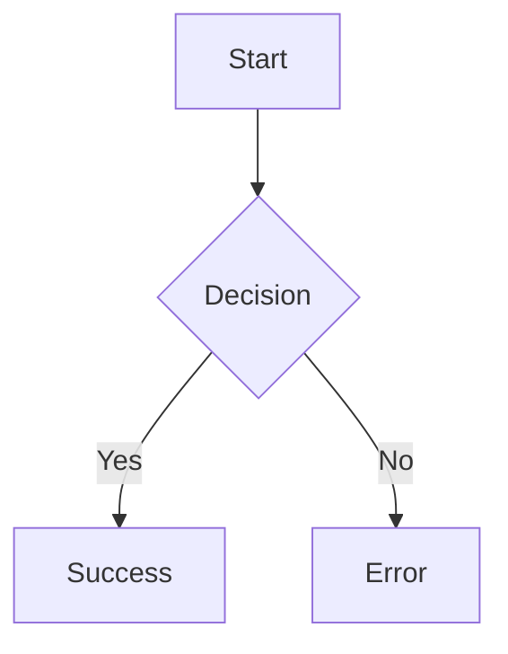
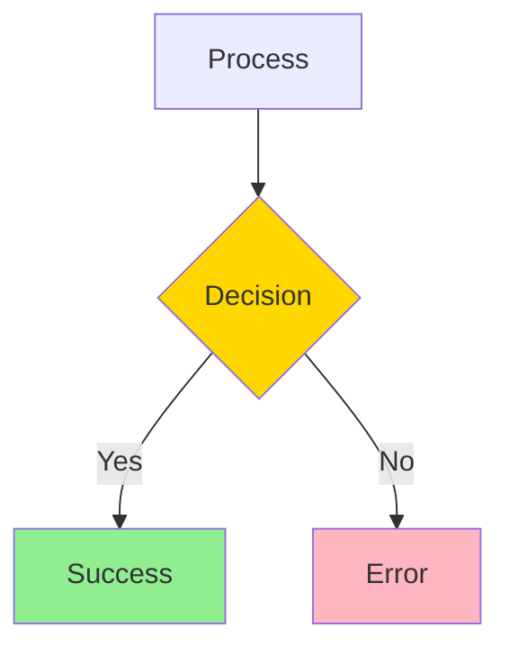
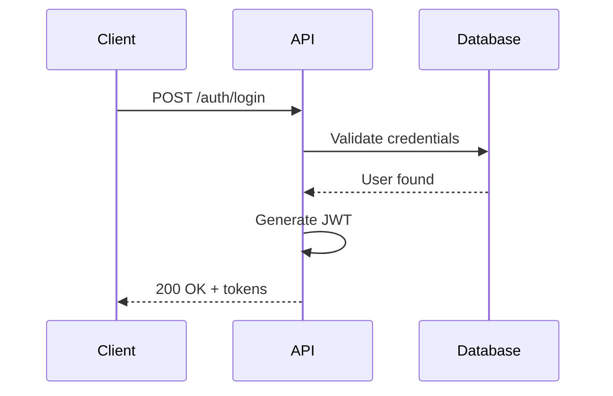
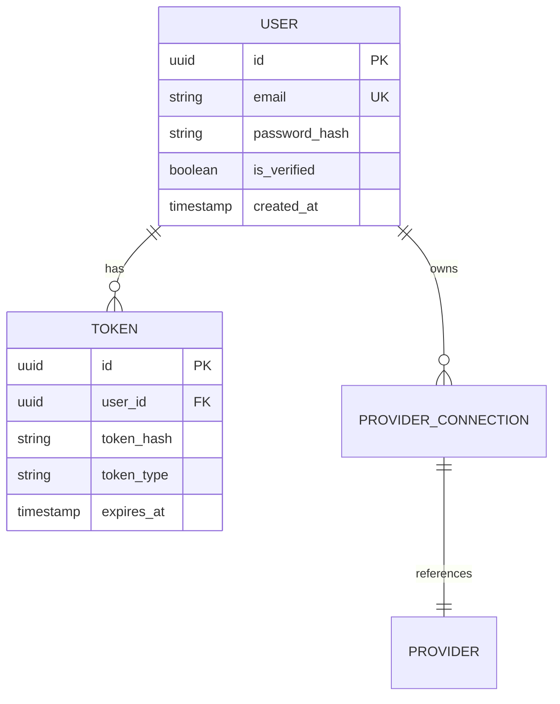
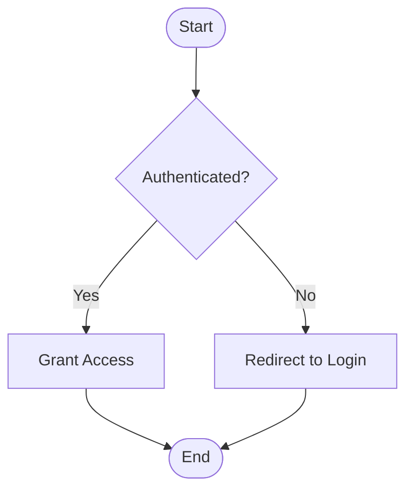
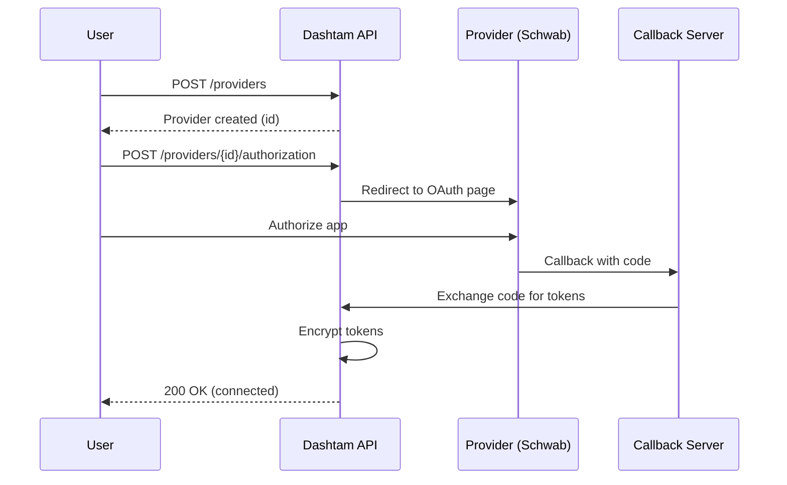
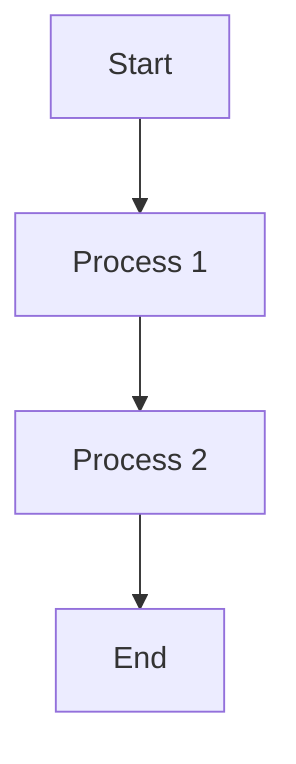
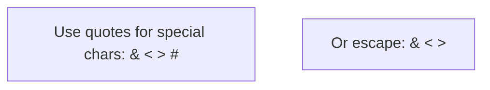

# Mermaid Diagram Standards

Complete guide to creating consistent, version-controlled diagrams in Dashtam documentation using Mermaid syntax for all visual content.

## Overview

**CRITICAL RULE**: All diagrams in Dashtam documentation MUST use Mermaid syntax. This ensures consistency, version control compatibility, and seamless MkDocs integration.

**Why Mermaid?**

- ✅ **Text-based** - Works with Git, easy to review in PRs
- ✅ **Version controlled** - Track changes over time
- ✅ **MkDocs compatible** - Renders automatically with mkdocs-mermaid2-plugin
- ✅ **No external tools** - No need for separate diagram applications
- ✅ **Consistent style** - Unified look across all documentation
- ✅ **Easy to update** - Edit text, not images

**Prohibited:**

- ❌ **Image files** (PNG, JPG, SVG uploads) - Not version-control friendly
- ❌ **External diagram tools** (draw.io, Lucidchart exports) - Creates maintenance burden
- ❌ **ASCII art** - Limited and hard to maintain

### What You'll Learn

- How to choose the correct Mermaid diagram type for your needs
- Syntax for flowcharts, sequence diagrams, ER diagrams, and more
- Styling and color coding conventions
- Validation and troubleshooting techniques
- MkDocs integration for automatic rendering
- Common patterns used in Dashtam documentation

### When to Use This Guide

Use this guide when:

- Creating visual documentation for architecture, processes, or data models
- Need to show workflows, sequences, or state transitions
- Documenting database schemas or entity relationships
- Replacing existing image-based diagrams with text-based versions
- Reviewing pull requests with diagram changes

## Prerequisites

Before starting, ensure you have:

- [ ] Basic understanding of markdown syntax
- [ ] Familiarity with the concept you're diagramming
- [ ] Access to Mermaid Live Editor (for validation)
- [ ] Text editor with markdown preview (optional but helpful)

**Required Tools:**

- Mermaid Live Editor - For syntax validation and preview
- Text editor - Any markdown-capable editor

**Required Knowledge:**

- Basic markdown formatting
- Understanding of diagram types (flowchart, sequence, etc.)
- The process or structure you want to visualize

## Step-by-Step Instructions

### Step 1: Choose the Right Diagram Type

Select the appropriate Mermaid diagram type based on what you need to visualize:

**Flowchart (`flowchart TD`)** - For process flows, decision trees, data flows

Use when showing:

- Step-by-step processes
- Decision points and branches
- State machines
- Data flow diagrams

**Sequence Diagram (`sequenceDiagram`)** - For interactions over time

Use when showing:

- API request/response flows
- Authentication sequences
- Service-to-service communication
- Time-based processes

**ER Diagram (`erDiagram`)** - For database structures

Use when showing:

- Database schema
- Entity relationships
- Data models
- Table structures

**State Diagram (`stateDiagram-v2`)** - For state transitions

Use when showing:

- Object lifecycle
- Status transitions
- Workflow states

**Class Diagram (`classDiagram`)** - For OOP structures

Use when showing:

- Class hierarchies
- Service architecture
- Object relationships

**Gantt Chart (`gantt`)** - For timelines

Use when showing:

- Project timelines
- Implementation phases
- Note: Avoid rigid day-based schedules per WARP.md

### Step 2: Write Mermaid Syntax

Create your diagram using Mermaid syntax in a code block:

**Basic Structure:**

````markdown
```mermaid
<diagram-type>
    <diagram content>
```
````

**Common Node Shapes:**

- `A[Rectangle]` - Standard process step
- `B{Diamond}` - Decision point
- `C([Rounded])` - Start/End point
- `D[(Database)]` - Database
- `E((Circle))` - Connection point

**Common Arrow Types:**

- `-->` - Solid arrow (flow direction)
- `-.->` - Dashed arrow (async/optional)
- `==>` - Thick arrow (primary path)
- `..>` - Dotted arrow (dependency)

**Layout Directions:**

- `TD` or `TB` - Top to bottom (recommended)
- `LR` - Left to right
- `RL` - Right to left
- `BT` - Bottom to top

### Step 3: Validate Your Diagram

Before adding to documentation, validate syntax:

1. Copy your Mermaid code
2. Open [Mermaid Live Editor](https://mermaid.live/)
3. Paste code into editor
4. Check for rendering errors
5. Adjust syntax as needed

**What This Does:** Catches syntax errors before they break documentation rendering.

### Step 4: Add to Documentation

Insert the validated diagram into your markdown file:

````markdown

````

**Important:** Always use the ````mermaid` language identifier in code blocks.

### Step 5: Apply Styling (Optional)

Add custom colors for better visual communication:



**Color Coding Standards:**

- Green (`#90EE90`) - Success paths
- Red/Pink (`#FFB6C1`) - Error paths
- Yellow (`#FFD700`) - Decision points
- Blue (`#87CEEB`) - External services

## Examples

### Example 1: Simple Authentication Flow



**Use case:** Documenting API authentication sequences

### Example 2: Database Schema



**Use case:** Documenting database relationships and structure

**Relationship Types:**

- `||--||` - One to one
- `||--o{` - One to many
- `}o--o{` - Many to many
- `||--o|` - One to zero or one

### Example 3: Decision Flow



**Use case:** Showing conditional logic and branching

### Example 4: OAuth Sequence

Complete OAuth flow from Dashtam architecture:



**Use case:** Documenting complex multi-service interactions

## Verification

### Check 1: Syntax Validation

Verify diagram renders correctly:

```bash
# 1. Copy Mermaid code from your markdown file
# 2. Open Mermaid Live Editor: https://mermaid.live/
# 3. Paste and check for errors
# 4. Adjust syntax if needed
```

**Expected Result:** Diagram renders without errors

### Check 2: Rendering Verification

Test in actual documentation context:

1. **Local preview** (if MkDocs configured):

   ```bash
   make docs-serve
   # Navigate to page with diagram
   ```

2. **GitHub preview:**

   - Push to test branch
   - View markdown file on GitHub
   - Verify diagram renders correctly

## Troubleshooting

### Issue 1: Diagram Not Rendering

**Symptoms:**

- Blank space where diagram should be
- Code block shows instead of diagram

**Cause:** Syntax error in Mermaid code

**Solution:**

1. Validate syntax at [Mermaid Live Editor](https://mermaid.live/)
2. Check for:
   - Missing quotes around special characters
   - Missing brackets or semicolons
   - Incorrect diagram type declaration
   - Typos in node or relationship syntax

### Issue 2: Diagram Too Wide

**Symptoms:**

- Diagram extends beyond page width
- Horizontal scrolling required

**Cause:** Too many nodes horizontally or long labels

**Solution:**

- Use vertical layout (`TD` instead of `LR`)
- Abbreviate long labels
- Split into multiple smaller diagrams
- Break complex flows into stages

**Example:**



### Issue 3: Special Characters Breaking Diagram

**Symptoms:**

- Syntax error with special characters
- Diagram fails to render

**Cause:** Unescaped special characters (`& < > # " '`)

**Solution:**



**Always wrap text with special characters in quotes.**

## Best Practices

Follow these best practices for consistent, maintainable diagrams:

- ✅ **Always specify diagram type** - Start with correct type declaration
- ✅ **Use descriptive labels** - Clear, concise text for all nodes
- ✅ **Keep it simple** - Don't overcomplicate diagrams
- ✅ **Consistent naming** - Use same conventions across diagrams
- ✅ **Add notes for complexity** - Explain non-obvious parts
- ✅ **Validate before committing** - Always check in Mermaid Live Editor
- ✅ **Use vertical layouts** - Better for mobile/responsive design
- ✅ **Apply color coding** - Use standard colors for clarity
- ✅ **Break complex diagrams** - Split into logical sections
- ✅ **Keep width reasonable** - Aim for 800-1200px width

**Responsive Design:**

- Keep diagrams narrow enough for mobile viewing
- Use `TD` (top-to-bottom) for most flows
- Split wide diagrams into multiple smaller ones
- Test rendering on different screen sizes

### Common Mistakes to Avoid

- ❌ **Using image files** - Always use Mermaid syntax instead
- ❌ **Forgetting language identifier** - Always use ````mermaid` in code blocks
- ❌ **Not validating syntax** - Always check in Live Editor first
- ❌ **Overcomplicating diagrams** - Keep them focused and simple
- ❌ **Using horizontal layouts** - Prefer vertical (`TD`) for better responsiveness
- ❌ **Missing special character quotes** - Wrap special chars in quotes
- ❌ **Inconsistent styling** - Follow color coding standards
- ❌ **No diagram type declaration** - Always specify type (flowchart, sequence, etc.)

**Syntax Reference Quick Guide:**

**Node Shapes:**

| Shape | Syntax | Use Case |
|-------|--------|----------|
| Rectangle | `A[Text]` | Standard process |
| Rounded | `A(Text)` | Start/End points |
| Circle | `A((Text))` | Connection points |
| Diamond | `A{Text}` | Decision points |
| Hexagon | `A{{Text}}` | Preparation steps |
| Parallelogram | `A[/Text/]` | Input/Output |
| Cylinder | `A[(Text)]` | Database |

**Arrow Types:**

| Arrow | Syntax | Meaning |
|-------|--------|---------|
| Solid | `-->` | Flow direction |
| Dashed | `-.->` | Async/Optional |
| Thick | `==>` | Primary path |
| Dotted | `..>` | Dependency |

## Next Steps

After mastering Mermaid diagrams, consider:

- [ ] Review existing documentation for diagrams that should use Mermaid
- [ ] Convert any image-based diagrams to Mermaid syntax
- [ ] Add diagrams to architecture documents
- [ ] Document complex workflows with sequence diagrams
- [ ] Create database schema diagrams for new features
- [ ] Explore advanced Mermaid features (subgraphs, custom themes)

**MkDocs Integration (Future):**

When MkDocs Material is implemented, diagrams will:

- Auto-render without manual processing
- Support dark mode themes
- Offer zoom and export capabilities

**Configuration example:**

```yaml
# mkdocs.yml
plugins:
  - mermaid2:
      version: "10.6.0"
```

## References

- [Mermaid Live Editor](https://mermaid.live/) - Validate and preview diagrams
- [Mermaid Official Documentation](https://mermaid.js.org/) - Complete syntax reference
- [Flowchart Documentation](https://mermaid.js.org/syntax/flowchart.html) - Flowchart syntax details
- [Sequence Diagram Documentation](https://mermaid.js.org/syntax/sequenceDiagram.html) - Sequence diagram guide
- [ER Diagram Documentation](https://mermaid.js.org/syntax/entityRelationshipDiagram.html) - Entity relationship diagrams
- Documentation Template System: README.md (located in docs/templates/) - Template usage guide
- `WARP.md` (project root) - Project standards and Mermaid requirements

---

## Document Information

**Template:** guide-template.md
**Created:** 2025-10-13
**Last Updated:** 2025-10-20
