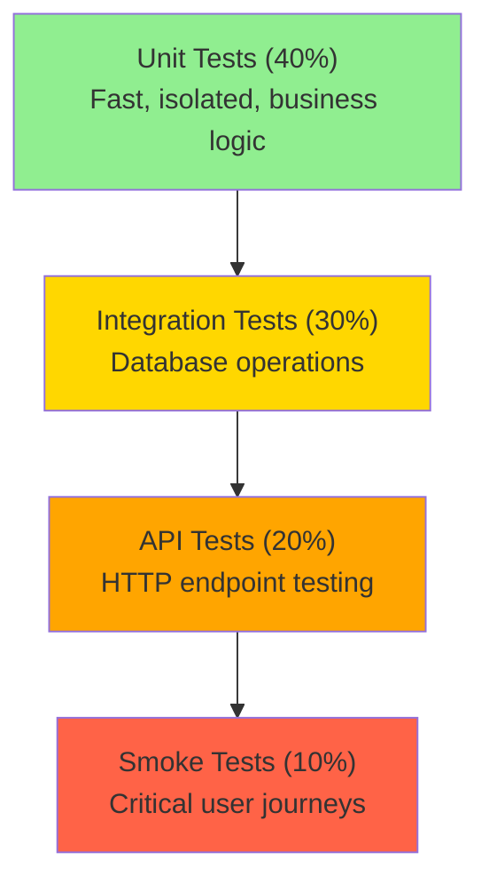

# Dashtam Testing Guide

Quick reference for writing and running tests following the project's synchronous testing pattern with comprehensive examples and best practices.

---

## Table of Contents

- [Overview](#overview)
  - [What You'll Learn](#what-youll-learn)
  - [Testing Goals](#testing-goals)
  - [Scope](#scope)
  - [Testing Strategy](#testing-strategy)
  - [Test Pyramid](#test-pyramid)
  - [Testing Principles](#testing-principles)
- [Prerequisites](#prerequisites)
  - [Required Tools](#required-tools)
  - [Test Environment Setup](#test-environment-setup)
  - [Test Data](#test-data)
- [Step-by-Step Instructions](#step-by-step-instructions)
  - [Step 1: Understanding Test Types](#step-1-understanding-test-types)
  - [Step 2: Writing Your First Test](#step-2-writing-your-first-test)
  - [Step 3: Using Fixtures](#step-3-using-fixtures)
  - [Step 4: Running Tests](#step-4-running-tests)
  - [Step 5: Checking Coverage](#step-5-checking-coverage)
- [Examples](#examples)
  - [Example 1: Unit Test](#example-1-unit-test)
  - [Example 2: Integration Test](#example-2-integration-test)
  - [Example 3: API Test](#example-3-api-test)
  - [Example 4: Smoke Test](#example-4-smoke-test)
- [Verification](#verification)
  - [Verify Tests Pass](#verify-tests-pass)
  - [Verify Coverage](#verify-coverage)
  - [Verify Linting](#verify-linting)
- [Troubleshooting](#troubleshooting)
  - [Tests Failing Intermittently](#tests-failing-intermittently)
  - [Slow Tests](#slow-tests)
  - [Coverage Not Accurate](#coverage-not-accurate)
  - [Database Cleanup Not Working](#database-cleanup-not-working)
  - [Test Hangs or Times Out](#test-hangs-or-times-out)
- [Best Practices](#best-practices)
  - [General Principles](#general-principles)
  - [Test Naming](#test-naming)
  - [Test Isolation](#test-isolation)
  - [Assertions](#assertions)
  - [Error Testing](#error-testing)
  - [Common Patterns](#common-patterns)
- [Next Steps](#next-steps)
- [References](#references)
  - [Project Documentation](#project-documentation)
  - [External Resources](#external-resources)
  - [Test Utilities](#test-utilities)
- [Document Information](#document-information)

---

## Overview

This guide provides quick-reference documentation for writing and running tests in the Dashtam project. The project uses a synchronous testing pattern with pytest and FastAPI TestClient to ensure fast, reliable test execution with proper database isolation.

### What You'll Learn

- How to write unit, integration, API, and smoke tests
- How to use pytest fixtures for test data
- How to run tests in Docker containers
- How to check and improve test coverage
- Best practices for maintainable tests

### Testing Goals

- **Fast Feedback**: Tests execute quickly to enable rapid development iteration
- **Reliability**: All tests are deterministic and stable across environments
- **Isolation**: Tests are independent and can run in any order without side effects
- **Comprehensive Coverage**: Target 85%+ overall coverage with 95%+ on critical components

### Scope

**This guide covers:**

- Unit tests for business logic and services
- Integration tests for database operations and relationships
- API tests for HTTP endpoints using TestClient
- Smoke tests for critical user journeys

**Not covered:**

- Browser-based E2E tests (not yet implemented)
- Performance/load testing (separate tooling)
- Security penetration testing (separate process)

### Testing Strategy

The Dashtam project follows a synchronous testing strategy using pytest with FastAPI's TestClient. All tests run in Docker containers with isolated test databases for reliability and consistency.

### Test Pyramid



**Test Distribution:**

| Test Type | Percentage | Speed | Purpose |
|-----------|------------|-------|---------|
| Unit | 40% | Very Fast (< 0.01s) | Test individual functions/classes in isolation |
| Integration | 30% | Fast (< 0.1s) | Test database operations and relationships |
| API | 20% | Medium (< 0.2s) | Test HTTP endpoints end-to-end |
| Smoke | 10% | Medium (< 5s) | Test complete user workflows |

### Testing Principles

- **Synchronous Over Async**: Use `def test_*()` not `async def` for better debugging and tooling support
- **Real Database for Integration**: Use PostgreSQL test database with automatic cleanup, not mocks
- **TestClient for APIs**: FastAPI TestClient handles app lifecycle without async complexity
- **AAA Pattern**: Arrange-Act-Assert structure for clear, maintainable tests
- **Test Isolation**: Each test is independent with automatic fixture cleanup

## Prerequisites

Before starting, ensure you have:

- [x] Docker Desktop installed and running
- [x] Test environment configured in `env/.env.test`
- [x] PostgreSQL test database available via Docker Compose
- [x] Redis test instance available via Docker Compose

### Required Tools

- **Docker Desktop** - Version 4.0+ or higher
- **Make** - For running test commands
- **Git** - For version control
- **Text Editor/IDE** - VS Code, PyCharm, or similar

### Test Environment Setup

```bash
# Start test environment (PostgreSQL + Redis)
make test-up

# Verify services are healthy
make test-status

# View test service logs
docker compose -f compose/docker-compose.test.yml logs -f
```

**Expected Output:**

```text
✅ dashtam-test-postgres is healthy
✅ dashtam-test-redis is healthy
✅ dashtam-test-app is healthy
```

### Test Data

**Automatic Fixtures:** Test data is created automatically via pytest fixtures defined in `tests/conftest.py`:

- `db_session` - Function-scoped database session with automatic cleanup
- `test_user` - Pre-created user (email: test@example.com)
- `test_user_2` - Second test user for multi-user scenarios
- `test_provider` - Pre-created provider for test_user
- `test_provider_with_connection` - Provider with active connection

**Manual Test Data:** For specific scenarios, create test data in test setup (Arrange phase):

```python path=null start=null
def test_with_custom_data(db_session: Session, test_user: User):
    """Test with custom test data."""
    # Create specific test data
    provider = Provider(
        user_id=test_user.id,
        provider_key="custom_provider",
        alias="Custom Test Provider"
    )
    db_session.add(provider)
    db_session.commit()
    # ... test logic ...
```

## Step-by-Step Instructions

### Step 1: Understanding Test Types

**Unit Tests** (`tests/unit/`) - Test individual functions/classes in isolation:

```python path=null start=null
def test_encrypt_decrypt_string():
    """Test basic encryption functionality."""
    service = EncryptionService()
    plaintext = "my_secret_token"
    
    encrypted = service.encrypt(plaintext)
    assert encrypted != plaintext
    
    decrypted = service.decrypt(encrypted)
    assert decrypted == plaintext
```

**Integration Tests** (`tests/integration/`) - Test database operations:

```python path=null start=null
def test_create_provider(db_session: Session, test_user: User):
    """Test creating provider in database."""
    provider = Provider(
        user_id=test_user.id,
        provider_key="schwab",
        alias="My Account"
    )
    db_session.add(provider)
    db_session.commit()
    db_session.refresh(provider)
    
    assert provider.id is not None
```

**API Tests** (`tests/api/`) - Test HTTP endpoints:

```python path=null start=null
def test_create_provider_endpoint(client: TestClient, test_user: User):
    """Test POST /api/v1/providers endpoint."""
    payload = {"provider_key": "schwab", "alias": "My Account"}
    
    response = client.post("/api/v1/providers", json=payload)
    
    assert response.status_code == 200
```

**Smoke Tests** (`tests/smoke/`) - Test critical user journeys:

```python path=null start=null
def test_registration_flow(client: TestClient, caplog):
    """Test complete registration flow."""
    # Register → Verify Email → Login
    # See tests/smoke/README.md for details
```

### Step 2: Writing Your First Test

Follow the **AAA Pattern** (Arrange-Act-Assert):

```python path=null start=null
def test_example(db_session: Session, test_user: User):
    """Test description following Google style docstrings.
    
    This test verifies [specific behavior being tested].
    """
    # Arrange - Set up test data and preconditions
    provider = Provider(user_id=test_user.id, provider_key="schwab")
    db_session.add(provider)
    db_session.commit()
    
    # Act - Execute the code under test
    result = some_function(provider)
    
    # Assert - Verify the results
    assert result is not None
    assert result.status == "expected_value"
```

**Test Naming Conventions:**

- **Files**: `test_<module>.py`
- **Functions**: `test_<feature>_<scenario>()`
- **Classes**: `Test<Component>` (optional)

**Examples:**

- ✅ `test_user_registration_with_valid_email()`
- ✅ `test_token_refresh_when_expired()`
- ❌ `test1()`, `test_user()`

### Step 3: Using Fixtures

**Available Fixtures:**

```python path=null start=null
# Database fixtures
db_session: Session  # Function-scoped, auto cleanup
test_user: User  # Pre-created user
test_user_2: User  # Second user
test_provider: Provider  # Pre-created provider
test_provider_with_connection: Provider  # Provider with connection

# API fixtures
client: TestClient  # FastAPI TestClient
superuser_token_headers: dict[str, str]  # Mock superuser auth
normal_user_token_headers: dict[str, str]  # Mock user auth
```

**Using Fixtures in Tests:**

```python path=null start=null
def test_with_fixtures(db_session: Session, test_user: User, client: TestClient):
    """Test using multiple fixtures."""
    # db_session provides database access
    # test_user provides pre-created user
    # client provides HTTP test client
    
    response = client.get(f"/api/v1/users/{test_user.id}")
    assert response.status_code == 200
```

### Step 4: Running Tests

**Quick Start Commands:**

```bash
# Run all tests
make test

# Run specific test category
make test-unit          # Unit tests only
make test-integration   # Integration tests only
make test-smoke         # Smoke tests
```

**Run Specific Tests:**

```bash
# Single test file
docker compose -f compose/docker-compose.test.yml exec app \
  uv run pytest tests/unit/services/test_encryption_service.py -v

# Single test function
docker compose -f compose/docker-compose.test.yml exec app \
  uv run pytest tests/unit/services/test_encryption_service.py::test_encrypt_decrypt_string -v

# Tests matching pattern
docker compose -f compose/docker-compose.test.yml exec app \
  uv run pytest tests/ -k "encryption" -v
```

**Debug with Print Statements:**

```bash
# Show print output
docker compose -f compose/docker-compose.test.yml exec app \
  uv run pytest tests/unit/services/test_encryption_service.py -v -s
```

**Debug with Breakpoint:**

```python path=null start=null
def test_example():
    """Test with debugger."""
    import pdb; pdb.set_trace()  # Breakpoint
    result = some_function()
    assert result == expected
```

### Step 5: Checking Coverage

```bash
# Terminal report with missing lines
docker compose -f compose/docker-compose.test.yml exec app \
  uv run pytest tests/ --cov=src --cov-report=term-missing

# HTML coverage report
docker compose -f compose/docker-compose.test.yml exec app \
  uv run pytest tests/ --cov=src --cov-report=html

# Open HTML report
open htmlcov/index.html
```

**Coverage Goals:**

- **Overall**: 85%+
- **Critical Components**: 95%+ (encryption, auth, tokens)
- **API Endpoints**: 90%+
- **New Code**: 100%

## Examples

### Example 1: Unit Test

```python path=/Users/faiyazhaider/Dashtam/tests/unit/services/test_encryption_service.py start=null
"""Unit tests for EncryptionService.

Tests encryption/decryption functionality in isolation.
"""

import pytest

from src.services.encryption_service import EncryptionService


class TestEncryptionService:
    """Test suite for EncryptionService."""

    def test_encrypt_decrypt_string(self):
        """Test basic encryption and decryption.
        
        Verifies that encrypted data can be decrypted back to plaintext.
        """
        # Arrange
        service = EncryptionService()
        plaintext = "my_secret_token"
        
        # Act
        encrypted = service.encrypt(plaintext)
        decrypted = service.decrypt(encrypted)
        
        # Assert
        assert encrypted != plaintext
        assert decrypted == plaintext

    def test_encrypt_handles_unicode(self):
        """Test encryption with Unicode characters.
        
        Verifies proper handling of special characters.
        """
        service = EncryptionService()
        plaintext = "Hello 世界 🌍"
        
        encrypted = service.encrypt(plaintext)
        decrypted = service.decrypt(encrypted)
        
        assert decrypted == plaintext
```

### Example 2: Integration Test

```python path=/Users/faiyazhaider/Dashtam/tests/integration/test_provider_operations.py start=null
"""Integration tests for provider database operations.

Tests provider CRUD operations and relationships.
"""

import pytest
from sqlmodel import Session, select

from src.models.provider import Provider
from src.models.user import User


class TestProviderOperations:
    """Test suite for provider database operations."""

    def test_create_and_read_provider(self, db_session: Session, test_user: User):
        """Test creating and reading a provider.
        
        Verifies database CRUD operations work correctly.
        """
        # Create
        provider = Provider(
            user_id=test_user.id,
            provider_key="schwab",
            alias="My Schwab Account"
        )
        db_session.add(provider)
        db_session.commit()
        db_session.refresh(provider)
        
        # Read
        result = db_session.execute(
            select(Provider).where(Provider.id == provider.id)
        )
        fetched = result.scalar_one()
        
        # Assert
        assert fetched.id == provider.id
        assert fetched.provider_key == "schwab"
        assert fetched.alias == "My Schwab Account"
```

### Example 3: API Test

```python path=/Users/faiyazhaider/Dashtam/tests/api/test_provider_endpoints.py start=null
"""API tests for provider endpoints.

Tests HTTP endpoints using FastAPI TestClient.
"""

import pytest
from fastapi import status
from fastapi.testclient import TestClient

from src.models.user import User


class TestProviderEndpoints:
    """Test suite for provider API endpoints."""

    def test_create_provider(self, client: TestClient, test_user: User):
        """Test POST /api/v1/providers endpoint.
        
        Verifies provider creation via API with valid payload.
        """
        payload = {
            "provider_key": "schwab",
            "alias": "My Schwab Account"
        }
        
        response = client.post("/api/v1/providers", json=payload)
        
        assert response.status_code == status.HTTP_200_OK
        data = response.json()
        assert data["provider_key"] == "schwab"
        assert data["alias"] == "My Schwab Account"

    def test_create_provider_validation_error(self, client: TestClient):
        """Test validation error handling.
        
        Verifies 422 response for invalid payload.
        """
        payload = {"provider_key": "invalid"}  # Missing required field
        
        response = client.post("/api/v1/providers", json=payload)
        
        assert response.status_code == status.HTTP_422_UNPROCESSABLE_ENTITY
```

### Example 4: Smoke Test

```python path=/Users/faiyazhaider/Dashtam/tests/smoke/test_auth_flows.py start=null
"""Smoke tests for authentication flows.

Tests critical user journeys end-to-end.
"""

import logging

from fastapi.testclient import TestClient


def test_complete_registration_flow(client: TestClient, caplog):
    """Smoke test: Complete user registration flow.
    
    Tests registration → email verification → login workflow.
    """
    # Register
    with caplog.at_level(logging.INFO):
        response = client.post("/api/v1/auth/register", json={
            "email": "test@example.com",
            "password": "SecurePass123!",
            "full_name": "Test User"
        })
    assert response.status_code == 201
    
    # Extract verification token from logs
    token = extract_token_from_caplog(caplog, "verify-email?token=")
    
    # Verify email
    response = client.post(f"/api/v1/auth/verify-email/{token}")
    assert response.status_code == 200
    
    # Login
    response = client.post("/api/v1/auth/login", json={
        "username": "test@example.com",
        "password": "SecurePass123!"
    })
    assert response.status_code == 200
    assert "access_token" in response.json()
```

## Verification

### Verify Tests Pass

```bash
# Run all tests
make test

# Expected output
# ============================= test session starts ==============================
# collected 295 items
# 
# tests/unit/... PASSED
# tests/integration/... PASSED
# tests/api/... PASSED
# 
# ============================== 295 passed in 10.23s =============================
```

### Verify Coverage

```bash
# Check coverage
docker compose -f compose/docker-compose.test.yml exec app \
  uv run pytest tests/ --cov=src --cov-report=term-missing

# Expected: 85%+ overall coverage
```

### Verify Linting

```bash
# Run linting
make lint

# Expected: All checks passed
```

## Troubleshooting

### Tests Failing Intermittently

**Symptoms:**

- Tests pass sometimes, fail other times
- Different results on different runs
- Failures disappear when running tests individually

**Cause:** Shared state, race conditions, or test dependencies

**Solution:**

```bash
# Run tests in random order to detect dependencies
docker compose -f compose/docker-compose.test.yml exec app \
  uv run pytest tests/ --randomly-seed=auto
```

**Fix:**

- Ensure test isolation with fresh fixtures
- Avoid module-level or class-level mutable state
- Check for test order dependencies

### Slow Tests

**Symptoms:**

- Test suite takes too long to run
- Individual tests taking > 1 second

**Cause:** Too many integration tests, inefficient setup, missing optimization

**Solution:**

```bash
# Profile slow tests
docker compose -f compose/docker-compose.test.yml exec app \
  uv run pytest tests/ --durations=10

# Run only fast unit tests during development
make test-unit
```

**Optimization Tips:**

- Use module-scoped fixtures for expensive setup
- Mock external dependencies in unit tests
- Use database transactions for cleanup
- Cache TestClient instance (already done)

### Coverage Not Accurate

**Symptoms:**

- Coverage report shows 0% or incorrect percentages
- Missing files in coverage report

**Cause:** Missing source files, incorrect paths, coverage misconfiguration

**Solution:**

Check `pyproject.toml` coverage configuration:

```toml
[tool.coverage.run]
source = ["src"]
omit = ["tests/*", "**/__pycache__/*"]
```

Regenerate with explicit source:

```bash
docker compose -f compose/docker-compose.test.yml exec app \
  uv run pytest tests/ --cov=src --cov-report=term-missing
```

### Database Cleanup Not Working

**Symptoms:**

- Tests fail due to existing data
- Unique constraint violations
- Foreign key errors

**Cause:** Transaction not rolled back, fixture scope mismatch

**Solution:**

Verify `db_session` fixture is function-scoped with rollback:

```python path=null start=null
@pytest.fixture(scope="function")
def db_session():
    """Function-scoped database session with automatic rollback."""
    # ... setup ...
    yield session
    session.rollback()  # Ensure rollback
    session.close()
```

### Test Hangs or Times Out

**Symptoms:**

- Test runs indefinitely
- No output or progress
- Must kill process manually

**Cause:** Async/await mismatch, infinite loop, deadlock

**Solution:**

- Verify no async functions in synchronous tests
- Check for infinite loops in test logic
- Add timeout marker:

```python path=null start=null
@pytest.mark.timeout(30)
def test_potentially_slow_operation():
    """Test with 30-second timeout."""
    pass
```

## Best Practices

### General Principles

- ✅ **Write tests first (TDD)**: When possible, write tests before implementation
- ✅ **One assertion per test**: Keep tests focused on single behavior
- ✅ **Independent tests**: Tests should not depend on each other
- ✅ **Clear test names**: Name describes what is tested, not how
- ✅ **Fast tests**: Optimize for speed, especially unit tests

### Test Naming

```python path=null start=null
# ✅ Good - Descriptive, action-oriented
def test_create_provider_with_valid_data():
    """Test provider creation with valid data."""
    pass

def test_encryption_handles_unicode_characters():
    """Test encryption properly handles Unicode."""
    pass

# ❌ Bad - Vague, unclear purpose
def test_provider():
    """Test provider."""
    pass

def test_encryption():
    """Test encryption."""
    pass
```

### Test Isolation

```python path=null start=null
# ✅ Good - Each test is independent
def test_create_provider(db_session, test_user):
    """Test provider creation (isolated)."""
    provider = Provider(user_id=test_user.id, provider_key="schwab")
    db_session.add(provider)
    db_session.commit()
    assert provider.id is not None

# ❌ Bad - Shared state
providers = []  # Module-level state

def test_create_provider():
    """Test provider creation (BAD)."""
    provider = Provider(provider_key="schwab")
    providers.append(provider)  # Don't do this!
```

### Assertions

```python path=null start=null
# ✅ Good - Clear, specific assertions
assert provider.id is not None
assert provider.user_id == test_user.id
assert provider.status == ProviderStatus.ACTIVE

# ❌ Bad - Vague assertions
assert provider  # What are we checking?
```

### Error Testing

```python path=null start=null
# ✅ Good - Test specific error conditions
def test_invalid_provider_key_raises_error():
    """Test error for invalid provider key."""
    with pytest.raises(ValueError, match="Invalid provider key"):
        provider = Provider(provider_key="invalid")

# ✅ Good - Test API error responses
def test_create_provider_with_invalid_key(client):
    """Test 400 error for invalid key."""
    response = client.post(
        "/api/v1/providers",
        json={"provider_key": "invalid"}
    )
    assert response.status_code == 400
```

### Common Patterns

**Testing Database Relationships:**

```python path=null start=null
def test_provider_with_connection(db_session, test_user):
    """Test provider-connection relationship."""
    # Create parent
    provider = Provider(user_id=test_user.id, provider_key="schwab")
    db_session.add(provider)
    db_session.flush()  # Get ID without commit
    
    # Create child
    connection = ProviderConnection(provider_id=provider.id)
    db_session.add(connection)
    db_session.commit()
    db_session.refresh(provider)
    
    # Test relationship
    assert provider.connection is not None
```

**Testing with Authentication:**

```python path=null start=null
def test_protected_endpoint(client, normal_user_token_headers):
    """Test protected endpoint access."""
    headers = normal_user_token_headers
    
    response = client.get("/api/v1/protected", headers=headers)
    
    assert response.status_code == 200
```

**Testing Pagination:**

```python path=null start=null
def test_list_with_pagination(client, db_session, test_user):
    """Test pagination."""
    # Create 25 test records
    for i in range(25):
        provider = Provider(
            user_id=test_user.id,
            provider_key="schwab",
            alias=f"Provider {i}"
        )
        db_session.add(provider)
    db_session.commit()
    
    # Test pagination
    response = client.get("/api/v1/providers?page=1&size=10")
    
    assert response.status_code == 200
    data = response.json()
    assert len(data["items"]) == 10
    assert data["total"] == 25
```

## Next Steps

After completing this guide, consider:

- [ ] Read [Testing Strategy](../../testing/strategy.md) for overall testing approach
- [ ] Review [Testing Best Practices](testing-best-practices.md) for advanced patterns
- [ ] Check [Test Docstring Standards](test-docstring-standards.md) for documentation conventions
- [ ] Explore Smoke Test Documentation (`tests/smoke/README.md` in project root) for end-to-end testing

## References

### Project Documentation

- [Testing Strategy](../../testing/strategy.md) - Overall testing approach and philosophy
- [Testing Best Practices](testing-best-practices.md) - Comprehensive best practices guide
- [Test Docstring Standards](test-docstring-standards.md) - Docstring conventions for tests
- Smoke Test Documentation (`tests/smoke/README.md` in project root) - Smoke test patterns and utilities

### External Resources

- [pytest Documentation](https://docs.pytest.org/) - Official pytest documentation
- [FastAPI Testing](https://fastapi.tiangolo.com/tutorial/testing/) - FastAPI testing guide
- [SQLModel Documentation](https://sqlmodel.tiangolo.com/) - SQLModel ORM documentation

### Test Utilities

Available in `tests/utils/utils.py`:

```python path=null start=null
from tests.utils.utils import (
    random_lower_string,
    random_email,
    random_provider_key,
    get_superuser_token_headers,
    get_normal_user_token_headers,
)

# Generate random test data
email = random_email()  # "abc123@example.com"
name = random_lower_string(10)  # "xjfkwpqmnt"
key = random_provider_key()  # "provider_xyz"

# Get auth headers (for API tests)
headers = get_superuser_token_headers(client)
```

---

## Document Information

**Template:** [guide-template.md](../../templates/guide-template.md)
**Created:** 2025-10-13
**Last Updated:** 2025-10-18
