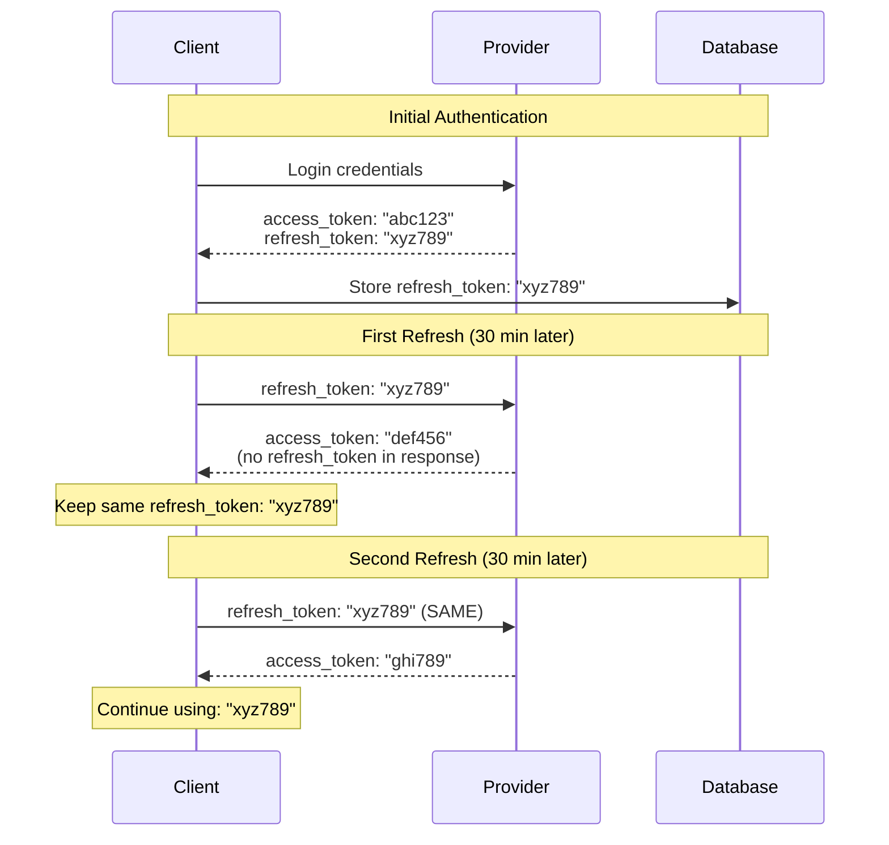
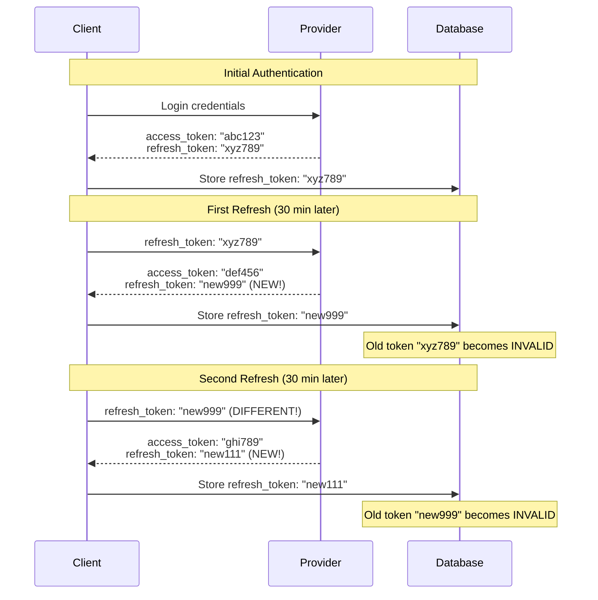
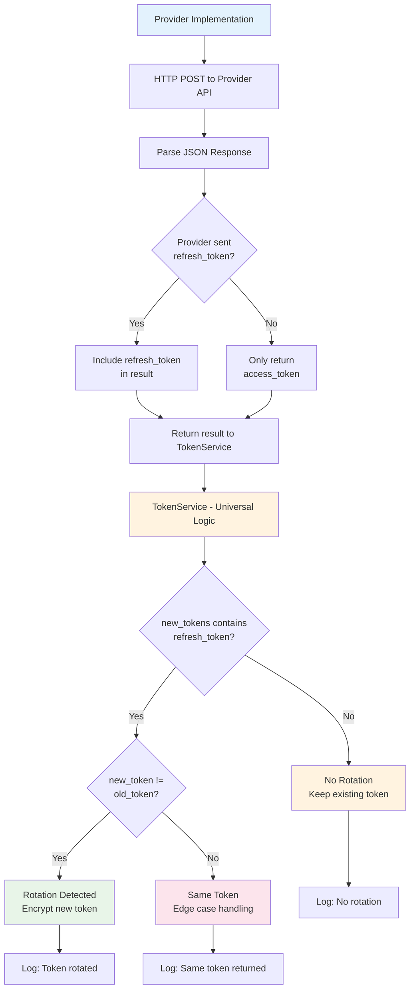

# OAuth Token Rotation Guide

A comprehensive guide for implementing OAuth token rotation correctly in Dashtam provider integrations, covering universal rotation detection, security benefits, and implementation patterns.

---

## Table of Contents

- [Overview](#overview)
- [Prerequisites](#prerequisites)
- [Step-by-Step Instructions](#step-by-step-instructions)
- [Examples](#examples)
- [Verification](#verification)
- [Troubleshooting](#troubleshooting)
- [Best Practices](#best-practices)
- [References](#references)

---

## Overview

This guide explains how to implement OAuth token rotation correctly in Dashtam provider integrations. You'll learn about Dashtam's universal rotation detection system, security benefits, and proper implementation patterns.

### What You'll Learn

- What token rotation is and why it matters for security
- How Dashtam's universal rotation detection system works
- How to implement `refresh_authentication()` correctly for any provider
- How to test token rotation scenarios comprehensively
- How to debug rotation issues using audit logs
- Provider-specific behaviors and edge cases

### When to Use This Guide

Use this guide when:

- Implementing a new OAuth provider in Dashtam
- Debugging token refresh issues
- Understanding why tokens become invalid unexpectedly
- Implementing secure token handling patterns
- Testing OAuth refresh flows

### Token Rotation Fundamentals

**Token Rotation** is a security mechanism where an OAuth provider issues a new refresh token each time you use the old one to get a new access token. The old refresh token is immediately invalidated.

**Two Strategies:**

1. **No Rotation** - Refresh token stays the same (most common)
2. **With Rotation** - New refresh token issued each time (more secure)

## Prerequisites

Before implementing token rotation, ensure you have:

- [ ] Understanding of OAuth 2.0 refresh token flow
- [ ] Access to provider's OAuth documentation
- [ ] Dashtam development environment set up
- [ ] Knowledge of async Python programming

**Required Tools:**

- httpx - For HTTP client operations
- pytest - For testing rotation scenarios
- Dashtam TokenService - For universal rotation handling
- Provider API access - For testing refresh flows

**Required Knowledge:**

- OAuth 2.0 authorization flows
- HTTP request/response handling
- Async/await patterns in Python
- Database transaction concepts

## Step-by-Step Instructions

### Step 1: Understand Token Rotation Types

Review the two token rotation strategies that providers may implement:

**Token Rotation Concepts:**

**Token Rotation** is a security mechanism where an OAuth provider issues a new refresh token each time you use the old one to get a new access token. The old refresh token is immediately invalidated.

### The Two Strategies

1. **No Rotation (Reusable Refresh Token)** - Most Common
   - The refresh token stays the same indefinitely
   - You use the same refresh token every time
   - The provider's response omits the `refresh_token` field
   - **Example:** Schwab (in most cases)

2. **With Rotation (One-Time Refresh Token)** - More Secure
   - Each refresh operation returns a NEW refresh token
   - The old refresh token becomes invalid immediately
   - The provider's response includes a NEW `refresh_token` field
   - **Example:** Some banking APIs, Plaid (optional)

### Visual Example

#### No Rotation Strategy (Most Common)



#### With Rotation Strategy (More Secure)



### Step 2: Understand Security Benefits

Learn why token rotation is important for OAuth security:

**Security Benefits of Token Rotation:**

### Security Benefits

1. **Limits Token Lifetime:** Even if a refresh token is stolen, it only works once
2. **Detects Theft:** If someone else uses the token, your next request fails
3. **Reduces Attack Window:** Stolen tokens have minimal value
4. **Prevents Replay Attacks:** Old tokens can't be reused

### Business Impact

- **No rotation:** Simpler implementation, but less secure
- **With rotation:** More secure, but requires careful handling to avoid breaking user sessions

### Step 3: Learn Dashtam's Universal System

Understand how Dashtam handles rotation automatically:

**Dashtam's Universal Rotation Detection:**

Dashtam uses a **universal rotation detection system** that works for ALL providers, regardless of whether they rotate tokens or not.

### Architecture



#### Key Implementation Points

1. **Provider Layer**: Only returns what the API actually sends
2. **Token Service**: Universal detection logic works for all providers
3. **Rotation Detection**: Automatic comparison of old vs new tokens
4. **Logging**: Full audit trail of rotation events
5. **Security**: New tokens encrypted before database storage

### Key Points

1. ✅ **Providers** only return what the API sends (no defaults)
2. ✅ **TokenService** automatically detects rotation
3. ✅ **Works universally** for all provider behaviors
4. ✅ **Audit logs** track rotation events
5. ✅ **No provider-specific rotation logic needed**

### Step 4: Implement refresh_authentication() Method

Implement the core method that handles token refresh:

**Implementation Pattern:**

### Step 1: Implement `refresh_authentication()` Method

When implementing a new provider, follow this pattern:

```python
async def refresh_authentication(self, refresh_token: str) -> Dict[str, Any]:
    """Refresh access token using refresh token.
    
    Args:
        refresh_token: Valid refresh token from provider.
        
    Returns:
        Dictionary with new tokens. Only include refresh_token if
        provider actually sends one (rotation).
    """
    async with httpx.AsyncClient(timeout=settings.get_http_timeout()) as client:
        response = await client.post(
            f"{self.base_url}/oauth/token",
            headers=self._get_auth_headers(),
            data={
                "grant_type": "refresh_token",
                "refresh_token": refresh_token
            }
        )
        
        if response.status_code != 200:
            raise Exception(f"Token refresh failed: {response.text}")
        
        tokens = response.json()
        
        # Build response dict - START WITH REQUIRED FIELDS
        result = {
            "access_token": tokens["access_token"],
            "expires_in": tokens.get("expires_in", 3600),
            "token_type": tokens.get("token_type", "Bearer"),
        }
        
        # ✅ CRITICAL: Only include refresh_token IF provider sent it
        if "refresh_token" in tokens:
            result["refresh_token"] = tokens["refresh_token"]
            logger.debug(f"{self.provider_name} sent new refresh token")
        else:
            logger.debug(f"{self.provider_name} did not send refresh token")
        
        return result
```

### Step 2: What NOT to Do

**❌ WRONG - Never default to old token:**

```python
# BAD - This breaks rotation detection!
return {
    "access_token": tokens["access_token"],
    "refresh_token": tokens.get("refresh_token", refresh_token),  # ❌ NO!
}
```

**Why is this wrong?**

- Makes it look like provider always returns same token
- TokenService can't detect rotation
- Breaks security if provider actually rotates

**✅ CORRECT - Only include if present:**

```python
# GOOD - Let TokenService detect rotation
result = {"access_token": tokens["access_token"]}
if "refresh_token" in tokens:
    result["refresh_token"] = tokens["refresh_token"]
return result
```

### Step 3: Optional Fields

You can include these optional fields if the provider sends them:

```python
result = {
    "access_token": tokens["access_token"],  # Required
    "expires_in": tokens.get("expires_in"),  # Optional
    "token_type": tokens.get("token_type"),  # Optional
    "id_token": tokens.get("id_token"),      # Optional (OIDC)
    "scope": tokens.get("scope"),            # Optional
}

# Only include refresh_token if provider sent it
if "refresh_token" in tokens:
    result["refresh_token"] = tokens["refresh_token"]

return result
```

### Step 5: Test Your Implementation

Write comprehensive tests for your token rotation implementation. See Examples section for complete test patterns.

## Examples

### Complete Provider Implementation

Here's a complete example of implementing token rotation correctly:

```python
class ExampleProvider(BaseProvider):
    """Example OAuth provider with proper token rotation handling."""
    
    async def refresh_authentication(self, refresh_token: str) -> Dict[str, Any]:
        """Refresh access token, handling rotation automatically."""
        async with httpx.AsyncClient(timeout=settings.get_http_timeout()) as client:
            response = await client.post(
                f"{self.base_url}/oauth/token",
                headers=self._get_auth_headers(),
                data={
                    "grant_type": "refresh_token",
                    "refresh_token": refresh_token
                }
            )
            
            if response.status_code != 200:
                raise Exception(f"Token refresh failed: {response.text}")
            
            tokens = response.json()
            
            # Build response - only include what provider sends
            result = {
                "access_token": tokens["access_token"],
                "expires_in": tokens.get("expires_in", 3600),
                "token_type": tokens.get("token_type", "Bearer"),
            }
            
            # ✅ CRITICAL: Only include if provider sent it
            if "refresh_token" in tokens:
                result["refresh_token"] = tokens["refresh_token"]
                logger.debug(f"{self.provider_name} sent new refresh token")
            else:
                logger.debug(f"{self.provider_name} did not send refresh token")
            
            return result
```

### Testing Token Rotation

Comprehensive test suite for token rotation scenarios:

### Test Scenarios to Cover

When implementing a new provider, write tests for these scenarios:

1. **Provider rotates token** (sends new refresh_token)
2. **Provider doesn't rotate** (omits refresh_token key)
3. **Provider sends same token** (edge case)
4. **Multiple refreshes in sequence**
5. **Rotation persistence** (survives database commits)

### Example Test Structure

```python
@pytest.mark.asyncio
async def test_token_rotation_detected(db_session):
    """Test that rotation is detected when provider sends new token."""
    # Setup: Create provider with initial token
    provider = await create_test_provider(db_session)
    
    # Mock provider to return NEW refresh token
    mock_response = {
        "access_token": "new_access",
        "refresh_token": "new_refresh",  # Different from initial
        "expires_in": 3600
    }
    
    # Execute refresh
    token_service = TokenService(db_session)
    result = await token_service.refresh_token(provider.id, user.id)
    
    # Verify new refresh token was stored
    assert decrypt(result.refresh_token_encrypted) == "new_refresh"
    
    # Verify audit log shows rotation
    audit_log = await get_latest_audit_log(db_session)
    assert audit_log.details["token_rotated"] is True
    assert audit_log.details["rotation_type"] == "rotated"
```

See `tests/unit/services/test_token_rotation.py` for complete examples.

## Verification

How to verify your token rotation implementation is working correctly:

### Check 1: Audit Log Verification

```python
# Query audit logs for rotation events
from sqlmodel import select
from src.models.provider import ProviderAuditLog

result = await session.execute(
    select(ProviderAuditLog)
    .where(ProviderAuditLog.action == "token_refreshed")
    .order_by(ProviderAuditLog.created_at.desc())
)

for log in result.scalars():
    print(f"Rotated: {log.details['token_rotated']}")
    print(f"Type: {log.details['rotation_type']}")
```

**Expected Result:** Logs should show correct rotation detection based on provider behavior.

### Check 2: Token Refresh Flow

```bash
# Test token refresh through API
curl -X POST http://localhost:8000/api/v1/providers/{id}/refresh \
  -H "Authorization: Bearer access_token"
```

**Expected Result:** New access token returned, refresh token handling based on provider.

### Check 3: Multiple Refresh Sequence

Test multiple refreshes in sequence to ensure rotation persistence:

```python
# Test multiple refreshes
for i in range(3):
    result = await token_service.refresh_token(provider.id, user.id)
    print(f"Refresh {i+1}: {result.success}")
```

**Expected Result:** All refreshes succeed, rotation detected appropriately.

## Troubleshooting

### Issue 1: Provider Always Shows Rotation

**Symptoms:**

- Audit logs show rotation even when provider doesn't rotate
- Different refresh token returned each time

**Cause:** Provider implementation defaults to input token

**Solution:**

```python
# ❌ WRONG - Remove default fallback
"refresh_token": tokens.get("refresh_token", refresh_token)

# ✅ CORRECT - Only include if present
if "refresh_token" in tokens:
    result["refresh_token"] = tokens["refresh_token"]
```

### Issue 2: Provider Never Shows Rotation

**Symptoms:**

- Audit logs never show rotation
- Provider documentation says tokens rotate

**Cause:** Response parsing doesn't detect new tokens

**Solution:**

- Verify API actually sends `refresh_token` field
- Check HTTP response parsing logic
- Test with provider's sandbox environment

### Issue 3: Tokens Become Invalid After Rotation

**Symptoms:**

- Rotation detected but subsequent requests fail
- "Invalid refresh token" errors

**Cause:** Database not committed or race conditions

**Solution:**

- Ensure database transaction commits after token storage
- Check for concurrent refresh attempts
- Verify token encryption/decryption process

## Best Practices

Follow these best practices for robust token rotation:

- ✅ **Only Include When Present:** Never default refresh_token to input value
- ✅ **Test All Scenarios:** Test rotation, no-rotation, and same-token cases
- ✅ **Use Universal Pattern:** Follow Dashtam's standard implementation
- ✅ **Log Events Not Tokens:** Log rotation events, never actual token values
- ✅ **Handle Edge Cases:** Account for same token returned edge case
- ✅ **Verify with Provider:** Check provider documentation for rotation policy
- ✅ **Test With Real API:** Use sandbox/test environments when possible
- ✅ **Monitor Audit Logs:** Use audit logs for rotation behavior verification

### Common Mistakes to Avoid

- ❌ **Defaulting to Input Token:** Breaks rotation detection
- ❌ **Assuming Provider Behavior:** Test actual provider responses
- ❌ **Incomplete Testing:** Test both rotation and no-rotation scenarios
- ❌ **Logging Tokens:** Never log actual token values in plain text
- ❌ **Ignoring Edge Cases:** Same token returned is valid but rare

### Security Considerations

- **Rotation Detection:** Essential for security audit compliance
- **Token Lifetime:** Rotation reduces stolen token lifetime
- **Attack Detection:** Failed rotation can indicate token theft
- **Audit Trail:** All rotation events must be logged for security reviews

### Implementation Checklist

When implementing a new provider:

- [ ] Read provider's OAuth documentation thoroughly
- [ ] Implement `refresh_authentication()` following standard pattern
- [ ] Only include `refresh_token` if provider sends it
- [ ] Never default to input refresh_token value
- [ ] Write tests for rotation scenarios
- [ ] Write tests for no-rotation scenarios
- [ ] Test edge case of same token returned
- [ ] Document provider's observed rotation behavior
- [ ] Verify audit logs capture rotation events correctly
- [ ] Test with real API when possible

## References

- [OAuth 2.0 RFC 6749 - Token Refresh](https://tools.ietf.org/html/rfc6749#section-6) - Official OAuth specification
- [OAuth 2.0 Security Best Practices](https://tools.ietf.org/html/draft-ietf-oauth-security-topics) - Security guidelines
- [JWT Authentication Architecture](../architecture/jwt-authentication.md) - Dashtam's auth architecture
- [Provider Implementation Guide](../guides/provider-implementation.md) - General provider patterns

**Dashtam Code References:**

- `src/services/token_service.py` - Universal rotation logic implementation
- `src/providers/base.py` - Abstract method documentation and interface
- `src/providers/schwab.py` - Reference implementation example
- `tests/unit/services/test_token_rotation.py` - Comprehensive test examples

---

## Document Information

**Category:** Guide
**Created:** 2025-10-04
**Last Updated:** 2025-10-15
**Difficulty Level:** Advanced
**Estimated Time:** 60-90 minutes
