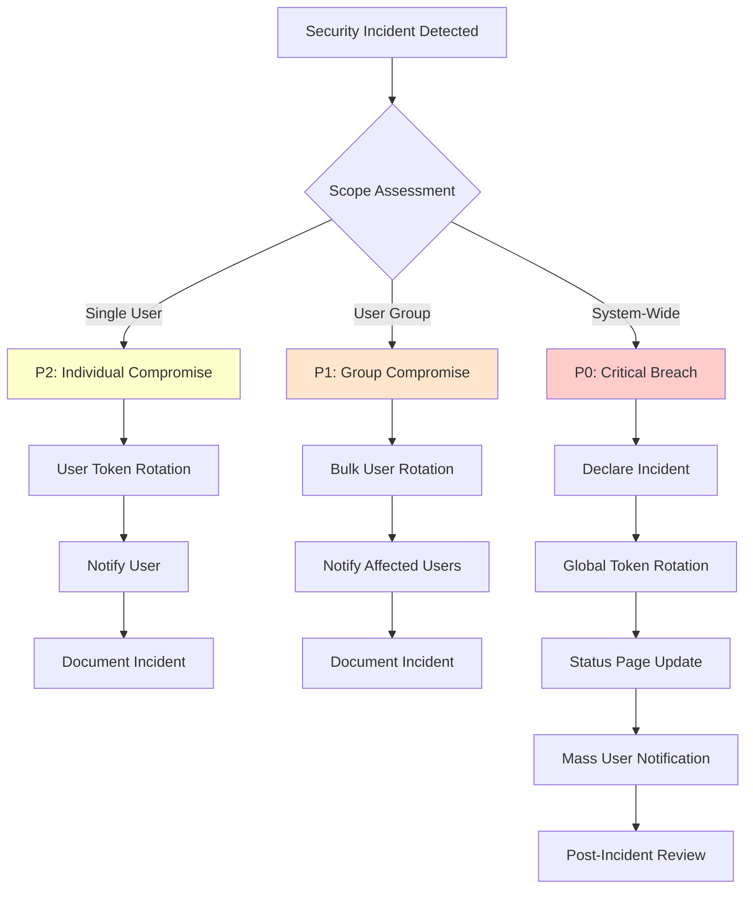

# Security Incident Runbook: Token Breach Rotation

Operational procedures for responding to security incidents using the token rotation system.

---

## Overview

This runbook provides step-by-step operational procedures for security incident response using the Dashtam Token Breach Rotation system. It covers three levels of incidents: individual user compromises, targeted user group compromises, and system-wide security breaches.

### Key Features

- Incident classification and severity levels
- Step-by-step response procedures
- Communication templates
- Post-incident analysis guidelines
- Compliance documentation requirements

## Purpose

This runbook enables operations and security teams to:

- Respond quickly and decisively to token compromise incidents
- Follow consistent procedures across different incident types
- Maintain comprehensive audit trails for compliance
- Minimize user impact while ensuring security
- Document all actions for post-incident review

## Components

### Component 1: Token Rotation API

**Purpose**: Core API for token rotation operations

**Technology**: FastAPI REST endpoints

**Dependencies**:

- JWT authentication system
- PostgreSQL database
- TokenRotationService

### Component 2: Security Incident Response Team

**Purpose**: Human responders following this runbook

**Roles**:

- Security Engineer (primary responder)
- DevOps Engineer (system access)
- Product Manager (user communication)
- Legal/Compliance (regulatory requirements)

### Component 3: Monitoring & Alerting

**Purpose**: Detect security incidents requiring token rotation

**Technology**: Application logs, metrics, alerting system

**Dependencies**:

- Structured logging
- Log aggregation (e.g., Splunk, ELK)
- Alert management (e.g., PagerDuty)

## Configuration

### Environment Variables

```bash
# API Base URL (environment-specific)
BASE_URL=https://api.dashtam.com  # Production
BASE_URL=https://dev-api.dashtam.com  # Development

# Authentication
# (No special configuration required, uses standard JWT auth)
```

### API Endpoints

| Endpoint | Method | Purpose |
|----------|--------|---------|
| `/api/v1/token-rotation/users/{id}` | POST | Rotate specific user's tokens |
| `/api/v1/token-rotation/global` | POST | Rotate ALL tokens (emergency) |
| `/api/v1/token-rotation/security-config` | GET | View global security state |

### Required Permissions

- **User Rotation**: Any authenticated user can rotate own tokens, admin can rotate any user
- **Global Rotation**: Currently any authenticated user (⚠️ **TODO**: Restrict to admins in production)
- **Security Config**: Any authenticated user can view

## Setup Instructions

### Prerequisites

- [ ] Admin access to Dashtam production environment
- [ ] Admin credentials for API authentication
- [ ] Access to incident management system (PagerDuty, etc.)
- [ ] Access to user communication channels (email, status page)
- [ ] Copy of this runbook available offline

### Pre-Incident Preparation

#### Step 1: Verify Admin Access

```bash
# Test admin login
curl -k -X POST https://api.dashtam.com/api/v1/auth/login \
  -H "Content-Type: application/json" \
  -d '{
    "email": "admin@example.com",
    "password": "REDACTED"
  }'

# Save access token
export ADMIN_TOKEN="eyJ..."
```

**Verification**:

```bash
# Test token works
curl -k https://api.dashtam.com/api/v1/token-rotation/security-config \
  -H "Authorization: Bearer $ADMIN_TOKEN"
```

**Expected Output**:

```json
{
  "global_min_token_version": 1,
  "last_updated_at": "2025-10-30T12:00:00Z",
  "last_updated_by": null,
  "last_rotation_reason": null
}
```

#### Step 2: Set Up Communication Channels

- [ ] Verify status page credentials
- [ ] Test incident notification system
- [ ] Prepare email templates (see Communication section)
- [ ] Identify stakeholder notification list

#### Step 3: Review Incident Classification

Familiarize yourself with severity levels:

- **P0 (Critical)**: System-wide breach → Global rotation
- **P1 (High)**: User group compromise → Bulk user rotation
- **P2 (Medium)**: Individual user compromise → Single user rotation
- **P3 (Low)**: Suspicious activity → Investigation only

## Operation

### Incident Response Decision Tree



### P0: Critical System-Wide Breach

**Use Cases:**

- Encryption key compromise
- Database breach (token table exposed)
- Critical security vulnerability discovered
- Third-party breach affecting all users

#### Step 1: Declare Critical Incident

```bash
# Notify incident response team
# - Page on-call security engineer
# - Notify executive team
# - Activate incident response bridge
# - Update status page to "Major Outage"

# Example: PagerDuty API
curl -X POST https://api.pagerduty.com/incidents \
  -H "Authorization: Token token=$PD_TOKEN" \
  -d '{
    "incident": {
      "type": "incident",
      "title": "CRITICAL: Token Breach - Global Rotation Required",
      "urgency": "high",
      "incident_key": "token-breach-$(date +%s)"
    }
  }'
```

#### Step 2: Execute Global Token Rotation

```bash
# Set environment
export BASE_URL="https://api.dashtam.com"
export ADMIN_TOKEN="eyJ..."  # From pre-incident setup

# Execute global rotation
# IMPORTANT: Review grace period carefully
# - 0 minutes: Immediate logout (extreme breach)
# - 15 minutes: Standard grace period (recommended)
# - 30 minutes: Extended grace (minimize disruption)

curl -k -X POST $BASE_URL/api/v1/token-rotation/global \
  -H "Authorization: Bearer $ADMIN_TOKEN" \
  -H "Content-Type: application/json" \
  -d '{
    "reason": "CRITICAL SECURITY INCIDENT: [Brief description]. Ticket: INC-12345. Authorized by: [Name]. All users will be logged out after grace period.",
    "grace_period_minutes": 15
  }'
```

**Expected Response**:

```json
{
  "rotation_type": "GLOBAL",
  "old_version": 1,
  "new_version": 2,
  "tokens_revoked": 1247,
  "users_affected": 423,
  "reason": "CRITICAL SECURITY INCIDENT: ...",
  "initiated_by": "USER:admin@example.com",
  "grace_period_minutes": 15,
  "rotated_at": "2025-10-30T14:30:00Z"
}
```

**Capture Response Metrics**:

```bash
# Save response for incident report
echo "$RESPONSE" > incident_$(date +%Y%m%d_%H%M%S)_global_rotation.json

# Key metrics:
# - tokens_revoked: How many sessions invalidated
# - users_affected: How many users must re-login
# - grace_period_minutes: How long until full revocation
```

#### Step 3: Update Status Page

```markdown
🔴 **CRITICAL INCIDENT IN PROGRESS**

**What happened**: We detected a critical security incident requiring immediate action.

**Impact**: All users will be logged out in 15 minutes. You will need to log in again.

**What we're doing**: Our security team has initiated an emergency security rotation to protect your account.

**Timeline**:
- 14:30 UTC: Incident detected
- 14:45 UTC: All sessions will be terminated
- 15:00 UTC: System fully secure, normal operations resume

**What you should do**:
1. Save any in-progress work
2. You will be automatically logged out at 14:45 UTC
3. Log back in after 14:45 UTC

We apologize for the disruption and will provide a full incident report within 24 hours.

For questions, contact: security@dashtam.com
```

#### Step 4: Mass User Notification

**Email Template**:

```text
Subject: URGENT: Security Action Required - You Will Be Logged Out

Dear Dashtam User,

We detected a critical security incident and have taken immediate action to protect your account.

WHAT'S HAPPENING:
All user sessions will be terminated at 14:45 UTC (in 15 minutes). This is a precautionary security measure.

WHAT YOU NEED TO DO:
1. Save any work in progress
2. You will be automatically logged out at 14:45 UTC
3. Log back in after 14:45 UTC using your existing credentials

YOUR DATA IS SAFE:
- Your financial data is encrypted and secure
- Your password has not been compromised
- This is a proactive security measure
- No action needed except re-login

We apologize for the disruption. Your account security is our top priority.

For questions: security@dashtam.com
Incident ID: INC-12345

- Dashtam Security Team
```

#### Step 5: Monitor System Health

```bash
# Monitor key metrics during grace period
while true; do
  echo "=== $(date) ==="
  
  # Check active sessions
  curl -k "$BASE_URL/api/v1/sessions/active" \
    -H "Authorization: Bearer $ADMIN_TOKEN" | jq '.total_active'
  
  # Check API health
  curl -k "$BASE_URL/api/v1/health" | jq '.status'
  
  # Check error rates (adjust monitoring URL)
  # curl monitoring_dashboard...
  
  sleep 60
done
```

### P1: User Group Compromise

**Use Cases:**

- Multiple users reported phishing attack
- Suspicious activity from specific IP range
- Compromised third-party integration
- Targeted attack on user segment

#### Step 1: Identify Affected Users

```bash
# Example: Get user IDs from investigation
cat compromised_users.txt
# abc123-...
# def456-...
# ghi789-...
```

#### Step 2: Rotate Affected User Tokens

```bash
# Authenticate as admin
export ADMIN_TOKEN="eyJ..."

# Rotate each user's tokens
while read user_id; do
  echo "Rotating tokens for user: $user_id"
  
  curl -k -X POST "$BASE_URL/api/v1/token-rotation/users/$user_id" \
    -H "Authorization: Bearer $ADMIN_TOKEN" \
    -H "Content-Type: application/json" \
    -d '{
      "reason": "User group compromise detected. Ticket: INC-12346. Phishing campaign targeting financial sector."
    }' | jq '.'
  
  sleep 1  # Rate limit friendly
done < compromised_users.txt
```

#### Step 3: Notify Affected Users

**Email Template**:

```text
Subject: Important: Your Dashtam Session Has Been Terminated for Security

Dear [User Name],

We detected suspicious activity that may have affected your account. As a precaution, we have logged you out of all devices.

WHAT HAPPENED:
We identified a potential security incident affecting a small group of users.

WHAT WE DID:
- Immediately terminated all your active sessions
- Your account is now secure
- No unauthorized access detected for your account

WHAT YOU NEED TO DO:
1. Log back into Dashtam at your convenience
2. Review your recent account activity
3. If you see anything suspicious, contact us immediately

YOUR PASSWORD:
- Your password is still valid (no change needed)
- If you believe your password was compromised, change it immediately
- Use a strong, unique password

We take security seriously and apologize for any inconvenience.

Questions? security@dashtam.com
Incident ID: INC-12346

- Dashtam Security Team
```

### P2: Individual User Compromise

**Use Cases:**

- User reports stolen device
- Suspicious login from unusual location
- User requests "logout all devices"
- Password change (automatic trigger)

#### Step 1: Verify User Identity

```bash
# Confirm user identity before action
# - Verify support ticket authenticity
# - Confirm via secondary channel (phone, email)
# - Check user account status
```

#### Step 2: Rotate User's Tokens

```bash
# Get user ID from support ticket
USER_ID="abc123-def456-ghi789"

# Option 1: User self-service (recommended)
# User logs in and clicks "Logout all devices" in account settings
# This triggers token rotation automatically

# Option 2: Admin rotation (when user cannot access account)
curl -k -X POST "$BASE_URL/api/v1/token-rotation/users/$USER_ID" \
  -H "Authorization: Bearer $ADMIN_TOKEN" \
  -H "Content-Type: application/json" \
  -d '{
    "reason": "User reported device theft. Support ticket: SUP-98765. User requested logout from all devices."
  }'
```

**Expected Response**:

```json
{
  "rotation_type": "USER",
  "user_id": "abc123-def456-ghi789",
  "old_version": 1,
  "new_version": 2,
  "tokens_revoked": 3,
  "reason": "User reported device theft...",
  "rotated_at": "2025-10-30T16:00:00Z"
}
```

#### Step 3: Notify User

**Email Template**:

```text
Subject: Dashtam Security: All Your Sessions Have Been Terminated

Dear [User Name],

Per your request, we have logged you out of all devices.

WHAT WE DID:
- Terminated all active sessions (3 devices)
- Your account is now secure
- You can log back in at any time

WHAT YOU NEED TO DO:
1. Log back into Dashtam when ready
2. Your existing password still works (no change needed)
3. If you didn't request this, contact us immediately: security@dashtam.com

Support Ticket: SUP-98765

- Dashtam Security Team
```

## Monitoring

### Health Checks

```bash
# Check token rotation system health
curl -k "$BASE_URL/api/v1/health"

# Check current global security state
curl -k "$BASE_URL/api/v1/token-rotation/security-config" \
  -H "Authorization: Bearer $ADMIN_TOKEN"
```

### Metrics to Monitor

**Normal Operations**:

- User rotation frequency: ~1-5 per day (password changes, device changes)
- Global rotation frequency: 0 (should be extremely rare)
- Average tokens per user: 2-3 (phone, laptop, tablet)

**During Incident**:

- Active sessions count (should drop to zero during global rotation)
- Re-login rate (should spike after grace period expires)
- API error rate (monitor for issues during rotation)
- Database query performance (rotation queries should be fast)

### Logs

**Location**: Application logs (stdout/stderr in container)

**Viewing Logs**:

```bash
# Development
make dev-logs

# Production (adjust for your environment)
kubectl logs -f deployment/dashtam-api --tail=100
# OR
docker compose -f compose/docker-compose.prod.yml logs -f app
```

**Key Log Patterns**:

```text
# User rotation
INFO: USER token rotation: user_id=..., version 1 → 2, revoked 3 tokens, reason='...'

# Global rotation
CRITICAL: GLOBAL TOKEN ROTATION: version 1 → 2. Reason: .... Affected: 423 users, 1247 tokens. Grace period: 15 minutes.
```

## Troubleshooting

### Issue 1: Global Rotation Fails with 500 Error

**Symptoms**:

- API returns 500 Internal Server Error
- Response body: `{"detail": "security_config table is empty"}`

**Diagnosis**:

```bash
# Check security_config table
docker compose -f compose/docker-compose.prod.yml exec postgres \
  psql -U dashtam -d dashtam -c "SELECT * FROM security_config;"
```

**Solution**:

```bash
# Manually insert security_config row
docker compose -f compose/docker-compose.prod.yml exec postgres \
  psql -U dashtam -d dashtam -c "
    INSERT INTO security_config (id, global_min_token_version, updated_at, created_at, updated_at_model)
    VALUES (gen_random_uuid(), 1, NOW(), NOW(), NOW())
    ON CONFLICT DO NOTHING;
  "

# Verify
docker compose -f compose/docker-compose.prod.yml exec postgres \
  psql -U dashtam -d dashtam -c "SELECT * FROM security_config;"
```

### Issue 2: User Rotation Returns 403 Forbidden

**Symptoms**:

- API returns 403 Forbidden
- Response: `{"detail": "You can only rotate your own tokens"}`

**Diagnosis**:

Admin trying to rotate user's tokens without proper admin role (feature pending).

**Solution**:

```bash
# Workaround: Authenticate as target user
# 1. Reset user's password (admin operation)
# 2. Login as user
# 3. Trigger rotation as user
# 4. Reset password back

# OR wait for admin role implementation (P1 enhancement)
```

### Issue 3: Old Tokens Still Working After Rotation

**Symptoms**:

- User reports still logged in after rotation
- Token validation not rejecting old tokens

**Diagnosis**:

```bash
# Check token version vs user minimum version
docker compose -f compose/docker-compose.prod.yml exec postgres \
  psql -U dashtam -d dashtam -c "
    SELECT 
      u.id as user_id,
      u.min_token_version as user_min,
      rt.token_version as token_ver,
      rt.is_revoked,
      rt.revoked_at
    FROM users u
    JOIN refresh_tokens rt ON u.id = rt.user_id
    WHERE u.id = 'USER_ID_HERE';
  "
```

**Solution**:

Verify AuthService includes version validation:

```bash
# Check logs for version validation
grep "Token failed.*version check" logs.txt

# If missing, AuthService needs version validation method
# See: docs/development/implementation/token-rotation-implementation.md
```

## Maintenance

### Regular Tasks

- **Daily**: Review token rotation logs for anomalies
- **Weekly**: Verify admin credentials still work (test login)
- **Monthly**: Run security incident drill (test this runbook)
- **Quarterly**: Review and update incident communication templates

### Backup Procedures

```bash
# Backup security_config state before global rotation
docker compose -f compose/docker-compose.prod.yml exec postgres \
  pg_dump -U dashtam -d dashtam -t security_config > security_config_backup_$(date +%Y%m%d).sql

# Backup user versions (optional, for audit)
docker compose -f compose/docker-compose.prod.yml exec postgres \
  psql -U dashtam -d dashtam -c "
    COPY (SELECT id, email, min_token_version FROM users)
    TO '/tmp/user_versions_$(date +%Y%m%d).csv' CSV HEADER;
  "
```

### Post-Incident Review Checklist

- [ ] Incident timeline documented
- [ ] Root cause identified
- [ ] User impact quantified (users affected, duration)
- [ ] Response time metrics captured
- [ ] Communication effectiveness assessed
- [ ] Lessons learned documented
- [ ] Runbook updated with improvements
- [ ] Stakeholder notification completed
- [ ] Compliance reporting filed (if required)

## Security

### Security Considerations

- **Access Control**: Restrict admin credentials to authorized personnel only
- **Audit Trail**: All rotation events logged with full context (who, when, why)
- **Communication Security**: Use secure channels for incident notifications
- **Grace Period**: Balance security vs user experience (15 min default recommended)
- **Rate Limiting**: Implement rate limits on rotation API (future enhancement)

### Access Control

**Admin Credentials**:

- Store in secure password manager (1Password, LastPass, etc.)
- Rotate admin passwords quarterly
- Use MFA for admin accounts (future enhancement)
- Log all admin actions

**API Tokens**:

- Never commit tokens to version control
- Use environment variables in runbooks
- Rotate tokens after incidents
- Implement token expiration (existing JWT TTL)

### Network Security

**Production Environment**:

- API only accessible via HTTPS (TLS 1.3)
- Rate limiting on rotation endpoints (future enhancement)
- IP allowlist for admin operations (optional, high-security environments)

## Performance Optimization

### Performance Tuning

**Global Rotation Optimization**:

- **Batch Size**: Single UPDATE query for all tokens (optimized)
- **Grace Period**: Reduces thundering herd (users don't all re-login simultaneously)
- **Indexes**: Version validation uses covering indexes (no table scan)

**Expected Performance**:

| Operation | Expected Duration | Notes |
|-----------|------------------|-------|
| User Rotation | 2-5ms | Single user, 1-5 tokens |
| Global Rotation | 100-500ms | 10k tokens, single UPDATE |
| Version Validation | <1ms | Index lookup |

### Resource Limits

**Database Connection Pool**:

```yaml
# Production configuration
database:
  pool_size: 20
  max_overflow: 10
  pool_timeout: 30
```

**API Rate Limits** (future):

```text
- User rotation: 5 requests/minute per user
- Global rotation: 1 request/hour (admin only)
- Security config: 100 requests/minute
```

## References

- [Token Breach Rotation Architecture](../architecture/token-breach-rotation.md) - Technical architecture details
- [Token Rotation Implementation Guide](../implementation/token-rotation-implementation.md) - Development guide
- [JWT Authentication Architecture](../architecture/jwt-authentication.md) - Auth system overview
- [Incident Response Plan](https://example.com/irp) - Company-wide incident response procedures
- [PagerDuty Runbooks](https://example.com/pd) - Incident management platform
- [NIST Incident Handling Guide](https://nvlpubs.nist.gov/nistpubs/SpecialPublications/NIST.SP.800-61r2.pdf) - Industry best practices

---

## Document Information

**Template:** [infrastructure-template.md](../../templates/infrastructure-template.md)
**Created:** 2025-10-30
**Last Updated:** 2025-10-30
