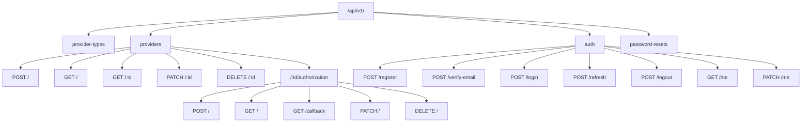

# Architectural Audit Report (API Layer)

Brief introduction

This document audits the current API architecture with focus on routers, services, dependency injection, versioning, SOLID compliance, and testing structure. It concludes with recommendations and a backward-compatible migration plan.

## Executive Summary

- Overall architecture is strong: resource-oriented routers, v1 aggregator, clear schemas, async DB patterns, and DI for auth/session.
- Services are well-factored (AuthService, TokenService, Email/Password/JWT), but AuthService is broad; consider narrowing responsibilities.
- DI is consistent for session and user; introduce service factory dependencies for uniformity and testability.
- Versioning is clean (api/v1 + settings prefix); ready for v2 evolution without breaking changes.
- SOLID: Largely compliant; minor adjustments recommended for SRP/DIP.
- Testing: Good pyramid and structure; ensure mirrors per-router coverage and add a few targeted API tests.

## Scope

- Router organization and boundaries
- Service layer patterns and responsibilities
- Dependency injection patterns (app, routers, services)
- API versioning approach and directory structure
- SOLID principles across API layer
- Testing structure alignment and coverage focus

## Current State Analysis

### Router Organization

- v1 aggregation in `src/api/v1/__init__.py` with clear prefixes and tags.
- Resource-first URLs and methods (providers, provider-types, auth, password-resets) with standard codes.
- Provider authorization modeled as sub-resource under providers: `/{provider_id}/authorization` (initiate, status, callback, refresh, revoke).
- Schemas live in `src/schemas/*` (no inline Pydantic in routers), matching REST compliance rules.
- Healthy separation of concerns: routers delegate to services; DB session via dependency.

Mermaid overview of primary routes:

Observations

- Uses `status` codes consistently (201, 204, 400, 401, 403, 404, 409, 500).
- Pagination/sorting in providers list endpoint; validates allowed sort fields.
- Minimal logic in routers (good); services handle business rules.

Light opportunities

- Centralize per-router imports (avoid local re-imports of `select`/`selectinload`).
- Standardize tags (e.g., `authentication` vs `auth`)—naming is already consistent in v1 aggregator; keep using it.

### Service Layer Patterns

- Clear services: `AuthService`, `TokenService`, `PasswordService`, `JWTService`, `EmailService`, `Encryption`.
- AuthService orchestrates registration, verification, login, refresh (access), logout, password flows.
- TokenService encapsulates provider OAuth token lifecycle (encryption, refresh, audit, rotation handling).

Observations

- AuthService breadth is high but cohesive; consider extracting password-reset/verification to sub-services only if churn grows.
- Provider token rotation handled with explicit scenarios in TokenService; good audit logging.

Light opportunities

- Add small service factories as dependencies (e.g., `get_auth_service(session)`) for consistent DI and test overrides.
- Keep AuthService focused; if future growth adds complexity, split into smaller orchestration services.

### Dependency Injection

- Uses FastAPI Depends for DB session and current user.
- No global state; JWT and password services instantiated inside services (fine, stateless/sync).

Observations

- Routers instantiate services directly (e.g., `AuthService(session)`), which is fine but makes test-time swapping slightly noisier.

Recommendation

- Introduce DI providers:
  - `def get_auth_service(session=Depends(get_session)) -> AuthService: return AuthService(session)`
  - `def get_token_service(session=Depends(get_session)) -> TokenService: return TokenService(session)`
- Benefits: Clear seams for testing/mocking, uniform injection pattern, easier future cross-cutting concerns.

### API Versioning

- Clean v1 directory and `settings.API_V1_PREFIX` mounting.
- Routers grouped by domain; `provider_authorization` as sub-resource is appropriate.

Recommendation

- Maintain per-version router modules; when introducing v2, copy routers into `api/v2/*` with explicit deprecation docs.

### SOLID Compliance

- SRP: Mostly good; AuthService is broad but cohesive by “auth workflows.” TokenService cleanly encapsulates provider token lifecycle.
- OCP: Providers use `ProviderRegistry` to create impls; easy to extend.
- LSP/ISP: Service interfaces are simple; no inheritance complexity in API layer.
- DIP: Services depend on abstractions indirectly (encryption via factory); DI providers would improve DIP further.

### Testing Structure

- Good layered tests: unit, integration, api, smoke; co-located tests exist for `rate_limiter`.
- API v1 endpoints appear covered; smoke tests exercise full auth journey.

Opportunities

- Ensure per-router API tests mirror router structure (providers, provider-authorization, auth, password-resets) with edge cases:
  - Providers pagination/sorting constraints
  - Authorization callback error paths (state mismatch, missing code)
  - Refresh edge cases (no refresh token present)

## Industry Best Practices Comparison

- RESTful routers with resource nouns, standard methods/codes: aligned.
- Separation of schemas from routers: aligned.
- DI for per-request session/user, service orchestration in services: aligned.
- Versioned API with v1 prefix and modular routers: aligned.
- Token handling: JWT access + opaque refresh (hashed) with rotation detection: aligned with major providers.

Gaps vs. best practice (minor)

- Service DI providers not standardized (easy improvement).
- AuthService breadth could be trimmed if feature surface expands.
- Router-local imports used in a few handlers (style consistency).

## Recommended Refactoring Plan (Backward-Compatible)

Priority 1 (safe, no API changes)

- Add DI provider functions: `get_auth_service`, `get_token_service` in a new `src/api/services.py` module (or `api/dependencies.py`).
- Update routers to inject services via Depends.
- Normalize imports at module top; remove local re-imports inside endpoints.

Priority 2 (organizational, optional)

- If AuthService grows further, create `VerificationService` and `PasswordResetService`; keep AuthService as orchestrator/wrapper.
- Add per-domain API tests for uncovered edge cases (providers sorting/filters, authorization error paths).

Priority 3 (documentation/observability)

- Add a short architecture note in `docs/development/architecture/restful-api-design.md` referencing provider authorization as sub-resource.
- Expand audit logging context (consistent request metadata extraction via dependency helper) if needed.

## Migration Strategy (Zero Downtime, Backward-Compatible)

- Phase A: Introduce DI providers without changing signatures; keep constructors in services unchanged.
  - Add providers to `api/dependencies.py` (or `api/services.py`).
  - Update routers to use `Depends(get_auth_service)` and `Depends(get_token_service)`.
- Phase B: Refactor imports to module level; run `make lint` and tests.
- Phase C (optional): Extract sub-services; AuthService retains public methods delegating internally to preserve callers.
- No URL or response changes; API remains stable. Add a short CHANGELOG note.

Rollback/Compatibility

- Changes are additive and internal; revert by reinstating direct instantiations in routers.

## Risks and Mitigations

- Risk: Over-abstraction of services.
  - Mitigation: Keep DI providers thin; avoid introducing new interfaces unless needed.
- Risk: Test fragility during DI switch.
  - Mitigation: Update fixtures to inject services via providers; add minimal smoke to confirm behavior.

## Action Items Checklist

- [ ] Create DI providers for AuthService and TokenService
- [ ] Update routers to use DI providers
- [ ] Normalize router imports (module-level)
- [ ] Add/verify API tests for providers list sorting and auth callback error paths
- [ ] Update docs (reference sub-resource pattern)

## Appendix

- Source references
  - Routers: `src/api/v1/*`
  - Dependencies: `src/api/dependencies.py`
  - Services: `src/services/*`
  - Version mount: `src/main.py`
- Standards
  - REST compliance guide and router independence
  - JWT + opaque refresh token model
