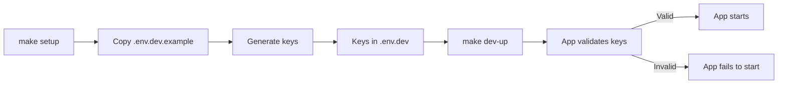
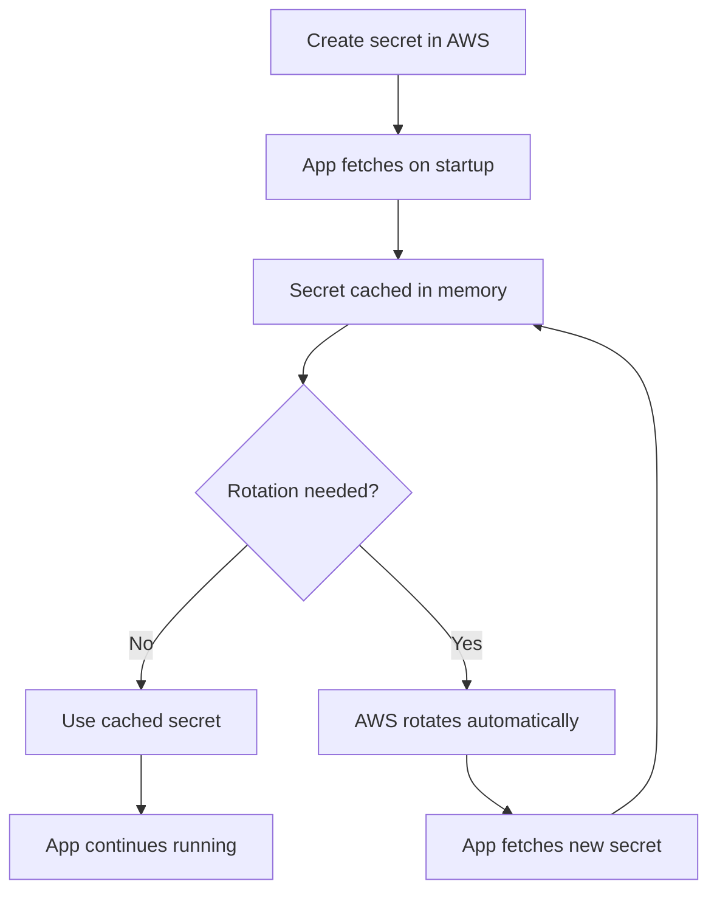

# Key Management Guide

## Overview

This guide covers cryptographic key management for Dashtam across all environments (development, testing, production). Proper key management is critical for security - keys protect JWT tokens, encrypt sensitive data, and secure user passwords.

**Key Types**:

- **SECRET_KEY**: JWT token signing (HMAC-SHA256, ≥32 characters)
- **ENCRYPTION_KEY**: Provider credentials encryption (AES-256-GCM, exactly 32 characters)

**Key Security Principles**:

- ✅ **Never commit keys to version control**
- ✅ **Use different keys for each environment**
- ✅ **Rotate keys regularly (quarterly minimum)**
- ✅ **Store production keys in AWS Secrets Manager**
- ✅ **Generate keys cryptographically (not manually)**

---

## 1. Key Types Explained

### 1.1 SECRET_KEY (JWT Signing)

**Purpose**: Signs JWT access tokens to prevent tampering.

**Algorithm**: HMAC-SHA256

**Requirements**:

- **Minimum length**: 32 characters (256 bits)
- **Recommended length**: 64 characters (512 bits)
- **Character set**: URL-safe base64 (A-Z, a-z, 0-9, -, _)

**What it protects**:

- JWT access tokens (prevents token forgery)
- JWT claims (user_id, role, session_id, token_version)

**Example**:

```bash
# Good (64 characters)
SECRET_KEY=dG9rZW4tc2lnbmluZy1rZXktZm9yLWRhc2h0YW0tcHJvZHVjdGlvbi1lbnZpcm9ubWVudC1oaWdobHktc2VjcmV0

# Bad (too short)
SECRET_KEY=mysecret  # Only 8 characters - INSECURE
```

**Validation**:

```python
# src/core/config.py
@field_validator("secret_key")
def validate_secret_key(cls, v: str) -> str:
    if len(v) < 32:
        raise ValueError("secret_key must be at least 32 characters")
    return v
```

**Security Impact if Compromised**:

- ⚠️ **HIGH RISK**: Attacker can forge valid JWT tokens
- ⚠️ Attacker can impersonate any user
- ⚠️ Attacker can escalate privileges (change role claim)
- ⚠️ All active sessions must be revoked
- ⚠️ Requires immediate key rotation + user re-authentication

---

### 1.2 ENCRYPTION_KEY (Data Encryption)

**Purpose**: Encrypts provider OAuth credentials before storing in database.

**Algorithm**: AES-256-GCM (authenticated encryption)

**Requirements**:

- **Exact length**: 32 characters (256 bits) - NO MORE, NO LESS
- **Character set**: Any printable ASCII (but URL-safe base64 recommended)

**What it protects**:

- Provider OAuth access tokens (Schwab, Chase)
- Provider OAuth refresh tokens
- Any encrypted ProviderCredentials value objects

**Example**:

```bash
# Good (exactly 32 characters)
ENCRYPTION_KEY=AES-256-key-for-provider-cred!

# Bad (wrong length)
ENCRYPTION_KEY=short           # 5 characters - REJECTED
ENCRYPTION_KEY=this-is-way-too-long-for-aes-256  # 42 characters - REJECTED
```

**Validation**:

```python
# src/core/config.py
@field_validator("encryption_key")
def validate_encryption_key(cls, v: str) -> str:
    if len(v) != 32:
        raise ValueError("encryption_key must be exactly 32 characters")
    return v
```

**Security Impact if Compromised**:

- ⚠️ **CRITICAL RISK**: Attacker can decrypt all provider credentials
- ⚠️ Attacker gains access to users' financial accounts
- ⚠️ Requires immediate key rotation + credential re-encryption
- ⚠️ Users must reconnect all provider accounts

---

### 1.3 SECRET_KEY vs ENCRYPTION_KEY Comparison

| Aspect | SECRET_KEY | ENCRYPTION_KEY |
|--------|------------|----------------|
| **Purpose** | Sign JWT tokens | Encrypt provider credentials |
| **Algorithm** | HMAC-SHA256 | AES-256-GCM |
| **Length** | ≥32 characters (64 recommended) | Exactly 32 characters |
| **Validation** | Minimum length check | Exact length check |
| **Used by** | `JWTService` | `EncryptionService` |
| **Protects** | User sessions, authentication | Financial account credentials |
| **Rotation impact** | All users re-authenticate | All provider connections re-encrypt |
| **Risk if leaked** | Session hijacking, privilege escalation | Full financial account access |

---

## 2. Environment-Specific Key Management

### 2.1 Development Environment

**Backend**: `.env` files (local filesystem)

**Key Generation**: `make keys-generate`

#### Setup Process

**1. First-time setup (automatic)**:

```bash
make setup
# Creates env/.env.dev from template
# Generates SECRET_KEY and ENCRYPTION_KEY automatically
```

**2. Manual key generation (if needed)**:

```bash
make keys-generate ENV=dev
# Generates keys only if placeholders exist
# Skips if keys already generated
```

**3. Force key regeneration (rare)**:

```bash
make keys-generate ENV=dev FORCE=1
# WARNING: Invalidates all sessions and encrypted data
# Only use during development or after security incident
```

#### Key Generation Algorithm

**Makefile implementation**:

```makefile
keys-generate:
    SECRET_KEY=$$(python3 -c 'import secrets; print(secrets.token_urlsafe(48))')
    ENCRYPTION_KEY=$$(python3 -c 'import secrets; print(secrets.token_urlsafe(24)[:32])')
```

**Explanation**:

- **SECRET_KEY**: 48 random bytes → base64 → 64 characters
- **ENCRYPTION_KEY**: 24 random bytes → base64 → truncate to 32 characters

**Why this approach**:

- `secrets.token_urlsafe()` uses cryptographically secure random number generator (CSPRNG)
- Generates URL-safe base64 (no special characters that break environment variables)
- Deterministic length (always 64 chars for SECRET_KEY, 32 for ENCRYPTION_KEY)

#### Validation

**Check generated keys**:

```bash
make keys-validate ENV=dev
# Output:
# ✅ SECRET_KEY: 64 chars (minimum 32)
# ✅ ENCRYPTION_KEY: 32 chars (exactly 32)
# ✅ All keys valid in env/.env.dev
```

#### Development Key Lifecycle



**Important Notes**:

- ✅ `.env.dev` is in `.gitignore` (never committed)
- ✅ Keys are unique per developer's machine
- ✅ Safe to regenerate anytime during development
- ✅ No backup needed (can regenerate)

---

### 2.2 Testing Environment

**Backend**: `.env` files with **fixed test keys**

**Purpose**: Deterministic tests (same keys every test run)

#### Fixed Test Keys

**Location**: `env/.env.test.example`

```bash
# INTENTIONALLY NOT CRYPTOGRAPHICALLY SECURE - FOR TESTING ONLY
SECRET_KEY=test-secret-key-for-automated-testing-only-never-use-in-production
ENCRYPTION_KEY=test-key-for-encryption-32-ch!@#
```

**Why fixed keys for testing?**

- ✅ **Deterministic**: Tests produce same results every run
- ✅ **Fast**: No key generation overhead
- ✅ **Simple**: No key management complexity in CI/CD
- ✅ **Isolated**: Test keys never used in other environments

**Security Notice**:

```text
⚠️  WARNING: These keys are publicly visible in version control
⚠️  NEVER use test keys in development or production
⚠️  Test keys are intentionally weak for speed (bcrypt_rounds=4)
```

#### Test Key Usage

**In test fixtures**:

```python
# tests/conftest.py
@pytest.fixture
def test_settings():
    """Fixture providing test settings."""
    return Settings(
        environment=Environment.TESTING,
        secret_key="test-secret-key-for-automated-testing-only-never-use-in-production",
        encryption_key="test-key-for-encryption-32-ch!@#",
        # ... other settings from .env.test
    )
```

**Why not use settings directly?**

- Unit tests should test config validation (need invalid keys)
- Integration tests use `.env.test` via container
- Config tests require hardcoded values to test validators

---

### 2.3 CI/CD Environment

**Backend**: GitHub Secrets

**Purpose**: Secure key storage for CI/CD pipelines

#### GitHub Secrets Configuration

**Required secrets** (set in repository settings):

```yaml
# .github/workflows/ci.yml
env:
  SECRET_KEY: ${{ secrets.CI_SECRET_KEY }}
  ENCRYPTION_KEY: ${{ secrets.CI_ENCRYPTION_KEY }}
```

**How to add secrets**:

1. Go to repository → Settings → Secrets and variables → Actions
2. Add secrets:
   - `CI_SECRET_KEY`: Generate with `python3 -c 'import secrets; print(secrets.token_urlsafe(48))'`
   - `CI_ENCRYPTION_KEY`: Generate with `python3 -c 'import secrets; print(secrets.token_urlsafe(24)[:32])'`

**CI key requirements**:

- ✅ Different from development keys
- ✅ Different from production keys
- ✅ Only used in GitHub Actions
- ✅ Rotated quarterly

**Security features**:

- ✅ Encrypted at rest by GitHub
- ✅ Never exposed in logs
- ✅ Access controlled by repository permissions
- ✅ Audit trail in GitHub settings

---

### 2.4 Production Environment

**Backend**: AWS Secrets Manager

**Purpose**: Auto-rotation, audit trails, encryption at rest/transit

#### AWS Secrets Manager Setup

**1. Create secrets (one-time)**:

```bash
# Create SECRET_KEY secret
aws secretsmanager create-secret \
    --name dashtam/production/secret_key \
    --description "JWT signing key for Dashtam production" \
    --secret-string "$(python3 -c 'import secrets; print(secrets.token_urlsafe(48))')" \
    --region us-east-1

# Create ENCRYPTION_KEY secret
aws secretsmanager create-secret \
    --name dashtam/production/encryption_key \
    --description "AES-256 encryption key for provider credentials" \
    --secret-string "$(python3 -c 'import secrets; print(secrets.token_urlsafe(24)[:32])')" \
    --region us-east-1
```

**2. Configure application**:

```bash
# env/.env.prod
SECRETS_BACKEND=aws
AWS_REGION=us-east-1
AWS_SECRET_NAME=dashtam/production
```

**3. Application loads secrets automatically**:

```python
# src/core/config.py
@classmethod
def from_secrets_manager(cls, secrets: SecretsProtocol) -> "Settings":
    """Load settings from AWS Secrets Manager.
    
    Example:
        secrets = get_secrets()  # Returns AWSAdapter
        settings = Settings.from_secrets_manager(secrets)
    """
    result = secrets.get_secret_json("dashtam/production")
    
    if isinstance(result, Failure):
        raise ValueError(f"Failed to load secrets: {result.error}")
    
    secret_data = result.value
    return cls(
        secret_key=secret_data["secret_key"],
        encryption_key=secret_data["encryption_key"],
        # ... other settings
    )
```

#### AWS Secrets Manager Benefits

| Feature | Benefit |
|---------|---------|
| **Encryption at rest** | AES-256 encryption (AWS KMS) |
| **Encryption in transit** | TLS 1.2+ |
| **Automatic rotation** | Configurable rotation schedule |
| **Audit trail** | CloudTrail logs every access |
| **Access control** | IAM policies (least privilege) |
| **Versioning** | Roll back to previous key versions |
| **Cost** | ~$0.40/secret/month + $0.05/10k API calls |

#### Production Key Lifecycle



---

## 3. Key Rotation Procedures

### 3.1 When to Rotate Keys

**Scheduled rotation** (proactive):

- ✅ **Every 90 days** (quarterly) - Best practice
- ✅ **Every 180 days** (semi-annually) - Minimum acceptable
- ✅ **Every 365 days** (annually) - Only for low-risk environments

**Immediate rotation** (reactive):

- ⚠️ **Key exposure**: Key accidentally committed to Git
- ⚠️ **Security incident**: Suspected breach or compromise
- ⚠️ **Employee departure**: Developer with key access leaves
- ⚠️ **Compliance requirement**: Regulatory audit or certification
- ⚠️ **Service migration**: Moving to new infrastructure

---

### 3.2 Development Key Rotation

**Impact**: Low (only affects local development)

**Procedure**:

```bash
# 1. Regenerate keys
make keys-generate ENV=dev FORCE=1

# 2. Restart services
make dev-down
make dev-up

# 3. Verify new keys
make keys-validate ENV=dev
```

**Post-rotation checklist**:

- [ ] All sessions invalidated (expected)
- [ ] Can login with new JWT tokens
- [ ] Can connect provider accounts (new encryption)

**Rollback** (if needed):

```bash
# Restore from backup
cp env/.env.dev.bak env/.env.dev
make dev-restart
```

---

### 3.3 Production Key Rotation (SECRET_KEY)

**Impact**: HIGH - All users must re-authenticate

**Preparation**:

1. **Schedule maintenance window** (low-traffic period)
2. **Notify users** (email 24 hours in advance)
3. **Backup current key** (manual export from AWS)
4. **Test rotation in staging** (validate procedure)

**Rotation Procedure**:

**Step 1: Create new secret version**:

```bash
aws secretsmanager update-secret \
    --secret-id dashtam/production/secret_key \
    --secret-string "$(python3 -c 'import secrets; print(secrets.token_urlsafe(48))')" \
    --region us-east-1
```

**Step 2: Clear application cache**:

```python
# POST /api/v1/admin/cache/clear
await cache.clear("secrets:*")  # Clear cached secrets
```

**Step 3: Restart application**:

```bash
# Kubernetes
kubectl rollout restart deployment dashtam-api

# ECS
aws ecs update-service \
    --cluster dashtam-production \
    --service dashtam-api \
    --force-new-deployment
```

**Step 4: Verify new key loaded**:

```bash
# Check logs for successful secret fetch
kubectl logs -l app=dashtam-api | grep "Loaded secrets from AWS"
```

**Step 5: Monitor for issues**:

```bash
# Watch error rates
aws cloudwatch get-metric-statistics \
    --namespace Dashtam/API \
    --metric-name ErrorCount \
    --start-time $(date -u -d '10 minutes ago' +%Y-%m-%dT%H:%M:%S) \
    --end-time $(date -u +%Y-%m-%dT%H:%M:%S) \
    --period 60 \
    --statistics Sum
```

**Post-rotation verification**:

- [ ] Users can login (new JWT tokens issued)
- [ ] Old JWT tokens rejected (401 Unauthorized)
- [ ] No increase in error rates
- [ ] Audit logs show successful authentication

**Rollback procedure** (if issues):

```bash
# Restore previous secret version
aws secretsmanager update-secret-version-stage \
    --secret-id dashtam/production/secret_key \
    --version-stage AWSCURRENT \
    --remove-from-version-id <new-version-id> \
    --move-to-version-id <old-version-id>

# Restart services
kubectl rollout restart deployment dashtam-api
```

---

### 3.4 Production Key Rotation (ENCRYPTION_KEY)

**Impact**: CRITICAL - All encrypted credentials must be re-encrypted

**Complexity**: HIGH - Requires database migration

**Preparation**:

1. **Schedule extended maintenance window** (2-4 hours)
2. **Notify users** (email 1 week in advance)
3. **Backup database** (full backup + WAL archiving)
4. **Test re-encryption script** (staging environment)

**Rotation Procedure**:

**Step 1: Create new encryption key**:

```bash
aws secretsmanager create-secret \
    --name dashtam/production/encryption_key_new \
    --secret-string "$(python3 -c 'import secrets; print(secrets.token_urlsafe(24)[:32])')" \
    --region us-east-1
```

**Step 2: Run re-encryption migration**:

```python
# scripts/rotate_encryption_key.py
"""Re-encrypt all provider credentials with new key.

WARNING: This is a destructive operation. Backup database first.
"""
import asyncio
from src.core.config import settings
from src.infrastructure.providers.encryption_service import EncryptionService
from src.infrastructure.persistence.repositories.provider_connection_repository import ProviderConnectionRepository

async def rotate_encryption_key():
    """Re-encrypt all provider credentials."""
    old_service = EncryptionService(key=settings.encryption_key)
    new_service = EncryptionService(key=NEW_ENCRYPTION_KEY)  # From AWS
    
    repo = ProviderConnectionRepository(session)
    connections = await repo.find_all_with_credentials()
    
    for conn in connections:
        # Decrypt with old key
        result = old_service.decrypt(conn.encrypted_credentials)
        if isinstance(result, Failure):
            print(f"Failed to decrypt connection {conn.id}: {result.error}")
            continue
        
        plaintext = result.value
        
        # Encrypt with new key
        result = new_service.encrypt(plaintext)
        if isinstance(result, Failure):
            print(f"Failed to encrypt connection {conn.id}: {result.error}")
            continue
        
        encrypted = result.value
        
        # Update database
        conn.encrypted_credentials = encrypted
        await repo.save(conn)
        print(f"Re-encrypted connection {conn.id}")

if __name__ == "__main__":
    asyncio.run(rotate_encryption_key())
```

**Step 3: Update secret in AWS**:

```bash
# Replace old key with new key
aws secretsmanager update-secret \
    --secret-id dashtam/production/encryption_key \
    --secret-string "$(aws secretsmanager get-secret-value --secret-id dashtam/production/encryption_key_new --query SecretString --output text)" \
    --region us-east-1

# Delete temporary new key secret
aws secretsmanager delete-secret \
    --secret-id dashtam/production/encryption_key_new \
    --force-delete-without-recovery
```

**Step 4: Restart application**:

```bash
kubectl rollout restart deployment dashtam-api
```

**Step 5: Verify re-encryption**:

```sql
-- Check all credentials encrypted with new key
SELECT 
    id,
    provider_id,
    LENGTH(encrypted_credentials) as ciphertext_length,
    created_at,
    updated_at
FROM provider_connections
WHERE encrypted_credentials IS NOT NULL;
```

**Post-rotation verification**:

- [ ] All provider connections decrypt successfully
- [ ] Users can sync account data
- [ ] No increase in provider API errors
- [ ] Database integrity check passes

**Rollback procedure** (if issues):

```bash
# 1. Restore database from backup
pg_restore -d dashtam_production backup.dump

# 2. Restore old encryption key in AWS
aws secretsmanager update-secret-version-stage \
    --secret-id dashtam/production/encryption_key \
    --version-stage AWSCURRENT \
    --remove-from-version-id <new-version-id> \
    --move-to-version-id <old-version-id>

# 3. Restart services
kubectl rollout restart deployment dashtam-api
```

---

## 4. Key Backup & Recovery

### 4.1 Development Keys

**Backup strategy**: No backup needed

**Rationale**:

- Keys are environment-specific (not shared)
- Can regenerate with `make keys-generate ENV=dev FORCE=1`
- Loss only affects local development (no production impact)

**Recovery**:

```bash
make keys-generate ENV=dev FORCE=1
make dev-restart
```

---

### 4.2 Production Keys

**Backup strategy**: Manual export + encrypted storage

#### Backup Procedure

**1. Export keys from AWS Secrets Manager**:

```bash
# Export SECRET_KEY
aws secretsmanager get-secret-value \
    --secret-id dashtam/production/secret_key \
    --query SecretString \
    --output text > secret_key.backup.txt

# Export ENCRYPTION_KEY
aws secretsmanager get-secret-value \
    --secret-id dashtam/production/encryption_key \
    --query SecretString \
    --output text > encryption_key.backup.txt
```

**2. Encrypt backup files**:

```bash
# Use GPG with strong passphrase
gpg --symmetric --cipher-algo AES256 secret_key.backup.txt
gpg --symmetric --cipher-algo AES256 encryption_key.backup.txt

# Result: secret_key.backup.txt.gpg, encryption_key.backup.txt.gpg
```

**3. Store encrypted backups securely**:

```bash
# Option 1: S3 bucket with encryption
aws s3 cp secret_key.backup.txt.gpg \
    s3://dashtam-backups/keys/$(date +%Y%m%d)/ \
    --server-side-encryption AES256

# Option 2: Offline storage
# - Burn to CD/DVD
# - Store in fireproof safe
# - Geographic separation (off-site)
```

**4. Delete plaintext files**:

```bash
# Secure deletion (3-pass overwrite)
shred -vfz -n 3 secret_key.backup.txt encryption_key.backup.txt
```

#### Recovery Procedure

**When to recover**:

- AWS Secrets Manager catastrophic failure (rare)
- Accidental secret deletion
- Disaster recovery scenario

**Recovery steps**:

```bash
# 1. Retrieve encrypted backup
aws s3 cp s3://dashtam-backups/keys/20250101/secret_key.backup.txt.gpg .

# 2. Decrypt backup
gpg --decrypt secret_key.backup.txt.gpg > secret_key.backup.txt

# 3. Restore to AWS Secrets Manager
aws secretsmanager update-secret \
    --secret-id dashtam/production/secret_key \
    --secret-string file://secret_key.backup.txt

# 4. Verify restoration
make keys-validate ENV=prod  # If applicable

# 5. Securely delete decrypted file
shred -vfz -n 3 secret_key.backup.txt
```

---

## 5. Security Best Practices

### 5.1 Key Generation

**DO ✅**:

- Use `make keys-generate` (CSPRNG via `secrets` module)
- Generate unique keys per environment
- Use URL-safe base64 encoding (no special characters)
- Meet minimum length requirements

**DON'T ❌**:

- Manually create keys (predictable patterns)
- Reuse keys across environments
- Use weak entropy sources (date, username, etc.)
- Copy production keys to development

---

### 5.2 Key Storage

**DO ✅**:

- Store in environment variables (12-Factor App)
- Use `.env` files for local development
- Use AWS Secrets Manager for production
- Keep `.env` files in `.gitignore`
- Encrypt backups with GPG (AES-256)

**DON'T ❌**:

- Commit keys to Git (even private repos)
- Store keys in config files (checked into version control)
- Share keys via email/Slack
- Store plaintext backups
- Hardcode keys in source code

---

### 5.3 Key Usage

**DO ✅**:

- Validate key length at application startup
- Use keys only for intended purpose (SECRET_KEY for JWT, ENCRYPTION_KEY for AES)
- Cache decrypted secrets in memory (not on disk)
- Clear secret cache after rotation

**DON'T ❌**:

- Log keys (even encrypted)
- Return keys in API responses
- Store keys in database
- Transmit keys over unencrypted channels
- Use test keys in production

---

### 5.4 Key Rotation

**DO ✅**:

- Rotate keys quarterly (90 days) minimum
- Rotate immediately after suspected compromise
- Test rotation in staging first
- Notify users of scheduled maintenance
- Keep audit trail of all rotations

**DON'T ❌**:

- Rotate during peak traffic
- Skip pre-rotation testing
- Forget to backup before rotation
- Rotate without user notification
- Lose access to old keys (needed for rollback)

---

## 6. Troubleshooting

### 6.1 Common Issues

#### Issue: "secret_key must be at least 32 characters"

**Cause**: SECRET_KEY in `.env` file is too short.

**Solution**:

```bash
# Regenerate keys
make keys-generate ENV=dev FORCE=1

# Verify length
make keys-validate ENV=dev
```

---

#### Issue: "encryption_key must be exactly 32 characters"

**Cause**: ENCRYPTION_KEY is not exactly 32 characters.

**Solution**:

```bash
# Option 1: Regenerate
make keys-generate ENV=dev FORCE=1

# Option 2: Manually truncate/pad
# If too long: take first 32 characters
# If too short: pad with random characters until 32
python3 -c "import secrets; print(secrets.token_urlsafe(24)[:32])"
```

---

#### Issue: "InvalidToken: Token signature verification failed"

**Cause**: SECRET_KEY changed, old JWT tokens no longer valid.

**Solution**: Expected behavior after key rotation. Users must:

1. Logout (if still logged in)
2. Login again (new JWT tokens issued)

**Prevention**: Notify users before rotating SECRET_KEY.

---

#### Issue: "DecryptionError: Authentication tag verification failed"

**Cause**: ENCRYPTION_KEY changed, cannot decrypt existing credentials.

**Solution**:

```bash
# Option 1: Restore old key (if backup exists)
# See "Key Backup & Recovery" section

# Option 2: Re-encrypt all credentials with new key
# See "Production Key Rotation (ENCRYPTION_KEY)" section

# Option 3: Users reconnect provider accounts (last resort)
# DELETE old provider connections, CREATE new ones
```

---

#### Issue: Keys not loading from AWS Secrets Manager

**Cause**: IAM permissions or network issues.

**Debug steps**:

```bash
# 1. Check IAM permissions
aws secretsmanager get-secret-value \
    --secret-id dashtam/production/secret_key

# 2. Check application logs
kubectl logs -l app=dashtam-api | grep -i "secret"

# 3. Verify SECRETS_BACKEND setting
echo $SECRETS_BACKEND  # Should be "aws"

# 4. Verify AWS region
echo $AWS_REGION  # Should match secret region
```

**Common fixes**:

- Attach `secretsmanager:GetSecretValue` policy to IAM role
- Enable VPC endpoint for Secrets Manager
- Check security group allows HTTPS (443) outbound

---

### 6.2 Validation Commands

**Check key lengths**:

```bash
# Development
make keys-validate ENV=dev

# Test
make keys-validate ENV=test

# CI (via GitHub Actions)
# Keys validated automatically on startup
```

**Manual validation**:

```bash
# Check SECRET_KEY length
grep SECRET_KEY env/.env.dev | awk -F'=' '{print length($2)}'
# Expected: 64 (or at least 32)

# Check ENCRYPTION_KEY length
grep ENCRYPTION_KEY env/.env.dev | awk -F'=' '{print length($2)}'
# Expected: exactly 32
```

---

## 7. Compliance & Audit

### 7.1 Regulatory Requirements

| Standard | Requirement | Dashtam Implementation |
|----------|-------------|------------------------|
| **PCI-DSS 3.4** | Protect stored cardholder data | AES-256-GCM encryption (ENCRYPTION_KEY) |
| **PCI-DSS 3.6** | Protect cryptographic keys | AWS Secrets Manager, IAM policies |
| **PCI-DSS 8.2.1** | Strong authentication | HMAC-SHA256 JWTs (SECRET_KEY) |
| **SOC 2 CC6.1** | Logical access controls | Key-based authentication, least privilege |
| **GDPR Article 32** | Security of processing | Encryption at rest, key rotation |
| **NIST SP 800-57** | Key management lifecycle | Generation, storage, rotation, destruction |

---

### 7.2 Audit Trail

**Key events to log**:

- ✅ Key generation (timestamp, environment, generated by)
- ✅ Key access (timestamp, principal, secret name, result)
- ✅ Key rotation (timestamp, old version, new version, rotated by)
- ✅ Key deletion (timestamp, secret name, deleted by)

**AWS Secrets Manager audit**:

```bash
# Query CloudTrail for secret access
aws cloudtrail lookup-events \
    --lookup-attributes AttributeKey=ResourceName,AttributeValue=dashtam/production/secret_key \
    --max-results 50 \
    --region us-east-1
```

**Application-level audit**:

```python
# src/infrastructure/audit/audit_service.py
await audit.record(
    action=AuditAction.SECRET_KEY_ROTATED,
    user_id=admin_user_id,
    resource_type="secret",
    resource_id="dashtam/production/secret_key",
    metadata={
        "old_version": "v1",
        "new_version": "v2",
        "reason": "Quarterly rotation"
    }
)
```

---

## 8. Summary

### Key Management Checklist

**Development** ✅:

- [ ] Run `make setup` for first-time setup
- [ ] Keys generated with `make keys-generate`
- [ ] Keys validated with `make keys-validate`
- [ ] `.env.dev` in `.gitignore`

**Testing** ✅:

- [ ] Fixed test keys in `.env.test.example`
- [ ] Test keys NEVER used in production
- [ ] Test keys committed to version control (intentional)

**CI/CD** ✅:

- [ ] Keys stored in GitHub Secrets
- [ ] Different keys than development/production
- [ ] Rotated quarterly

**Production** ✅:

- [ ] Keys stored in AWS Secrets Manager
- [ ] Different keys than all other environments
- [ ] Encrypted backups in S3
- [ ] Rotation schedule configured (90 days)
- [ ] IAM policies follow least privilege
- [ ] CloudTrail logging enabled

**Security** ✅:

- [ ] Never commit keys to Git
- [ ] Generate keys cryptographically (not manually)
- [ ] Meet length requirements (SECRET_KEY ≥32, ENCRYPTION_KEY =32)
- [ ] Rotate keys quarterly minimum
- [ ] Backup keys before rotation
- [ ] Test rotation in staging first

---

## Quick Reference

### Commands

```bash
# Development
make setup               # First-time setup
make keys-generate       # Generate keys (ENV=dev by default)
make keys-validate       # Validate keys
make dev-up              # Start with current keys

# Key rotation (development)
make keys-generate ENV=dev FORCE=1
make dev-restart

# Key validation
make keys-validate ENV=dev   # Development
make keys-validate ENV=test  # Testing
```

### File Locations

```text
env/
├── .env.dev.example        # Development template (committed)
├── .env.dev                # Development keys (gitignored)
├── .env.test.example       # Test keys (committed, fixed)
├── .env.ci.example         # CI template (committed)
└── .env.prod.example       # Production template (committed)

src/
└── core/
    └── config.py           # Key validation logic

scripts/
└── rotate_encryption_key.py  # Production key rotation script
```

### Key Specifications

| Key Type | Length | Algorithm | Used By |
|----------|--------|-----------|---------|
| SECRET_KEY | ≥32 chars (64 recommended) | HMAC-SHA256 | JWT signing |
| ENCRYPTION_KEY | Exactly 32 chars | AES-256-GCM | Provider credentials |

---

**Created**: 2025-12-12 | **Last Updated**: 2025-12-12
