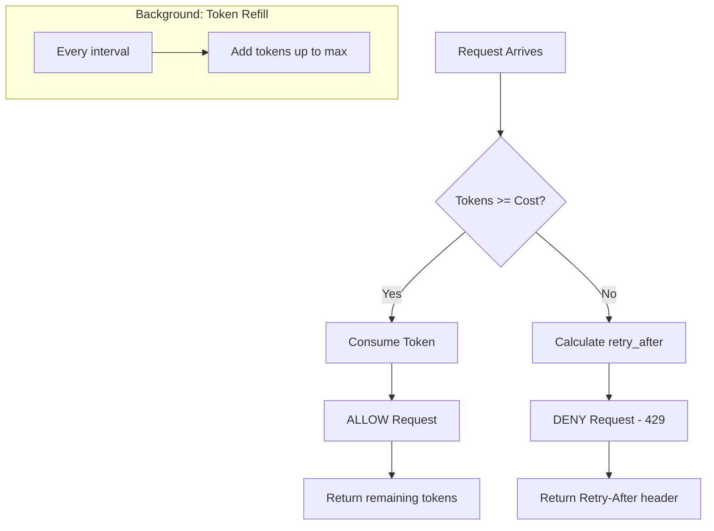

# Rate Limit Usage Guide

Quick reference guide for developers working with rate limiting in Dashtam.

**Target Audience**: Developers implementing rate-limited endpoints

**Related Documentation**:

- Architecture: `docs/architecture/rate-limit.md` (why/what)

---

## Quick Reference

| Endpoint | Limit | Scope | Burst |
|----------|-------|-------|-------|
| `POST /sessions` (login) | 5/min | IP | 5 |
| `POST /users` (register) | 3/min | IP | 3 |
| `POST /password-resets` | 3/min | IP | 3 |
| `GET /accounts` | 100/min | User | 100 |
| `GET /transactions` | 100/min | User | 100 |
| `POST /providers/{id}/sync` | 10/min | User+Provider | 10 |

---

## 1. How Token Bucket Works

### Algorithm Overview



**Configuration Example**:

- `max_tokens: 20` (bucket capacity / burst limit)
- `refill_rate: 5.0` (tokens added per minute)
- `cost: 1` (tokens consumed per request)

### Key Properties

- **Burst capacity**: Allows initial burst up to `max_tokens`
- **Smooth refill**: Tokens added gradually (`refill_rate` per minute)
- **Fair**: Each request costs 1 token (configurable)
- **Atomic**: Redis Lua script ensures no race conditions

---

## 2. Checking Rate Limits in Code

### Using Rate Limit Dependency

```python
from fastapi import APIRouter, Depends
from src.application.dependencies.rate_limit import check_rate_limit
from src.domain.protocols import RateLimitProtocol

router = APIRouter()

@router.post("/sessions")
async def login(
    data: LoginRequest,
    request: Request,
    rate_limit: RateLimitProtocol = Depends(get_rate_limit),
) -> LoginResponse:
    """Login with rate limiting."""
    # Check rate limit
    result = await rate_limit.is_allowed(
        endpoint="POST /api/v1/sessions",
        identifier=request.client.host,  # IP-scoped
    )
    
    if isinstance(result, Success) and not result.value.allowed:
        raise HTTPException(
            status_code=429,
            detail="Too many login attempts",
            headers={"Retry-After": str(int(result.value.retry_after))},
        )
    
    # Continue with login logic...
```

### Using Middleware (Automatic)

Rate limiting is applied automatically via middleware for configured endpoints:

```python
# src/presentation/routers/api/middleware/rate_limit_middleware.py
class RateLimitMiddleware:
    async def __call__(self, request: Request, call_next):
        endpoint = f"{request.method} {request.url.path}"
        
        # Get identifier based on scope
        identifier = self._get_identifier(request, endpoint)
        
        # Check rate limit
        result = await self._rate_limit.is_allowed(
            endpoint=endpoint,
            identifier=identifier,
        )
        
        if isinstance(result, Success) and not result.value.allowed:
            return JSONResponse(
                status_code=429,
                content={"detail": "Rate limit exceeded"},
                headers={
                    "Retry-After": str(int(result.value.retry_after)),
                    "X-RateLimit-Limit": str(result.value.limit),
                    "X-RateLimit-Remaining": str(result.value.remaining),
                    "X-RateLimit-Reset": str(result.value.reset_seconds),
                },
            )
        
        # Add rate limit headers to successful responses
        response = await call_next(request)
        if isinstance(result, Success):
            response.headers["X-RateLimit-Limit"] = str(result.value.limit)
            response.headers["X-RateLimit-Remaining"] = str(result.value.remaining)
            response.headers["X-RateLimit-Reset"] = str(result.value.reset_seconds)
        
        return response
```

---

## 3. Configuring Rate Limit Rules (Two-Tier Pattern)

Rate limits use a **two-tier configuration pattern** (similar to CSS classes):

### Tier 1: Policy Assignment (registry.py)

Assign a rate limit policy to each endpoint in the Route Metadata Registry:

```python
# src/presentation/routers/api/v1/routes/registry.py
RouteMetadata(
    method=HTTPMethod.POST,
    path="/sessions",
    handler=create_session,
    rate_limit_policy=RateLimitPolicy.AUTH_LOGIN,  # Policy assignment
    ...
)
```

### Tier 2: Policy Implementation (derivations.py)

Define what each policy means:

```python
# src/presentation/routers/api/v1/routes/derivations.py
mapping = {
    RateLimitPolicy.AUTH_LOGIN: RateLimitRule(
        max_tokens=5,
        refill_rate=5.0,  # 5 per minute
        scope=RateLimitScope.IP,
        cost=1,
        enabled=True,
    ),
    RateLimitPolicy.AUTH_REGISTER: RateLimitRule(
        max_tokens=3,
        refill_rate=3.0,
        scope=RateLimitScope.IP,
        cost=1,
        enabled=True,
    ),
    RateLimitPolicy.API_READ: RateLimitRule(
        max_tokens=100,
        refill_rate=100.0,
        scope=RateLimitScope.USER,
        cost=1,
        enabled=True,
    ),
    RateLimitPolicy.PROVIDER_SYNC: RateLimitRule(
        max_tokens=10,
        refill_rate=5.0,
        scope=RateLimitScope.USER_PROVIDER,
        cost=1,
        enabled=True,
    ),
}
```

### To Modify Rate Limits

**Scenario 1**: Change rate limit for ONE specific endpoint

```python
# In registry.py: Change policy assignment
RouteMetadata(
    path="/sessions",
    rate_limit_policy=RateLimitPolicy.API_READ,  # More generous
)
```

**Scenario 2**: Change rate limit for ALL endpoints using a policy

```python
# In derivations.py: Update policy implementation
RateLimitPolicy.AUTH_LOGIN: RateLimitRule(
    max_tokens=10,  # Increase from 5 to 10
    ...
)
```

### Scope Types

| Scope | Key Format | Use Case |
|-------|------------|----------|
| `IP` | `rate_limit:ip:{address}:{endpoint}` | Unauthenticated (login) |
| `USER` | `rate_limit:user:{user_id}:{endpoint}` | Authenticated API |
| `USER_PROVIDER` | `rate_limit:user_provider:{user_id}:{provider}:{endpoint}` | Provider ops |
| `GLOBAL` | `rate_limit:global:{endpoint}` | System-wide limits |

### Variable Cost

```python
# Expensive operations cost more tokens
"POST /api/v1/reports/generate": RateLimitRule(
    max_tokens=10,
    refill_rate=10.0,
    scope=RateLimitScope.USER,
    cost=5,  # Costs 5 tokens (expensive operation)
    enabled=True,
),
```

---

## 4. Response Headers

### On Allowed Requests

```http
HTTP/1.1 200 OK
X-RateLimit-Limit: 100
X-RateLimit-Remaining: 87
X-RateLimit-Reset: 60
```

### On Rate Limited Requests

```http
HTTP/1.1 429 Too Many Requests
Retry-After: 12
X-RateLimit-Limit: 5
X-RateLimit-Remaining: 0
X-RateLimit-Reset: 12
Content-Type: application/json

{
    "type": "https://api.dashtam.local/errors/rate-limit-exceeded",
    "title": "Rate Limit Exceeded",
    "status": 429,
    "detail": "Too many requests. Please try again in 12 seconds.",
    "instance": "/api/v1/sessions",
    "retry_after": 12
}
```

### Header Definitions

| Header | Description |
|--------|-------------|
| `Retry-After` | Seconds until retry allowed (RFC 6585) |
| `X-RateLimit-Limit` | Maximum tokens (bucket capacity) |
| `X-RateLimit-Remaining` | Tokens remaining |
| `X-RateLimit-Reset` | Seconds until bucket refills |

---

## 5. Fail-Open Design

### Principle

**Rate limit failures MUST NEVER cause denial-of-service.**

### Implementation

```python
# Layer 1: Middleware
try:
    result = await rate_limit.is_allowed(...)
except Exception:
    logger.error("Rate limit failed - allowing request")
    return await call_next(request)  # ALLOW

# Layer 2: TokenBucketAdapter
try:
    result = await storage.check_and_consume(...)
except Exception:
    logger.error("Storage failed - allowing request")
    return Success(RateLimitResult(allowed=True, ...))  # ALLOW

# Layer 3: RedisStorage
try:
    result = await redis.evalsha(lua_script, ...)
except RedisError:
    logger.error("Redis failed - allowing request")
    return (True, 0.0, max_tokens)  # ALLOW
```

### Monitoring Fail-Opens

```python
# Alert if fail_open events > 10/minute
logger.error(
    "Rate limit fail-open",
    extra={
        "endpoint": endpoint,
        "identifier": identifier,
        "error": str(e),
        "layer": "storage",
        "result": "fail_open",
    },
)
```

---

## 6. Domain Events

### Events Emitted

```python
# Before rate limit check
RateLimitCheckAttempted
{
    "endpoint": "POST /api/v1/sessions",
    "identifier": "192.168.1.1",
    "scope": "ip",
    "cost": 1,
}

# On allowed request
RateLimitCheckAllowed
{
    "endpoint": "POST /api/v1/sessions",
    "identifier": "192.168.1.1",
    "scope": "ip",
    "remaining_tokens": 4,
    "execution_time_ms": 2.5,
}

# On denied request
RateLimitCheckDenied
{
    "endpoint": "POST /api/v1/sessions",
    "identifier": "192.168.1.1",
    "scope": "ip",
    "retry_after": 12.5,
    "execution_time_ms": 2.3,
}
```

---

## 7. Redis Lua Script

### Atomic Token Bucket

```lua
-- token_bucket.lua
-- KEYS[1]: Redis key for bucket
-- ARGV[1]: max_tokens
-- ARGV[2]: refill_rate (tokens per minute)
-- ARGV[3]: cost
-- ARGV[4]: current_timestamp
-- Returns: [allowed (0/1), retry_after, remaining_tokens]

local tokens_key = KEYS[1] .. ":tokens"
local time_key = KEYS[1] .. ":time"

local max_tokens = tonumber(ARGV[1])
local refill_rate = tonumber(ARGV[2])
local cost = tonumber(ARGV[3])
local now = tonumber(ARGV[4])

-- Get current state
local current_tokens = tonumber(redis.call("GET", tokens_key))
local last_refill = tonumber(redis.call("GET", time_key))

-- Initialize if first request
if not current_tokens then
    current_tokens = max_tokens
    last_refill = now
end

-- Calculate refilled tokens
local elapsed = now - last_refill
local tokens_to_add = elapsed * (refill_rate / 60.0)
current_tokens = math.min(current_tokens + tokens_to_add, max_tokens)

-- TTL for cleanup
local ttl = math.ceil((max_tokens / refill_rate) * 60) + 60

if current_tokens >= cost then
    -- Allowed: consume tokens
    local new_tokens = current_tokens - cost
    redis.call("SETEX", tokens_key, ttl, new_tokens)
    redis.call("SETEX", time_key, ttl, now)
    return {1, 0, math.floor(new_tokens)}
else
    -- Denied: calculate retry_after
    local tokens_needed = cost - current_tokens
    local retry_after = tokens_needed / (refill_rate / 60.0)
    redis.call("SETEX", tokens_key, ttl, current_tokens)
    redis.call("SETEX", time_key, ttl, now)
    return {0, retry_after, math.floor(current_tokens)}
end
```

---

## 8. Testing Rate Limits

### Unit Testing Rules

```python
def test_rate_limit_rule_validation():
    rule = RateLimitRule(
        max_tokens=5,
        refill_rate=5.0,
        scope=RateLimitScope.IP,
        cost=1,
        enabled=True,
    )
    
    assert rule.max_tokens == 5
    assert rule.refill_rate == 5.0
    assert rule.ttl_seconds == 120  # Calculated from capacity/rate
```

### Integration Testing with Redis

```python
async def test_rate_limit_allows_within_limit(redis_storage):
    """Test requests allowed when under limit."""
    rule = RateLimitRule(max_tokens=5, refill_rate=5.0, ...)
    
    for _ in range(5):
        result = await redis_storage.check_and_consume(
            key_base="test:ip:127.0.0.1",
            rule=rule,
            cost=1,
        )
        assert result.value[0] == True  # allowed

async def test_rate_limit_denies_over_limit(redis_storage):
    """Test 6th request denied after 5."""
    # ... consume 5 tokens ...
    
    result = await redis_storage.check_and_consume(...)
    assert result.value[0] == False  # denied
    assert result.value[1] > 0  # retry_after
```

### API Testing

```python
def test_login_rate_limit(client: TestClient):
    """Test login endpoint rate limiting."""
    # First 5 requests succeed
    for _ in range(5):
        response = client.post("/api/v1/sessions", json={
            "email": "test@example.com",
            "password": "wrong_password",
        })
        assert response.status_code in [401, 201]
    
    # 6th request rate limited
    response = client.post("/api/v1/sessions", json={
        "email": "test@example.com",
        "password": "wrong_password",
    })
    assert response.status_code == 429
    assert "Retry-After" in response.headers
```

---

## 9. Common Patterns

### Pattern 1: IP-Scoped for Unauthenticated

```python
# Login, registration, password reset
"POST /api/v1/sessions": RateLimitRule(
    max_tokens=5,
    refill_rate=5.0,
    scope=RateLimitScope.IP,  # IP address
    cost=1,
    enabled=True,
),
```

### Pattern 2: User-Scoped for Authenticated

```python
# API endpoints requiring auth
"GET /api/v1/accounts": RateLimitRule(
    max_tokens=100,
    refill_rate=100.0,
    scope=RateLimitScope.USER,  # User ID from JWT
    cost=1,
    enabled=True,
),
```

### Pattern 3: Expensive Operations

```python
# Report generation costs 5 tokens
"POST /api/v1/reports": RateLimitRule(
    max_tokens=10,
    refill_rate=10.0,
    scope=RateLimitScope.USER,
    cost=5,  # Higher cost
    enabled=True,
),
```

### Pattern 4: Disable Rate Limit (Testing)

```python
# Disable for specific endpoint
"GET /api/v1/health": RateLimitRule(
    max_tokens=1000,
    refill_rate=1000.0,
    scope=RateLimitScope.GLOBAL,
    cost=1,
    enabled=False,  # Disabled
),
```

### Pattern 5: Admin Reset Rate Limit

```python
@router.post("/admin/rate-limits/reset")
async def reset_rate_limit(
    data: ResetRateLimitRequest,
    current_user: User = Depends(get_current_user),
    _: None = Depends(require_role(UserRole.ADMIN)),
    rate_limit: RateLimitProtocol = Depends(get_rate_limit),
) -> None:
    """Admin: Reset rate limit for user/IP."""
    await rate_limit.reset(
        endpoint=data.endpoint,
        identifier=data.identifier,
    )
```

---

## 10. Adding New Rate Limit Rules

With the registry-based pattern, adding rate limits is automatic:

### Step 1: Add Route to Registry

```python
# src/presentation/routers/api/v1/routes/registry.py
RouteMetadata(
    method=HTTPMethod.POST,
    path="/new-endpoint",
    handler=new_endpoint_handler,
    rate_limit_policy=RateLimitPolicy.API_WRITE,  # Assign existing policy
    ...
)
```

### Step 2: (Optional) Create New Policy

If existing policies don't fit:

```python
# 1. Add enum value in metadata.py
class RateLimitPolicy(str, Enum):
    CUSTOM_NEW = "custom_new"

# 2. Add implementation in derivations.py
RateLimitPolicy.CUSTOM_NEW: RateLimitRule(
    max_tokens=20,
    refill_rate=20.0,
    scope=RateLimitScope.USER,
    cost=1,
    enabled=True,
),
```

### Step 3: Test Rule

```python
# tests/integration/test_rate_limit_new_endpoint.py
async def test_new_endpoint_rate_limit():
    # Test within limit
    # Test at limit
    # Test over limit
    # Test refill behavior
```

### Step 4: Document

Update API documentation with rate limit information.

---

## Troubleshooting

### 429 Too Many Requests unexpectedly

1. Check endpoint matches rule key exactly (method + path)
2. Check scope - IP vs User vs User+Provider
3. Check if rate limits were reset recently
4. Check Redis connectivity

### Rate limit not applied

1. Check endpoint is in `RATE_LIMIT_RULES`
2. Check `enabled=True` in rule
3. Check middleware is registered
4. Check identifier extraction is correct

### Retry-After shows wrong value

1. Check `refill_rate` configuration
2. Check server clock synchronization
3. Check Lua script timestamp handling

### Rate limit headers missing

1. Check middleware is adding headers
2. Check response isn't being replaced
3. Check headers not stripped by proxy

---

**Created**: 2025-12-05 | **Last Updated**: 2026-01-10
