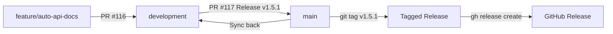

# Release Management Guide

Comprehensive guide to versioning, branching, tagging, releases, and CHANGELOG management for Dashtam.

---

## Git Flow Overview

### Branch Structure

Dashtam uses **Git Flow** with two primary branches and supporting feature branches.

**Primary Branches:**

- `main` - Production-ready code (protected, no direct commits)
- `development` - Integration branch (protected, no direct commits)

**Supporting Branches:**

- `feature/*` - New features (from development)
- `fix/*` - Bug fixes (from development)
- `hotfix/*` - Emergency production fixes (from main)

**Branch Protection:**

Both `main` and `development` are protected:

- ✅ All CI checks must pass
- ✅ At least 1 approval required
- ✅ Conversations must be resolved
- ❌ No direct commits
- ❌ No force pushes

### Workflow Visualization



---

## Semantic Versioning

Dashtam follows **Semantic Versioning 2.0.0**: `MAJOR.MINOR.PATCH`

### Version Format

`MAJOR.MINOR.PATCH` (e.g., `v1.5.1`)

### When to Bump Each Component

#### MAJOR (Breaking Changes)

Increment when you make **incompatible API changes**.

**Examples:**

- Remove public endpoints (e.g., `DELETE /api/v1/users`)
- Change request/response schemas incompatibly
- Remove or rename public functions/classes
- Change database schema requiring migration AND data loss

**Current**: v1.x.x (no breaking changes yet)

#### MINOR (New Features)

Increment when you add **new functionality** in a backward-compatible manner.

**Examples:**

- New REST API endpoints
- New command/query handlers
- New provider integrations
- New domain events
- New features that don't break existing code

**Recent Examples:**

- v1.5.0: Event Registry Pattern
- v1.4.0: Chase File Import Provider
- v1.3.0: Holdings and Balance Tracking

#### PATCH (Bug Fixes & Internal Changes)

Increment when you make **backward-compatible bug fixes** or internal improvements.

**Examples:**

- Bug fixes
- Documentation updates
- Code refactoring (no behavior change)
- Dependency updates
- Performance improvements (no API changes)
- Test improvements

**Example:**

- v1.5.1: Auto-generated API docs (internal tooling, no user-facing changes)

### Decision Tree

```text
Does it break existing API/functionality?
├─ YES → MAJOR (v2.0.0)
└─ NO
   └─ Does it add new features/endpoints?
      ├─ YES → MINOR (v1.6.0)
      └─ NO → PATCH (v1.5.1)
```

---

## Feature Development Workflow

### Step-by-Step Process

#### 1. Create Feature Branch

```bash
git checkout development
git pull origin development
git checkout -b feature/auto-api-docs
```

**Branch Naming:**

- `feature/` - New features
- `fix/` - Bug fixes
- Use kebab-case: `feature/rate-limiting`, `fix/auth-token-expiry`

#### 2. Implement Feature

- Follow WARP.md development guidelines
- Write tests (85%+ coverage)
- Update documentation if needed
- Commit frequently with conventional commit messages

**Conventional Commits:**

```bash
git commit -m "feat(docs): add auto-generated API reference"
git commit -m "fix(auth): handle token expiration correctly"
git commit -m "docs(api): update endpoint documentation"
```

#### 3. Push and Create PR

```bash
git push origin feature/auto-api-docs
```

Create PR targeting `development` branch:

- Title: `feat(docs): Auto-generated API reference with mkdocstrings`
- Description: Summary, changes, testing, impact
- Wait for CI checks and review
- Merge after approval

#### 4. DO NOT Update Version Yet

**Important**: Version bumps happen ONLY during release process, not in feature branches.

❌ **Wrong**: Bump version in feature branch
✅ **Correct**: Version bump in release PR (development → main)

---

## Release Process

### When to Release

Release when:

- One or more features/fixes are ready for production
- All tests passing on `development` branch
- Documentation updated
- CHANGELOG ready

### Release Steps

#### Step 1: Determine Version Bump

Use the decision tree above to determine if this is MAJOR, MINOR, or PATCH.

**Example**: Auto-generated API docs = PATCH (v1.5.0 → v1.5.1)

#### Step 2: Create Release Branch (Optional)

For complex releases with multiple PRs:

```bash
git checkout development
git pull origin development
git checkout -b release/v1.5.1
```

For simple releases, work directly on development.

#### Step 3: Update Version

Edit `pyproject.toml`:

```toml
[project]
name = "dashtam"
version = "1.5.1"  # Update this line
```

#### Step 4: Update Lockfile

```bash
# Inside Docker container
docker compose -f compose/docker-compose.dev.yml exec app uv lock
```

#### Step 5: Update CHANGELOG

Add release notes to `CHANGELOG.md`:

```markdown
## [1.5.1] - 2025-12-28

### Added

- Auto-generated API reference documentation from Google-style docstrings
- mkdocs-gen-files plugin for automatic module discovery
- Comprehensive documentation of griffe warnings in .griffe.yml

### Fixed

- Added missing __init__.py files in 8 directories (package structure)

### Documentation

- Created releases.md guide
- Updated Makefile with docs command documentation
```

Update version comparison links at bottom:

```markdown
[1.5.1]: https://github.com/faiyaz7283/Dashtam/compare/v1.5.0...v1.5.1
```

#### Step 6: Commit Changes

```bash
git add pyproject.toml uv.lock CHANGELOG.md
git commit -m "chore(release): bump version to 1.5.1

- Update version in pyproject.toml
- Update uv.lock
- Add v1.5.1 release notes to CHANGELOG.md

Co-Authored-By: Warp <agent@warp.dev>"
```

#### Step 7: Create Release PR

```bash
git push origin development  # or release/v1.5.1 if using release branch
```

Create PR: `development` → `main`

- Title: `Release v1.5.1 - Auto-Generated API Docs`
- Description: Copy CHANGELOG entry
- Wait for CI and approval
- Merge to `main`

#### Step 8: Create Git Tag

After merge to main:

```bash
git checkout main
git pull origin main

git tag -a v1.5.1 -m "Release v1.5.1 - Auto-Generated API Docs

- Auto-generated API reference documentation
- mkdocs-gen-files plugin integration
- Comprehensive griffe warnings documentation

Co-Authored-By: Warp <agent@warp.dev>"

git push origin v1.5.1
```

#### Step 9: Create GitHub Release

```bash
gh release create v1.5.1 \
  --title "v1.5.1 - Auto-Generated API Docs" \
  --notes "## Auto-Generated API Documentation

### Summary
Implements automatic API documentation generation from Google-style docstrings.

### Changes
- Auto-generated API reference from docstrings
- mkdocs-gen-files plugin integration
- Comprehensive griffe warnings documentation
- Added missing __init__.py files (package structure)

### Documentation
- Created releases.md guide
- Updated docs command documentation

Co-Authored-By: Warp <agent@warp.dev>"
```

#### Step 10: Sync Main Back to Development

**CRITICAL**: Immediately sync after release to prevent drift.

```bash
git checkout development
git pull origin development
git merge origin/main --no-edit
git push origin development
```

**Why This Matters**: Prevents version drift conflicts in future releases.

---

## Tagging Strategy

### Tag Format

`vMAJOR.MINOR.PATCH` (e.g., `v1.5.1`)

**Always prefix with `v`** - This is Dashtam convention.

### When to Tag

**Tag ONLY on `main` branch AFTER release merge.**

❌ **Wrong**: Tag on development or feature branches
✅ **Correct**: Tag on main after release PR merged

### Tag Types

**Annotated Tags (Required):**

```bash
git tag -a v1.5.1 -m "Release message"
```

Annotated tags include:

- Tag name
- Tagger info
- Date
- Message
- Co-author attribution

**NOT Lightweight Tags:**

```bash
git tag v1.5.1  # DON'T DO THIS
```

### Pushing Tags

```bash
git push origin v1.5.1        # Push specific tag
git push origin --tags        # Push all tags (use carefully)
```

---

## GitHub Releases

### Relationship: Tags vs Releases

**Git Tag**: Version marker in Git history
**GitHub Release**: Rich UI with release notes, assets, downloads

**Every tag should have a corresponding GitHub Release.**

### Creating Releases

#### Option 1: GitHub CLI (Recommended)

```bash
gh release create v1.5.1 \
  --title "v1.5.1 - Auto-Generated API Docs" \
  --notes "$(cat release-notes.md)"
```

#### Option 2: GitHub Web UI

1. Navigate to Releases → Draft a new release
2. Choose existing tag: `v1.5.1`
3. Add title and description
4. Publish release

### Release Notes Format

Use CHANGELOG entry as base, expand with:

- **Summary**: High-level overview
- **Changes**: Bullet points from CHANGELOG
- **Breaking Changes**: If any
- **Upgrade Notes**: If needed
- **Contributors**: Co-author attribution

---

## CHANGELOG Management

### When to Update CHANGELOG

Update `CHANGELOG.md` during **release process**, not in feature PRs.

❌ **Wrong**: Update CHANGELOG in feature branch
✅ **Correct**: Update CHANGELOG in release PR

### Format (Keep a Changelog)

Follow [Keep a Changelog](https://keepachangelog.com/) format:

```markdown
## [1.5.1] - 2025-12-28

### Added
- New features

### Changed
- Changes in existing functionality

### Deprecated
- Soon-to-be removed features

### Removed
- Removed features

### Fixed
- Bug fixes

### Security
- Security fixes
```

### Version Comparison Links

At bottom of CHANGELOG:

```markdown
[Unreleased]: https://github.com/faiyaz7283/Dashtam/compare/v1.5.1...HEAD
[1.5.1]: https://github.com/faiyaz7283/Dashtam/compare/v1.5.0...v1.5.1
[1.5.0]: https://github.com/faiyaz7283/Dashtam/compare/v1.4.0...v1.5.0
```

---

## Sync Strategy

### Why Sync is Critical

After merging release PR to `main`, the two branches diverge:

- `main` has release commit + merge commit
- `development` doesn't have `main`'s merge commit

If `development` continues without syncing, the next release will have merge conflicts.

### Sync Command

**After EVERY release to main:**

```bash
git checkout development
git pull origin development
git merge origin/main --no-edit
git push origin development
```

### What Gets Synced

- Version number in `pyproject.toml`
- Updated `uv.lock`
- CHANGELOG updates
- Any hotfixes applied to `main`

---

## Quick Reference

### Complete Release Checklist

```bash
# 1. Determine version (MAJOR.MINOR.PATCH)
# Example: v1.5.1 (PATCH - internal tooling)

# 2. Update version
# Edit pyproject.toml: version = "1.5.1"

# 3. Update lockfile (in Docker)
docker compose -f compose/docker-compose.dev.yml exec app uv lock

# 4. Update CHANGELOG.md
# Add release notes and version comparison link

# 5. Commit
git add pyproject.toml uv.lock CHANGELOG.md
git commit -m "chore(release): bump version to 1.5.1"
git push origin development

# 6. Create release PR (development → main)
# Title: "Release v1.5.1 - Auto-Generated API Docs"
# Wait for approval and merge

# 7. Tag release (after merge to main)
git checkout main
git pull origin main
git tag -a v1.5.1 -m "Release v1.5.1 - Auto-Generated API Docs"
git push origin v1.5.1

# 8. Create GitHub release
gh release create v1.5.1 --title "v1.5.1 - Auto-Generated API Docs" --notes "..."

# 9. Sync main → development (CRITICAL!)
git checkout development
git pull origin development
git merge origin/main --no-edit
git push origin development
```

### Version Bump Commands

```bash
# Current version
grep "^version" pyproject.toml

# Bump version (manual edit)
# Edit pyproject.toml: version = "1.5.1"

# Update lockfile
docker compose -f compose/docker-compose.dev.yml exec app uv lock
```

### Tag Commands

```bash
# List tags
git tag -l

# Create annotated tag
git tag -a v1.5.1 -m "Release message"

# Push tag
git push origin v1.5.1

# Delete local tag (if mistake)
git tag -d v1.5.1

# Delete remote tag (if mistake)
git push origin :refs/tags/v1.5.1
```

---

## Troubleshooting

### Version Drift Conflicts

**Problem**: Next release PR has conflicts in `pyproject.toml`, `uv.lock`, `CHANGELOG.md`

**Cause**: Forgot to sync `main` back to `development` after previous release

**Solution**:

```bash
git checkout development
git pull origin development
git merge origin/main --no-edit
git push origin development
```

### Forgot to Tag Release

**Problem**: Merged release PR but forgot to create tag

**Solution**:

```bash
# Find the merge commit on main
git checkout main
git pull origin main
git log --oneline -10  # Find release commit hash

# Tag that commit
git tag -a v1.5.1 <commit-hash> -m "Release v1.5.1"
git push origin v1.5.1
```

### Wrong Version Number

**Problem**: Released as v1.6.0 but should have been v1.5.1

**Solution**:

```bash
# Delete wrong tag
git tag -d v1.6.0
git push origin :refs/tags/v1.6.0

# Delete GitHub release (via web UI or gh CLI)
gh release delete v1.6.0

# Create new release PR with correct version
```

### Multiple Features in One Release

**Problem**: Want to release features from multiple PRs together

**Solution**:

```bash
# All feature PRs merge to development first
# Then create single release PR with all changes

# In CHANGELOG, group by category:
## [1.6.0] - 2025-12-28

### Added
- Feature A from PR #120
- Feature B from PR #121
- Feature C from PR #122
```

---

## Examples from Dashtam History

### Example 1: PATCH Release (v1.5.1)

**Changes**: Auto-generated API docs (internal tooling)

**Why PATCH**: No new user-facing features, no breaking changes

```bash
# Version bump: v1.5.0 → v1.5.1
# CHANGELOG: Added auto-generated API docs
# Tag: v1.5.1
# Release: "v1.5.1 - Auto-Generated API Docs"
```

### Example 2: MINOR Release (v1.5.0)

**Changes**: Event Registry Pattern, strict mode, 12 new events

**Why MINOR**: New feature (Event Registry), backward compatible

```bash
# Version bump: v1.4.0 → v1.5.0
# CHANGELOG: Event Registry Pattern implementation
# Tag: v1.5.0
# Release: "v1.5.0 - Event Registry Pattern"
```

### Example 3: MINOR Release (v1.4.0)

**Changes**: Chase File Import Provider

**Why MINOR**: New provider integration (new feature)

```bash
# Version bump: v1.3.0 → v1.4.0
# CHANGELOG: Chase File Import Provider
# Tag: v1.4.0
# Release: "v1.4.0 - Chase File Import Provider"
```

---

**Created**: 2025-12-28 | **Last Updated**: 2025-12-28
