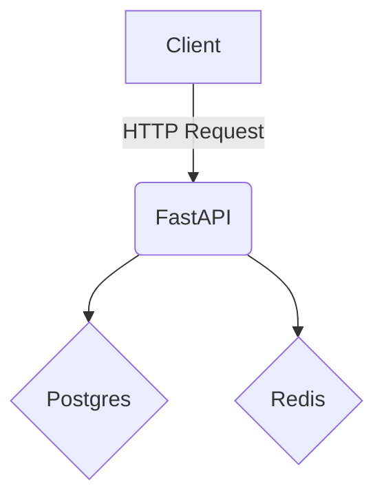

# 🧭 Comprehensive Guide: Modern Best Practices for Project Documentation

For FastAPI, Python, Postgres, Redis, Docker, GitHub Actions projects

----

## 1. 📚 Core Philosophy — “Docs as Code”

Modern documentation follows the Docs-as-Code principle:

- 📂 Store documentation alongside source code (e.g., /docs directory).
- ✍️ Write in Markdown or reStructuredText.
- 🔄 Version with Git — reviewed via Pull Requests.
- ⚙️ Automate building and publishing via CI/CD (e.g., GitHub Actions).
- 🧩 Keep documentation in sync with code, including auto-generation from docstrings.

### Benefits

Consistent versioning, peer-reviewed documentation, full automation, and transparency between code and docs.

## 2. 🎯 Documentation Types and Audiences

| Audience | Purpose | Content Type | Example Topics |
|----------|---------|--------------|----------------|
| **End Users / Clients** | Learn how to use your product | Guides, Tutorials, Walkthroughs | Getting Started, Authentication, Using the Dashboard |
| **API Consumers** | Understand the API endpoints | API Reference, Examples, Data Models | REST Endpoints, Request/Response Schemas |
| **Developers (Internal)** | Maintain or extend the codebase | Docstrings, Architecture Docs | Internal APIs, System Architecture, CI/CD Setup |

✅ You already cover developer-facing docs via FastAPI’s auto-generated OpenAPI (/docs, /redoc).

Focus your new documentation on user-facing and API-consumer content — with clear guides, examples, and architecture overviews.

## 3. ⚙️ Tooling Landscape — Comparison & Recommendations

| Tool | Language / Format | Ideal For | Pros | Cons |
|------|-------------------|-----------|------|------|
| **🧩 MkDocs + Material Theme** | Markdown | Hybrid user/API docs | Lightweight, beautiful UI, easy GitHub Pages deploy, strong plugin ecosystem | Limited PDF export |
| **📘 Sphinx + ReadTheDocs** | reST / Markdown | Deep Python code/API reference | Rich cross-references, multiple output formats | More complex setup |
| **🌐 Docusaurus** | Markdown + React | Large-scale docs with versioning | Modern UI, multilingual, versioning out of box | Node.js dependency, heavier setup |
| **🏗️ GitHub Pages** | Any static HTML | Simple hosting | Free, built-in with GitHub | Limited search/versioning |
| **📚 ReadTheDocs** | Sphinx / MkDocs | Hosted automation + versioning | Auto-builds on push, multi-version, search | Less theme flexibility |

**Best Choice for Your Stack:**
✅ MkDocs + Material Theme with plugins for automation and diagrams, deployed via GitHub Pages or ReadTheDocs for public hosting.

## 4. 🧠 Recommended Hybrid Documentation Setup

### 🎯 Goals

- Auto-generate reference docs from Google-style docstrings.
- Integrate Markdown-based guides from your /docs/ folder.
- Support visuals and diagrams (architecture, workflows, etc.).
- Automate build and deploy via GitHub Actions.

### 🏗️ Suggested Stack

| Component | Tool / Plugin | Purpose |
|-----------|---------------|----------|
| **Site Generator** | MkDocs | Converts Markdown → static site |
| **Theme** | Material for MkDocs | Professional theme, dark mode, search |
| **Auto API Docs** | mkdocstrings | Generates reference docs from Python docstrings |
| **Navigation** | awesome-pages-plugin | Auto-index pages from folder structure |
| **Diagrams** | mkdocs-mermaid2-plugin | Render flowcharts and diagrams |
| **Deployment** | GitHub Actions + mkdocs gh-deploy | CI/CD for publishing to GitHub Pages |

### ⚙️ Example mkdocs.yml

```yaml
site_name: MyProject Documentation
repo_url: https://github.com/faiyaz/myproject
theme:
  name: material
  features:
    - navigation.instant
    - search.suggest
    - content.code.copy
plugins:
  - search
  - mkdocstrings:
      handlers:
        python:
          options:
            docstring_style: google
  - awesome-pages
  - mermaid2
nav:
  - Introduction: index.md
  - Getting Started: docs/getting_started.md
  - Architecture: docs/architecture.md
  - API Reference:
      - Endpoints: reference/api.md
      - Models: reference/models.md
```

### 🚀 Example GitHub Actions Workflow (.github/workflows/docs.yml)

```yaml
name: Deploy Docs
on:
push:
    branches: [ main ]

jobs:
build-deploy:
    runs-on: ubuntu-latest
    steps:
    - uses: actions/checkout@v4
    - name: Setup Python
        uses: actions/setup-python@v5
        with:
        python-version: "3.11"
    - name: Install dependencies
        run: pip install mkdocs-material mkdocstrings mkdocs-awesome-pages-plugin mkdocs-mermaid2-plugin
    - name: Deploy to GitHub Pages
        run: mkdocs gh-deploy --force
```

## 🎨 Visuals and Diagrams

- Mermaid.js → Embed directly in Markdown:



- PlantUML / Kroki → For UML, ERD, or sequence diagrams.
- These integrate seamlessly with MkDocs or Sphinx plugins.

## 🧩 Documentation Structure Example

project-root/
├── docs/
│   ├── index.md
│   ├── getting_started.md
│   ├── architecture.md
│   ├── api_flows.md
│   ├── research/
│   │   ├── caching_strategy.md
│   │   └── database_schema.md
│   └── reference/
│       ├── api.md
│       └── models.md
└── mkdocs.yml

**This gives you:**

- High-level user guides under /docs/
- Automatically generated API references under /reference/
- Optional technical notes under /research/

## 🔄 CI/CD Automation Best Practices

- ✅ Auto-build on push to main using GitHub Actions.
- 🧪 Lint docs with markdownlint or Vale to maintain writing consistency.
- 👀 Preview builds on Pull Requests using Netlify/Vercel (optional).
- 🔢 Version your docs (if your API has versions) using MkDocs Material’s built-in versioning or ReadTheDocs.

## ✍️ Writing Style & Content Quality

**Follow Google Developer Style Guide principles:**

- Keep it clear and concise.
- Prefer examples and visuals over long explanations.
- Use active voice (“You can deploy using…”).
- Include code samples and API request/response snippets.
- Structure each guide consistently:
- Overview
- Prerequisites
- Steps
- Example
- Troubleshooting / Tips

## 🧩 Future Enhancements

- Integrate OpenAPI spec export into docs build (openapi.json → rendered page).
- Add search analytics (e.g., Plausible, Fathom).
- Support multi-version docs as your API evolves.
- Add project branding: logo, favicon, custom color scheme.

## ✅ TL;DR – Recommended Setup

| Area | Best Practice | Tools |
|------|---------------|-------|
| **Documentation format** | Markdown (with Google-style docstrings) | MkDocs + Material |
| **API reference** | Auto-generate from Python docstrings | mkdocstrings |
| **Diagrams** | Integrated in Markdown | Mermaid2 / PlantUML |
| **Hosting** | Static, free, and CI/CD-friendly | GitHub Pages |
| **Deployment** | Automated | GitHub Actions |
| **Optional features** | Versioning, analytics, search | ReadTheDocs / Netlify |
| **Style guide** | Google Developer Docs Style | developers.google.com/style |

## 🏁 Final Recommendation

MkDocs Material offers the best balance of:

- simplicity,
- automation,
- extensibility,
- and professional design.

Combined with mkdocstrings and GitHub Actions, this gives you a fully automated, hybrid documentation ecosystem — scalable across all your future projects.
