# Mermaid Diagram Guidelines

**CRITICAL RULE**: All diagrams in Dashtam documentation MUST use Mermaid syntax. This ensures consistency, version control compatibility, and seamless MkDocs integration.

---

## Table of Contents

- [Why Mermaid?](#why-mermaid)
- [Required Diagram Types](#required-diagram-types)
- [Best Practices](#best-practices)
- [Common Patterns](#common-patterns)
- [Syntax Reference](#syntax-reference)
- [Troubleshooting](#troubleshooting)
- [Quick Reference](#quick-reference)

---

## Why Mermaid?

**Advantages:**

- ✅ **Text-based** - Works with Git, easy to review in PRs
- ✅ **Version controlled** - Track changes over time
- ✅ **MkDocs compatible** - Renders automatically with mkdocs-mermaid2-plugin
- ✅ **No external tools** - No need for separate diagram applications
- ✅ **Consistent style** - Unified look across all documentation
- ✅ **Easy to update** - Edit text, not images

**Prohibited:**

- ❌ **Image files** (PNG, JPG, SVG uploads) - Not version-control friendly
- ❌ **External diagram tools** (draw.io, Lucidchart exports) - Creates maintenance burden
- ❌ **ASCII art** - Limited and hard to maintain

---

## Required Diagram Types

### 1. Directory Tree Structures → Use Mindmap

**When to use:**

- Showing project directory structure
- Displaying file organization
- Illustrating component hierarchy

**Syntax:**

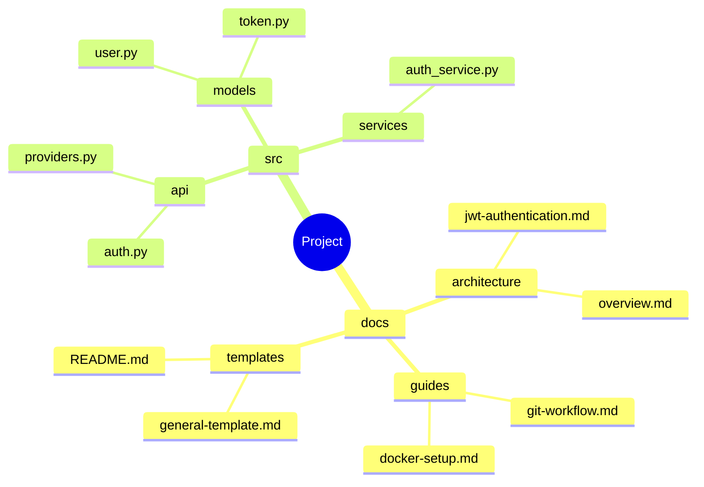

**Example Output:**

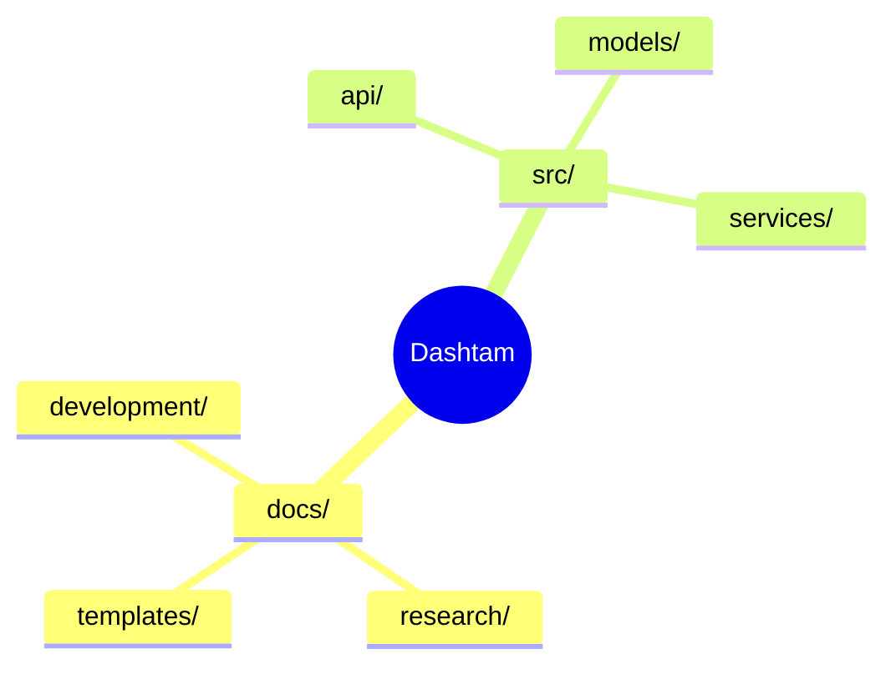

### 2. Directional Flows → Use Flowchart

**When to use:**

- Process flows
- Data flow diagrams
- Decision trees
- State machines

**Syntax:**

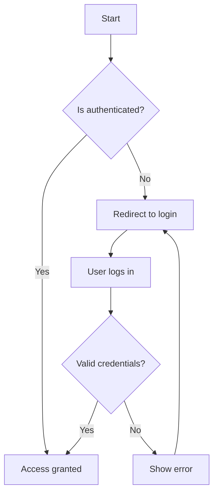

**Shapes Available:**

- `A[Rectangle]` - Process step
- `B{Diamond}` - Decision point
- `C([Rounded])` - Start/End
- `D[(Database)]` - Database
- `E((Circle))` - Connection point

**Directions:**

- `TD` or `TB` - Top to bottom (recommended for most flows)
- `LR` - Left to right (good for wide diagrams)
- `RL` - Right to left
- `BT` - Bottom to top

### 3. Relationships & Tables → Use ER Diagram

**When to use:**

- Database schema
- Entity relationships
- Data models
- Table structures

**Syntax:**

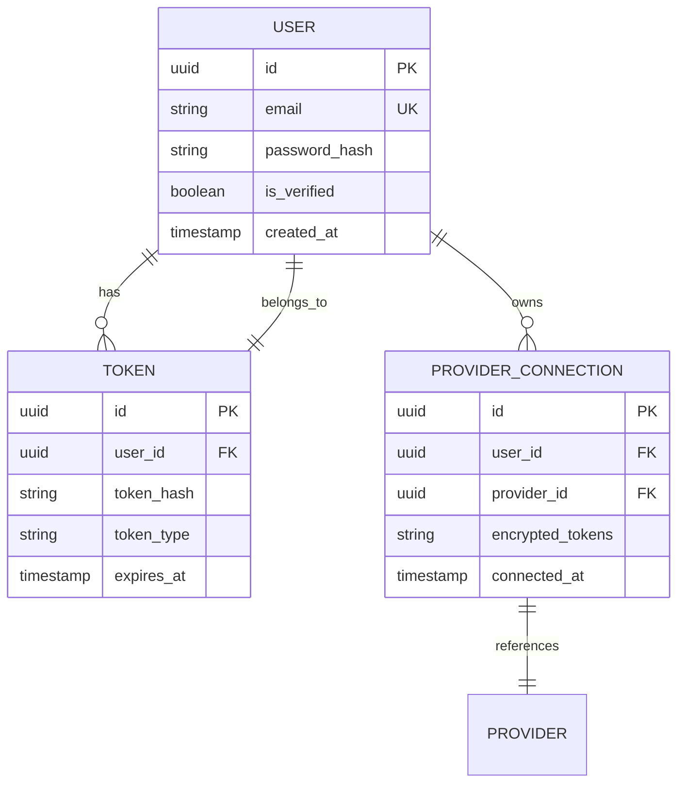

**Relationship Types:**

- `||--||` - One to one
- `||--o{` - One to many
- `}o--o{` - Many to many
- `||--o|` - One to zero or one

### 4. Sequence Diagrams → Use Sequence

**When to use:**

- API request/response flows
- Authentication sequences
- Service interactions
- Time-based processes

**Syntax:**

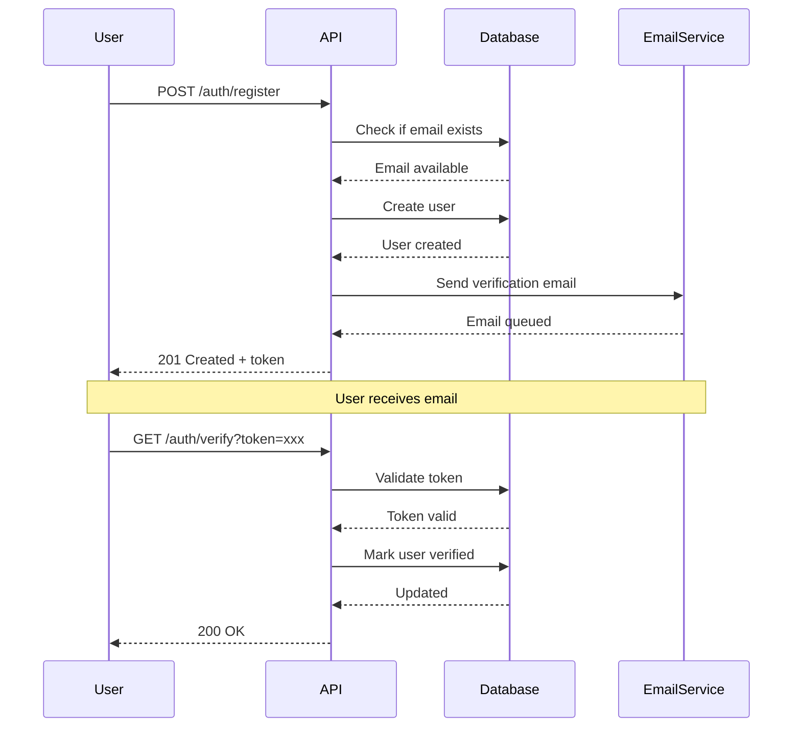

### 5. State Diagrams → Use State Diagram

**When to use:**

- Object lifecycle
- Status transitions
- Workflow states

**Syntax:**

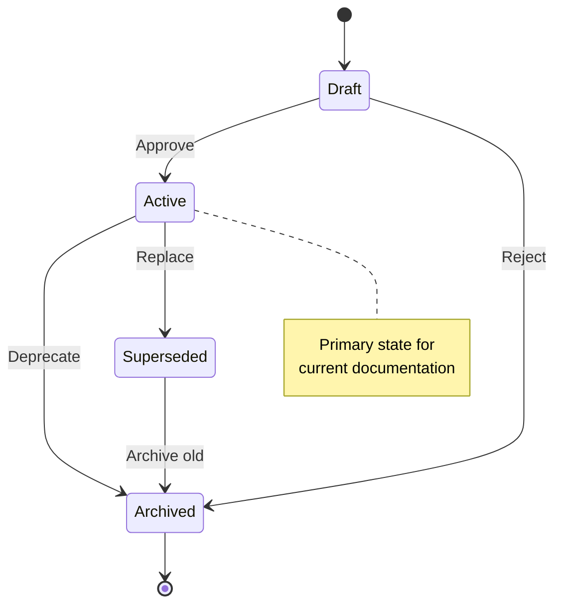

### 6. Gantt Charts → Use Gantt

**When to use:**

- Project timelines
- Implementation phases
- Sprint planning (avoid rigid day-based schedules per WARP.md)

**Syntax:**

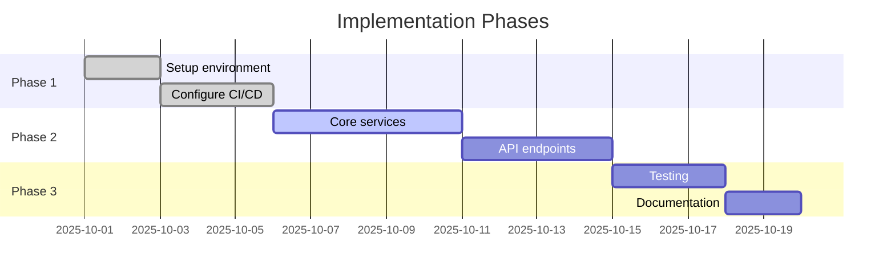

### 7. Class Diagrams → Use Class Diagram

**When to use:**

- OOP structure
- Class relationships
- Service architecture

**Syntax:**

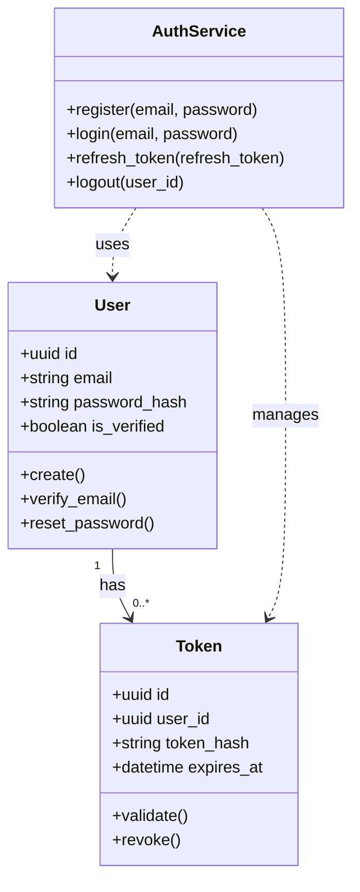

---

## Best Practices

### General Guidelines

1. **Always specify diagram type** - Start with diagram type declaration
2. **Use descriptive labels** - Clear, concise text
3. **Keep it simple** - Don't overcomplicate diagrams
4. **Consistent naming** - Use same naming convention across diagrams
5. **Add notes** - Explain complex parts

### Styling Guidelines

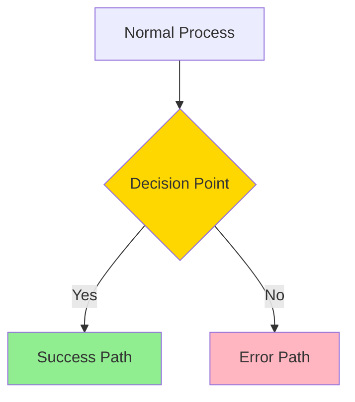

**Color Coding:**

- Green (`#90EE90`) - Success paths
- Red/Pink (`#FFB6C1`) - Error paths
- Yellow (`#FFD700`) - Decision points
- Blue (`#87CEEB`) - External services

### Responsive Design

- **Keep width reasonable** - Aim for diagrams that fit in 800-1200px width
- **Use vertical layouts** - Top-to-bottom flows work better on mobile
- **Break complex diagrams** - Split into multiple smaller diagrams

---

## Common Patterns

### Pattern 1: Authentication Flow

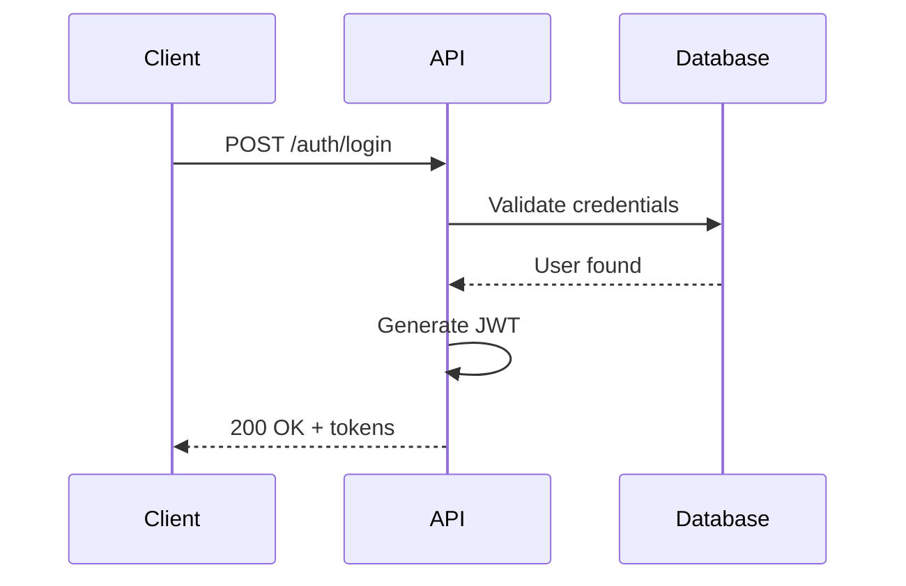

### Pattern 2: Directory Structure

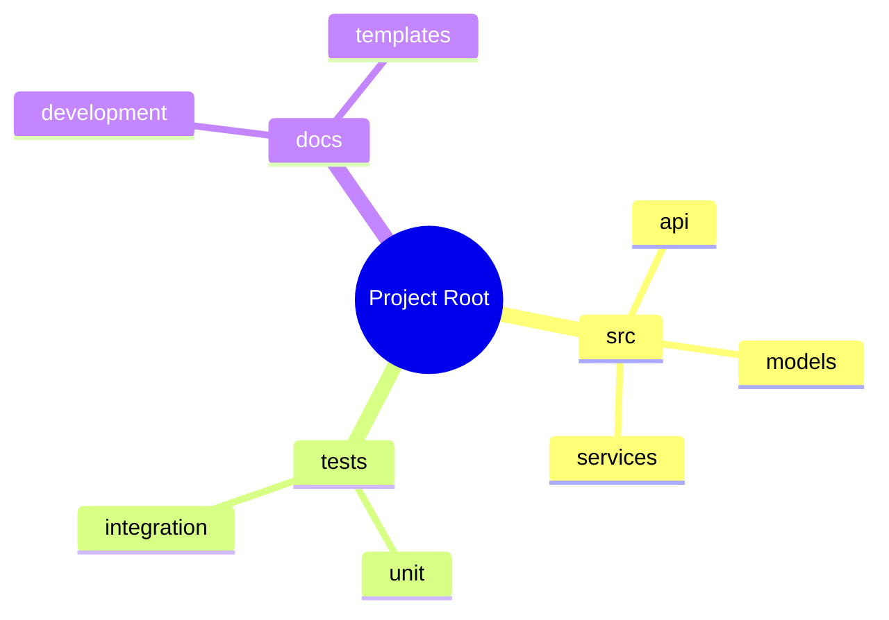

### Pattern 3: Decision Flow

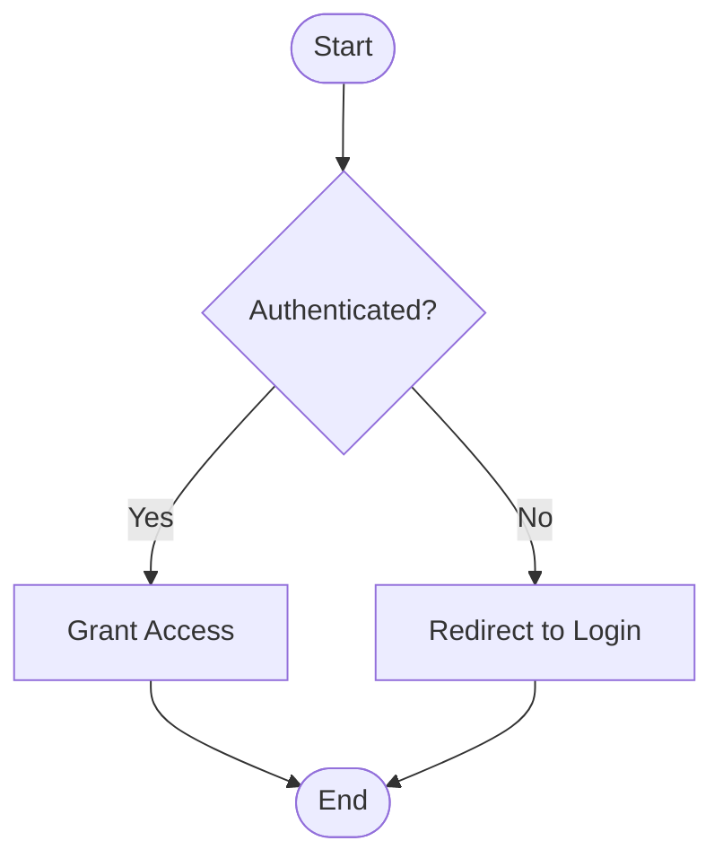

---

## Syntax Reference

### Node Shapes

| Shape | Syntax | Use Case |
|-------|--------|----------|
| Rectangle | `A[Text]` | Standard process |
| Rounded | `A(Text)` | Start/End points |
| Circle | `A((Text))` | Connection points |
| Diamond | `A{Text}` | Decision points |
| Hexagon | `A{{Text}}` | Preparation steps |
| Parallelogram | `A[/Text/]` | Input/Output |
| Cylinder | `A[(Text)]` | Database |

### Arrow Types

| Arrow | Syntax | Meaning |
|-------|--------|---------|
| Solid | `-->` | Flow direction |
| Dashed | `-.->` | Async/Optional |
| Thick | `==>` | Primary path |
| Dotted | `..>` | Dependency |

### Relationship Cardinality (ER Diagrams)

| Symbol | Meaning |
|--------|---------|
| `\|\|` | Exactly one |
| `o\|` | Zero or one |
| `}\|` | One or more |
| `}o` | Zero or more |

---

## Troubleshooting

### Issue 1: Diagram Not Rendering

**Cause:** Syntax error in Mermaid code

**Solution:**

- Validate syntax at [Mermaid Live Editor](https://mermaid.live/)
- Check for missing quotes, brackets, or semicolons
- Ensure proper diagram type declaration

### Issue 2: Diagram Too Wide

**Cause:** Too many nodes or long labels

**Solution:**

- Use vertical layout (`TD` instead of `LR`)
- Abbreviate long labels
- Split into multiple diagrams

### Issue 3: Special Characters Breaking Diagram

**Cause:** Unescaped special characters

**Solution:**

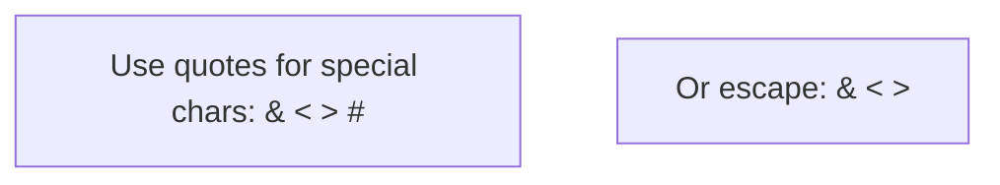

---

## MkDocs Integration

When MkDocs Material is implemented, Mermaid diagrams will:

1. **Auto-render** - No manual processing needed
2. **Dark mode support** - Diagrams adapt to theme
3. **Zoom capability** - Click to enlarge
4. **Export options** - Download as SVG/PNG

**Configuration (future):**

```yaml
# mkdocs.yml
plugins:
  - mermaid2:
      version: "10.6.0"
```

---

## Examples from Dashtam

### Example 1: OAuth Flow (from architecture docs)

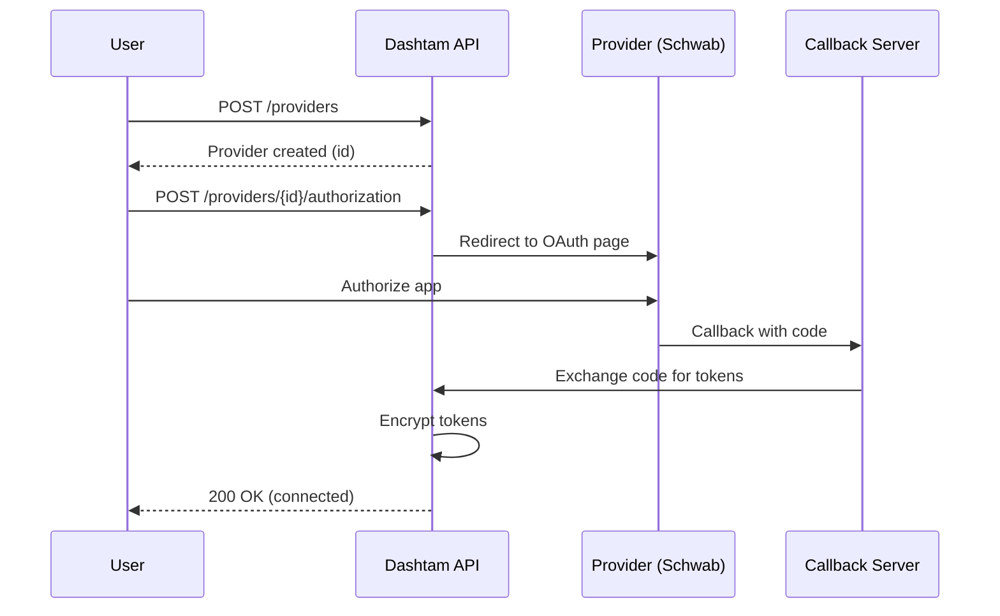

### Example 2: Database Schema

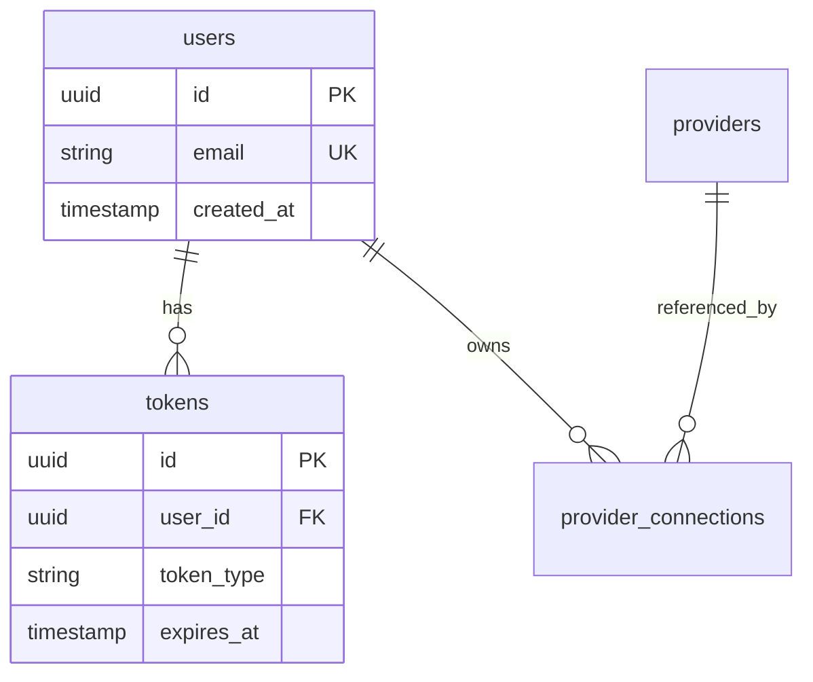

---

## Quick Reference

**Most Common Diagrams:**

1. **Flowchart** - `flowchart TD`
2. **Sequence** - `sequenceDiagram`
3. **ER Diagram** - `erDiagram`
4. **Mindmap** - `mindmap`

**Validation Tool:** [Mermaid Live Editor](https://mermaid.live/)

**Full Documentation:** [Mermaid Official Docs](https://mermaid.js.org/)

---

## Document Information

**Status:** Active
**Category:** Documentation Standards
**Created:** 2025-10-13
**Last Updated:** 2025-10-13
**Applies To:** All Dashtam documentation with diagrams
**Required:** Yes - All diagrams MUST use Mermaid syntax
